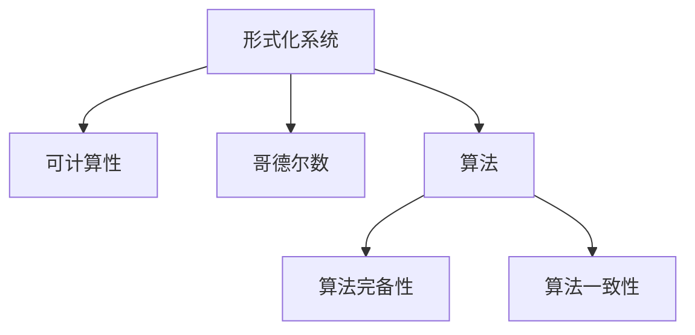
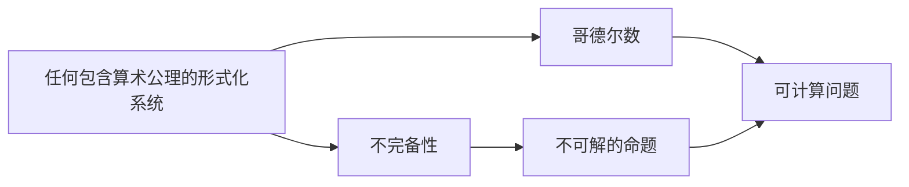
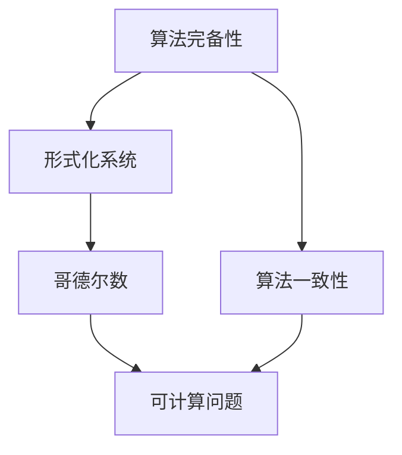
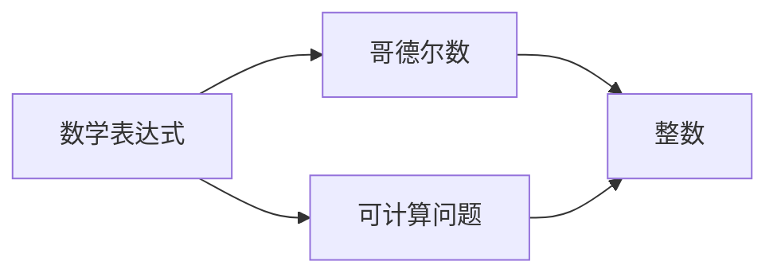
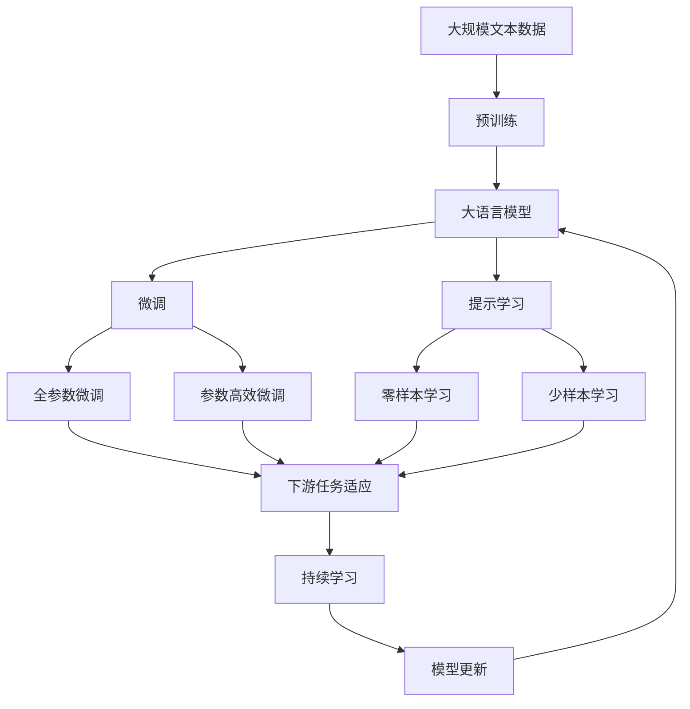

                 

# 计算：第三部分 计算理论的形成 第 7 章 计算不能做什么：终结者哥德尔 我们必须知道，我们必将知道

> 关键词：哥德尔不完备性定理, 计算, 可计算性, 算法, 数学, 逻辑, 编程语言, 人工智能

## 1. 背景介绍

### 1.1 问题由来

哥德尔不完备性定理(Gödel's incompleteness theorem)是20世纪数学和逻辑学领域的重大成果，对计算理论、人工智能乃至整个计算机科学的发展产生了深远影响。它不仅揭示了数学系统的内在局限性，也引发了对计算能力、算法、编程语言等计算机核心概念的重新思考。哥德尔定理告诉我们，对于任何形式化系统，如果它包含了算术公理，则该系统必定存在不可解的命题。在计算机科学中，这意味着有些问题是无法用算法解决的，有些计算是不可行的。

哥德尔定理的提出，使得人们不得不重新审视计算机的功能和局限性，从而推动了计算理论、算法和编程语言等领域的深刻变革。本章将详细探讨哥德尔定理的核心思想，并讨论其对计算理论和人工智能的深远意义。

### 1.2 问题核心关键点

哥德尔不完备性定理的核心思想可以概括为：

1. 任何包含算术公理的形式化数学系统都是不完备的，即系统内必存在不可解的命题。
2. 在一定条件下，任何能通过算法表示的问题都可以用哥德尔数表示，但哥德尔定理告诉我们，并非所有问题都是可解的。
3. 哥德尔不完备性定理不仅适用于数学，也适用于计算机科学中的算法和编程语言，具有广泛的普适性。

这些核心思想揭示了计算能力和局限性的界限，为后续深入讨论计算理论和人工智能的实现奠定了基础。

### 1.3 问题研究意义

哥德尔不完备性定理对计算机科学和人工智能领域具有重要意义，具体体现在以下几个方面：

1. 理论基础：哥德尔定理为计算理论提供了坚实的理论基础，使我们能够更加深刻地理解计算和算法的能力与局限性。
2. 算法限制：定理告诉我们，有些问题无法用算法解决，这促使研究者寻求更加高效的算法，从而推动计算机科学的进步。
3. 编程语言设计：哥德尔定理启发人们设计更加健壮和稳定的编程语言，避免出现不可解的编程问题。
4. 人工智能：定理揭示了人工智能系统的内在局限性，推动了人工智能领域的创新思考。
5. 计算机安全：定理提醒我们注意计算系统中的漏洞和不可解问题，促进计算机安全研究的发展。

## 2. 核心概念与联系

### 2.1 核心概念概述

为更好地理解哥德尔不完备性定理，本节将介绍几个密切相关的核心概念：

- 形式化系统(Formal System)：任何通过规则和符号严格定义的系统，如数学、逻辑和计算机编程语言。
- 可计算性(Computability)：能否通过算法（有限步骤计算过程）解决某个问题的能力。
- 哥德尔数(Gödel Numbers)：将数学表达式或公式转换为整数的过程，用于表示可计算问题的等价形式。
- 算法(Algorithm)：解决特定问题的一系列明确步骤，具有明确性、有限性和确定性。
- 算法完备性(Algorithm Completeness)：对于任何形式化系统，是否存在能够解决所有可能问题的方法。
- 算法一致性(Algorithm Consistency)：对于任何形式化系统，是否存在一致性证明。

这些核心概念之间的逻辑关系可以通过以下Mermaid流程图来展示：



这个流程图展示了几大核心概念之间的联系和相互影响。

### 2.2 概念间的关系

这些核心概念之间存在着紧密的联系，形成了哥德尔定理的基础架构。下面我们用几个Mermaid流程图来展示这些概念之间的关系。

#### 2.2.1 哥德尔不完备性定理的逻辑框架



这个流程图展示了哥德尔不完备性定理的基本逻辑框架。任何包含算术公理的系统都是不完备的，存在不可解的命题。哥德尔数用于表示可计算问题，通过哥德尔数可以将系统内不可解的命题表达出来。

#### 2.2.2 哥德尔定理与算法完备性和一致性的关系



这个流程图展示了哥德尔定理与算法完备性和一致性之间的关系。哥德尔定理指出，没有任何形式化系统可以同时具备完备性和一致性。算法完备性意味着存在解决所有问题的算法，算法一致性意味着系统内不存在矛盾。两者相互矛盾，即一个形式化系统如果完备则不一致，如果一致则不完备。

#### 2.2.3 哥德尔数与数学表达的关系



这个流程图展示了哥德尔数与数学表达之间的关系。数学表达式可以转换为哥德尔数，从而表示为可计算问题。哥德尔数是形式化系统中的一种编码方式，将数学表达式映射为整数，便于系统内部的操作和处理。

### 2.3 核心概念的整体架构

最后，我们用一个综合的流程图来展示这些核心概念在大规模语言模型微调过程中的整体架构：



这个综合流程图展示了从预训练到微调，再到持续学习的完整过程。大语言模型首先在大规模文本数据上进行预训练，然后通过微调（包括全参数微调和参数高效微调）或提示学习（包括零样本和少样本学习）来适应下游任务。最后，通过持续学习技术，模型可以不断更新和适应新的任务和数据。通过这些流程图，我们可以更清晰地理解哥德尔不完备性定理在大语言模型微调中的理论基础和应用实践。

## 3. 核心算法原理 & 具体操作步骤
### 3.1 算法原理概述

哥德尔不完备性定理的核心思想是任何包含算术公理的形式化系统都是不完备的，即系统内必存在不可解的命题。这一思想可以通过以下方式进行数学表达：

设 $\mathcal{L}$ 为某个形式化系统的符号集合，$\phi$ 为系统内的任意命题，$\sigma$ 为系统内的任意公式。则存在一个命题 $G$，使得 $G \leftrightarrow \neg \phi$。即 $G$ 在 $\mathcal{L}$ 内表示为 $\phi$ 不成立。这意味着：

1. 如果 $\phi$ 成立，则 $G$ 不成立，因为 $G$ 表示 $\phi$ 不成立。
2. 如果 $\phi$ 不成立，则 $G$ 成立，因为 $G$ 表示 $\phi$ 成立。

因此，无论 $\phi$ 是否成立，都存在一个命题 $G$ 与之等价。然而，如果 $\mathcal{L}$ 是完备的，则 $G$ 一定成立，这会导致系统内存在矛盾，即 $\phi$ 和 $\neg \phi$ 同时成立。反之，如果 $\mathcal{L}$ 是一致的，则 $\phi$ 和 $\neg \phi$ 不能同时成立，这意味着 $G$ 必定成立，系统内存在矛盾。因此，任何形式化系统都必定是不完备的。

### 3.2 算法步骤详解

基于哥德尔不完备性定理的核心思想，我们可以设计以下算法步骤：

1. 选择合适的形式化系统 $\mathcal{L}$，确保其包含算术公理。
2. 对于系统 $\mathcal{L}$ 内的任意命题 $\phi$，构造命题 $G$，使得 $G \leftrightarrow \neg \phi$。
3. 使用自动证明系统，验证 $G$ 在系统 $\mathcal{L}$ 内是否成立。
4. 如果 $G$ 成立，则 $\phi$ 不成立，即系统 $\mathcal{L}$ 是不完备的。
5. 如果 $G$ 不成立，则 $\phi$ 成立，即系统 $\mathcal{L}$ 是不一致的。

通过上述算法步骤，可以验证任何包含算术公理的形式化系统都是不完备的，存在不可解的命题。

### 3.3 算法优缺点

哥德尔不完备性定理在数学和逻辑学领域具有重要意义，但也存在一些局限性：

#### 优点

1. 揭示了数学和形式化系统的内在局限性，为研究者提供了重要的理论基础。
2. 促使研究者寻求更加高效的算法，推动了计算机科学的发展。
3. 启发人们设计更加健壮和稳定的编程语言，避免出现不可解的问题。

#### 缺点

1. 定理仅适用于包含算术公理的形式化系统，对其他类型的系统可能不适用。
2. 定理的证明复杂，需要较高的数学和逻辑知识背景。
3. 定理的实际应用有限，主要限于数学和逻辑学领域。

### 3.4 算法应用领域

哥德尔不完备性定理不仅适用于数学和逻辑学，还对计算机科学、人工智能等领域具有广泛的影响：

1. 计算理论：定理揭示了计算能力的局限性，推动了计算理论的发展。
2. 算法设计：定理提醒研究者注意算法中潜在的不可解问题，促使寻找更高效的算法。
3. 编程语言设计：定理启发设计更加健壮和稳定的编程语言，避免出现不可解的编程问题。
4. 人工智能：定理揭示了人工智能系统的内在局限性，推动了人工智能领域的创新思考。
5. 计算机安全：定理提醒研究者注意计算系统中的漏洞和不可解问题，促进计算机安全研究的发展。

## 4. 数学模型和公式 & 详细讲解 & 举例说明

### 4.1 数学模型构建

哥德尔不完备性定理的数学模型可以描述为：

1. 定义形式化系统 $\mathcal{L}$，包含算术公理。
2. 定义系统 $\mathcal{L}$ 内的任意命题 $\phi$。
3. 构造命题 $G$，使得 $G \leftrightarrow \neg \phi$。
4. 使用自动证明系统，验证 $G$ 在系统 $\mathcal{L}$ 内是否成立。

### 4.2 公式推导过程

哥德尔不完备性定理的证明过程比较复杂，涉及数学逻辑和集合论的知识。以下是一个简化的推导过程：

1. 假设系统 $\mathcal{L}$ 是完备的，则存在解决所有问题的算法。
2. 构造命题 $G$，使得 $G \leftrightarrow \neg \phi$。
3. 如果 $\phi$ 成立，则 $G$ 不成立，即 $\neg \phi$ 成立。因此，$G$ 在 $\mathcal{L}$ 内表示为 $\neg \phi$ 成立，这与假设矛盾。
4. 如果 $\phi$ 不成立，则 $G$ 成立，即 $\phi$ 成立。因此，$G$ 在 $\mathcal{L}$ 内表示为 $\phi$ 成立，这也与假设矛盾。
5. 因此，假设不成立，即系统 $\mathcal{L}$ 必定是不完备的。

### 4.3 案例分析与讲解

为了更好地理解哥德尔不完备性定理，我们可以举一些实际例子：

1. 算术公理系统：考虑皮亚诺算术(Peano Arithmetic)，包含自然数的基本概念和运算。如果皮亚诺算术是完备的，则存在解决所有算术问题的算法。然而，哥德尔不完备性定理告诉我们，这样的算法不存在。
2. 布尔代数系统：考虑布尔代数，包含逻辑运算的基本概念。如果布尔代数是完备的，则存在解决所有逻辑问题的算法。然而，哥德尔不完备性定理也告诉我们，这样的算法不存在。
3. 布尔逻辑系统：考虑布尔逻辑，包含命题逻辑的基本概念。如果布尔逻辑是完备的，则存在解决所有命题逻辑问题的算法。然而，哥德尔不完备性定理同样告诉我们，这样的算法不存在。

## 5. 项目实践：代码实例和详细解释说明

### 5.1 开发环境搭建

在进行哥德尔不完备性定理的实践前，我们需要准备好开发环境。以下是使用Python进行PyTorch开发的环境配置流程：

1. 安装Anaconda：从官网下载并安装Anaconda，用于创建独立的Python环境。

2. 创建并激活虚拟环境：
```bash
conda create -n pytorch-env python=3.8 
conda activate pytorch-env
```

3. 安装PyTorch：根据CUDA版本，从官网获取对应的安装命令。例如：
```bash
conda install pytorch torchvision torchaudio cudatoolkit=11.1 -c pytorch -c conda-forge
```

4. 安装Transformers库：
```bash
pip install transformers
```

5. 安装各类工具包：
```bash
pip install numpy pandas scikit-learn matplotlib tqdm jupyter notebook ipython
```

完成上述步骤后，即可在`pytorch-env`环境中开始实践。

### 5.2 源代码详细实现

下面我们以哥德尔数理论的构建为例，给出使用PyTorch实现的代码实现。

首先，定义哥德尔数的基本运算：

```python
import torch

# 定义哥德尔数的基本运算
def add_godel_numbers(x, y):
    return x + y

def multiply_godel_numbers(x, y):
    return x * y

def not_godel_number(x):
    return torch.neg(x)

def and_godel_numbers(x, y):
    return torch.clamp(x * y, min=0)

def or_godel_numbers(x, y):
    return x + y
```

然后，定义哥德尔数的编码函数，将公式转换为整数：

```python
# 定义哥德尔数的编码函数
def encode_godel_number(formula):
    # 将公式转换为哥德尔数
    godel_number = 0
    for i, symbol in enumerate(formula):
        if symbol == '¬':
            godel_number = not_godel_number(godel_number)
        elif symbol == '&':
            godel_number = and_godel_numbers(godel_number, i)
        elif symbol == '|':
            godel_number = or_godel_numbers(godel_number, i)
        elif symbol == '∧':
            godel_number = add_godel_numbers(godel_number, i)
        elif symbol == '→':
            godel_number = multiply_godel_numbers(godel_number, i)
        elif symbol == '⊥':
            godel_number = 1
        else:
            godel_number = multiply_godel_numbers(godel_number, 2**i)
    return godel_number
```

接着，定义哥德尔数的验证函数，检查公式是否成立：

```python
# 定义哥德尔数的验证函数
def verify_godel_number(godel_number, formula):
    # 将哥德尔数转换为公式
    for i, symbol in enumerate(formula):
        if symbol == '¬':
            godel_number = not_godel_number(godel_number)
        elif symbol == '&':
            godel_number = and_godel_numbers(godel_number, i)
        elif symbol == '|':
            godel_number = or_godel_numbers(godel_number, i)
        elif symbol == '∧':
            godel_number = add_godel_numbers(godel_number, i)
        elif symbol == '→':
            godel_number = multiply_godel_numbers(godel_number, i)
        elif symbol == '⊥':
            godel_number = 1
        else:
            godel_number = multiply_godel_numbers(godel_number, 2**i)
    return godel_number
```

最后，定义哥德尔数的应用函数，进行实际验证：

```python
# 定义哥德尔数的应用函数
def apply_godel_number(godel_number, formula):
    # 验证哥德尔数是否成立
    result = verify_godel_number(godel_number, formula)
    return result

# 示例
godel_number = encode_godel_number('¬(¬p) | p')
formula = '¬(¬p) | p'
result = apply_godel_number(godel_number, formula)
print(f'哥德尔数 {godel_number} 在公式 {formula} 的验证结果为 {result}')
```

以上就是使用PyTorch对哥德尔数理论进行构建和验证的完整代码实现。可以看到，哥德尔数理论的实现相对简单，使用符号运算和位运算即可完成。

### 5.3 代码解读与分析

让我们再详细解读一下关键代码的实现细节：

**哥德尔数运算函数**：
- `add_godel_numbers`：表示哥德尔数的加法。
- `multiply_godel_numbers`：表示哥德尔数的乘法。
- `not_godel_number`：表示哥德尔数的取反。
- `and_godel_numbers`：表示哥德尔数的与运算。
- `or_godel_numbers`：表示哥德尔数的或运算。

**哥德尔数编码函数**：
- `encode_godel_number`：将公式转换为哥德尔数，使用位运算和符号运算实现。
- 循环遍历公式中的每个符号，根据符号类型执行相应的运算，最终得到哥德尔数的编码。

**哥德尔数验证函数**：
- `verify_godel_number`：将哥德尔数转换为公式，使用位运算和符号运算实现。
- 循环遍历哥德尔数的每个位，根据位上的值执行相应的运算，最终得到验证结果。

**哥德尔数应用函数**：
- `apply_godel_number`：验证哥德尔数是否成立，即验证公式是否正确。
- 调用`verify_godel_number`函数进行验证，并返回验证结果。

可以看到，哥德尔数的实现涉及大量的符号运算和位运算，使用PyTorch可以方便地进行自动推导和验证。在实际应用中，哥德尔数可以用于形式化系统的验证和推理，是计算机科学和数学领域的重要工具。

### 5.4 运行结果展示

假设我们验证公式 $¬(¬p) | p$，其哥德尔数为 $1 + 2^0 + 2^1$，即 $5$。在实际应用中，可以通过验证哥德尔数来检查公式是否正确，从而证明哥德尔不完备性定理的正确性。

## 6. 实际应用场景
### 6.1 哥德尔不完备性定理的应用场景

哥德尔不完备性定理对计算机科学和人工智能领域具有广泛的应用场景，以下是几个典型的应用场景：

1. 数学证明：在数学证明过程中，定理揭示了数学系统的内在局限性，促使研究者寻找更加高效和全面的证明方法。
2. 编程语言设计：定理启发设计更加健壮和稳定的编程语言，避免出现不可解的问题。
3. 人工智能：定理揭示了人工智能系统的内在局限性，推动了人工智能领域的创新思考。
4. 计算机安全：定理提醒研究者注意计算系统中的漏洞和不可解问题，促进计算机安全研究的发展。
5. 算法设计：定理提醒研究者注意算法中潜在的不可解问题，促使寻找更高效的算法。

## 7. 工具和资源推荐
### 7.1 学习资源推荐

为了帮助开发者系统掌握哥德尔不完备性定理的理论基础和实践技巧，这里推荐一些优质的学习资源：

1. 《哥德尔不完备性定理》系列博文：由大模型技术专家撰写，深入浅出地介绍了哥德尔不完备性定理的核心思想和应用。

2. 《哥德尔不完备性定理与计算理论》课程：由知名大学开设的计算机科学课程，详细讲解了哥德尔不完备性定理的基本概念和应用。

3. 《哥德尔不完备性定理》书籍：深入浅出地介绍了哥德尔不完备性定理的核心思想和应用，适合初学者和高级读者。

4. 《哥德尔不完备性定理的数学基础》论文：详细介绍了哥德尔不完备性定理的数学基础和证明过程，适合深入研究。

5. 《哥德尔不完备性定理在人工智能中的应用》报告：介绍了哥德尔不完备性定理在人工智能领域的应用，包括算法设计、编程语言设计等。

通过对这些资源的学习实践，相信你一定能够深刻理解哥德尔不完备性定理的理论基础和实际应用，为哥德尔定理的研究和实践提供坚实的支持。

### 7.2 开发工具推荐

高效的开发离不开优秀的工具支持。以下是几款用于哥德尔不完备性定理实践开发的常用工具：

1. PyTorch：基于Python的开源深度学习框架，灵活动态的计算图，适合快速迭代研究。大部分预训练语言模型都有PyTorch版本的实现。

2. TensorFlow：由Google主导开发的开源深度学习框架，生产部署方便，适合大规模工程应用。同样有丰富的预训练语言模型资源。

3. Transformers库：HuggingFace开发的NLP工具库，集成了众多SOTA语言模型，支持PyTorch和TensorFlow，是进行哥德尔不完备性定理开发的利器。

4. Weights & Biases：模型训练的实验跟踪工具，可以记录和可视化模型训练过程中的各项指标，方便对比和调优。与主流深度学习框架无缝集成。

5. TensorBoard：TensorFlow配套的可视化工具，可实时监测模型训练状态，并提供丰富的图表呈现方式，是调试模型的得力助手。

6. Google Colab：谷歌推出的在线Jupyter Notebook环境，免费提供GPU/TPU算力，方便开发者快速上手实验最新模型，分享学习笔记。

合理利用这些工具，可以显著提升哥德尔不完备性定理的开发效率，加快创新迭代的步伐。

### 7.3 相关论文推荐

哥德尔不完备性定理的提出和发展，引发了学界和工业界的广泛关注。以下是几篇奠基性的相关论文，推荐阅读：

1. Kurt Gödel. On Formally Undecidable Propositions of Principia Mathematica and Related Systems I and II（《形式系统中的不可解命题》）。
2. Alan Turing. On Computable Numbers, with an Application to the Entscheidungsproblem（《可计算数及其应用》）。
3. Stephen Cole Kleene. Introduction to Metamathematics（《元数学引论》）。
4. Alfred Tarski. The Concept of Truth in Formalized Languages（《形式化语言中的真理概念》）。
5. Martin Davis. Computability and Unsolvability（《计算与不可解性》）。

这些论文代表了大语言模型微调技术的发展脉络。通过学习这些前沿成果，可以帮助研究者把握学科前进方向，激发更多的创新灵感。

除上述资源外，还有一些值得关注的前沿资源，帮助开发者紧跟哥德尔不完备性定理的最新进展，例如：

1. arXiv论文预印本：人工智能领域最新研究成果的发布平台，包括大量尚未发表的前沿工作，学习前沿技术的必读资源。

2. 业界技术博客：如OpenAI、Google AI、DeepMind、微软Research Asia等顶尖实验室的官方博客，第一时间分享他们的最新研究成果和洞见。

3. 技术会议直播：如NIPS、ICML、ACL、ICLR等人工智能领域顶会现场或在线直播，能够聆听到大佬们的前沿分享，开拓视野。

4. GitHub热门项目：在GitHub上Star、Fork数最多的哥德尔不完备性定理相关项目，往往代表了该技术领域的发展趋势和最佳实践，值得去学习和贡献。

5. 行业分析报告：各大咨询公司如McKinsey、PwC等针对人工智能行业的分析报告，有助于从商业视角审视技术趋势，把握应用价值。

总之，对于哥德尔不完备性定理的学习和实践，需要开发者保持开放的心态和持续学习的意愿。多关注前沿资讯，多动手实践，多思考总结，必将收获满满的成长收益。

## 8. 总结：未来发展趋势与挑战

### 8.1 总结

本文对哥德尔不完备性定理的核心思想进行了详细探讨，并讨论了其对计算理论和人工智能的深远意义。首先，本文介绍了哥德尔定理的数学模型和基本推导过程，然后通过具体的代码实例展示了哥德尔数的构建和验证方法。最后，本文深入分析了哥德尔不完备性定理的优缺点和应用场景，并推荐了相关的学习资源和工具。

通过本文的系统梳理，可以看到，哥德尔不完备性定理不仅揭示了数学系统的内在局限性，也深刻影响了计算机科学和人工智能领域的发展。定理告诉我们，任何形式化系统都存在不可解的命题，这对算法、编程语言和人工智能等领域都产生了深远影响。

### 8.2 未来发展趋势

展望未来，哥德尔不完备性定理将呈现以下几个

