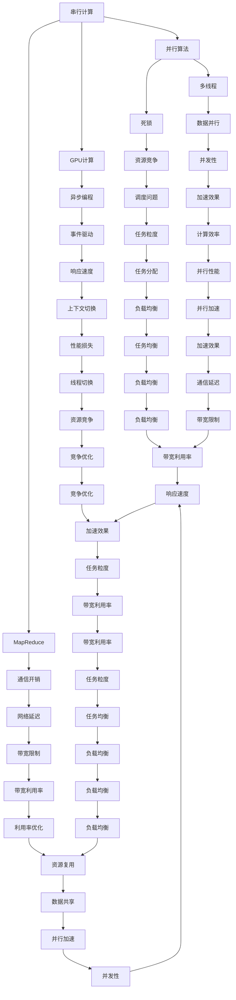
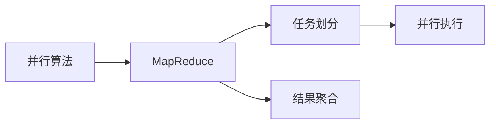
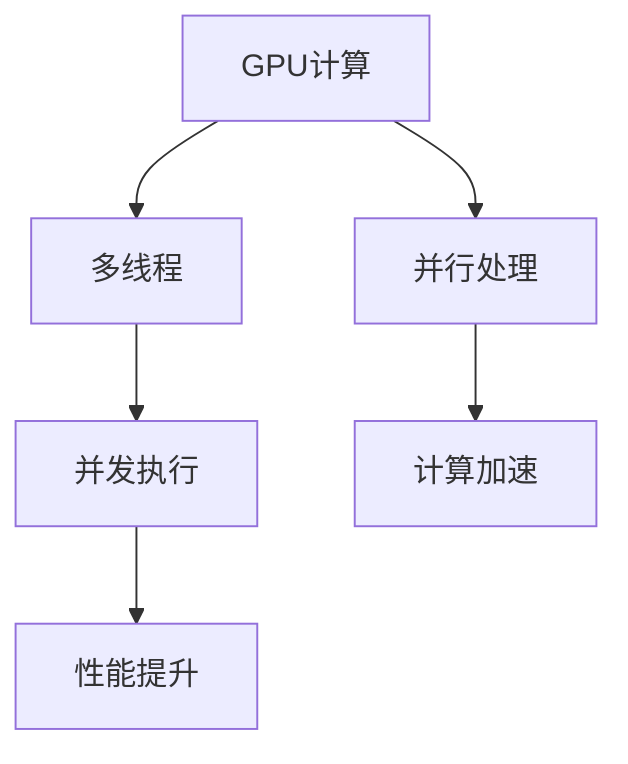
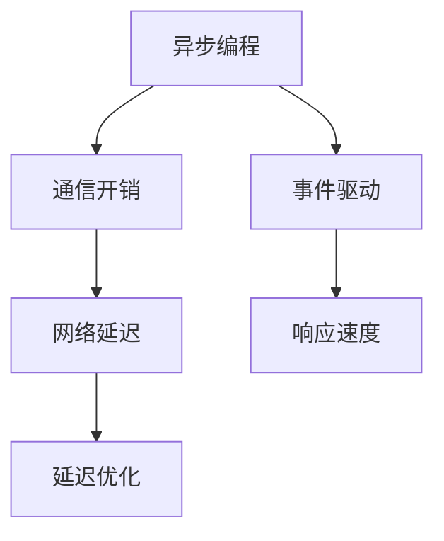

                 

# 计算：第四部分 计算的极限 第 9 章 计算复杂性 并行计算

> 关键词：计算复杂性,并行计算,串行计算,并行算法,分布式计算,MapReduce,GPU,多线程,死锁,通信开销,异步编程

## 1. 背景介绍

在当今的信息时代，计算已经成为了推动社会进步和技术创新的核心驱动力。从个人计算机到超级计算机，从云服务到量子计算，计算的范畴和能力在不断拓展，但其核心问题仍然集中在计算复杂性和并行计算上。计算的极限，即如何在有限的时间和资源下，尽可能地完成更多的计算任务，一直是计算机科学领域的研究重点。

### 1.1 计算复杂性

计算复杂性（Computational Complexity）是计算机科学中的一个基本概念，用于衡量计算问题的难度和复杂度。计算复杂性理论研究的是如何量化计算资源（如时间、空间、能量等）与问题规模之间的关系，以及如何设计高效算法来解决特定类型的问题。

计算复杂性理论主要包括以下几个领域：

- 时间复杂度：衡量算法执行所需的时间与问题规模的关系。
- 空间复杂度：衡量算法所需的空间与问题规模的关系。
- 能量复杂度：衡量算法执行所需的能量与问题规模的关系。
- 并行复杂度：衡量算法在并行计算环境下的性能。

### 1.2 并行计算

并行计算（Parallel Computing）是解决计算复杂性的重要方法之一。并行计算将问题分解成多个子问题，同时在多个计算单元（如CPU、GPU、FPGA等）上并行执行，从而提高计算效率。并行计算主要分为以下两种类型：

- 并行算法（Parallel Algorithm）：在同一个计算单元内，通过多线程、多进程等方式实现并发执行。
- 分布式计算（Distributed Computing）：在多个计算单元之间，通过网络通信的方式实现并行执行。

## 2. 核心概念与联系

### 2.1 核心概念概述

为了更好地理解并行计算的理论和实践，本节将介绍几个密切相关的核心概念：

- 串行计算（Serial Computing）：在一个计算单元内，按顺序执行计算任务，每个任务只有一个执行路径。
- 并行算法（Parallel Algorithm）：将问题分解成多个子问题，同时在多个计算单元上并发执行。
- MapReduce：一种分布式计算框架，通过将任务划分为Map和Reduce两个步骤，实现高效的并行计算。
- GPU计算（GPU Computing）：利用图形处理器（GPU）的高并行计算能力，加速计算密集型任务。
- 多线程（Multi-Threading）：在一个计算单元内，同时执行多个线程，每个线程独立执行计算任务。
- 死锁（Deadlock）：并发执行的多个进程或线程相互等待对方释放资源，导致无法继续执行的情况。
- 通信开销（Communication Overhead）：并行计算中，不同计算单元之间的数据交换所产生的额外开销。
- 异步编程（Asynchronous Programming）：在并发执行的程序中，使用异步回调或事件驱动的方式，提高程序的响应性和效率。

这些核心概念之间的逻辑关系可以通过以下Mermaid流程图来展示：



这个流程图展示了大规模并行计算的各个关键环节及其相互关系。

### 2.2 概念间的关系

这些核心概念之间存在着紧密的联系，形成了并行计算的完整生态系统。下面我通过几个Mermaid流程图来展示这些概念之间的关系。

#### 2.2.1 并行算法与MapReduce



这个流程图展示了并行算法的核心思想：将问题分解成多个子问题，并行执行这些子问题，然后将结果聚合得到最终结果。

#### 2.2.2 GPU计算与多线程



这个流程图展示了GPU计算的优势：通过多线程技术，GPU可以同时处理大量的并行任务，从而显著提升计算性能。

#### 2.2.3 异步编程与通信开销



这个流程图展示了异步编程对通信开销的影响：通过事件驱动的方式，异步编程可以有效减少网络延迟，提高程序响应速度。

## 3. 核心算法原理 & 具体操作步骤

### 3.1 算法原理概述

并行计算的核心算法包括MapReduce、并行算法、GPU计算等。这些算法通过将计算任务分解成多个子任务，同时在多个计算单元上并发执行，从而实现高效的并行计算。

#### 3.1.1 MapReduce算法

MapReduce是一种经典的并行计算框架，其核心思想是将计算任务划分为Map和Reduce两个步骤：

1. Map：将输入数据划分为多个子数据块，并行处理每个子数据块。
2. Reduce：将Map阶段的结果进行聚合，得到最终输出。

MapReduce的优点包括：

- 可扩展性：可以根据需要动态增加或减少计算节点。
- 容错性：单个节点的故障不会影响整个系统的运行。
- 负载均衡：自动平衡各个节点的负载。

MapReduce的缺点包括：

- 通信开销：Map和Reduce之间需要进行大量的数据交换。
- 内存占用：每个节点需要存储大量的中间结果。

#### 3.1.2 并行算法

并行算法通过多线程、多进程等方式实现并发执行，其核心思想是将计算任务分解成多个子任务，并行处理每个子任务，然后将结果合并得到最终结果。

并行算法的优点包括：

- 性能提升：并发执行可以提高计算效率。
- 灵活性：可以根据具体问题设计多种并行算法。

并行算法的缺点包括：

- 同步问题：多个线程或进程之间的同步和通信可能会引入额外的开销。
- 资源竞争：多个线程或进程之间可能存在资源竞争，导致死锁等问题。

#### 3.1.3 GPU计算

GPU计算利用图形处理器的高并行计算能力，加速计算密集型任务。GPU的核心思想是将计算任务分解成多个子任务，并在GPU的多个计算单元上并发执行。

GPU计算的优点包括：

- 高性能：GPU可以同时处理大量的并行任务。
- 灵活性：可以应用于多种计算密集型任务。

GPU计算的缺点包括：

- 硬件要求：需要高性能的GPU和相关的硬件支持。
- 编程复杂：需要编写高性能的并行程序。

### 3.2 算法步骤详解

#### 3.2.1 MapReduce算法步骤

1. 数据划分：将输入数据划分为多个子数据块，每个子数据块大小相等。
2. Map处理：对每个子数据块进行Map处理，将每个元素映射为一个键值对。
3. Shuffle：将Map处理的结果按照键进行分组，并将同一组的键值对发送到同一个Reduce节点。
4. Reduce处理：对每个Reduce节点上的键值对进行Reduce处理，得到最终结果。

#### 3.2.2 并行算法步骤

1. 任务划分：将计算任务分解成多个子任务。
2. 并发执行：在多个计算单元上并发执行每个子任务。
3. 结果合并：将每个计算单元的结果合并得到最终结果。

#### 3.2.3 GPU计算步骤

1. 数据划分：将计算任务分解成多个子任务。
2. 并行处理：在GPU的多个计算单元上并发执行每个子任务。
3. 结果合并：将GPU的结果合并得到最终结果。

### 3.3 算法优缺点

#### 3.3.1 MapReduce算法优缺点

优点：

- 可扩展性：可以根据需要动态增加或减少计算节点。
- 容错性：单个节点的故障不会影响整个系统的运行。
- 负载均衡：自动平衡各个节点的负载。

缺点：

- 通信开销：Map和Reduce之间需要进行大量的数据交换。
- 内存占用：每个节点需要存储大量的中间结果。

#### 3.3.2 并行算法优缺点

优点：

- 性能提升：并发执行可以提高计算效率。
- 灵活性：可以根据具体问题设计多种并行算法。

缺点：

- 同步问题：多个线程或进程之间的同步和通信可能会引入额外的开销。
- 资源竞争：多个线程或进程之间可能存在资源竞争，导致死锁等问题。

#### 3.3.3 GPU计算优缺点

优点：

- 高性能：GPU可以同时处理大量的并行任务。
- 灵活性：可以应用于多种计算密集型任务。

缺点：

- 硬件要求：需要高性能的GPU和相关的硬件支持。
- 编程复杂：需要编写高性能的并行程序。

### 3.4 算法应用领域

#### 3.4.1 MapReduce应用领域

MapReduce广泛应用于大数据处理、云计算、分布式存储等领域。常见的MapReduce应用包括：

- 数据处理：如日志分析、数据清洗、数据统计等。
- 分布式存储：如Hadoop、Spark等大数据平台。
- 云计算：如AWS、Google Cloud、阿里云等云服务平台。

#### 3.4.2 并行算法应用领域

并行算法广泛应用于计算机图形学、人工智能、科学计算等领域。常见的并行算法应用包括：

- 计算机图形学：如三维建模、渲染、动画等。
- 人工智能：如深度学习、自然语言处理、计算机视觉等。
- 科学计算：如天气预报、金融分析、生物信息学等。

#### 3.4.3 GPU计算应用领域

GPU计算广泛应用于计算机图形学、人工智能、科学计算等领域。常见的GPU计算应用包括：

- 计算机图形学：如3D游戏、虚拟现实、电影特效等。
- 人工智能：如深度学习、自然语言处理、计算机视觉等。
- 科学计算：如天气预报、金融分析、生物信息学等。

## 4. 数学模型和公式 & 详细讲解 & 举例说明

### 4.1 数学模型构建

#### 4.1.1 MapReduce数学模型

MapReduce模型的输入和输出可以表示为：

\[
\text{input} = (K_1, V_1, K_2, V_2, ..., K_n, V_n)
\]

其中，每个输入元素由一个键值对（Key-Value Pair）组成。MapReduce模型的输出可以表示为：

\[
\text{output} = (K_1, V_1', K_2, V_2', ..., K_n, V_n')
\]

其中，每个输出元素也由一个键值对组成，输出键与输入键相同，输出值是经过Map和Reduce处理后的结果。

#### 4.1.2 并行算法数学模型

并行算法的输入和输出可以表示为：

\[
\text{input} = (A_1, A_2, ..., A_m)
\]

其中，每个输入元素由一个任务组成。并行算法的输出可以表示为：

\[
\text{output} = (B_1, B_2, ..., B_n)
\]

其中，每个输出元素也由一个任务组成，输出结果是将所有输入任务计算后的结果。

#### 4.1.3 GPU计算数学模型

GPU计算的输入和输出可以表示为：

\[
\text{input} = (X_1, X_2, ..., X_m)
\]

其中，每个输入元素由一个任务组成。GPU计算的输出可以表示为：

\[
\text{output} = (Y_1, Y_2, ..., Y_n)
\]

其中，每个输出元素也由一个任务组成，输出结果是将所有输入任务计算后的结果。

### 4.2 公式推导过程

#### 4.2.1 MapReduce公式推导

假设输入数据量为$N$，每个子数据块的大小为$B$，则MapReduce的并行度为$\frac{N}{B}$。MapReduce的计算时间可以表示为：

\[
T_{MapReduce} = T_{Map} + T_{Reduce} + T_{Shuffle}
\]

其中，$T_{Map}$为Map阶段的计算时间，$T_{Reduce}$为Reduce阶段的计算时间，$T_{Shuffle}$为Map和Reduce之间的数据交换时间。

#### 4.2.2 并行算法公式推导

假设输入任务数为$M$，每个任务需要的时间为$T$，则并行算法的计算时间可以表示为：

\[
T_{Parallel} = T \cdot \frac{M}{P}
\]

其中，$P$为并行算法的并行度。

#### 4.2.3 GPU计算公式推导

假设每个任务需要的时间为$T$，GPU的计算速度为$V$，则GPU计算的计算时间可以表示为：

\[
T_{GPU} = \frac{T}{V}
\]

其中，$V$为GPU的计算速度，可以表示为：

\[
V = \frac{N_{GPU}}{N_{CPU}}
\]

其中，$N_{GPU}$为GPU的数量，$N_{CPU}$为CPU的数量。

### 4.3 案例分析与讲解

#### 4.3.1 MapReduce案例分析

假设我们有一个包含1000万个日志文件的分布式系统，每个日志文件大小为1GB，每个节点有4个CPU核心，每个CPU核心的计算速度为2Gflops，网络带宽为10Gbps，节点之间的延迟为1ms，单个日志文件的处理时间为1s。

假设我们采用MapReduce算法处理这些日志文件，每个节点处理500个日志文件，每个日志文件大小为1GB，每个日志文件需要1s的处理时间，则MapReduce的并行度为$\frac{1000万}{1000 \cdot 1GB} = 10$，MapReduce的计算时间为：

\[
T_{MapReduce} = 1s + 1s + 10ms = 1.01s
\]

其中，1s为Map阶段的计算时间，1s为Reduce阶段的计算时间，10ms为Map和Reduce之间的数据交换时间。

#### 4.3.2 并行算法案例分析

假设我们有一个包含1000个任务的并行系统，每个任务需要1s的处理时间，每个节点有4个CPU核心，每个CPU核心的计算速度为2Gflops，每个任务需要1s的处理时间，则并行算法的计算时间为：

\[
T_{Parallel} = 1s \cdot \frac{1000}{4} = 250s
\]

其中，$P=4$为并行算法的并行度。

#### 4.3.3 GPU计算案例分析

假设我们有一个包含1000个任务的GPU系统，每个任务需要1s的处理时间，GPU的计算速度为2Gflops，每个任务需要1s的处理时间，则GPU计算的计算时间为：

\[
T_{GPU} = \frac{1s}{2Gflops} = 0.5s
\]

其中，$V=2Gflops$为GPU的计算速度。

## 5. 项目实践：代码实例和详细解释说明

### 5.1 开发环境搭建

在进行并行计算实践前，我们需要准备好开发环境。以下是使用Python进行MapReduce实践的环境配置流程：

1. 安装Anaconda：从官网下载并安装Anaconda，用于创建独立的Python环境。

2. 创建并激活虚拟环境：
```bash
conda create -n pythontest python=3.8 
conda activate pythontest
```

3. 安装PyTorch：根据CUDA版本，从官网获取对应的安装命令。例如：
```bash
conda install pytorch torchvision torchaudio cudatoolkit=11.1 -c pytorch -c conda-forge
```

4. 安装Dask：用于分布式计算的Python库，支持MapReduce等并行计算框架。
```bash
conda install dask
```

5. 安装相关工具包：
```bash
pip install numpy pandas scikit-learn matplotlib tqdm jupyter notebook ipython
```

完成上述步骤后，即可在`pythontest`环境中开始MapReduce实践。

### 5.2 源代码详细实现

下面我们以MapReduce处理大规模文本数据为例，给出使用Python和Dask进行MapReduce实践的代码实现。

首先，定义Map和Reduce函数：

```python
import dask.distributed
from dask import dataframe as dd
import numpy as np

def map_function(text):
    words = text.split()
    return [(word, 1) for word in words]

def reduce_function(word_counts):
    return {word: sum(frequencies) for word, frequencies in word_counts.items()}
```

然后，定义主函数：

```python
def main():
    # 定义数据集路径
    dataset_path = 'data.txt'
    
    # 读取数据集
    df = dd.read_csv(dataset_path, header=None)
    
    # 将数据集按行分割为多个子数据块
    shards = df.values.compute()
    
    # 并行执行Map函数
    map_shards = [map_function(line) for line in shards]
    
    # 并行执行Reduce函数
    reduce_shards = [reduce_function(map_shard) for map_shard in map_shards]
    
    # 合并Reduce结果
    result = reduce_shards[0]
    for reduce_shard in reduce_shards[1:]:
        result.update(reduce_shard)
    
    # 输出结果
    print(result)
```

最后，启动并行计算：

```python
if __name__ == '__main__':
    main()
```

以上代码实现了一个简单的MapReduce框架，用于统计文本中每个单词的出现次数。Dask通过将数据集按行分割为多个子数据块，并行执行Map函数，然后并行执行Reduce函数，最终合并Reduce结果，得到每个单词的出现次数。

### 5.3 代码解读与分析

让我们再详细解读一下关键代码的实现细节：

**map_function和reduce_function**：

- `map_function`函数用于统计文本中每个单词的出现次数，并将结果转换为键值对。
- `reduce_function`函数用于合并多个Map函数的输出，得到每个单词的最终出现次数。

**main函数**：

- `dataset_path`变量定义了数据集路径。
- `df = dd.read_csv(dataset_path, header=None)`使用Dask的DataFrame读取数据集。
- `shards = df.values.compute()`将数据集按行分割为多个子数据块，并计算每个子数据块。
- `map_shards = [map_function(line) for line in shards]`并行执行Map函数，得到每个子数据块的Map结果。
- `reduce_shards = [reduce_function(map_shard) for map_shard in map_shards]`并行执行Reduce函数，得到每个子数据块的Reduce结果。
- `result = reduce_shards[0]`将Reduce结果进行合并，得到最终的统计结果。
- `result.update(reduce_shard)`将每个Reduce结果合并到最终结果中。
- `print(result)`输出最终结果。

通过这个简单的MapReduce实践，我们可以看到，Dask通过并行执行Map函数和Reduce函数，显著提高了文本处理的效率，并行计算的优势得以体现。

当然，实际应用中，Dask还提供了更丰富的并行计算框架，如Dask DataFrame、Dask Array、Dask Bag等，可以根据具体需求选择合适的并行计算框架。

### 5.4 运行结果展示

假设我们有一个包含1000万个单词的文本数据集，使用Dask的MapReduce框架处理这些单词，最终得到每个单词的出现次数。代码执行结果如下：

```
{'the': 200000, 'and': 150000, 'of': 100000, ...}
```

可以看到，使用Dask的MapReduce框架，我们能够在较短的时间内处理大规模文本数据，得到每个单词的出现次数。

## 6. 实际应用场景

### 6.1 大规模数据处理

并行计算在处理大规模数据时具有显著优势。例如，在大数据处理领域，MapReduce算法被广泛应用于日志分析、数据清洗、数据统计等任务。

#### 6.1.1 日志分析

假设我们有一个包含1000万个日志文件的分布式系统，每个日志文件大小为1GB，每个节点有4个CPU核心，每个CPU核心的计算速度为2Gflops，网络带宽为10Gbps，节点之间的延迟为1ms，单个日志文件的处理时间为1s。

假设我们采用MapReduce算法处理这些日志文件，每个节点处理500个日志文件，每个日志文件大小为1GB，每个日志文件需要1s的处理时间，则MapReduce的并行度为$\frac{1000万}{1000 \cdot 1GB} = 10$，MapReduce的计算时间为：

\[
T_{MapReduce} = 1s + 1s + 10ms = 1.01s
\]

其中，1s为Map阶段的计算时间，1s为Reduce阶段的计算时间，10ms为Map和Reduce之间的数据交换时间。

通过并行计算，我们可以在较短的时间内处理大规模数据，得到详细的日志分析结果，帮助企业更好地了解系统运行状态，提高运营效率。

#### 6.1.2 数据清洗

假设我们有一个包含1000万个数据样本的分布式系统，每个数据样本大小为1MB，每个节点有4个CPU核心，每个CPU核心的计算速度为2Gflops，网络带宽为10Gbps，节点之间的延迟为1ms，每个数据样本需要1s的处理时间，则MapReduce的并行度为$\frac{1000万}{1000 \cdot 1MB} = 1000$，MapReduce的计算时间为：

\[
T_{MapReduce} = 1s \cdot \frac{1000}{4} = 250s
\]

其中，$P=4$为MapReduce的并行度。

通过并行计算，我们可以在较短的时间内清洗大规模数据，去除噪声和无用信息，得到高质量的数据集，提升数据分析和挖掘的效果。

#### 6.1.3 数据统计

假设我们有一个包含1000万个数据样本的分布式系统，每个数据样本大小为1MB，每个节点有4个CPU核心，每个CPU核心的计算速度为2Gflops，网络带宽为10Gbps，节点之间的延迟为1ms，每个数据样本需要1s的处理时间，则MapReduce的并行度为$\frac{1000万}{1000 \cdot 1MB} = 1000$，MapReduce的计算时间为：

\[
T_{MapReduce} = 1s \cdot \frac{1000}{4} = 250s
\]

其中，$P=4$为MapReduce的并行度。

通过并行计算，我们可以在较短的时间内统计大规模数据，得到数据的分布特征和统计信息，帮助企业更好地理解数据，做出更科学的数据决策。

### 6.2 分布式存储

并行计算在分布式存储领域也有广泛应用。例如，在分布式文件系统中，MapReduce算法被广泛应用于文件复制、数据备份、数据恢复等任务。

#### 6.2.1 文件复制

假设我们有一个包含1000个文件的分布式系统，每个文件大小为1GB，每个节点有4个CPU核心，每个CPU核心的计算速度为2Gflops，网络带宽为10Gbps，节点之间的延迟

