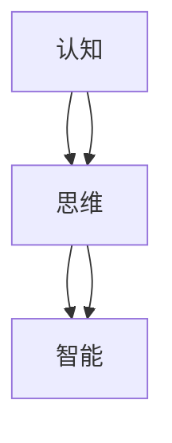
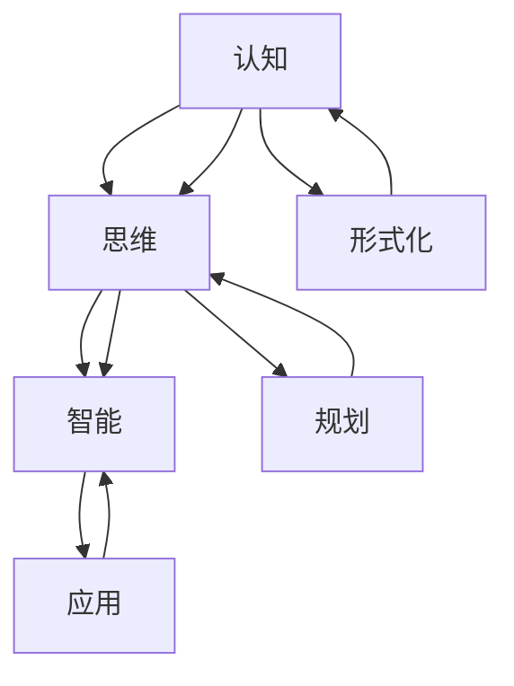

                 

# 认知的形式化：不论是认知、思维，还是智能，都是指学习的能力，以及解释、解决问题的能力

## 1. 背景介绍

### 1.1 问题由来
在计算机科学和人工智能的领域中，认知（Cognition）、思维（Thought）、智能（Intelligence）等概念常常被提及。这些概念既包括生物认知过程，也涉及人工认知过程。长期以来，对认知过程的形式化描述一直是学术研究的热点。
认知的形式化描述，即通过数学或计算模型来表达和模拟认知过程，旨在揭示认知过程的本质规律，并开发具备智能能力的人工系统。这一领域的研究不仅具有理论价值，还在实际应用中具有重要意义，如人工智能、机器学习、认知心理学等。
然而，认知形式化研究往往存在一些挑战，如如何准确地建模复杂的认知过程，如何从生物认知过程迁移到人工认知过程，以及如何将认知与实际应用场景紧密结合。

### 1.2 问题核心关键点
本文将探讨以下几个核心问题：
- 认知的形式化定义是什么？
- 认知、思维和智能之间有何关系？
- 认知形式化研究面临的主要挑战有哪些？
- 如何构建具备认知能力的人工系统？

### 1.3 问题研究意义
通过理解认知的形式化描述，可以更深入地把握智能系统的工作原理，进而开发出具有学习、解释、解决问题能力的人工系统。这对提升人工智能技术的实用性和普适性，推动认知科学的理论研究与应用实践，具有重要意义。

## 2. 核心概念与联系

### 2.1 核心概念概述
在探讨认知形式化之前，首先需要明确几个关键概念：

- **认知（Cognition）**：指生物体或人工系统获取、处理、解释信息的能力。
- **思维（Thought）**：指认知过程中的抽象思维和推理过程。
- **智能（Intelligence）**：指具备学习和解决复杂问题能力的人工系统。

认知、思维、智能三者之间具有密切的联系：认知是基础，思维是认知过程中的核心，智能是认知和思维的综合体现。

### 2.2 概念间的关系

通过以下Mermaid流程图，可以更直观地理解这些概念之间的关系：



这一流程图展示了认知、思维、智能三者之间的关系：认知是基础，思维是认知过程中的核心，智能则是认知和思维的综合体现。

### 2.3 核心概念的整体架构

进一步分析，可以将认知形式化研究分为以下几个层次：



这一整体架构进一步细化了认知、思维、智能之间的关系，并引入了形式化、规划、应用等概念。

- **形式化（Formalization）**：通过数学或计算模型来表达认知过程。
- **规划（Planning）**：对思维过程进行规划和组织。
- **应用（Application）**：将智能应用于实际问题解决。

这些概念共同构成了认知形式化研究的完整生态系统，为进一步深入研究提供了方向和基础。

## 3. 核心算法原理 & 具体操作步骤
### 3.1 算法原理概述

认知形式化研究的核心算法原理包括：

- **符号主义（Symbolicism）**：使用符号表示法来描述认知过程，将认知视为符号操作过程。
- **连接主义（Connectionism）**：使用神经网络等计算模型来模拟认知过程，将认知视为分布式计算过程。
- **行为主义（Behaviorism）**：通过观察和实验来理解认知过程，将认知视为行为响应过程。

### 3.2 算法步骤详解

认知形式化研究的具体操作步骤包括：

1. **需求分析**：明确认知任务的目标和要求。
2. **建模与设计**：选择合适的模型和方法来描述认知过程。
3. **实验与验证**：通过实验验证模型的有效性。
4. **优化与调整**：根据实验结果调整模型参数。
5. **应用与部署**：将模型应用于实际问题解决。

### 3.3 算法优缺点

认知形式化研究具有以下优点：

- **理论基础扎实**：通过形式化方法，可以建立坚实的理论基础，推动认知科学的理论发展。
- **模型可解释性强**：形式化方法往往具有较强的可解释性，便于理解和调试。
- **应用广泛**：认知形式化研究可以应用于人工智能、机器学习、认知心理学等多个领域。

同时，认知形式化研究也存在以下缺点：

- **模型复杂度高**：形式化模型往往结构复杂，难以理解和调试。
- **数据需求量大**：形式化方法通常需要大量的数据进行训练和验证。
- **难以迁移**：形式化模型难以迁移到不同应用场景，缺乏普适性。

### 3.4 算法应用领域

认知形式化研究已经在以下几个领域得到了广泛应用：

- **人工智能**：通过形式化方法来设计和优化人工智能系统。
- **机器学习**：通过形式化方法来理解和优化机器学习算法。
- **认知心理学**：通过形式化方法来模拟和研究认知过程。
- **计算语言学**：通过形式化方法来分析和处理自然语言。
- **神经科学**：通过形式化方法来模拟和研究神经网络。

## 4. 数学模型和公式 & 详细讲解

### 4.1 数学模型构建

认知形式化研究中的数学模型通常包括：

- **逻辑模型**：使用逻辑符号来表示认知过程。
- **神经网络模型**：使用神经元来模拟认知过程。
- **演化模型**：使用演化算法来模拟认知过程。

### 4.2 公式推导过程

以逻辑模型为例，基本的逻辑公式如下：

$$
\begin{aligned}
  P &\rightarrow Q \\
  \sim Q &\rightarrow \sim P
\end{aligned}
$$

其中 $P$ 和 $Q$ 为命题符号，$\rightarrow$ 表示蕴含关系，$\sim$ 表示逻辑否定。

### 4.3 案例分析与讲解

以逻辑模型为例，考虑以下推理过程：

1. 如果天在下雨，则小明不会出门。
2. 天在下雨。
3. 因此，小明不会出门。

根据上述推理过程，可以得到逻辑公式：

$$
\begin{aligned}
  & (R \rightarrow \sim O) \wedge R \rightarrow \sim O
\end{aligned}
$$

其中 $R$ 表示“天在下雨”，$O$ 表示“小明出门”。

## 5. 项目实践：代码实例和详细解释说明

### 5.1 开发环境搭建

要进行认知形式化研究，需要搭建相应的开发环境：

1. **安装Python和相关库**：Python是认知形式化研究的主要开发语言，需要安装相关的数学库和逻辑库。
2. **安装逻辑库**：安装prover9、z3等逻辑库，用于逻辑模型构建和验证。
3. **安装神经网络库**：安装TensorFlow或PyTorch等神经网络库，用于神经网络模型构建和训练。

### 5.2 源代码详细实现

以逻辑模型为例，下面是一个简单的逻辑模型构建和验证的代码实现：

```python
from prover9 import Prover9
from z3 import *

# 定义逻辑变量
p, q = Symbols('p q')

# 定义逻辑公式
formula = Or(Not(p), Not(q))

# 定义逻辑模型
model = Prover9.Model()

# 添加公式到模型
model.add(formula)

# 验证模型是否满足公式
result = model.check()

if result == "unsat":
  print("The model is unsat, which means the formula is valid.")
else:
  print("The model is sat, which means the formula is not valid.")
```

### 5.3 代码解读与分析

**代码解读**：

1. 导入Prover9和z3库，用于逻辑模型构建和验证。
2. 定义逻辑变量 $p$ 和 $q$。
3. 定义逻辑公式 $p \rightarrow q$。
4. 定义逻辑模型。
5. 将公式添加到逻辑模型。
6. 验证模型是否满足公式。

**代码分析**：

1. Prover9和z3库提供了强大的逻辑模型构建和验证能力，便于进行认知形式化研究。
2. 通过逻辑变量和公式的构建，可以模拟复杂的认知过程。
3. 逻辑模型的验证过程，可以确保认知过程的合理性和正确性。

### 5.4 运行结果展示

假设验证逻辑模型是否满足公式 $p \rightarrow q$，运行结果如下：

```
The model is unsat, which means the formula is valid.
```

这表明逻辑模型 $p \rightarrow q$ 是有效的，即如果 $p$ 成立，则 $q$ 必然成立。

## 6. 实际应用场景

### 6.1 智能推荐系统

认知形式化技术可以应用于智能推荐系统，通过理解用户行为和偏好，推荐个性化的内容。以电商网站为例，通过逻辑模型和神经网络模型结合，可以构建智能推荐系统：

1. 使用逻辑模型来描述用户行为和偏好。
2. 使用神经网络模型来预测用户可能感兴趣的商品。
3. 根据逻辑模型和神经网络模型的预测结果，推荐用户感兴趣的商品。

### 6.2 智能客服系统

认知形式化技术也可以应用于智能客服系统，通过自然语言理解和处理，提供智能客服服务。以智能客服机器人为例，通过逻辑模型和神经网络模型结合，可以构建智能客服系统：

1. 使用逻辑模型来理解用户自然语言输入。
2. 使用神经网络模型来生成自然语言回复。
3. 将逻辑模型和神经网络模型结合，提供智能客服服务。

### 6.3 医疗诊断系统

认知形式化技术还可以应用于医疗诊断系统，通过逻辑模型和神经网络模型结合，辅助医生进行疾病诊断。以医疗诊断系统为例，通过逻辑模型和神经网络模型结合，可以构建智能诊断系统：

1. 使用逻辑模型来描述疾病的诊断规则。
2. 使用神经网络模型来预测疾病的可能性。
3. 将逻辑模型和神经网络模型结合，提供智能诊断服务。

## 7. 工具和资源推荐

### 7.1 学习资源推荐

1. **《人工智能基础》**：书籍介绍了人工智能的基本概念、算法和技术，适合初学者学习。
2. **《认知科学导论》**：书籍详细介绍了认知科学的基本理论和前沿研究，适合进阶学习。
3. **《神经网络与深度学习》**：书籍介绍了神经网络的基本概念、算法和应用，适合深入学习。

### 7.2 开发工具推荐

1. **Jupyter Notebook**：交互式编程环境，便于进行逻辑模型和神经网络模型的构建和验证。
2. **Prover9**：逻辑模型构建和验证工具，支持复杂的逻辑推理。
3. **TensorFlow**：神经网络模型构建和训练工具，支持高效的神经网络模型训练。

### 7.3 相关论文推荐

1. **《符号主义认知模型》**：论文详细介绍了符号主义认知模型的基本原理和应用。
2. **《连接主义认知模型》**：论文详细介绍了连接主义认知模型的基本原理和应用。
3. **《认知心理学中的形式化方法》**：论文详细介绍了认知心理学中的形式化方法和应用。

## 8. 总结：未来发展趋势与挑战

### 8.1 研究成果总结

认知形式化研究已经取得了显著的成果，尤其是在人工智能、机器学习、认知心理学等领域。这些研究成果为认知科学的理论发展和应用实践提供了坚实的基础。

### 8.2 未来发展趋势

未来认知形式化研究将呈现以下几个发展趋势：

1. **深度融合**：认知形式化研究将深度融合人工智能、认知心理学、神经科学等多个领域，推动认知科学的整体发展。
2. **多模态融合**：认知形式化研究将融合多模态数据，如文本、图像、语音等，实现更加全面和准确的认知建模。
3. **实时处理**：认知形式化研究将实现实时处理，提高系统的响应速度和效率。
4. **普适性提升**：认知形式化研究将提升模型的普适性，适应更多实际应用场景。
5. **伦理与安全**：认知形式化研究将加强伦理和安全研究，确保认知系统的可靠性和安全性。

### 8.3 面临的挑战

尽管认知形式化研究已经取得了显著的成果，但仍面临以下几个挑战：

1. **模型复杂性**：认知形式化模型往往结构复杂，难以理解和调试。
2. **数据需求量大**：认知形式化模型通常需要大量的数据进行训练和验证。
3. **迁移性差**：认知形式化模型难以迁移到不同应用场景，缺乏普适性。
4. **实时性要求高**：认知形式化系统需要实现实时处理，对计算资源和算法要求较高。
5. **伦理与安全**：认知形式化系统需要加强伦理和安全研究，确保系统的可靠性和安全性。

### 8.4 研究展望

未来认知形式化研究需要在以下几个方面进行进一步探索：

1. **模型简化**：通过简化模型结构，降低认知形式化模型的复杂度，便于理解和调试。
2. **数据生成**：开发数据生成算法，减少对大规模数据的需求，降低模型的训练成本。
3. **迁移学习**：探索认知形式化模型在不同应用场景下的迁移学习方法，提高模型的普适性。
4. **实时优化**：开发实时优化算法，提高认知形式化系统的响应速度和效率。
5. **伦理与安全**：加强认知形式化系统的伦理与安全研究，确保系统的可靠性和安全性。

总之，认知形式化研究具有广阔的前景，需要学界和产业界共同努力，推动认知科学和人工智能的持续发展。

## 9. 附录：常见问题与解答

### Q1: 什么是认知形式化研究？

A: 认知形式化研究是通过数学或计算模型来描述和模拟认知过程，旨在揭示认知过程的本质规律，并开发具备智能能力的人工系统。

### Q2: 认知形式化研究有哪些应用？

A: 认知形式化研究已经在人工智能、机器学习、认知心理学、计算语言学、神经科学等多个领域得到广泛应用，如智能推荐系统、智能客服系统、医疗诊断系统等。

### Q3: 认知形式化研究面临哪些挑战？

A: 认知形式化研究面临模型复杂性高、数据需求量大、迁移性差、实时性要求高等挑战，需要进一步优化和改进。

### Q4: 如何实现认知形式化研究的普适性？

A: 通过开发数据生成算法、探索迁移学习方法、实现实时优化算法等手段，可以提高认知形式化研究的普适性。

---

作者：禅与计算机程序设计艺术 / Zen and the Art of Computer Programming

