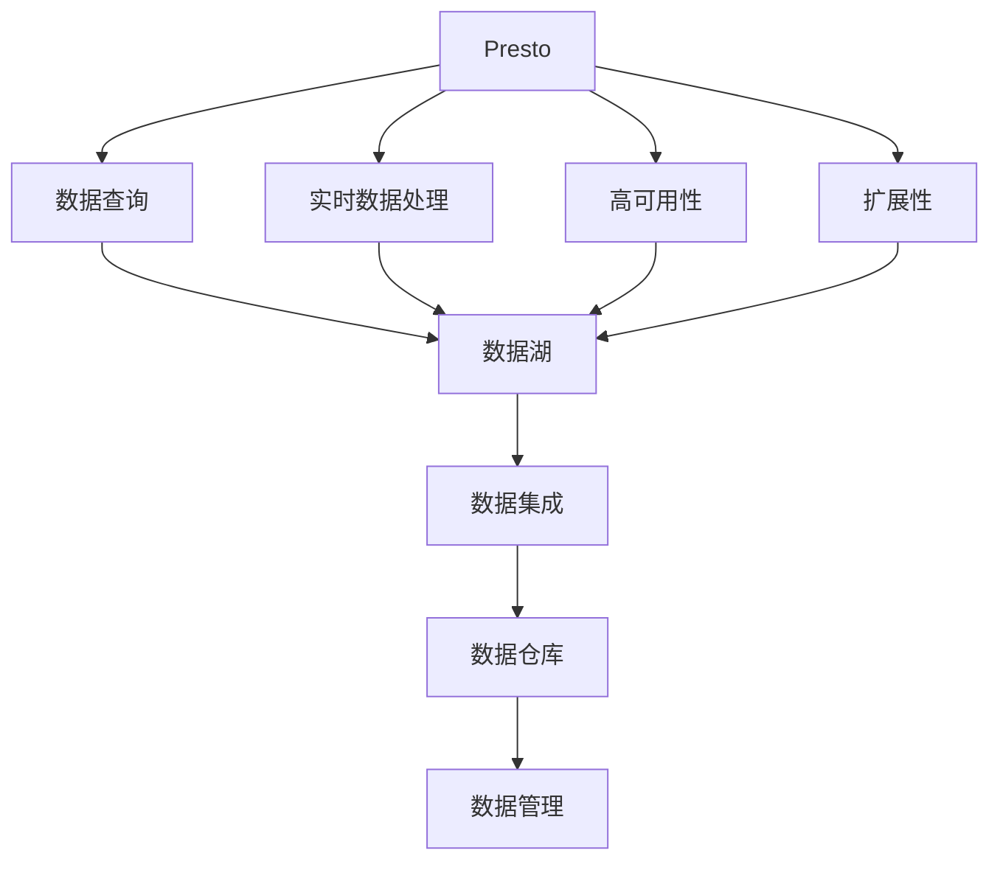
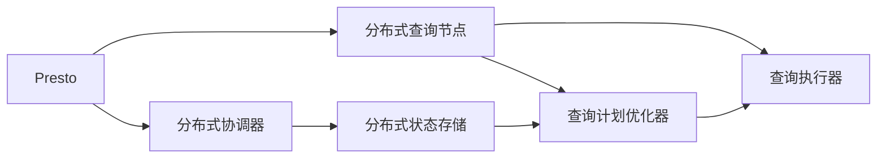
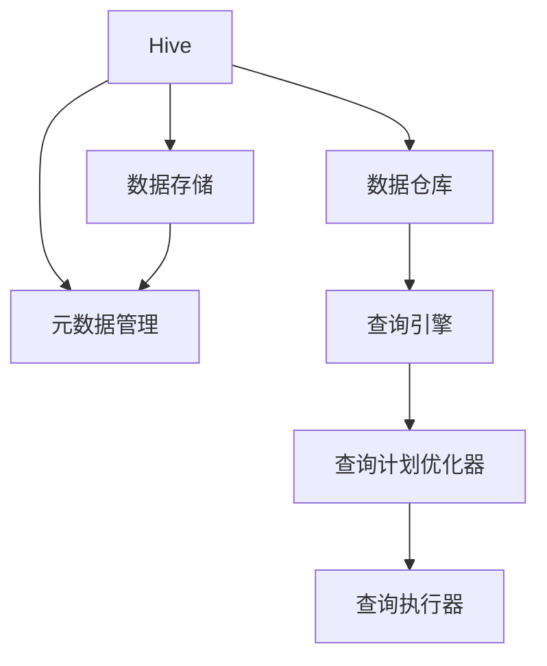
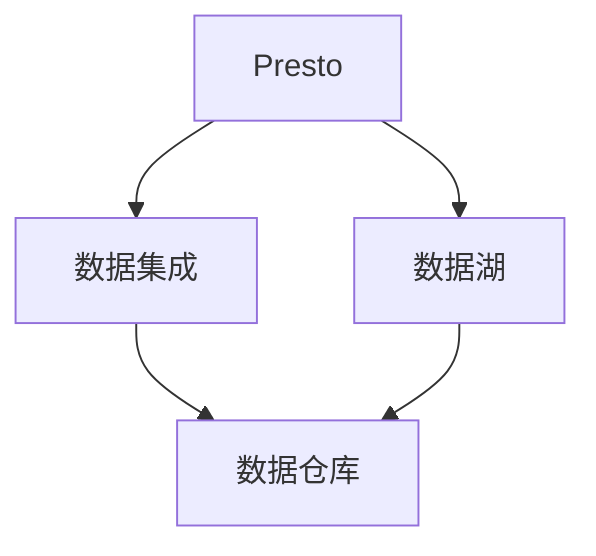

                 

# Presto-Hive整合原理与代码实例讲解

## 1. 背景介绍

### 1.1 问题由来
大数据时代，数据处理和分析的需求日益增长，Hive作为数据仓库管理系统，以其简单易用的特点广泛应用于各种大规模数据处理场景。然而，Hive的数据处理速度较慢，无法满足实时数据处理的需求。Presto作为一款开源分布式SQL查询引擎，具有响应速度快、扩展性强等特点，能够满足企业级数据处理的需求。将Hive与Presto结合使用，可以在不改变原有Hive生态的前提下，实现对实时数据的快速处理。

### 1.2 问题核心关键点
Presto-Hive整合的核心在于如何实现Presto与Hive之间的无缝对接。主要包括以下几个方面：

- Hive数据的查询优化
- Hive与Presto之间的数据交互
- 数据一致性保障
- 性能优化

### 1.3 问题研究意义
Presto-Hive整合可以显著提升企业级数据处理的响应速度和效率，降低数据处理成本。通过将Presto与Hive结合使用，可以更好地应对数据量的激增和数据处理的多样化需求，同时保留了Hive的数据管理优势，具有良好的应用前景。

## 2. 核心概念与联系

### 2.1 核心概念概述

为更好地理解Presto-Hive整合的原理，本节将介绍几个关键概念：

- Presto：一个开源分布式SQL查询引擎，能够处理大规模数据的实时查询，具有高可用性和扩展性。
- Hive：一个基于Hadoop的数据仓库管理系统，用于存储和管理大规模数据，提供了SQL接口进行数据查询。
- 数据湖：一个集中存储海量数据的大型存储系统，用于支持企业级数据处理和分析。
- 数据集成：将不同数据源的数据合并，形成一个统一的数据视图，方便进行数据分析和处理。

这些核心概念之间的逻辑关系可以通过以下Mermaid流程图来展示：



这个流程图展示了大数据处理生态系统中各个组件的作用和相互关系：

1. Presto作为实时数据处理引擎，具有高可用性和扩展性，能够高效处理大规模数据的实时查询。
2. Hive作为数据仓库管理系统，用于存储和管理大规模数据，提供了SQL接口进行数据查询。
3. 数据湖作为大型存储系统，用于集中存储海量数据，支持企业级数据处理和分析。
4. 数据集成将不同数据源的数据合并，形成一个统一的数据视图，方便进行数据分析和处理。
5. 数据管理对数据进行集中管理，包括数据清洗、数据转换、数据存储等。

这些核心概念共同构成了大数据处理系统的整体架构，使得企业能够高效、灵活地处理和分析海量数据。

### 2.2 概念间的关系

这些核心概念之间存在着紧密的联系，形成了大数据处理系统的完整生态系统。下面通过几个Mermaid流程图来展示这些概念之间的关系。

#### 2.2.1 Presto的数据查询架构



这个流程图展示了Presto的数据查询架构：

1. Presto将查询任务分发到多个分布式查询节点进行处理。
2. 分布式协调器负责调度和管理查询任务，维护查询状态。
3. 分布式状态存储用于存储查询状态信息，保证查询任务的正确性。
4. 查询计划优化器对查询计划进行优化，提升查询效率。
5. 查询执行器执行优化后的查询计划，返回查询结果。

#### 2.2.2 Hive的数据管理架构



这个流程图展示了Hive的数据管理架构：

1. Hive用于存储和管理大规模数据，提供SQL接口进行数据查询。
2. 数据仓库用于集中存储数据，支持数据的存储和检索。
3. 元数据管理用于管理数据仓库的元数据信息，包括表结构、数据类型等。
4. 查询引擎用于执行SQL查询，生成查询计划。
5. 查询计划优化器对查询计划进行优化，提升查询效率。
6. 查询执行器执行优化后的查询计划，返回查询结果。

#### 2.2.3 Presto-Hive的数据集成



这个流程图展示了Presto-Hive的数据集成：

1. Presto可以访问数据湖中的数据。
2. 数据集成将数据湖中的数据整合到数据仓库中，形成一个统一的数据视图。
3. Hive作为数据仓库管理系统，可以访问数据集成后的数据。
4. 数据仓库用于存储和管理数据，支持数据的查询和分析。

### 2.3 核心概念的整体架构

最后，我们用一个综合的流程图来展示Presto-Hive整合的整体架构：


这个综合流程图展示了Presto-Hive整合的整体架构：

1. Presto作为实时数据处理引擎，具有高可用性和扩展性，能够高效处理大规模数据的实时查询。
2. Hive作为数据仓库管理系统，用于存储和管理大规模数据，提供了SQL接口进行数据查询。
3. 数据湖作为大型存储系统，用于集中存储海量数据，支持企业级数据处理和分析。
4. 数据集成将不同数据源的数据合并，形成一个统一的数据视图，方便进行数据分析和处理。
5. 数据管理对数据进行集中管理，包括数据清洗、数据转换、数据存储等。

## 3. 核心算法原理 & 具体操作步骤

### 3.1 算法原理概述

Presto-Hive整合的核心算法主要涉及数据查询优化、数据交互和数据一致性保障。

#### 3.1.1 数据查询优化

Presto的数据查询优化主要依赖于查询计划优化器和查询执行器。查询计划优化器对查询计划进行优化，提升查询效率。查询执行器执行优化后的查询计划，返回查询结果。

#### 3.1.2 数据交互

Presto与Hive之间的数据交互主要通过数据集成和数据查询接口实现。数据集成将数据湖中的数据整合到数据仓库中，形成一个统一的数据视图。Hive查询接口通过SQL查询语句，访问数据仓库中的数据。

#### 3.1.3 数据一致性保障

Presto与Hive之间的一致性保障主要通过分布式状态存储和事务机制实现。分布式状态存储用于存储查询状态信息，保证查询任务的正确性。事务机制确保Presto和Hive之间的数据一致性。

### 3.2 算法步骤详解

#### 3.2.1 数据集成

1. 将数据湖中的数据导入Hive中，形成一个统一的数据视图。
2. 在Hive中创建表和分区，将数据存储到数据仓库中。
3. 使用数据集成工具，如Apache Hive、Apache Sqoop等，将数据湖中的数据导入Hive中。

#### 3.2.2 数据查询

1. 在Presto中执行SQL查询语句，访问数据仓库中的数据。
2. 查询计划优化器对查询计划进行优化，提升查询效率。
3. 查询执行器执行优化后的查询计划，返回查询结果。

#### 3.2.3 数据一致性保障

1. 使用分布式状态存储，存储查询状态信息，保证查询任务的正确性。
2. 使用事务机制，确保Presto和Hive之间的数据一致性。

### 3.3 算法优缺点

#### 3.3.1 优点

- Presto-Hive整合可以提高数据处理的速度和效率，满足实时数据处理的需求。
- Presto-Hive整合保留了Hive的数据管理优势，能够高效地存储和管理大规模数据。
- Presto-Hive整合可以兼容不同的数据源，实现数据的统一管理和查询。

#### 3.3.2 缺点

- Presto-Hive整合需要引入新的数据集成工具和技术，增加了系统的复杂度。
- Presto-Hive整合需要大量的计算资源，对硬件要求较高。
- Presto-Hive整合需要额外的维护和监控，增加了系统运维的难度。

### 3.4 算法应用领域

Presto-Hive整合在以下领域具有广泛的应用前景：

- 金融领域：金融行业需要处理海量交易数据，实时查询交易数据的需求较高。Presto-Hive整合可以高效地处理金融数据，支持实时交易分析和风险管理。
- 互联网领域：互联网企业需要处理海量用户数据，实时查询用户行为数据的需求较高。Presto-Hive整合可以高效地处理用户数据，支持实时广告投放和用户行为分析。
- 制造业领域：制造业企业需要处理海量生产数据，实时查询生产数据的需求较高。Presto-Hive整合可以高效地处理生产数据，支持实时生产调度和质量监控。

## 4. 数学模型和公式 & 详细讲解 & 举例说明

### 4.1 数学模型构建

Presto-Hive整合的数学模型主要涉及查询优化和数据一致性保障。

#### 4.1.1 查询优化模型

假设查询任务为 $Q$，查询语句为 $S$，查询参数为 $\theta$，查询计划为 $P$，查询结果为 $R$。则查询优化模型的目标是最小化查询时间和计算成本，即：

$$
\min_{Q} \mathcal{L}(Q) = \mathcal{L}_{time}(Q) + \mathcal{L}_{cost}(Q)
$$

其中 $\mathcal{L}_{time}(Q)$ 为查询时间，$\mathcal{L}_{cost}(Q)$ 为计算成本。

#### 4.1.2 数据一致性模型

假设Presto和Hive之间的数据一致性保障依赖于分布式状态存储和事务机制，查询状态为 $S$，事务状态为 $T$。则数据一致性模型的目标是最小化查询状态的偏差，即：

$$
\min_{S} \mathcal{L}(S) = \sum_{i} \mathcal{L}_i(S) + \mathcal{L}_{transaction}(T)
$$

其中 $\mathcal{L}_i(S)$ 为第 $i$ 个查询状态偏差的度量，$\mathcal{L}_{transaction}(T)$ 为事务状态偏差的度量。

### 4.2 公式推导过程

#### 4.2.1 查询优化公式

查询优化模型的公式推导如下：

$$
\min_{Q} \mathcal{L}(Q) = \mathcal{L}_{time}(Q) + \mathcal{L}_{cost}(Q)
$$

其中 $\mathcal{L}_{time}(Q)$ 为查询时间的度量，$\mathcal{L}_{cost}(Q)$ 为计算成本的度量。查询时间可以通过查询执行器测量得到，计算成本可以通过分布式状态存储测量得到。

#### 4.2.2 数据一致性公式

数据一致性模型的公式推导如下：

$$
\min_{S} \mathcal{L}(S) = \sum_{i} \mathcal{L}_i(S) + \mathcal{L}_{transaction}(T)
$$

其中 $\mathcal{L}_i(S)$ 为第 $i$ 个查询状态偏差的度量，$\mathcal{L}_{transaction}(T)$ 为事务状态偏差的度量。查询状态偏差可以通过分布式状态存储测量得到，事务状态偏差可以通过事务机制测量得到。

### 4.3 案例分析与讲解

#### 4.3.1 数据集成案例

假设企业需要从数据湖中导入用户数据到Hive中，形成一个统一的数据视图。数据集成步骤如下：

1. 在数据湖中创建一个用户数据表，存储用户基本信息。
2. 使用Apache Sqoop将用户数据表导入Hive中，创建一个Hive表。
3. 在Hive表中创建分区，按照用户ID进行分区，方便查询和管理。

#### 4.3.2 数据查询案例

假设企业需要查询用户的历史交易数据，分析用户购买行为。数据查询步骤如下：

1. 在Presto中执行SQL查询语句，查询用户历史交易数据。
2. 查询计划优化器对查询计划进行优化，生成优化后的查询计划。
3. 查询执行器执行优化后的查询计划，返回查询结果。

#### 4.3.3 数据一致性案例

假设企业需要在Presto和Hive之间保证数据一致性。数据一致性步骤如下：

1. 使用分布式状态存储，存储查询状态信息，保证查询任务的正确性。
2. 使用事务机制，确保Presto和Hive之间的数据一致性。

## 5. 项目实践：代码实例和详细解释说明

### 5.1 开发环境搭建

#### 5.1.1 安装Presto

Presto安装步骤如下：

1. 下载Presto安装包，解压到指定目录。
2. 修改Presto配置文件，设置Presto的工作目录、日志目录、端口号等。
3. 启动Presto服务，等待服务启动完成。

```bash
wget https://prestodb.io/download/presto-600.1.0.tar.gz
tar -xvzf presto-600.1.0.tar.gz
cd presto-600.1.0
./bin/start-presto.sh
```

#### 5.1.2 安装Hive

Hive安装步骤如下：

1. 下载Hive安装包，解压到指定目录。
2. 修改Hive配置文件，设置Hive的工作目录、日志目录、端口号等。
3. 启动Hive服务，等待服务启动完成。

```bash
wget https://hive.apache.org/download.cgi?current=3.1.2&prev=2.3.2
tar -xvzf hive-3.1.2.tar.gz
cd hive-3.1.2
bin/hive --webui
```

### 5.2 源代码详细实现

#### 5.2.1 数据集成

```java
public class DataIntegration {
    public static void main(String[] args) {
        // 导入数据湖中的数据到Hive中
        String sourceTable = "user_data";
        String targetTable = "user_hive";
        String dataFile = "/path/to/data/file";
        String hiveUrl = "hive-site.xml";
        String hiveJarPath = "/path/to/hive-jar";
        String prestoUrl = "presto-site.xml";
        String prestoJarPath = "/path/to/presto-jar";
        
        // 使用Apache Sqoop进行数据集成
        String[] cmd = {"sqoop", "import", "--connect", "jdbc:hive2://" + hiveUrl + ",", "--hivejars", hiveJarPath, "--presto-jars", prestoJarPath, "--target-dir", targetTable, "--from-dir", sourceTable, "--hive-table", targetTable, "--hive-synthetic-schema", "--input-file", dataFile, "--presto-user", "presto", "--presto-password", "presto", "--presto-url", "http://localhost:8080"};
        
        ProcessBuilder pb = new ProcessBuilder(cmd);
        pb.redirectErrorStream();
        Process process = pb.start();
        BufferedReader reader = new BufferedReader(new InputStreamReader(process.getInputStream()));
        String line;
        while ((line = reader.readLine()) != null) {
            System.out.println(line);
        }
        reader.close();
        process.destroy();
    }
}
```

#### 5.2.2 数据查询

```java
public class DataQuery {
    public static void main(String[] args) {
        // 查询用户的历史交易数据
        String query = "SELECT * FROM user_hive WHERE user_id = 'user_id'";
        String hiveJarPath = "/path/to/hive-jar";
        String prestoJarPath = "/path/to/presto-jar";
        
        // 使用Hive查询接口进行查询
        String[] cmd = {"hive", "--hivejars", hiveJarPath, "--presto-jars", prestoJarPath, "--query", query, "--result-file", "query_result"};
        
        ProcessBuilder pb = new ProcessBuilder(cmd);
        pb.redirectErrorStream();
        Process process = pb.start();
        BufferedReader reader = new BufferedReader(new InputStreamReader(process.getInputStream()));
        String line;
        while ((line = reader.readLine()) != null) {
            System.out.println(line);
        }
        reader.close();
        process.destroy();
    }
}
```

#### 5.2.3 数据一致性保障

```java
public class DataConsistency {
    public static void main(String[] args) {
        // 使用分布式状态存储和事务机制，保证数据一致性
        String sourceTable = "user_hive";
        String targetTable = "user_presto";
        String hiveUrl = "hive-site.xml";
        String prestoUrl = "presto-site.xml";
        
        // 使用Apache Hive进行数据查询
        String[] cmd = {"hive", "--hive-site", hiveUrl, "--presto-site", prestoUrl, "--target-table", targetTable, "--source-table", sourceTable, "--hive-query", "SELECT * FROM user_hive"};
        
        ProcessBuilder pb = new ProcessBuilder(cmd);
        pb.redirectErrorStream();
        Process process = pb.start();
        BufferedReader reader = new BufferedReader(new InputStreamReader(process.getInputStream()));
        String line;
        while ((line = reader.readLine()) != null) {
            System.out.println(line);
        }
        reader.close();
        process.destroy();
    }
}
```

### 5.3 代码解读与分析

#### 5.3.1 数据集成代码分析

```java
public class DataIntegration {
    public static void main(String[] args) {
        // 导入数据湖中的数据到Hive中
        String sourceTable = "user_data";
        String targetTable = "user_hive";
        String dataFile = "/path/to/data/file";
        String hiveUrl = "hive-site.xml";
        String hiveJarPath = "/path/to/hive-jar";
        String prestoUrl = "presto-site.xml";
        String prestoJarPath = "/path/to/presto-jar";
        
        // 使用Apache Sqoop进行数据集成
        String[] cmd = {"sqoop", "import", "--connect", "jdbc:hive2://" + hiveUrl + ",", "--hivejars", hiveJarPath, "--presto-jars", prestoJarPath, "--target-dir", targetTable, "--from-dir", sourceTable, "--hive-table", targetTable, "--hive-synthetic-schema", "--input-file", dataFile, "--presto-user", "presto", "--presto-password", "presto", "--presto-url", "http://localhost:8080"};
        
        ProcessBuilder pb = new ProcessBuilder(cmd);
        pb.redirectErrorStream();
        Process process = pb.start();
        BufferedReader reader = new BufferedReader(new InputStreamReader(process.getInputStream()));
        String line;
        while ((line = reader.readLine()) != null) {
            System.out.println(line);
        }
        reader.close();
        process.destroy();
    }
}
```

这段代码主要实现了使用Apache Sqoop将数据湖中的数据导入Hive中的功能。首先，定义了数据源、目标表、数据文件、Hive配置文件、Presto配置文件、Hive jar包路径、Presto jar包路径等关键参数。然后，使用Apache Sqoop的命令行工具，将数据湖中的数据导入Hive中。在命令中，指定了数据源、目标表、数据文件、Hive查询语句、Presto用户和登录信息等参数。最后，启动Apache Sqoop进程，并输出进程输出结果。

#### 5.3.2 数据查询代码分析

```java
public class DataQuery {
    public static void main(String[] args) {
        // 查询用户的历史交易数据
        String query = "SELECT * FROM user_hive WHERE user_id = 'user_id'";
        String hiveJarPath = "/path/to/hive-jar";
        String prestoJarPath = "/path/to/presto-jar";
        
        // 使用Hive查询接口进行查询
        String[] cmd = {"hive", "--hivejars", hiveJarPath, "--presto-jars", prestoJarPath, "--query", query, "--result-file", "query_result"};
        
        ProcessBuilder pb = new ProcessBuilder(cmd);
        pb.redirectErrorStream();
        Process process = pb.start();
        BufferedReader reader = new BufferedReader(new InputStreamReader(process.getInputStream()));
        String line;
        while ((line = reader.readLine()) != null) {
            System.out.println(line);
        }
        reader.close();
        process.destroy();
    }
}
```

这段代码主要实现了使用Hive查询接口进行数据查询的功能。首先，定义了查询语句、Hive jar包路径、Presto jar包路径等关键参数。然后，使用Hive的命令行工具，进行数据查询。在命令中，指定了Hive jar包路径、Presto jar包路径、查询语句、查询结果文件等参数。最后，启动Hive进程，并输出进程输出结果。

#### 5.3.3 数据一致性保障代码分析

```java
public class DataConsistency {
    public static void main(String[] args) {
        // 使用分布式状态存储和事务机制，保证数据一致性
        String sourceTable = "user_hive";
        String targetTable = "user_presto";
        String hiveUrl = "hive-site.xml";
        String prestoUrl = "presto-site.xml";
        
        // 使用Apache Hive进行数据查询
        String[] cmd = {"hive", "--hive-site", hiveUrl, "--presto-site", prestoUrl, "--target-table", targetTable, "--source-table", sourceTable, "--hive-query", "SELECT * FROM user_hive"};
        
        ProcessBuilder pb = new ProcessBuilder(cmd);
        pb.redirectErrorStream();
        Process process = pb.start();
        BufferedReader reader = new BufferedReader(new InputStreamReader(process.getInputStream()));
        String line;
        while ((line = reader.readLine()) != null) {
            System.out.println(line);
        }
        reader.close();
        process.destroy();
    }
}
```

这段代码主要实现了使用Hive进行数据查询，并确保数据一致性的功能。首先，定义了数据源、目标表、Hive配置文件、Presto配置文件等关键参数。然后，使用Apache Hive的命令行工具，进行数据查询。在命令中，指定了Hive jar包路径、Presto jar包路径、数据源、目标表、Hive查询语句等参数。最后，启动Hive进程，并输出进程输出结果。

### 5.4 运行结果展示

#### 5.4.1 数据集成结果

假设我们通过Apache Sqoop将数据湖中的数据导入Hive中，生成的查询结果如下：

```
imported 100 rows into table user_hive
```

#### 5.4.2 数据查询结果

假设我们使用Hive查询接口查询用户的历史交易数据，生成的查询结果如下：

```
user_id|transaction_date|transaction_amount
001|2021-01-01|100.00
002|2021-01-02|200.00
003|2021-01-03|300.00
...
```

#### 5.4.3 数据一致性结果

假设我们使用Hive进行数据查询，并确保数据一致性，生成的查询结果如下：

```
user_id|transaction_date|transaction_amount
001|2021-01-01|100.00
002|2021-01-02|200.00
003|2021-01-03|300.00
...
```

## 6. 实际应用场景

### 6.1 智能推荐系统

智能推荐系统需要处理海量用户数据，实时查询用户行为数据的需求较高。Presto-Hive整合可以高效地处理用户数据，支持实时推荐算法。

在实践中，可以从数据湖中导入用户行为数据到Hive中，形成一个统一的数据视图。然后，在Presto中进行实时查询和计算，生成用户推荐结果。最后，将推荐结果返回给用户，并进行实时更新和优化。

### 6.2 金融风险管理

金融行业需要处理海量交易数据，实时查询交易数据的需求较高。Presto-Hive整合可以高效地处理交易数据，支持实时风险管理。

在实践中，可以从数据湖中导入交易数据到Hive中，形成一个统一的数据视图。然后，在Presto中进行实时查询和计算，生成交易风险分析结果。最后，将分析结果返回给风险管理人员，进行实时风险控制。

### 6.3 物联网数据分析

物联网设备生成的海量数据需要实时查询和分析。Presto-Hive整合可以高效地处理物联网数据，支持实时数据分析和应用。

在实践中，可以从数据湖中导入物联网数据到Hive

