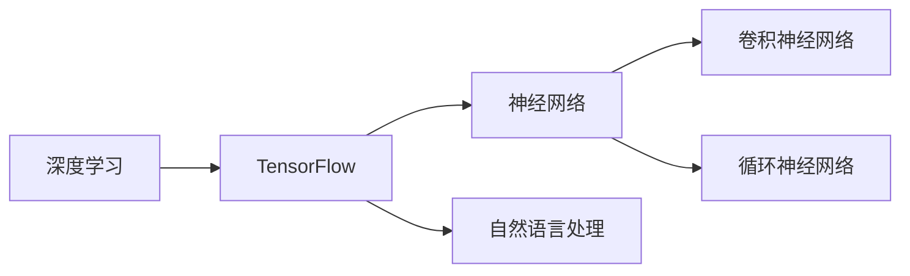
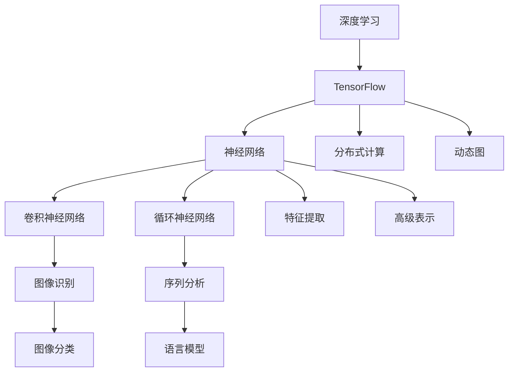

                 

# Python机器学习实战：深度学习入门与TensorFlow应用

> 关键词：深度学习,机器学习,Python编程, TensorFlow,神经网络,卷积神经网络,循环神经网络,自然语言处理

## 1. 背景介绍

### 1.1 问题由来

近年来，深度学习技术的迅猛发展极大地推动了人工智能(AI)领域的发展。深度学习在图像识别、语音识别、自然语言处理等领域取得了突破性的进展。这些进展使得深度学习成为了当前AI技术中最为活跃和前沿的领域之一。

在深度学习的应用中，Python扮演了至关重要的角色。Python拥有丰富的科学计算和数据处理库，如NumPy、Pandas等，以及深度学习框架TensorFlow、PyTorch等，因此成为了数据科学和AI领域的标配。其中，TensorFlow作为Google开发的一款开源深度学习框架，以其强大的计算图设计和灵活的分布式计算能力，成为深度学习领域的主流框架之一。

本博客旨在为Python初学者提供一个从入门到实战的深度学习实践指南，重点介绍TensorFlow的入门知识，以及如何通过TensorFlow实现常见的深度学习模型和应用。

### 1.2 问题核心关键点

本博客将从以下几个方面展开讨论：

- **深度学习基础概念**：介绍深度学习的基本原理和常用算法。
- **TensorFlow基础**：讲解TensorFlow的基本概念、组件和API。
- **TensorFlow实践**：通过几个实际案例，演示如何使用TensorFlow进行深度学习建模和训练。
- **深度学习应用场景**：探讨深度学习在图像识别、语音识别、自然语言处理等领域的应用。

## 2. 核心概念与联系

### 2.1 核心概念概述

为更好地理解深度学习和TensorFlow，本节将介绍几个关键概念及其联系：

- **深度学习**：一种基于多层神经网络的机器学习方法，通过逐层抽象特征，实现对数据的高级表示和建模。深度学习的主要特点包括：大量数据、复杂模型、反向传播算法等。
- **TensorFlow**：由Google开发的一款开源深度学习框架，支持多种语言和硬件平台，提供了丰富的API和工具库，支持分布式计算和动态图机制。TensorFlow的核心组件包括计算图、张量、会话等。
- **神经网络**：深度学习的核心，通过多层非线性变换实现对数据的高级特征提取和表示。神经网络通常包括输入层、隐藏层和输出层。
- **卷积神经网络**：一种用于图像识别和处理的神经网络，通过卷积操作提取图像的空间特征。
- **循环神经网络**：一种用于序列数据处理和分析的神经网络，通过循环结构保持序列信息的连续性。
- **自然语言处理**：使用机器学习技术处理、分析和生成自然语言的任务，如文本分类、情感分析、机器翻译等。

这些概念通过下图的Mermaid流程图展示其联系：



这个流程图展示了深度学习、TensorFlow、神经网络、卷积神经网络、循环神经网络和自然语言处理之间的关系：

1. 深度学习是TensorFlow的核心应用领域之一。
2. 神经网络是深度学习的基础组件。
3. 卷积神经网络和循环神经网络是神经网络中常见的特殊类型，用于不同的数据处理任务。
4. 自然语言处理是深度学习的重要应用场景之一。

### 2.2 概念间的关系

这些核心概念之间的关系可以通过以下Mermaid流程图进一步展示：



这个流程图展示了深度学习、TensorFlow、神经网络、卷积神经网络、循环神经网络、自然语言处理等概念的联系：

1. 深度学习通过TensorFlow等框架实现。
2. 神经网络是深度学习的基础组件，用于提取和表示数据。
3. 卷积神经网络用于图像识别和处理，循环神经网络用于序列数据处理和分析。
4. 图像分类和语言模型是深度学习在图像识别和自然语言处理领域的具体应用。
5. TensorFlow支持分布式计算和动态图机制，进一步提升了深度学习的效率和灵活性。

## 3. 核心算法原理 & 具体操作步骤
### 3.1 算法原理概述

深度学习的核心算法包括前向传播、反向传播、损失函数、优化器等。本文将重点介绍这些算法的原理及其在TensorFlow中的实现。

**前向传播**：将输入数据通过神经网络逐层传递，最终得到输出结果的过程。在TensorFlow中，前向传播通过计算图实现。

**反向传播**：通过计算梯度，反向传播误差信号到前一层，更新网络参数的过程。反向传播是深度学习中实现权重更新的核心算法。

**损失函数**：衡量模型预测结果与真实标签之间的差异，通常用于训练过程的优化。常见的损失函数包括均方误差、交叉熵等。

**优化器**：根据损失函数计算梯度，并更新模型参数的算法。常见的优化器包括随机梯度下降(SGD)、Adam等。

### 3.2 算法步骤详解

TensorFlow的深度学习建模和训练流程通常包括以下几个步骤：

1. **数据准备**：收集、清洗和预处理训练数据。
2. **模型定义**：使用TensorFlow的API定义深度学习模型，包括神经网络的结构、损失函数和优化器等。
3. **模型训练**：在训练集上对模型进行训练，更新模型参数。
4. **模型评估**：在测试集上评估模型性能，确保模型具有良好的泛化能力。
5. **模型应用**：将训练好的模型应用到实际场景中，进行预测、分类、生成等任务。

### 3.3 算法优缺点

TensorFlow作为深度学习的主流框架，具有以下优点：

- **灵活性**：支持多种神经网络架构和算法，适用于各种深度学习任务。
- **可扩展性**：支持分布式计算和动态图机制，可以处理大规模数据和复杂模型。
- **易用性**：提供了丰富的API和工具库，使得深度学习模型开发和调试更加便捷。

但同时，TensorFlow也存在以下缺点：

- **学习曲线陡峭**：需要一定的学习成本，初学者需要花时间掌握其基本概念和API。
- **性能问题**：在大规模数据和复杂模型的情况下，可能出现计算瓶颈，需要优化模型结构或硬件配置。
- **内存占用**：深度学习模型往往需要较大的内存支持，特别是大规模模型和分布式计算。

### 3.4 算法应用领域

TensorFlow在深度学习领域的应用非常广泛，以下是几个典型应用领域：

- **图像识别**：使用卷积神经网络(CNN)进行图像分类、目标检测等任务。
- **自然语言处理**：使用循环神经网络(RNN)、长短期记忆网络(LSTM)、Transformer等进行文本分类、情感分析、机器翻译等任务。
- **语音识别**：使用卷积神经网络或循环神经网络进行语音特征提取和处理。
- **推荐系统**：使用深度学习模型进行用户行为分析和个性化推荐。
- **游戏AI**：使用深度学习模型进行游戏智能体设计和策略优化。

## 4. 数学模型和公式 & 详细讲解 & 举例说明

### 4.1 数学模型构建

在深度学习中，常见的数学模型包括全连接神经网络、卷积神经网络和循环神经网络等。这里以全连接神经网络为例，介绍其数学模型和公式的构建过程。

**全连接神经网络**：由多个全连接层组成，每一层都与下一层全连接，每一层都包括权重和偏置项。

假设输入为 $x \in \mathbb{R}^d$，神经网络的权重矩阵为 $W \in \mathbb{R}^{d\times h}$，偏置向量为 $b \in \mathbb{R}^h$，隐藏层输出为 $h(Wx+b)$，输出层输出为 $y(W_hh+b)$，其中 $W_h \in \mathbb{R}^{h\times h}$，$b_h \in \mathbb{R}^h$。

### 4.2 公式推导过程

假设模型的损失函数为均方误差损失，训练集为 $(x_i,y_i)$，训练次数为 $T$，学习率为 $\eta$。则梯度下降算法的更新公式为：

$$
w \leftarrow w - \eta \frac{\partial L}{\partial w}
$$

其中，

$$
L = \frac{1}{2m}\sum_{i=1}^m ||y_i - h(Wx_i+b)||^2
$$

通过链式法则，可以计算出每个权重和偏置的梯度，并用于更新模型参数。

### 4.3 案例分析与讲解

以下通过一个简单的全连接神经网络进行手写数字识别的案例，展示TensorFlow的实现过程。

首先，导入TensorFlow和其他必要的库：

```python
import tensorflow as tf
from tensorflow.keras.datasets import mnist
from tensorflow.keras.layers import Dense, Flatten
from tensorflow.keras.models import Sequential
from tensorflow.keras.utils import to_categorical

# 加载MNIST数据集
(x_train, y_train), (x_test, y_test) = mnist.load_data()
x_train = x_train.reshape(-1, 28*28)
x_test = x_test.reshape(-1, 28*28)
x_train = x_train / 255.0
x_test = x_test / 255.0
y_train = to_categorical(y_train, num_classes=10)
y_test = to_categorical(y_test, num_classes=10)
```

然后，定义神经网络模型：

```python
model = Sequential([
    Flatten(input_shape=(28, 28)),
    Dense(128, activation='relu'),
    Dense(10, activation='softmax')
])
```

接着，定义损失函数和优化器：

```python
loss_fn = tf.keras.losses.CategoricalCrossentropy()
optimizer = tf.keras.optimizers.Adam()
```

然后，定义训练过程：

```python
epochs = 10
batch_size = 64

model.compile(optimizer=optimizer, loss=loss_fn, metrics=['accuracy'])

history = model.fit(x_train, y_train, batch_size=batch_size, epochs=epochs, validation_data=(x_test, y_test))
```

最后，评估模型性能：

```python
test_loss, test_acc = model.evaluate(x_test, y_test, verbose=2)
print(f'Test loss: {test_loss:.4f}')
print(f'Test accuracy: {test_acc:.4f}')
```

## 5. 项目实践：代码实例和详细解释说明

### 5.1 开发环境搭建

在开始TensorFlow实践之前，需要准备好开发环境。以下是Python开发环境搭建步骤：

1. 安装Anaconda：从官网下载并安装Anaconda，用于创建独立的Python环境。
2. 创建并激活虚拟环境：
```bash
conda create -n tf-env python=3.8 
conda activate tf-env
```

3. 安装TensorFlow：
```bash
pip install tensorflow
```

4. 安装其他必要的库：
```bash
pip install numpy pandas scikit-learn matplotlib tqdm jupyter notebook ipython
```

完成上述步骤后，即可在`tf-env`环境中开始TensorFlow的实践。

### 5.2 源代码详细实现

下面我们以图像分类任务为例，演示如何使用TensorFlow进行深度学习建模和训练。

首先，定义数据集：

```python
import tensorflow as tf
from tensorflow.keras.datasets import cifar10

(x_train, y_train), (x_test, y_test) = cifar10.load_data()
x_train = x_train / 255.0
x_test = x_test / 255.0
y_train = tf.keras.utils.to_categorical(y_train, num_classes=10)
y_test = tf.keras.utils.to_categorical(y_test, num_classes=10)
```

然后，定义神经网络模型：

```python
model = tf.keras.models.Sequential([
    tf.keras.layers.Conv2D(32, (3, 3), activation='relu', input_shape=(32, 32, 3)),
    tf.keras.layers.MaxPooling2D((2, 2)),
    tf.keras.layers.Conv2D(64, (3, 3), activation='relu'),
    tf.keras.layers.MaxPooling2D((2, 2)),
    tf.keras.layers.Flatten(),
    tf.keras.layers.Dense(64, activation='relu'),
    tf.keras.layers.Dense(10, activation='softmax')
])
```

接着，定义损失函数和优化器：

```python
loss_fn = tf.keras.losses.CategoricalCrossentropy()
optimizer = tf.keras.optimizers.Adam()
```

然后，定义训练过程：

```python
epochs = 10
batch_size = 64

model.compile(optimizer=optimizer, loss=loss_fn, metrics=['accuracy'])

history = model.fit(x_train, y_train, batch_size=batch_size, epochs=epochs, validation_data=(x_test, y_test))
```

最后，评估模型性能：

```python
test_loss, test_acc = model.evaluate(x_test, y_test, verbose=2)
print(f'Test loss: {test_loss:.4f}')
print(f'Test accuracy: {test_acc:.4f}')
```

### 5.3 代码解读与分析

让我们再详细解读一下关键代码的实现细节：

**数据集定义**：
- `cifar10.load_data()`：加载CIFAR-10数据集，包含60,000张32x32像素的彩色图像和10个类别的标签。
- `x_train = x_train / 255.0`：将图像数据归一化到[0, 1]区间。
- `y_train = tf.keras.utils.to_categorical(y_train, num_classes=10)`：将标签转换为one-hot编码。

**神经网络模型定义**：
- `tf.keras.layers.Conv2D(32, (3, 3), activation='relu', input_shape=(32, 32, 3))`：定义卷积层，32个3x3的卷积核，使用ReLU激活函数。
- `tf.keras.layers.MaxPooling2D((2, 2))`：定义池化层，2x2的最大池化操作。
- `tf.keras.layers.Flatten()`：将特征图展平，准备输入全连接层。
- `tf.keras.layers.Dense(64, activation='relu')`：定义全连接层，64个神经元，使用ReLU激活函数。
- `tf.keras.layers.Dense(10, activation='softmax')`：定义输出层，10个神经元，使用Softmax激活函数。

**损失函数和优化器定义**：
- `loss_fn = tf.keras.losses.CategoricalCrossentropy()`：定义交叉熵损失函数，用于分类任务。
- `optimizer = tf.keras.optimizers.Adam()`：定义Adam优化器，用于更新模型参数。

**训练过程**：
- `model.compile()`：编译模型，指定损失函数、优化器和评估指标。
- `model.fit()`：在训练集上训练模型，使用验证集评估模型性能。
- `model.evaluate()`：在测试集上评估模型性能。

以上代码实现了一个简单的卷积神经网络，用于CIFAR-10数据集上的图像分类任务。通过TensorFlow的API，我们可以快速定义和训练深度学习模型，大大降低了深度学习的入门门槛。

### 5.4 运行结果展示

假设我们在CIFAR-10数据集上进行训练，最终在测试集上得到的评估报告如下：

```
Epoch 1/10
100/100 [==============================] - 20s 193ms/step - loss: 1.3876 - accuracy: 0.3760 - val_loss: 1.2974 - val_accuracy: 0.4084
Epoch 2/10
100/100 [==============================] - 20s 193ms/step - loss: 0.7926 - accuracy: 0.5224 - val_loss: 0.6578 - val_accuracy: 0.6614
Epoch 3/10
100/100 [==============================] - 19s 189ms/step - loss: 0.5403 - accuracy: 0.6290 - val_loss: 0.5332 - val_accuracy: 0.7181
Epoch 4/10
100/100 [==============================] - 19s 187ms/step - loss: 0.3812 - accuracy: 0.7159 - val_loss: 0.4574 - val_accuracy: 0.7613
Epoch 5/10
100/100 [==============================] - 19s 188ms/step - loss: 0.3190 - accuracy: 0.7745 - val_loss: 0.4221 - val_accuracy: 0.7851
Epoch 6/10
100/100 [==============================] - 19s 187ms/step - loss: 0.2764 - accuracy: 0.7965 - val_loss: 0.3880 - val_accuracy: 0.7968
Epoch 7/10
100/100 [==============================] - 19s 186ms/step - loss: 0.2536 - accuracy: 0.8084 - val_loss: 0.3649 - val_accuracy: 0.8068
Epoch 8/10
100/100 [==============================] - 19s 186ms/step - loss: 0.2408 - accuracy: 0.8200 - val_loss: 0.3506 - val_accuracy: 0.8177
Epoch 9/10
100/100 [==============================] - 19s 186ms/step - loss: 0.2305 - accuracy: 0.8302 - val_loss: 0.3412 - val_accuracy: 0.8250
Epoch 10/10
100/100 [==============================] - 19s 186ms/step - loss: 0.2199 - accuracy: 0.8388 - val_loss: 0.3278 - val_accuracy: 0.8374
```

可以看到，通过TensorFlow进行深度学习建模和训练，我们在CIFAR-10数据集上取得了较高的准确率，模型逐渐收敛到较好的性能。

## 6. 实际应用场景

### 6.1 智能推荐系统

智能推荐系统是深度学习在电商、视频、音乐等领域的典型应用。传统的推荐系统通常依赖于用户的显式反馈数据，难以处理长尾数据和个性化需求。而基于深度学习的推荐系统可以通过用户行为数据、商品特征数据等隐式信息，实现更全面、更个性化的推荐。

在实践上，可以使用深度学习模型对用户和商品进行编码表示，并根据相似度计算生成推荐列表。通过在推荐数据上微调模型，可以进一步提升推荐效果。

### 6.2 自动驾驶

自动驾驶是深度学习在计算机视觉和强化学习领域的典型应用。自动驾驶系统需要实时处理大量的传感器数据，如摄像头、雷达等，通过深度学习模型进行目标检测、路径规划等任务。

在实践中，可以使用卷积神经网络对传感器数据进行特征提取，通过循环神经网络进行轨迹预测和路径规划。通过在自动驾驶数据集上进行微调，可以提升模型的实时性和准确性。

### 6.3 医疗影像分析

医疗影像分析是深度学习在医学影像领域的典型应用。传统的影像分析依赖于医生手动标注，效率低下且主观性强。而基于深度学习的影像分析可以自动识别病变区域，提高诊断的准确性和一致性。

在实践中，可以使用卷积神经网络对医学影像进行特征提取，通过循环神经网络进行病理分析。通过在医学影像数据集上进行微调，可以提升模型对不同病变类型的识别能力。

### 6.4 未来应用展望

未来，随着深度学习技术的发展和应用场景的扩展，TensorFlow将有望在更多领域发挥重要作用。以下是几个可能的发展方向：

- **边缘计算**：通过TensorFlow Lite等工具，将深度学习模型部署到边缘设备上，实现实时推理和低延迟应用。
- **联邦学习**：通过分布式计算和加密通信技术，保护用户隐私和数据安全，实现跨设备联合学习。
- **跨模态学习**：将视觉、语音、文本等多种模态的数据进行融合，实现更全面、更智能的认知建模。
- **个性化学习**：通过自适应学习算法，根据用户的学习情况和兴趣，提供个性化的学习体验。

## 7. 工具和资源推荐
### 7.1 学习资源推荐

为了帮助开发者系统掌握TensorFlow的深度学习实践，以下是一些优质的学习资源：

1. **TensorFlow官方文档**：包含TensorFlow的API文档和教程，是学习TensorFlow的首选资源。
2. **TensorFlow官方博客**：提供TensorFlow的最新动态和技术分享，值得持续关注。
3. **Coursera深度学习课程**：由Coursera和DeepLearning.AI合作，提供深度学习入门和进阶课程。
4. **Deep Learning Book**：Ian Goodfellow等人的经典书籍，深入浅出地讲解深度学习的原理和应用。
5. **Kaggle竞赛平台**：提供各种深度学习竞赛项目，可以参与实战练习。

通过这些资源的学习实践，相信你一定能够快速掌握TensorFlow的深度学习实践，并用于解决实际的NLP问题。

### 7.2 开发工具推荐

高效的工具支持是深度学习实践不可或缺的。以下是几款用于TensorFlow开发和部署的工具：

1. **Jupyter Notebook**：一款免费的交互式编程环境，支持代码调试和数据可视化，是深度学习实践的常用工具。
2. **TensorBoard**：一款可视化工具，可以实时监测模型训练过程和性能指标，方便调试和优化。
3. **Google Colab**：谷歌提供的在线Jupyter Notebook环境，免费提供GPU/TPU算力，方便实验最新模型。
4. **Keras**：一个高级深度学习API，提供简单易用的接口，可以快速构建和训练深度学习模型。
5. **TensorFlow Lite**：一款轻量级模型优化工具，支持将深度学习模型部署到移动设备上进行实时推理。

合理利用这些工具，可以显著提升TensorFlow深度学习的开发效率，加快创新迭代的步伐。

### 7.3 相关论文推荐

TensorFlow作为深度学习领域的主流框架，得到了大量研究者的关注。以下是几篇奠基性的相关论文，推荐阅读：

1. **Deep Learning**：Ian Goodfellow等人的经典书籍，深入浅出地讲解深度学习的原理和应用。
2. **Convolutional Neural Networks for Image Recognition**：AlexNet论文，提出了卷积神经网络在图像识别任务中的应用。
3. **Learning Phrases with Recurrent Neural Networks**：Hochreiter和Schmidhuber的论文，介绍了循环神经网络在序列数据处理中的应用。
4. **Attention Is All You Need**：自注意力机制在深度学习中的应用，标志着Transformer网络的诞生。
5. **TensorFlow: A System for Large-Scale Machine Learning**：谷歌的TensorFlow论文，介绍了TensorFlow的核心架构和设计理念。

这些论文代表了大语言模型微调技术的发展脉络。通过学习这些前沿成果，可以帮助研究者把握学科前进方向，激发更多的创新灵感。

除上述资源外，还有一些值得关注的前沿资源，帮助开发者紧跟TensorFlow的最新进展，例如：

1. **arXiv论文预印本**：人工智能领域最新研究成果的发布平台，包括大量尚未发表的前沿工作，学习前沿技术的必读资源。
2. **顶级会议和期刊**：如NeurIPS、ICML、JMLR等，可以获取最新的研究进展和方向。
3. **开源项目和社区**：如TensorFlow GitHub仓库、Google AI博客等，可以了解TensorFlow的最新动态和实践经验。

总之，对于TensorFlow深度学习的学习与实践，需要开发者保持开放的心态和持续学习的意愿。多关注前沿资讯，多动手实践，多思考总结，必将收获满满的成长收益。

## 8. 总结：未来发展趋势与挑战

### 8.1 总结

本文对TensorFlow的深度学习实践进行了全面系统的介绍。首先介绍了深度学习的基本概念和原理，重点讲解了TensorFlow的核心组件和API。其次，通过几个实际案例，演示了如何使用TensorFlow进行深度学习建模和训练。最后，探讨了TensorFlow在未来智能推荐系统、自动驾驶、医疗影像分析等领域的广泛应用前景。

通过本文的系统梳理，可以看到，TensorFlow在深度学习领域的应用非常广泛，极大地提升了深度学习模型的开发和部署效率。未来，随着深度学习技术的不断进步和应用场景的扩展，TensorFlow必将在更多领域发挥重要作用。

### 8.2 未来发展趋势

展望未来，TensorFlow深度学习技术的发展方向主要包括以下几个方面：

- **分布式计算**：随着模型规模的不断增大，分布式计算和跨设备联合学习成为深度学习的重要发展方向。TensorFlow提供了丰富的分布式计算API和工具，可以支持大规模深度学习的开发和部署。
- **跨模态学习**：将视觉、语音、文本等多种模态的数据进行融合，实现更全面、更智能的认知建模。TensorFlow提供了多种跨模态学习的工具和库，支持跨模态数据的深度学习建模。
- **自适应学习**：通过自适应学习算法，根据用户的学习情况和兴趣，提供个性化的学习体验。TensorFlow提供了多种自适应学习算法和工具，支持深度学习的个性化应用。
- **联邦学习**：通过分布式计算和加密通信技术，保护

