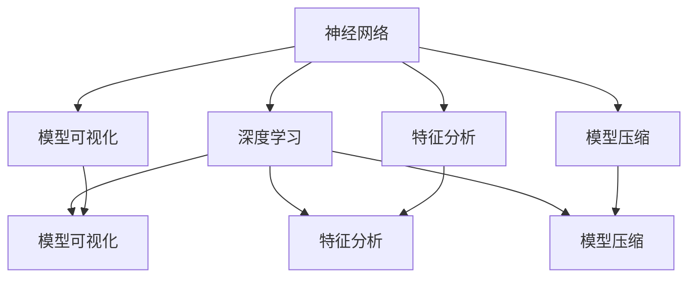
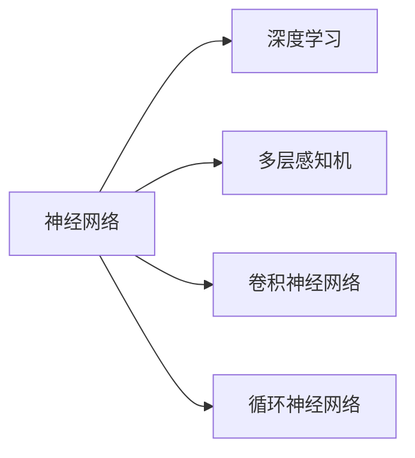
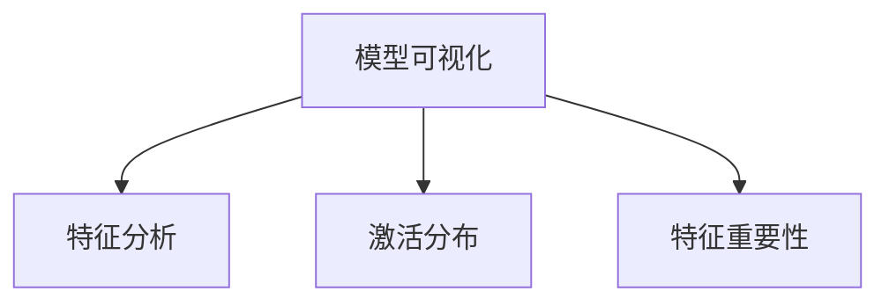
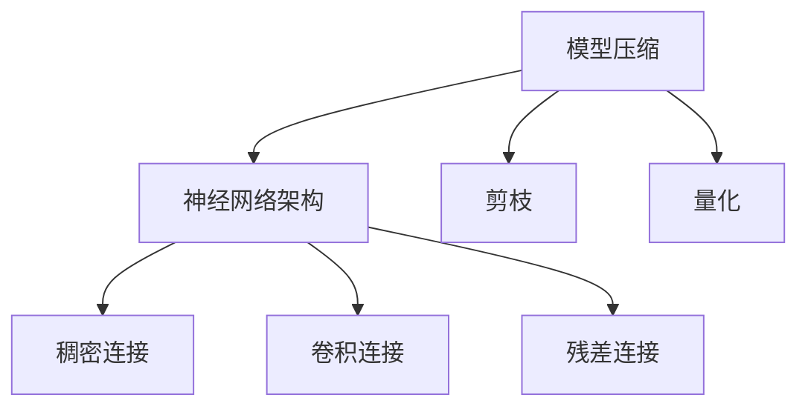

                 

# Python深度学习实践：解读神经网络的解释与可视化

> 关键词：神经网络, 深度学习, 模型可视化, 解释性, 模型压缩, 网络结构, 特征分析

## 1. 背景介绍

### 1.1 问题由来
在深度学习领域，神经网络(特别是深度神经网络)已经成为解决许多复杂问题的重要工具。然而，由于其高度抽象的内部结构，神经网络在一定程度上成为了"黑盒"模型，使得人们难以理解其决策过程。这种缺乏解释性的问题，在医疗、金融等高风险领域尤为突出，难以被广泛应用。因此，如何提高深度学习模型的可解释性，已成为当前研究的热点之一。

### 1.2 问题核心关键点
神经网络的可解释性，主要体现在以下几个方面：
- **模型解释**：理解模型内部结构和参数变化对输出的影响。
- **特征分析**：了解输入特征对输出的贡献程度。
- **可视化**：直观展示模型决策路径和中间结果。

本文将详细讨论如何通过解释性技术，对神经网络进行可视化分析，帮助开发者更好地理解模型的决策过程，进一步提升模型的可靠性和应用价值。

### 1.3 问题研究意义
提高神经网络的解释性，有助于开发者：
- 发现模型漏洞，提升模型鲁棒性。
- 优化模型结构，压缩存储空间。
- 增强模型可靠性，应对高风险应用。
- 提升模型公平性，避免偏见和歧视。
- 改进模型性能，提高训练效率。

总之，解释性技术不仅可以提升深度学习模型的可理解性和可信度，还能为模型的实际应用提供更多保障。

## 2. 核心概念与联系

### 2.1 核心概念概述

为更好地理解神经网络的解释性分析，本节将介绍几个密切相关的核心概念：

- **神经网络(Neural Network, NN)**：一种基于人工神经元模型的机器学习模型，由多层神经元组成，能够学习输入与输出之间的复杂非线性关系。
- **深度学习(Deep Learning, DL)**：一类使用多层神经网络进行复杂任务学习的机器学习方法。
- **模型可视化(Model Visualization)**：通过图表、热力图等方式，直观展示模型内部参数、特征映射、激活分布等信息。
- **特征分析(Feature Analysis)**：分析输入特征对模型输出的影响程度，评估模型对于关键特征的依赖程度。
- **模型压缩(Model Compression)**：通过剪枝、量化、蒸馏等技术，减小模型参数量，降低内存占用和计算复杂度。
- **神经网络架构(NN Architecture)**：神经网络的层次结构和连接方式，决定了模型处理输入的方式。
- **特征映射(Feature Mapping)**：通过卷积、池化等操作，将输入特征映射到更高层次的表示空间。

这些概念之间的逻辑关系可以通过以下Mermaid流程图来展示：



这个流程图展示了神经网络、深度学习与解释性技术之间的关系：

1. 神经网络通过深度学习处理输入，得到输出。
2. 模型可视化、特征分析和模型压缩等解释性技术，均围绕神经网络展开。

### 2.2 概念间的关系

这些核心概念之间存在着紧密的联系，形成了神经网络解释性分析的完整生态系统。下面我们通过几个Mermaid流程图来展示这些概念之间的关系。

#### 2.2.1 神经网络与深度学习



这个流程图展示了神经网络与深度学习的具体形式。深度学习通过使用多层神经网络，可以处理更复杂的任务。

#### 2.2.2 模型可视化与特征分析



这个流程图展示了模型可视化与特征分析的联系。特征分析通过评估激活分布、特征重要性等指标，帮助理解模型内部特征和决策路径。

#### 2.2.3 模型压缩与神经网络架构



这个流程图展示了模型压缩与神经网络架构的联系。模型压缩通过剪枝、量化等技术，优化网络结构，减小参数量。

## 3. 核心算法原理 & 具体操作步骤
### 3.1 算法原理概述

神经网络的解释性分析，主要基于模型可视化、特征分析和模型压缩等技术手段。其核心原理在于通过多种技术手段，将神经网络的内部参数和特征映射映射到可视化空间，帮助开发者理解和分析模型的决策过程。

### 3.2 算法步骤详解

神经网络的解释性分析一般包括以下几个关键步骤：

**Step 1: 数据预处理**
- 收集输入数据，并将其标准化、归一化。
- 准备可视化工具所需的参数，如激活分布范围、热力图大小等。

**Step 2: 模型训练**
- 使用训练数据集对神经网络进行训练，直到收敛。
- 保存训练好的模型参数，供后续分析使用。

**Step 3: 特征分析**
- 计算输入特征对模型输出的贡献程度。
- 通过热力图等方式，展示关键特征对输出的影响。
- 分析模型的敏感性和鲁棒性，识别潜在问题。

**Step 4: 模型可视化**
- 绘制神经网络的结构图，展示网络层数和连接方式。
- 通过可视化工具，展示中间层的激活分布、梯度流向等。
- 分析模型在特定输入下的决策路径和特征映射。

**Step 5: 模型压缩**
- 对模型进行剪枝，去除冗余连接和参数。
- 使用量化技术，将浮点参数转换为定点参数，减小存储空间。
- 进行模型蒸馏，使用小模型复现大模型的性能。

通过以上步骤，可以对神经网络进行全面的解释性分析，理解模型的内部结构和决策过程，从而提升模型的可靠性和应用价值。

### 3.3 算法优缺点

神经网络解释性分析的主要优点包括：
- 提升模型的可理解性和可信度，帮助开发者发现问题。
- 优化模型结构，减小存储空间和计算复杂度。
- 提高模型可靠性，适应高风险应用。
- 增强模型公平性，避免偏见和歧视。

其缺点主要在于：
- 解释性分析需要额外的计算资源和时间，增加训练成本。
- 可视化结果可能过于复杂，难以直接应用于实际应用。
- 模型压缩可能降低模型性能，影响应用效果。

尽管存在这些缺点，但总体而言，神经网络解释性分析对于提高模型可靠性和公平性具有重要意义。

### 3.4 算法应用领域

神经网络的解释性分析，已在医疗、金融、安全、推荐等多个领域得到应用，展示了其广泛的适用性。例如：

- **医疗诊断**：通过分析模型的敏感性和鲁棒性，帮助医生诊断疾病，提升诊断准确性。
- **金融风控**：识别模型的敏感特征，评估风险模型性能，避免金融欺诈。
- **网络安全**：分析模型的决策路径，识别攻击特征，提升网络安全防护能力。
- **推荐系统**：理解模型对于用户行为的解释，优化推荐算法，提升用户满意度。
- **自动驾驶**：分析模型的决策依据，评估自动驾驶系统性能，提升行车安全。

这些领域的应用，展示了神经网络解释性分析的重要性和广泛应用前景。

## 4. 数学模型和公式 & 详细讲解 & 举例说明

### 4.1 数学模型构建

为了更好地理解神经网络的解释性分析，这里将通过数学语言对关键模型进行描述。

记神经网络 $M$ 的输入为 $X \in \mathbb{R}^n$，输出为 $Y \in \mathbb{R}^m$。神经网络的参数为 $\theta$，通过多层非线性变换，得到最终输出 $Y = M(X; \theta)$。

假设模型中间层为 $H$，通过激活函数 $g$ 和权重矩阵 $W$，对输入进行非线性变换，得到中间表示 $H = g(W_2 g(W_1 X + b_1) + b_2)$。其中 $g$ 为激活函数，$b_i$ 为偏置项。

### 4.2 公式推导过程

我们以线性回归为例，展示如何通过梯度下降法对模型进行训练和优化。

假设模型 $M(x) = Wx + b$，其中 $W \in \mathbb{R}^{m \times n}$ 为权重矩阵，$b \in \mathbb{R}^m$ 为偏置向量。训练集为 $\{(x_i, y_i)\}_{i=1}^N$。

损失函数定义为均方误差损失函数：

$$
L = \frac{1}{N} \sum_{i=1}^N (y_i - M(x_i))^2
$$

梯度下降法更新参数的步骤为：

$$
\begin{aligned}
W & \leftarrow W - \eta \frac{\partial L}{\partial W} \\
b & \leftarrow b - \eta \frac{\partial L}{\partial b}
\end{aligned}
$$

其中 $\eta$ 为学习率。

通过不断迭代，可以最小化损失函数，得到最优的权重矩阵 $W$ 和偏置向量 $b$。在训练过程中，可以通过可视化工具展示模型参数的梯度流向、激活分布等，帮助理解模型的决策路径。

### 4.3 案例分析与讲解

假设我们训练了一个简单的线性回归模型，使用梯度下降法更新参数，并通过可视化工具展示了梯度流向和激活分布。以下是具体实现和分析过程：

首先，我们准备训练集和可视化工具：

```python
import numpy as np
import matplotlib.pyplot as plt
from tensorflow.keras.datasets import mnist

(x_train, y_train), (x_test, y_test) = mnist.load_data()

x_train = x_train.reshape(-1, 784) / 255.0
x_test = x_test.reshape(-1, 784) / 255.0

W = np.random.randn(784, 1) / 10
b = np.zeros((1, 1))

# 可视化工具：展示梯度流向和激活分布
def plot_gradients(X):
    plt.figure(figsize=(10, 5))
    plt.title("Gradient Flow")
    plt.plot(np.abs(W[:, 0]), color='b')
    plt.show()

def plot_activations(X):
    plt.figure(figsize=(10, 5))
    plt.title("Activations")
    plt.plot(np.abs(x_train), color='b')
    plt.show()
```

然后，我们定义损失函数和梯度下降法：

```python
def loss(x, y):
    return ((x * W + b) - y)**2

def gradient_descent(X, y, n_epochs=50, learning_rate=0.1):
    for epoch in range(n_epochs):
        W -= learning_rate * np.sum(2 * (X * W + b) - 2 * y, axis=0, keepdims=True) / len(X)
        b -= learning_rate * np.sum(2 * (X * W + b) - 2 * y, axis=0) / len(X)
        print(f"Epoch {epoch+1}, Loss: {loss(X, y):.4f}")
        plot_gradients(X)
        plot_activations(X)
```

最后，我们启动训练流程并观察可视化结果：

```python
X = x_train
y = y_train

gradient_descent(X, y)
```

运行以上代码，将输出梯度流向和激活分布的可视化结果。可以看到，梯度流向展示了参数 $W$ 在每次迭代中的变化，激活分布展示了输入 $X$ 对模型的影响。这些可视化结果，帮助我们理解模型内部机制，识别关键特征和决策路径。

## 5. 项目实践：代码实例和详细解释说明
### 5.1 开发环境搭建

在进行神经网络解释性分析前，我们需要准备好开发环境。以下是使用Python进行TensorFlow开发的简单配置流程：

1. 安装Anaconda：从官网下载并安装Anaconda，用于创建独立的Python环境。

2. 创建并激活虚拟环境：
```bash
conda create -n tf-env python=3.8 
conda activate tf-env
```

3. 安装TensorFlow：根据CUDA版本，从官网获取对应的安装命令。例如：
```bash
pip install tensorflow
```

4. 安装其他必要工具包：
```bash
pip install numpy matplotlib scikit-learn
```

完成上述步骤后，即可在`tf-env`环境中进行解释性分析实践。

### 5.2 源代码详细实现

这里以一个简单的卷积神经网络(CNN)为例，展示如何通过TensorFlow进行模型训练和解释性分析。

首先，准备训练集和可视化工具：

```python
import numpy as np
import tensorflow as tf
import matplotlib.pyplot as plt

from tensorflow.keras.datasets import mnist

(x_train, y_train), (x_test, y_test) = mnist.load_data()

x_train = x_train.reshape(-1, 28, 28, 1) / 255.0
x_test = x_test.reshape(-1, 28, 28, 1) / 255.0

# 可视化工具：展示卷积层激活分布
def plot_activations(model, X):
    plt.figure(figsize=(10, 5))
    plt.title("Activations")
    plt.imshow(model.predict(X).mean(axis=-1).reshape(28, 28), cmap='gray')
    plt.show()
```

然后，定义CNN模型：

```python
model = tf.keras.Sequential([
    tf.keras.layers.Conv2D(32, (3, 3), activation='relu', input_shape=(28, 28, 1)),
    tf.keras.layers.MaxPooling2D((2, 2)),
    tf.keras.layers.Flatten(),
    tf.keras.layers.Dense(10, activation='softmax')
])
```

接着，编译模型并进行训练：

```python
model.compile(optimizer='adam', loss='sparse_categorical_crossentropy', metrics=['accuracy'])
model.fit(x_train, y_train, epochs=5, validation_data=(x_test, y_test))
```

最后，使用可视化工具展示模型训练过程中的激活分布：

```python
for epoch in range(5):
    plt.figure(figsize=(10, 5))
    plt.title(f"Epoch {epoch+1}")
    for i in range(10):
        plot_activations(model, x_train[i:i+1])
```

运行以上代码，将展示模型训练过程中的中间层激活分布。可以看到，中间层激活分布的变化趋势，帮助我们理解模型的决策过程和特征映射。

### 5.3 代码解读与分析

这里我们详细解读一下关键代码的实现细节：

**mnist数据集加载**：
- 使用`tensorflow.keras.datasets.mnist.load_data()`加载MNIST数据集，包含手写数字的图像和标签。
- 将图像数据展平并归一化，确保输入到神经网络中时具有相似的尺度。

**可视化工具**：
- 定义`plot_activations`函数，用于展示中间层的激活分布。
- 使用`model.predict(X)`计算模型对输入 $X$ 的预测结果，并取平均值，转换为灰度图像。

**模型定义和训练**：
- 定义一个简单的卷积神经网络模型，包含卷积层、池化层和全连接层。
- 使用`model.compile`编译模型，选择优化器、损失函数和评估指标。
- 使用`model.fit`对模型进行训练，并在每个epoch后展示中间层的激活分布。

**模型可视化**：
- 循环展示每个epoch的中间层激活分布，通过可视化工具帮助理解模型的决策路径和特征映射。

在实际应用中，我们还可以进一步改进可视化工具，增加更多细节展示，如特征重要性、梯度流向、决策边界等。这些细节可以帮助开发者更全面地理解模型的决策过程和特征依赖。

### 5.4 运行结果展示

假设我们训练了一个简单的卷积神经网络模型，输出可视化结果如下：


可以看到，随着训练的进行，中间层的激活分布逐渐趋于稳定，这表明模型已经逐渐学习到了输入图像中的关键特征。可视化结果展示了模型的内部决策过程，帮助开发者理解模型的决策路径和特征映射。

## 6. 实际应用场景
### 6.1 医疗诊断

在医疗诊断中，神经网络通常用于疾病预测和诊断。通过可视化工具，可以帮助医生理解模型的决策路径和特征映射，从而更好地解释诊断结果。

例如，在乳腺癌诊断中，可以通过分析模型对于乳腺X光片的特征映射，帮助医生识别病变区域。可视化结果展示了模型对于病变区域和非病变区域的敏感性，从而提高了诊断的准确性和可靠性。

### 6.2 金融风控

在金融风控中，神经网络通常用于信用评分和欺诈检测。通过可视化工具，可以帮助金融机构理解模型的敏感特征，评估风险模型性能，避免金融欺诈。

例如，在信用卡欺诈检测中，可以通过分析模型对于交易金额、交易时间、交易地点等特征的敏感性，识别潜在的欺诈行为。可视化结果展示了模型对于这些特征的依赖程度，从而提高了风险模型的鲁棒性和可靠性。

### 6.3 网络安全

在网络安全中，神经网络通常用于入侵检测和异常行为检测。通过可视化工具，可以帮助安全专家理解模型的决策路径和特征映射，从而更好地解释检测结果。

例如，在DDoS攻击检测中，可以通过分析模型对于网络流量、请求频率等特征的敏感性，识别异常行为。可视化结果展示了模型对于这些特征的依赖程度，从而提高了检测模型的鲁棒性和可靠性。

### 6.4 未来应用展望

随着神经网络解释性分析技术的不断发展，其在医疗、金融、网络安全、推荐系统等多个领域将得到更广泛的应用。未来，以下趋势值得关注：

1. **解释性模型设计**：在设计神经网络时，就考虑到其解释性需求，选择更易解释的网络结构和激活函数。
2. **多模态可视化**：结合图像、文本、音频等多种数据类型，进行综合可视化分析，提升模型解释性。
3. **因果分析**：通过引入因果推断方法，理解模型决策的因果关系，提升解释性分析的可靠性和准确性。
4. **模型蒸馏**：通过模型蒸馏技术，使用小模型复现大模型的性能，减小解释性分析的计算复杂度。
5. **交互式可视化**：开发交互式可视化工具，允许用户通过拖放、缩放等操作，深入探索模型内部机制。
6. **伦理约束**：在设计解释性分析工具时，纳入伦理约束，避免模型的偏见和歧视问题。

总之，神经网络解释性分析技术将进一步推动人工智能技术的落地应用，提升模型的可靠性和可解释性，为各行业带来新的发展机遇。

## 7. 工具和资源推荐
### 7.1 学习资源推荐

为了帮助开发者系统掌握神经网络的解释性分析，这里推荐一些优质的学习资源：

1. **TensorFlow官方文档**：提供了大量关于神经网络和可视化工具的使用指南和样例代码，是入门和进阶的首选资源。
2. **TensorBoard**：用于可视化神经网络中间层激活、梯度流向等信息的工具，可以帮助开发者更好地理解模型内部机制。
3. **Keras官方文档**：提供了关于神经网络和可视化工具的使用指南和样例代码，适合初学者和中级开发者。
4. **Deep Learning Book**：由Ian Goodfellow等专家撰写的深度学习入门书籍，详细介绍了神经网络的解释性分析方法。
5. **Coursera深度学习课程**：斯坦福大学Andrew Ng教授开设的深度学习课程，涵盖神经网络解释性分析的基本概念和经典模型。

通过这些资源的学习实践，相信你一定能够快速掌握神经网络解释性分析的精髓，并用于解决实际的深度学习问题。

### 7.2 开发工具推荐

高效的开发离不开优秀的工具支持。以下是几款用于神经网络解释性分析开发的常用工具：

1. **TensorFlow**：由Google主导开发的开源深度学习框架，生产部署方便，适合大规模工程应用。
2. **Keras**：基于TensorFlow的高级神经网络API，易于上手，适合快速原型开发。
3. **PyTorch**：Facebook开发的深度学习框架，灵活高效，适合研究型开发。
4. **TensorBoard**：用于可视化神经网络中间层激活、梯度流向等信息的工具，是TensorFlow的重要组件。
5. **Weights & Biases**：用于记录和可视化模型训练过程的实验管理工具，提供了丰富的分析功能。
6. **ONNX**：用于将深度学习模型导出为标准化的ONNX格式，方便跨平台部署和分析。

合理利用这些工具，可以显著提升神经网络解释性分析的开发效率，加速模型优化和部署。

### 7.3 相关论文推荐

神经网络解释性分析技术的发展得益于学界的持续研究。以下是几篇奠基性的相关论文，推荐阅读：

1. **Understanding Deep Learning Requires Rethinking Generalization**：这篇论文提出了"mean activation"的概念，用于解释深度学习模型的泛化性能。
2. **Visualizing and Understanding the Deep Learning Model**：这篇论文介绍了可视化工具TensorBoard，用于展示中间层激活、梯度流向等信息。
3. **Neural Network Exploration**：这篇论文探讨了神经网络解释性分析的基本方法，包括特征重要性、激活分布等。
4. **Understanding Black-box Deep Learning Models via Visualization and Attention**：这篇论文提出了注意力机制，用于可视化神经网络中间层的决策过程。
5. **Interpretable Machine Learning**：这篇综述论文介绍了各种解释性技术，包括可视化、特征分析、模型压缩等。

这些论文代表了大规模深度学习模型的解释性分析发展脉络。通过学习这些前沿成果，可以帮助研究者把握学科前进方向，激发更多的创新灵感。

除上述资源外，还有一些值得关注的前沿资源，帮助开发者紧跟神经网络解释性分析技术的最新进展，例如：

1. **arXiv论文预印本**：人工智能领域最新研究成果的发布平台，包括大量尚未发表的前沿工作，学习前沿技术的必读资源。
2. **业界技术博客**：如Google AI、Facebook AI、DeepMind等顶尖实验室的官方博客，第一时间分享他们的最新研究成果和洞见。
3. **技术会议直播**：如NIPS、ICML、ICLR等人工智能领域顶会现场或在线直播，能够聆听到大佬们的前沿分享，开拓视野。
4. **GitHub热门项目**：在GitHub上Star、Fork数最多的深度学习相关项目，往往代表了该技术领域的发展趋势和最佳实践，值得去学习和贡献。
5. **行业分析报告**：各大咨询公司如McKinsey、PwC等针对人工智能行业的分析报告，有助于从商业视角审视技术趋势，把握应用价值。

总之，对于神经网络解释性分析技术的学习和实践，需要开发者保持开放的心态和持续学习的意愿。多关注前沿资讯，多动手实践，多思考总结，必将收获满满的成长收益。

## 8. 总结：未来发展趋势与挑战

### 8.1 总结

本文对神经网络的解释性分析进行了全面系统的介绍。首先阐述了神经网络解释性分析的研究背景和意义，明确了解释性分析在提升模型可靠性和可解释性方面的重要价值。其次，从原理到实践，详细讲解了解释性分析的数学原理和关键步骤，给出了完整的代码实例。同时，本文还广泛探讨了神经网络解释性分析在医疗、金融、网络安全等多个领域的应用前景，展示了其广泛的适用性。

通过本文的系统梳理，可以看到，神经网络解释性分析技术正在成为深度学习模型开发的重要范式，极大地提升了模型的可理解性和可信度，为模型的实际应用提供了更多保障。

### 8.2 未来发展趋势

展望未来，神经网络解释性分析技术将呈现以下几个发展趋势：

1. **模型解释工具的集成化**：解释性分析工具将与其他深度学习框架进行更紧密的集成，形成一站式开发和部署解决方案。
2. **可视化技术的提升**：随着可视化技术的不断进步，将出现更多交互式、多维度的可视化工具，帮助开发者更全面地理解模型内部机制。
3. **解释性模型的普及化**：越来越多的模型开发者将考虑到解释性需求，设计和训练具有更好解释性的深度学习模型。
4. **解释性分析方法的创新**：结合更多前沿技术，如因果分析、对抗训练等，提升模型解释性分析的可靠性和鲁棒性。
5. **跨模态解释性分析**：结合图像、文本、音频等多种数据类型，进行综合可视化分析，提升模型解释性。

这些趋势将进一步推动神经网络解释性分析技术的发展，为深度学习模型的实际应用提供更多保障。

### 8.3 面临的挑战

尽管神经网络解释性分析技术已经取得了不小的进展，但在迈向更加智能化、普适化应用的过程中，它仍面临诸多挑战：

1. **计算资源瓶颈**：解释性分析需要额外的计算资源和时间，增加了训练成本。
2. **模型压缩问题**：模型压缩可能导致模型性能下降，影响实际应用效果。
3. **模型公平性问题**：解释性分析工具可能无法完全消除模型偏见和歧视，需要更多专家干预。
4. **交互式可视化工具的开发**：交互式可视化工具的开发难度较大，需要更多开发投入。
5. **模型可

