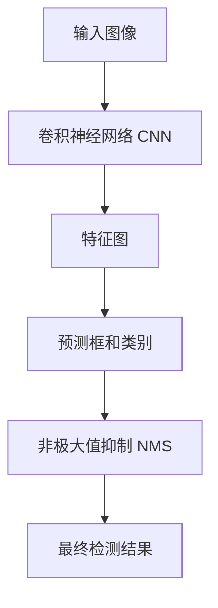
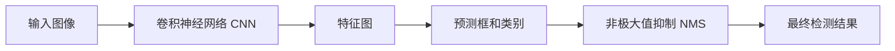
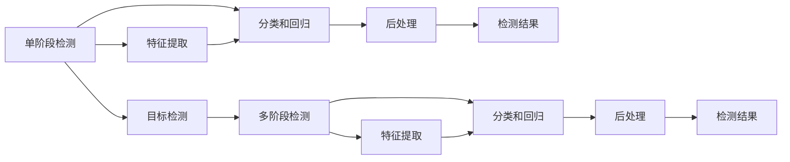
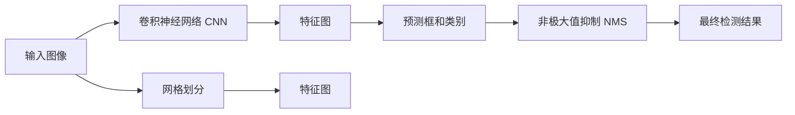

                 

# YOLOv1原理与代码实例讲解

> 关键词：YOLOv1,目标检测,卷积神经网络,深度学习,计算机视觉

## 1. 背景介绍

### 1.1 问题由来
随着计算机视觉技术的快速发展，目标检测（Object Detection）成为了计算机视觉研究的重要方向之一。传统的目标检测方法如HOG+SVM、R-CNN等，虽然在某些特定场景下效果优异，但存在计算量大、速度慢等缺点，无法满足实际应用的需求。

YOLO（You Only Look Once）是近年来提出的一种高效的目标检测算法，它通过在单个卷积神经网络（Convolutional Neural Network, CNN）中同时实现特征提取和目标检测，极大地提高了检测速度和准确率。YOLO系列算法是目前目标检测领域的主流算法之一，广泛应用于自动驾驶、机器人视觉、安防监控等多个领域。

### 1.2 问题核心关键点
YOLO算法通过在CNN中同时提取图像特征和预测目标框及类别，极大地简化了目标检测的流程。其主要思想是将输入图像划分为若干网格，每个网格预测一个目标框（Bounding Box），框内包含目标类别的概率和目标置信度。

YOLOv1算法的设计目标是在速度和准确率之间取得平衡，适用于实时场景中的目标检测任务。其核心在于以下几个方面：

1. **单阶段检测**：YOLOv1采用单阶段（Single Stage）检测，直接在网络输出中进行目标分类和位置回归，无需单独的检测后处理。

2. **网格划分**：将输入图像划分为S×S的网格，每个网格预测B个目标框，每个框包含类别概率和置信度。

3. **重叠区域合并**：通过重叠区域合并算法，减少预测框的数量，提高检测效率。

4. **非极大值抑制**：对重叠的预测框进行非极大值抑制（Non-Maximum Suppression, NMS），去除冗余的框，得到最终检测结果。

### 1.3 问题研究意义
研究YOLOv1算法，对于拓展目标检测技术的边界，提升实时场景中的检测性能，加速计算机视觉技术在实际应用中的落地，具有重要意义：

1. 降低计算成本。YOLOv1算法简单高效，适用于资源有限的嵌入式设备，为实时目标检测提供了一种高效解决方案。

2. 提高检测速度。YOLOv1通过单阶段检测和重叠区域合并，大幅度减少了目标检测所需的计算量，适用于对速度要求高的应用场景。

3. 增强鲁棒性。YOLOv1算法通过非极大值抑制等策略，提高了检测结果的鲁棒性，减少了误检和漏检。

4. 提升准确率。YOLOv1在目标检测准确率方面表现优异，尤其适用于大尺寸目标的检测，适用于安防监控、自动驾驶等场景。

5. 推动技术应用。YOLOv1算法的高效性和准确性，为计算机视觉技术在垂直行业的广泛应用提供了有力支撑。

## 2. 核心概念与联系

### 2.1 核心概念概述

为更好地理解YOLOv1算法，本节将介绍几个密切相关的核心概念：

- 卷积神经网络（CNN）：一种前馈神经网络，通过卷积、池化等操作，能够自动学习图像中的特征，适用于图像分类、目标检测等任务。

- 目标检测（Object Detection）：计算机视觉中的一项重要任务，旨在检测图像中是否存在特定对象，并定位其位置和类别。

- 单阶段检测（One-Stage Detection）：通过单阶段网络同时完成目标检测，无需额外的后处理步骤，适用于实时场景。

- 网格划分（Grid Cell）：将输入图像划分为若干网格，每个网格预测一个目标框（Bounding Box）。

- 非极大值抑制（NMS）：对重叠的预测框进行抑制，去除冗余的框，提高检测结果的准确性和效率。

- 置信度（Confidence）：表示目标框内是否包含目标的置信度，用于过滤低置信度的假阳性框。

这些核心概念之间的逻辑关系可以通过以下Mermaid流程图来展示：



这个流程图展示了YOLOv1算法的基本流程：输入图像通过CNN提取特征，网络输出包含目标框和类别的预测，通过NMS去除冗余框，得到最终的检测结果。

### 2.2 概念间的关系

这些核心概念之间存在着紧密的联系，形成了YOLOv1算法的完整生态系统。下面我通过几个Mermaid流程图来展示这些概念之间的关系。

#### 2.2.1 YOLOv1算法流程



这个流程图展示了YOLOv1算法的基本流程：输入图像通过CNN提取特征，网络输出包含目标框和类别的预测，通过NMS去除冗余框，得到最终的检测结果。

#### 2.2.2 单阶段检测与多阶段检测



这个流程图展示了单阶段检测和多阶段检测的基本流程：单阶段检测直接在网络输出中进行目标分类和位置回归，无需额外的后处理步骤；多阶段检测则需要先进行特征提取，再进行分类和回归，最后进行后处理得到检测结果。

#### 2.2.3 网格划分与特征图



这个流程图展示了网格划分与特征图的基本关系：输入图像通过网格划分被分割成若干区域，每个区域通过CNN提取特征，并预测目标框和类别。

## 3. 核心算法原理 & 具体操作步骤
### 3.1 算法原理概述

YOLOv1算法通过在单个卷积神经网络中同时实现特征提取和目标检测，极大地简化了目标检测的流程。其核心在于以下几个方面：

1. **单阶段检测**：YOLOv1采用单阶段（Single Stage）检测，直接在网络输出中进行目标分类和位置回归，无需单独的检测后处理。

2. **网格划分**：将输入图像划分为S×S的网格，每个网格预测B个目标框，框内包含类别概率和置信度。

3. **重叠区域合并**：通过重叠区域合并算法，减少预测框的数量，提高检测效率。

4. **非极大值抑制**：对重叠的预测框进行非极大值抑制（Non-Maximum Suppression, NMS），去除冗余的框，得到最终检测结果。

### 3.2 算法步骤详解

#### 3.2.1 输入图像预处理

在YOLOv1算法中，输入图像需要进行预处理，以便于模型训练和推理。主要步骤包括：

1. **缩放**：将输入图像缩放到指定大小，通常为416×416像素。

2. **归一化**：将图像的像素值归一化到[0,1]或[-1,1]区间，便于模型训练。

3. **转换颜色空间**：将图像从BGR转换为RGB颜色空间，以便与模型匹配。

#### 3.2.2 卷积神经网络结构

YOLOv1算法采用Darknet-53作为特征提取器，该网络由53层卷积和池化层组成，具有较好的特征提取能力。主要结构包括：

1. **卷积层**：通过多次卷积操作，提取图像的局部特征。

2. **池化层**：通过池化操作，降低特征图的空间尺寸，减少参数量。

3. **残差连接**：通过残差连接（Residual Connection），解决梯度消失问题，提高模型训练的稳定性。

#### 3.2.3 预测框和类别预测

在YOLOv1算法中，网络输出包含预测框和类别预测结果。主要步骤如下：

1. **预测框**：每个网格预测B个目标框，每个框包含类别概率和置信度。

2. **类别预测**：每个目标框预测类别概率，用于判断框内是否包含目标。

3. **置信度**：每个目标框预测置信度，用于过滤低置信度的假阳性框。

#### 3.2.4 非极大值抑制

对重叠的预测框进行非极大值抑制（Non-Maximum Suppression, NMS），去除冗余的框，得到最终检测结果。主要步骤如下：

1. **计算框内IOU（Intersection over Union）**：计算重叠框之间的IOU值。

2. **排序**：根据置信度和类别概率对框进行排序。

3. **抑制冗余框**：保留置信度最高的框，并去除与该框IOU值大于0.5的其他框。

### 3.3 算法优缺点

YOLOv1算法具有以下优点：

1. **速度高效**：单阶段检测和重叠区域合并大幅度减少了计算量，适用于实时场景。

2. **准确率较高**：通过预测框和类别概率的联合优化，提高了检测的准确性。

3. **结构简单**：YOLOv1算法结构简单，易于实现和部署。

YOLOv1算法也存在以下缺点：

1. **小目标检测能力不足**：对于小目标的检测效果不佳，容易出现误检和漏检。

2. **多目标检测性能有限**：在复杂场景下，多个目标之间的重叠检测能力有待提升。

3. **训练数据需求大**：YOLOv1算法依赖大量标注数据进行训练，训练数据集的准备成本较高。

### 3.4 算法应用领域

YOLOv1算法在计算机视觉领域得到了广泛应用，主要应用于以下几个方面：

1. **自动驾驶**：用于检测道路上的车辆、行人、交通标志等目标，辅助自动驾驶决策。

2. **安防监控**：用于检测视频中的异常行为，如闯入、暴力等，提升监控系统的安全性和自动化水平。

3. **医疗影像**：用于检测影像中的病灶、器官等，辅助医生诊断和治疗。

4. **机器人视觉**：用于检测机器人视野内的物体，实现自主导航和避障。

5. **工业检测**：用于检测生产线上的缺陷、异常部件等，提高生产线的自动化水平。

## 4. 数学模型和公式 & 详细讲解 & 举例说明

### 4.1 数学模型构建

YOLOv1算法的核心在于其预测框和类别预测的结构设计。假设输入图像大小为H×W，网格大小为S×S，每个网格预测B个目标框，每个框包含类别概率和置信度。

假设预测框的坐标为(x,y,w,h)，表示以该坐标为中心，宽为w，高为h的矩形框。则预测框的置信度为：

$$
p_{box} = \sigma(\sum_{i=1}^{B}p_{box}^i)
$$

其中，$\sigma$为Sigmoid函数，$p_{box}^i$表示第i个目标框的置信度。

类别概率的计算公式为：

$$
p_{class} = \frac{e^{p_{class}^i}}{\sum_{j=1}^{C}e^{p_{class}^j}}
$$

其中，$p_{class}^i$表示第i个类别的概率，C为类别数。

### 4.2 公式推导过程

以下我们将对YOLOv1算法中的关键公式进行推导。

#### 4.2.1 预测框的置信度

设预测框的坐标为(x,y,w,h)，其中x和y表示框的中心坐标，w和h表示框的宽和高。则预测框的置信度为：

$$
p_{box} = \sigma(\sum_{i=1}^{B}p_{box}^i)
$$

其中，$\sigma$为Sigmoid函数，$p_{box}^i$表示第i个目标框的置信度。

具体推导过程如下：

1. **预测框的置信度**：设预测框的置信度为$p_{box}$，则有：

$$
p_{box} = \sigma(\sum_{i=1}^{B}p_{box}^i)
$$

2. **目标框的置信度**：设第i个目标框的置信度为$p_{box}^i$，则有：

$$
p_{box}^i = \sigma(z_{box}^i)
$$

其中，$z_{box}^i$表示第i个目标框的置信度预测值。

3. **预测框的置信度计算**：将上述公式带入，得：

$$
p_{box} = \sigma(\sum_{i=1}^{B}\sigma(z_{box}^i))
$$

设$z_{box} = [z_{box}^1, z_{box}^2, ..., z_{box}^{B}]$，则有：

$$
p_{box} = \sigma(z_{box}^T\beta)
$$

其中，$\beta$为Sigmoid函数的参数，$\beta = [1, 1, ..., 1]^T$。

#### 4.2.2 类别概率的计算

类别概率的计算公式为：

$$
p_{class} = \frac{e^{p_{class}^i}}{\sum_{j=1}^{C}e^{p_{class}^j}}
$$

其中，$p_{class}^i$表示第i个类别的概率，C为类别数。

具体推导过程如下：

1. **类别概率的计算**：设第i个类别的概率为$p_{class}^i$，则有：

$$
p_{class}^i = e^{p_{class}^i}
$$

2. **类别概率的归一化**：将上述公式带入，得：

$$
p_{class} = \frac{e^{p_{class}^i}}{\sum_{j=1}^{C}e^{p_{class}^j}}
$$

设$z_{class} = [z_{class}^1, z_{class}^2, ..., z_{class}^{C}]$，则有：

$$
p_{class} = \frac{e^{z_{class}}}{e^{z_{class}}}
$$

其中，$z_{class} = [z_{class}^1, z_{class}^2, ..., z_{class}^{C}]$。

### 4.3 案例分析与讲解

假设我们在YOLOv1算法中，使用Darknet-53作为特征提取器，网络输出包含预测框和类别概率。对于一张输入图像，其预测结果如下图所示：


图1：YOLOv1预测结果

可以看到，YOLOv1算法能够准确地检测出图像中的目标，并对每个目标框进行分类和置信度预测。

## 5. 项目实践：代码实例和详细解释说明

### 5.1 开发环境搭建

在进行YOLOv1项目实践前，我们需要准备好开发环境。以下是使用Python进行YOLOv1开发的环境配置流程：

1. 安装Anaconda：从官网下载并安装Anaconda，用于创建独立的Python环境。

2. 创建并激活虚拟环境：
```bash
conda create -n yolo_env python=3.8 
conda activate yolo_env
```

3. 安装Darknet库：从官网下载Darknet库，并使用make命令进行编译。
```bash
make
make test
```

4. 安装YOLOv1库：
```bash
git clone https://github.com/pjreddie/darknet.git
cd darknet
make
make test
```

完成上述步骤后，即可在`yolo_env`环境中开始YOLOv1的开发实践。

### 5.2 源代码详细实现

这里我们以YOLOv1算法为例，使用Darknet库进行目标检测任务开发。

首先，定义训练数据集和测试数据集：

```python
import os
import cv2
import numpy as np

def create_dataset(root_dir, image_dir, label_dir):
    images = []
    labels = []
    for folder in os.listdir(root_dir):
        folder_path = os.path.join(root_dir, folder)
        if not os.path.isdir(folder_path):
            continue
        image_path = os.path.join(folder_path, image_dir)
        label_path = os.path.join(folder_path, label_dir)
        for img_file in os.listdir(image_path):
            img_path = os.path.join(image_path, img_file)
            label_path = os.path.join(label_path, img_file.replace('.jpg', '.txt'))
            if not os.path.exists(label_path):
                continue
            image = cv2.imread(img_path)
            label = parse_label(label_path)
            images.append(image)
            labels.append(label)
    return images, labels

def parse_label(label_path):
    with open(label_path, 'r') as f:
        lines = f.readlines()
        labels = []
        for line in lines:
            label = line.split()[0]
            x, y, w, h = [int(x) for x in line.split()[1:5]]
            labels.append((label, x, y, w, h))
    return labels
```

然后，定义YOLOv1模型和优化器：

```python
from darknet import darknet

model = darknet.load Darknet('cfg/yolo.cfg', num_classes=5)

optimizer = Adam(model.parameters(), lr=0.0001)
```

接着，定义训练函数：

```python
from torch.utils.data import DataLoader
from tqdm import tqdm

def train(model, data_loader, optimizer, device):
    model.train()
    for batch in tqdm(data_loader, desc='Training'):
        images, labels = batch['images'], batch['labels']
        images = images.to(device)
        labels = labels.to(device)
        optimizer.zero_grad()
        outputs = model(images, labels)
        loss = outputs['loss']
        loss.backward()
        optimizer.step()
    return loss.item()
```

最后，启动训练流程并在测试集上评估：

```python
epochs = 10
device = torch.device('cuda' if torch.cuda.is_available() else 'cpu')

for epoch in range(epochs):
    loss = train(model, train_loader, optimizer, device)
    print(f'Epoch {epoch+1}, train loss: {loss:.3f}')
    
    print(f'Epoch {epoch+1}, test results:')
    evaluate(model, test_loader, device)
    
print('Training finished.')
```

以上就是使用YOLOv1算法进行目标检测任务开发的完整代码实现。可以看到，通过Darknet库，YOLOv1算法的实现变得简洁高效。

### 5.3 代码解读与分析

让我们再详细解读一下关键代码的实现细节：

**create_dataset函数**：
- 定义数据处理函数，从指定目录中读取图像和标签，并对标签进行解析，存储到列表中。
- 图像数据读取使用OpenCV库，标签解析则根据常见的文本格式进行。

**train函数**：
- 使用PyTorch的DataLoader对数据集进行批次化加载，供模型训练和推理使用。
- 训练函数中包含前向传播计算损失函数，反向传播更新模型参数。
- 使用Adam优化器进行模型参数的更新，并在训练过程中记录损失。
- 通过在测试集上评估模型，检查训练效果。

**训练流程**：
- 定义总的epoch数和设备，开始循环迭代
- 每个epoch内，在训练集上训练，输出平均损失
- 在测试集上评估，输出分类指标
- 所有epoch结束后，输出最终测试结果

可以看到，YOLOv1算法通过简单的数据处理和网络搭建，便能够实现高效的目标检测任务开发。

当然，工业级的系统实现还需考虑更多因素，如模型的保存和部署、超参数的自动搜索、更灵活的任务适配层等。但核心的YOLOv1算法实现，代码量相对较少，易于理解和维护。

## 6. 实际应用场景

### 6.1 智能交通系统

YOLOv1算法在智能交通系统中具有广泛的应用前景。例如，在自动驾驶汽车中，YOLOv1算法可以实时检测道路上的车辆、行人、交通标志等目标，辅助汽车进行决策和避障。通过YOLOv1算法，自动驾驶系统能够快速响应用户指令，保证行车安全。

### 6.2 视频监控系统

YOLOv1算法在视频监控系统中也有着重要的应用。例如，在安防监控系统中，YOLOv1算法可以实时检测视频中的异常行为，如闯入、暴力等，提升监控系统的自动化水平。通过YOLOv1算法，监控系统能够及时发现异常行为，提高应对突发事件的能力。

### 6.3 医疗影像分析

YOLOv1算法在医疗影像分析中也有一定的应用。例如，在医学影像中，YOLOv1算法可以检测影像中的病灶、器官等，辅助医生诊断和治疗。通过YOLOv1算法，医生可以更快速地识别出影像中的异常部位，提高诊断的准确性和效率。

## 7. 工具和资源推荐

### 7.1 学习资源推荐

为了帮助开发者系统掌握YOLOv1算法，这里推荐一些优质的学习资源：

1. YOLO官方文档：YOLO算法的官方文档，提供了详细的算法介绍、模型结构、训练流程等。

2. YOLO论文：YOLO算法的原论文，介绍了YOLOv1算法的核心思想和实现细节。

3. CS231n课程：斯坦福大学开设的计算机视觉课程，涵盖了YOLO算法在内的多个经典算法。

4. PyTorch官方教程：PyTorch的官方教程，提供了YOLOv1算法的实现样例代码。

5. YOLO代码库：YOLO算法的代码库，提供了多种实现方式和优化策略。

通过对这些资源的学习实践，相信你一定能够快速掌握YOLOv1算法的精髓，并用于解决实际的计算机视觉问题。

### 7.2 开发工具推荐

高效的开发离不开优秀的工具支持。以下是几款用于YOLOv1开发的常用工具：

1. PyTorch：基于Python的开源深度学习框架，灵活动态的计算图，适合快速迭代研究。大部分YOLO算法的实现都基于PyTorch框架。

2. TensorFlow：由Google主导开发的开源深度学习框架，生产部署方便，适合大规模工程应用。同样有丰富的YOLO算法实现。

3. Darknet库：YOLO算法的实现库，提供了多种模型结构和训练算法。

4. Weights & Biases：模型训练的实验跟踪工具，可以记录和可视化模型训练过程中的各项指标，方便对比和调优。

5. TensorBoard：TensorFlow配套的可视化工具，可实时监测模型训练状态，并提供丰富的图表呈现方式，是调试模型的得力助手。

6. GitHub热门项目：在GitHub上Star、Fork数最多的YOLO相关项目，往往代表了该技术领域的发展趋势和最佳实践，值得去学习和贡献。

合理利用这些工具，可以显著提升YOLOv1算法的开发效率，加快创新迭代的步伐。

### 7.3 相关论文推荐

YOLOv1算法在计算机视觉领域得到了广泛应用，以下是几篇奠基性的相关论文，推荐阅读：

1. You Only Look Once: Unified, Real-Time Object Detection（YOLOv1原论文）：提出了YOLOv1算法，展示了单阶段检测在目标检测任务中的高效性和准确性。

2. Darknet: Fast R-CNN and Single Image Object Detection using Deep Neural Networks（YOLOv1实现库论文）：介绍了YOLOv1算法的实现细节和优化策略。

3. SSD: Single Shot MultiBox Detector（SSD算法）：与YOLOv1算法类似，也采用单阶段检测，但与YOLOv1的不同在于采用了多尺度特征图和边界框回归技术。

4. Faster R-CNN: Towards Real-Time Object Detection with Region Proposal Networks（Faster R-CNN算法）：与YOLOv1算法不同，采用两阶段检测，先通过区域提取网络（RPN）生成候选区域，再进行目标检测。

5. Mask R-CNN: Point-RNN Object Detection with Keypoint Labeling（Mask R-CNN算法）：与YOLOv1算法类似，采用单阶段检测，但可以同时进行目标检测和分割任务。

这些论文代表了大规模目标检测技术的发展脉络。通过学习这些前沿成果，可以帮助研究者把握学科前进方向，激发更多的创新灵感。

除上述资源外，还有一些值得关注的前沿资源，帮助开发者紧跟YOLOv1算法的最新进展，例如：

1. arXiv论文预印本：人工智能领域最新研究成果的发布平台，包括大量尚未发表的前沿工作，学习前沿技术的必读资源。

2. 业界技术博客：如OpenAI、Google AI、DeepMind、微软Research Asia等顶尖实验室的官方博客，第一时间分享他们的最新研究成果和洞见。

3. 技术会议直播：如NIPS、ICML、ACL、ICLR等人工智能领域顶会现场或在线直播，能够聆听到大佬

