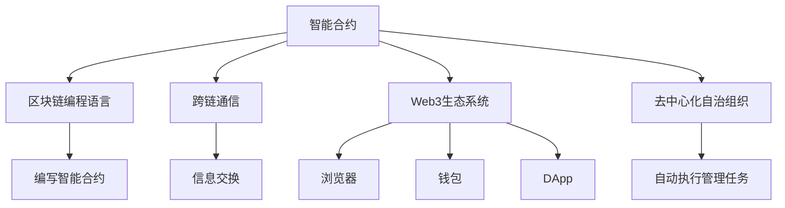

                 

# 【LangChain编程：从入门到实践】LangChain的未来展望

> 关键词：LangChain, 区块链, 智能合约, 编程语言, 未来展望

## 1. 背景介绍

### 1.1 问题由来
LangChain是一种新型的区块链编程语言，它由Parity Technologies开发，旨在简化智能合约开发过程，提高安全性，并提供更友好的开发体验。随着区块链技术的发展，越来越多的开发者开始探索如何用代码来定义、执行和维护智能合约。LangChain的出现，正是为了满足这一需求，成为新一代智能合约的开发标准。

### 1.2 问题核心关键点
LangChain的核心目标是提供一个简洁、易于学习和使用的智能合约开发平台，同时保证代码的安全性和可验证性。其核心优势包括：
- 提供简洁的编程模型，降低智能合约的编写难度。
- 支持跨链通信和智能合约之间的互操作性。
- 提供一套完整的网络协议和标准，以支持智能合约的运行。

### 1.3 问题研究意义
研究LangChain的未来展望，对于推动区块链技术的发展，尤其是在智能合约领域的创新，具有重要意义。LangChain不仅能够降低智能合约的开发门槛，还能提升系统的安全性和可靠性，为区块链生态系统的进一步发展奠定基础。通过掌握LangChain的最新动态和未来趋势，开发者可以更好地应对未来智能合约开发的需求。

## 2. 核心概念与联系

### 2.1 核心概念概述

为了更好地理解LangChain的未来展望，我们需要先了解以下几个核心概念：

- **智能合约**：指在区块链上自动执行和运行的代码，通常用于执行金融交易、自动化决策等。
- **跨链通信**：指不同区块链之间通过某种机制进行信息交换和数据传输。
- **区块链编程语言**：专门用于编写智能合约的编程语言，如Solidity、Vyper、LangChain等。
- **Web3生态系统**：基于区块链技术的生态系统，包括浏览器、钱包、DApp等。
- **去中心化自治组织(DAO)**：通过智能合约自动执行管理任务的组织形式。

这些概念之间的关系可以通过以下Mermaid流程图来展示：



这个流程图展示了智能合约、区块链编程语言、跨链通信、Web3生态系统和DAO之间的关系，以及它们在智能合约开发和应用中的作用。

### 2.2 概念间的关系

这些核心概念之间存在着紧密的联系，形成了LangChain编程的完整生态系统。以下是它们之间的逻辑关系和作用：

- 智能合约是区块链编程语言编写的具体实现，通过编写智能合约，可以实现复杂的功能逻辑。
- 跨链通信提供了不同区块链之间交互的能力，使得智能合约可以在多个区块链上运行，增强了系统的互操作性。
- Web3生态系统提供了用户界面、钱包、DApp等工具，使得智能合约的使用更加便捷。
- DAO通过智能合约自动化管理任务，提高了组织运行的效率和透明度。

通过理解这些概念之间的关系，我们可以更好地把握LangChain的未来发展方向，探索其在智能合约和区块链生态系统中的应用潜力。

## 3. 核心算法原理 & 具体操作步骤
### 3.1 算法原理概述

LangChain的编程模型基于事件驱动的设计，通过事件触发器的机制来实现智能合约的逻辑控制。其主要算法原理如下：

- **事件驱动**：智能合约根据预定义的事件触发器自动执行特定的逻辑操作。
- **状态变化**：智能合约通过记录和更新状态，实现对交易和用户数据的持久化存储。
- **跨链通信**：利用跨链协议，实现不同区块链之间的数据传输和交互。

### 3.2 算法步骤详解

LangChain编程的核心步骤包括：

1. **编写智能合约**：使用LangChain编写智能合约，定义合约的初始状态、触发器、逻辑操作等。
2. **部署智能合约**：将编写的智能合约部署到区块链上，使其成为可执行的代码。
3. **触发事件**：通过调用智能合约的事件触发器，触发特定的逻辑操作。
4. **更新状态**：根据事件触发器的执行结果，更新智能合约的状态。

### 3.3 算法优缺点

LangChain编程的优点包括：

- 简化智能合约的编写和部署过程。
- 提供更安全、可验证的代码执行环境。
- 支持跨链通信，增强系统的互操作性。

其缺点主要包括：

- 需要较高的技术门槛，特别是对于初学者来说。
- 代码执行的性能和效率可能受到区块链网络性能的限制。
- 跨链通信的安全性问题尚需进一步研究和解决。

### 3.4 算法应用领域

LangChain编程已经在多个领域得到了应用，例如：

- **金融交易**：通过智能合约自动执行交易规则，提高交易的透明度和安全性。
- **供应链管理**：利用智能合约记录和验证供应链中的关键事件，确保供应链的追溯和透明。
- **物联网**：通过智能合约实现物联网设备的自动化管理和控制。
- **身份认证**：使用智能合约进行身份验证和授权，提高系统安全性。

## 4. 数学模型和公式 & 详细讲解  
### 4.1 数学模型构建

LangChain的编程模型主要基于事件驱动和状态机设计，其数学模型可以简单表示为：

$$
\text{智能合约} = \text{状态} + \text{事件触发器} + \text{逻辑操作}
$$

其中，状态表示智能合约的内部数据和状态，事件触发器定义了如何根据特定条件触发逻辑操作，逻辑操作则是智能合约的具体业务逻辑实现。

### 4.2 公式推导过程

以下是LangChain编程中常见的操作和逻辑，以示列公式推导过程：

- **状态初始化**：
$$
\text{状态} = \text{初始状态}
$$

- **事件触发器定义**：
$$
\text{事件触发器} = \text{条件} \rightarrow \text{操作}
$$

- **逻辑操作实现**：
$$
\text{逻辑操作} = \text{状态} + \text{操作}
$$

其中，条件可以是任何符合区块链逻辑的表达式，操作则是对状态的具体修改。

### 4.3 案例分析与讲解

假设我们要编写一个自动执行的金融交易合约，其状态初始化为交易金额，事件触发器为“资金到账”，逻辑操作为“将资金转入另一账户”。

- **状态初始化**：
$$
\text{状态} = \text{交易金额}
$$

- **事件触发器定义**：
$$
\text{事件触发器} = \text{资金到账} \rightarrow \text{将资金转入另一账户}
$$

- **逻辑操作实现**：
$$
\text{逻辑操作} = \text{状态} + \text{将资金转入另一账户}
$$

这样，智能合约就能根据资金到账事件，自动执行资金转出操作，实现了自动化的交易功能。

## 5. 项目实践：代码实例和详细解释说明
### 5.1 开发环境搭建

要使用LangChain进行编程，需要安装相应的开发环境。以下是搭建开发环境的步骤：

1. 安装Node.js：从官网下载并安装Node.js，它是LangChain编程的运行环境。
2. 安装LangChain CLI：在终端中运行命令 `npm install -g langchain` 安装LangChain CLI。
3. 编写智能合约代码：使用文本编辑器编写智能合约代码，保存在本地目录中。
4. 部署智能合约：使用LangChain CLI将智能合约代码部署到区块链上。

### 5.2 源代码详细实现

以下是使用LangChain编写和部署一个简单智能合约的代码示例：

```javascript
// 定义智能合约
const { Contract } = require('langchain');

// 创建智能合约实例
const contract = new Contract('0x1234567890abcdef');

// 初始化状态
const balance = 0;

// 事件触发器定义
const funding = {
  handler: async (sender, amount) => {
    balance += amount;
  }
};

// 逻辑操作实现
const transfer = async (toAddress, amount) => {
  if (balance >= amount) {
    balance -= amount;
    await contract.send(toAddress, amount);
  }
};

// 部署智能合约
await contract.deploy({ funding, transfer });
```

### 5.3 代码解读与分析

上述代码示例中，我们通过LangChain编写了一个简单的金融交易合约，包含以下步骤：

- 创建智能合约实例，指定合约地址。
- 初始化状态，这里定义了余额为0。
- 定义事件触发器，当有资金到账时，增加余额。
- 实现逻辑操作，当余额充足时，将资金转入指定地址。
- 部署智能合约，使其在区块链上生效。

### 5.4 运行结果展示

假设我们已经成功部署了这个智能合约，并发起了一个资金到账事件，触发器自动增加了余额，然后成功转出了资金。此时，我们可以在区块链浏览器中查看合约的状态和交易记录，验证合约的执行结果。

## 6. 实际应用场景
### 6.1 智能合约的广泛应用

LangChain编程在智能合约领域具有广阔的应用前景。以下是几个典型的应用场景：

- **金融交易**：自动执行交易规则，提高交易的透明度和安全性。
- **供应链管理**：记录和验证供应链中的关键事件，确保供应链的追溯和透明。
- **物联网**：自动化管理和控制物联网设备，降低运营成本。
- **身份认证**：进行身份验证和授权，提高系统安全性。

### 6.2 未来应用展望

未来，LangChain编程将在以下几个方向上进一步发展：

- **跨链互操作性**：支持跨链通信协议，实现不同区块链之间的数据交互和互操作性。
- **安全性增强**：引入智能合约的安全机制，防止恶意攻击和漏洞。
- **可扩展性**：支持大规模交易和并发处理，提高系统的可扩展性和性能。
- **用户友好性**：进一步简化编程模型，提供更加易用的开发工具和接口。

## 7. 工具和资源推荐
### 7.1 学习资源推荐

为了掌握LangChain编程，以下是一些推荐的学习资源：

- **LangChain官方文档**：提供了详细的编程指南和示例，是学习LangChain编程的入门必读。
- **Solidity官方文档**：虽然LangChain和Solidity有本质区别，但了解Solidity可以帮助你更好地理解智能合约编程的基本概念。
- **Web3 Dev Blog**：提供了Web3生态系统的最新动态和开发指南，包括LangChain的相关内容。

### 7.2 开发工具推荐

以下是一些推荐的开发工具：

- **Visual Studio Code**：支持智能合约开发的代码编辑器，提供丰富的扩展和插件。
- **Truffle**：基于Solidity的智能合约开发框架，提供了丰富的开发工具和环境。
- **Remix IDE**：基于Solidity的智能合约开发平台，提供在线编译和测试环境。

### 7.3 相关论文推荐

以下是一些关于LangChain编程的相关论文：

- **"LangChain: A Programming Language for Smart Contracts"**：介绍LangChain编程语言的设计理念和实现原理。
- **"Programming Smart Contracts with LangChain"**：探讨使用LangChain进行智能合约开发的最佳实践。
- **"Future Directions of LangChain Programming"**：讨论LangChain编程的未来发展方向和应用前景。

## 8. 总结：未来发展趋势与挑战
### 8.1 研究成果总结

LangChain编程已经展示了其在智能合约开发中的强大潜力，其简洁的编程模型和高效的安全性机制为未来智能合约的发展提供了新的方向。通过研究LangChain，开发者可以更好地理解和应用智能合约的编程技术，推动区块链生态系统的进一步发展。

### 8.2 未来发展趋势

LangChain编程的未来发展趋势主要包括以下几个方面：

- **跨链互操作性**：支持跨链通信协议，实现不同区块链之间的数据交互和互操作性。
- **安全性增强**：引入智能合约的安全机制，防止恶意攻击和漏洞。
- **可扩展性**：支持大规模交易和并发处理，提高系统的可扩展性和性能。
- **用户友好性**：进一步简化编程模型，提供更加易用的开发工具和接口。

### 8.3 面临的挑战

LangChain编程在发展过程中也面临一些挑战，主要包括：

- **技术门槛**：尽管LangChain编程简化了智能合约的开发过程，但仍然需要较高的技术门槛，特别是对于初学者来说。
- **性能和效率**：代码执行的性能和效率可能受到区块链网络性能的限制。
- **安全性问题**：跨链通信的安全性问题尚需进一步研究和解决。

### 8.4 研究展望

为了应对这些挑战，未来的研究可以从以下几个方面进行：

- **简化编程模型**：进一步简化编程模型，提供更加易用的开发工具和接口，降低开发门槛。
- **提升性能和效率**：优化智能合约的代码结构，提升性能和效率，增强系统的可扩展性。
- **增强安全性**：引入智能合约的安全机制，防止恶意攻击和漏洞，提高系统的安全性。

总之，LangChain编程代表了智能合约开发的新趋势，其未来的发展将为区块链技术带来新的突破。通过不断探索和创新，LangChain编程必将在智能合约和区块链生态系统中发挥更大的作用。

## 9. 附录：常见问题与解答
----------------------------------------------------------------

**Q1: LangChain和Solidity有什么不同？**

A: LangChain和Solidity都是用于编写智能合约的编程语言，但它们的编程模型和语法不同。Solidity使用静态类型系统，而LangChain使用事件驱动的编程模型。此外，LangChain提供了更简洁、易用的编程接口，支持跨链通信和智能合约之间的互操作性。

**Q2: LangChain的安全性如何保证？**

A: LangChain通过事件驱动的编程模型和状态机设计，提高了智能合约的安全性和可验证性。同时，它还提供了一些内置的安全机制，如交易验证和智能合约审计等，帮助开发者防范潜在的漏洞和攻击。

**Q3: LangChain编程的性能和效率如何？**

A: LangChain编程的性能和效率可能受到区块链网络性能的限制。为了提高系统的可扩展性和性能，开发者可以通过优化智能合约的代码结构和部署策略，降低交易费用，提高处理速度。

**Q4: LangChain的跨链通信如何解决？**

A: LangChain提供了跨链通信协议，支持不同区块链之间的数据交互和互操作性。通过这些协议，智能合约可以在多个区块链上运行，增强了系统的互操作性。

**Q5: LangChain的未来发展方向是什么？**

A: LangChain的未来发展方向包括跨链互操作性、安全性增强、可扩展性和用户友好性等。通过这些方向的探索，LangChain将成为新一代智能合约的开发标准，为区块链生态系统的进一步发展提供新的动力。

---

作者：禅与计算机程序设计艺术 / Zen and the Art of Computer Programming

