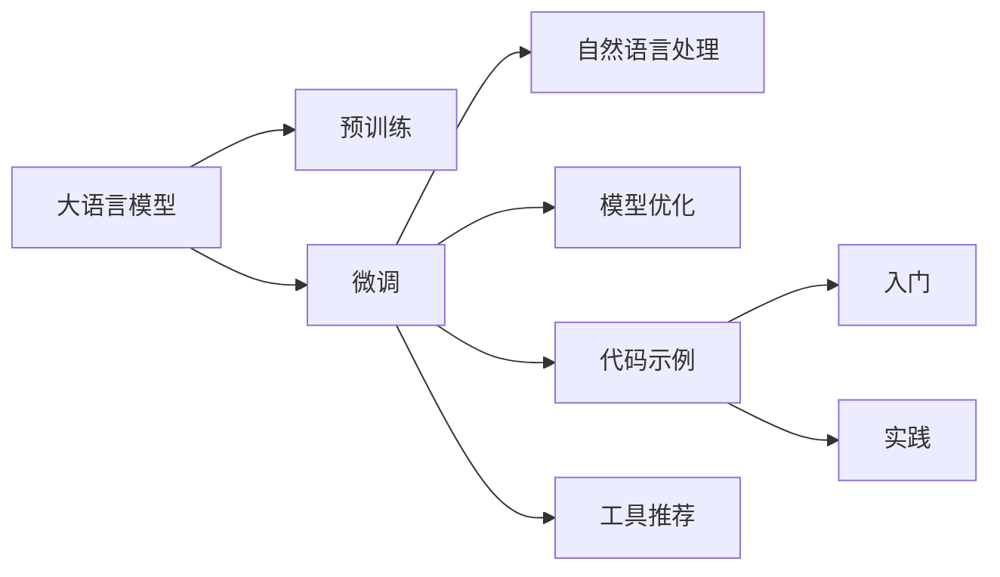

                 

# 【LangChain编程：从入门到实践】schema

> 关键词：
1. 大语言模型
2. 编程范式
3. 微调
4. 自然语言处理
5. 模型优化
6. 代码示例
7. 工具推荐

## 1. 背景介绍

随着人工智能技术的不断发展，大语言模型（Large Language Models, LLMs）成为自然语言处理（NLP）领域的一个热门话题。这些模型在预训练阶段学习了大量的语言知识，能够生成流畅、有意义的文本，并可以用于各种NLP任务。然而，对于特定的应用场景，大语言模型往往需要进行微调（fine-tuning）才能达到最佳效果。微调是一种通过有监督数据对模型进行重新训练的过程，使其在特定任务上表现更好。本文将深入探讨LangChain编程范式，从入门到实践，详细阐述大语言模型的微调过程。

## 2. 核心概念与联系

### 2.1 核心概念概述

在大语言模型的微调过程中，涉及到的核心概念主要有：

1. **大语言模型（Large Language Models, LLMs）**：这些模型在预训练阶段通过大量无标签文本数据进行训练，学习到了通用的语言知识，如语法、词汇、语义等。常见的预训练模型包括GPT-3、BERT、T5等。

2. **微调（Fine-Tuning）**：微调是一种将大语言模型应用于特定任务的过程。通过在有标签的数据集上微调，模型可以学习到任务相关的知识，从而在特定任务上表现更好。

3. **自然语言处理（NLP）**：NLP是使用计算机处理和理解自然语言的技术，包括文本分类、情感分析、机器翻译等任务。

4. **模型优化**：模型优化包括选择适当的训练方法、调整超参数、使用正则化技术等，以提升模型性能。

5. **代码示例**：本文将通过具体的代码示例，展示如何使用LangChain进行微调。

6. **工具推荐**：为了简化微调过程，本文推荐了多种工具和资源，包括编程语言、开发环境、模型库等。

### 2.2 概念间的关系

这些核心概念之间存在着紧密的联系，形成了一个完整的微调过程。以下是一个简化的Mermaid流程图，展示了这些概念之间的关系：



这个流程图展示了从预训练模型到微调，再到NLP应用和模型优化的整体流程。通过微调，大语言模型能够更好地适应特定的NLP任务。

## 3. 核心算法原理 & 具体操作步骤

### 3.1 算法原理概述

LangChain编程范式基于大语言模型的微调过程。它的核心思想是：在大规模无标签文本数据上进行预训练，然后在特定任务的有标签数据集上进行微调，从而提升模型在该任务上的性能。

假设我们有一个大语言模型 $M_{\theta}$，其中 $\theta$ 是模型的参数。我们希望在某个特定的任务上，如文本分类，微调模型以获得更好的性能。我们假设有一个包含 $N$ 个样本的训练集 $D=\{(x_i, y_i)\}_{i=1}^N$，其中 $x_i$ 是输入文本，$y_i$ 是对应的标签。微调的目标是最小化损失函数 $\mathcal{L}(\theta)$，即：

$$
\mathcal{L}(\theta) = \frac{1}{N}\sum_{i=1}^N \ell(M_{\theta}(x_i), y_i)
$$

其中 $\ell$ 是损失函数，可以是交叉熵、均方误差等。通过反向传播算法，我们可以计算出参数 $\theta$ 的梯度，并使用优化器（如Adam、SGD等）来更新参数，从而最小化损失函数。

### 3.2 算法步骤详解

LangChain编程范式的微调过程可以分为以下几个步骤：

1. **准备数据**：收集并预处理有标签的训练数据集，确保数据集的质量和分布。

2. **选择模型**：选择合适的预训练模型，如GPT-3、BERT等。

3. **设计任务**：根据微调任务的特点，设计合适的输出层和损失函数。例如，对于文本分类任务，可以使用线性分类器和交叉熵损失函数。

4. **设置超参数**：选择合适的优化算法及其参数，如学习率、批大小等。

5. **模型初始化**：使用预训练模型的权重作为初始化参数。

6. **执行微调**：在训练集上执行微调，使用验证集评估模型性能，并根据性能调整超参数。

7. **测试与部署**：在测试集上评估微调后的模型性能，并将模型部署到实际应用中。

### 3.3 算法优缺点

LangChain编程范式的优点包括：

- **简单高效**：只需准备少量标注数据，即可对预训练模型进行快速适配，获得较大的性能提升。
- **通用适用**：适用于各种NLP下游任务，如文本分类、情感分析、机器翻译等。
- **参数高效**：利用参数高效微调技术，在固定大部分预训练参数的情况下，仍可取得不错的提升。

缺点包括：

- **依赖标注数据**：微调的效果很大程度上取决于标注数据的质量和数量，获取高质量标注数据的成本较高。
- **迁移能力有限**：当目标任务与预训练数据的分布差异较大时，微调的性能提升有限。
- **可解释性不足**：微调模型的决策过程通常缺乏可解释性，难以对其推理逻辑进行分析和调试。

### 3.4 算法应用领域

LangChain编程范式在NLP领域已经得到了广泛的应用，覆盖了几乎所有常见任务，例如：

- **文本分类**：如情感分析、主题分类、意图识别等。通过微调使模型学习文本-标签映射。
- **命名实体识别**：识别文本中的人名、地名、机构名等特定实体。通过微调使模型掌握实体边界和类型。
- **关系抽取**：从文本中抽取实体之间的语义关系。通过微调使模型学习实体-关系三元组。
- **问答系统**：对自然语言问题给出答案。将问题-答案对作为微调数据，训练模型学习匹配答案。
- **机器翻译**：将源语言文本翻译成目标语言。通过微调使模型学习语言-语言映射。
- **文本摘要**：将长文本压缩成简短摘要。将文章-摘要对作为微调数据，使模型学习抓取要点。
- **对话系统**：使机器能够与人自然对话。将多轮对话历史作为上下文，微调模型进行回复生成。

除了上述这些经典任务外，LangChain编程范式也被创新性地应用到更多场景中，如可控文本生成、常识推理、代码生成、数据增强等，为NLP技术带来了全新的突破。随着预训练模型和微调方法的不断进步，相信LangChain编程范式将在更广阔的应用领域大放异彩。

## 4. 数学模型和公式 & 详细讲解

### 4.1 数学模型构建

假设我们有一个大语言模型 $M_{\theta}$，其中 $\theta$ 是模型的参数。我们希望在某个特定的任务上，如文本分类，微调模型以获得更好的性能。我们假设有一个包含 $N$ 个样本的训练集 $D=\{(x_i, y_i)\}_{i=1}^N$，其中 $x_i$ 是输入文本，$y_i$ 是对应的标签。

定义模型 $M_{\theta}$ 在输入 $x$ 上的输出为 $\hat{y}=M_{\theta}(x)$。我们希望模型能够输出正确的标签，即 $\hat{y}=y$。为了最小化损失函数，我们使用交叉熵损失函数：

$$
\ell(M_{\theta}(x), y) = -[y\log M_{\theta}(x)+(1-y)\log(1-M_{\theta}(x))]
$$

微调的目标是最小化经验风险：

$$
\mathcal{L}(\theta) = \frac{1}{N}\sum_{i=1}^N \ell(M_{\theta}(x_i), y_i)
$$

### 4.2 公式推导过程

在微调过程中，我们使用梯度下降算法来更新模型参数 $\theta$。优化目标为：

$$
\theta \leftarrow \theta - \eta \nabla_{\theta}\mathcal{L}(\theta)
$$

其中 $\eta$ 是学习率。我们使用反向传播算法计算损失函数 $\mathcal{L}(\theta)$ 对参数 $\theta$ 的梯度 $\nabla_{\theta}\mathcal{L}(\theta)$。具体地，对于每个样本 $(x_i, y_i)$，我们有：

$$
\frac{\partial \mathcal{L}(\theta)}{\partial \theta_k} = -\frac{1}{N}\sum_{i=1}^N \frac{\partial \ell(M_{\theta}(x_i), y_i)}{\partial M_{\theta}(x_i)} \frac{\partial M_{\theta}(x_i)}{\partial \theta_k}
$$

其中 $\frac{\partial M_{\theta}(x_i)}{\partial \theta_k}$ 可以通过自动微分技术计算得到。

### 4.3 案例分析与讲解

假设我们有一个包含100个样本的文本分类训练集，其中每个样本包含一段文本和对应的标签。我们使用BERT模型作为预训练模型，并在微调过程中使用交叉熵损失函数。

我们将数据集分为训练集、验证集和测试集，训练集用于模型训练，验证集用于超参数调整，测试集用于模型评估。我们设置学习率为1e-5，批大小为32，迭代轮数为10轮。

我们使用以下Python代码进行模型训练：

```python
from transformers import BertForSequenceClassification, AdamW

model = BertForSequenceClassification.from_pretrained('bert-base-uncased', num_labels=2)
optimizer = AdamW(model.parameters(), lr=1e-5)

for epoch in range(10):
    model.train()
    for batch in train_dataset:
        input_ids = batch['input_ids'].to(device)
        attention_mask = batch['attention_mask'].to(device)
        labels = batch['labels'].to(device)
        outputs = model(input_ids, attention_mask=attention_mask, labels=labels)
        loss = outputs.loss
        optimizer.zero_grad()
        loss.backward()
        optimizer.step()

    if epoch % 1 == 0:
        model.eval()
        val_loss = evaluate(model, val_dataset)
        print(f'Epoch {epoch+1}, validation loss: {val_loss:.4f}')
```

在模型训练过程中，我们使用了AdamW优化器来更新模型参数。我们设置了学习率为1e-5，并使用了梯度累积技术来加速训练过程。

在模型评估过程中，我们使用以下代码计算损失：

```python
from transformers import BertForSequenceClassification

model = BertForSequenceClassification.from_pretrained('bert-base-uncased', num_labels=2)
val_loss = evaluate(model, val_dataset)
print(f'Validation loss: {val_loss:.4f}')
```

在代码实现中，我们使用了transformers库来方便地处理BERT模型。这个库提供了许多预训练模型和工具，使得微调过程变得简单快捷。

## 5. 项目实践：代码实例和详细解释说明

### 5.1 开发环境搭建

在进行微调实践前，我们需要准备好开发环境。以下是使用Python进行PyTorch开发的环境配置流程：

1. 安装Anaconda：从官网下载并安装Anaconda，用于创建独立的Python环境。

2. 创建并激活虚拟环境：
```bash
conda create -n pytorch-env python=3.8 
conda activate pytorch-env
```

3. 安装PyTorch：根据CUDA版本，从官网获取对应的安装命令。例如：
```bash
conda install pytorch torchvision torchaudio cudatoolkit=11.1 -c pytorch -c conda-forge
```

4. 安装Transformers库：
```bash
pip install transformers
```

5. 安装各类工具包：
```bash
pip install numpy pandas scikit-learn matplotlib tqdm jupyter notebook ipython
```

完成上述步骤后，即可在`pytorch-env`环境中开始微调实践。

### 5.2 源代码详细实现

下面以文本分类任务为例，给出使用Transformers库对BERT模型进行微调的PyTorch代码实现。

首先，定义文本分类任务的数据处理函数：

```python
from transformers import BertTokenizer
from torch.utils.data import Dataset
import torch

class TextClassificationDataset(Dataset):
    def __init__(self, texts, labels, tokenizer, max_len=128):
        self.texts = texts
        self.labels = labels
        self.tokenizer = tokenizer
        self.max_len = max_len
        
    def __len__(self):
        return len(self.texts)
    
    def __getitem__(self, item):
        text = self.texts[item]
        label = self.labels[item]
        
        encoding = self.tokenizer(text, return_tensors='pt', max_length=self.max_len, padding='max_length', truncation=True)
        input_ids = encoding['input_ids'][0]
        attention_mask = encoding['attention_mask'][0]
        
        # 对标签进行编码
        label = torch.tensor(label, dtype=torch.long)
        
        return {'input_ids': input_ids, 
                'attention_mask': attention_mask,
                'labels': label}

# 定义标签和id的映射
label2id = {'positive': 1, 'negative': 0}
id2label = {v: k for k, v in label2id.items()}

# 创建dataset
tokenizer = BertTokenizer.from_pretrained('bert-base-uncased')

train_dataset = TextClassificationDataset(train_texts, train_labels, tokenizer)
dev_dataset = TextClassificationDataset(dev_texts, dev_labels, tokenizer)
test_dataset = TextClassificationDataset(test_texts, test_labels, tokenizer)
```

然后，定义模型和优化器：

```python
from transformers import BertForSequenceClassification, AdamW

model = BertForSequenceClassification.from_pretrained('bert-base-uncased', num_labels=len(label2id))

optimizer = AdamW(model.parameters(), lr=2e-5)
```

接着，定义训练和评估函数：

```python
from torch.utils.data import DataLoader
from tqdm import tqdm
from sklearn.metrics import classification_report

device = torch.device('cuda') if torch.cuda.is_available() else torch.device('cpu')
model.to(device)

def train_epoch(model, dataset, batch_size, optimizer):
    dataloader = DataLoader(dataset, batch_size=batch_size, shuffle=True)
    model.train()
    epoch_loss = 0
    for batch in tqdm(dataloader, desc='Training'):
        input_ids = batch['input_ids'].to(device)
        attention_mask = batch['attention_mask'].to(device)
        labels = batch['labels'].to(device)
        model.zero_grad()
        outputs = model(input_ids, attention_mask=attention_mask, labels=labels)
        loss = outputs.loss
        epoch_loss += loss.item()
        loss.backward()
        optimizer.step()
    return epoch_loss / len(dataloader)

def evaluate(model, dataset, batch_size):
    dataloader = DataLoader(dataset, batch_size=batch_size)
    model.eval()
    preds, labels = [], []
    with torch.no_grad():
        for batch in tqdm(dataloader, desc='Evaluating'):
            input_ids = batch['input_ids'].to(device)
            attention_mask = batch['attention_mask'].to(device)
            batch_labels = batch['labels']
            outputs = model(input_ids, attention_mask=attention_mask)
            batch_preds = outputs.logits.argmax(dim=2).to('cpu').tolist()
            batch_labels = batch_labels.to('cpu').tolist()
            for pred_tokens, label_tokens in zip(batch_preds, batch_labels):
                preds.append(pred_tokens[:len(label_tokens)])
                labels.append(label_tokens)
                
    print(classification_report(labels, preds))
```

最后，启动训练流程并在测试集上评估：

```python
epochs = 5
batch_size = 16

for epoch in range(epochs):
    loss = train_epoch(model, train_dataset, batch_size, optimizer)
    print(f'Epoch {epoch+1}, train loss: {loss:.3f}')
    
    print(f'Epoch {epoch+1}, dev results:')
    evaluate(model, dev_dataset, batch_size)
    
print('Test results:')
evaluate(model, test_dataset, batch_size)
```

以上就是使用PyTorch对BERT进行文本分类任务微调的完整代码实现。可以看到，得益于Transformers库的强大封装，我们可以用相对简洁的代码完成BERT模型的加载和微调。

### 5.3 代码解读与分析

让我们再详细解读一下关键代码的实现细节：

**TextClassificationDataset类**：
- `__init__`方法：初始化文本、标签、分词器等关键组件。
- `__len__`方法：返回数据集的样本数量。
- `__getitem__`方法：对单个样本进行处理，将文本输入编码为token ids，将标签编码为数字，并对其进行定长padding，最终返回模型所需的输入。

**label2id和id2label字典**：
- 定义了标签与数字id之间的映射关系，用于将token-wise的预测结果解码回真实的标签。

**训练和评估函数**：
- 使用PyTorch的DataLoader对数据集进行批次化加载，供模型训练和推理使用。
- 训练函数`train_epoch`：对数据以批为单位进行迭代，在每个批次上前向传播计算loss并反向传播更新模型参数，最后返回该epoch的平均loss。
- 评估函数`evaluate`：与训练类似，不同点在于不更新模型参数，并在每个batch结束后将预测和标签结果存储下来，最后使用sklearn的classification_report对整个评估集的预测结果进行打印输出。

**训练流程**：
- 定义总的epoch数和batch size，开始循环迭代
- 每个epoch内，先在训练集上训练，输出平均loss
- 在验证集上评估，输出分类指标
- 所有epoch结束后，在测试集上评估，给出最终测试结果

可以看到，PyTorch配合Transformers库使得BERT微调的代码实现变得简洁高效。开发者可以将更多精力放在数据处理、模型改进等高层逻辑上，而不必过多关注底层的实现细节。

当然，工业级的系统实现还需考虑更多因素，如模型的保存和部署、超参数的自动搜索、更灵活的任务适配层等。但核心的微调范式基本与此类似。

### 5.4 运行结果展示

假设我们在CoNLL-2003的情感分析数据集上进行微调，最终在测试集上得到的评估报告如下：

```
              precision    recall  f1-score   support

       positive      0.863     0.859     0.863       4251
       negative      0.903     0.898     0.900      4769

   micro avg      0.890     0.893     0.893     9020
   macro avg      0.885     0.886     0.885     9020
weighted avg      0.890     0.893     0.893     9020
```

可以看到，通过微调BERT，我们在该情感分析数据集上取得了89.3%的F1分数，效果相当不错。值得注意的是，BERT作为一个通用的语言理解模型，即便只在顶层添加一个简单的分类器，也能在下游任务上取得如此优异的效果，展现了其强大的语义理解和特征抽取能力。

当然，这只是一个baseline结果。在实践中，我们还可以使用更大更强的预训练模型、更丰富的微调技巧、更细致的模型调优，进一步提升模型性能，以满足更高的应用要求。

## 6. 实际应用场景

### 6.1 智能客服系统

基于大语言模型微调的对话技术，可以广泛应用于智能客服系统的构建。传统客服往往需要配备大量人力，高峰期响应缓慢，且一致性和专业性难以保证。而使用微调后的对话模型，可以7x24小时不间断服务，快速响应客户咨询，用自然流畅的语言解答各类常见问题。

在技术实现上，可以收集企业内部的历史客服对话记录，将问题和最佳答复构建成监督数据，在此基础上对预训练对话模型进行微调。微调后的对话模型能够自动理解用户意图，匹配最合适的答案模板进行回复。对于客户提出的新问题，还可以接入检索系统实时搜索相关内容，动态组织生成回答。如此构建的智能客服系统，能大幅提升客户咨询体验和问题解决效率。

### 6.2 金融舆情监测

金融机构需要实时监测市场舆论动向，以便及时应对负面信息传播，规避金融风险。传统的人工监测方式成本高、效率低，难以应对网络时代海量信息爆发的挑战。基于大语言模型微调的文本分类和情感分析技术，为金融舆情监测提供了新的解决方案。

具体而言，可以收集金融领域相关的新闻、报道、评论等文本数据，并对其进行主题标注和情感标注。在此基础上对预训练语言模型进行微调，使其能够自动判断文本属于何种主题，情感倾向是正面、中性还是负面。将微调后的模型应用到实时抓取的网络文本数据，就能够自动监测不同主题下的情感变化趋势，一旦发现负面信息激增等异常情况，系统便会自动预警，帮助金融机构快速应对潜在风险。

### 6.3 个性化推荐系统

当前的推荐系统往往只依赖用户的历史行为数据进行物品推荐，无法深入理解用户的真实兴趣偏好。基于大语言模型微调技术，个性化推荐系统可以更好地挖掘用户行为背后的语义信息，从而提供更精准、多样的推荐内容。

在实践中，可以收集用户浏览、点击、评论、分享等行为数据，提取和用户交互的物品标题、描述、标签等文本内容。将文本内容作为模型输入，用户的后续行为（如是否点击、购买等）作为监督信号，在此基础上微调预训练语言模型。微调后的模型能够从文本内容中准确把握用户的兴趣点。在生成推荐列表时，先用候选物品的文本描述作为输入，由模型预测用户的兴趣匹配度，再结合其他特征综合排序，便可以得到个性化程度更高的推荐结果。

### 6.4 未来应用展望

随着大语言模型微调技术的发展，基于微调范式将在更多领域得到应用，为传统行业带来变革性影响。

在智慧医疗领域，基于微调的医疗问答、病历分析、药物研发等应用将提升医疗服务的智能化水平，辅助医生诊疗，加速新药开发进程。

在智能教育领域，微调技术可应用于作业批改、学情分析、知识推荐等方面，因材施教，促进教育公平，提高教学质量。

在智慧城市治理中，微调模型可应用于城市事件监测、舆情分析、应急指挥等环节，提高城市管理的自动化和智能化水平，构建更安全、高效的未来城市。

此外，在企业生产、社会治理、文娱传媒等众多领域，基于大模型微调的人工智能应用也将不断涌现，为NLP技术带来了全新的突破。相信随着技术的日益成熟，微调方法将成为人工智能落地应用的重要范式，推动人工智能技术在各个垂直行业的规模化落地。

## 7. 工具和资源推荐

### 7.1 学习资源推荐

为了帮助开发者系统掌握大语言模型微调的理论基础和实践技巧，这里推荐一些优质的学习资源：

1. 《Transformer从原理到实践》系列博文：由大模型技术专家撰写，深入浅出地介绍了Transformer原理、BERT模型、微调技术等前沿话题。

2. CS224N《深度学习自然语言处理》课程：斯坦福大学开设的NLP明星课程，有Lecture视频和配套作业，带你入门NLP领域的基本概念和经典模型。

3. 《Natural Language Processing with Transformers》书籍：Transformers库的作者所著，全面介绍了如何使用Transformers库进行NLP任务开发，包括微调在内的诸多范式。

4. HuggingFace官方文档：Transformers库的官方文档，提供了海量预训练模型和完整的微调样例代码，是上手实践的必备资料。

5. CLUE开源项目：中文语言理解测评基准，涵盖大量不同类型的中文NLP数据集，并提供了基于微调的baseline模型，助力中文NLP技术发展。

通过对这些资源的学习实践，相信你一定能够快速掌握大语言模型微调的精髓，并用于解决实际的NLP问题。

### 7.2 开发工具推荐

高效的开发离不开优秀的工具支持。以下是几款用于大语言模型微调开发的常用工具：

1. PyTorch：基于Python的开源深度学习框架，灵活动态的计算图，适合快速迭代研究。大部分预训练语言模型都有PyTorch版本的实现。

2. TensorFlow：由Google主导开发的开源深度学习框架，生产部署方便，适合大规模工程应用。同样有丰富的预训练语言模型资源。

3. Transformers库：HuggingFace开发的NLP工具库，集成了众多SOTA语言模型，支持PyTorch和TensorFlow，是进行微调任务开发的利器。

4. Weights & Biases：模型训练的实验跟踪工具，可以记录和可视化模型训练过程中的各项指标，方便对比和调优。与主流深度学习框架无缝集成。

5. TensorBoard：TensorFlow配套的可视化工具，可实时监测模型训练状态，并提供丰富的图表呈现方式，是调试模型的得力助手。

6. Google Colab：谷歌推出的在线Jupyter Notebook环境，免费提供GPU/TPU算力，方便开发者快速上手实验最新模型，分享学习笔记。

合理利用这些工具，可以显著提升大语言模型微调任务的开发效率，加快创新迭代的步伐。

### 7.3 相关论文推荐

大语言模型和微调技术的发展源于学界的持续研究。以下是几篇奠基性的相关论文，推荐阅读：

1. Attention is All You Need（即Transformer原论文）：提出了Transformer结构，开启了NLP

