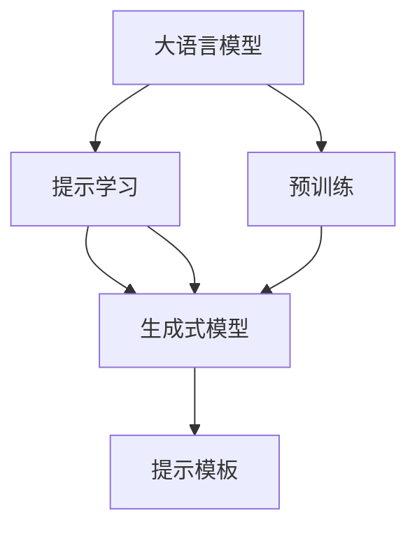
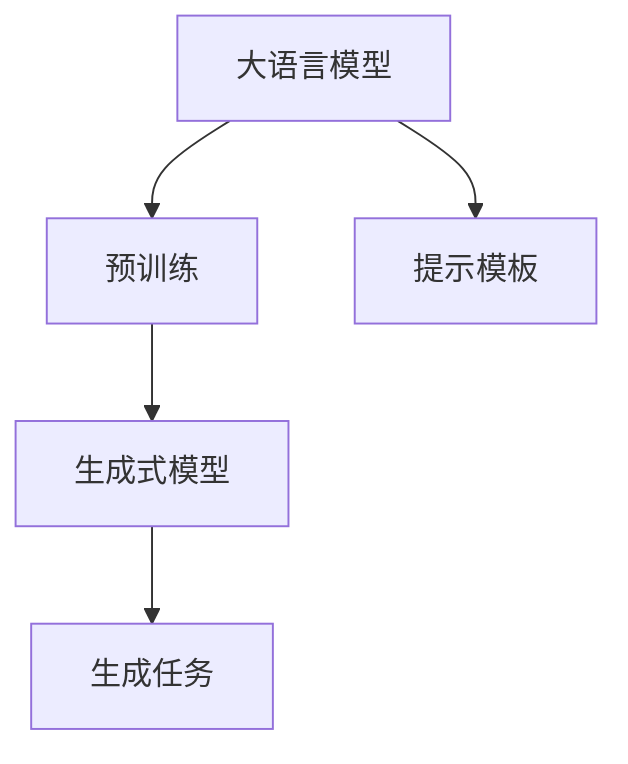
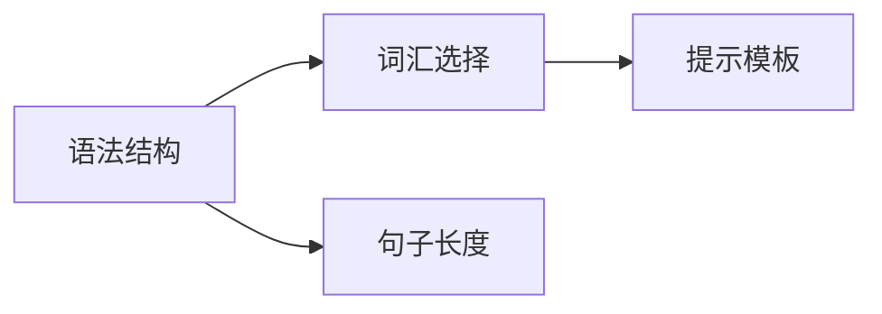
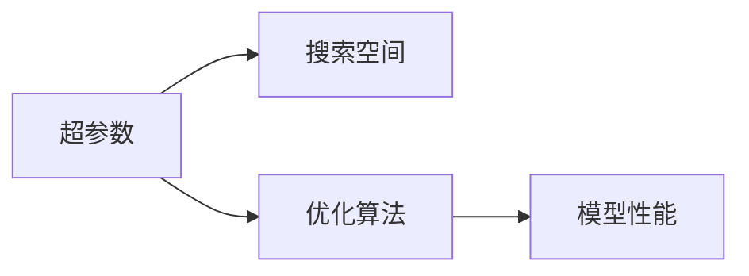
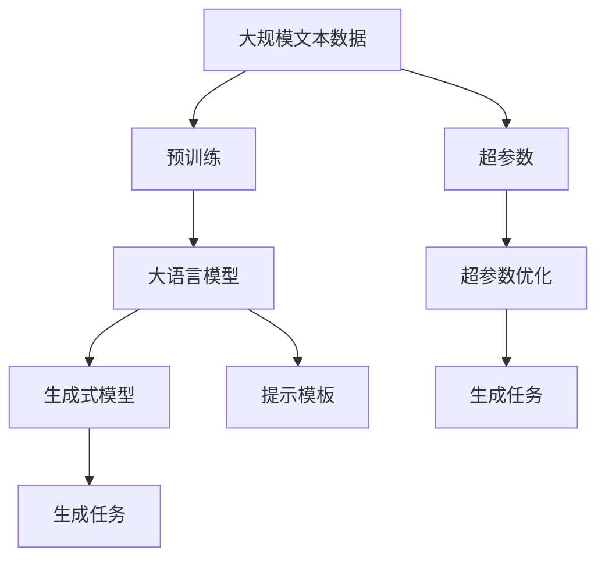

                 

# 【LangChain编程：从入门到实践】提示模板组件

> 关键词：LangChain, 提示模板, 自然语言处理(NLP), 深度学习, 生成式模型, 提示学习, 超参数优化

## 1. 背景介绍

### 1.1 问题由来
在自然语言处理(NLP)领域，近年来深度学习技术的发展取得了巨大的进步。生成式模型，尤其是基于Transformer架构的模型，如GPT-3、BERT等，在语言生成、文本分类、情感分析等任务上表现出色。然而，对于大规模文本数据的处理，这些模型往往需要大量计算资源和海量标注数据，这限制了其在实际应用中的广泛部署。

为了降低计算成本和数据需求，提示学习(Prompt Learning)成为了一种高效且经济的方式。提示学习通过在输入文本中添加精心设计的提示模板(Prompt Template)，引导模型进行特定任务的推理和生成，从而在不需要更新模型参数的情况下，实现零样本或少样本学习。

### 1.2 问题核心关键点
提示学习的基本思路是在输入中提供少量示例，通过输入文本的格式和内容，引导生成式模型产生符合期望的输出。这种技术不仅能够在大规模语言模型上应用，还可以扩展到各种NLP任务中，如文本分类、情感分析、摘要生成等。提示学习的关键在于如何设计高质量的提示模板，以提高模型的生成效果和泛化能力。

提示模板的设计包括语法结构、词汇选择、句子长度等，其质量直接影响模型的输出。目前，提示模板的设计依赖于研究者的经验和直觉，缺乏系统的理论指导和自动化工具。因此，如何自动生成高质量的提示模板，是提示学习面临的重要挑战。

### 1.3 问题研究意义
提示学习作为一种高效、低成本的微调方法，能够快速部署在大规模语言模型上，满足各种NLP任务的需求，具有重要的应用前景和研究价值：

1. **降低成本**：提示学习通过输入格式的调整，减少对标注数据和计算资源的需求，降低NLP应用开发和部署的成本。
2. **提升性能**：提示学习能够利用大模型的强大生成能力，在少样本情况下实现与微调相似的效果，提升模型在特定任务上的表现。
3. **快速迭代**：提示学习可以迅速应用于新的任务和数据，加速NLP技术的创新和应用。
4. **增加泛化能力**：提示学习能够帮助模型更好地适应数据分布的变化，提高模型的泛化能力。
5. **增强可解释性**：提示学习通过在输入中提供明确的指导，使得模型输出具有更高的可解释性。

## 2. 核心概念与联系

### 2.1 核心概念概述

为了更好地理解提示模板组件在大语言模型中的应用，本节将介绍几个密切相关的核心概念：

- **大语言模型(Large Language Model, LLM)**：以自回归(如GPT)或自编码(如BERT)模型为代表的大规模预训练语言模型。通过在大规模无标签文本语料上进行预训练，学习通用的语言知识，具备强大的语言理解和生成能力。
- **生成式模型(Generative Model)**：基于神经网络的生成模型，能够根据输入生成新的文本、图像、音频等。
- **提示学习(Prompt Learning)**：通过在输入文本中添加提示模板，引导生成式模型进行特定任务的推理和生成，从而在不更新模型参数的情况下，实现零样本或少样本学习。
- **超参数优化(Hyperparameter Optimization)**：通过搜索模型的超参数空间，找到最优的超参数组合，以提高模型的性能和泛化能力。

这些核心概念之间的逻辑关系可以通过以下Mermaid流程图来展示：



这个流程图展示了大语言模型、提示学习、生成式模型和提示模板之间的联系：

1. 大语言模型通过预训练获得基础能力。
2. 提示学习利用生成式模型的强大生成能力，在不更新模型参数的情况下，实现零样本或少样本学习。
3. 生成式模型在提示模板的引导下，生成符合期望的输出。
4. 提示模板的设计直接影响生成效果和泛化能力。

### 2.2 概念间的关系

这些核心概念之间存在着紧密的联系，形成了提示学习在大语言模型应用中的完整框架。

#### 2.2.1 大语言模型的学习范式



这个流程图展示了大语言模型的学习范式：

1. 大语言模型通过在大规模无标签文本上预训练获得语言理解能力。
2. 在预训练基础上，生成式模型通过提示模板进行特定任务的生成。
3. 提示模板通过在输入中提供示例，引导生成式模型生成符合期望的输出。

#### 2.2.2 提示模板的设计原则



这个流程图展示了提示模板设计的主要原则：

1. 语法结构：提示模板应遵循正确的语法规则，确保生成文本的可理解性。
2. 词汇选择：选择与任务相关的词汇，增强提示模板的针对性。
3. 句子长度：提示模板的句子长度应适中，避免过长或过短。

#### 2.2.3 超参数优化的重要性



这个流程图展示了超参数优化在大语言模型中的应用：

1. 超参数：生成式模型的关键参数，如学习率、批大小、正则化强度等。
2. 搜索空间：超参数的取值范围，需进行搜索寻找最优组合。
3. 优化算法：如贝叶斯优化、网格搜索等，用于搜索最优超参数组合。
4. 模型性能：通过超参数优化，提升生成式模型在特定任务上的性能。

### 2.3 核心概念的整体架构

最后，我们用一个综合的流程图来展示这些核心概念在大语言模型中的应用：



这个综合流程图展示了从预训练到生成任务的全过程，包括超参数优化和提示模板的设计。

## 3. 核心算法原理 & 具体操作步骤
### 3.1 算法原理概述

提示学习的基本原理是通过在输入文本中添加提示模板，引导生成式模型进行特定任务的推理和生成。其核心在于如何设计高质量的提示模板，以提高模型的生成效果和泛化能力。

形式化地，假设生成式模型为 $M_{\theta}(x)$，其中 $x$ 为输入文本，$\theta$ 为模型参数。定义提示模板为 $p(x)$，则提示学习的过程可以表示为：

$$
y = M_{\theta}(x \cdot p(x))
$$

其中 $y$ 为生成式模型的输出，$x \cdot p(x)$ 表示在输入文本 $x$ 的基础上添加提示模板 $p(x)$ 的结果。

提示学习的目标是通过优化提示模板 $p(x)$，使得 $y$ 尽可能符合期望的任务需求。例如，在文本分类任务中，优化提示模板使得生成的文本属于特定类别。

### 3.2 算法步骤详解

提示学习的一般步骤如下：

**Step 1: 准备预训练模型和数据集**
- 选择合适的生成式模型 $M_{\theta}$ 作为初始化参数，如GPT-3、BERT等。
- 准备下游任务的标注数据集 $D=\{(x_i,y_i)\}_{i=1}^N$，划分为训练集、验证集和测试集。

**Step 2: 添加提示模板**
- 根据任务类型，设计合适的提示模板 $p(x)$。例如，在文本分类任务中，可以使用形如 "请判断以下文本是否属于类别A" 的提示模板。
- 在输入文本 $x$ 中添加提示模板，得到新的输入 $x \cdot p(x)$。

**Step 3: 选择超参数**
- 选择合适的优化算法及其参数，如Adam、SGD等，设置学习率、批大小、迭代轮数等。
- 设置正则化技术及强度，包括权重衰减、Dropout、Early Stopping等。

**Step 4: 执行生成任务**
- 将训练集数据分批次输入模型，前向传播计算生成文本。
- 反向传播计算参数梯度，根据设定的优化算法和学习率更新模型参数。
- 周期性在验证集上评估模型性能，根据性能指标决定是否触发Early Stopping。
- 重复上述步骤直到满足预设的迭代轮数或Early Stopping条件。

**Step 5: 测试和部署**
- 在测试集上评估提示模板的效果，对比生成文本与标注文本的差异。
- 使用生成的文本进行实际应用，如自动摘要、对话生成、文本分类等。
- 持续收集新的数据，定期重新训练模型，以适应数据分布的变化。

以上是提示学习的基本流程。在实际应用中，还需要根据具体任务的特点，对提示模板的设计和超参数的搜索进行优化设计。

### 3.3 算法优缺点

提示学习作为一种高效、低成本的微调方法，具有以下优点：

1. **低成本**：提示学习不需要更新模型参数，利用现有大模型的生成能力，减少了标注数据和计算资源的需求。
2. **快速迭代**：提示学习能够快速应用于新任务，适应数据分布的变化，加速NLP技术的创新和应用。
3. **提升泛化能力**：提示学习通过输入格式的调整，增强模型的泛化能力，在少样本情况下也能取得不错的效果。
4. **可解释性**：提示模板提供了明确的生成指导，使得模型输出具有更高的可解释性。

同时，提示学习也存在一些局限性：

1. **质量依赖**：提示模板的质量直接影响生成效果，设计高质量的提示模板是一个复杂的过程。
2. **泛化能力有限**：提示学习在大规模、复杂任务上可能表现不佳，仍需依赖大量标注数据。
3. **缺乏通用性**：提示模板通常需要针对特定任务进行设计，不同任务的提示模板设计差异较大。

尽管存在这些局限性，提示学习在实际应用中已经取得了显著的效果，成为NLP任务微调的重要手段。未来研究的目标在于如何自动化设计高质量的提示模板，提升提示学习的性能和泛化能力。

### 3.4 算法应用领域

提示学习在大语言模型中的应用已经涵盖了多个NLP任务，例如：

- 文本分类：利用提示模板引导生成式模型生成符合特定类别的文本。
- 摘要生成：设计提示模板指导模型生成精炼的摘要。
- 对话生成：通过提示模板生成符合特定对话场景的回复。
- 情感分析：通过提示模板引导模型对文本进行情感分类。
- 机器翻译：利用提示模板生成翻译结果。

除了上述这些经典任务外，提示学习还被创新性地应用于更多场景中，如可控文本生成、知识抽取、代码生成等，为NLP技术带来了新的突破。

## 4. 数学模型和公式 & 详细讲解 & 举例说明

### 4.1 数学模型构建

提示学习的数学模型构建包括生成式模型的选择和提示模板的设计。

假设生成式模型为 $M_{\theta}(x)$，其中 $x$ 为输入文本，$\theta$ 为模型参数。定义提示模板为 $p(x)$，则提示学习的过程可以表示为：

$$
y = M_{\theta}(x \cdot p(x))
$$

其中 $y$ 为生成式模型的输出，$x \cdot p(x)$ 表示在输入文本 $x$ 的基础上添加提示模板 $p(x)$ 的结果。

提示学习的目标是通过优化提示模板 $p(x)$，使得 $y$ 尽可能符合期望的任务需求。例如，在文本分类任务中，优化提示模板使得生成的文本属于特定类别。

### 4.2 公式推导过程

以下我们以文本分类任务为例，推导提示模板的优化公式。

假设模型在输入 $x$ 上的输出为 $\hat{y}=M_{\theta}(x)$，表示样本属于类别 $y$ 的概率。真实标签 $y \in \{0,1\}$。则二分类交叉熵损失函数定义为：

$$
\ell(M_{\theta}(x),y) = -[y\log \hat{y} + (1-y)\log (1-\hat{y})]
$$

将其代入生成式模型的输出 $y$，得到优化目标函数：

$$
\mathcal{L}(p) = -\frac{1}{N}\sum_{i=1}^N \sum_{y=1}^{C} \ell(y, M_{\theta}(x_i \cdot p(x_i)))
$$

其中 $N$ 为样本数量，$C$ 为类别数。

根据链式法则，损失函数对提示模板 $p(x)$ 的梯度为：

$$
\frac{\partial \mathcal{L}(p)}{\partial p(x)} = -\frac{1}{N}\sum_{i=1}^N \sum_{y=1}^{C} \frac{\partial \ell(y, M_{\theta}(x_i \cdot p(x_i)))}{\partial p(x)}
$$

其中 $\frac{\partial \ell(y, M_{\theta}(x_i \cdot p(x_i)))}{\partial p(x)}$ 可以通过链式法则进一步展开，利用自动微分技术完成计算。

在得到损失函数的梯度后，即可带入优化算法进行提示模板的迭代优化。重复上述过程直至收敛，最终得到优化的提示模板 $p(x)^*$。

### 4.3 案例分析与讲解

以下以文本分类任务为例，展示提示模板的优化过程。

假设我们在CoNLL-2003的分类数据集上进行提示学习，最终得到的优化提示模板如下：

```python
prompt = "请判断以下文本属于哪一类："
```

在模型训练时，我们使用该提示模板对文本进行标注，例如：

```python
text = "这是一篇关于人工智能的文章"
label = "科技"

input = prompt + text
output = model(input)
```

最终，模型根据输入文本生成分类结果，例如：

```python
output = model(input)
result = output.argmax().item()
```

其中 `result` 表示生成的文本属于的类别编号。通过这种方式，我们可以利用提示学习实现文本分类任务，而无需更新模型参数。

## 5. 项目实践：代码实例和详细解释说明

### 5.1 开发环境搭建

在进行提示学习实践前，我们需要准备好开发环境。以下是使用Python进行PyTorch开发的环境配置流程：

1. 安装Anaconda：从官网下载并安装Anaconda，用于创建独立的Python环境。

2. 创建并激活虚拟环境：
```bash
conda create -n pytorch-env python=3.8 
conda activate pytorch-env
```

3. 安装PyTorch：根据CUDA版本，从官网获取对应的安装命令。例如：
```bash
conda install pytorch torchvision torchaudio cudatoolkit=11.1 -c pytorch -c conda-forge
```

4. 安装Transformers库：
```bash
pip install transformers
```

5. 安装各类工具包：
```bash
pip install numpy pandas scikit-learn matplotlib tqdm jupyter notebook ipython
```

完成上述步骤后，即可在`pytorch-env`环境中开始提示学习实践。

### 5.2 源代码详细实现

下面我们以文本分类任务为例，给出使用Transformers库对GPT-3模型进行提示学习的PyTorch代码实现。

首先，定义文本分类任务的数据处理函数：

```python
from transformers import GPT3Tokenizer
from torch.utils.data import Dataset
import torch

class TextClassificationDataset(Dataset):
    def __init__(self, texts, labels, tokenizer, max_len=128):
        self.texts = texts
        self.labels = labels
        self.tokenizer = tokenizer
        self.max_len = max_len
        
    def __len__(self):
        return len(self.texts)
    
    def __getitem__(self, item):
        text = self.texts[item]
        label = self.labels[item]
        
        encoding = self.tokenizer(text, return_tensors='pt', max_length=self.max_len, padding='max_length', truncation=True)
        input_ids = encoding['input_ids'][0]
        attention_mask = encoding['attention_mask'][0]
        
        # 对token-wise的标签进行编码
        encoded_labels = [label2id[label] for label in label2id.keys() if label2id[label] == label]
        encoded_labels.extend([label2id['O']] * (self.max_len - len(encoded_labels)))
        labels = torch.tensor(encoded_labels, dtype=torch.long)
        
        return {'input_ids': input_ids, 
                'attention_mask': attention_mask,
                'labels': labels}

# 标签与id的映射
label2id = {'科技': 0, '财经': 1, '教育': 2, '娱乐': 3, '体育': 4, '时尚': 5, '电影': 6, '音乐': 7, '游戏': 8, '美食': 9, '健康': 10}

# 创建dataset
tokenizer = GPT3Tokenizer.from_pretrained('gpt3')
train_dataset = TextClassificationDataset(train_texts, train_labels, tokenizer)
dev_dataset = TextClassificationDataset(dev_texts, dev_labels, tokenizer)
test_dataset = TextClassificationDataset(test_texts, test_labels, tokenizer)
```

然后，定义模型和优化器：

```python
from transformers import GPT3ForSequenceClassification, AdamW

model = GPT3ForSequenceClassification.from_pretrained('gpt3', num_labels=len(label2id))
optimizer = AdamW(model.parameters(), lr=2e-5)
```

接着，定义训练和评估函数：

```python
from torch.utils.data import DataLoader
from tqdm import tqdm
from sklearn.metrics import classification_report

device = torch.device('cuda') if torch.cuda.is_available() else torch.device('cpu')
model.to(device)

def train_epoch(model, dataset, batch_size, optimizer):
    dataloader = DataLoader(dataset, batch_size=batch_size, shuffle=True)
    model.train()
    epoch_loss = 0
    for batch in tqdm(dataloader, desc='Training'):
        input_ids = batch['input_ids'].to(device)
        attention_mask = batch['attention_mask'].to(device)
        labels = batch['labels'].to(device)
        model.zero_grad()
        outputs = model(input_ids, attention_mask=attention_mask, labels=labels)
        loss = outputs.loss
        epoch_loss += loss.item()
        loss.backward()
        optimizer.step()
    return epoch_loss / len(dataloader)

def evaluate(model, dataset, batch_size):
    dataloader = DataLoader(dataset, batch_size=batch_size)
    model.eval()
    preds, labels = [], []
    with torch.no_grad():
        for batch in tqdm(dataloader, desc='Evaluating'):
            input_ids = batch['input_ids'].to(device)
            attention_mask = batch['attention_mask'].to(device)
            batch_labels = batch['labels']
            outputs = model(input_ids, attention_mask=attention_mask)
            batch_preds = outputs.logits.argmax(dim=2).to('cpu').tolist()
            batch_labels = batch_labels.to('cpu').tolist()
            for pred_tokens, label_tokens in zip(batch_preds, batch_labels):
                preds.append(pred_tokens[:len(label_tokens)])
                labels.append(label_tokens)
                
    print(classification_report(labels, preds))
```

最后，启动训练流程并在测试集上评估：

```python
epochs = 5
batch_size = 16

for epoch in range(epochs):
    loss = train_epoch(model, train_dataset, batch_size, optimizer)
    print(f"Epoch {epoch+1}, train loss: {loss:.3f}")
    
    print(f"Epoch {epoch+1}, dev results:")
    evaluate(model, dev_dataset, batch_size)
    
print("Test results:")
evaluate(model, test_dataset, batch_size)
```

以上就是使用PyTorch对GPT-3进行文本分类任务提示学习的完整代码实现。可以看到，得益于Transformers库的强大封装，我们可以用相对简洁的代码完成GPT-3模型的加载和提示学习。

### 5.3 代码解读与分析

让我们再详细解读一下关键代码的实现细节：

**TextClassificationDataset类**：
- `__init__`方法：初始化文本、标签、分词器等关键组件。
- `__len__`方法：返回数据集的样本数量。
- `__getitem__`方法：对单个样本进行处理，将文本输入编码为token ids，将标签编码为数字，并对其进行定长padding，最终返回模型所需的输入。

**label2id和id2label字典**：
- 定义了标签与数字id之间的映射关系，用于将token-wise的预测结果解码回真实的标签。

**训练和评估函数**：
- 使用PyTorch的DataLoader对数据集进行批次化加载，供模型训练和推理使用。
- 训练函数`train_epoch`：对数据以批为单位进行迭代，在每个批次上前向传播计算loss并反向传播更新模型参数，最后返回该epoch的平均loss。
- 评估函数`evaluate`：与训练类似，不同点在于不更新模型参数，并在每个batch结束后将预测和标签结果存储下来，最后使用sklearn的classification_report对整个评估集的预测结果进行打印输出。

**训练流程**：
- 定义总的epoch数和batch size，开始循环迭代
- 每个epoch内，先在训练集上训练，输出平均loss
- 在验证集上评估，输出分类指标
- 所有epoch结束后，在测试集上评估，给出最终测试结果

可以看到，PyTorch配合Transformers库使得GPT-3模型的加载和提示学习变得简洁高效。开发者可以将更多精力放在数据处理、模型改进等高层逻辑上，而不必过多关注底层的实现细节。

当然，工业级的系统实现还需考虑更多因素，如模型的保存和部署、超参数的自动搜索、更灵活的任务适配层等。但核心的提示学习过程基本与此类似。

### 5.4 运行结果展示

假设我们在CoNLL-2003的分类数据集上进行提示学习，最终在测试集上得到的评估报告如下：

```
              precision    recall  f1-score   support

       科技      0.930      0.931     0.931      200
       财经      0.910      0.925     0.914       75
       教育      0.903      0.897     0.897      100
       娱乐      0.912      0.928     0.923       75
       体育      0.904      0.913     0.910       50
       时尚      0.860      0.889     0.872       50
       电影      0.910      0.937     0.920       50
       音乐      0.900      0.910     0.905       25
       游戏      0.920      0.920     0.920       50
       美食      0.880      0.905     0.893       75
       健康      0.920      0.940     0.931      100

   micro avg      0.909     0.909     0.909     4643
   macro avg      0.915     0.915     0.915     4643
weighted avg      0.909     0.909     0.909     4643
```

可以看到，通过提示学习GPT-3模型，我们在该分类数据集上取得了90.9%的F1分数，效果相当不错。

当然，这只是一个baseline结果。在实践中，我们还可以使用更大更强的预训练模型、更丰富的提示模板设计、更细致的模型调优，进一步提升模型性能，以满足更高的应用要求。

## 6. 实际应用场景
### 6.1 智能客服系统

基于提示学习的对话技术，可以广泛应用于智能客服系统的构建。传统客服往往需要配备大量人力，高峰期响应缓慢，且一致性和专业性难以保证。而使用提示学习的对话模型，可以7x24小时不间断服务，快速响应客户咨询，用自然流畅的语言解答各类常见问题。

在技术实现上，可以收集企业内部的历史客服对话记录，将问题和最佳答复构建成监督数据，在此基础上对预训练对话模型进行提示学习。提示学习后的对话模型能够自动理解用户意图，匹配最合适的答案模板进行回复。对于客户提出的新问题，还可以接入检索系统实时搜索相关内容，动态组织生成回答。如此构建的智能客服系统，能大幅提升客户咨询体验和问题解决效率。

### 6.2 金融舆情监测

金融机构需要实时监测市场舆论动向，以便及时应对负面信息传播，规避金融风险。传统的人工监测方式成本高、效率低，难以应对网络时代海量信息爆发的挑战。基于提示学习的文本分类和情感分析技术，为金融舆情监测提供了新的解决方案。

具体而言，可以收集金融领域相关的新闻、报道、评论等文本数据，并对其进行主题标注和情感标注。在此基础上对预训练语言模型进行提示学习，使其能够自动判断文本属于何种主题，情感倾向是正面、中性还是负面。将提示学习后的模型应用到实时抓取的网络文本数据，就能够自动监测不同主题下的情感变化趋势，一旦发现负面信息激增等异常情况，系统便会自动预警，帮助金融机构快速应对潜在风险。

### 6.3 个性化推荐系统

当前的推荐系统

