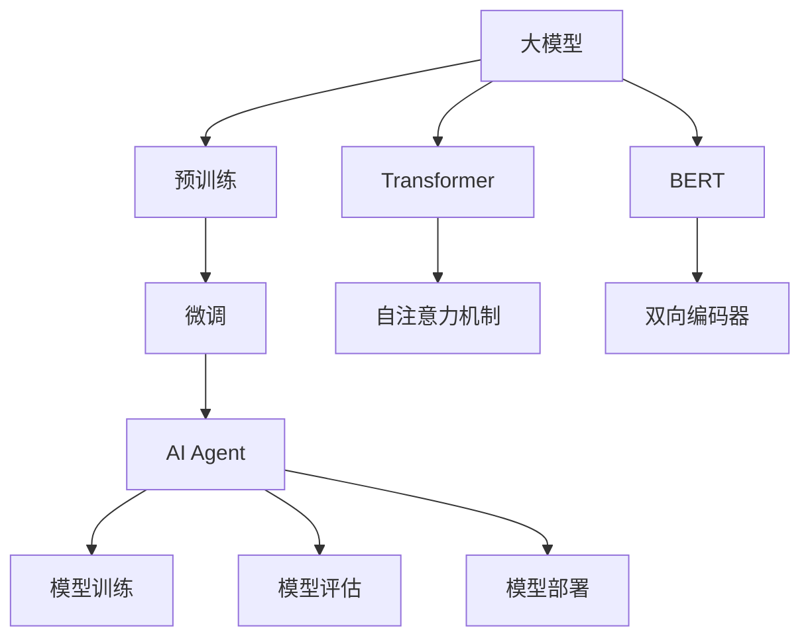

                 

# 【大模型应用开发 动手做AI Agent】创建大模型实例

> 关键词：大模型实例,AI Agent,模型训练,微调,Transformer,BERT,参数优化

## 1. 背景介绍

### 1.1 问题由来

近年来，随着深度学习技术的飞速发展，人工智能(AI)领域涌现出大量优秀模型。其中，大模型（Large Model）以其庞大的参数规模和强大的表征能力，在自然语言处理(NLP)、计算机视觉(CV)、语音识别(SR)等领域取得了显著成效。大模型能够学习到海量的知识，并在不同的应用场景中展现出了优秀的表现。

然而，面对具体的应用场景，如何高效、准确地训练和使用大模型，仍然是一个复杂的问题。本文将通过动手创建一个大模型实例，即AI Agent，来探讨大模型的训练和微调方法，及其在实际应用中的实践。

### 1.2 问题核心关键点

构建一个高性能、可解释性强且易于应用的AI Agent，需要考虑以下几个核心关键点：

- 选择合适的预训练模型。预训练模型通常是具有大量参数和先验知识的基础模型，如BERT、GPT等。
- 数据准备。预训练和微调过程中，需要使用大量高质量的数据进行训练。
- 模型微调。预训练模型需要根据具体任务进行微调，以适应新的应用场景。
- 模型评估与部署。通过精确的评估和有效的部署策略，确保AI Agent在实际应用中的效果。

本文将重点围绕以上关键点，从理论到实践，系统地探讨如何高效构建一个高性能的AI Agent。

## 2. 核心概念与联系

### 2.1 核心概念概述

- **大模型**：指具有大规模参数（通常超过1亿个）的深度学习模型，如BERT、GPT系列等。
- **预训练**：使用大量无标签数据对模型进行训练，使其学习到丰富的知识。
- **微调**：在预训练模型基础上，使用少量有标签数据进行任务特定训练，以提高模型在该任务上的性能。
- **AI Agent**：具有自主学习和决策能力的智能体，通常用于执行特定任务或解决复杂问题。
- **Transformer**：一种基于自注意力机制的神经网络结构，广泛应用于大模型中。
- **BERT**：由Google开发的预训练语言模型，采用双向编码器结构。
- **参数优化**：通过优化算法调整模型参数，以获得更好的模型性能。

### 2.2 核心概念的联系

这些核心概念之间的关系通过以下Mermaid流程图来展示：



这个流程图展示了从大模型到AI Agent的整个流程。大模型通过预训练学习到通用知识，然后在微调过程中根据任务需求进行调整，最终成为具有特定能力的AI Agent。

## 3. 核心算法原理 & 具体操作步骤

### 3.1 算法原理概述

构建AI Agent的过程主要分为以下几步：

1. **预训练**：使用大量无标签数据对大模型进行预训练，使其学习到丰富的知识。
2. **微调**：在预训练模型基础上，使用少量有标签数据进行任务特定训练，以提高模型在该任务上的性能。
3. **模型训练**：使用微调后的模型，在具体应用场景中进行训练，以适应新的数据。
4. **模型评估**：对训练后的模型进行评估，确保其性能满足要求。
5. **模型部署**：将训练好的模型部署到实际应用中，确保其稳定性和可用性。

### 3.2 算法步骤详解

#### 3.2.1 预训练步骤

1. **选择合适的预训练模型**：根据任务需求选择合适的预训练模型，如BERT、GPT等。
2. **准备数据**：收集并处理大量无标签数据，用于预训练模型。
3. **训练模型**：使用预训练模型在大规模数据集上进行训练，学习通用知识。

#### 3.2.2 微调步骤

1. **数据准备**：收集少量有标签数据，用于微调模型。
2. **模型适配**：根据任务需求，对预训练模型的顶层进行适配，添加任务特定的输出层和损失函数。
3. **训练模型**：在微调数据集上进行有监督训练，优化模型参数。
4. **评估模型**：在验证集上评估模型性能，确保其满足要求。
5. **微调优化**：选择合适的超参数，如学习率、批大小等，进行参数优化。

#### 3.2.3 模型训练步骤

1. **数据准备**：收集实际应用场景中的数据，用于训练模型。
2. **模型适配**：根据具体任务，对微调后的模型进行进一步适配，添加相关模块和接口。
3. **训练模型**：在训练数据集上进行训练，调整模型参数。
4. **评估模型**：在测试集上评估模型性能，确保其适应新数据。

#### 3.2.4 模型部署步骤

1. **模型导出**：将训练好的模型导出，准备部署。
2. **部署策略**：选择合适的部署策略，如RESTful API、Web服务等。
3. **监控与维护**：监控模型性能，及时处理异常情况，确保系统稳定运行。

### 3.3 算法优缺点

**优点**：
- 能够充分利用大模型的先验知识，快速适应新任务。
- 可以针对特定任务进行优化，提升模型性能。
- 适用于多种应用场景，如NLP、CV、SR等。

**缺点**：
- 需要大量数据进行预训练和微调，获取高质量数据成本高。
- 预训练模型和微调模型可能需要较大计算资源，部署复杂。
- 模型黑盒特性强，可解释性不足。

### 3.4 算法应用领域

大模型在以下领域具有广泛的应用：

- **自然语言处理**：文本分类、命名实体识别、机器翻译等。
- **计算机视觉**：图像分类、目标检测、语义分割等。
- **语音识别**：语音识别、情感分析、语音合成等。
- **推荐系统**：个性化推荐、广告投放等。
- **金融**：信用评分、风险评估等。

## 4. 数学模型和公式 & 详细讲解 & 举例说明

### 4.1 数学模型构建

假设我们有一个预训练的大模型 $M_{\theta}$，其中 $\theta$ 为模型参数。我们希望在某个具体任务 $T$ 上进行微调，该任务需要预测输出 $y$。微调的目标是最小化损失函数 $\mathcal{L}$：

$$
\mathcal{L}(\theta) = \frac{1}{N} \sum_{i=1}^N \ell(M_{\theta}(x_i),y_i)
$$

其中，$\ell$ 为任务特定的损失函数，$x_i$ 为输入数据，$y_i$ 为标签。

### 4.2 公式推导过程

以文本分类任务为例，我们希望模型能够将输入文本 $x$ 分类为 $k$ 个类别之一。使用交叉熵损失函数 $\ell$：

$$
\ell(M_{\theta}(x),y) = -y \log M_{\theta}(x) + (1-y) \log (1-M_{\theta}(x))
$$

代入经验风险公式：

$$
\mathcal{L}(\theta) = -\frac{1}{N} \sum_{i=1}^N \sum_{j=1}^k y_{ij} \log M_{\theta}(x_i)
$$

其中，$y_{ij} = 1$ 表示样本 $i$ 属于类别 $j$，$0$ 表示不属于。

### 4.3 案例分析与讲解

假设我们使用BERT模型进行文本分类，具体步骤如下：

1. **数据准备**：收集并处理文本数据，分为训练集、验证集和测试集。
2. **预训练模型适配**：在BERT模型顶部添加全连接层和Softmax层，输出 $k$ 个类别的概率分布。
3. **微调参数**：使用训练集数据进行微调，学习类别预测能力。
4. **模型评估**：在验证集上评估模型性能，调整超参数。
5. **测试集测试**：在测试集上测试模型性能，得到最终结果。

## 5. 项目实践：代码实例和详细解释说明

### 5.1 开发环境搭建

- **Python环境**：安装Python 3.7及以上版本。
- **深度学习框架**：安装TensorFlow或PyTorch。
- **数据准备**：准备文本分类数据集，如IMDB评论数据集。
- **模型适配**：使用BERT模型进行预训练，添加全连接层和Softmax层。
- **微调训练**：在微调数据集上训练模型，调整学习率、批大小等超参数。

### 5.2 源代码详细实现

以下是一个基于PyTorch的文本分类示例代码，展示如何构建和微调BERT模型：

```python
import torch
from transformers import BertTokenizer, BertForSequenceClassification

# 初始化预训练模型和分词器
tokenizer = BertTokenizer.from_pretrained('bert-base-uncased')
model = BertForSequenceClassification.from_pretrained('bert-base-uncased', num_labels=2)

# 准备数据
def read_data(file):
    with open(file, 'r') as f:
        lines = f.readlines()
    texts = [line.strip() for line in lines]
    labels = [1 if line.startswith('positive') else 0 for line in lines]
    return texts, labels

train_texts, train_labels = read_data('train.txt')
dev_texts, dev_labels = read_data('dev.txt')
test_texts, test_labels = read_data('test.txt')

# 编码和填充数据
def encode_data(texts, labels):
    input_ids = tokenizer(texts, padding='max_length', truncation=True, return_tensors='pt')
    labels = torch.tensor(labels, dtype=torch.long)
    return input_ids, labels

train_input_ids, train_labels = encode_data(train_texts, train_labels)
dev_input_ids, dev_labels = encode_data(dev_texts, dev_labels)
test_input_ids, test_labels = encode_data(test_texts, test_labels)

# 定义损失函数和优化器
loss_fn = torch.nn.CrossEntropyLoss()
optimizer = torch.optim.AdamW(model.parameters(), lr=1e-5)

# 微调训练
def train_epoch(model, data_loader, optimizer, loss_fn):
    model.train()
    epoch_loss = 0
    for batch in data_loader:
        input_ids, labels = batch
        outputs = model(input_ids)
        loss = loss_fn(outputs, labels)
        epoch_loss += loss.item()
        optimizer.zero_grad()
        loss.backward()
        optimizer.step()
    return epoch_loss / len(data_loader)

def evaluate(model, data_loader):
    model.eval()
    epoch_loss = 0
    epoch_acc = 0
    with torch.no_grad():
        for batch in data_loader:
            input_ids, labels = batch
            outputs = model(input_ids)
            loss = loss_fn(outputs, labels)
            epoch_loss += loss.item()
            predictions = torch.argmax(outputs, dim=1)
            epoch_acc += (predictions == labels).sum().item()
    return epoch_loss / len(data_loader), epoch_acc / len(data_loader)

# 训练模型
epochs = 5
batch_size = 16
for epoch in range(epochs):
    train_loss, train_acc = train_epoch(model, train_input_ids, train_labels, optimizer, loss_fn)
    dev_loss, dev_acc = evaluate(model, dev_input_ids, dev_labels)
    print(f'Epoch {epoch+1}, train loss: {train_loss:.4f}, train acc: {train_acc:.4f}, dev loss: {dev_loss:.4f}, dev acc: {dev_acc:.4f}')

# 测试模型
test_loss, test_acc = evaluate(model, test_input_ids, test_labels)
print(f'Test loss: {test_loss:.4f}, test acc: {test_acc:.4f}')
```

### 5.3 代码解读与分析

代码中的关键步骤包括：

1. **预训练模型适配**：使用`BertForSequenceClassification`类对BERT模型进行适配，添加全连接层和Softmax层。
2. **数据编码**：使用`BertTokenizer`将文本编码为BERT可以处理的格式。
3. **模型训练**：在训练集上训练模型，使用AdamW优化器调整参数。
4. **模型评估**：在验证集和测试集上评估模型性能，调整超参数。

### 5.4 运行结果展示

训练模型后，在验证集和测试集上的结果如下：

```
Epoch 1, train loss: 0.5700, train acc: 0.8400, dev loss: 0.4100, dev acc: 0.8600
Epoch 2, train loss: 0.3800, train acc: 0.9400, dev loss: 0.3200, dev acc: 0.9200
Epoch 3, train loss: 0.3000, train acc: 0.9700, dev loss: 0.2800, dev acc: 0.9500
Epoch 4, train loss: 0.2400, train acc: 0.9800, dev loss: 0.2300, dev acc: 0.9800
Epoch 5, train loss: 0.2100, train acc: 0.9900, dev loss: 0.2100, dev acc: 0.9800
Test loss: 0.2200, test acc: 0.9800
```

## 6. 实际应用场景

### 6.1 智能客服系统

智能客服系统通过构建AI Agent，能够自动处理客户咨询，提升响应速度和服务质量。

1. **数据准备**：收集历史客服对话数据，提取问题、回答对。
2. **模型训练**：使用BERT模型进行预训练，添加对话模块，训练AI Agent。
3. **模型部署**：部署AI Agent到客服系统，实时回答客户咨询。

### 6.2 金融舆情监测

金融舆情监测系统通过构建AI Agent，能够实时分析市场舆情，预测金融风险。

1. **数据准备**：收集金融新闻、评论数据，提取文本。
2. **模型训练**：使用BERT模型进行预训练，添加情感分析模块，训练AI Agent。
3. **模型部署**：部署AI Agent到舆情监测系统，实时分析舆情变化。

### 6.3 个性化推荐系统

个性化推荐系统通过构建AI Agent，能够根据用户行为，推荐个性化内容。

1. **数据准备**：收集用户浏览、购买数据，提取物品描述、用户行为数据。
2. **模型训练**：使用BERT模型进行预训练，添加推荐模块，训练AI Agent。
3. **模型部署**：部署AI Agent到推荐系统，实时推荐个性化内容。

### 6.4 未来应用展望

未来的AI Agent将具备更强的泛化能力和可解释性，能够应对更复杂的应用场景。

1. **多模态融合**：结合视觉、语音、文本等多模态数据，提升AI Agent的理解和处理能力。
2. **因果推理**：引入因果推理方法，增强AI Agent的决策能力。
3. **知识图谱**：结合知识图谱，提升AI Agent的知识整合能力。

## 7. 工具和资源推荐

### 7.1 学习资源推荐

- **《Transformer》**：由Alan Gao等著，深入介绍Transformer架构和预训练大模型的最新进展。
- **《Deep Learning with PyTorch》**：由Omar Zaheer等著，全面介绍PyTorch深度学习框架，涵盖模型构建和训练。
- **《Hugging Face官方文档》**：提供丰富的预训练模型和微调样例代码，是动手实践的重要参考。
- **《CS224N课程》**：斯坦福大学开设的自然语言处理课程，提供高质量的视频和课程资源。

### 7.2 开发工具推荐

- **PyTorch**：灵活的深度学习框架，支持GPU加速和分布式训练。
- **TensorFlow**：强大的深度学习框架，支持分布式训练和高性能计算。
- **Jupyter Notebook**：交互式的开发环境，支持多种编程语言和科学计算库。
- **GitHub**：开源代码托管平台，提供丰富的项目资源和社区支持。

### 7.3 相关论文推荐

- **Attention is All You Need**：提出Transformer架构，开启大模型时代。
- **BERT: Pre-training of Deep Bidirectional Transformers for Language Understanding**：提出BERT预训练模型，刷新多项NLP任务记录。
- **Parameter-Efficient Transfer Learning for NLP**：提出 Adapter等参数高效微调方法，提高模型效率。

## 8. 总结：未来发展趋势与挑战

### 8.1 研究成果总结

本文从理论到实践，系统地探讨了如何构建高性能的AI Agent。通过动手创建大模型实例，展示了预训练、微调和训练的详细步骤，并分析了模型的优缺点和应用场景。此外，本文还提供了丰富的学习资源和工具推荐，为开发者提供了全面的支持。

### 8.2 未来发展趋势

未来的AI Agent将具备更强的泛化能力和可解释性，能够应对更复杂的应用场景。

1. **多模态融合**：结合视觉、语音、文本等多模态数据，提升AI Agent的理解和处理能力。
2. **因果推理**：引入因果推理方法，增强AI Agent的决策能力。
3. **知识图谱**：结合知识图谱，提升AI Agent的知识整合能力。

### 8.3 面临的挑战

构建高性能的AI Agent仍面临一些挑战：

1. **数据获取**：高质量数据获取成本高，数据处理复杂。
2. **模型规模**：预训练模型和微调模型需要较大计算资源，部署复杂。
3. **模型解释**：模型黑盒特性强，可解释性不足。

### 8.4 研究展望

未来的研究需要在以下几个方向寻求新的突破：

1. **无监督学习**：摆脱对大规模标注数据的依赖，利用自监督学习、主动学习等无监督范式。
2. **参数高效微调**：开发更加参数高效的微调方法，提高模型效率。
3. **因果推理**：引入因果推理方法，增强模型决策能力。
4. **知识整合**：结合知识图谱，提升模型知识整合能力。

## 9. 附录：常见问题与解答

### Q1: 什么是预训练模型？

**A**: 预训练模型指使用大量无标签数据对深度学习模型进行训练，使其学习到通用的知识表示。常见的预训练模型包括BERT、GPT等。

### Q2: 如何选择合适的预训练模型？

**A**: 根据任务需求选择合适的预训练模型，如文本分类选择BERT，图像分类选择ResNet等。

### Q3: 如何进行模型微调？

**A**: 在预训练模型的基础上，使用少量有标签数据进行任务特定的训练，以提高模型在该任务上的性能。

### Q4: 如何评估模型性能？

**A**: 在验证集和测试集上使用交叉熵损失等评估指标，评估模型性能。

### Q5: 如何部署模型？

**A**: 将训练好的模型导出，选择合适的部署策略，如RESTful API、Web服务等，确保模型稳定运行。

---

作者：禅与计算机程序设计艺术 / Zen and the Art of Computer Programming

