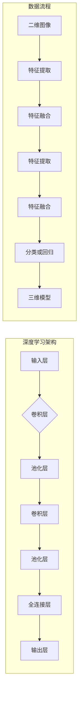

> 关键词：AI，深度学习，三维建模，神经网络，卷积神经网络，生成对抗网络，点云，几何建模，计算机视觉

# AI人工智能深度学习算法：在三维建模中的应用

三维建模是计算机图形学、计算机视觉和人工智能领域的一个重要研究方向。随着深度学习技术的快速发展，AI在三维建模中的应用越来越广泛，为传统建模方法带来了革命性的变化。本文将探讨深度学习算法在三维建模中的应用，从原理到实践，深入解析这一领域的最新进展。

## 1. 背景介绍

### 1.1 三维建模的发展历程

三维建模技术经历了从传统建模方法到基于几何建模再到基于深度学习建模的发展历程。传统建模方法主要依赖于人类的专业知识和技能，如多边形建模、曲面建模等。随着计算机图形学和计算机视觉的发展，基于几何建模的方法逐渐兴起，如参数化建模、NURBS建模等。近年来，随着深度学习技术的突破，基于深度学习的三维建模方法成为研究热点。

### 1.2 深度学习在三维建模中的应用

深度学习在三维建模中的应用主要体现在以下几个方面：

- **三维重建**：从单张或多张二维图像中重建三维模型。
- **三维建模**：从二维图像或点云数据生成三维模型。
- **三维模型编辑**：对已有的三维模型进行编辑和修改。
- **三维模型检索**：基于三维模型进行检索和分类。

## 2. 核心概念与联系

### 2.1 核心概念

- **深度学习**：一种模拟人脑神经网络的学习方法，通过层次化的神经网络结构，自动从数据中学习特征和模式。
- **卷积神经网络（CNN）**：一种特殊的神经网络，在图像处理领域具有广泛的应用，通过卷积层提取图像特征。
- **生成对抗网络（GAN）**：一种由生成器和判别器组成的对抗性网络，用于生成高质量的数据样本。
- **点云**：一种以点的形式表示三维物体的数据结构，广泛应用于三维建模、机器人导航等领域。
- **几何建模**：通过数学方法描述三维物体的几何形状，如多边形建模、曲面建模等。

### 2.2 核心概念原理和架构的 Mermaid 流程图



## 3. 核心算法原理 & 具体操作步骤

### 3.1 算法原理概述

### 3.2 算法步骤详解

#### 3.2.1 三维重建

1. 输入：单张或多张二维图像。
2. 特征提取：使用CNN提取图像特征。
3. 估计相机参数：根据图像和已知的相机模型，估计相机参数。
4. 三维重建：使用多视图几何方法，如结构从运动（Structure from Motion，SfM）或同时定位与建图（Simultaneous Localization and Mapping，SLAM），重建三维模型。
5. 精细化：使用迭代优化方法，如 bundle adjustment，细化三维模型的几何精度。

#### 3.2.2 三维建模

1. 输入：二维图像或点云数据。
2. 特征提取：使用CNN提取图像或点云特征。
3. 生成模型：使用GAN或变分自编码器（Variational Autoencoder，VAE）生成三维模型。
4. 后处理：对生成的三维模型进行后处理，如去噪、平滑等。

#### 3.2.3 三维模型编辑

1. 输入：三维模型和编辑指令。
2. 检测：使用CNN检测三维模型中的关键点。
3. 编辑：根据编辑指令修改三维模型的几何结构或材质属性。

#### 3.2.4 三维模型检索

1. 输入：三维模型数据库和查询三维模型。
2. 特征提取：使用CNN提取三维模型特征。
3. 检索：使用相似性度量，如余弦相似度或欧氏距离，检索与查询三维模型最相似的三维模型。

### 3.3 算法优缺点

#### 3.3.1 三维重建

**优点**：

- 自动化程度高，可处理大量数据。
- 可重建复杂的三维模型。

**缺点**：

- 对图像质量和相机参数的估计敏感。
- 重建精度受限于输入数据的数量和质量。

#### 3.3.2 三维建模

**优点**：

- 可以从少量数据或无监督数据生成高质量的三维模型。
- 可以生成具有复杂细节的三维模型。

**缺点**：

- 需要大量的计算资源。
- 生成模型可能存在模式崩溃或生成伪影。

#### 3.3.3 三维模型编辑

**优点**：

- 可自动检测和编辑三维模型中的关键点。
- 可以快速修改三维模型的几何结构或材质属性。

**缺点**：

- 需要大量的标注数据。
- 编辑结果受限于编辑指令的准确性。

#### 3.3.4 三维模型检索

**优点**：

- 可以快速检索与查询三维模型最相似的三维模型。
- 可以用于三维模型分类和聚类。

**缺点**：

- 检索精度受限于相似性度量方法和数据库规模。

### 3.4 算法应用领域

- **娱乐和游戏**：三维重建和建模技术可以用于游戏角色、场景的生成。
- **虚拟现实和增强现实**：三维重建和建模技术可以用于虚拟现实和增强现实应用。
- **工业设计**：三维建模和编辑技术可以用于产品设计、制造和测试。
- **机器人导航**：三维重建和点云处理技术可以用于机器人环境感知和路径规划。

## 4. 数学模型和公式 & 详细讲解 & 举例说明

### 4.1 数学模型构建

#### 4.1.1 卷积神经网络

卷积神经网络（CNN）是一种特殊的神经网络，在图像处理领域具有广泛的应用。CNN通过卷积层提取图像特征，并通过池化层降低特征空间维度。

#### 4.1.2 生成对抗网络

生成对抗网络（GAN）由生成器和判别器组成。生成器生成数据样本，判别器判断数据样本是真实样本还是生成样本。

### 4.2 公式推导过程

#### 4.2.1 卷积神经网络

卷积神经网络的公式如下：

$$
h_{l}(x) = f(W_{l}h_{l-1} + b_{l})
$$

其中，$h_{l}$ 表示第 $l$ 层的输出，$W_{l}$ 表示第 $l$ 层的权重，$b_{l}$ 表示第 $l$ 层的偏置，$f$ 表示激活函数。

#### 4.2.2 生成对抗网络

生成对抗网络的公式如下：

$$
D(G(z)) = \mathbb{E}_{x\sim p_{data}(x)}[D(x)] - \mathbb{E}_{z\sim p_{z}(z)}[D(G(z))]
$$

其中，$D$ 表示判别器，$G$ 表示生成器，$p_{data}$ 表示真实数据分布，$p_{z}$ 表示噪声分布。

### 4.3 案例分析与讲解

#### 4.3.1 三维重建

以MonoDepth模型为例，该模型使用CNN从单张图像中重建深度图，再通过深度图重建三维模型。

#### 4.3.2 三维建模

以ShapeNet模型为例，该模型使用VAE生成三维模型，并使用GAN优化模型生成质量。

## 5. 项目实践：代码实例和详细解释说明

### 5.1 开发环境搭建

- 操作系统：Linux
- 编程语言：Python
- 深度学习框架：PyTorch

### 5.2 源代码详细实现

以三维重建的MonoDepth模型为例，其PyTorch代码实现如下：

```python
import torch
import torch.nn as nn

class MonoDepth(nn.Module):
    def __init__(self):
        super(MonoDepth, self).__init__()
        self.backbone = ...  # 卷积神经网络
        self.decoder = ...  # 深度图解码器

    def forward(self, x):
        features = self.backbone(x)
        depth = self.decoder(features)
        return depth
```

### 5.3 代码解读与分析

MonoDepth模型的代码实现分为两个部分：卷积神经网络和深度图解码器。

- 卷积神经网络：使用CNN提取图像特征。
- 深度图解码器：将特征图解码为深度图。

### 5.4 运行结果展示

以下展示了使用MonoDepth模型重建三维模型的示例：

```python
import matplotlib.pyplot as plt

def plot_depth(depth, fig_num):
    plt.figure(fig_num)
    plt.imshow(depth)
    plt.title('Depth Map')
    plt.show()

# 加载模型
model = MonoDepth().to(device)
model.load_state_dict(torch.load('model.pth'))

# 加载图像
image = ...  # 加载单张图像

# 重建深度图
depth = model(image.to(device))

# 展示深度图
plot_depth(depth, 1)
```

## 6. 实际应用场景

### 6.1 娱乐和游戏

三维重建和建模技术可以用于游戏角色、场景的生成，为玩家提供更加沉浸式的游戏体验。

### 6.2 虚拟现实和增强现实

三维重建和建模技术可以用于虚拟现实和增强现实应用，如虚拟旅游、远程协作等。

### 6.3 工业设计

三维建模和编辑技术可以用于产品设计、制造和测试，提高设计效率。

### 6.4 机器人导航

三维重建和点云处理技术可以用于机器人环境感知和路径规划，提高机器人导航的精度和安全性。

## 7. 工具和资源推荐

### 7.1 学习资源推荐

- 《深度学习》
- 《Python深度学习》
- 《PyTorch深度学习》
- OpenCV官网：https://opencv.org/
- PyTorch官网：https://pytorch.org/

### 7.2 开发工具推荐

- PyTorch：https://pytorch.org/
- OpenCV：https://opencv.org/
- Blender：https://www.blender.org/

### 7.3 相关论文推荐

- Monodepth2: Accurate Single-View 3D Reconstruction of RGB-D Scans
- VoxelNet: End-to-End Learning for Point Cloud Detection
- PointNet: Deep Learning on Point Sets for 3D Classification and Segmentation

## 8. 总结：未来发展趋势与挑战

### 8.1 研究成果总结

深度学习技术在三维建模中的应用取得了显著成果，为三维建模领域带来了新的发展机遇。然而，仍有许多挑战需要克服，如模型精度、计算效率、可解释性等。

### 8.2 未来发展趋势

- **更精确的模型**：研究更精确的深度学习模型，提高三维建模的精度。
- **更高效的模型**：研究更高效的深度学习模型，降低计算资源消耗。
- **更可解释的模型**：研究可解释的深度学习模型，提高模型的可信度。

### 8.3 面临的挑战

- **数据集**：需要更多高质量的标注数据集。
- **计算资源**：需要更多高性能的计算资源。
- **算法复杂度**：需要降低算法复杂度，提高模型的计算效率。

### 8.4 研究展望

未来，深度学习技术将在三维建模领域发挥更大的作用，推动三维建模技术的进一步发展，为人类社会创造更多价值。

## 9. 附录：常见问题与解答

**Q1：深度学习在三维建模中有什么优势？**

A：深度学习在三维建模中具有以下优势：

- 自动化程度高，可处理大量数据。
- 可重建复杂的三维模型。
- 可从少量数据或无监督数据生成高质量的三维模型。
- 可用于三维模型编辑、检索等任务。

**Q2：如何提高三维重建的精度？**

A：提高三维重建精度的方法包括：

- 使用更高精度的深度学习模型。
- 使用更高分辨率的图像数据。
- 使用更精确的相机参数估计方法。
- 使用迭代优化方法细化三维模型的几何精度。

**Q3：如何提高三维建模的效率？**

A：提高三维建模效率的方法包括：

- 使用参数高效的深度学习模型。
- 使用更快的训练方法，如迁移学习、多任务学习等。
- 使用更快的推理方法，如模型压缩、量化等。

**Q4：如何提高模型的鲁棒性？**

A：提高模型鲁棒性的方法包括：

- 使用数据增强技术，增加模型的泛化能力。
- 使用正则化技术，防止模型过拟合。
- 使用对抗训练技术，提高模型的抗干扰能力。

---

作者：禅与计算机程序设计艺术 / Zen and the Art of Computer Programming