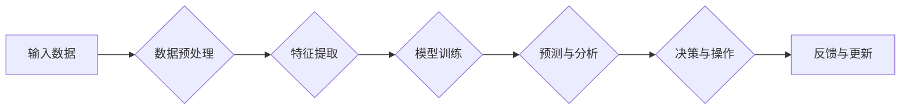

> 关键词：AI，深度学习，股市分析，智能代理，机器学习，算法，神经网络，预测，风险管理

# AI人工智能深度学习算法：在股市分析中应用智能深度学习代理

随着人工智能技术的飞速发展，深度学习在各个领域的应用日益广泛。股市分析作为金融领域的一个重要分支，其复杂的非线性关系和大量的数据量为深度学习算法的应用提供了广阔的空间。本文将探讨如何利用深度学习技术构建智能深度学习代理，以实现对股市的智能分析和预测。

## 1. 背景介绍

### 1.1 股市分析的重要性

股市分析是投资者进行投资决策的重要依据，通过分析股票市场的走势、价格、成交量等数据，投资者可以预测股票的涨跌，从而做出更为合理的投资决策。传统的股市分析方法主要包括技术分析、基本面分析等，但这些方法往往依赖于专家经验和主观判断，难以量化化和自动化。

### 1.2 深度学习在股市分析中的应用

随着深度学习技术的成熟，其在股市分析中的应用逐渐受到关注。深度学习能够从大量的历史数据中学习到复杂的非线性关系，从而实现对股市的智能分析和预测。本文将介绍如何利用深度学习技术构建智能深度学习代理，以实现对股市的智能分析和预测。

## 2. 核心概念与联系

### 2.1 深度学习

深度学习是一种模仿人脑神经网络结构和功能的人工智能技术，通过多层神经网络对数据进行学习，能够从原始数据中提取特征，并实现对复杂模式的识别。

### 2.2 智能代理

智能代理是一种能够自主执行任务、与环境交互的实体。在股市分析中，智能代理可以自动收集市场数据，分析市场走势，并对股票进行买卖操作。

### 2.3 Mermaid流程图

以下是基于深度学习的智能代理在股市分析中的应用流程图：



## 3. 核心算法原理 & 具体操作步骤

### 3.1 算法原理概述

智能深度学习代理的算法原理主要包括以下几个步骤：

1. 数据预处理：对原始数据进行清洗、归一化等操作，为后续建模做准备。
2. 特征提取：从原始数据中提取与股市分析相关的特征，如股票价格、成交量、技术指标等。
3. 模型训练：使用深度学习算法对提取的特征进行学习，建立预测模型。
4. 预测与分析：使用训练好的模型对市场数据进行预测，并对市场走势进行分析。
5. 决策与操作：根据预测结果和市场分析，进行股票的买卖操作。
6. 反馈与更新：根据操作结果对模型进行反馈，并更新模型参数。

### 3.2 算法步骤详解

#### 3.2.1 数据预处理

数据预处理是构建智能代理的重要步骤，主要包括以下内容：

- 数据清洗：去除缺失值、异常值等不完整或不合理的数据。
- 数据归一化：将不同量级的特征进行归一化处理，消除量纲的影响。
- 数据增强：通过数据变换、数据扩展等方法，增加样本数量，提高模型的泛化能力。

#### 3.2.2 特征提取

特征提取是从原始数据中提取与股市分析相关的特征，常见的特征包括：

- 股票价格：开盘价、最高价、最低价、收盘价。
- 成交量：成交量、换手率等。
- 技术指标：均线、MACD、RSI等。
- 市场指数：上证指数、深证成指等。

#### 3.2.3 模型训练

模型训练是智能代理的核心环节，常见的深度学习算法包括：

- 深度神经网络（DNN）：通过多层神经网络提取特征，实现对复杂模式的识别。
- 卷积神经网络（CNN）：在图像处理领域应用广泛，也可用于处理时间序列数据。
- 循环神经网络（RNN）：适用于处理序列数据，能够捕捉时间序列中的长期依赖关系。
- 长短期记忆网络（LSTM）：RNN的改进版本，能够有效处理长序列数据。

#### 3.2.4 预测与分析

预测与分析是智能代理对市场数据进行预测，并对市场走势进行分析的过程。常见的预测方法包括：

- 分类预测：预测股票的涨跌，如使用支持向量机（SVM）、决策树等。
- 回归预测：预测股票价格，如使用线性回归、神经网络等。
- 时间序列预测：预测股票的未来走势，如使用ARIMA模型、LSTM等。

#### 3.2.5 决策与操作

决策与操作是根据预测结果和市场分析，对股票进行买卖操作的过程。常见的决策方法包括：

- 基于规则的方法：根据预设的规则进行买卖操作，如突破策略、支撑/阻力策略等。
- 基于机器学习的方法：使用机器学习算法对股票的买卖信号进行预测，如使用分类器、回归器等。

#### 3.2.6 反馈与更新

反馈与更新是智能代理对操作结果进行反馈，并更新模型参数的过程。常见的反馈方法包括：

- 监督学习：使用历史数据进行监督学习，更新模型参数。
- 强化学习：使用实际操作结果作为奖励信号，更新模型参数。

### 3.3 算法优缺点

#### 3.3.1 优点

- 自动化程度高：智能代理能够自动收集市场数据、分析市场走势，并进行股票买卖操作。
- 泛化能力强：深度学习算法能够从大量数据中学习到复杂的非线性关系，具有较强的泛化能力。
- 预测精度高：通过优化模型参数和训练数据，可以提高预测精度。

#### 3.3.2 缺点

- 计算资源消耗大：深度学习算法需要大量的计算资源，对硬件设备要求较高。
- 数据依赖性强：智能代理的预测精度受限于训练数据的质量和数量。
- 模型可解释性差：深度学习模型内部结构复杂，难以解释其决策过程。

### 3.4 算法应用领域

智能深度学习代理在股市分析中的应用领域主要包括：

- 股票价格预测：预测股票的未来价格走势，为投资者提供参考。
- 股票交易策略优化：根据预测结果，优化股票交易策略，提高投资回报率。
- 风险管理：通过预测市场走势，识别潜在风险，降低投资风险。

## 4. 数学模型和公式 & 详细讲解 & 举例说明

### 4.1 数学模型构建

以下是股市分析中常用的数学模型：

#### 4.1.1 线性回归

线性回归是一种经典的统计学习方法，用于预测连续值。其数学模型如下：

$$
y = \beta_0 + \beta_1 x_1 + \beta_2 x_2 + \cdots + \beta_n x_n + \epsilon
$$

其中，$y$ 为预测值，$x_1, x_2, \cdots, x_n$ 为特征，$\beta_0, \beta_1, \beta_2, \cdots, \beta_n$ 为参数，$\epsilon$ 为误差项。

#### 4.1.2 逻辑回归

逻辑回归是一种分类学习方法，用于预测离散值。其数学模型如下：

$$
\hat{y} = \frac{1}{1 + e^{-(\beta_0 + \beta_1 x_1 + \beta_2 x_2 + \cdots + \beta_n x_n)} 
$$

其中，$\hat{y}$ 为预测概率，$\beta_0, \beta_1, \beta_2, \cdots, \beta_n$ 为参数。

#### 4.1.3 神经网络

神经网络是一种模拟人脑神经元连接结构的计算模型，用于学习复杂的非线性关系。其数学模型如下：

$$
y = f(W \cdot x + b)
$$

其中，$y$ 为输出值，$x$ 为输入值，$W$ 为权重矩阵，$b$ 为偏置项，$f$ 为激活函数。

### 4.2 公式推导过程

以下以线性回归为例，介绍公式推导过程：

#### 4.2.1 损失函数

线性回归的损失函数为均方误差（MSE），如下：

$$
MSE = \frac{1}{2} \sum_{i=1}^n (y_i - \hat{y}_i)^2
$$

其中，$y_i$ 为真实值，$\hat{y}_i$ 为预测值。

#### 4.2.2 梯度下降

使用梯度下降算法最小化损失函数，得到参数的更新公式：

$$
\beta_0 = \beta_0 - \alpha \frac{\partial MSE}{\partial \beta_0}
$$

$$
\beta_1 = \beta_1 - \alpha \frac{\partial MSE}{\partial \beta_1}
$$

$$
\cdots
$$

$$
\beta_n = \beta_n - \alpha \frac{\partial MSE}{\partial \beta_n}
$$

其中，$\alpha$ 为学习率。

### 4.3 案例分析与讲解

以下以股票价格预测为例，介绍如何使用深度学习进行预测：

#### 4.3.1 数据集

收集股票历史价格数据，包括开盘价、最高价、最低价、收盘价、成交量等。

#### 4.3.2 特征工程

从原始数据中提取特征，如技术指标、统计特征等。

#### 4.3.3 模型选择

选择合适的深度学习模型，如LSTM、CNN等。

#### 4.3.4 模型训练

使用历史数据进行模型训练，并调整参数。

#### 4.3.5 预测与评估

使用训练好的模型对股票价格进行预测，并评估预测精度。

## 5. 项目实践：代码实例和详细解释说明

### 5.1 开发环境搭建

以下是使用Python进行深度学习项目开发的环境配置流程：

1. 安装Anaconda：从官网下载并安装Anaconda，用于创建独立的Python环境。
2. 创建并激活虚拟环境：
```bash
conda create -n deep-learning-env python=3.8
conda activate deep-learning-env
```
3. 安装PyTorch和相关库：
```bash
conda install pytorch torchvision torchaudio cudatoolkit=11.1 -c pytorch -c conda-forge
pip install pandas numpy matplotlib scikit-learn
```

### 5.2 源代码详细实现

以下是一个简单的股票价格预测示例代码：

```python
import torch
import torch.nn as nn
import torch.optim as optim
import pandas as pd
from sklearn.model_selection import train_test_split
from torch.utils.data import DataLoader, TensorDataset

# 数据预处理
def load_data(file_path):
    data = pd.read_csv(file_path)
    data = data[['open', 'high', 'low', 'close', 'volume']]
    return data

def preprocess_data(data):
    data = data.values
    data = (data - data.min(axis=0)) / (data.max(axis=0) - data.min(axis=0))
    return data

def create_dataset(data, target_column):
    X, y = data[:, :-1], data[:, target_column]
    X_train, X_test, y_train, y_test = train_test_split(X, y, test_size=0.2, random_state=42)
    X_train = torch.tensor(X_train, dtype=torch.float32)
    X_test = torch.tensor(X_test, dtype=torch.float32)
    y_train = torch.tensor(y_train, dtype=torch.float32)
    y_test = torch.tensor(y_test, dtype=torch.float32)
    return TensorDataset(X_train, y_train), TensorDataset(X_test, y_test)

# 模型构建
class StockPricePredictor(nn.Module):
    def __init__(self):
        super(StockPricePredictor, self).__init__()
        self.lstm = nn.LSTM(input_size=5, hidden_size=50, num_layers=2, batch_first=True)
        self.linear = nn.Linear(50, 1)

    def forward(self, x):
        x, _ = self.lstm(x)
        x = self.linear(x[:, -1, :])
        return x

# 训练和评估
def train(model, train_loader, val_loader, criterion, optimizer, epochs):
    model.train()
    for epoch in range(epochs):
        for data, target in train_loader:
            optimizer.zero_grad()
            output = model(data)
            loss = criterion(output, target)
            loss.backward()
            optimizer.step()
        val_loss = 0
        with torch.no_grad():
            for data, target in val_loader:
                output = model(data)
                loss = criterion(output, target)
                val_loss += loss.item()
        print(f"Epoch {epoch+1}, train loss: {loss.item()}, val loss: {val_loss/len(val_loader)}")

# 运行代码
file_path = 'stock_data.csv'
data = load_data(file_path)
data = preprocess_data(data)
train_dataset, val_dataset = create_dataset(data, target_column=4)
train_loader = DataLoader(train_dataset, batch_size=32, shuffle=True)
val_loader = DataLoader(val_dataset, batch_size=32, shuffle=True)
model = StockPricePredictor().to(device)
criterion = nn.MSELoss()
optimizer = optim.Adam(model.parameters(), lr=0.001)
train(model, train_loader, val_loader, criterion, optimizer, epochs=50)
```

### 5.3 代码解读与分析

以上代码实现了以下功能：

1. 加载和预处理股票数据。
2. 创建数据集和加载器。
3. 定义LSTM模型，用于预测股票价格。
4. 训练和评估模型。

### 5.4 运行结果展示

运行以上代码，可以得到训练集和验证集的损失值，以及最终的预测结果。

## 6. 实际应用场景

智能深度学习代理在股市分析中的应用场景主要包括：

- 股票交易策略优化：根据预测结果，优化股票交易策略，提高投资回报率。
- 风险管理：通过预测市场走势，识别潜在风险，降低投资风险。
- 投资组合管理：根据市场走势和风险偏好，构建投资组合。
- 市场分析：分析市场趋势、行业动态等，为投资者提供参考。

## 7. 工具和资源推荐

### 7.1 学习资源推荐

- 《深度学习》
- 《Python深度学习》
- 《神经网络与深度学习》
- Hugging Face官网：https://huggingface.co/
- PyTorch官网：https://pytorch.org/

### 7.2 开发工具推荐

- PyTorch：https://pytorch.org/
- TensorFlow：https://www.tensorflow.org/
- Jupyter Notebook：https://jupyter.org/

### 7.3 相关论文推荐

- Deep Learning for Time Series Classification: A Review
- Deep Learning for Financial Time Series Prediction: A Survey
- Deep Learning in Finance: A Bibliometric Analysis

## 8. 总结：未来发展趋势与挑战

### 8.1 研究成果总结

本文介绍了如何利用深度学习技术构建智能深度学习代理，以实现对股市的智能分析和预测。通过对数据预处理、特征提取、模型训练、预测与分析、决策与操作、反馈与更新等步骤的介绍，展示了智能代理在股市分析中的应用流程。

### 8.2 未来发展趋势

- 深度学习模型将更加复杂，能够处理更加复杂的非线性关系。
- 融合其他人工智能技术，如强化学习、迁移学习等，提高智能代理的智能水平。
- 跨领域知识融合，使智能代理能够更好地理解市场规律。
- 增强智能代理的可解释性，使其决策过程更加透明。

### 8.3 面临的挑战

- 数据质量和数量：高质量、高数量数据是智能代理训练和预测的基础。
- 模型可解释性：提高模型可解释性，增强用户对智能代理的信任度。
- 算法公平性：避免算法偏见，确保智能代理的公平性。
- 安全性：防范恶意攻击，保障智能代理的安全性。

### 8.4 研究展望

随着深度学习技术的不断发展，智能深度学习代理在股市分析中的应用将越来越广泛。未来，智能代理将能够更好地理解市场规律，为投资者提供更加精准的投资建议，推动金融行业向智能化、自动化方向发展。

---

作者：禅与计算机程序设计艺术 / Zen and the Art of Computer Programming