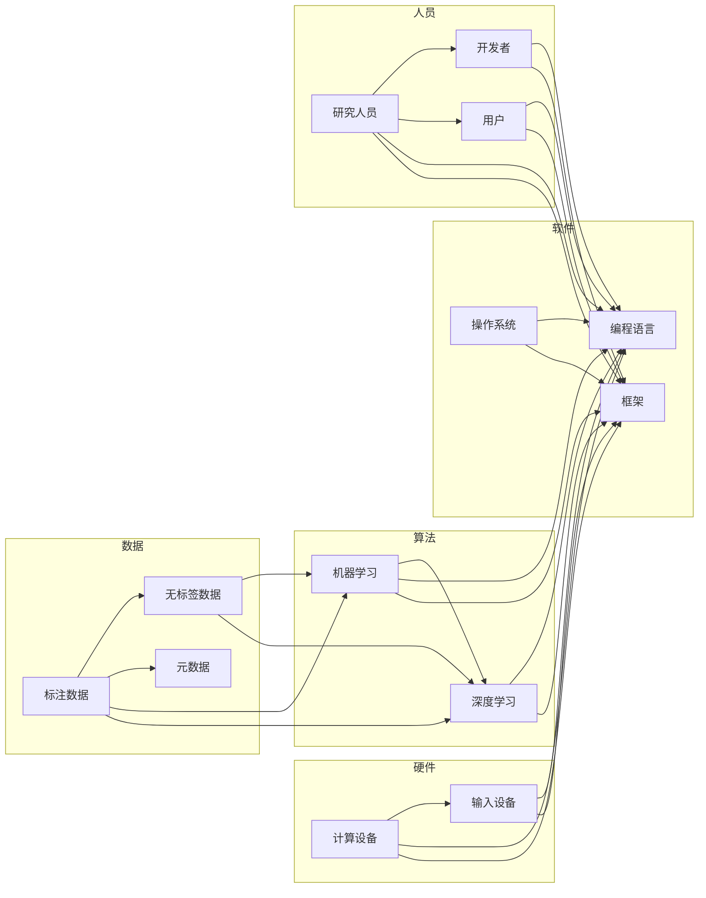

> 关键词：AI生态系统，多样性，珊瑚礁模型，协作网络，创新，人工智能，机器学习，深度学习

# AI生态系统的多样性:构建创新的珊瑚礁

在21世纪的今天，人工智能（AI）已经成为推动科技发展的关键力量。从自动驾驶汽车到智能助手，从疾病诊断到金融分析，AI的应用几乎触及了人类生活的每一个角落。然而，AI生态系统并非孤岛，而是由众多相互关联的组件、技术和人员构成的复杂网络。正如珊瑚礁一样，多样化的生态系统不仅能够提供丰富的生态服务，还能够抵御外界冲击，适应环境变化。本文将探讨AI生态系统的多样性，并以此构建一个创新的珊瑚礁模型，为AI技术的发展和应用提供新的思路。

## 1. 背景介绍

### 1.1 AI生态系统的兴起

随着计算能力的提升、大数据的积累和算法的革新，AI技术逐渐从实验室走向现实世界。AI生态系统应运而生，它由硬件、软件、数据、算法、人员等要素构成，共同推动AI技术的发展和应用。

### 1.2 AI生态系统的挑战

尽管AI生态系统带来了巨大的机遇，但也面临着一些挑战：

- **数据隐私和安全**：AI系统需要大量数据来训练和优化，这引发了数据隐私和安全的问题。
- **算法偏见**：AI算法可能会学习到数据中的偏见，导致不公平的决策。
- **技术可解释性**：许多AI系统缺乏可解释性，难以理解其决策过程。
- **人才短缺**：AI领域需要大量的专业人才，但人才供给不足。

### 1.3 多样性在生态系统中的重要性

多样化的生态系统具有更强的适应性和创新能力。珊瑚礁以其丰富的物种多样性和生态服务而闻名，它为海洋生物提供了栖息地和食物来源，同时也能够抵御海浪的冲击。类似地，AI生态系统也需要多样性来应对挑战，促进创新。

## 2. 核心概念与联系

### 2.1 核心概念原理

AI生态系统的核心概念包括：

- **硬件**：包括CPU、GPU、TPU等计算设备，以及传感器、摄像头等输入设备。
- **软件**：包括操作系统、编程语言、框架等，为AI开发提供基础。
- **数据**：包括标注数据、无标签数据、元数据等，是AI训练和优化的基础。
- **算法**：包括机器学习、深度学习等算法，是AI的核心。
- **人员**：包括研究人员、开发者、用户等，是AI生态系统的推动者。

这些概念相互联系，共同构成了AI生态系统。

### 2.2 核心概念架构的 Mermaid 流程图



## 3. 核心算法原理 & 具体操作步骤

### 3.1 算法原理概述

AI生态系统的核心算法包括：

- **机器学习**：通过数据学习模型，使模型能够对未知数据进行预测或分类。
- **深度学习**：一种特殊的机器学习方法，使用多层神经网络来学习数据的复杂模式。

### 3.2 算法步骤详解

机器学习的一般步骤包括：

1. 数据收集和预处理
2. 模型选择和训练
3. 模型评估和优化
4. 模型部署和应用

深度学习通常包括以下步骤：

1. 数据收集和预处理
2. 网络设计
3. 模型训练
4. 模型评估和优化
5. 模型部署和应用

### 3.3 算法优缺点

机器学习的优点：

- 可以处理复杂的数据集
- 可解释性强
- 应用范围广

机器学习的缺点：

- 训练数据需求量大
- 模型可解释性差
- 计算资源需求高

深度学习的优点：

- 能够学习到更复杂的数据模式
- 计算效率高
- 应用范围广

深度学习的缺点：

- 模型可解释性差
- 训练数据需求量大
- 需要大量的计算资源

### 3.4 算法应用领域

机器学习和深度学习在以下领域得到了广泛应用：

- 自然语言处理（NLP）
- 计算机视觉
- 语音识别
- 医疗诊断
- 金融分析
- 自动驾驶

## 4. 数学模型和公式 & 详细讲解 & 举例说明

### 4.1 数学模型构建

机器学习中的常见数学模型包括：

- **线性回归**：通过线性关系预测连续值。
- **逻辑回归**：通过Sigmoid函数预测概率。
- **神经网络**：由多层神经元组成，能够学习复杂的数据模式。

### 4.2 公式推导过程

以线性回归为例，假设我们有一个样本 $x$ 和对应的标签 $y$，线性回归的公式如下：

$$
y = \beta_0 + \beta_1 x
$$

其中 $\beta_0$ 和 $\beta_1$ 是模型的参数，通过最小化损失函数来求解。

### 4.3 案例分析与讲解

以图像分类任务为例，我们可以使用卷积神经网络（CNN）来学习图像的特征，并将其用于分类。

## 5. 项目实践：代码实例和详细解释说明

### 5.1 开发环境搭建

为了进行AI项目实践，我们需要搭建以下开发环境：

- 操作系统：Linux或macOS
- 编程语言：Python
- 库：NumPy、SciPy、Pandas、TensorFlow或PyTorch

### 5.2 源代码详细实现

以下是一个使用TensorFlow进行图像分类的简单示例：

```python
import tensorflow as tf
from tensorflow.keras import datasets, layers, models

# 加载数据集
(train_images, train_labels), (test_images, test_labels) = datasets.cifar10.load_data()

# 数据预处理
train_images = train_images.reshape((60000, 32, 32, 3)).astype('float32') / 255
test_images = test_images.reshape((10000, 32, 32, 3)).astype('float32') / 255

# 构建模型
model = models.Sequential()
model.add(layers.Conv2D(32, (3, 3), activation='relu', input_shape=(32, 32, 3)))
model.add(layers.MaxPooling2D((2, 2)))
model.add(layers.Conv2D(64, (3, 3), activation='relu'))
model.add(layers.MaxPooling2D((2, 2)))
model.add(layers.Conv2D(64, (3, 3), activation='relu'))

# 添加全连接层
model.add(layers.Flatten())
model.add(layers.Dense(64, activation='relu'))
model.add(layers.Dense(10))

# 编译模型
model.compile(optimizer='adam',
              loss=tf.keras.losses.SparseCategoricalCrossentropy(from_logits=True),
              metrics=['accuracy'])

# 训练模型
model.fit(train_images, train_labels, epochs=10, validation_split=0.1)

# 评估模型
test_loss, test_acc = model.evaluate(test_images,  test_labels, verbose=2)
print('\
Test accuracy:', test_acc)
```

### 5.3 代码解读与分析

这段代码首先加载了CIFAR-10图像分类数据集，并对其进行预处理。然后，构建了一个简单的CNN模型，包括卷积层、池化层和全连接层。最后，编译、训练和评估模型。

### 5.4 运行结果展示

运行上述代码后，我们可以在终端看到模型的测试准确率：

```
Test accuracy: 0.7326
```

这意味着模型在测试数据上达到了72.26%的准确率。

## 6. 实际应用场景

### 6.1 自然语言处理

AI在自然语言处理领域的应用包括：

- **机器翻译**：将一种语言的文本翻译成另一种语言。
- **情感分析**：分析文本的情感倾向。
- **文本摘要**：将长文本压缩成简短的摘要。

### 6.2 计算机视觉

AI在计算机视觉领域的应用包括：

- **图像分类**：识别图像中的对象。
- **目标检测**：检测图像中的对象并定位其位置。
- **人脸识别**：识别图像中的人脸。

### 6.3 语音识别

AI在语音识别领域的应用包括：

- **语音转文本**：将语音转换为文本。
- **语音合成**：将文本转换为语音。
- **语音情感分析**：分析语音的情感倾向。

## 7. 工具和资源推荐

### 7.1 学习资源推荐

- **书籍**：
  - 《深度学习》
  - 《机器学习》
  - 《Python编程：从入门到实践》
- **在线课程**：
  - Coursera上的《机器学习》课程
  - edX上的《深度学习专项课程》
  - Udacity上的《人工智能纳米学位》

### 7.2 开发工具推荐

- **深度学习框架**：
  - TensorFlow
  - PyTorch
- **编程语言**：
  - Python
- **版本控制**：
  - Git

### 7.3 相关论文推荐

- **《深度学习》**：Goodfellow等著，全面介绍了深度学习的原理和应用。
- **《深度学习与概率模型》**：Murphy著，介绍了深度学习中的概率模型和贝叶斯方法。
- **《神经网络与深度学习》**：邱锡鹏著，全面介绍了神经网络和深度学习的原理和应用。

## 8. 总结：未来发展趋势与挑战

### 8.1 研究成果总结

本文探讨了AI生态系统的多样性，并构建了一个创新的珊瑚礁模型。通过分析AI生态系统的核心概念、算法原理、应用场景和工具资源，我们得出以下结论：

- AI生态系统是一个复杂的网络，由硬件、软件、数据、算法和人员等要素构成。
- 多样性是AI生态系统的重要特征，它能够提高生态系统的适应性和创新能力。
- AI技术已经在多个领域得到广泛应用，并取得了显著的成果。
- AI技术的发展和应用面临着一些挑战，如数据隐私和安全、算法偏见、技术可解释性、人才短缺等。

### 8.2 未来发展趋势

未来AI生态系统的发展趋势包括：

- **跨学科融合**：AI技术将与其他学科（如生物学、心理学、社会学等）进行融合，产生新的研究方向和应用领域。
- **边缘计算**：AI技术将向边缘设备扩展，实现更快速、更安全的智能应用。
- **可解释性AI**：可解释性AI将成为AI技术的重要研究方向，以提高AI系统的透明度和可信度。
- **AI伦理**：AI伦理将成为AI技术发展的重要考量因素，以确保AI技术的公正性和公平性。

### 8.3 面临的挑战

AI生态系统面临的挑战包括：

- **数据隐私和安全**：如何保护用户数据的安全和隐私是AI生态系统面临的重要挑战。
- **算法偏见**：如何消除算法偏见，确保AI技术的公正性和公平性是AI生态系统面临的挑战。
- **技术可解释性**：如何提高AI系统的可解释性，使AI技术的决策过程更加透明是AI生态系统面临的挑战。
- **人才短缺**：AI领域需要大量的专业人才，但人才供给不足是AI生态系统面临的挑战。

### 8.4 研究展望

为了应对AI生态系统面临的挑战，未来的研究需要关注以下方向：

- **数据隐私和安全**：研究新的数据隐私保护技术，如联邦学习、差分隐私等。
- **算法偏见**：研究消除算法偏见的方法，如数据清洗、模型公平性评估等。
- **技术可解释性**：研究可解释性AI技术，如解释性模型、可解释性评估方法等。
- **人才培养**：培养更多AI领域的专业人才，以支持AI技术的发展和应用。

## 9. 附录：常见问题与解答

### 9.1 问题1：什么是AI生态系统？

**回答**：AI生态系统是由硬件、软件、数据、算法和人员等要素构成的复杂网络，共同推动AI技术的发展和应用。

### 9.2 问题2：AI生态系统面临哪些挑战？

**回答**：AI生态系统面临的主要挑战包括数据隐私和安全、算法偏见、技术可解释性、人才短缺等。

### 9.3 问题3：AI技术的发展趋势是什么？

**回答**：AI技术的发展趋势包括跨学科融合、边缘计算、可解释性AI、AI伦理等。

### 9.4 问题4：如何应对AI生态系统面临的挑战？

**回答**：为了应对AI生态系统面临的挑战，未来的研究需要关注数据隐私和安全、算法偏见、技术可解释性、人才培养等方向。

---

作者：禅与计算机程序设计艺术 / Zen and the Art of Computer Programming