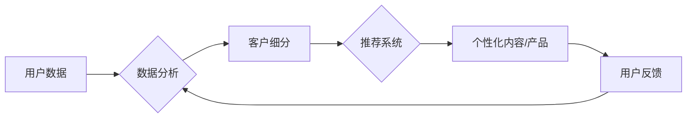

> 关键词：个性化营销，机器学习，客户细分，推荐系统，数据挖掘，自然语言处理，深度学习，营销自动化

# AI驱动的个性化营销:精准触达消费者

个性化营销是现代营销策略的核心，它通过理解消费者的个人喜好和需求，提供高度定制化的产品和服务，从而提高客户满意度和忠诚度。随着人工智能（AI）技术的快速发展，AI驱动的个性化营销已经成为企业竞争的新高地。本文将深入探讨AI在个性化营销中的应用，包括核心概念、算法原理、实践案例以及未来趋势。

## 1. 背景介绍

### 1.1 问题的由来

在传统的营销模式中，企业往往采用“一对多”的营销策略，即向大量潜在客户推送统一的内容或广告。这种模式效率低下，难以满足消费者日益增长的个性化需求。随着互联网的普及和大数据技术的发展，企业积累了海量的用户数据，为个性化营销提供了可能。

### 1.2 研究现状

AI技术的快速发展，为个性化营销提供了强大的技术支撑。目前，AI在个性化营销中的应用主要体现在以下几个方面：

- **客户细分**：通过机器学习算法对客户进行细分，将具有相似特征的客户归为一类，以便更精准地制定营销策略。
- **推荐系统**：利用协同过滤、内容推荐等技术，向客户推荐个性化的产品或服务。
- **自然语言处理（NLP）**：通过NLP技术分析客户的行为数据和文本数据，了解客户的需求和偏好。
- **营销自动化**：利用自动化工具，实现自动化营销活动，提高营销效率。

### 1.3 研究意义

AI驱动的个性化营销具有以下重要意义：

- 提高营销效率：通过精准触达目标客户，提高营销活动的转化率。
- 增强客户体验：提供个性化的产品和服务，提升客户满意度和忠诚度。
- 降低营销成本：通过自动化工具减少人力成本，提高营销活动的ROI。
- 创新营销模式：为营销策略带来新的可能性，推动营销行业的变革。

## 2. 核心概念与联系

### 2.1 核心概念

- **个性化营销**：根据消费者的个人喜好和需求，提供定制化的产品和服务。
- **机器学习**：一种使计算机能够从数据中学习并做出决策的技术。
- **客户细分**：根据消费者的特征和行为，将客户划分为不同的群体。
- **推荐系统**：利用算法向用户推荐个性化的内容或产品。
- **自然语言处理（NLP）**：使计算机能够理解和处理人类语言的技术。
- **营销自动化**：利用技术工具实现营销活动的自动化。

### 2.2 架构流程图



该流程图展示了AI驱动个性化营销的基本架构。用户数据经过数据分析后进行客户细分，然后推荐系统根据细分结果生成个性化的内容或产品，用户对个性化内容或产品的反馈又会反馈回数据分析环节，形成一个闭环。

## 3. 核心算法原理 & 具体操作步骤

### 3.1 算法原理概述

AI驱动的个性化营销主要依赖于以下算法：

- **客户细分算法**：如聚类算法（K-means、DBSCAN）、决策树（C4.5、ID3）等。
- **推荐系统算法**：如协同过滤（基于用户、基于物品）、内容推荐、混合推荐等。
- **NLP算法**：如词嵌入（Word2Vec、BERT）、情感分析、文本分类等。
- **营销自动化工具**：如电子邮件营销平台、社交媒体管理工具等。

### 3.2 算法步骤详解

1. **数据收集**：收集用户行为数据、交易数据、社交媒体数据等。
2. **数据清洗**：去除无效数据、缺失数据，确保数据质量。
3. **客户细分**：使用聚类算法将客户划分为不同的群体。
4. **推荐系统**：根据客户细分结果，使用推荐算法推荐个性化内容或产品。
5. **个性化内容生成**：使用NLP算法生成个性化的内容。
6. **营销自动化**：利用营销自动化工具实现自动化营销活动。
7. **效果评估**：评估营销活动的效果，并根据反馈进行调整。

### 3.3 算法优缺点

**客户细分算法**：

- **优点**：可以更精准地定位目标客户，提高营销效率。
- **缺点**：聚类算法的结果可能受到初始聚类中心的影响，且难以解释。

**推荐系统算法**：

- **优点**：可以推荐客户感兴趣的内容或产品，提高转化率。
- **缺点**：可能存在冷启动问题，即新用户难以获得个性化推荐。

**NLP算法**：

- **优点**：可以生成高质量的个性化内容，提高客户满意度。
- **缺点**：NLP算法的计算复杂度高，对数据质量要求高。

**营销自动化工具**：

- **优点**：可以提高营销效率，降低人力成本。
- **缺点**：可能存在过度依赖工具，忽视客户体验的问题。

### 3.4 算法应用领域

AI驱动的个性化营销算法在以下领域得到广泛应用：

- 电子商务：推荐产品、个性化推荐、个性化搜索等。
- 金融：个性化投资建议、个性化贷款产品等。
- 娱乐：个性化电影推荐、个性化音乐推荐等。
- 医疗：个性化健康建议、个性化治疗方案等。

## 4. 数学模型和公式 & 详细讲解 & 举例说明

### 4.1 数学模型构建

在个性化营销中，常见的数学模型包括：

- **客户细分**：K-means聚类模型、决策树模型等。
- **推荐系统**：协同过滤模型、内容推荐模型等。
- **NLP**：词嵌入模型、情感分析模型等。

### 4.2 公式推导过程

以K-means聚类为例，其目标是最小化每个点到其对应聚类中心的距离平方和：

$$
\min_{\mu_1,\mu_2,\ldots,\mu_k} \sum_{i=1}^n \sum_{j=1}^k (x_i-\mu_j)^2
$$

其中，$x_i$ 为第 $i$ 个样本，$\mu_j$ 为第 $j$ 个聚类中心。

### 4.3 案例分析与讲解

假设某电商平台想根据用户购买历史数据对用户进行细分。平台收集了1000名用户的购买数据，包括购买的商品类别、购买频率、购买金额等。

1. **数据清洗**：去除缺失值和异常值。
2. **特征选择**：选择与用户购买行为相关的特征，如商品类别、购买频率等。
3. **客户细分**：使用K-means聚类算法将用户划分为5个群体。
4. **分析结果**：根据聚类结果，可以针对不同群体制定不同的营销策略。

## 5. 项目实践：代码实例和详细解释说明

### 5.1 开发环境搭建

为了演示个性化营销的代码实现，我们需要搭建以下开发环境：

- Python 3.7+
- NumPy
- Pandas
- Scikit-learn
- Matplotlib

### 5.2 源代码详细实现

以下是一个使用Scikit-learn进行客户细分的代码示例：

```python
from sklearn.cluster import KMeans
import pandas as pd

# 加载数据
data = pd.read_csv('user_data.csv')

# 特征选择
features = ['category', 'frequency', 'amount']

# 客户细分
kmeans = KMeans(n_clusters=5, random_state=42)
clusters = kmeans.fit_predict(data[features])

# 将聚类结果添加到原始数据中
data['cluster'] = clusters

# 查看聚类结果
print(data[['user_id', 'cluster']])
```

### 5.3 代码解读与分析

该代码首先加载用户数据，然后选择与购买行为相关的特征，接着使用K-means聚类算法将用户划分为5个群体，并将聚类结果添加到原始数据中。最后，我们可以查看每个用户的聚类结果。

### 5.4 运行结果展示

假设聚类结果如下：

```
user_id  cluster
1        0
2        1
3        2
...
1000     4
```

根据聚类结果，我们可以针对不同群体制定不同的营销策略，例如：

- 对高频购买用户，可以提供优惠券或积分奖励。
- 对低频购买用户，可以推荐新品或促销活动。
- 对新用户，可以提供个性化推荐，引导他们购买更多商品。

## 6. 实际应用场景

### 6.1 电商平台个性化推荐

电商平台可以利用AI技术分析用户行为数据，为用户推荐个性化的商品。例如，亚马逊利用协同过滤算法为用户推荐相关商品，从而提高了用户的购买转化率。

### 6.2 金融行业个性化投资

金融机构可以利用AI技术分析客户的财务数据和行为数据，为客户提供个性化的投资建议。例如，富达投资利用机器学习算法为用户提供定制化的投资组合。

### 6.3 娱乐行业个性化内容推荐

娱乐行业可以利用AI技术分析用户观看历史数据，为用户推荐个性化的电影、音乐等。例如，Netflix利用协同过滤算法为用户推荐电影和电视剧。

## 7. 工具和资源推荐

### 7.1 学习资源推荐

- 《Python数据分析》
- 《机器学习》
- 《Scikit-learn用户指南》
- 《自然语言处理实战》

### 7.2 开发工具推荐

- Scikit-learn
- TensorFlow
- PyTorch
- Jupyter Notebook

### 7.3 相关论文推荐

- Collaborative Filtering for Pairwise Rating Prediction by Leveraging Social and Content Information
- Content-Based Recommendation Systems
- Deep Learning for Recommender Systems: A Survey and New Perspectives

## 8. 总结：未来发展趋势与挑战

### 8.1 研究成果总结

AI驱动的个性化营销已经成为营销行业的重要趋势，它通过精准触达消费者，提高了营销效率和客户满意度。然而，AI驱动的个性化营销仍面临着一些挑战，如数据隐私保护、算法偏见等。

### 8.2 未来发展趋势

- **数据隐私保护**：随着数据隐私保护法规的日益严格，企业需要更加注重数据隐私保护，采用联邦学习等隐私保护技术。
- **算法偏见**：AI算法可能会存在偏见，导致歧视性营销。未来需要加强对算法偏见的研究和监管。
- **跨渠道整合**：企业需要将线上线下数据整合，实现全渠道个性化营销。
- **个性化体验**：未来个性化营销将更加注重用户体验，提供更加个性化的服务。

### 8.3 面临的挑战

- **数据质量**：数据质量是AI驱动的个性化营销的基础，需要保证数据的质量和多样性。
- **技术难题**：AI驱动的个性化营销需要解决数据挖掘、机器学习、NLP等技术难题。
- **伦理问题**：AI驱动的个性化营销需要关注伦理问题，避免歧视和偏见。

### 8.4 研究展望

未来，AI驱动的个性化营销将朝着以下方向发展：

- **更加精准的推荐**：利用深度学习等技术，实现更加精准的个性化推荐。
- **更加智能的客服**：利用AI技术，提供更加智能的客服服务。
- **更加个性化的内容生成**：利用NLP技术，生成更加个性化的内容。
- **更加智能的营销自动化**：利用AI技术，实现更加智能的营销自动化。

## 9. 附录：常见问题与解答

**Q1：AI驱动的个性化营销与传统营销有什么区别？**

A：传统营销采用“一对多”的营销策略，而AI驱动的个性化营销采用“一对一”的营销策略，更加精准地触达消费者。

**Q2：AI驱动的个性化营销有哪些应用场景？**

A：AI驱动的个性化营销可以应用于电子商务、金融、娱乐、医疗等多个领域。

**Q3：如何保证AI驱动的个性化营销的数据隐私？**

A：企业需要采用联邦学习、差分隐私等技术，保证数据隐私。

**Q4：如何避免AI驱动的个性化营销的算法偏见？**

A：企业需要对算法进行评估，发现和消除算法偏见。

**Q5：AI驱动的个性化营销的未来发展趋势是什么？**

A：未来AI驱动的个性化营销将朝着更加精准、智能化、个性化的方向发展。

---

作者：禅与计算机程序设计艺术 / Zen and the Art of Computer Programming