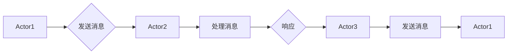

> Actor Model, 消息传递, 并发编程, 分布式系统, Actor系统, Erlang, Akka, Scala, 演示

# Actor Model原理与代码实例讲解

> 关键词：Actor Model, 消息传递, 并发编程, 分布式系统, Actor系统, Erlang, Akka, Scala

## 1. 背景介绍

在并发和分布式系统中，如何有效地管理并发实体之间的通信和数据流是一个核心问题。Actor Model（演员模型）提供了一种优雅且高效的方式来构建这些系统。它通过消息传递和轻量级线程（Actor）的概念，使得并发编程变得更加直观和易于管理。

### 1.1 问题的由来

传统的并发模型，如多线程和进程，通常依赖于共享内存或锁机制来实现并发控制。这些模型在处理复杂的并发场景时容易产生死锁、竞态条件等问题，特别是在分布式系统中，这些问题变得更加难以调试和解决。

### 1.2 研究现状

Actor Model作为一种更高级的并发模型，已经在多个编程语言和框架中得到实现和应用，如Erlang、Scala的Akka框架等。它提供了一种基于消息传递的并发模型，通过封装状态和行为，使得并发编程更加安全和可靠。

### 1.3 研究意义

Actor Model的核心思想是将并发实体抽象为Actor，通过发送和接收消息来进行交互。这种模型具有以下优势：

- **分布式友好**：易于在分布式系统中实现。
- **容错性强**：Actor的创建和死亡是透明的，易于实现故障恢复。
- **易于理解**：通过消息传递进行通信，降低了并发编程的复杂性。

### 1.4 本文结构

本文将分为以下章节：

- 第2章：介绍Actor Model的核心概念和联系。
- 第3章：讲解Actor Model的算法原理和具体操作步骤。
- 第4章：介绍Actor Model的数学模型和公式。
- 第5章：通过代码实例展示Actor Model的应用。
- 第6章：探讨Actor Model的实际应用场景和未来展望。
- 第7章：推荐Actor Model的学习资源和开发工具。
- 第8章：总结Actor Model的未来发展趋势与挑战。
- 第9章：提供附录，解答常见问题。

## 2. 核心概念与联系

### 2.1 核心概念

- **Actor**：Actor是并发系统中的基本单元，它封装了状态和行为。每个Actor都独立运行，通过发送和接收消息与其他Actor交互。
- **消息传递**：Actor之间的通信是通过发送和接收消息来实现的。消息可以是任何类型的数据，包括简单的值、复杂的数据结构或函数调用。
- **状态**：Actor维护自己的状态，状态是私有的，其他Actor无法直接访问。

### 2.2 Mermaid流程图



### 2.3 联系

Actor Model通过消息传递的方式实现了Actor之间的通信。每个Actor都独立运行，因此系统的复杂性得到了有效的控制。Actor之间的状态是私有的，这避免了共享内存带来的竞态条件问题。

## 3. 核心算法原理 & 具体操作步骤

### 3.1 算法原理概述

Actor Model的核心原理是：每个Actor独立运行，通过发送和接收消息来交互。当Actor收到消息时，它会根据消息的类型和内容执行相应的行为，并可能发送新的消息给其他Actor。

### 3.2 算法步骤详解

1. **创建Actor**：根据需要创建新的Actor实例。
2. **发送消息**：使用发送操作向其他Actor发送消息。
3. **接收消息**：Actor在内部处理接收到的消息，并可能发送回消息。
4. **调度**：系统调度器负责管理Actor的执行，包括消息的发送和接收。

### 3.3 算法优缺点

#### 优点

- **并发控制**：通过消息传递，Actor之间不会直接访问共享状态，从而避免了竞态条件。
- **容错性**：Actor的创建和死亡是透明的，易于实现故障恢复。
- **可伸缩性**：Actor可以在分布式系统中扩展，以处理更大的负载。

#### 缺点

- **通信开销**：消息传递可能会引入一定的通信开销。
- **线程竞争**：虽然Actor之间不共享内存，但它们可能需要竞争系统资源，如CPU和内存。

### 3.4 算法应用领域

Actor Model适用于需要高并发、高可靠性和高可伸缩性的系统，如：

- 分布式系统
- 实时系统
- 高并发Web应用

## 4. 数学模型和公式 & 详细讲解 & 举例说明

### 4.1 数学模型构建

Actor Model的数学模型可以描述为：

```
Actor = {state, behavior}
```

其中，`state`是Actor的状态，`behavior`是Actor的行为。

### 4.2 公式推导过程

Actor Model没有复杂的数学公式，其核心在于描述Actor的状态和行为。

### 4.3 案例分析与讲解

以下是一个简单的Actor模型示例：

```
Actor1 -> {state1, send_message(Actor2, "Hello")}
Actor2 -> {state2, receive_message(Actor1, "Hello"), send_message(Actor3, "Hello from Actor2")}
Actor3 -> {state3, receive_message(Actor2, "Hello from Actor2"), send_message(Actor1, "Hello from Actor3")}
```

在这个示例中，Actor1发送消息给Actor2，Actor2接收消息后发送回消息给Actor3，最后Actor3将消息发送回Actor1。

## 5. 项目实践：代码实例和详细解释说明

### 5.1 开发环境搭建

为了演示Actor Model，我们将使用Scala和Akka框架。以下是在IntelliJ IDEA中创建Akka项目的步骤：

1. 打开IntelliJ IDEA，创建新项目。
2. 选择Scala作为编程语言，并选择Akka作为依赖库。

### 5.2 源代码详细实现

以下是一个简单的Akka Actor示例：

```scala
import akka.actor.{Actor, ActorSystem, Props}

class GreetingActor extends Actor {
  override def receive: Receive = {
    case "hello" => sender() ! "Hello from GreetingActor!"
  }
}

object ActorExample extends App {
  val system = ActorSystem("GreetingActorSystem")
  val greetingActor = system.actorOf(Props[ GreetingActor ], "greetingActor")
  
  greetingActor ! "hello"
  println(s"Received: ${greetingActor.underlyingActor().receiveAndReply{in => in.reply("Hello from GreetingActor!")}}")
  
  system.terminate()
}
```

### 5.3 代码解读与分析

在这个示例中，我们创建了一个名为`GreetingActor`的Actor，它接收"hello"消息并回复"Hello from GreetingActor!"。在`ActorExample`对象中，我们创建了一个`GreetingActor`实例，并向它发送了"hello"消息。

### 5.4 运行结果展示

运行上述代码，控制台将输出：

```
Received: Hello from GreetingActor!
```

这表明Actor正确地接收了消息并给出了响应。

## 6. 实际应用场景

Actor Model在以下场景中特别有用：

- **分布式系统**：例如，分布式数据库、分布式计算框架。
- **实时系统**：例如，股票交易系统、实时监控系统。
- **高并发Web应用**：例如，电商平台、社交媒体平台。

### 6.4 未来应用展望

随着分布式系统和实时系统的日益普及，Actor Model将会在更多领域得到应用。未来，Actor Model可能会与其他并发模型和技术（如函数式编程、事件驱动架构）进行融合，以构建更加高效和可扩展的系统。

## 7. 工具和资源推荐

### 7.1 学习资源推荐

- 《Understanding Concurrency with Erlang/OTP》
- Akka官方文档
- Scala官方文档

### 7.2 开发工具推荐

- IntelliJ IDEA
- Scala IDE
- Play Framework

### 7.3 相关论文推荐

- "The Actor Model: A Brief Introduction"
- "Designing, Implementing, and Running erlang"
- "Actors in Distributed Systems"

## 8. 总结：未来发展趋势与挑战

### 8.1 研究成果总结

Actor Model作为一种有效的并发模型，已经在多个领域得到应用。它通过消息传递和Actor的概念，为并发编程提供了一种优雅且高效的方式。

### 8.2 未来发展趋势

- Actor Model可能会与其他并发模型和技术融合，以构建更加高效和可扩展的系统。
- Actor Model将会在更多领域得到应用，如人工智能、物联网等。

### 8.3 面临的挑战

- Actor Model的并发模型可能难以与传统模型兼容。
- Actor Model的性能可能不如传统的线程模型。

### 8.4 研究展望

Actor Model的研究将继续深入，以解决现有挑战并探索新的应用领域。

## 9. 附录：常见问题与解答

**Q1：Actor Model与多线程模型有什么区别？**

A1：Actor Model通过消息传递实现并发，而多线程模型通过共享内存和锁机制实现并发。Actor Model避免了共享内存带来的竞态条件问题，但可能引入通信开销。

**Q2：Actor Model适用于哪些类型的应用？**

A2：Actor Model适用于需要高并发、高可靠性和高可伸缩性的系统，如分布式系统、实时系统、高并发Web应用等。

**Q3：如何选择合适的Actor数量？**

A3：选择合适的Actor数量取决于具体的应用场景和系统负载。通常需要根据实验结果进行调整。

**Q4：Actor Model是否适用于所有并发场景？**

A4：Actor Model适用于需要高并发、高可靠性和高可伸缩性的并发场景。对于一些简单的并发场景，传统的多线程模型可能更加合适。

---

作者：禅与计算机程序设计艺术 / Zen and the Art of Computer Programming