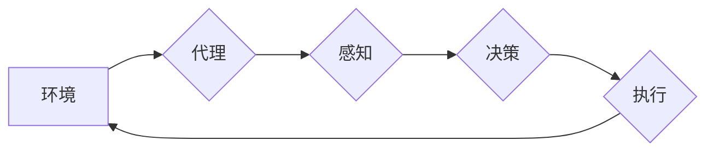

## 1. 背景介绍

在现代软件工程中，代理技术（Agent Technology）已成为一种重要的设计模式，它赋予软件系统自主学习、决策和执行任务的能力。代理是一种软件实体，能够感知环境、做出决策并与环境交互。代理技术在各种领域都有广泛的应用，例如：

* **人工智能（AI）：** 代理可以作为智能体，在游戏、机器人控制、自然语言处理等领域发挥作用。
* **分布式系统：** 代理可以作为中间件，协调不同组件之间的通信和数据交换。
* **网络安全：** 代理可以作为防火墙或入侵检测系统，监控网络流量并阻止恶意攻击。
* **电子商务：** 代理可以作为推荐引擎或个性化服务，根据用户的行为和偏好提供定制化的产品和服务。

## 2. 核心概念与联系

### 2.1 代理的概念

代理是一个软件实体，它能够自主地感知环境、做出决策并与环境交互。代理通常具有以下特征：

* **自主性：** 代理能够根据自身的目标和环境信息做出决策，无需人工干预。
* **感知能力：** 代理能够感知环境中的信息，例如传感器数据、网络流量或用户行为。
* **决策能力：** 代理能够根据感知到的信息做出决策，并执行相应的行动。
* **交互能力：** 代理能够与环境交互，例如发送消息、请求服务或控制设备。

### 2.2 代理架构

代理的架构通常包括以下几个部分：

* **代理平台：** 提供代理运行环境和基础设施，例如代理调度、资源管理和通信机制。
* **代理本体：** 包含代理的知识、行为和目标，决定代理的行为方式。
* **代理接口：** 用于代理与环境交互的接口，例如网络协议、数据库连接或传感器接口。

### 2.3 代理与其他技术的联系

代理技术与其他技术密切相关，例如：

* **人工智能（AI）：** 代理可以利用人工智能算法，例如机器学习和深度学习，增强其感知、决策和学习能力。
* **分布式系统：** 代理可以作为分布式系统的组成部分，协调不同节点之间的通信和数据交换。
* **物联网（IoT）：** 代理可以作为物联网设备的智能控制单元，感知环境信息并执行相应的控制动作。

**Mermaid 流程图**



## 3. 核心算法原理 & 具体操作步骤

### 3.1 算法原理概述

代理技术的核心算法原理是基于**状态机**和**行为树**的组合。

* **状态机:** 用于描述代理在不同状态下的行为模式，每个状态对应一个特定的行为规则。
* **行为树:** 用于描述代理的行为决策逻辑，将复杂的决策任务分解成多个子任务，并使用树形结构表示任务之间的关系。

通过状态机和行为树的结合，代理能够根据环境信息和自身目标，选择合适的行为策略并执行相应的动作。

### 3.2 算法步骤详解

1. **环境感知:** 代理通过传感器或其他感知机制获取环境信息。
2. **状态更新:** 根据感知到的环境信息，代理更新自身的内部状态。
3. **决策执行:** 代理根据当前状态和行为树的决策逻辑，选择合适的行为动作。
4. **动作执行:** 代理执行选定的行为动作，并与环境交互。
5. **反馈处理:** 代理接收环境的反馈信息，并更新自身的知识和行为策略。

### 3.3 算法优缺点

**优点:**

* **自主性强:** 代理能够自主地感知环境、做出决策并执行行动。
* **适应性强:** 代理能够根据环境变化调整行为策略。
* **可扩展性强:** 代理可以轻松地扩展和组合，构建更复杂的智能系统。

**缺点:**

* **设计复杂:** 设计代理的本体和行为树需要专业知识和经验。
* **资源消耗:** 代理的运行需要一定的计算资源和存储空间。
* **安全性问题:** 代理的自主性也可能带来安全风险，需要进行相应的安全防护。

### 3.4 算法应用领域

代理技术在以下领域有广泛的应用:

* **机器人控制:** 代理可以控制机器人的运动和行为，使其能够自主地完成任务。
* **游戏开发:** 代理可以作为游戏中的智能对手，提供更具挑战性和趣味性的游戏体验。
* **网络安全:** 代理可以作为入侵检测系统或防火墙，监控网络流量并阻止恶意攻击。
* **电子商务:** 代理可以作为推荐引擎或个性化服务，根据用户的行为和偏好提供定制化的产品和服务。

## 4. 数学模型和公式 & 详细讲解 & 举例说明

### 4.1 数学模型构建

代理的决策过程可以抽象为一个**马尔可夫决策过程 (MDP)**。

* **状态空间 (S):** 代理可能处于的各种状态集合。
* **动作空间 (A):** 代理可以执行的各种动作集合。
* **转移概率 (P):** 从一个状态执行一个动作后转移到另一个状态的概率。
* **奖励函数 (R):** 代理在某个状态执行某个动作后获得的奖励值。
* **折扣因子 (γ):** 用于权衡未来奖励和当前奖励的因素。

### 4.2 公式推导过程

代理的目标是找到一个**最优策略 (π)**，使得在执行该策略时，代理能够获得最大的累积奖励。最优策略可以通过**动态规划**或**强化学习**算法来求解。

* **Bellman方程:** 用于描述最优价值函数的递推关系。

$$
V^*(s) = \max_a \sum_{s'} P(s'|s,a) [R(s,a,s') + \gamma V^*(s')]
$$

* **价值函数 (V):** 表示代理从某个状态开始执行最优策略所能获得的最大累积奖励。

### 4.3 案例分析与讲解

例如，一个代理在玩游戏时，它的状态空间可以是游戏中的地图，动作空间可以是移动、攻击或使用道具等。转移概率可以是代理执行动作后到达不同地图位置的概率。奖励函数可以是获得积分、击杀敌人或完成任务的奖励。通过使用Bellman方程或强化学习算法，代理可以学习到最优策略，从而获得更高的游戏分数。

## 5. 项目实践：代码实例和详细解释说明

### 5.1 开发环境搭建

* **操作系统:** Linux 或 macOS
* **编程语言:** Python
* **库:**

    * **OpenAI Gym:** 用于构建和测试强化学习环境。
    * **TensorFlow 或 PyTorch:** 用于实现强化学习算法。

### 5.2 源代码详细实现

```python
import gym
import tensorflow as tf

# 定义代理类
class Agent:
    def __init__(self, state_size, action_size):
        self.state_size = state_size
        self.action_size = action_size
        self.model = self.build_model()

    def build_model(self):
        # 使用 TensorFlow 或 PyTorch构建代理模型
        #...

    def act(self, state):
        # 根据当前状态选择动作
        #...

    def train(self, state, action, reward, next_state, done):
        # 使用强化学习算法更新代理模型
        #...

# 创建游戏环境
env = gym.make('CartPole-v1')

# 创建代理实例
agent = Agent(env.observation_space.shape[0], env.action_space.n)

# 训练代理
for episode in range(100):
    state = env.reset()
    done = False
    total_reward = 0
    while not done:
        action = agent.act(state)
        next_state, reward, done, _ = env.step(action)
        agent.train(state, action, reward, next_state, done)
        state = next_state
        total_reward += reward
    print(f"Episode {episode+1}: Total Reward = {total_reward}")

# 测试代理
state = env.reset()
while True:
    action = agent.act(state)
    state, reward, done, _ = env.step(action)
    env.render()
    if done:
        break
```

### 5.3 代码解读与分析

* **代理类:** 定义代理的结构和行为，包括感知环境、选择动作、学习策略等功能。
* **模型构建:** 使用 TensorFlow 或 PyTorch构建代理模型，用于映射状态到动作。
* **动作选择:** 根据当前状态和模型的输出，选择最优动作。
* **训练过程:** 使用强化学习算法，根据环境反馈信息更新代理模型的参数。
* **游戏环境:** 使用 OpenAI Gym 创建游戏环境，提供代理与环境交互的接口。

### 5.4 运行结果展示

运行代码后，代理将开始训练，并在训练过程中逐渐学习到控制游戏角色的策略。最终，代理能够在游戏中获得更高的分数，并完成游戏目标。

## 6. 实际应用场景

### 6.1 智能机器人

代理技术可以赋予机器人自主学习和决策的能力，使其能够在复杂环境中完成任务。例如，在仓库物流中，代理可以控制机器人自动搬运货物，根据库存信息和订单需求做出最优路径规划。

### 6.2 自动驾驶汽车

代理技术可以用于开发自动驾驶汽车，使其能够感知周围环境、做出驾驶决策并控制车辆行驶。例如，代理可以根据道路状况、交通流量和车辆位置，选择最安全和高效的驾驶路线。

### 6.3 个性化推荐系统

代理技术可以用于构建个性化推荐系统，根据用户的行为和偏好，推荐个性化的产品和服务。例如，电商平台可以利用代理技术，根据用户的浏览历史、购买记录和评价信息，推荐他们可能感兴趣的商品。

### 6.4 网络安全

代理技术可以用于构建网络安全系统，例如入侵检测系统和防火墙。代理可以监控网络流量，识别恶意攻击并采取相应的防御措施。

### 6.5 未来应用展望

随着人工智能技术的不断发展，代理技术将在更多领域得到应用，例如：

* **医疗保健:** 代理可以辅助医生诊断疾病、制定治疗方案和管理患者健康。
* **教育:** 代理可以提供个性化的学习辅导、自动批改作业和评估学生学习进度。
* **金融:** 代理可以用于风险管理、欺诈检测和投资决策。

## 7. 工具和资源推荐

### 7.1 学习资源推荐

* **书籍:**

    * 《代理技术》 by Michael Wooldridge
    * 《人工智能：现代方法》 by Stuart Russell and Peter Norvig

* **在线课程:**

    * Coursera: Artificial Intelligence
    * edX: Introduction to Artificial Intelligence

### 7.2 开发工具推荐

* **OpenAI Gym:** 用于构建和测试强化学习环境。
* **TensorFlow:** 用于实现深度学习算法。
* **PyTorch:** 用于实现深度学习算法。
* **ROS (Robot Operating System):** 用于机器人开发。

### 7.3 相关论文推荐

* **Multi-Agent Reinforcement Learning: A Survey** by Busoniu, L., Babuska, R., & De Schutter, B.
* **Deep Reinforcement Learning: An Overview** by Mnih, V., Kavukcuoglu, K., Silver, D., Rusu, A. A., Veness, J., Bellemare, M. G.,... & Hassabis, D.

## 8. 总结：未来发展趋势与挑战

### 8.1 研究成果总结

代理技术在过去几十年取得了显著进展，从简单的状态机模型发展到复杂的深度学习代理。代理技术已经应用于多个领域，并取得了令人瞩目的成果。

### 8.2 未来发展趋势

* **多智能体系统:** 研究如何让多个代理协同工作，解决更复杂的任务。
* **迁移学习:** 研究如何让代理将已学习的知识迁移到新的环境中。
* **解释性AI:** 研究如何使代理的决策过程更加透明和可解释。
* **安全性和可靠性:** 研究如何确保代理的安全性、可靠性和伦理性。

  