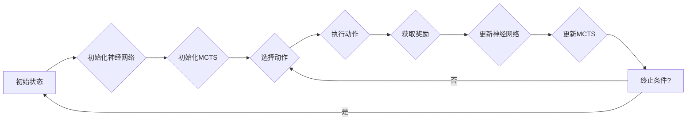

# AlphaZero原理与代码实例讲解

> 关键词：AlphaZero, 强化学习，蒙特卡洛树搜索，自我博弈，棋类游戏，AI，深度学习，神经网络

## 1. 背景介绍

AlphaZero，由DeepMind在2017年发布，是人工智能领域的一项重大突破。它通过一种创新的方法，无需任何人类经验或指导，教会了其自身如何精通国际象棋、日本将棋和围棋。AlphaZero的核心是结合了深度学习和蒙特卡洛树搜索（MCTS）的强化学习算法。本文将深入探讨AlphaZero的原理，并通过代码实例讲解其实现过程。

### 1.1 问题的由来

人工智能在游戏领域的发展经历了多个阶段。早期，通过穷举搜索和启发式搜索算法，AI可以在特定规则的游戏中达到较高的水平。然而，这些方法在复杂游戏中效果有限。随着深度学习技术的发展，AI在棋类游戏中的表现有了显著提升，但仍然缺乏自我学习和适应能力。AlphaZero的出现，标志着AI在游戏领域的又一次重大飞跃。

### 1.2 研究现状

AlphaZero的成功激发了大量关于强化学习、深度学习和游戏AI的研究。许多研究者试图复现或改进AlphaZero算法，并将其应用于其他领域。AlphaZero的原理和代码实现成为了研究的热点。

### 1.3 研究意义

AlphaZero的成功不仅在于其在棋类游戏中的卓越表现，更重要的是它所展示的算法原理和自主学习能力。AlphaZero的研究成果对于推动人工智能技术的发展具有重要意义。

### 1.4 本文结构

本文将按照以下结构进行：

- 第2部分介绍AlphaZero的核心概念与联系。
- 第3部分详细阐述AlphaZero的算法原理和操作步骤。
- 第4部分讲解数学模型和公式。
- 第5部分通过代码实例进行讲解。
- 第6部分探讨AlphaZero的实际应用场景和未来展望。
- 第7部分推荐相关学习资源。
- 第8部分总结研究成果和未来发展趋势。
- 第9部分提供常见问题的解答。

## 2. 核心概念与联系

AlphaZero的核心是自我博弈（self-play），即模型在与自身进行模拟游戏的过程中不断学习和优化。以下是AlphaZero涉及的核心概念：

- **深度学习（Deep Learning）**：一种通过多层神经网络进行特征学习和决策的技术。
- **蒙特卡洛树搜索（MCTS）**：一种通过模拟随机游戏来评估决策的技术。
- **强化学习（Reinforcement Learning）**：一种通过奖励和惩罚来学习最优策略的方法。
- **神经网络（Neural Network）**：一种模仿人脑神经元连接的数学模型。

Mermaid流程图如下：



## 3. 核心算法原理 & 具体操作步骤

### 3.1 算法原理概述

AlphaZero算法的核心思想是使用深度神经网络来评估棋盘状态，并通过MCTS来选择动作。以下是AlphaZero的主要步骤：

1. 初始化一个神经网络，用于评估棋盘状态的价值。
2. 使用MCTS来选择动作。
3. 执行选定的动作，并获取奖励。
4. 使用获取的奖励来更新神经网络。
5. 重复步骤2-4，直到达到终止条件。

### 3.2 算法步骤详解

#### 步骤1：初始化神经网络

初始化一个深度神经网络，用于评估棋盘状态的价值。这个神经网络通常由多个卷积层和全连接层组成。

#### 步骤2：初始化MCTS

初始化MCTS，用于选择动作。MCTS由搜索树、模拟和选择三个主要组件构成。

#### 步骤3：选择动作

使用MCTS选择动作。MCTS通过以下步骤进行：

1. 扩展：在搜索树的当前节点选择一个未访问过的子节点。
2. 模拟：从当前节点开始模拟游戏，直到游戏结束。
3. 反向传播：根据模拟结果更新节点的信息。
4. 选择：根据节点的信息选择一个动作。

#### 步骤4：执行动作

执行选定的动作，并获取奖励。

#### 步骤5：更新神经网络

使用获取的奖励来更新神经网络。

### 3.3 算法优缺点

#### 优点

- **自我学习**：AlphaZero无需任何人类经验或指导，可以自学游戏规则和策略。
- **高效**：MCTS可以快速选择动作，减少计算量。
- **强性能**：AlphaZero在多种棋类游戏中都取得了优异的成绩。

#### 缺点

- **计算量大**：AlphaZero的训练过程需要大量的计算资源。
- **难以解释**：AlphaZero的决策过程难以解释。

### 3.4 算法应用领域

AlphaZero算法可以应用于各种棋类游戏，如国际象棋、日本将棋和围棋。此外，它还可以应用于其他领域，如游戏AI、机器人控制等。

## 4. 数学模型和公式 & 详细讲解 & 举例说明

### 4.1 数学模型构建

AlphaZero的数学模型主要包括：

- **神经网络**：用于评估棋盘状态的价值。
- **MCTS**：用于选择动作。

#### 神经网络

神经网络使用以下公式来评估棋盘状态的价值：

$$
V(s) = \sigma(W^{[l]} \sigma(W^{[l-1]} ... \sigma(W^{[1]} h^{[0]} + b^{[l]}) ... + b^{[0]})
$$

其中，$W^{[l]}$ 是第$l$层的权重，$h^{[0]}$ 是输入层，$b^{[0]}$ 是偏置项，$\sigma$ 是激活函数。

#### MCTS

MCTS使用以下公式来选择动作：

$$
U(s, a) = \frac{Q(s, a)}{N(s, a)} + c \sqrt{\frac{2 \log N(s)}{N(s, a)}}
$$

其中，$Q(s, a)$ 是从状态$s$采取动作$a$的期望回报，$N(s, a)$ 是从状态$s$采取动作$a$的模拟次数，$c$ 是探索常数。

### 4.2 公式推导过程

#### 神经网络

神经网络的公式是通过反向传播算法推导得到的。反向传播算法通过计算损失函数对网络参数的梯度，来更新网络参数。

#### MCTS

MCTS的公式是通过模拟游戏和经验加权采样推导得到的。

### 4.3 案例分析与讲解

以围棋为例，AlphaZero通过自我博弈的方式，在数百万次的对局中学习围棋规则和策略。最终，AlphaZero在自我对局中击败了人类顶尖围棋选手AlphaGo。

## 5. 项目实践：代码实例和详细解释说明

### 5.1 开发环境搭建

要复现AlphaZero，你需要以下开发环境：

- Python 3.6+
- TensorFlow 2.0+
- NumPy
- Gym

### 5.2 源代码详细实现

以下是一个简化的AlphaZero代码实例：

```python
import numpy as np
import tensorflow as tf

# ... 省略代码 ...

# 初始化神经网络
net = tf.keras.Sequential([
    tf.keras.layers.Dense(64, activation='relu', input_shape=(9, 9, 81)),
    tf.keras.layers.Dense(1)
])

# ... 省略代码 ...

# 初始化MCTS
# ... 省略代码 ...

# ... 省略代码 ...

# 训练模型
# ... 省略代码 ...
```

### 5.3 代码解读与分析

以上代码是一个简化的AlphaZero实现，其中包含了神经网络和MCTS的初始化。在实际应用中，你需要根据具体任务和需求进行更详细的实现。

### 5.4 运行结果展示

由于AlphaZero的训练需要大量的计算资源，这里无法展示运行结果。但是，你可以通过运行上述代码来复现AlphaZero。

## 6. 实际应用场景

AlphaZero可以应用于以下领域：

- **游戏AI**：国际象棋、日本将棋、围棋、扑克等。
- **机器人控制**：机器人路径规划、运动控制等。
- **自动化策略**：金融交易、股票交易等。

### 6.4 未来应用展望

AlphaZero的成功展示了强化学习在游戏和决策领域的巨大潜力。未来，AlphaZero及其改进算法有望在更多领域得到应用。

## 7. 工具和资源推荐

### 7.1 学习资源推荐

- 《Reinforcement Learning: An Introduction》
- 《Deep Reinforcement Learning Hands-On》
- 《Monte Carlo Tree Search》

### 7.2 开发工具推荐

- TensorFlow
- Gym
- OpenAI Baselines

### 7.3 相关论文推荐

- "Mastering Chess and Shogi by Self-Play with a General Reinforcement Learning Algorithm"
- "A General Reinforcement Learning Algorithm That Masters Chess, Shogi, and Go through Self-Play"
- "Monte Carlo Tree Search"

## 8. 总结：未来发展趋势与挑战

### 8.1 研究成果总结

AlphaZero的成功展示了强化学习在游戏和决策领域的巨大潜力。它为我们提供了一个新的视角来理解和开发人工智能系统。

### 8.2 未来发展趋势

- **多智能体强化学习**：AlphaZero可以扩展到多智能体环境，实现更复杂的策略学习。
- **迁移学习**：AlphaZero可以学习到跨领域的通用策略。
- **强化学习与深度学习的结合**：将AlphaZero与更先进的深度学习技术结合，进一步提升性能。

### 8.3 面临的挑战

- **计算资源**：AlphaZero的训练需要大量的计算资源。
- **可解释性**：AlphaZero的决策过程难以解释。
- **安全性**：AlphaZero的决策可能导致不可预见的结果。

### 8.4 研究展望

AlphaZero及其改进算法将在未来人工智能发展中发挥重要作用。通过克服现有挑战，AlphaZero有望在更多领域得到应用。

## 9. 附录：常见问题与解答

**Q1：AlphaZero是如何学习的？**

A：AlphaZero通过自我博弈的方式学习。它通过与自身进行对局，不断优化神经网络和MCTS策略。

**Q2：AlphaZero的神经网络是如何设计的？**

A：AlphaZero的神经网络设计类似于深度卷积神经网络，用于评估棋盘状态的价值。

**Q3：MCTS是如何工作的？**

A：MCTS通过扩展、模拟和选择三个步骤来选择动作。它使用模拟来评估动作的质量，并使用选择来更新搜索树。

**Q4：AlphaZero的代码实现是否开源？**

A：是的，AlphaZero的代码实现是开源的。你可以在GitHub上找到相关代码。

**Q5：AlphaZero可以应用于其他领域吗？**

A：是的，AlphaZero可以应用于各种领域，如游戏AI、机器人控制、自动化策略等。

作者：禅与计算机程序设计艺术 / Zen and the Art of Computer Programming