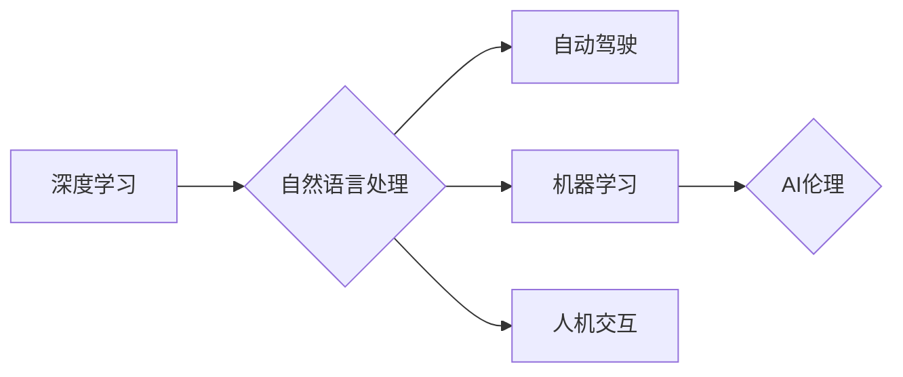

# Andrej Karpathy：人工智能的未来发展方向

> 关键词：人工智能，深度学习，自然语言处理，自动驾驶，机器学习，人机交互，AI伦理

## 1. 背景介绍

安德烈·卡尔帕西（Andrej Karpathy）是一位著名的计算机科学家和人工智能研究者，以其在自然语言处理（NLP）领域的杰出贡献而闻名。他在Twitter上有着广泛的读者群体，经常分享关于人工智能发展的见解和思考。本文将探讨卡尔帕西关于人工智能未来发展方向的观点，分析其核心思想和潜在影响。

### 1.1 人工智能的崛起

近年来，随着深度学习技术的突破，人工智能（AI）在多个领域取得了显著的进展。从图像识别到语音识别，从自然语言处理到自动驾驶，AI的应用无处不在。卡尔帕西作为这一领域的领军人物，对AI的未来发展方向有着独到的见解。

### 1.2 卡尔帕西的学术背景

卡尔帕西在斯坦福大学获得了计算机科学博士学位，曾在Google Brain和OpenAI工作，担任研究科学家和工程师。他的研究兴趣集中在机器学习、深度学习和NLP等领域，发表了多篇具有影响力的论文，并在国际会议上发表演讲。

## 2. 核心概念与联系

### 2.1 核心概念原理

卡尔帕西提出的人工智能未来发展方向的核心概念包括：

- **深度学习**：一种通过多层神经网络自动学习数据表示的学习方法。
- **自然语言处理**：使计算机能够理解、解释和生成人类语言的技术。
- **自动驾驶**：利用AI技术实现车辆自动行驶的技术。
- **机器学习**：使计算机能够从数据中学习并做出决策的技术。
- **人机交互**：研究如何使人类与机器更有效地交互的技术。
- **AI伦理**：研究AI技术在应用过程中应遵循的伦理原则。

### 2.2 架构的 Mermaid 流程图



## 3. 核心算法原理 & 具体操作步骤

### 3.1 算法原理概述

卡尔帕西所提到的人工智能技术都基于深度学习原理。深度学习通过多层神经网络自动学习数据中的特征和模式，从而实现各种复杂任务。

### 3.2 算法步骤详解

深度学习通常包括以下步骤：

1. **数据收集**：收集大量的标注数据，用于训练模型。
2. **数据预处理**：对数据进行清洗、归一化等操作，使其适合模型训练。
3. **模型设计**：设计合适的神经网络结构，包括层数、神经元数量、激活函数等。
4. **模型训练**：使用训练数据对模型进行训练，不断调整参数，使模型输出逼近真实标签。
5. **模型评估**：使用验证集评估模型性能，调整模型参数，优化模型结构。
6. **模型部署**：将训练好的模型部署到实际应用中，进行推理预测。

### 3.3 算法优缺点

深度学习算法的优点包括：

- **强大的学习能力**：能够自动从数据中学习复杂的特征和模式。
- **泛化能力**：在未见过的数据上也能取得不错的效果。
- **灵活性**：适用于各种不同的应用场景。

然而，深度学习算法也存在一些缺点：

- **计算资源需求**：需要大量的计算资源进行训练。
- **数据依赖性**：模型的性能很大程度上取决于训练数据的质量和数量。
- **可解释性**：模型的决策过程难以解释，存在“黑盒”问题。

### 3.4 算法应用领域

深度学习算法在以下领域取得了显著的应用：

- **自然语言处理**：机器翻译、文本分类、情感分析等。
- **计算机视觉**：图像识别、目标检测、图像生成等。
- **语音识别**：语音转文字、语音合成等。
- **自动驾驶**：环境感知、路径规划、决策控制等。

## 4. 数学模型和公式 & 详细讲解 & 举例说明

### 4.1 数学模型构建

深度学习中的核心数学模型是神经网络。神经网络由多个神经元组成，每个神经元都是一个简单的数学函数，用于处理输入数据。

### 4.2 公式推导过程

以下是一个简单的神经网络模型的公式推导过程：

$$
y = \sigma(W \cdot x + b)
$$

其中，$y$ 是神经元的输出，$\sigma$ 是激活函数，$W$ 是权重矩阵，$x$ 是输入向量，$b$ 是偏置向量。

### 4.3 案例分析与讲解

以图像识别任务为例，我们可以使用卷积神经网络（CNN）来识别图像中的物体。

1. **数据预处理**：对图像进行归一化、裁剪、翻转等操作，使其适合CNN输入。
2. **模型设计**：设计一个卷积神经网络，包括多个卷积层、池化层和全连接层。
3. **模型训练**：使用标注图像数据对模型进行训练，不断调整权重和偏置。
4. **模型评估**：使用验证集评估模型性能，调整模型参数，优化模型结构。
5. **模型部署**：将训练好的模型部署到实际应用中，对未知图像进行物体识别。

## 5. 项目实践：代码实例和详细解释说明

### 5.1 开发环境搭建

为了实现上述图像识别任务，我们需要搭建以下开发环境：

- Python编程语言
- PyTorch深度学习框架
- OpenCV图像处理库

### 5.2 源代码详细实现

以下是一个简单的卷积神经网络模型实现：

```python
import torch
import torch.nn as nn

class SimpleCNN(nn.Module):
    def __init__(self):
        super(SimpleCNN, self).__init__()
        self.conv1 = nn.Conv2d(3, 32, kernel_size=3, stride=1, padding=1)
        self.pool = nn.MaxPool2d(kernel_size=2, stride=2, padding=0)
        self.fc1 = nn.Linear(32 * 7 * 7, 128)
        self.fc2 = nn.Linear(128, 10)

    def forward(self, x):
        x = self.pool(torch.relu(self.conv1(x)))
        x = x.view(-1, 32 * 7 * 7)
        x = torch.relu(self.fc1(x))
        x = self.fc2(x)
        return x

# 创建模型实例并设置设备
model = SimpleCNN().to(device)

# 损失函数和优化器
criterion = nn.CrossEntropyLoss()
optimizer = torch.optim.Adam(model.parameters(), lr=0.001)

# 训练模型
for epoch in range(num_epochs):
    for data, target in train_loader:
        data, target = data.to(device), target.to(device)
        optimizer.zero_grad()
        output = model(data)
        loss = criterion(output, target)
        loss.backward()
        optimizer.step()
```

### 5.3 代码解读与分析

上述代码实现了一个简单的卷积神经网络模型，用于图像识别任务。模型包括一个卷积层、一个池化层和两个全连接层。训练过程中，我们使用交叉熵损失函数和Adam优化器来优化模型参数。

### 5.4 运行结果展示

在完成模型训练后，我们可以使用测试集来评估模型的性能。以下是一个简单的性能评估代码：

```python
def test(model, test_loader):
    correct = 0
    total = 0
    with torch.no_grad():
        for data, target in test_loader:
            data, target = data.to(device), target.to(device)
            outputs = model(data)
            _, predicted = torch.max(outputs.data, 1)
            total += target.size(0)
            correct += (predicted == target).sum().item()
    print(f'Accuracy of the network on the 10000 test images: {100 * correct / total}%')

# 调用测试函数评估模型性能
test(model, test_loader)
```

## 6. 实际应用场景

### 6.1 自动驾驶

自动驾驶是AI技术在交通领域的应用之一。通过使用摄像头、雷达等传感器获取周围环境信息，自动驾驶系统可以识别道路、行人、车辆等物体，并做出相应的决策，实现安全、高效的自动驾驶。

### 6.2 自然语言处理

自然语言处理是AI技术在信息处理领域的应用之一。通过使用NLP技术，我们可以实现对文本数据的自动分析、理解和生成，从而提高信息处理的效率和准确性。

### 6.3 医疗诊断

AI技术在医疗领域的应用可以辅助医生进行诊断和治疗。通过分析医学影像、病历等数据，AI可以帮助医生发现疾病、制定治疗方案，并预测疾病发展趋势。

## 7. 工具和资源推荐

### 7.1 学习资源推荐

- 《深度学习》（Ian Goodfellow、Yoshua Bengio、Aaron Courville著）
- 《神经网络与深度学习》（邱锡鹏著）
- 《自然语言处理综论》（Christopher D. Manning、Prabhakar Raghavan、Hans Peter Steffen著）

### 7.2 开发工具推荐

- PyTorch：一个流行的开源深度学习框架。
- TensorFlow：另一个流行的开源深度学习框架。
- Keras：一个高层次的神经网络API，可以与TensorFlow或Theano兼容。

### 7.3 相关论文推荐

- "A Neural Probabilistic Language Model"（Geoffrey Hinton、Geoffrey E. Hinton、Yoshua Bengio著）
- "Deep Learning for Natural Language Processing"（Richard Socher、Christopher D. Manning、Eduard Hovy著）
- "Unsupervised Learning of Visual Representations by Solving Jigsaw Puzzles"（Alexander A. A. Efros、Ian Goodfellow、Andrew C. Berg著）

## 8. 总结：未来发展趋势与挑战

### 8.1 研究成果总结

本文介绍了安德烈·卡尔帕西关于人工智能未来发展方向的观点，分析了其核心思想和潜在影响。通过探讨深度学习、自然语言处理、自动驾驶等领域的最新进展，我们可以看到AI技术在不断发展，为人类社会带来更多可能性。

### 8.2 未来发展趋势

未来，人工智能技术将呈现以下发展趋势：

- **多模态学习**：结合文本、图像、语音等多种模态数据，实现更全面的信息理解。
- **强化学习**：利用强化学习技术，使AI能够自主学习和决策，提高系统的适应性和灵活性。
- **可解释性**：提高AI系统的可解释性，使人类能够理解AI的决策过程。

### 8.3 面临的挑战

尽管AI技术取得了显著进展，但仍然面临着以下挑战：

- **数据质量**：高质量的数据是AI训练的基础，如何获取和标注高质量数据是一个重要问题。
- **计算资源**：深度学习模型需要大量的计算资源进行训练，如何降低计算成本是一个挑战。
- **伦理问题**：AI技术的发展也引发了一系列伦理问题，如何确保AI技术的安全性、可靠性和公平性是一个重要课题。

### 8.4 研究展望

未来，人工智能技术的研究将朝着以下方向发展：

- **跨学科研究**：人工智能与其他学科的交叉融合，如心理学、认知科学等。
- **可解释AI**：提高AI系统的可解释性，使人类能够理解AI的决策过程。
- **AI伦理**：建立AI伦理规范，确保AI技术的安全性和公平性。

相信在科学家、工程师和伦理学家的共同努力下，人工智能技术将不断进步，为人类社会带来更多福祉。

## 9. 附录：常见问题与解答

**Q1：人工智能是否会取代人类？**

A：人工智能不会取代人类。人工智能是一种工具，旨在辅助人类完成特定任务。人类具有创造力和情感，而人工智能则擅长处理数据和执行重复性工作。

**Q2：人工智能是否会导致失业？**

A：人工智能可能会替代某些低技能的工作，但也会创造新的就业机会。人类应该通过不断学习和提升自身技能，适应人工智能时代的变化。

**Q3：人工智能是否具有情感？**

A：人工智能本身不具备情感。人工智能可以通过模拟人类的情感表达来产生类似的情感效果，但这并不意味着它们具有真实的情感。

**Q4：人工智能是否具有道德观念？**

A：人工智能本身不具备道德观念。人类应该制定相应的伦理规范，确保人工智能技术的应用符合道德原则。

**Q5：人工智能是否能够实现通用人工智能（AGI）？**

A：目前，人工智能还远未达到通用人工智能的水平。通用人工智能需要具备人类水平的认知能力，目前仍处于研究阶段。

作者：禅与计算机程序设计艺术 / Zen and the Art of Computer Programming