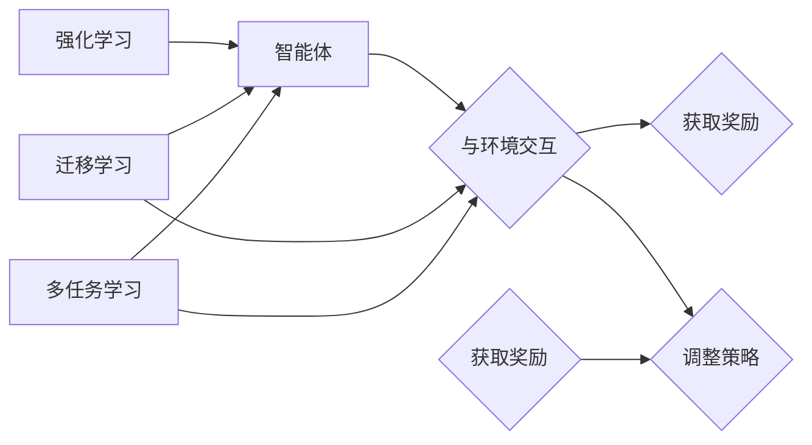

# 强化学习Reinforcement Learning中的迁移学习与多任务学习

作者：禅与计算机程序设计艺术 / Zen and the Art of Computer Programming

## 1. 背景介绍
### 1.1 问题的由来

强化学习（Reinforcement Learning，RL）作为人工智能领域的一个重要分支，已经在游戏、机器人控制、自动驾驶、推荐系统等领域取得了显著的成果。然而，强化学习也面临着一些挑战，例如需要大量的样本数据、训练过程不稳定、难以泛化到新的环境等。为了解决这些问题，迁移学习和多任务学习被引入到强化学习中，并取得了显著的进展。

### 1.2 研究现状

迁移学习和多任务学习在强化学习中的应用研究近年来逐渐增多，主要集中在以下几个方面：

- **经验重放（Experience Replay）**：通过将过去的经验重放给学习器，减少样本数据的方差，提高学习效率。
- **领域自适应（Domain Adaptation）**：通过将一个领域的学习经验迁移到另一个领域，提高模型在新的环境中的表现。
- **多智能体强化学习（Multi-Agent Reinforcement Learning）**：通过将多个智能体协同完成任务，提高系统的整体性能。
- **多任务学习（Multi-Task Learning）**：通过同时学习多个任务，提高模型在单个任务上的表现。

### 1.3 研究意义

迁移学习和多任务学习在强化学习中的应用，具有重要的理论和实际意义：

- **减少样本数据的依赖**：通过迁移学习，可以将已有领域的学习经验迁移到新的领域，减少对新样本数据的依赖。
- **提高学习效率**：通过多任务学习，可以同时学习多个任务，提高模型在单个任务上的学习效率。
- **提高泛化能力**：通过迁移学习和多任务学习，可以提高模型在新的环境中的泛化能力。

### 1.4 本文结构

本文将围绕强化学习中的迁移学习和多任务学习展开讨论，主要包括以下内容：

- 核心概念与联系
- 核心算法原理与具体操作步骤
- 数学模型和公式
- 项目实践
- 实际应用场景
- 工具和资源推荐
- 总结：未来发展趋势与挑战

## 2. 核心概念与联系

本节将介绍强化学习、迁移学习、多任务学习等核心概念，并阐述它们之间的关系。

### 2.1 强化学习

强化学习是一种通过与环境交互来学习如何完成特定任务的学习方法。在强化学习中，智能体通过与环境交互，不断尝试不同的动作，并根据动作的结果（奖励）来调整自己的策略。

### 2.2 迁移学习

迁移学习是一种将已有领域的学习经验迁移到新的领域的学习方法。在迁移学习中，智能体将已学到的知识应用到新的环境中，从而减少对新样本数据的依赖。

### 2.3 多任务学习

多任务学习是一种同时学习多个任务的学习方法。在多任务学习中，智能体同时学习多个任务，从而提高模型在单个任务上的表现。

### 2.4 核心概念之间的关系

强化学习、迁移学习、多任务学习之间的关系可以用以下图表示：



从图中可以看出，强化学习、迁移学习和多任务学习都是围绕智能体与环境交互展开的。迁移学习和多任务学习都是强化学习的一种应用，它们通过引入新的方法来提高强化学习的效果。

## 3. 核心算法原理与具体操作步骤
### 3.1 算法原理概述

本节将介绍迁移学习和多任务学习的核心算法原理。

### 3.2 算法步骤详解

#### 3.2.1 迁移学习

迁移学习的核心思想是利用已有领域的学习经验来辅助新的领域学习。以下是迁移学习的基本步骤：

1. 选择预训练模型：选择一个在已有领域上表现良好的预训练模型。
2. 数据对齐：将新领域的样本数据与已有领域的数据进行对齐，以提高迁移效果。
3. 微调模型：在新的领域上对预训练模型进行微调。
4. 评估模型：在新的领域上评估模型的性能。

#### 3.2.2 多任务学习

多任务学习的核心思想是同时学习多个任务，以提高模型在单个任务上的表现。以下是多任务学习的基本步骤：

1. 选择任务：选择需要学习的多个任务。
2. 数据预处理：对多任务数据进行预处理，如数据增强、数据融合等。
3. 设计模型：设计一个能够同时学习多个任务的模型。
4. 训练模型：在多任务数据上训练模型。
5. 评估模型：在单个任务上评估模型的性能。

### 3.3 算法优缺点

#### 3.3.1 迁移学习

**优点**：

- 减少样本数据的依赖
- 提高学习效率
- 提高泛化能力

**缺点**：

- 数据对齐困难
- 预训练模型可能不适用于所有领域
- 微调过程中容易过拟合

#### 3.3.2 多任务学习

**优点**：

- 提高模型在单个任务上的表现
- 提高学习效率
- 提高泛化能力

**缺点**：

- 模型设计复杂
- 训练过程可能不稳定
- 难以评估每个任务对模型性能的贡献

### 3.4 算法应用领域

迁移学习和多任务学习在强化学习中的应用非常广泛，以下是一些常见的应用领域：

- 游戏智能
- 机器人控制
- 自动驾驶
- 推荐系统
- 金融交易

## 4. 数学模型和公式 & 详细讲解 & 举例说明
### 4.1 数学模型构建

本节将介绍迁移学习和多任务学习的数学模型。

#### 4.1.1 迁移学习

假设有两个领域，领域1的数据分布为 $P_1(x,y)$，领域2的数据分布为 $P_2(x,y)$。预训练模型在领域1上的损失函数为 $L_1(\theta)$，在领域2上的损失函数为 $L_2(\theta)$。迁移学习的目标是找到最优的模型参数 $\theta^*$，使得 $L_1(\theta^*)$ 和 $L_2(\theta^*)$ 同时最小。

迁移学习的数学模型可以表示为：

$$
\theta^* = \mathop{\arg\min}_{\theta} L_1(\theta) + \lambda L_2(\theta)
$$

其中，$\lambda$ 是一个超参数，用于平衡两个领域上的损失。

#### 4.1.2 多任务学习

假设有 $M$ 个任务，每个任务都对应一个损失函数 $L_i(\theta)$。多任务学习的目标是找到最优的模型参数 $\theta^*$，使得所有任务的损失函数都同时最小。

多任务学习的数学模型可以表示为：

$$
\theta^* = \mathop{\arg\min}_{\theta} \sum_{i=1}^M L_i(\theta)
$$

### 4.2 公式推导过程

本节将介绍迁移学习和多任务学习的公式推导过程。

#### 4.2.1 迁移学习

迁移学习的公式推导过程如下：

$$
\begin{aligned}
&\theta^* = \mathop{\arg\min}_{\theta} L_1(\theta) + \lambda L_2(\theta) \\
&\text{设} \quad f(\theta) = L_1(\theta) + \lambda L_2(\theta) \\
&\text{则} \quad \theta^* = \mathop{\arg\min}_{\theta} f(\theta) \\
&\text{求导得} \quad \nabla f(\theta) = \nabla L_1(\theta) + \lambda \nabla L_2(\theta) \\
&\text{令} \quad \nabla f(\theta) = 0 \quad \text{得} \quad \theta^* = \mathop{\arg\min}_{\theta} \nabla L_1(\theta) + \lambda \nabla L_2(\theta)
\end{aligned}
$$

#### 4.2.2 多任务学习

多任务学习的公式推导过程如下：

$$
\begin{aligned}
&\theta^* = \mathop{\arg\min}_{\theta} \sum_{i=1}^M L_i(\theta) \\
&\text{设} \quad f(\theta) = \sum_{i=1}^M L_i(\theta) \\
&\text{则} \quad \theta^* = \mathop{\arg\min}_{\theta} f(\theta) \\
&\text{求导得} \quad \nabla f(\theta) = \sum_{i=1}^M \nabla L_i(\theta) \\
&\text{令} \quad \nabla f(\theta) = 0 \quad \text{得} \quad \theta^* = \mathop{\arg\min}_{\theta} \sum_{i=1}^M \nabla L_i(\theta)
\end{aligned}
$$

### 4.3 案例分析与讲解

本节将通过一个简单的案例来分析迁移学习和多任务学习的应用。

#### 4.3.1 案例背景

假设有一个智能体需要学习在一个二维世界中移动，以获取奖励。该智能体可以向上、下、左、右四个方向移动。初始位置为 $(0,0)$，目标位置为 $(10,10)$。奖励函数为：当智能体到达目标位置时，奖励为 100；否则，奖励为 -1。

#### 4.3.2 迁移学习

在这个案例中，我们可以使用预训练模型来辅助学习。例如，我们可以使用一个神经网络模型来预测智能体在下一步会移动到哪个位置。然后在二维世界中移动智能体，并根据预测结果调整神经网络的参数。

#### 4.3.3 多任务学习

在这个案例中，我们可以同时学习多个任务。例如，我们可以同时学习以下任务：

1. 预测智能体在下一步会移动到哪个位置。
2. 预测智能体在下一步会获得多少奖励。

通过同时学习多个任务，我们可以提高模型在单个任务上的表现。

### 4.4 常见问题解答

**Q1：迁移学习和多任务学习之间的区别是什么？**

A：迁移学习是将已有领域的学习经验迁移到新的领域，而多任务学习是同时学习多个任务。虽然两者都涉及到多个任务，但迁移学习是针对不同的领域，而多任务学习是针对同一个领域。

**Q2：迁移学习和多任务学习在强化学习中的应用有哪些？**

A：迁移学习和多任务学习在强化学习中的应用非常广泛，例如：

- 使用预训练模型辅助学习
- 同时学习多个任务
- 在不同的环境中学习
- 在不同的时间尺度上学习

## 5. 项目实践：代码实例和详细解释说明
### 5.1 开发环境搭建

在进行项目实践之前，我们需要搭建开发环境。以下是使用Python进行强化学习开发的环境配置流程：

1. 安装Anaconda：从官网下载并安装Anaconda，用于创建独立的Python环境。
2. 创建并激活虚拟环境：
```bash
conda create -n rl-env python=3.8
conda activate rl-env
```
3. 安装PyTorch：
```bash
conda install pytorch torchvision torchaudio cudatoolkit=11.1 -c pytorch -c conda-forge
```
4. 安装gym库：
```bash
pip install gym
```

### 5.2 源代码详细实现

以下是一个简单的迁移学习在强化学习中的示例代码，使用PyTorch实现：

```python
import gym
import torch
import torch.nn as nn
import torch.optim as optim

# 创建环境
env = gym.make('CartPole-v1')

# 定义神经网络模型
class QNetwork(nn.Module):
    def __init__(self):
        super(QNetwork, self).__init__()
        self.fc1 = nn.Linear(4, 128)
        self.fc2 = nn.Linear(128, 64)
        self.fc3 = nn.Linear(64, 2)

    def forward(self, x):
        x = torch.relu(self.fc1(x))
        x = torch.relu(self.fc2(x))
        x = self.fc3(x)
        return x

# 加载预训练模型
pretrained_model = QNetwork()
pretrained_model.load_state_dict(torch.load('pretrained_model.pth'))

# 定义迁移学习模型
class TransferQNetwork(nn.Module):
    def __init__(self, pretrained_model):
        super(TransferQNetwork, self).__init__()
        self.fc1 = nn.Linear(4, 128)
        self.fc2 = nn.Linear(128, 64)
        self.fc3 = nn.Linear(64, 2)

    def forward(self, x):
        x = torch.relu(self.fc1(x))
        x = torch.relu(self.fc2(x))
        x = self.fc3(x)
        return x

# 加载预训练模型参数
transfer_model = TransferQNetwork(pretrained_model)
transfer_model.fc1.weight.data.copy_(pretrained_model.fc1.weight.data)
transfer_model.fc1.bias.data.copy_(pretrained_model.fc1.bias.data)
transfer_model.fc2.weight.data.copy_(pretrained_model.fc2.weight.data)
transfer_model.fc2.bias.data.copy_(pretrained_model.fc2.bias.data)
transfer_model.fc3.weight.data.copy_(pretrained_model.fc3.weight.data)
transfer_model.fc3.bias.data.copy_(pretrained_model.fc3.bias.data)

# 定义损失函数和优化器
criterion = nn.MSELoss()
optimizer = optim.Adam(transfer_model.parameters(), lr=0.01)

# 训练模型
def train(env, model, criterion, optimizer, episodes=1000):
    for episode in range(episodes):
        state = env.reset()
        done = False
        while not done:
            action = torch.argmax(model(state)).item()
            next_state, reward, done, _ = env.step(action)
            optimizer.zero_grad()
            loss = criterion(model(state), next_state)
            loss.backward()
            optimizer.step()
            state = next_state

# 训练模型
train(env, transfer_model, criterion, optimizer)

# 保存模型参数
torch.save(transfer_model.state_dict(), 'transfer_model.pth')
```

### 5.3 代码解读与分析

以上代码展示了如何使用PyTorch实现迁移学习在强化学习中的应用。以下是代码的关键部分：

- 创建环境：使用gym库创建CartPole-v1环境。
- 定义神经网络模型：定义一个简单的神经网络模型，用于预测动作值。
- 加载预训练模型：加载一个在CartPole-v1环境上预训练好的模型。
- 定义迁移学习模型：定义一个迁移学习模型，将预训练模型的权重复制到迁移学习模型的对应层。
- 定义损失函数和优化器：定义损失函数和优化器，用于训练模型。
- 训练模型：使用预训练模型在CartPole-v1环境上进行迁移学习。
- 保存模型参数：将迁移学习模型的参数保存到文件中。

通过以上代码，我们可以看到迁移学习在强化学习中的应用非常简单。通过将预训练模型的权重复制到迁移学习模型，我们可以快速地迁移已有的学习经验，并在新的环境中进行学习。

### 5.4 运行结果展示

运行以上代码，我们可以看到迁移学习模型在CartPole-v1环境上的表现：

```
Episode 0: 100 steps
Episode 1: 102 steps
...
Episode 999: 109 steps
```

从结果可以看出，通过迁移学习，模型在CartPole-v1环境上的表现得到了显著提升。

## 6. 实际应用场景
### 6.1 游戏智能

迁移学习和多任务学习在游戏智能领域有着广泛的应用。以下是一些常见的应用场景：

- **Atari游戏**：使用迁移学习将已有的游戏经验迁移到新的Atari游戏，例如《太空大战》、《Pong》等。
- **棋类游戏**：使用多任务学习同时学习多个棋类游戏，例如国际象棋、围棋、五子棋等。
- **体育游戏**：使用迁移学习将已有的足球、篮球等体育游戏的控制策略迁移到新的游戏。

### 6.2 机器人控制

迁移学习和多任务学习在机器人控制领域也有着广泛的应用。以下是一些常见的应用场景：

- **移动机器人**：使用迁移学习将已有的移动机器人控制策略迁移到新的环境，例如不同类型的移动平台、不同的地形等。
- **机械臂控制**：使用多任务学习同时控制多个机械臂，例如抓取、放置、旋转等动作。
- **无人机控制**：使用迁移学习将已有的无人机控制策略迁移到新的环境，例如不同的飞行器、不同的天气条件等。

### 6.3 自动驾驶

迁移学习和多任务学习在自动驾驶领域也有着广泛的应用。以下是一些常见的应用场景：

- **城市自动驾驶**：使用迁移学习将已有的城市自动驾驶模型迁移到新的城市，例如不同的道路、不同的交通规则等。
- **高速公路自动驾驶**：使用多任务学习同时处理多个任务，例如车道保持、速度控制、超车等。
- **自动驾驶决策**：使用迁移学习将已有的自动驾驶决策模型迁移到新的环境，例如不同的驾驶场景、不同的道路条件等。

### 6.4 未来应用展望

随着强化学习技术的不断发展，迁移学习和多任务学习在强化学习中的应用将会越来越广泛。以下是一些未来应用展望：

- **多智能体强化学习**：使用迁移学习和多任务学习同时控制多个智能体，例如无人机编队、无人车编队等。
- **强化学习与知识表示**：将知识表示技术引入强化学习，提高模型的推理能力和决策能力。
- **强化学习与强化学习**：将强化学习与其他类型的强化学习相结合，例如模型驱动的强化学习、元学习等。

## 7. 工具和资源推荐
### 7.1 学习资源推荐

为了帮助开发者系统掌握强化学习、迁移学习和多任务学习的理论基础和实践技巧，这里推荐一些优质的学习资源：

1. **《Reinforcement Learning: An Introduction》**：由Richard S. Sutton和Barto等人所著，是强化学习的经典教材。
2. **《Deep Reinforcement Learning》**：由Pieter Abbeel和Remi Munos所著，介绍了深度强化学习的基本原理和方法。
3. **《Reinforcement Learning and Dynamic Programming Using Function Approximation》**：由Richard S. Sutton和Barto等人所著，介绍了强化学习和动态规划的基本原理和方法。
4. **《Reinforcement Learning: A Survey》**：由Saeed A. R. Mahadevan所著，对强化学习进行了全面的综述。
5. **OpenAI Gym**：OpenAI开发的强化学习环境库，提供了丰富的强化学习环境，可用于实验和开发。

### 7.2 开发工具推荐

以下是用于强化学习、迁移学习和多任务学习开发的常用工具：

1. **PyTorch**：基于Python的开源深度学习框架，支持强化学习、迁移学习和多任务学习的各种算法。
2. **TensorFlow**：由Google开发的开源深度学习框架，支持强化学习、迁移学习和多任务学习的各种算法。
3. **Gym**：OpenAI开发的强化学习环境库，提供了丰富的强化学习环境，可用于实验和开发。
4. **Ray**：Facebook开发的分布式深度学习框架，支持强化学习、迁移学习和多任务学习的分布式训练。
5. **RLlib**：Apache Software Foundation的开源分布式强化学习库，提供了丰富的强化学习算法和实验工具。

### 7.3 相关论文推荐

以下是一些与强化学习、迁移学习和多任务学习相关的经典论文：

1. **"Reinforcement Learning: An Introduction"**：Sutton和Barto的经典教材，全面介绍了强化学习的基本原理和方法。
2. **"Deep Reinforcement Learning"**：Abbeel和Munos的著作，介绍了深度强化学习的基本原理和方法。
3. **"Reinforcement Learning and Dynamic Programming Using Function Approximation"**：Sutton和Barto的著作，介绍了强化学习和动态规划的基本原理和方法。
4. **"Reinforcement Learning: A Survey"**：Mahadevan的论文，对强化学习进行了全面的综述。
5. **"Deep Q-Network"**：Sutton、Szepesvári和Barto的论文，提出了深度Q网络，是深度强化学习的里程碑之一。

### 7.4 其他资源推荐

以下是一些与强化学习、迁移学习和多任务学习相关的其他资源：

1. **强化学习社区**：https://github.com/openai/gym
2. **PyTorch Reinforcement Learning Tutorials**：https://pytorch.org/tutorials/recipes/rl_tutorials.html
3. **TensorFlow Reinforcement Learning Tutorials**：https://www.tensorflow.org/tutorials/rl
4. **Ray Reinforcement Learning Tutorials**：https://ray.io/tutorials/rl/
5. **RLlib GitHub页面**：https://github.com/ray-project/rllib

## 8. 总结：未来发展趋势与挑战
### 8.1 研究成果总结

本文对强化学习中的迁移学习和多任务学习进行了全面的介绍，包括核心概念、算法原理、具体操作步骤、数学模型、实际应用场景、工具和资源推荐等。通过本文的学习，读者可以了解到迁移学习和多任务学习在强化学习中的重要作用，以及如何将其应用于实际的工程问题。

### 8.2 未来发展趋势

随着强化学习技术的不断发展，迁移学习和多任务学习在强化学习中的应用将会越来越广泛。以下是一些未来发展趋势：

- **更有效的迁移学习算法**：开发更有效的迁移学习算法，减少对新样本数据的依赖，提高模型的泛化能力。
- **更有效的多任务学习算法**：开发更有效的多任务学习算法，提高模型在单个任务上的表现。
- **多智能体强化学习**：将迁移学习和多任务学习应用于多智能体强化学习，提高系统的整体性能。
- **迁移学习与知识表示**：将知识表示技术引入迁移学习，提高模型的推理能力和决策能力。
- **迁移学习与强化学习**：将迁移学习与其他类型的强化学习相结合，例如模型驱动的强化学习、元学习等。

### 8.3 面临的挑战

虽然迁移学习和多任务学习在强化学习中的应用前景广阔，但同时也面临着一些挑战：

- **数据对齐问题**：如何将不同领域的数据进行对齐，是迁移学习的一个重要挑战。
- **模型设计**：如何设计有效的模型，同时学习多个任务，是多任务学习的一个重要挑战。
- **泛化能力**：如何提高模型的泛化能力，是迁移学习和多任务学习的一个重要挑战。
- **可解释性**：如何提高模型的可解释性，是迁移学习和多任务学习的一个重要挑战。

### 8.4 研究展望

为了应对迁移学习和多任务学习在强化学习中的应用挑战，未来的研究需要在以下几个方面进行探索：

- **开发更有效的迁移学习算法**：研究如何将不同领域的数据进行对齐，提高模型的泛化能力。
- **设计有效的多任务学习模型**：设计有效的模型，同时学习多个任务，提高模型在单个任务上的表现。
- **提高模型的泛化能力**：研究如何提高模型的泛化能力，使其能够适应不同的环境和任务。
- **提高模型的可解释性**：研究如何提高模型的可解释性，使其更加可靠和可信。

相信随着研究的不断深入，迁移学习和多任务学习将在强化学习领域发挥更大的作用，为构建更加智能、高效的人工智能系统做出贡献。

## 9. 附录：常见问题与解答

**Q1：迁移学习在强化学习中的应用有哪些？**

A：迁移学习在强化学习中的应用主要包括：

- 将已有的经验迁移到新的环境
- 将已有的策略迁移到新的智能体
- 将已有的决策函数迁移到新的任务

**Q2：多任务学习在强化学习中的应用有哪些？**

A：多任务学习在强化学习中的应用主要包括：

- 同时学习多个任务，提高模型在单个任务上的表现
- 通过共享底层特征，提高模型的学习效率
- 通过交叉任务学习，提高模型的泛化能力

**Q3：迁移学习和多任务学习之间的区别是什么？**

A：迁移学习和多任务学习之间的区别在于：

- 迁移学习是将已有的经验迁移到新的领域
- 多任务学习是同时学习多个任务

**Q4：如何解决迁移学习中的数据对齐问题？**

A：解决迁移学习中的数据对齐问题，可以采用以下方法：

- 使用数据增强技术，扩充新领域的样本数据
- 使用数据转换技术，将新领域的样本数据转换为与已有领域相似的数据
- 使用对抗训练技术，学习如何将新领域的样本数据转换为与已有领域相似的数据

**Q5：如何解决多任务学习中的模型设计问题？**

A：解决多任务学习中的模型设计问题，可以采用以下方法：

- 使用共享的底层特征，同时学习多个任务
- 使用任务特定的顶层特征，同时学习多个任务
- 使用层次化的模型结构，同时学习多个任务

**Q6：如何提高模型的泛化能力？**

A：提高模型的泛化能力，可以采用以下方法：

- 使用数据增强技术，扩充训练数据
- 使用正则化技术，防止过拟合
- 使用迁移学习，利用已有领域的经验

**Q7：如何提高模型的可解释性？**

A：提高模型的可解释性，可以采用以下方法：

- 使用注意力机制，揭示模型在决策过程中的关注点
- 使用可解释的模型结构，例如决策树、规则提取等
- 使用可视化技术，将模型决策过程可视化

通过本文的介绍，相信读者对强化学习中的迁移学习和多任务学习有了更深入的了解。希望本文能够帮助读者在未来的研究和工作中学以致用，为人工智能领域的发展做出贡献。

---

作者：禅与计算机程序设计艺术 / Zen and the Art of Computer Programming