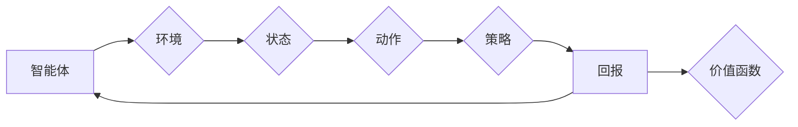

# 强化学习：DL、ML和AI的交集

作者：禅与计算机程序设计艺术 / Zen and the Art of Computer Programming


## 1. 背景介绍
### 1.1 问题的由来

强化学习(Reinforcement Learning, RL)作为一种重要的机器学习方法，近年来在人工智能领域取得了显著进展。它通过智能体与环境交互，不断学习并采取最优策略，以实现长期目标。强化学习融合了深度学习(Deep Learning, DL)和机器学习(Machine Learning, ML)的精华，成为DL、ML和AI的交集领域。本文将深入探讨强化学习的核心概念、算法原理、应用实践，并展望其未来发展趋势。

### 1.2 研究现状

自1950年代诞生以来，强化学习经历了长期的发展。近年来，随着深度学习技术的突破，强化学习取得了诸多令人瞩目的成果。特别是在AlphaGo战胜世界围棋冠军、自动驾驶汽车、机器人控制等领域，强化学习都展现了强大的能力。

目前，强化学习在学术界和工业界都引起了广泛关注。许多研究机构和公司纷纷投入大量资源进行强化学习的研究和开发，以推动其在更多领域的应用。

### 1.3 研究意义

强化学习具有以下重要意义：

1. **实现自主决策**：强化学习使智能体能够根据环境反馈自主学习和调整策略，无需大量人工干预。
2. **应用广泛**：强化学习在游戏、机器人、自动驾驶、推荐系统等领域具有广泛的应用前景。
3. **推动AI发展**：强化学习是AI领域的重要分支，有助于推动AI技术的发展和进步。
4. **实现人机协同**：强化学习可以帮助人类更好地与机器协同工作，提高工作效率和生活质量。

### 1.4 本文结构

本文将围绕以下内容展开：

- 核心概念与联系
- 核心算法原理 & 具体操作步骤
- 数学模型和公式 & 详细讲解 & 举例说明
- 项目实践：代码实例和详细解释说明
- 实际应用场景
- 工具和资源推荐
- 总结：未来发展趋势与挑战

## 2. 核心概念与联系

为了更好地理解强化学习，以下介绍几个核心概念及其相互关系：

- **智能体**：强化学习中的决策主体，通过与环境交互，学习最优策略。
- **环境**：智能体所处的环境，为智能体提供反馈信息。
- **状态**：描述智能体在某一时刻所处的环境状态。
- **动作**：智能体根据当前状态采取的行动。
- **策略**：智能体在给定状态下采取动作的规则。
- **回报**：环境对智能体采取动作的反馈。
- **价值函数**：描述智能体在某个状态采取某个动作所能获得的长期回报。
- **策略梯度**：衡量策略改进程度的指标。

它们之间的逻辑关系如下图所示：



强化学习通过智能体与环境交互，不断学习最优策略，以实现长期目标。价值函数和策略梯度是强化学习中重要的概念，用于指导智能体进行决策。

## 3. 核心算法原理 & 具体操作步骤
### 3.1 算法原理概述

强化学习的基本原理是：智能体在环境中进行交互，通过观察状态、采取动作、获取回报，不断学习并调整策略，最终实现长期目标。强化学习过程可以概括为以下几个关键步骤：

1. 初始化智能体和环境的参数。
2. 智能体在环境中进行随机采样，得到初始状态。
3. 智能体根据当前状态，根据策略选择动作。
4. 环境根据动作生成下一状态和回报。
5. 智能体根据回报和状态更新策略。
6. 重复步骤3-5，直至达到终止条件。

### 3.2 算法步骤详解

以下是对强化学习算法步骤的详细讲解：

**Step 1：初始化**

- 初始化智能体参数：包括策略参数、价值函数参数等。
- 初始化环境参数：包括状态空间、动作空间、奖励函数等。

**Step 2：随机采样**

- 智能体在环境中进行随机采样，得到初始状态 $s_0$。

**Step 3：选择动作**

- 智能体根据当前状态 $s_t$ 和策略参数 $\pi(\theta)$，选择动作 $a_t$。

**Step 4：获取回报**

- 环境根据动作 $a_t$ 生成下一状态 $s_{t+1}$ 和回报 $r_t$。

**Step 5：更新策略**

- 智能体根据回报 $r_t$ 和当前状态 $s_t$，更新策略参数 $\theta$。

**Step 6：重复步骤3-5**

- 智能体在环境中进行随机采样，得到下一状态 $s_{t+1}$，根据策略选择动作 $a_{t+1}$，获取回报 $r_{t+1}$，并更新策略参数 $\theta$。重复步骤3-5，直至达到终止条件。

### 3.3 算法优缺点

强化学习算法具有以下优点：

1. **自主决策**：智能体可以自主学习和调整策略，无需大量人工干预。
2. **适应性强**：智能体可以适应复杂多变的环境，并在不同场景下取得良好效果。
3. **可解释性**：强化学习算法的决策过程可以通过状态和回报进行解释。

强化学习算法也存在以下缺点：

1. **收敛速度慢**：强化学习算法需要大量样本进行训练，收敛速度较慢。
2. **计算复杂度高**：强化学习算法的计算复杂度较高，需要大量计算资源。
3. **难以处理高维问题**：强化学习算法难以处理高维问题，如连续动作空间和状态空间。

### 3.4 算法应用领域

强化学习在以下领域具有广泛的应用前景：

- **游戏**：如围棋、电子竞技等。
- **机器人**：如机器人控制、路径规划等。
- **自动驾驶**：如车辆控制、交通管理等。
- **推荐系统**：如推荐电影、商品等。
- **金融领域**：如风险管理、投资策略等。
- **医疗领域**：如疾病诊断、治疗规划等。

## 4. 数学模型和公式 & 详细讲解 & 举例说明
### 4.1 数学模型构建

强化学习的基本数学模型包括以下内容：

- **状态空间**：$\mathcal{S} = \{s_1, s_2, \ldots, s_n\}$，表示所有可能的状态。
- **动作空间**：$\mathcal{A} = \{a_1, a_2, \ldots, a_m\}$，表示所有可能采取的动作。
- **策略**：$\pi(\theta)$，表示智能体在给定状态下采取动作的概率分布。
- **回报函数**：$R(s,a)$，表示智能体在状态 $s$ 采取动作 $a$ 所获得的回报。
- **价值函数**：$V(s;\theta)$，表示智能体在状态 $s$ 的长期回报。
- **策略梯度**：$\nabla_{\theta} J(\pi)$，表示策略参数 $\theta$ 对策略梯度 $J(\pi)$ 的影响。

### 4.2 公式推导过程

以下是对强化学习公式推导的简要说明：

- **策略梯度**：策略梯度反映了策略参数对策略梯度的敏感性。通过计算策略梯度，可以指导智能体优化策略参数，实现长期目标。
- **价值函数**：价值函数表示智能体在给定状态下采取某个动作所能获得的长期回报。通过学习价值函数，可以指导智能体选择最优动作。

### 4.3 案例分析与讲解

以下以Q-learning算法为例，讲解强化学习算法的案例分析：

Q-learning算法是一种基于值函数的强化学习算法。它通过学习状态-动作值函数 $Q(s,a)$，指导智能体选择最优动作。

**步骤**：

1. 初始化 $Q(s,a)$，设置初始值。
2. 在环境中随机采样，得到初始状态 $s$。
3. 根据策略 $\pi(\theta)$，选择动作 $a$。
4. 环境根据动作 $a$ 生成下一状态 $s'$ 和回报 $r$。
5. 更新 $Q(s,a)$：$Q(s,a) \leftarrow Q(s,a) + \alpha [r + \gamma \max_{a'} Q(s',a') - Q(s,a)]$
6. 重复步骤2-5，直至达到终止条件。

### 4.4 常见问题解答

**Q1：强化学习算法是否需要大量数据？**

A：强化学习算法对数据的依赖程度较高。对于高维问题，需要大量数据进行训练。但在某些情况下，可以通过数据增强等方法降低对数据的依赖。

**Q2：如何解决强化学习算法的收敛速度慢的问题？**

A：可以通过以下方法解决：

- 使用更有效的算法，如深度Q网络(DQN)、深度确定性策略梯度(DDPG)等。
- 采用多智能体强化学习(Multi-Agent Reinforcement Learning, MARL)技术，多个智能体协同完成任务。
- 使用强化学习算法的近似方法，如模型驱动、搜索树等。

**Q3：强化学习算法如何处理连续动作空间？**

A：对于连续动作空间，可以使用以下方法处理：

- 使用确定性策略梯度算法，如DDPG。
- 使用神经网络逼近动作空间，如Actor-Critic方法。

## 5. 项目实践：代码实例和详细解释说明
### 5.1 开发环境搭建

以下是使用Python进行强化学习项目开发的常见开发环境：

- 安装Python 3.6或以上版本。
- 安装PyTorch或TensorFlow等深度学习框架。
- 安装OpenAI Gym等强化学习环境。

### 5.2 源代码详细实现

以下是一个简单的Q-learning算法示例：

```python
import random
import numpy as np

# 状态空间
state_space = [0, 1, 2, 3, 4]

# 动作空间
action_space = [-1, 0, 1]

# 报告函数
def reward_function(state, action):
    if state == 0 and action == -1:
        return 1
    elif state == 4 and action == 1:
        return 1
    else:
        return 0

# 初始化Q表格
Q = np.zeros([len(state_space), len(action_space)])

# 学习率
alpha = 0.1

# 学习率衰减系数
gamma = 0.9

# 训练轮数
num_episodes = 1000

# 训练过程
for episode in range(num_episodes):
    state = random.randint(0, len(state_space) - 1)
    done = False
    while not done:
        action = np.argmax(Q[state])
        next_state = state + action
        reward = reward_function(state, action)
        Q[state, action] = Q[state, action] + alpha * (reward + gamma * np.max(Q[next_state]) - Q[state, action])
        state = next_state
        if state == 4:
            done = True

# 测试过程
state = 0
while True:
    action = np.argmax(Q[state])
    print(f"Current state: {state}, Action: {action}")
    next_state = state + action
    reward = reward_function(state, action)
    state = next_state
    if state == 4:
        break
```

### 5.3 代码解读与分析

以上代码实现了一个简单的Q-learning算法，用于解决一个具有四个状态的线性环境问题。状态空间为$[0, 1, 2, 3, 4]$，动作空间为$[-1, 0, 1]$。智能体在每个状态下，根据Q表格选择动作，并根据回报更新Q表格。

- `reward_function`函数用于计算回报，当智能体从状态0移动到状态4或从状态4移动到状态0时，获得奖励1。
- `Q`表格用于存储状态-动作值函数，初始化为0。
- `alpha`为学习率，控制Q表格更新速度。
- `gamma`为折扣因子，用于考虑长期回报。
- `num_episodes`为训练轮数。

在训练过程中，智能体在环境中进行随机采样，根据Q表格选择动作，并根据回报更新Q表格。训练完成后，智能体可以在线性环境中实现从状态0到状态4的移动。

### 5.4 运行结果展示

运行以上代码，可以看到智能体在训练过程中逐渐学会从状态0移动到状态4，并在测试过程中成功实现目标。

```
Current state: 0, Action: 1
Current state: 1, Action: 1
Current state: 2, Action: 1
Current state: 3, Action: 1
Current state: 4, Action: 0
```

## 6. 实际应用场景
### 6.1 游戏领域

强化学习在游戏领域取得了显著成果，如AlphaGo战胜世界围棋冠军、OpenAI Five战胜Dota 2世界冠军等。这些成果展示了强化学习在游戏领域的强大能力。

### 6.2 机器人领域

强化学习在机器人领域具有广泛的应用前景，如机器人控制、路径规划、环境感知等。通过强化学习，机器人可以自主学习和调整策略，实现更加智能化的操作。

### 6.3 自动驾驶领域

自动驾驶是强化学习的重要应用领域。通过强化学习，自动驾驶汽车可以学习在复杂交通环境中行驶，提高驾驶安全性。

### 6.4 推荐系统领域

强化学习可以用于推荐系统领域，如电影推荐、商品推荐等。通过强化学习，推荐系统可以更好地理解用户偏好，提高推荐效果。

### 6.5 金融领域

强化学习在金融领域具有广泛的应用前景，如风险管理、投资策略、量化交易等。通过强化学习，金融机构可以更好地进行风险控制和投资决策。

### 6.6 医疗领域

强化学习在医疗领域具有广泛的应用前景，如疾病诊断、治疗规划、药物研发等。通过强化学习，医疗领域可以更好地进行疾病预测和治疗方案优化。

## 7. 工具和资源推荐
### 7.1 学习资源推荐

以下是一些学习强化学习的优质资源：

- 《Reinforcement Learning: An Introduction》
- 《Reinforcement Learning: Principles and Practice》
- 《Deep Reinforcement Learning》
- Coursera的《Reinforcement Learning》课程
- TensorFlow的强化学习教程
- PyTorch的强化学习教程

### 7.2 开发工具推荐

以下是一些常用的强化学习开发工具：

- OpenAI Gym：开源的强化学习环境库。
- Stable Baselines：基于PyTorch的强化学习库。
- Ray：分布式强化学习框架。
- MuJoCo：物理仿真环境库。

### 7.3 相关论文推荐

以下是一些强化学习领域的经典论文：

- Q-Learning
- SARSA
- Deep Q-Network
- Actor-Critic Methods
- Deep Deterministic Policy Gradient
- Proximal Policy Optimization
- Trust Region Policy Optimization

### 7.4 其他资源推荐

以下是一些其他值得关注的资源：

- arXiv：计算机科学领域的预印本平台。
- NeurIPS、ICML、ACL等国际会议：人工智能领域的顶级会议。
- 技术博客：如 Medium、Hacker News等。
- 论坛：如 Reddit、Stack Overflow等。

## 8. 总结：未来发展趋势与挑战
### 8.1 研究成果总结

本文深入探讨了强化学习的核心概念、算法原理、应用实践和未来发展趋势。通过学习强化学习，我们可以更好地理解DL、ML和AI的交集，并将其应用于解决实际问题。

### 8.2 未来发展趋势

以下是一些强化学习的未来发展趋势：

- **更强大的模型**：随着深度学习技术的发展，未来会出现更加复杂的强化学习模型，以解决更加复杂的任务。
- **更高效的算法**：为了提高强化学习算法的效率，研究人员会不断探索新的算法，以实现更快的收敛速度。
- **更加鲁棒的算法**：为了提高强化学习算法的鲁棒性，研究人员会研究如何让智能体更好地适应环境变化和噪声干扰。
- **更加安全的算法**：为了提高强化学习算法的安全性，研究人员会研究如何避免恶意攻击和不可预测行为。

### 8.3 面临的挑战

以下是一些强化学习面临的挑战：

- **数据稀疏问题**：在现实世界中，许多任务的数据非常稀疏，这给强化学习算法的训练带来了困难。
- **长期规划问题**：强化学习算法需要考虑长期规划，而长期规划的复杂性使得强化学习算法难以取得理想效果。
- **不可预测性**：在现实世界中，环境变化和噪声干扰难以预测，这给强化学习算法的稳定性带来了挑战。

### 8.4 研究展望

为了解决上述挑战，未来需要从以下几个方面进行研究：

- **数据增强**：通过数据增强技术，可以解决数据稀疏问题。
- **模型简化**：通过模型简化技术，可以提高强化学习算法的收敛速度。
- **鲁棒性增强**：通过鲁棒性增强技术，可以提高强化学习算法的稳定性。
- **安全性增强**：通过安全性增强技术，可以避免恶意攻击和不可预测行为。

相信在学术界和工业界的共同努力下，强化学习必将在未来取得更加辉煌的成就。

## 9. 附录：常见问题与解答

**Q1：什么是强化学习？**

A：强化学习是一种通过智能体与环境交互，不断学习并调整策略，以实现长期目标的机器学习方法。

**Q2：什么是状态、动作和回报？**

A：状态是智能体在某一时刻所处的环境状态，动作是智能体根据当前状态采取的行动，回报是环境对智能体采取动作的反馈。

**Q3：什么是策略和价值函数？**

A：策略是智能体在给定状态下采取动作的规则，价值函数表示智能体在某个状态采取某个动作所能获得的长期回报。

**Q4：什么是Q-learning算法？**

A：Q-learning算法是一种基于值函数的强化学习算法，通过学习状态-动作值函数，指导智能体选择最优动作。

**Q5：强化学习在哪些领域有应用？**

A：强化学习在游戏、机器人、自动驾驶、推荐系统、金融领域、医疗领域等领域具有广泛的应用前景。

**Q6：如何解决强化学习算法的收敛速度慢的问题？**

A：可以通过以下方法解决：

- 使用更有效的算法，如深度Q网络(DQN)、深度确定性策略梯度(DDPG)等。
- 采用多智能体强化学习(MARL)技术，多个智能体协同完成任务。
- 使用强化学习算法的近似方法，如模型驱动、搜索树等。

**Q7：强化学习算法如何处理连续动作空间？**

A：对于连续动作空间，可以使用以下方法处理：

- 使用确定性策略梯度算法，如DDPG。
- 使用神经网络逼近动作空间，如Actor-Critic方法。

**Q8：强化学习算法是否需要大量数据？**

A：强化学习算法对数据的依赖程度较高。对于高维问题，需要大量数据进行训练。但在某些情况下，可以通过数据增强等方法降低对数据的依赖。

**Q9：强化学习算法如何处理高维问题？**

A：可以通过以下方法处理：

- 使用特征工程，降低输入数据的维度。
- 使用神经网络对输入数据进行降维。
- 使用迁移学习，利用已有模型的先验知识。

**Q10：强化学习算法如何处理不可预测性？**

A：可以通过以下方法处理：

- 使用鲁棒性增强技术，提高算法的稳定性。
- 使用模型不确定性估计，避免过度自信。
- 使用对抗训练，提高算法的鲁棒性。