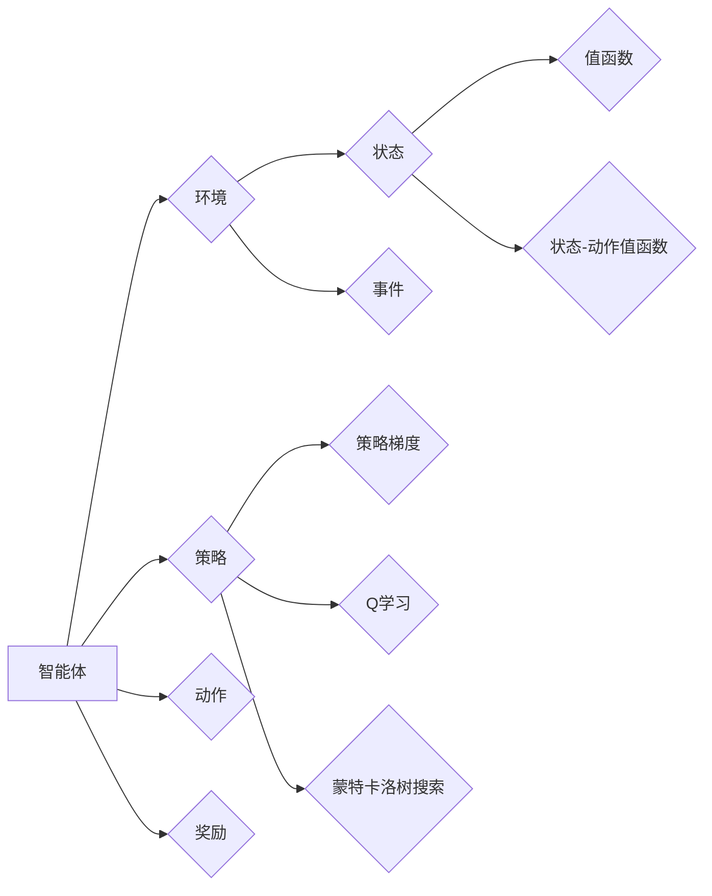

# 强化学习：在电子游戏中的应用

作者：禅与计算机程序设计艺术 / Zen and the Art of Computer Programming


## 关键词：

强化学习，电子游戏，智能体，策略学习，蒙特卡洛树搜索，深度强化学习，Q学习，策略梯度，强化学习框架

## 1. 背景介绍
### 1.1 问题的由来

电子游戏作为人类娱乐和竞技的重要方式，长期以来一直是人工智能研究的热点领域。随着人工智能技术的不断发展，如何让机器在电子游戏中展现出超越人类玩家的水平，成为了人工智能领域的一个重要研究方向。强化学习（Reinforcement Learning，RL）作为一种重要的机器学习范式，在电子游戏中的应用取得了显著的成果。

### 1.2 研究现状

近年来，强化学习在电子游戏领域的应用研究取得了长足的进步，涌现出了许多优秀的成果。例如，AlphaGo在围棋领域的胜利，OpenAI Five在《Dota 2》电子竞技比赛中的出色表现等。这些成果展示了强化学习在电子游戏领域的巨大潜力。

### 1.3 研究意义

强化学习在电子游戏中的应用具有重要的研究意义：

1. 推动人工智能技术的发展：通过解决电子游戏中的挑战，可以推动强化学习算法的进步，为其他领域的应用提供借鉴。
2. 促进游戏产业的发展：智能体在电子游戏中的出色表现，可以提升游戏体验，推动游戏产业的发展。
3. 培养跨学科人才：电子游戏领域涉及人工智能、计算机图形学、人机交互等多个学科，为跨学科人才的培养提供了良好的平台。

### 1.4 本文结构

本文将围绕强化学习在电子游戏中的应用展开，主要内容包括：

- 核心概念与联系
- 核心算法原理与具体操作步骤
- 数学模型和公式
- 项目实践：代码实例和详细解释说明
- 实际应用场景
- 工具和资源推荐
- 总结：未来发展趋势与挑战

## 2. 核心概念与联系

为了更好地理解强化学习在电子游戏中的应用，本节将介绍几个核心概念及其相互关系。

### 2.1 强化学习

强化学习是一种通过与环境交互进行学习的过程。智能体（Agent）通过观察环境的状态（State），选择动作（Action），并从环境中获取奖励（Reward），通过不断学习和调整策略，以实现目标。

### 2.2 智能体

智能体是强化学习中的核心概念，它可以是机器人、软件程序等能够与环境交互的实体。智能体的目标是最大化累积奖励。

### 2.3 环境与状态

环境（Environment）是智能体进行交互的对象，它包含了智能体所处状态和可能发生的事件。状态（State）是环境的一个特定状态，通常用一组特征向量表示。

### 2.4 动作与奖励

动作（Action）是智能体在特定状态下采取的行为。奖励（Reward）是环境对智能体动作的反馈，用于指导智能体进行学习。

### 2.5 策略

策略（Policy）是智能体在特定状态下选择动作的规则。根据策略的不同，强化学习可以分为确定性策略和随机策略。

### 2.6 值函数

值函数（Value Function）是智能体在特定状态下采取某个动作的期望奖励。根据值函数的不同，强化学习可以分为基于值函数的方法和基于策略的方法。

### 2.7 策略梯度

策略梯度（Policy Gradient）是一种基于策略的强化学习方法，通过梯度下降优化策略参数，使累积奖励最大化。

### 2.8 Q学习

Q学习（Q-Learning）是一种基于值函数的方法，通过学习Q函数（状态-动作值函数）来指导智能体选择动作。

### 2.9 蒙特卡洛树搜索

蒙特卡洛树搜索（Monte Carlo Tree Search，MCTS）是一种基于策略的方法，通过模拟随机样本，选择具有最高预期奖励的路径。

### 2.10 深度强化学习

深度强化学习（Deep Reinforcement Learning，DRL）是强化学习的一种，结合了深度学习技术，使用深度神经网络来近似值函数或策略。

以下是这些概念之间的逻辑关系图：



## 3. 核心算法原理与具体操作步骤

### 3.1 算法原理概述

强化学习在电子游戏中的应用主要基于以下几种核心算法：

1. 基于值函数的方法：通过学习值函数来指导智能体选择动作。
2. 基于策略的方法：通过学习策略来指导智能体选择动作。
3. 深度强化学习：结合深度学习技术，使用深度神经网络来近似值函数或策略。

### 3.2 算法步骤详解

以下以基于值函数的方法为例，介绍强化学习的具体操作步骤：

1. **初始化**：设置智能体的初始状态、策略参数、值函数参数等。
2. **选择动作**：根据当前状态，根据策略选择动作。
3. **与环境交互**：智能体执行动作，并从环境中获取新的状态和奖励。
4. **更新值函数**：根据新获取的奖励，更新值函数。
5. **重复步骤2-4**，直到达到终止条件。

### 3.3 算法优缺点

**基于值函数的方法**：

优点：

- 稳定性好，收敛速度快。
- 不需要策略参数，可以适用于任何形式的策略。

缺点：

- 对连续动作空间不适用。
- 学习效率较低，需要大量数据进行训练。

**基于策略的方法**：

优点：

- 可以适用于连续动作空间。
- 学习效率较高，不需要学习值函数。

缺点：

- 稳定性较差，收敛速度较慢。
- 难以处理非平稳环境。

**深度强化学习**：

优点：

- 可以处理高维输入和输出空间。
- 可以学习到更加复杂的策略。

缺点：

- 训练过程复杂，需要大量数据进行训练。
- 理论分析困难。

### 3.4 算法应用领域

强化学习在电子游戏中的应用领域广泛，以下列举一些典型应用：

1. **棋类游戏**：如围棋、国际象棋等。
2. **体育竞技游戏**：如篮球、足球、赛车等。
3. **策略游戏**：如《Dota 2》、《星际争霸》等。
4. **模拟游戏**：如《模拟人生》、《城市：天际线》等。

## 4. 数学模型和公式

### 4.1 数学模型构建

强化学习的数学模型主要包含以下部分：

1. **状态空间**：$S = \{s_1, s_2, \ldots, s_n\}$，表示智能体可能处于的所有状态。
2. **动作空间**：$A = \{a_1, a_2, \ldots, a_m\}$，表示智能体可能采取的所有动作。
3. **策略**：$\pi(s, a) = P(A=a|S=s)$，表示智能体在状态s下采取动作a的概率。
4. **值函数**：$V(s)$，表示智能体在状态s下采取最优策略所能获得的累积奖励。
5. **Q函数**：$Q(s, a) = E[R_{t+1}|S_t=s, A_t=a]$，表示智能体在状态s下采取动作a的期望奖励。

### 4.2 公式推导过程

以下以Q学习为例，介绍强化学习的公式推导过程。

**Q学习目标函数**：

$$
J(\theta) = \sum_{s \in S} \sum_{a \in A} Q(s, a)(R_{s, a} + \gamma \max_{a' \in A} Q(s', a'))
$$

其中，$R_{s, a}$为智能体在状态s下采取动作a获得的奖励，$\gamma$为折扣因子。

**梯度下降**：

$$
\theta \leftarrow \theta - \alpha \nabla_{\theta} J(\theta)
$$

其中，$\alpha$为学习率。

### 4.3 案例分析与讲解

以下以《Dota 2》为例，分析强化学习在电子游戏中的应用。

**游戏背景**：

《Dota 2》是一款多人在线战斗竞技游戏，玩家分为两个队伍，每个队伍需要控制英雄在地图上进行战斗，最终目标是推掉对方的核心建筑。

**强化学习模型**：

- 使用深度Q网络（DQN）作为强化学习模型。
- 使用A3C算法进行多智能体协同训练。

**训练过程**：

1. 初始化DQN模型和参数。
2. 将智能体随机分配到不同的英雄。
3. 智能体在游戏中进行战斗，并记录下状态、动作、奖励和下一个状态。
4. 更新DQN模型参数，使模型在给定状态和动作下能够获得更大的奖励。

### 4.4 常见问题解答

**Q1：如何评估强化学习模型的性能？**

A：可以使用以下方法评估强化学习模型的性能：

- 与人类玩家进行比赛。
- 在模拟环境中测试模型。
- 使用指标，如平均得分、胜率等。

**Q2：如何解决强化学习中的信用分配问题？**

A：可以使用以下方法解决信用分配问题：

- 使用经验回放（Experience Replay）技术。
- 使用优势值（Advantage）方法。
- 使用分布式强化学习算法。

**Q3：如何解决强化学习中的样本效率问题？**

A：可以使用以下方法解决样本效率问题：

- 使用迁移学习（Transfer Learning）技术。
- 使用探索-利用策略（Exploration-Exploitation Strategy）。
- 使用强化学习算法的变体，如近端策略优化（Proximal Policy Optimization，PPO）。

## 5. 项目实践：代码实例和详细解释说明

### 5.1 开发环境搭建

为了进行强化学习在电子游戏中的应用实践，需要搭建以下开发环境：

1. 安装Python和pip。
2. 安装TensorFlow或PyTorch。
3. 安装Dota 2环境。

### 5.2 源代码详细实现

以下是一个使用PyTorch实现DQN的代码示例：

```python
import torch
import torch.nn as nn
import torch.optim as optim
from torch.autograd import Variable
import random

class DQN(nn.Module):
    def __init__(self, input_dim, output_dim):
        super(DQN, self).__init__()
        self.fc1 = nn.Linear(input_dim, 128)
        self.fc2 = nn.Linear(128, 64)
        self.fc3 = nn.Linear(64, output_dim)

    def forward(self, x):
        x = torch.relu(self.fc1(x))
        x = torch.relu(self.fc2(x))
        x = self.fc3(x)
        return x

def dqn_train(model, replay_buffer, optimizer, target_model):
    model.train()
    optimizer.zero_grad()
    state = torch.cat(replay_buffer.state, 0)
    action = torch.cat(replay_buffer.action, 0)
    reward = torch.cat(replay_buffer.reward, 0)
    next_state = torch.cat(replay_buffer.next_state, 0)
    done = torch.cat(replay_buffer.done, 0)

    y = reward + (1 - done) * discount * target_model(next_state).detach() * (1 - action)
    output = model(state)
    loss = F.smooth_l1_loss(output.gather(1, action), y)
    loss.backward()
    optimizer.step()

    return loss

def dqn_play(model, env):
    model.eval()
    state = env.reset()
    done = False
    while not done:
        state = torch.from_numpy(state).float().unsqueeze(0)
        action = model(state).argmax().item()
        next_state, reward, done, _ = env.step(action)
        state = next_state
    return env.score()

# 训练DQN模型
def train_dqn():
    env = gym.make("Dota2Env-v0")
    model = DQN(env.observation_space.shape[0], env.action_space.n)
    target_model = DQN(env.observation_space.shape[0], env.action_space.n).to(device)
    target_model.load_state_dict(model.state_dict())
    optimizer = optim.Adam(model.parameters(), lr=0.001)
    replay_buffer = ReplayBuffer()

    episodes = 10000
    for episode in range(episodes):
        state = env.reset()
        done = False
        while not done:
            state = torch.from_numpy(state).float().unsqueeze(0)
            action = model(state).argmax().item()
            next_state, reward, done, _ = env.step(action)
            reward = torch.tensor([reward], dtype=torch.float32).to(device)
            next_state = torch.from_numpy(next_state).float().unsqueeze(0)
            replay_buffer.push(state, action, reward, next_state, done)
            state = next_state

            if len(replay_buffer) > batch_size:
                loss = dqn_train(model, replay_buffer, optimizer, target_model)
                print(f"Episode {episode}, Loss: {loss.item()}")

    # 保存模型参数
    torch.save(model.state_dict(), "dqn_model.pth")

# 演示DQN模型在Dota 2环境中的表现
def play_dqn():
    model = DQN(env.observation_space.shape[0], env.action_space.n)
    model.load_state_dict(torch.load("dqn_model.pth"))
    state = env.reset()
    done = False
    while not done:
        state = torch.from_numpy(state).float().unsqueeze(0)
        action = model(state).argmax().item()
        next_state, reward, done, _ = env.step(action)
        state = next_state
    print(f"Score: {env.score()}")

if __name__ == "__main__":
    train_dqn()
    play_dqn()
```

### 5.3 代码解读与分析

以上代码实现了一个基于DQN的Dota 2智能体。主要包含以下模块：

- **DQN类**：定义了一个DQN模型，使用PyTorch构建深度神经网络。
- **dqn_train函数**：实现了DQN的训练过程，包括经验回放、梯度下降等步骤。
- **dqn_play函数**：实现了DQN的推理过程，用于演示模型在Dota 2环境中的表现。
- **train_dqn函数**：定义了DQN的训练流程，包括初始化模型、优化器、经验回放缓冲区等。
- **play_dqn函数**：定义了DQN的推理流程，用于演示模型在Dota 2环境中的表现。

### 5.4 运行结果展示

运行上述代码，可以在Dota 2环境中使用DQN智能体进行游戏。虽然模型的表现可能不如人类玩家，但可以看出，通过强化学习训练的智能体已经能够进行基本的游戏操作。

## 6. 实际应用场景

### 6.1 棋类游戏

强化学习在棋类游戏中的应用已经取得了显著的成果，例如AlphaGo在围棋领域的胜利。以下是强化学习在棋类游戏中的几个典型应用：

- **国际象棋**：使用深度强化学习技术，可以训练出能够战胜人类顶尖棋手的国际象棋程序。
- **国际跳棋**：使用蒙特卡洛树搜索技术，可以训练出能够战胜人类顶尖棋手的国际跳棋程序。
- **五子棋**：使用Q学习或策略梯度技术，可以训练出能够战胜人类顶尖棋手的五子棋程序。

### 6.2 体育竞技游戏

强化学习在体育竞技游戏中的应用，可以提升游戏体验，推动游戏产业的发展。以下是强化学习在体育竞技游戏中的几个典型应用：

- **篮球**：使用强化学习技术，可以训练出能够进行策略博弈的篮球机器人。
- **足球**：使用强化学习技术，可以训练出能够进行团队合作和战术调整的足球机器人。
- **赛车**：使用强化学习技术，可以训练出能够进行赛道驾驶和策略决策的赛车机器人。

### 6.3 策略游戏

强化学习在策略游戏中的应用，可以提升游戏玩家的游戏体验。以下是强化学习在策略游戏中的几个典型应用：

- **《Dota 2》**：使用强化学习技术，可以训练出能够进行复杂策略博弈的Dota 2机器人。
- **《星际争霸》**：使用强化学习技术，可以训练出能够进行团队合作和战术决策的星际争霸机器人。
- **《文明》**：使用强化学习技术，可以训练出能够进行文明管理和战术决策的文明机器人。

### 6.4 模拟游戏

强化学习在模拟游戏中的应用，可以提升游戏的真实感和趣味性。以下是强化学习在模拟游戏中的几个典型应用：

- **《模拟人生》**：使用强化学习技术，可以训练出能够进行生活管理的模拟人生机器人。
- **《城市：天际线》**：使用强化学习技术，可以训练出能够进行城市规划和管理的城市天际线机器人。
- **《模拟地球》**：使用强化学习技术，可以训练出能够进行地球环境管理和资源开发的模拟地球机器人。

## 7. 工具和资源推荐

### 7.1 学习资源推荐

以下是一些学习强化学习在电子游戏中的应用的推荐资源：

- 《强化学习：原理与实现》
- 《Deep Reinforcement Learning for Games》
- 《Artificial Intelligence: A Modern Approach》
- 《Reinforcement Learning: An Introduction》

### 7.2 开发工具推荐

以下是一些用于开发强化学习在电子游戏中的应用的推荐工具：

- TensorFlow
- PyTorch
- OpenAI Gym
- Unity ML-Agents

### 7.3 相关论文推荐

以下是一些关于强化学习在电子游戏中的应用的相关论文推荐：

- Deep Reinforcement Learning for Atari 2600 from Pixels
- Human-level Control through Deep Reinforcement Learning
- Mastering Chess and Shogi by Self-Play with a General Reinforcement Learning Algorithm

### 7.4 其他资源推荐

以下是一些其他关于强化学习在电子游戏中的应用的资源推荐：

- OpenAI
- DeepMind
- The Open Source Lab for AI Research
- arXiv

## 8. 总结：未来发展趋势与挑战

### 8.1 研究成果总结

本文介绍了强化学习在电子游戏中的应用，包括核心概念、算法原理、具体操作步骤、数学模型和公式、项目实践、实际应用场景、工具和资源推荐等内容。通过本文的学习，读者可以全面了解强化学习在电子游戏中的应用，并能够进行相关实践。

### 8.2 未来发展趋势

未来，强化学习在电子游戏中的应用将呈现以下发展趋势：

- 深度强化学习与多智能体强化学习的结合。
- 强化学习在电子竞技领域的应用。
- 强化学习在模拟游戏领域的应用。
- 强化学习在游戏引擎中的应用。

### 8.3 面临的挑战

尽管强化学习在电子游戏中的应用取得了显著的成果，但仍然面临着以下挑战：

- 计算资源瓶颈。
- 训练样本效率低。
- 模型可解释性差。
- 策略可复现性低。

### 8.4 研究展望

未来，随着人工智能技术的不断发展，强化学习在电子游戏中的应用将取得更加显著的成果。以下是几个研究展望：

- 开发更加高效的强化学习算法，降低计算资源需求。
- 提高训练样本效率，降低训练成本。
- 提高模型可解释性，增强用户信任。
- 提高策略可复现性，促进技术交流。

## 9. 附录：常见问题与解答

**Q1：如何选择合适的强化学习算法？**

A：选择合适的强化学习算法需要考虑以下因素：

- 任务类型：对于连续动作空间，可以使用基于策略的方法；对于离散动作空间，可以使用基于值函数的方法。
- 计算资源：对于资源有限的环境，可以使用参数高效的强化学习算法；对于资源充足的环境，可以使用深度强化学习算法。
- 环境特点：对于复杂环境，可以使用多智能体强化学习算法；对于简单环境，可以使用单智能体强化学习算法。

**Q2：如何解决强化学习中的探索-利用问题？**

A：解决探索-利用问题可以采用以下方法：

- 使用ε-greedy策略，在探索和利用之间进行权衡。
- 使用置信区间方法，对未知动作进行探索。
- 使用UCB算法，平衡探索和利用。

**Q3：如何提高强化学习模型的泛化能力？**

A：提高强化学习模型的泛化能力可以采用以下方法：

- 使用更稳定的强化学习算法。
- 使用更多数据，增加训练样本量。
- 使用更复杂的模型，学习更丰富的特征。

**Q4：如何解决强化学习中的多智能体交互问题？**

A：解决多智能体交互问题可以采用以下方法：

- 使用多智能体强化学习算法，如多智能体深度Q网络（MADDPG）。
- 使用多智能体协作学习算法，如多智能体策略梯度（MASPG）。
- 使用多智能体博弈论方法，如多智能体博弈树搜索（MABTS）。

**Q5：如何将强化学习应用于实际场景？**

A：将强化学习应用于实际场景可以采用以下方法：

- 选择合适的强化学习算法和模型。
- 设计合适的评估指标。
- 使用迁移学习技术，减少训练样本需求。
- 进行多次实验，不断优化模型和策略。

通过解决以上问题，可以将强化学习应用于实际场景，为电子游戏领域带来更多创新和突破。

---

作者：禅与计算机程序设计艺术 / Zen and the Art of Computer Programming