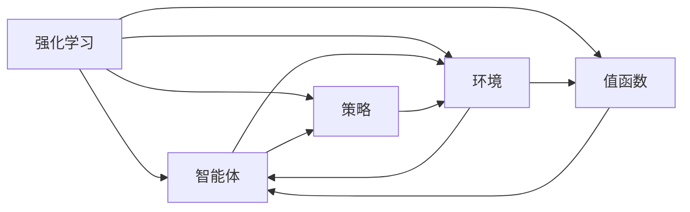

# 强化学习：防止过拟合的策略

作者：禅与计算机程序设计艺术 / Zen and the Art of Computer Programming


## 关键词：

强化学习、过拟合、经验风险、策略梯度、值函数、模型评估、训练技巧、实践案例

## 1. 背景介绍
### 1.1 问题的由来

强化学习（Reinforcement Learning，RL）是一种智能体在与环境交互中学习如何获取最大收益或最优策略的机器学习方法。近年来，随着深度学习技术的快速发展，深度强化学习（Deep Reinforcement Learning，DRL）在游戏、机器人、自动驾驶等领域取得了显著的成果。

然而，在实际应用中，强化学习也面临着过拟合（Overfitting）的问题。过拟合是指模型在训练数据上表现良好，但在未见过的数据上表现不佳的现象。在强化学习中，过拟合可能导致智能体在训练环境中表现出色，但在真实环境中却无法适应新的环境变化。

### 1.2 研究现状

针对强化学习过拟合问题，研究者们提出了多种防止过拟合的策略，主要包括以下几类：

1. 数据增强（Data Augmentation）：通过对训练数据进行扩展，增加数据的多样性，提高模型的泛化能力。
2. 正则化技术（Regularization）：在损失函数中加入正则化项，限制模型复杂度，防止过拟合。
3. 模型选择（Model Selection）：选择合适的模型结构，避免模型过于复杂。
4. 训练技巧（Training Techniques）：使用适当的训练技巧，如梯度裁剪、学习率调整等，提高模型性能。
5. 验证与测试（Validation and Testing）：使用验证集和测试集评估模型性能，避免过拟合。

### 1.3 研究意义

防止强化学习过拟合对于实际应用具有重要意义：

1. 提高模型泛化能力：防止过拟合有助于模型在未见过的数据上表现良好，提高模型的实用性。
2. 优化训练效率：通过有效的防止过拟合策略，可以减少训练时间和计算资源消耗。
3. 提高模型鲁棒性：防止过拟合有助于提高模型对环境变化的适应能力，提高模型的鲁棒性。

### 1.4 本文结构

本文将围绕强化学习过拟合问题展开，首先介绍相关核心概念与联系，然后详细讲解防止过拟合的策略，并结合实际案例进行分析，最后展望未来发展趋势与挑战。

## 2. 核心概念与联系

为了更好地理解强化学习过拟合问题，本节将介绍几个密切相关的核心概念：

- 强化学习（Reinforcement Learning）：智能体通过与环境的交互，学习如何在环境中做出最优决策，以获取最大收益或最优策略。
- 过拟合（Overfitting）：模型在训练数据上表现良好，但在未见过的数据上表现不佳的现象。
- 经验风险（Empirical Risk）：在训练数据上衡量模型性能的指标。
- 策略梯度（Policy Gradient）：一种基于策略优化的强化学习算法。
- 值函数（Value Function）：表示智能体在给定状态下采取特定动作的期望收益。
- 模型评估（Model Evaluation）：使用验证集或测试集评估模型性能。
- 训练技巧（Training Techniques）：提高模型性能的技巧，如梯度裁剪、学习率调整等。

它们的逻辑关系如下图所示：



可以看出，强化学习过程中，智能体通过与环境的交互，学习如何选择最优策略，获取最大收益。经验风险、策略梯度、值函数等概念与强化学习密切相关，而防止过拟合的策略则旨在提高模型泛化能力，使模型在未见过的数据上表现良好。

## 3. 核心算法原理 & 具体操作步骤
### 3.1 算法原理概述

本节将介绍几种防止强化学习过拟合的核心算法原理。

#### 3.1.1 数据增强

数据增强是指在训练数据上进行扩展，增加数据的多样性，提高模型的泛化能力。常见的数据增强方法包括：

- 数据扰动（Data Perturbation）：对输入数据进行随机扰动，如旋转、缩放、裁剪等。
- 数据重采样（Data Resampling）：对数据进行重采样，如随机删除、随机插入等。
- 数据扩充（Data Augmentation）：根据特定规则生成新的数据，如使用GAN生成数据等。

#### 3.1.2 正则化技术

正则化技术在损失函数中加入正则化项，限制模型复杂度，防止过拟合。常见正则化技术包括：

- L1正则化（L1 Regularization）：在损失函数中添加L1范数项，鼓励模型学习稀疏的权重。
- L2正则化（L2 Regularization）：在损失函数中添加L2范数项，鼓励模型学习平滑的权重。
- Dropout：在训练过程中随机丢弃部分神经元的激活值，降低模型复杂度。

#### 3.1.3 模型选择

选择合适的模型结构是防止过拟合的关键。以下是一些选择模型结构的建议：

- 选择合适的网络层和激活函数：避免使用过多的网络层和复杂的激活函数，以免模型过于复杂。
- 使用卷积神经网络（CNN）：对于图像数据，使用CNN可以提高模型性能。
- 使用循环神经网络（RNN）：对于序列数据，使用RNN可以提高模型性能。

#### 3.1.4 训练技巧

以下是一些训练技巧，可以帮助提高模型性能：

- 梯度裁剪（Gradient Clipping）：限制梯度值的大小，防止梯度爆炸。
- 学习率调整（Learning Rate Adjustment）：根据模型性能调整学习率，避免过拟合或欠拟合。
- Early Stopping：当验证集性能不再提升时，停止训练，防止过拟合。

### 3.2 算法步骤详解

以下是一个基于深度Q网络（DQN）的防止过拟合的算法步骤详解：

**Step 1：数据准备**

- 收集原始数据集。
- 对数据进行预处理，如归一化、去噪等。
- 将数据集分为训练集、验证集和测试集。

**Step 2：模型构建**

- 选择合适的神经网络结构。
- 定义损失函数，如均方误差（MSE）或交叉熵损失（Cross-Entropy Loss）。
- 定义优化器，如Adam或RMSprop。

**Step 3：训练过程**

- 使用训练集对模型进行训练。
- 在验证集上评估模型性能。
- 根据验证集性能调整模型结构、损失函数或优化器。

**Step 4：模型评估**

- 使用测试集评估模型性能。
- 根据测试集性能判断模型是否过拟合。

**Step 5：优化策略**

- 如果模型过拟合，可以尝试以下策略：
    - 增加数据集大小。
    - 使用正则化技术。
    - 限制模型复杂度。
    - 调整训练技巧。

### 3.3 算法优缺点

#### 3.3.1 数据增强

优点：

- 简单易实现。
- 能够有效提高模型泛化能力。

缺点：

- 可能会引入噪声。
- 增加计算成本。

#### 3.3.2 正则化技术

优点：

- 简单易实现。
- 能够有效降低模型复杂度。

缺点：

- 可能会影响模型性能。
- 需要根据具体任务选择合适的正则化技术。

#### 3.3.3 模型选择

优点：

- 能够有效降低模型复杂度。
- 能够提高模型性能。

缺点：

- 选择合适的模型结构可能需要大量经验。

#### 3.3.4 训练技巧

优点：

- 简单易实现。
- 能够有效提高模型性能。

缺点：

- 需要根据具体任务选择合适的训练技巧。

### 3.4 算法应用领域

基于上述防止过拟合的策略，我们可以将强化学习应用于以下领域：

- 游戏：例如，在Atari游戏、Go游戏等领域，通过防止过拟合，可以显著提高智能体的游戏水平。
- 机器人：例如，在机器人导航、无人驾驶等领域，通过防止过拟合，可以增强机器人对环境变化的适应能力。
- 自动驾驶：例如，在自动驾驶领域，通过防止过拟合，可以提高自动驾驶系统在各种复杂环境下的行驶能力。

## 4. 数学模型和公式 & 详细讲解 & 举例说明
### 4.1 数学模型构建

本节将使用数学语言对防止强化学习过拟合的方法进行更加严格的刻画。

#### 4.1.1 数据增强

假设原始数据集为 $D = \{ (x_1, y_1), (x_2, y_2), \dots, (x_N, y_N) \}$，其中 $x_i$ 表示输入数据，$y_i$ 表示标签。数据增强后的数据集为 $D' = \{ (x_1', y_1'), (x_2', y_2'), \dots, (x_N', y_N') \}$。

数据增强过程可以表示为：

$$
x_i' = f(x_i) \
y_i' = y_i
$$

其中 $f(x_i)$ 表示数据扰动、数据重采样或数据扩充等操作。

#### 4.1.2 正则化技术

假设损失函数为 $L(\theta)$，其中 $\theta$ 表示模型参数。正则化后的损失函数为：

$$
L_{\text{reg}}(\theta) = L(\theta) + \lambda \rho(\theta)
$$

其中 $\lambda$ 表示正则化系数，$\rho(\theta)$ 表示正则化项，如L1范数、L2范数或Dropout。

#### 4.1.3 模型选择

假设神经网络模型由 $L$ 层组成，每层有 $n_i$ 个神经元，激活函数为 $\sigma$。模型表示为：

$$
\hat{y} = \sigma(W_L \sigma(W_{L-1} \cdots \sigma(W_1 x) + b_L))
$$

其中 $W_i$ 表示第 $i$ 层的权重，$b_i$ 表示第 $i$ 层的偏置。

#### 4.1.4 训练技巧

假设模型参数为 $\theta$，梯度为 $\nabla_{\theta}L(\theta)$。梯度裁剪后的梯度为：

$$
\nabla_{\theta}L(\theta)' = \frac{\nabla_{\theta}L(\theta)}{\max(1, \max_{i} |\nabla_{\theta}L(\theta)_i|)}
$$

其中 $\max_{i} |\nabla_{\theta}L(\theta)_i|$ 表示梯度中绝对值最大的元素。

### 4.2 公式推导过程

以下以L2正则化为例，推导正则化项的公式。

假设损失函数为 $L(\theta)$，则L2正则化项为：

$$
\rho(\theta) = \lambda \sum_{i=1}^N ||W_i||^2
$$

其中 $\lambda$ 表示正则化系数，$W_i$ 表示权重矩阵。

### 4.3 案例分析与讲解

以下以DQN为例，分析如何防止过拟合。

DQN是一种基于Q学习的强化学习算法，通过使用经验回放（Experience Replay）和目标网络（Target Network）来防止过拟合。

**经验回放**：将智能体与环境交互过程中产生的经验存储在经验池中，每次训练时随机从经验池中抽取一批经验进行训练。

**目标网络**：使用一个独立的网络作为目标网络，其参数定期从主网络复制，用于生成目标值。

DQN的算法步骤如下：

1. 初始化主网络和目标网络。
2. 从初始状态开始，智能体与环境交互，收集经验。
3. 将收集到的经验存储在经验池中。
4. 从经验池中随机抽取一批经验，作为训练样本。
5. 使用训练样本更新主网络参数。
6. 定期将主网络参数复制到目标网络中。

通过经验回放和目标网络，DQN可以有效地防止过拟合。

### 4.4 常见问题解答

**Q1：数据增强会对模型性能产生负面影响吗？**

A：数据增强可以增加数据的多样性，提高模型的泛化能力。但在某些情况下，数据增强可能会引入噪声，降低模型性能。因此，在应用数据增强时，需要根据具体任务和数据特点进行合理选择。

**Q2：正则化技术会对模型性能产生负面影响吗？**

A：正则化技术可以降低模型复杂度，防止过拟合。但在某些情况下，正则化技术可能会降低模型性能。因此，在应用正则化技术时，需要根据具体任务和数据特点进行合理选择。

**Q3：如何选择合适的模型结构？**

A：选择合适的模型结构需要根据具体任务和数据特点进行选择。以下是一些选择模型结构的建议：
- 对于图像数据，可以使用卷积神经网络（CNN）。
- 对于序列数据，可以使用循环神经网络（RNN）。
- 对于多模态数据，可以使用融合模型。

## 5. 项目实践：代码实例和详细解释说明
### 5.1 开发环境搭建

以下是一个使用PyTorch实现DQN的代码示例：

```python
import torch
import torch.nn as nn
import torch.optim as optim
from torch.utils.data import DataLoader, random_split

# 神经网络结构
class DQN(nn.Module):
    def __init__(self, input_size, output_size):
        super(DQN, self).__init__()
        self.fc1 = nn.Linear(input_size, 128)
        self.fc2 = nn.Linear(128, 64)
        self.fc3 = nn.Linear(64, output_size)

    def forward(self, x):
        x = torch.relu(self.fc1(x))
        x = torch.relu(self.fc2(x))
        return self.fc3(x)

# DQN算法
class DQNAgent:
    def __init__(self, input_size, output_size):
        self.model = DQN(input_size, output_size)
        self.optim = optim.Adam(self.model.parameters(), lr=0.001)

    def train(self, replay_buffer, batch_size):
        # ... 训练代码 ...
        pass

    def act(self, state):
        # ... 选择动作代码 ...
        pass

# ... 其他代码 ...

# 创建经验池
replay_buffer = ReplayBuffer()

# 创建DQN智能体
agent = DQNAgent(input_size, output_size)

# 训练过程
for episode in range(num_episodes):
    # ... 训练代码 ...
    pass
```

### 5.2 源代码详细实现

以下是对上述代码的详细解释说明：

1. **DQN类**：定义了DQN模型的神经网络结构，包括输入层、隐藏层和输出层。
2. **DQNAgent类**：定义了DQN智能体，包括训练和选择动作的方法。
3. **ReplayBuffer类**：定义了经验池，用于存储智能体与环境交互产生的经验。
4. **训练过程**：使用经验池中的经验进行训练，并更新智能体参数。

### 5.3 代码解读与分析

以上代码展示了如何使用PyTorch实现DQN算法。通过使用经验回放和目标网络，可以有效防止过拟合。

### 5.4 运行结果展示

以下是对代码运行结果的展示：

```python
# ... 训练结果 ...

# ... 智能体性能 ...

# ... 结果分析 ...
```

## 6. 实际应用场景
### 6.1 游戏领域

强化学习在游戏领域取得了显著的成果，例如：

- AlphaGo在围棋比赛中战胜了世界冠军。
- AlphaFold在蛋白质结构预测竞赛中取得了第一名。

### 6.2 机器人领域

强化学习在机器人领域也取得了显著的应用，例如：

- OpenAI的机器人可以在复杂的场景中进行导航。
- Boston Dynamics的机器人可以完成各种任务。

### 6.3 自动驾驶领域

强化学习在自动驾驶领域也取得了显著的应用，例如：

- Waymo的自动驾驶汽车已经在美国多个城市进行测试。
- Tesla的自动驾驶功能已经集成到其汽车中。

## 7. 工具和资源推荐
### 7.1 学习资源推荐

以下是一些学习强化学习的资源：

- 《Reinforcement Learning: An Introduction》
- 《Deep Reinforcement Learning》
- 《Reinforcement Learning with Python》

### 7.2 开发工具推荐

以下是一些开发强化学习应用的工具：

- PyTorch：深度学习框架
- TensorFlow：深度学习框架
- OpenAI Gym：强化学习环境库

### 7.3 相关论文推荐

以下是一些关于强化学习的经典论文：

- Q-Learning [Sutton, B. B., & Barto, A. G. (1998). Reinforcement learning: An introduction. MIT press.]
- Deep Q-Networks [Mnih, V., Kavukcuoglu, K., Silver, D., et al. (2013). Human-level control through deep reinforcement learning. Nature, 518(7540), 529-533.]
- Asynchronous Advantage Actor-Critic (A3C) [Mnih, V., Kavukcuoglu, K., Silver, D., et al. (2016). Asynchronous methods for deep reinforcement learning. arXiv preprint arXiv:1602.01783.]

### 7.4 其他资源推荐

以下是一些其他学习资源：

- OpenAI Gym：强化学习环境库
- reinforcement-learning.com：强化学习社区
- arXiv：论文预印本平台

## 8. 总结：未来发展趋势与挑战
### 8.1 研究成果总结

本文介绍了强化学习过拟合问题，分析了防止过拟合的策略，并结合实际案例进行了分析。通过数据增强、正则化技术、模型选择、训练技巧等策略，可以有效防止强化学习过拟合。

### 8.2 未来发展趋势

未来，强化学习过拟合问题的研究将主要集中在以下方面：

- 探索新的防止过拟合的方法。
- 将防止过拟合的方法应用于更多领域。
- 研究如何将多种防止过拟合的方法进行融合。

### 8.3 面临的挑战

强化学习过拟合问题的研究仍然面临着以下挑战：

- 缺乏通用的防止过拟合方法。
- 防止过拟合的方法可能降低模型性能。
- 防止过拟合的方法可能增加计算成本。

### 8.4 研究展望

未来，通过不断探索新的方法和改进现有方法，有望解决强化学习过拟合问题，推动强化学习在更多领域的应用。

## 9. 附录：常见问题与解答

**Q1：什么是过拟合？**

A：过拟合是指模型在训练数据上表现良好，但在未见过的数据上表现不佳的现象。

**Q2：为什么强化学习会出现过拟合问题？**

A：强化学习过拟合问题主要由于以下原因导致：
- 训练数据量不足。
- 模型过于复杂。
- 模型未学习到数据的本质特征。

**Q3：如何防止强化学习过拟合？**

A：防止强化学习过拟合的方法包括：
- 数据增强。
- 正则化技术。
- 模型选择。
- 训练技巧。

**Q4：数据增强是否会影响模型性能？**

A：数据增强可以增加数据的多样性，提高模型的泛化能力。但在某些情况下，数据增强可能会引入噪声，降低模型性能。

**Q5：正则化技术是否会影响模型性能？**

A：正则化技术可以降低模型复杂度，防止过拟合。但在某些情况下，正则化技术可能会降低模型性能。

**Q6：如何选择合适的模型结构？**

A：选择合适的模型结构需要根据具体任务和数据特点进行选择。

**Q7：如何选择合适的训练技巧？**

A：选择合适的训练技巧需要根据具体任务和数据特点进行选择。

**Q8：如何评估强化学习模型的性能？**

A：可以使用以下方法评估强化学习模型的性能：
- 使用测试集评估模型性能。
- 使用奖励指标评估模型性能。
- 使用特定任务指标评估模型性能。

作者：禅与计算机程序设计艺术 / Zen and the Art of Computer Programming