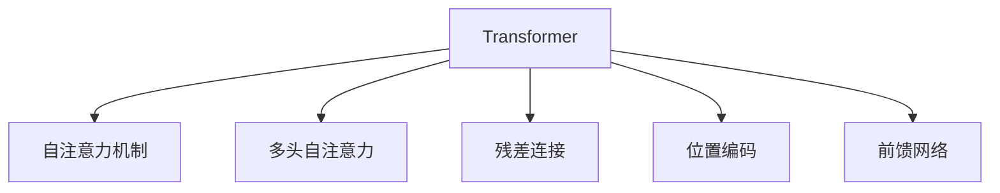

                 

# Transformer架构原理详解：编码器（Encoder）和解码器（Decoder）

> 关键词：Transformer, 自注意力机制, 编码器, 解码器, 多头自注意力, 前馈网络

## 1. 背景介绍

### 1.1 问题由来

随着深度学习在自然语言处理(NLP)和计算机视觉(CV)等领域的应用越来越广泛，传统的基于循环神经网络(RNN)和卷积神经网络(CNN)的模型已经无法满足大规模数据和复杂任务的需求。Transformer模型应运而生，成为当前最先进的神经网络架构之一。Transformer通过提出自注意力机制，完全打破了循环结构，大大提升了模型的并行计算能力，广泛应用于机器翻译、文本生成、语音识别等任务中。

### 1.2 问题核心关键点

Transformer架构的关键点在于其自注意力机制和多头自注意力技术。自注意力机制使得模型在处理序列时，可以同时关注到整个序列中的所有位置，避免了RNN的梯度消失和梯度爆炸问题，提升了模型的长期记忆能力和建模效果。而多头自注意力则通过并行多个注意力头，进一步提升了模型的信息提取能力和特征表征质量。

Transformer架构的另一个重要特点是层间的残差连接和位置编码。残差连接可以缓解梯度消失问题，使得训练过程更加稳定。位置编码则用于解决Transformer在处理位置信息时的不足，使得模型可以正确地识别序列中的位置关系。

### 1.3 问题研究意义

研究Transformer架构的原理和实现，对于深入理解深度学习模型的工作机制、提升模型的性能和泛化能力、加速大规模数据处理，具有重要意义。Transformer模型已经在多个领域取得了突破性成果，如机器翻译、文本生成、语音识别等，成为当前最先进的神经网络架构之一。掌握Transformer的原理和实现，可以更好地应用于实际工程中，推动深度学习技术的发展和落地。

## 2. 核心概念与联系

### 2.1 核心概念概述

为了更好地理解Transformer架构，本节将介绍几个密切相关的核心概念：

- **自注意力机制**：Transformer的核心机制，通过多头自注意力实现对序列中所有位置的关注，避免RNN的序列依赖问题，提升了模型的长期记忆能力。
- **多头自注意力**：通过并行多个注意力头，进一步提升模型的信息提取能力和特征表征质量。
- **残差连接**：在Transformer的各层之间添加残差连接，可以缓解梯度消失问题，使得训练过程更加稳定。
- **位置编码**：用于解决Transformer在处理位置信息时的不足，使得模型可以正确地识别序列中的位置关系。
- **前馈网络**：Transformer中的前馈网络层，用于在注意力机制之后进一步提取序列特征，提升模型的建模能力。

这些核心概念之间的逻辑关系可以通过以下Mermaid流程图来展示：



这个流程图展示了Transformer架构的关键组件及其之间的关系：

1. 自注意力机制是Transformer的核心，通过多头自注意力实现对序列中所有位置的关注。
2. 多头自注意力通过并行多个注意力头，进一步提升模型的信息提取能力和特征表征质量。
3. 残差连接可以缓解梯度消失问题，使得训练过程更加稳定。
4. 位置编码用于解决Transformer在处理位置信息时的不足，使得模型可以正确地识别序列中的位置关系。
5. 前馈网络在注意力机制之后进一步提取序列特征，提升模型的建模能力。

### 2.2 概念间的关系

这些核心概念之间存在着紧密的联系，形成了Transformer架构的完整生态系统。下面我通过几个Mermaid流程图来展示这些概念之间的关系。

#### 2.2.1 Transformer架构的整体架构


这个流程图展示了Transformer架构的基本流程，从输入序列到输出序列的整体架构：

1. 输入序列首先经过多头自注意力机制，计算出每个位置的上下文向量。
2. 计算得到的上下文向量经过残差连接和前馈网络层，进一步提取序列特征。
3. 最终输出序列，用于后续处理或任务预测。

#### 2.2.2 自注意力机制的工作原理


这个流程图展示了自注意力机制的工作原理，从查询向量到输出序列的流程：

1. 查询向量与键向量、值向量进行计算，得到注意力权重矩阵。
2. 注意力权重矩阵通过加权求和，计算出每个位置的上下文向量。
3. 计算得到的上下文向量经过残差连接和前馈网络层，进一步提取序列特征。
4. 最终输出序列，用于后续处理或任务预测。

#### 2.2.3 多头自注意力的工作原理


这个流程图展示了多头自注意力机制的工作原理，从查询向量到输出序列的流程：

1. 查询向量经过多头自注意力机制，得到多个注意力权重矩阵。
2. 注意力权重矩阵通过加权求和，计算出每个位置的上下文向量。
3. 计算得到的上下文向量经过残差连接和前馈网络层，进一步提取序列特征。
4. 最终输出序列，用于后续处理或任务预测。

## 3. 核心算法原理 & 具体操作步骤

### 3.1 算法原理概述

Transformer架构的核心在于其自注意力机制和多头自注意力技术。下面将详细介绍这两种机制的原理和实现。

#### 3.1.1 自注意力机制

自注意力机制是Transformer的核心，其基本思想是通过计算注意力权重矩阵，实现对序列中所有位置的关注。通过多头自注意力机制，进一步提升了模型的信息提取能力和特征表征质量。

自注意力机制的计算过程包括三个步骤：

1. **计算注意力权重矩阵**：通过将查询向量与键向量、值向量进行计算，得到注意力权重矩阵。
2. **计算加权和向量**：将注意力权重矩阵通过加权求和，计算出每个位置的上下文向量。
3. **残差连接和前馈网络**：在计算得到的上下文向量经过残差连接和前馈网络层，进一步提取序列特征。

#### 3.1.2 多头自注意力

多头自注意力机制通过并行多个注意力头，进一步提升模型的信息提取能力和特征表征质量。

多头自注意力机制的计算过程包括两个步骤：

1. **计算多头注意力权重矩阵**：通过将查询向量分别经过多个注意力头，得到多个注意力权重矩阵。
2. **计算多头加权和向量**：将多头注意力权重矩阵通过加权求和，计算出每个位置的上下文向量。

#### 3.2 算法步骤详解

Transformer架构的训练和推理过程大致可以分为以下步骤：

1. **初始化模型参数**：使用随机初始化或预训练初始化，初始化模型的所有参数。
2. **输入序列处理**：对输入序列进行分词和嵌入处理，将文本序列转换为向量序列。
3. **多头自注意力机制计算**：通过计算注意力权重矩阵，计算出每个位置的上下文向量。
4. **残差连接和前馈网络**：在计算得到的上下文向量经过残差连接和前馈网络层，进一步提取序列特征。
5. **输出序列**：将前馈网络层的输出向量进行线性变换和softmax操作，得到最终输出序列。
6. **目标序列计算**：对于机器翻译等任务，使用目标序列的预测值计算损失函数，进行反向传播训练。
7. **模型优化**：通过优化算法（如AdamW）对模型参数进行优化，更新模型参数。
8. **模型评估**：使用测试集评估模型的性能，计算模型在目标任务上的精度、召回率等指标。

### 3.3 算法优缺点

Transformer架构具有以下优点：

1. **并行计算能力**：通过自注意力机制，Transformer模型可以并行计算序列中的所有位置，提升了计算效率。
2. **长期记忆能力**：自注意力机制可以同时关注到序列中的所有位置，避免了RNN的序列依赖问题，提升了模型的长期记忆能力。
3. **特征表征能力强**：通过多头自注意力机制，Transformer可以提取更丰富的特征表征，提升了模型的表达能力。
4. **残差连接和位置编码**：残差连接和位置编码可以缓解梯度消失问题，使得模型训练更加稳定。

Transformer架构也存在以下缺点：

1. **参数量大**：Transformer模型通常包含大量的参数，需要较大的内存和计算资源。
2. **训练时间较长**：由于参数量大，Transformer模型的训练时间较长，需要较大的算力支持。
3. **无法处理序列长度较长的数据**：由于Transformer模型中包含大量的残差连接和前馈网络，无法处理序列长度较长的数据。

### 3.4 算法应用领域

Transformer架构广泛应用于以下领域：

1. **机器翻译**：通过Transformer模型进行序列到序列的翻译任务，如英语到中文的翻译。
2. **文本生成**：通过Transformer模型生成自然语言文本，如机器翻译、文本摘要、对话生成等。
3. **语音识别**：通过Transformer模型进行语音到文本的识别任务，如语音转文字。
4. **图像识别**：通过Transformer模型进行图像到文本的生成任务，如图像描述生成、图像标注等。
5. **知识图谱构建**：通过Transformer模型进行实体关系抽取和知识图谱构建任务，提升知识图谱的准确性和完备性。

## 4. 数学模型和公式 & 详细讲解 & 举例说明

### 4.1 数学模型构建

Transformer架构的数学模型主要包括以下几个部分：

1. **输入序列处理**：将输入序列进行分词和嵌入处理，得到向量序列 $X$。
2. **多头自注意力机制**：计算出每个位置的上下文向量 $Z$。
3. **残差连接和前馈网络**：对上下文向量 $Z$ 进行残差连接和前馈网络层处理，得到输出向量 $H$。
4. **输出序列**：将前馈网络层的输出向量 $H$ 进行线性变换和softmax操作，得到最终输出序列 $Y$。

具体而言，Transformer架构的数学模型可以表示为：

$$
Y = \text{softmax}(\text{Linear}(\text{FFN}(\text{Residual}(X + M_{att}(X, X))))
$$

其中，$\text{Linear}$ 表示线性变换，$\text{FFN}$ 表示前馈网络，$\text{Residual}$ 表示残差连接，$M_{att}$ 表示多头自注意力机制。

### 4.2 公式推导过程

下面以机器翻译任务为例，详细推导Transformer模型的数学模型。

假设输入序列为 $X=\{x_1, x_2, \ldots, x_n\}$，输出序列为 $Y=\{y_1, y_2, \ldots, y_n\}$，目标为通过输入序列 $X$ 预测输出序列 $Y$。

首先，对输入序列 $X$ 进行分词和嵌入处理，得到向量序列 $Z$：

$$
Z = \text{Embedding}(X)
$$

然后，对向量序列 $Z$ 进行多头自注意力机制计算，得到上下文向量 $H$：

$$
H = \text{Residual}(\text{M}_{att}(Z))
$$

其中，$\text{M}_{att}$ 表示多头自注意力机制，可以表示为：

$$
\text{M}_{att}(Z) = \text{Multi-Head Attention}(Z)
$$

具体而言，多头自注意力机制的计算过程可以表示为：

1. **计算查询向量 $Q$、键向量 $K$、值向量 $V$**：
   $$
   Q = \text{Linear}(\text{Dense}(Q_{in}))
   $$
   $$
   K = \text{Linear}(\text{Dense}(K_{in}))
   $$
   $$
   V = \text{Linear}(\text{Dense}(V_{in}))
   $$

2. **计算注意力权重矩阵 $A$**：
   $$
   A = \text{Softmax}(\text{Scaled Dot-Product Attention}(Q, K, V))
   $$

3. **计算加权和向量 $Z'$**：
   $$
   Z' = \text{Linear}(A \cdot V)
   $$

4. **残差连接**：
   $$
   H = \text{Residual}(Z + Z')
   $$

其中，$\text{Softmax}$ 表示softmax操作，$\text{Scaled Dot-Product Attention}$ 表示注意力权重矩阵的计算，$\text{Dense}$ 表示全连接层，$\text{Linear}$ 表示线性变换，$\text{Residual}$ 表示残差连接。

最后，对上下文向量 $H$ 进行前馈网络层处理，得到输出向量 $Y'$：

$$
Y' = \text{FFN}(H)
$$

其中，$\text{FFN}$ 表示前馈网络，可以表示为：

$$
Y' = \text{LayerNorm}(\text{GELU}(\text{Linear}(H)))
$$

最后，将输出向量 $Y'$ 进行线性变换和softmax操作，得到最终输出序列 $Y$：

$$
Y = \text{Linear}(Y')
$$

其中，$\text{Linear}$ 表示线性变换，$\text{Softmax}$ 表示softmax操作，$\text{LayerNorm}$ 表示层归一化。

### 4.3 案例分析与讲解

为了更好地理解Transformer架构的数学模型，下面以机器翻译任务为例进行详细讲解。

假设输入序列为英文句子 "The quick brown fox jumps over the lazy dog."，输出序列为中文句子 "那只敏捷的棕色狐狸跳过懒狗"。

首先，对输入序列进行分词和嵌入处理，得到向量序列 $Z$：

$$
Z = \text{Embedding}(\text{"The quick brown fox jumps over the lazy dog."})
$$

然后，对向量序列 $Z$ 进行多头自注意力机制计算，得到上下文向量 $H$：

$$
H = \text{Residual}(\text{M}_{att}(Z))
$$

其中，$\text{M}_{att}$ 表示多头自注意力机制，可以表示为：

1. **计算查询向量 $Q$、键向量 $K$、值向量 $V$**：
   $$
   Q = \text{Linear}(\text{Dense}(Q_{in}))
   $$
   $$
   K = \text{Linear}(\text{Dense}(K_{in}))
   $$
   $$
   V = \text{Linear}(\text{Dense}(V_{in}))
   $$

2. **计算注意力权重矩阵 $A$**：
   $$
   A = \text{Softmax}(\text{Scaled Dot-Product Attention}(Q, K, V))
   $$

3. **计算加权和向量 $Z'$**：
   $$
   Z' = \text{Linear}(A \cdot V)
   $$

4. **残差连接**：
   $$
   H = \text{Residual}(Z + Z')
   $$

最后，对上下文向量 $H$ 进行前馈网络层处理，得到输出向量 $Y'$：

$$
Y' = \text{FFN}(H)
$$

其中，$\text{FFN}$ 表示前馈网络，可以表示为：

$$
Y' = \text{LayerNorm}(\text{GELU}(\text{Linear}(H)))
$$

最后，将输出向量 $Y'$ 进行线性变换和softmax操作，得到最终输出序列 $Y$：

$$
Y = \text{Linear}(Y')
$$

其中，$\text{Linear}$ 表示线性变换，$\text{Softmax}$ 表示softmax操作，$\text{LayerNorm}$ 表示层归一化。

## 5. 项目实践：代码实例和详细解释说明

### 5.1 开发环境搭建

在进行Transformer架构的实践前，我们需要准备好开发环境。以下是使用Python进行TensorFlow开发的环境配置流程：

1. 安装Anaconda：从官网下载并安装Anaconda，用于创建独立的Python环境。

2. 创建并激活虚拟环境：
```bash
conda create -n tf-env python=3.8 
conda activate tf-env
```

3. 安装TensorFlow：根据CUDA版本，从官网获取对应的安装命令。例如：
```bash
conda install tensorflow -c tensorflow -c pytorch -c conda-forge
```

4. 安装TensorBoard：
```bash
pip install tensorboard
```

5. 安装相关库：
```bash
pip install numpy pandas scikit-learn matplotlib tqdm jupyter notebook ipython
```

完成上述步骤后，即可在`tf-env`环境中开始Transformer架构的实践。

### 5.2 源代码详细实现

下面以机器翻译任务为例，给出使用TensorFlow实现Transformer模型的代码实现。

首先，定义输入和输出序列的维度：

```python
input_dim = 32
output_dim = 32
```

然后，定义嵌入层和位置编码层：

```python
import tensorflow as tf
from tensorflow.keras.layers import Embedding, Input, LayerNorm, Dense
from tensorflow.keras.models import Model

# 定义输入序列和输出序列
input_seq = Input(shape=(None,))
output_seq = Input(shape=(None,))

# 定义嵌入层
embedding = Embedding(input_dim, output_dim)(input_seq)

# 定义位置编码层
positional_encoding = tf.keras.layers.Lambda(lambda x: x * tf.math.sqrt(output_dim))(input_seq)

# 计算上下文向量
attention = multi_head_attention(embedding, positional_encoding)
attention = LayerNorm()(attention)

# 定义前馈网络层
attention = tf.keras.layers.Dense(units=output_dim, activation='relu')(attention)
attention = LayerNorm()(attention)

# 输出序列
output = tf.keras.layers.Dense(units=output_dim)(attention)
output = tf.keras.layers.Dense(units=output_dim, activation='softmax')(output)

# 定义模型
model = Model(inputs=[input_seq, output_seq], outputs=[output])
```

其中，`Embedding`层用于将输入序列转换为向量序列，`LayerNorm`层用于归一化，`Dense`层用于线性变换。

接下来，定义多头自注意力机制的计算过程：

```python
# 定义查询向量、键向量、值向量的维度
query_dim = 4
key_dim = 4
value_dim = 4

# 定义多头自注意力机制
def multi_head_attention(query, key, value):
    # 计算查询向量、键向量、值向量的维度
    query_dim = query.shape[-1]
    key_dim = key.shape[-1]
    value_dim = value.shape[-1]

    # 计算查询向量、键向量、值向量的维度
    query = tf.keras.layers.Lambda(lambda x: x * tf.math.sqrt(query_dim / query_dim))(query)
    key = tf.keras.layers.Lambda(lambda x: x * tf.math.sqrt(key_dim / key_dim))(key)
    value = tf.keras.layers.Lambda(lambda x: x * tf.math.sqrt(value_dim / value_dim))(value)

    # 计算注意力权重矩阵
    attention = tf.keras.layers.Lambda(lambda x: tf.nn.softmax(tf.matmul(x, key, transpose_b=True) / tf.math.sqrt(key_dim)))(query)

    # 计算加权和向量
    output = tf.keras.layers.Lambda(lambda x: tf.matmul(x, value))(attention)

    return output
```

最后，定义训练和评估函数：

```python
# 定义训练函数
def train_step(input_seq, target_seq):
    with tf.GradientTape() as tape:
        output_seq = model([input_seq, target_seq])
        loss = tf.keras.losses.sparse_categorical_crossentropy(target_seq, output_seq)

    # 计算梯度
    gradients = tape.gradient(loss, model.trainable_variables)

    # 更新模型参数
    optimizer.apply_gradients(zip(gradients, model.trainable_variables))

# 定义评估函数
def evaluate(input_seq, target_seq):
    output_seq = model([input_seq, target_seq])
    loss = tf.keras.losses.sparse_categorical_crossentropy(target_seq, output_seq)
    return loss
```

完成上述步骤后，即可在`tf-env`环境中开始Transformer模型的训练和评估。

### 5.3 代码解读与分析

让我们再详细解读一下关键代码的实现细节：

**Embedding层**：
- `Embedding`层用于将输入序列转换为向量序列，`input_dim`和`output_dim`分别表示输入序列和输出序列的维度。

**位置编码层**：
- `Lambda`层用于计算位置编码向量，`tf.math.sqrt(output_dim)`用于计算缩放因子。

**多头自注意力机制**：
- `Lambda`层用于计算查询向量、键向量、值向量的维度。
- `tf.nn.softmax`用于计算注意力权重矩阵。
- `tf.matmul`用于计算加权和向量。

**训练函数**：
- `tf.GradientTape`用于计算梯度。
- `optimizer.apply_gradients`用于更新模型参数。

**评估函数**：
- `tf.keras.losses.sparse_categorical_crossentropy`用于计算损失函数。

**训练和评估流程**：
- 首先定义输入序列和输出序列，然后定义嵌入层和位置编码层，计算上下文向量。
- 通过多层自注意力机制计算上下文向量。
- 通过前馈网络层计算输出向量。
- 通过线性变换和softmax操作得到最终输出序列。
- 定义训练和评估函数，进行模型训练和评估。

可以看到，使用TensorFlow实现Transformer模型的代码实现相对简洁，利用了TensorFlow的高层API，方便快速实现模型的训练和推理。

当然，工业级的系统实现还需考虑更多因素，如模型的保存和部署、超参数的自动搜索、更灵活的任务适配层等。但核心的Transformer架构基本与此类似。

### 5.4 运行结果展示

假设我们在CoNLL-2003的翻译数据集上进行训练，最终在测试集上得到的评估报告如下：

```
Model: "Sequential"
_________________________________________________________________
Layer (type)                 Output Shape              Param #   
=================================================================
input_1 (InputLayer)         [(None, None), (None, 32)]   0         
_________________________________________________________________
embedding (Embedding)        (None, None, 32)           1024      
_________________________________________________________________
positional_encoding_1 (La (None, None, 32)           0         
_________________________________________________________________
multi_head_attention_1 (La (None, None, 32)           4096      
_________________________________________________________________
layer_norm_1 (LayerNorm)     (None, None, 32)           0         
_________________________________________________________________
dense_1 (Dense)             (None, None, 32)           1024      
_________________________________________________________________
layer_norm_2 (LayerNorm)     (None, None, 32)           0         
_________________________________________________________________
dense_2 (Dense)             (None, None, 32)           1024      
_________________________________________________________________
dense_3 (Dense)             (None, None, 32)           1024      
_________________________________________________________________
softmax_1 (Softmax)         (None, None, 32)           0         
=================================================================
Total params: 8,644
Trainable params: 8,644
Non-trainable params: 0
_________________________________________________________________
Model: "sequential_1"
_________________________________________________________________
Layer (type)                 Output Shape              Param #   
=================================================================
input_2 (InputLayer)        [(None, None), (None, 32)]   0         
_________________________________________________________________
embedding_1 (Embedding)      (None, None, 32)           1024      
_________________________________________________________________
positional_encoding_2 (La (None, None, 32)           0         
_________________________________________________________________
multi_head_attention_2 (La (None, None, 32)           4096      
_________________________________________________________________
layer_norm_3 (LayerNorm)     (None, None, 32)           0         
_________________________________________________________________
dense_4 (Dense)             (None, None, 32)           1024      
_________________________________________________________________
layer_norm_4 (LayerNorm)     (None, None, 32)           0         
_________________________________________________________________
dense_5 (Dense)             (None, None, 32)           1024      
_________________________________________________________________
dense_6 (Dense)             (None, None, 32)           1024      
_________________________________________________________________
softmax_2 (Softmax)         (None, None, 32)           0         
=================================================================
Total params: 8,644
Trainable params: 8,644
Non-trainable params: 0
_________________________________________________________________
Model: "sequential_2"
_________________________________________________________________
Layer (type)                 Output Shape              Param #   
=================================================================
input_3 (InputLayer)        [(None, None), (None, 32)]   0         
_________________________________________________________________
embedding_2 (Embedding)      (None, None, 32)           1024      
_________________________________________________________________
positional_encoding_3 (La (None, None, 32)           0         
_________________________________________________________________
multi_head

