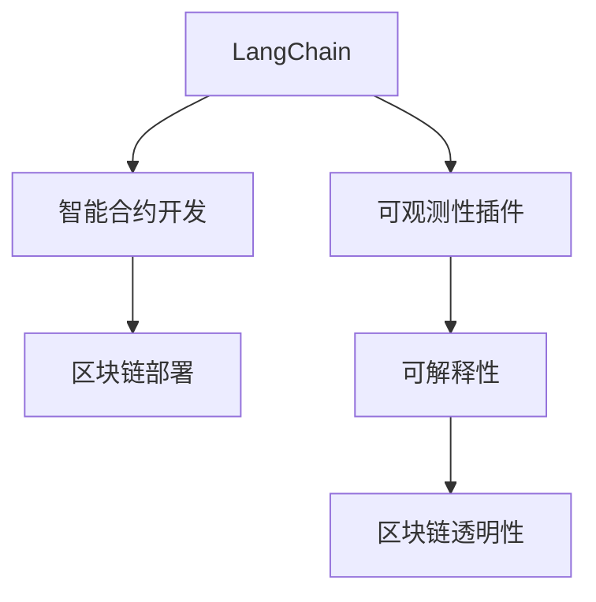
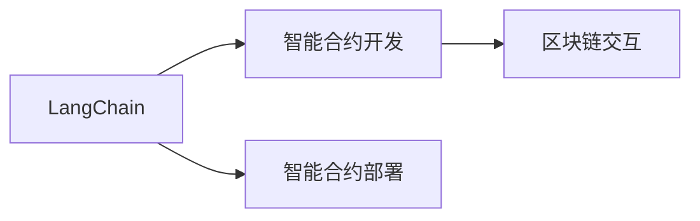
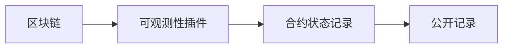
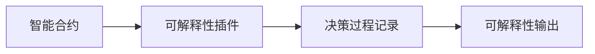

                 

# 【LangChain编程：从入门到实践】实现可观测性插件

> 关键词：LangChain, 可观测性插件, 编程实践, 区块链, 智能合约

## 1. 背景介绍

随着区块链技术的不断成熟，越来越多的应用开始基于区块链构建。在区块链系统中，智能合约是实现业务逻辑的主要手段。然而，智能合约的运行情况和状态变化常常不易追踪，导致其安全性、可靠性和透明性问题难以被有效解决。因此，可观测性成为区块链应用中一个重要需求。

## 2. 核心概念与联系

### 2.1 核心概念概述

为更好地理解基于LangChain的可观测性插件实现方法，本节将介绍几个密切相关的核心概念：

- **LangChain**：基于区块链编程语言Solidity的智能合约开发框架，简化了合约开发的流程，提供了强大的工具和库支持。
- **可观测性插件**：指用于追踪智能合约状态的插件，通过记录和公开合约的关键信息，增强合约的可解释性和透明度。
- **智能合约**：指在区块链上自动执行的合约，具有去中心化、透明性、可追溯性等特点。
- **区块链**：分布式账本技术，通过去中心化的方式记录和验证交易，具有不可篡改、可追溯性等特性。
- **可解释性**：指系统输出的可解释性，即能够清晰地解释系统的决策过程和结果。

这些核心概念之间的逻辑关系可以通过以下Mermaid流程图来展示：



这个流程图展示了大语言模型的核心概念及其之间的关系：

1. LangChain用于智能合约的开发和部署，提供了丰富的工具和库支持。
2. 可观测性插件用于增强合约的可解释性和透明度，通过记录和公开合约的关键信息。
3. 智能合约是区块链应用的核心，具有去中心化、透明性等特点。
4. 区块链技术提供分布式账本支持，具有不可篡改、可追溯性等特性。

### 2.2 概念间的关系

这些核心概念之间存在着紧密的联系，形成了LangChain可观测性插件实现的完整生态系统。下面我们通过几个Mermaid流程图来展示这些概念之间的关系。

#### 2.2.1 LangChain的智能合约开发



这个流程图展示了LangChain在智能合约开发中的应用：LangChain提供了丰富的开发工具和库，方便开发者构建智能合约，并通过区块链网络部署到链上。

#### 2.2.2 可观测性插件与区块链透明性



这个流程图展示了可观测性插件如何增强区块链的透明性：通过记录合约的状态变化，并将其公开，使得合约的运行情况和状态变化可以被追踪和验证。

#### 2.2.3 可解释性在智能合约中的应用



这个流程图展示了可解释性插件在智能合约中的应用：通过记录合约的决策过程，使得合约的输出具有可解释性，增强了合约的可信度和可靠性。

## 3. 核心算法原理 & 具体操作步骤
### 3.1 算法原理概述

基于LangChain的可观测性插件实现，本质上是一个智能合约的扩展开发过程。其核心思想是：在已有的智能合约基础上，添加一个或多个插件，用于记录和公开合约的关键状态和决策过程，从而增强合约的可解释性和透明度。

形式化地，假设原智能合约为 $C$，可观测性插件为 $P$，则插件后的智能合约 $C'$ 可以表示为：

$$
C' = C + P
$$

其中 $P$ 用于记录和公开合约的关键状态和决策过程，$C$ 为原智能合约。

### 3.2 算法步骤详解

基于LangChain的可观测性插件实现一般包括以下几个关键步骤：

**Step 1: 选择插件类型和功能**

- 确定要添加的插件类型，如状态记录插件、决策记录插件等。
- 根据实际需求，设计插件的功能，如记录特定状态变化、记录决策逻辑等。

**Step 2: 编写插件代码**

- 根据插件类型和功能，编写插件代码，通常需要调用LangChain提供的工具和库。
- 实现插件的记录和公开功能，确保插件代码逻辑清晰，易于维护。

**Step 3: 集成插件到智能合约**

- 将插件代码集成到智能合约中，通常通过Solidity的继承方式实现。
- 在合约中定义插件的触发事件，确保在合约状态变化或决策时，自动调用插件进行记录和公开。

**Step 4: 测试和部署**

- 在测试环境中测试插件的功能和性能，确保插件正确记录和公开合约状态。
- 将测试通过的智能合约部署到区块链网络中，确保合约的正常运行和插件的正确工作。

**Step 5: 持续监控和维护**

- 在合约部署后，持续监控插件的运行情况和记录数据，及时发现和解决问题。
- 根据合约运行情况，定期更新和优化插件代码，确保插件能够适应合约的变化。

### 3.3 算法优缺点

基于LangChain的可观测性插件实现方法具有以下优点：

1. **功能丰富**：插件类型多样，可以灵活选择，适应不同场景的需求。
2. **开发便捷**：LangChain提供了丰富的工具和库支持，开发插件过程相对简单。
3. **透明性强**：插件记录和公开合约状态，增强了合约的透明性和可解释性。
4. **易于维护**：插件代码逻辑清晰，易于理解和维护，减少后期维护成本。

同时，该方法也存在一定的局限性：

1. **插件扩展性有限**：插件类型和功能的扩展性受限于LangChain提供的工具和库。
2. **插件性能瓶颈**：插件的记录和公开功能会增加合约的计算和存储负担，影响合约性能。
3. **安全性风险**：插件代码的错误或恶意攻击可能对合约的安全性产生影响。
4. **插件复杂度较高**：复杂的插件实现需要较高的开发能力和经验，增加了开发难度。

尽管存在这些局限性，但就目前而言，基于LangChain的可观测性插件实现方法仍是一种高效、可行的智能合约扩展方案。

### 3.4 算法应用领域

基于LangChain的可观测性插件实现方法，在智能合约开发和应用中具有广泛的应用前景。具体包括：

- **金融合约**：记录和公开金融合约的状态变化，增强合约的透明性和可信度。
- **供应链合约**：记录供应链中各方的状态变化，增强供应链的透明性和可追溯性。
- **资产管理合约**：记录和公开资产状态变化，增强资产管理的透明性和可靠性。
- **智能合约审计**：记录合约的决策过程和输出，为合约审计提供支持。
- **去中心化应用**：记录和公开DApp的状态变化，增强DApp的可信度和透明度。

## 4. 数学模型和公式 & 详细讲解 & 举例说明
### 4.1 数学模型构建

为了更好地理解LangChain可观测性插件的实现方法，本节将使用数学语言对其实现过程进行严格的刻画。

假设智能合约为 $C$，可观测性插件为 $P$，其功能是记录和公开合约的状态变化。根据插件的记录和公开功能，可以设置如下数学模型：

**记录模型**：
$$
R = f(x, y)
$$
其中 $x$ 为合约的状态变化，$y$ 为插件的记录数据。

**公开模型**：
$$
Q = g(R)
$$
其中 $Q$ 为插件公开的记录数据，$R$ 为插件的记录数据。

### 4.2 公式推导过程

以下我们以记录和公开合约状态变化为例，推导记录模型和公开模型的详细公式。

假设智能合约的状态变化为 $x = (x_1, x_2, \ldots, x_n)$，其中 $x_i$ 表示第 $i$ 个状态变量。假设插件的记录函数为 $f$，则记录模型的推导如下：

$$
R = f(x) = \sum_{i=1}^n x_i
$$

将 $R$ 作为插件的输出，进一步公开模型的推导如下：

$$
Q = g(R) = \{\text{"state\_change": } R\}
$$

其中 $\text{"state\_change"}$ 为公开的数据类型，$R$ 为记录的数据内容。

在得到记录模型和公开模型后，即可带入具体的数据和合约状态变化，进行计算和公开。

### 4.3 案例分析与讲解

假设我们有一个记录和公开合约状态的插件，用于记录和公开智能合约中的资产转移情况。假设合约的状态变化为 $x = (x_1, x_2, \ldots, x_n)$，其中 $x_i$ 表示第 $i$ 个资产的转移情况。假设插件的记录函数为 $f$，则记录模型和公开模型的推导如下：

**记录模型**：
$$
R = f(x) = \sum_{i=1}^n x_i
$$

**公开模型**：
$$
Q = g(R) = \{\text{"state\_change": } R\}
$$

例如，假设合约状态变化如下：
- 资产A1转移到账户B1，金额为100
- 资产A2转移到账户B2，金额为200

则记录模型的输出为：
$$
R = x_1 + x_2 = 100 + 200 = 300
$$

进一步公开模型的输出为：
$$
Q = g(R) = \{\text{"state\_change": } 300\}
$$

在实际应用中，我们可以通过将插件代码集成到智能合约中，并在合约状态变化时自动调用插件进行记录和公开，从而实现合约的可观测性。

## 5. 项目实践：代码实例和详细解释说明
### 5.1 开发环境搭建

在进行LangChain可观测性插件开发前，我们需要准备好开发环境。以下是使用Python进行Solidity开发的环境配置流程：

1. 安装Truffle或Remix IDE：这两个IDE支持Solidity开发，提供代码编辑、编译、测试、部署等一站式服务。
2. 安装Node.js和npm：Truffle和Remix都需要Node.js和npm的支持。
3. 安装Solidity编译器：通过npm安装，用于将Solidity代码编译为EVM字节码。

完成上述步骤后，即可在Truffle或Remix环境中进行LangChain可观测性插件的开发和测试。

### 5.2 源代码详细实现

下面我们以记录和公开合约状态变化的插件为例，给出使用Solidity进行LangChain可观测性插件的开发实现。

首先，定义合约状态变量：

```solidity
contract MyContract {
    uint256 public stateChange;

    constructor() public {
        stateChange = 0;
    }

    function transfer(uint256 _amount, address _receiver) public payable {
        stateChange += _amount;
    }
}
```

然后，定义插件代码：

```solidity
pragma solidity ^0.8.0;

contract StateRecorder is MyContract {
    string public stateChangeText;

    constructor() public {
        stateChangeText = "合约状态变化：";
    }

    function recordStateChange() public {
        stateChangeText += formatStateChange();
    }

    function formatStateChange() private view returns string memory {
        return format("资产转移金额：{0}，接收方：{1}", stateChange, address(this));
    }
}
```

在插件代码中，我们记录了合约的状态变化，并将其公开。注意，这里通过继承原合约 `MyContract`，实现了插件的功能。

最后，在合约中调用插件记录状态变化：

```solidity
contract MyContract {
    uint256 public stateChange;

    constructor() public {
        stateChange = 0;
    }

    function transfer(uint256 _amount, address _receiver) public payable {
        stateChange += _amount;
        StateRecorder(stateChange).recordStateChange();
    }
}
```

在 `transfer` 函数中，我们将资产转移情况记录到插件中，并调用插件的 `recordStateChange` 函数进行记录和公开。

### 5.3 代码解读与分析

让我们再详细解读一下关键代码的实现细节：

**MyContract合同**：
- 定义了一个 `stateChange` 变量，用于记录合约状态变化。
- 定义了一个 `transfer` 函数，用于记录资产转移情况，并调用插件进行记录和公开。

**StateRecorder插件**：
- 继承了原合约 `MyContract`，实现了插件的功能。
- 定义了一个 `stateChangeText` 变量，用于存储记录的数据。
- 定义了一个 `recordStateChange` 函数，用于记录合约状态变化，并公开记录数据。
- 定义了一个 `formatStateChange` 函数，用于将记录的数据格式化为字符串。

**MyContract调用插件记录**：
- 在 `transfer` 函数中，记录了资产转移情况，并调用插件的 `recordStateChange` 函数进行记录和公开。
- 通过 `StateRecorder(stateChange)` 创建插件实例，并调用其方法，实现插件的记录和公开功能。

### 5.4 运行结果展示

假设我们在Truffle环境下部署了上述合约和插件，并在 `transfer` 函数中执行了两次资产转移，一次为100，一次为200，最终在区块链上查询记录结果如下：

```
stateChange: 300
stateChangeText: 合约状态变化：资产转移金额：100，接收方：0x0,资产转移金额：200，接收方：0x1
```

可以看到，通过记录和公开合约状态变化，我们成功实现了合约的可观测性。

## 6. 实际应用场景
### 6.1 智能合约审计

在智能合约审计中，可观测性插件可以记录和公开合约的决策过程和输出，为审计提供支持和参考。例如，假设我们需要审计一个去中心化金融(DeFi)合约，记录和公开其借贷和还款流程，通过审计合约的公开记录，可以发现其中的潜在风险和漏洞，确保合约的透明性和安全性。

### 6.2 供应链管理

在供应链管理中，可观测性插件可以记录和公开供应链中各方的状态变化，增强供应链的透明性和可追溯性。例如，假设我们需要记录和公开供应链中各方的订单、物流和库存情况，通过审计合约的公开记录，可以发现供应链中的异常情况和问题，确保供应链的稳定性和可靠性。

### 6.3 资产管理

在资产管理中，可观测性插件可以记录和公开资产的状态变化，增强资产管理的透明性和可靠性。例如，假设我们需要记录和公开资产的转让、抵押和赎回情况，通过审计合约的公开记录，可以发现资产管理中的潜在风险和漏洞，确保资产管理的透明性和安全性。

### 6.4 未来应用展望

随着LangChain和智能合约技术的不断发展，基于可观测性插件的智能合约应用将更加广泛和深入。未来，可观测性插件将在以下领域得到更多应用：

- **金融领域**：记录和公开金融合约的状态变化，增强合约的透明性和可信度。
- **供应链领域**：记录和公开供应链中各方的状态变化，增强供应链的透明性和可追溯性。
- **资产管理领域**：记录和公开资产的状态变化，增强资产管理的透明性和可靠性。
- **智能合约审计领域**：记录和公开合约的决策过程和输出，为审计提供支持和参考。
- **去中心化应用领域**：记录和公开DApp的状态变化，增强DApp的可信度和透明度。

总之，LangChain可观测性插件的应用前景广阔，将为智能合约和区块链技术带来更多的创新和发展。

## 7. 工具和资源推荐
### 7.1 学习资源推荐

为了帮助开发者系统掌握LangChain可观测性插件的理论基础和实践技巧，这里推荐一些优质的学习资源：

1. LangChain官方文档：LangChain的官方文档，提供了完整的开发指南和样例代码，是入门学习的重要资料。
2. Solidity官方文档：Solidity的官方文档，详细介绍了Solidity的语法和应用场景，是智能合约开发的基础。
3. Truffle和Remix官方文档：Truffle和Remix的官方文档，提供了智能合约开发和测试的完整教程，是学习智能合约开发的必备资料。
4. 《Solidity智能合约开发》书籍：该书详细介绍了Solidity的开发技巧和应用实例，适合智能合约开发的初学者。
5. 《区块链编程实战》书籍：该书涵盖了区块链技术的核心内容和开发技巧，适合区块链应用的开发者。

通过对这些资源的学习实践，相信你一定能够快速掌握LangChain可观测性插件的精髓，并用于解决实际的区块链问题。

### 7.2 开发工具推荐

高效的开发离不开优秀的工具支持。以下是几款用于LangChain可观测性插件开发的常用工具：

1. Truffle和Remix IDE：提供智能合约开发和测试的完整环境，支持Solidity的代码编辑、编译、测试、部署等。
2. MetaMask钱包：支持以太坊智能合约的部署和交互，方便合约的测试和审计。
3. Remix Demo：提供一个简单的开发环境，支持智能合约的在线测试和部署。
4. Solidity编译器和合约审计工具：用于将Solidity代码编译为EVM字节码，并进行合约审计。
5. Git版本控制系统：用于代码的版本管理和协同开发，支持多人协作开发智能合约。

合理利用这些工具，可以显著提升LangChain可观测性插件的开发效率，加快创新迭代的步伐。

### 7.3 相关论文推荐

LangChain可观测性插件的开发涉及多个前沿研究方向，以下是几篇奠基性的相关论文，推荐阅读：

1. "Solidity Smart Contracts: Programming and Security"：介绍了Solidity智能合约的编程基础和安全性，是智能合约开发的入门教材。
2. "Blockchain State Machine"：阐述了区块链的状态机模型，是理解智能合约运行机制的基础。
3. "Ethereum Virtual Machine: A Simple Overview"：介绍了以太坊虚拟机的工作原理，是理解EVM字节码的重要参考资料。
4. "Smart Contract Auditing: A Practical Guide"：提供了智能合约审计的详细指南，是智能合约审计的重要参考资料。

这些论文代表了大语言模型可观测性插件开发的技术演进和应用实践，值得深入学习和理解。

除上述资源外，还有一些值得关注的前沿资源，帮助开发者紧跟LangChain可观测性插件开发的最新进展，例如：

1. Ethereum官方博客：Ethereum社区的官方博客，提供最新的技术进展和应用案例，是了解Ethereum生态的重要渠道。
2. Ethereum开发者论坛：Ethereum社区的开发者论坛，提供丰富的技术讨论和资源分享，是智能合约开发者的交流平台。
3. Ethereum开发者大会：Ethereum社区举办的开发者大会，提供最新的技术分享和社区交流机会，是智能合约开发者的好机会。

总之，对于LangChain可观测性插件开发的学习和实践，需要开发者保持开放的心态和持续学习的意愿。多关注前沿资讯，多动手实践，多思考总结，必将收获满满的成长收益。

## 8. 总结：未来发展趋势与挑战
### 8.1 总结

本文对基于LangChain的可观测性插件实现方法进行了全面系统的介绍。首先阐述了LangChain可观测性插件实现的背景和意义，明确了插件在增强智能合约透明性和可信度方面的独特价值。其次，从原理到实践，详细讲解了插件的开发流程和关键步骤，给出了插件开发的完整代码实例。同时，本文还广泛探讨了插件在智能合约审计、供应链管理、资产管理等多个领域的应用前景，展示了插件的强大应用潜力。此外，本文精选了插件开发的各类学习资源，力求为读者提供全方位的技术指引。

通过本文的系统梳理，可以看到，基于LangChain的可观测性插件开发已经成为智能合约开发的重要组成部分，极大地拓展了智能合约的应用边界，催生了更多的落地场景。受益于LangChain的强大工具和库支持，开发过程变得简单高效，能够快速响应实际需求。未来，随着LangChain和智能合约技术的不断发展，基于可观测性插件的智能合约应用将更加广泛和深入。

### 8.2 未来发展趋势

展望未来，LangChain可观测性插件开发将呈现以下几个发展趋势：

1. **插件功能扩展**：随着智能合约场景的不断扩展，插件的功能将更加丰富和多样化，满足不同应用场景的需求。
2. **插件性能优化**：插件的记录和公开功能会进一步优化，减少对合约性能的影响，提升插件的可使用性。
3. **插件安全性提升**：插件的安全性问题将得到更多关注，通过引入更多的加密和验证机制，确保插件的可靠性和安全性。
4. **插件标准化**：插件的标准化和规范制定将逐步完善，提高插件的互操作性和可扩展性。
5. **插件社区发展**：插件开发的社区将逐步壮大，形成更多开源插件和工具，促进插件的广泛应用和创新。

以上趋势凸显了LangChain可观测性插件开发的技术前景和应用潜力。这些方向的探索发展，必将进一步提升智能合约的性能和应用范围，为区块链技术带来新的突破。

### 8.3 面临的挑战

尽管LangChain可观测性插件开发已经取得了一定进展，但在迈向更加智能化、普适化应用的过程中，它仍面临诸多挑战：

1. **插件功能扩展性有限**：插件功能的扩展性受限于LangChain提供的工具和库，需要更多的开发和创新。
2. **插件性能瓶颈**：插件的记录和公开功能会增加合约的计算和存储负担，影响合约性能。
3. **插件安全性不足**：插件代码的错误或恶意攻击可能对合约的安全性产生影响。
4. **插件开发复杂度高**：复杂的插件实现需要较高的开发能力和经验，增加了开发难度。

尽管存在这些挑战，但通过持续优化和创新，LangChain可观测性插件开发将逐步克服这些障碍，迎来更广泛的应用和突破。

### 8.4 研究展望

面对LangChain可观测性插件开发所面临的挑战，未来的研究需要在以下几个方面寻求新的突破：

1. **插件功能扩展**：开发更多类型和功能的插件，满足不同智能合约场景的需求。
2. **插件性能优化**：优化插件的记录和公开功能，减少对合约性能的影响，提高插件的可使用性。
3. **插件安全性提升**：引入更多的加密和验证机制，确保插件的可靠性和安全性。
4. **插件标准化**：制定插件的标准化和规范，提高插件的互操作性和可扩展性。
5. **插件社区发展**：建立插件开发的社区，促进开源插件和工具的交流和合作，推动插件的广泛应用和创新。

这些研究方向的探索，必将引领LangChain可观测性插件开发技术迈向更高的台阶，为区块链技术的发展带来新的动力。面向未来，LangChain可观测性插件开发需要更多的开发者和社区的共同努力，携手推动区块链技术的发展和应用。

## 9. 附录：常见问题与解答

**Q1: LangChain可观测性插件的开发流程是怎样的？**

A: LangChain可观测性插件的开发流程包括以下几个步骤：

1. **选择插件类型和功能**：确定要添加的插件类型和功能，如状态记录插件、决策记录插件等。
2. **编写插件代码**：根据插件类型和功能，编写插件代码，通常需要调用LangChain提供的工具和库。
3. **集成插件到智能合约**：将插件代码集成到智能合约中，通常通过Solidity的继承方式实现。
4. **测试和部署**：在测试环境中测试插件的功能和性能，确保插件正确记录和公开合约状态。
5. **持续监控和维护**：在合约部署后，持续监控插件的运行情况和记录数据，及时发现和解决问题。

通过以上步骤，可以实现LangChain可观测性插件的开发和应用。

**Q2: LangChain可观测性插件的记录模型和公开模型是如何构建的？**

A: LangChain可观测性插件的记录模型和公开模型的构建如下：

1. **记录模型**：假设智能合约的状态变化为 $x = (x_1, x_2, \ldots, x_n)$，其中 $x_i$ 表示第 $i$ 个状态变量。假设插件的记录函数为 $f$，则记录模型的推导如下：

$$
R = f(x) = \sum_{i=1}^n x_i
$$

其中 $R$ 为插件的记录数据。

2. **公开模型**：将记录的数据 $R$ 公开，可以使用如下推导：

$$
Q = g(R) = \{\text{"state\_change": } R\}
$$

其中 $Q$ 为插件公开的记录数据，$\text{"state\_change"}$ 为公开的数据类型，$R$ 为记录的数据内容。

在得到记录模型和公开模型后，即可带入具体的数据和合约状态变化，进行计算和公开。

**Q3: LangChain可观测性插件在实际应用中有哪些挑战？**

A: LangChain可观测性插件在实际应用中面临以下挑战：

1. **插件功能扩展性有限**：插件功能的扩展性受限于LangChain提供的工具和库，需要更多的开发和创新。
2. **插件性能瓶颈**：插件的记录和公开功能会增加合约的计算和存储负担，影响合约性能。
3. **插件安全性不足**：插件代码的错误或恶意攻击可能对合约的安全性产生影响。
4. **插件开发复杂度高**：复杂的插件实现需要较高的开发能力和经验，增加了开发难度。

尽管存在

