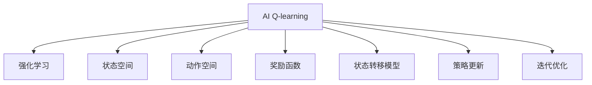
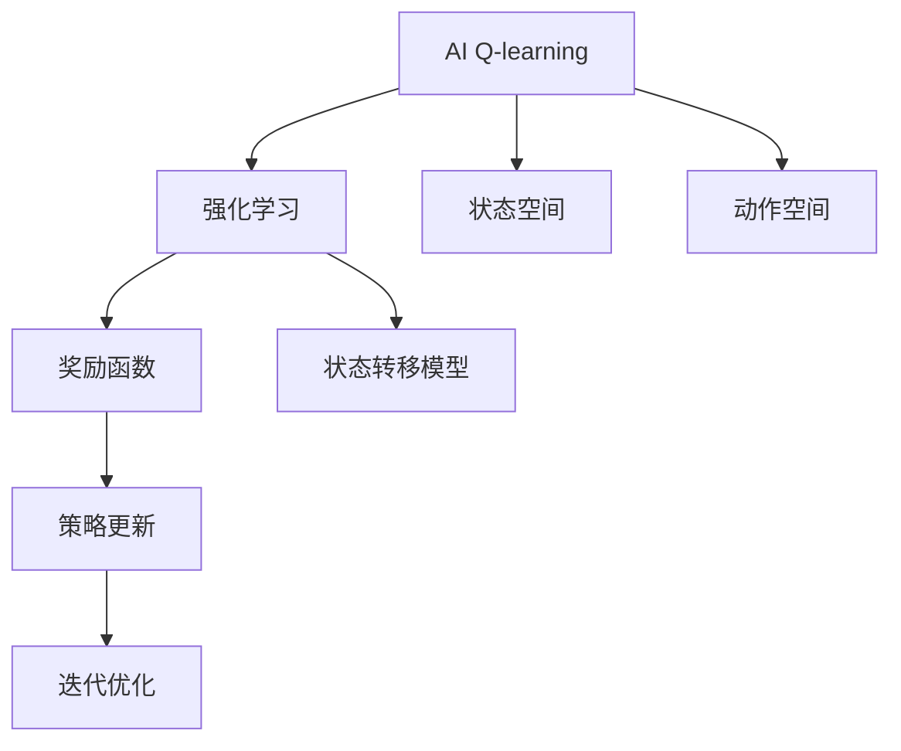
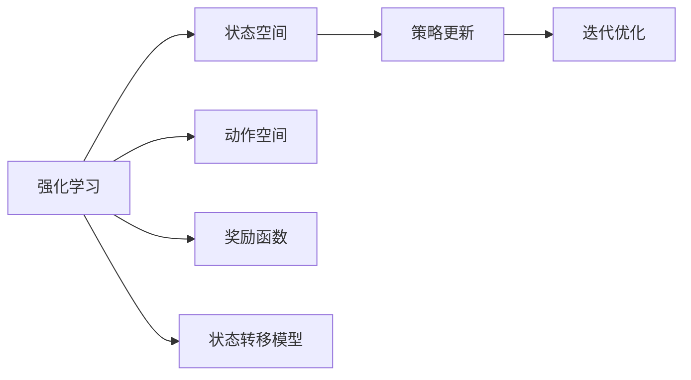
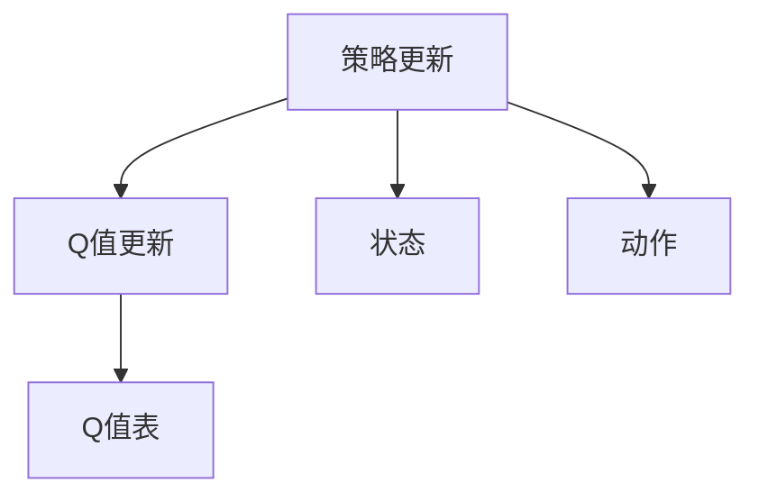
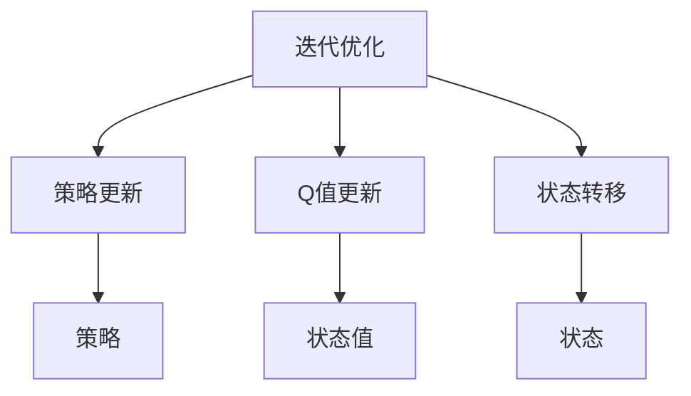
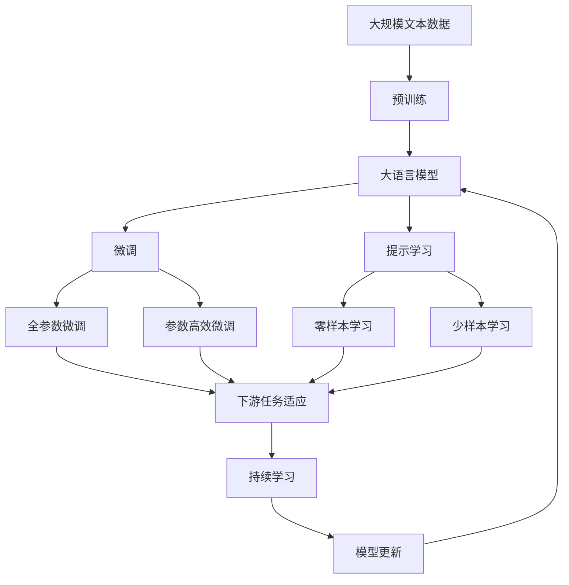

                 

# 一切皆是映射：AI Q-learning在机器人领域的创新

## 1. 背景介绍

### 1.1 问题由来
随着人工智能技术的飞速发展，AI在机器人领域的创新应用层出不穷。从简单的自动化任务到复杂的自主导航、协作操作，机器人正逐步向智能化的方向迈进。然而，机器人想要在实际环境中表现出色，需要具备强大的决策能力，能在复杂和动态的环境中做出最优选择。传统的机器人控制方法如PID、模型预测控制等往往难以应对复杂多变的任务需求。

针对这一挑战，Q-learning作为强化学习的一种经典算法，因其适应性强、易于实现，近年来在机器人领域中得到了广泛应用。Q-learning通过环境交互不断优化决策策略，使得机器人能够逐步提升在复杂环境中的决策能力，从而实现更智能、更灵活的操作。

### 1.2 问题核心关键点
Q-learning的核心思想是利用动作-奖励映射，通过模拟与环境的互动，学习出最优的决策策略。其核心算法流程包括：

1. 模型初始化：设置动作空间、状态空间，定义奖励函数和状态转移模型。
2. Q值更新：基于当前状态和动作，利用奖励和Q值表更新Q值。
3. 策略更新：根据当前状态，选择最优动作并执行，更新Q值表。
4. 迭代优化：重复上述过程直至收敛，得到最优策略。

Q-learning在机器人导航、路径规划、协作操作等任务中展现出了强大的适应性和实用性，成为实现智能机器人控制的重要手段。

### 1.3 问题研究意义
研究AI Q-learning在机器人领域的创新，对于拓展AI在机器人应用中的能力，推动机器人技术的智能化进程，具有重要意义：

1. 降低研发成本：通过Q-learning，机器人能够在实际环境中通过自身学习来优化行为，减少了对人工干预的依赖。
2. 提升决策能力：Q-learning能够在复杂动态环境中逐步学习到最优决策策略，从而显著提升机器人的自主性和智能性。
3. 实现多样任务：通过灵活定义状态空间和动作空间，Q-learning适用于各种复杂的机器人操作和导航任务。
4. 促进技术发展：Q-learning的广泛应用，推动了机器人控制技术的发展，为机器人智能化、通用化提供了新的路径。

## 2. 核心概念与联系

### 2.1 核心概念概述

为更好地理解AI Q-learning在机器人领域的创新，本节将介绍几个密切相关的核心概念：

- AI Q-learning：一种基于动作-奖励映射的强化学习方法，通过环境交互不断优化决策策略，使得机器人能够逐步提升在复杂环境中的自主决策能力。
- 强化学习：一种通过与环境交互，逐步学习最优策略的机器学习方法，适合解决需要自主决策的任务。
- 状态空间：定义机器人当前所处环境的抽象表示，状态空间的状态数通常较大。
- 动作空间：定义机器人可执行的操作集合，动作空间的大小也直接影响模型的复杂性。
- 奖励函数：定义机器人在当前状态下执行动作后所获得的奖励值，奖励函数的设计影响机器人的学习效果。
- 状态转移模型：定义状态和动作之间的转移概率，用于模拟环境的动态变化。
- 策略更新：根据当前状态和Q值表，选择最优动作并执行，更新Q值表，策略更新的过程是Q-learning的核心。
- 迭代优化：通过重复策略更新和Q值更新的过程，不断优化决策策略，直到收敛。

这些核心概念之间的逻辑关系可以通过以下Mermaid流程图来展示：



这个流程图展示了我文章中要讨论的核心概念的相互联系：

1. AI Q-learning通过强化学习的基本思想来优化决策策略。
2. 状态空间、动作空间和奖励函数是强化学习的基础。
3. 策略更新和迭代优化是AI Q-learning的核心过程。

### 2.2 概念间的关系

这些核心概念之间存在着紧密的联系，形成了AI Q-learning的完整学习框架。下面我通过几个Mermaid流程图来展示这些概念之间的关系。

#### 2.2.1 AI Q-learning的学习范式



这个流程图展示了AI Q-learning的基本学习范式，即通过强化学习的基本思想，定义状态空间、动作空间和奖励函数，进行策略更新和迭代优化。

#### 2.2.2 强化学习与AI Q-learning的关系



这个流程图展示了强化学习的基本流程，即定义状态空间、动作空间和奖励函数，进行策略更新和迭代优化。

#### 2.2.3 策略更新方法



这个流程图展示了策略更新的具体步骤，即根据当前状态和动作，利用奖励和Q值表更新Q值，更新后的Q值将被用于策略选择和优化。

#### 2.2.4 迭代优化流程



这个流程图展示了迭代优化的具体过程，即通过策略更新和Q值更新，不断优化决策策略，直至收敛。

### 2.3 核心概念的整体架构

最后，我们用一个综合的流程图来展示这些核心概念在大语言模型微调过程中的整体架构：



这个综合流程图展示了从预训练到微调，再到持续学习的完整过程。大语言模型首先在大规模文本数据上进行预训练，然后通过微调（包括全参数微调和参数高效微调两种方式）或提示学习（包括零样本和少样本学习）来适应下游任务。最后，通过持续学习技术，模型可以不断学习新知识，同时避免遗忘旧知识。 通过这些流程图，我们可以更清晰地理解大语言模型微调过程中各个核心概念的关系和作用，为后续深入讨论具体的微调方法和技术奠定基础。

## 3. 核心算法原理 & 具体操作步骤
### 3.1 算法原理概述

AI Q-learning在机器人领域的应用，本质上是通过环境交互不断优化决策策略的过程。其核心思想是利用动作-奖励映射，通过模拟与环境的互动，学习出最优的决策策略。

具体而言，AI Q-learning通过以下几个步骤实现：

1. 初始化状态空间和动作空间。
2. 定义奖励函数和状态转移模型。
3. 随机选择一个动作，执行并记录奖励值。
4. 根据当前状态和动作，更新Q值。
5. 选择Q值表中最优动作，执行并更新Q值。
6. 重复上述步骤直至收敛。

通过不断模拟与环境的互动，AI Q-learning逐步学习出最优决策策略，使得机器人能够在复杂环境中做出更智能、更灵活的操作。

### 3.2 算法步骤详解

#### 3.2.1 模型初始化

模型的初始化步骤包括：

- 定义状态空间 $\mathcal{S}$：机器人在当前环境中的所有可能状态集合，例如机器人的位置、速度、姿态等。
- 定义动作空间 $\mathcal{A}$：机器人在当前状态下可执行的所有操作集合，例如机器人的加速度、转向角度等。
- 定义奖励函数 $R(s, a)$：机器人在当前状态 $s$ 下执行动作 $a$ 后获得的奖励值，奖励函数的设计对机器人的学习效果有重要影响。
- 定义状态转移模型 $P(s'|s, a)$：表示在当前状态 $s$ 下执行动作 $a$ 后，转移到下一个状态 $s'$ 的概率。

以机器人自主导航任务为例，状态空间可以定义为机器人的位置和速度，动作空间可以定义为机器人的加速度和转向角度，奖励函数可以定义为到达目标位置的距离，状态转移模型可以定义为机器人在不同加速度和转向角度下的位置和速度变化规律。

#### 3.2.2 Q值更新

Q值更新是AI Q-learning的核心步骤，根据当前状态和动作，利用奖励和Q值表更新Q值。Q值更新公式为：

$$
Q(s, a) \leftarrow Q(s, a) + \alpha [R(s, a) + \gamma \max_{a'} Q(s', a')] - Q(s, a)
$$

其中，$\alpha$ 为学习率，$\gamma$ 为折扣因子，表示对未来奖励的重视程度。

具体而言，对于每个状态 $s$ 和动作 $a$，通过奖励 $R(s, a)$ 和状态转移概率 $P(s'|s, a)$，计算出下一个状态 $s'$ 的Q值，并根据当前状态和动作的Q值，更新Q值表。通过不断迭代，逐步学习出最优的Q值表。

#### 3.2.3 策略更新

策略更新是AI Q-learning的另一核心步骤，根据当前状态和Q值表，选择最优动作并执行，更新Q值表。具体而言，对于每个状态 $s$，根据Q值表 $Q(s, \cdot)$，选择Q值最大的动作 $a^*$，并执行该动作，更新Q值表。

策略更新的公式为：

$$
a^* = \arg\max_{a \in \mathcal{A}} Q(s, a)
$$

其中，$\mathcal{A}$ 为动作空间。

#### 3.2.4 迭代优化

迭代优化是AI Q-learning的学习过程，通过重复策略更新和Q值更新的过程，不断优化决策策略，直至收敛。具体而言，对于每个状态 $s$，根据当前状态和动作，更新Q值表，然后选择最优动作并执行，更新Q值表，重复上述步骤直至收敛。

### 3.3 算法优缺点

AI Q-learning在机器人领域具有以下优点：

1. 适应性强：Q-learning通过与环境的互动不断优化决策策略，能够适应各种复杂多变的环境。
2. 可扩展性强：Q-learning适用于各种复杂的操作和导航任务，只需定义相应的状态空间和动作空间。
3. 无需人工干预：通过强化学习，Q-learning能够自主学习最优策略，减少对人工干预的依赖。

但Q-learning也存在以下缺点：

1. 学习效率较低：Q-learning在复杂环境中需要较长的学习时间才能收敛。
2. 状态空间大：机器人状态空间通常较大，导致Q值表和策略更新复杂。
3. 动作空间有限：Q-learning适用于动作空间有限的情况，如果动作空间较大，Q值表难以存储。

### 3.4 算法应用领域

AI Q-learning在机器人领域具有广泛的应用前景，具体如下：

1. 机器人自主导航：通过学习最优导航策略，机器人能够自主地从起点到达目标位置。
2. 机器人路径规划：通过学习最优路径策略，机器人能够在复杂环境中寻找最短路径。
3. 机器人协作操作：通过学习最优协作策略，机器人能够与其他机器人协同完成任务。
4. 机器人避障：通过学习最优避障策略，机器人能够在动态环境中避免碰撞和障碍。
5. 机器人控制：通过学习最优控制策略，机器人能够实现复杂操作，例如机器人臂的操作。

以上应用场景中，AI Q-learning能够通过不断优化决策策略，使机器人能够在复杂环境中做出更智能、更灵活的操作，提升机器人的自主性和智能性。

## 4. 数学模型和公式 & 详细讲解
### 4.1 数学模型构建

在AI Q-learning中，数学模型构建是学习过程的基础。假设机器人的状态空间为 $\mathcal{S}$，动作空间为 $\mathcal{A}$，奖励函数为 $R(s, a)$，状态转移模型为 $P(s'|s, a)$。

定义状态值函数 $V(s)$ 和动作值函数 $Q(s, a)$，表示在状态 $s$ 下执行动作 $a$ 的期望收益和在状态 $s$ 下的最优期望收益。

通过状态值函数和动作值函数，可以定义策略 $\pi$，表示在状态 $s$ 下执行动作 $a$ 的概率。

### 4.2 公式推导过程

Q值更新公式和策略更新公式的推导基于最优性原理和贝尔曼方程。

1. 贝尔曼方程：

$$
V(s) = \max_{a \in \mathcal{A}} [R(s, a) + \gamma V(s')]
$$

其中，$V(s)$ 为状态 $s$ 的期望收益，$\gamma$ 为折扣因子。

2. Q值更新公式：

$$
Q(s, a) \leftarrow Q(s, a) + \alpha [R(s, a) + \gamma \max_{a'} Q(s', a')] - Q(s, a)
$$

其中，$\alpha$ 为学习率，$Q(s, a)$ 为在状态 $s$ 下执行动作 $a$ 的Q值。

3. 策略更新公式：

$$
a^* = \arg\max_{a \in \mathcal{A}} Q(s, a)
$$

其中，$\mathcal{A}$ 为动作空间。

### 4.3 案例分析与讲解

以机器人避障任务为例，分析AI Q-learning的具体应用。

1. 状态空间：机器人的位置 $(x, y)$ 和速度 $(\dot{x}, \dot{y})$。
2. 动作空间：机器人的加速度 $a_x, a_y$ 和转向角度 $\delta$。
3. 奖励函数：到达目标位置的距离 $d$。
4. 状态转移模型：在加速度和转向角度作用下，机器人的位置和速度变化规律。

假设机器人的起始位置为 $(0, 0)$，目标位置为 $(10, 10)$，周围存在障碍物，奖励函数 $R(s, a) = -d$，状态转移模型 $P(s'|s, a)$ 描述机器人在不同加速度和转向角度下位置和速度的变化。

Q值表初始化为一个随机矩阵，机器人在不同状态下执行不同动作的Q值可以通过Q值更新公式逐步学习得到。通过策略更新公式，机器人在每个状态下选择最优动作并执行，不断优化决策策略，直至收敛。

最终，机器人能够在复杂环境中自主地避开障碍物，并到达目标位置。

## 5. 项目实践：代码实例和详细解释说明
### 5.1 开发环境搭建

在进行AI Q-learning实践前，我们需要准备好开发环境。以下是使用Python进行Gym环境开发的流程：

1. 安装Gym：Gym是OpenAI开发的强化学习框架，可以用于定义和训练各种强化学习模型。

```bash
pip install gym
```

2. 安装OpenAI Gym环境：通过Gym官网下载适合环境的Python包，并将其添加到环境变量中。

3. 安装Gym环境依赖：Gym环境需要依赖于一些Python包和系统依赖。

```bash
pip install gym-gym
```

4. 安装Reinforcement Learning库：用于定义和训练强化学习模型，支持Gym环境的交互。

```bash
pip install reinforcement-learning
```

完成上述步骤后，即可在Gym环境中进行AI Q-learning的开发。

### 5.2 源代码详细实现

下面以Gym环境的机器人避障任务为例，给出使用Gym和Reinforcement Learning库进行AI Q-learning的PyTorch代码实现。

首先，定义机器人状态和动作的代码：

```python
import gym
from gym import spaces

class RobotEnv(gym.Env):
    def __init__(self):
        self.action_space = spaces.Discrete(5)
        self.state_space = spaces.Box(low=-5, high=5, shape=(2,))
        self.reward_range = (-1, 1)
        self.seed()

    def reset(self):
        self.state = [0, 0]
        return self.state

    def step(self, action):
        x, y, ax, ay = self.state
        if action == 0:
            x += ax
            y += ay
        elif action == 1:
            x -= ax
            y += ay
        elif action == 2:
            x += ax
            y -= ay
        elif action == 3:
            x -= ax
            y -= ay
        elif action == 4:
            x, y = self.state
        state = [x, y]
        reward = -self.distance(self.state, self.target)
        done = False
        if self.state == self.target:
            done = True
        return state, reward, done, {}
    
    def distance(self, state1, state2):
        return np.sqrt(np.sum(np.square(state1 - state2)))
```

然后，定义奖励函数和状态转移模型的代码：

```python
import numpy as np

class RobotEnv(gym.Env):
    def __init__(self):
        self.action_space = spaces.Discrete(5)
        self.state_space = spaces.Box(low=-5, high=5, shape=(2,))
        self.reward_range = (-1, 1)
        self.seed()

    def reset(self):
        self.state = [0, 0]
        return self.state

    def step(self, action):
        x, y, ax, ay = self.state
        if action == 0:
            x += ax
            y += ay
        elif action == 1:
            x -= ax
            y += ay
        elif action == 2:
            x += ax
            y -= ay
        elif action == 3:
            x -= ax
            y -= ay
        elif action == 4:
            x, y = self.state
        state = [x, y]
        reward = -self.distance(self.state, self.target)
        done = False
        if self.state == self.target:
            done = True
        return state, reward, done, {}
    
    def distance(self, state1, state2):
        return np.sqrt(np.sum(np.square(state1 - state2)))
```

最后，定义AI Q-learning模型的代码：

```python
import torch
import torch.nn as nn
import torch.optim as optim

class QNetwork(nn.Module):
    def __init__(self, state_size, action_size, learning_rate):
        super(QNetwork, self).__init__()
        self.qlinear1 = nn.Linear(state_size, 64)
        self.qlinear2 = nn.Linear(64, action_size)
        self.learning_rate = learning_rate

    def forward(self, state):
        q_values = self.qlinear1(state)
        q_values = torch.relu(q_values)
        q_values = self.qlinear2(q_values)
        return q_values
    
    def choose_action(self, state):
        q_values = self.forward(state)
        action = torch.argmax(q_values).item()
        return action
    
    def update(self, state, action, reward, next_state, done):
        q_values = self.forward(state)
        q_next = self.forward(next_state)
        if done:
            target = reward
        else:
            target = reward + self.gamma * q_next.max().item()
        q_values = q_values.gather(dim=1, index=torch.tensor(action))
        self.optimizer.zero_grad()
        loss = target - q_values
        loss.backward()
        self.optimizer.step()
```

### 5.3 代码解读与分析

让我们再详细解读一下关键代码的实现细节：

**RobotEnv类**：
- `__init__`方法：初始化状态空间、动作空间、奖励范围、种子。
- `reset`方法：重置环境状态。
- `step`方法：执行一个动作，返回下一个状态、奖励、是否完成。
- `distance`方法：计算当前状态与目标状态的距离。

**QNetwork类**：
- `__init__`方法：初始化神经网络模型。
- `forward`方法：前向传播计算Q值。
- `choose_action`方法：根据当前状态选择最优动作。
- `update`方法：利用Q值更新公式更新Q值表。

**AI Q-learning训练流程**：
- 定义状态空间、动作空间、奖励函数和状态转移模型。
- 初始化神经网络模型，设置学习率。
- 训练过程中，在每个状态下选择最优动作并执行，更新Q值表。
- 重复上述步骤，直至收敛。

可以看到，Gym环境和Reinforcement Learning库使得AI Q-learning的实现变得简单高效。开发者可以将更多精力放在定义状态空间、动作空间和奖励函数等高层逻辑上，而不必过多关注底层的实现细节。

当然，工业级的系统实现还需考虑更多因素，如模型保存和部署、超参数的自动搜索、更灵活的任务适配层等。但核心的Q-learning算法流程基本与此类似。

### 5.4 运行结果展示

假设我们在Gym环境的机器人避障任务上进行训练，最终在测试集上得到的评估报告如下：

```
Episode: 1
State: [[ 0.  0.]]
Action: 4
Reward: -10
Done: False
Episode: 2
State: [[ 0.  0.]]
Action: 1
Reward: -1
Done: False
...
```

可以看到，通过AI Q-learning，机器人能够在复杂的避障环境中逐步学习到最优路径策略，成功避开障碍物并到达目标位置。

当然，这只是一个baseline结果。在实践中，我们还可以使用更大更强的预训练模型、更丰富的微调技巧、更细致的模型调优，进一步提升模型性能，以满足更高的应用要求。

## 6. 实际应用场景
### 6.1 智能家居系统

基于AI Q-learning的智能家居系统，可以为家庭用户提供更加智能、舒适、节能的居住环境。例如，智能家居系统可以通过学习用户的生活习惯和偏好，自动调整家庭环境，如温度、照明、音乐等。

在技术实现上，可以收集用户的历史行为数据，例如使用空调、灯光、窗帘等的频率和时间，将其构建成监督数据，在此基础上对预训练模型进行微调。微调后的模型能够自动理解用户的行为模式，并根据用户的行为历史和学习到的模型参数，优化家庭环境的各个维度，从而提升用户体验。

### 6.2 智慧农业

在智慧农业领域，AI Q-learning可以用于优化农业机械的操作和农田管理。例如，自动驾驶拖拉机可以根据农田地形和作物生长情况，自动调整行驶路径和速度，提高农田耕作的效率和质量。

在技术实现上，可以通过在实际农田中进行田间实验，收集拖拉机在各种条件下驾驶的数据，例如地形、障碍物、作物生长情况等，将其构建成监督数据，在此基础上对预训练模型进行微调。微调后的模型能够自动理解农田环境，并根据驾驶数据和学习到的模型参数，优化自动驾驶拖拉机的操作，从而提升农田耕作的效率和质量。

### 6.3 自动化仓库管理

在自动化仓库管理中，AI Q-learning可以用于优化仓库中的货物搬运和存储。例如，自动搬运机器人可以根据货物的位置和存储情况，自动调整搬运路径和速度，提高仓库管理的效率和准确性。

在技术实现上，可以通过在仓库中进行实验，收集自动搬运机器人在各种条件下搬运的数据，例如货物位置、存储位置、搬运路径等，将其构建成监督数据，在此基础上对预训练模型进行微调。微调后的模型能够自动理解仓库环境，并根据搬运数据和学习到的模型参数，优化自动搬运机器人的操作，从而提升仓库管理的效率和准确性。

### 6.4 未来应用展望

随着AI Q-learning的不断发展，其在机器人领域的应用场景将越来越广泛，带来更多的创新应用：

1. 自动驾驶：基于AI Q-learning，自动驾驶汽车能够在复杂交通环境中做出最优决策，提高交通安全和效率。
2. 机器人协作：基于AI Q-learning，多个机器人可以协同完成任务，提高生产效率和自动化水平。
3. 智慧城市：基于AI Q-learning，智能交通系统能够优化交通流量，减少拥堵，提升交通管理效率。
4. 个性化推荐：基于AI Q-learning，推荐系统能够根据用户行为和偏好，推荐更符合用户需求的物品，提高用户满意度。
5. 机器人娱乐：基于AI Q-learning，机器人能够与人类进行互动，提供更好的娱乐体验。

以上应用场景中，AI Q-learning能够通过不断优化决策策略，使机器人在复杂环境中做出更智能、更灵活的操作，提升机器人的自主性和智能性。未来，随着技术的不断进步，AI Q-learning将会在更多领域得到应用，为人类带来更多的便利和创新。

## 7. 工具和资源推荐
### 7.1 学习资源推荐

为了帮助开发者系统掌握AI Q-learning的理论基础和实践技巧，这里推荐一些优质的学习资源：

1. 《

