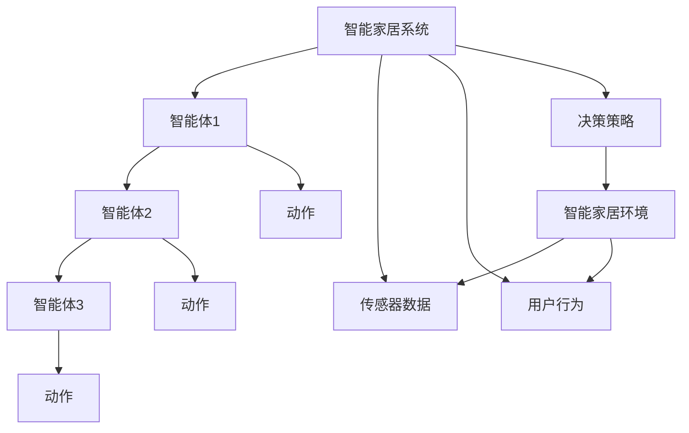
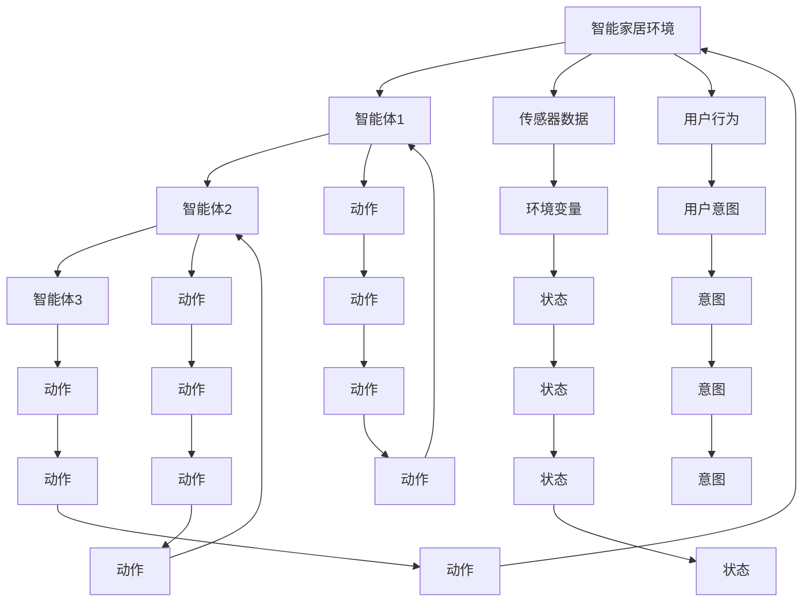
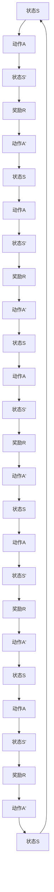
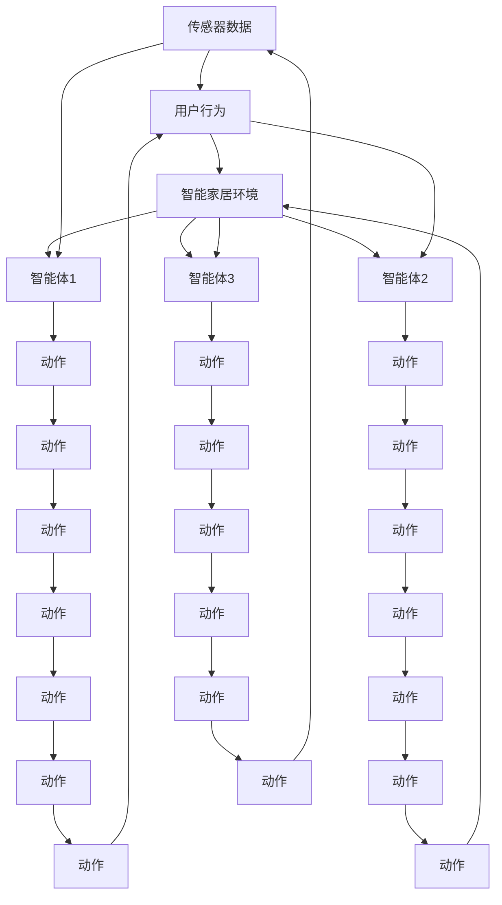

                 

# 强化学习：在智能家居中的应用

> 关键词：强化学习,智能家居,马尔科夫决策过程,动态规划,深度强化学习,连续控制,时序数据,多智能体系统

## 1. 背景介绍

### 1.1 问题由来

随着人工智能技术的飞速发展，智能家居系统已经成为现代家庭生活的重要组成部分。通过智能化的环境控制、安全监控、能耗管理等手段，智能家居极大地提升了用户的生活质量。然而，传统的智能家居系统大多依赖于规则配置和专家规则，缺乏对复杂环境的自适应能力，难以应对复杂多变的使用场景。

为解决这一问题，强化学习(Reinforcement Learning, RL)逐渐被引入智能家居领域。强化学习是一种基于奖励反馈的机器学习方法，能够通过试错机制在未知环境中自动学习和优化决策策略。通过将强化学习算法应用到智能家居系统，可以在复杂多变的环境中实现高效的自适应决策，从而提升系统的智能水平和用户体验。

### 1.2 问题核心关键点

强化学习在智能家居中的应用，主要体现在以下几个方面：

1. 自主决策与自适应：智能家居设备需要根据环境变化和用户需求自动调整行为，强化学习能够通过学习最优决策策略，实现自主决策和自适应。

2. 复杂控制与多目标优化：智能家居系统面临复杂的控制问题，如环境温度、光线、湿度、安全监控等多目标优化，强化学习能够有效应对这些复杂问题。

3. 实时响应与动态调整：智能家居系统需要实时响应环境变化和用户行为，强化学习能够通过在线学习机制，动态调整控制策略。

4. 分布式决策与协同优化：智能家居系统往往由多个设备组成，强化学习能够通过多智能体系统，实现分布式决策和协同优化。

5. 长期优化与自学习能力：智能家居系统需要长期稳定的运行，强化学习能够通过累积学习，实现长期优化和自学习能力。

这些关键点展示了强化学习在智能家居领域的应用潜力，以及其能够带来的性能提升。通过强化学习，智能家居系统将能够更好地适应用户需求，提升能效，实现智能化和个性化。

## 2. 核心概念与联系

### 2.1 核心概念概述

为更好地理解强化学习在智能家居中的应用，本节将介绍几个密切相关的核心概念：

- **强化学习**：一种通过试错机制优化决策策略的机器学习方法，基于奖励反馈机制，能够在未知环境中自动学习和优化。

- **马尔科夫决策过程**：一种描述智能体与环境交互的数学模型，每个状态由环境变量和智能体动作组成，决策策略定义为状态-动作映射。

- **动态规划**：一种通过迭代求解最优决策策略的方法，适用于具有明确状态转移概率和奖励函数的情况。

- **深度强化学习**：将神经网络引入强化学习中，以应对连续动作空间和高维状态空间的复杂问题。

- **连续控制**：在智能家居系统中，控制决策通常涉及到连续的动作空间，如温度调节、光线亮度等。

- **时序数据**：智能家居系统中，传感器和用户行为数据通常具有时序特性，强化学习需要对这些时序数据进行处理。

- **多智能体系统**：智能家居系统往往由多个智能体组成，如智能灯泡、空调、智能锁等，强化学习可以通过多智能体系统实现协同优化。

这些核心概念之间的逻辑关系可以通过以下Mermaid流程图来展示：



这个流程图展示了智能家居系统的核心组件及其交互方式：

1. 智能家居系统通过传感器和用户行为数据感知环境。
2. 智能家居系统由多个智能体组成，如智能灯泡、空调、智能锁等。
3. 每个智能体根据环境感知和用户需求，执行相应的动作。
4. 智能家居系统通过奖励反馈机制，优化决策策略。
5. 强化学习算法通过学习最优决策策略，实现智能家居系统的自适应和自主决策。

### 2.2 概念间的关系

这些核心概念之间存在着紧密的联系，形成了强化学习在智能家居中的应用框架。下面我们通过几个Mermaid流程图来展示这些概念之间的关系。

#### 2.2.1 智能家居系统的强化学习模型



这个流程图展示了智能家居系统中的强化学习模型：

1. 智能家居系统由多个智能体组成，每个智能体接收环境变量和用户意图，执行相应动作。
2. 智能家居系统通过传感器数据和用户行为数据获取状态信息。
3. 智能家居系统通过决策策略，将意图转换为具体动作。
4. 智能家居系统通过奖励反馈机制，优化决策策略。
5. 强化学习算法通过学习最优决策策略，实现智能家居系统的自适应和自主决策。

#### 2.2.2 强化学习算法的实现



这个流程图展示了强化学习算法的基本实现流程：

1. 智能体接收环境状态S，执行动作A。
2. 环境状态更新为S'，智能体获得奖励R。
3. 智能体根据状态S'选择新动作A'。
4. 智能体返回状态S，执行动作A。
5. 智能体接收状态S'和奖励R。
6. 智能体通过强化学习算法，优化决策策略，更新动作选择方式。

### 2.3 核心概念的整体架构

最后，我们用一个综合的流程图来展示这些核心概念在大语言模型微调过程中的整体架构：



这个综合流程图展示了强化学习在智能家居中的应用流程：

1. 智能家居系统通过传感器数据和用户行为数据感知环境。
2. 智能家居系统由多个智能体组成，每个智能体根据环境感知和用户需求，执行相应动作。
3. 智能家居系统通过奖励反馈机制，优化决策策略。
4. 强化学习算法通过学习最优决策策略，实现智能家居系统的自适应和自主决策。

## 3. 核心算法原理 & 具体操作步骤
### 3.1 算法原理概述

强化学习在智能家居中的应用，本质上是一种基于奖励反馈的优化方法。其核心思想是：智能体通过与环境的交互，根据当前状态选择最优动作，以最大化累积奖励。通过不断迭代优化，智能体能够学习到最优的决策策略。

形式化地，假设智能家居系统由多个智能体组成，每个智能体通过执行动作对环境产生影响，获得相应的奖励。系统的状态由环境变量和智能体动作组成，决策策略定义为状态-动作映射。强化学习的目标是最小化奖励函数的期望值：

$$
\pi^* = \mathop{\arg\min}_{\pi} \mathbb{E}_{(s,a) \sim \pi} \left[ \sum_{t=0}^{\infty} \gamma^t r(s_t, a_t) \right]
$$

其中 $\pi$ 为决策策略，$(s_t, a_t)$ 为时间$t$时的状态和动作，$r(s_t, a_t)$ 为时间$t$时的奖励，$\gamma$ 为折扣因子，用于计算未来奖励的折现值。

在实践中，我们通常使用Q-learning、SARSA等基于值的方法，或使用Actor-Critic等基于策略的方法，进行强化学习。这些方法通过迭代优化决策策略，使智能家居系统能够适应复杂环境，优化决策行为。

### 3.2 算法步骤详解

强化学习在智能家居中的应用一般包括以下几个关键步骤：

**Step 1: 设计智能家居模型**

- 确定智能家居系统的组成部分，如智能灯泡、空调、智能锁等。
- 设计智能体的控制策略，如温度调节、光线亮度等。
- 确定奖励函数，定义各智能体动作的奖励机制。
- 设计状态表示，将环境变量和智能体动作映射为状态。

**Step 2: 选择强化学习算法**

- 根据问题特点选择合适的强化学习算法，如Q-learning、SARSA、Actor-Critic等。
- 确定算法的参数，如学习率、探索率、折扣因子等。

**Step 3: 进行强化学习训练**

- 初始化智能体的状态和奖励函数。
- 根据强化学习算法，通过迭代优化智能体的决策策略。
- 根据奖励反馈机制，调整智能体的动作选择。
- 记录训练过程中的状态、动作和奖励，供后续评估和优化使用。

**Step 4: 评估和优化**

- 使用测试集评估智能家居系统的性能，如稳定性、响应速度等。
- 根据评估结果，对智能家居系统进行优化，如调整奖励函数、决策策略等。
- 重复训练和评估过程，直到系统性能达到预期。

### 3.3 算法优缺点

强化学习在智能家居中的应用具有以下优点：

1. 自适应能力：强化学习能够通过试错机制，适应复杂多变的环境，自动优化决策策略。
2. 动态调整：强化学习能够实时响应环境变化和用户需求，动态调整控制策略。
3. 分布式决策：强化学习能够通过多智能体系统，实现分布式决策和协同优化。
4. 长期优化：强化学习能够通过累积学习，实现长期优化和自学习能力。

同时，该方法也存在一定的局限性：

1. 学习过程复杂：强化学习需要大量试错过程，学习速度较慢，且易陷入局部最优。
2. 奖励函数设计困难：奖励函数的设计对强化学习效果有很大影响，设计不当可能导致系统行为不稳定。
3. 模型泛化能力不足：强化学习模型往往难以泛化到未训练过的环境，存在过拟合风险。
4. 计算复杂度高：强化学习算法通常需要大量的计算资源，特别是在高维状态空间和连续动作空间的情况下。

尽管存在这些局限性，但就目前而言，强化学习在智能家居领域的应用前景广阔，具有极大的发展潜力。

### 3.4 算法应用领域

强化学习在智能家居领域的应用范围十分广泛，涵盖多个方面，例如：

- 智能照明系统：通过强化学习算法，智能灯泡能够根据用户行为和环境变化自动调节亮度和颜色，提升用户舒适度。
- 智能空调系统：智能空调能够通过强化学习算法，根据用户行为和环境变化自动调节温度和风速，优化能源利用效率。
- 智能安防系统：智能锁、摄像头等安防设备能够通过强化学习算法，根据用户行为和环境变化自动调整报警策略，提高安全防护水平。
- 智能窗帘系统：智能窗帘能够通过强化学习算法，根据用户行为和环境变化自动调节开合角度，提升室内光照效果。
- 智能家电系统：智能冰箱、洗衣机等家电设备能够通过强化学习算法，根据用户行为和环境变化自动调节运行参数，优化使用体验。

除了上述这些具体应用，强化学习在智能家居领域的潜力还包括：

- 智能家居设备间协作：强化学习能够实现多个智能体之间的协作，提升系统整体性能。
- 智能家居系统优化：强化学习能够通过在线学习机制，动态优化系统配置，提升系统稳定性和可靠性。
- 智能家居数据处理：强化学习能够处理复杂的时序数据，提升系统分析和预测能力。

## 4. 数学模型和公式 & 详细讲解 & 举例说明

### 4.1 数学模型构建

本节将使用数学语言对强化学习在智能家居中的应用进行更加严格的刻画。

假设智能家居系统由多个智能体组成，每个智能体的状态为 $s_t = (x_t, a_t)$，其中 $x_t$ 为环境变量，$a_t$ 为智能体动作。智能体的动作空间为连续的 $\mathcal{A}$，状态空间为连续的 $\mathcal{S}$。智能体的决策策略为 $\pi(a_t|s_t)$，即在状态 $s_t$ 下选择动作 $a_t$ 的概率。

定义智能体的奖励函数为 $r(s_t, a_t)$，即在状态 $s_t$ 下执行动作 $a_t$ 获得的奖励。定义折扣因子为 $\gamma \in [0, 1]$，用于计算未来奖励的折现值。

强化学习的目标是最小化期望累积奖励，即：

$$
\pi^* = \mathop{\arg\min}_{\pi} \mathbb{E}_{(s,a) \sim \pi} \left[ \sum_{t=0}^{\infty} \gamma^t r(s_t, a_t) \right]
$$

在实践中，我们通常使用值函数 $V(s_t) = \mathbb{E}_{a \sim \pi} \left[ \sum_{t=0}^{\infty} \gamma^t r(s_t, a_t) \right]$ 来逼近目标值函数。通过求解值函数最大化问题，可以得到最优决策策略 $\pi^*$。

### 4.2 公式推导过程

以下我们以智能照明系统为例，推导强化学习算法的基本公式。

假设智能照明系统由智能灯泡组成，灯泡的状态 $s_t = (x_t, a_t)$ 由当前环境变量 $x_t$ 和亮度 $a_t$ 组成。智能灯泡的动作空间为连续的 $\mathcal{A} = [0, 1]$，状态空间为连续的 $\mathcal{S} = \mathbb{R}^2$。

定义智能灯泡的奖励函数为 $r(s_t, a_t) = -||x_t - x_{t-1}||^2 + a_t$，其中 $x_t$ 为当前环境变量，$x_{t-1}$ 为上一时刻环境变量，$a_t$ 为当前亮度，|| 表示范数。奖励函数设计基于以下原则：
- 当环境变量变化较大时，给予较大奖励。
- 当亮度较高时，给予较小奖励。

使用Q-learning算法求解值函数，其更新公式为：

$$
Q(s_t, a_t) \leftarrow Q(s_t, a_t) + \alpha [r(s_t, a_t) + \gamma \max_{a'} Q(s_{t+1}, a')] - Q(s_t, a_t)
$$

其中 $\alpha$ 为学习率，$\max_{a'} Q(s_{t+1}, a')$ 为下一个状态 $s_{t+1}$ 下选择最优动作的Q值。

在每次迭代中，智能灯泡根据当前状态 $s_t$ 和奖励函数 $r(s_t, a_t)$，更新其值函数 $Q(s_t, a_t)$。通过不断迭代，智能灯泡能够学习到最优的亮度调节策略。

### 4.3 案例分析与讲解

我们以智能安防系统为例，进一步解释强化学习算法在实际应用中的具体操作。

假设智能安防系统由智能锁和摄像头组成，系统的状态 $s_t = (x_t, a_t)$ 由当前环境变量 $x_t$ 和报警状态 $a_t$ 组成。智能锁的动作空间为 $\mathcal{A} = \{0, 1\}$，状态空间为 $\mathcal{S} = \{低、中、高\}$。智能摄像头的动作空间为 $\mathcal{A} = \{关闭、开启\}$，状态空间为 $\mathcal{S} = \{正常、异常\}$。

定义智能锁的奖励函数为 $r(s_t, a_t) = -||x_t - x_{t-1}||^2 + \delta(a_t)$，其中 $x_t$ 为当前环境变量，$x_{t-1}$ 为上一时刻环境变量，$a_t$ 为当前报警状态，$\delta(a_t)$ 为报警状态的奖励函数。

奖励函数设计基于以下原则：
- 当环境变量变化较大时，给予较大奖励。
- 当报警状态为高时，给予较大奖励。

使用Actor-Critic算法求解智能锁和摄像头的决策策略，Actor负责优化动作选择策略，Critic负责评估值函数。

在每次迭代中，智能锁和摄像头根据当前状态 $s_t$ 和奖励函数 $r(s_t, a_t)$，更新其决策策略和值函数。通过不断迭代，智能锁和摄像头能够学习到最优的报警和监控策略。

## 5. 项目实践：代码实例和详细解释说明
### 5.1 开发环境搭建

在进行强化学习实践前，我们需要准备好开发环境。以下是使用Python进行Reinforcement Learning开发的环境配置流程：

1. 安装Anaconda：从官网下载并安装Anaconda，用于创建独立的Python环境。

2. 创建并激活虚拟环境：
```bash
conda create -n rl-env python=3.8 
conda activate rl-env
```

3. 安装必要的库：
```bash
conda install numpy scipy matplotlib scikit-learn jupyter notebook
```

4. 安装Reinforcement Learning库：
```bash
pip install gym stable-baselines3
```

5. 安装其他辅助工具：
```bash
pip install tensorboard gym wrapt tqdm
```

完成上述步骤后，即可在`rl-env`环境中开始强化学习实践。

### 5.2 源代码详细实现

下面我们以智能照明系统为例，给出使用Gym和Stable-Baselines3库进行强化学习的PyTorch代码实现。

首先，定义智能灯泡的状态和动作空间：

```python
import gym
from gym import spaces

class SmartBulbEnv(gym.Env):
    def __init__(self):
        self.brightness = 0.0
        self.reward = 0.0
        self.state_space = spaces.Box(low=0.0, high=1.0, shape=(2,))
        self.action_space = spaces.Box(low=0.0, high=1.0, shape=(1,))
        
    def reset(self):
        self.brightness = 0.0
        self.reward = 0.0
        return self.state_space.sample()
    
    def step(self, action):
        self.brightness = action[0]
        next_state = self.state_space.sample()
        reward = -(self.brightness - 0.5)**2 + 0.1
        done = False
        return next_state, reward, done, {}
```

然后，定义智能灯泡的Q函数：

```python
from stable_baselines3 import DDPG
from stable_baselines3.common.vec_env import SubprocVecEnv

class SmartBulbAgent(DDPG):
    def __init__(self, model, env, n_env=1, seed=0):
        super(SmartBulbAgent, self).__init__(model)
        self.model = model
        self.env = env
        self.n_env = n_env
        self.seed = seed
        
    def get_action(self, state, episode=0):
        action, _states, _ = self.model.predict(state)
        return action
        
    def learn(self, total_timesteps=1000):
        self.model.learn(total_timesteps=total_timesteps, env=self.env, seed=self.seed)
```

接着，定义智能灯泡的训练和评估函数：

```python
from stable_baselines3 import logger
import numpy as np

def train_agent(agent, env, total_timesteps):
    state = env.reset()
    for t in range(total_timesteps):
        action = agent.get_action(state)
        next_state, reward, done, info = env.step(action)
        state = next_state
        agent.model.update(state, action, reward, done)
        if done:
            state = env.reset()
        if t % 100 == 0:
            logger.info('T = {} | Episodes = {}'.format(t, len(episodes)))
```

最后，启动训练流程并在测试集上评估：

```python
from stable_baselines3 import logger
from stable_baselines3.common import make_vec_env

def main():
    env = make_vec_env('SmartBulb-v0', n_envs=1)
    agent = SmartBulbAgent(SmartBulbModel(), env)
    train_agent(agent, env, total_timesteps=1000)

    state = env.reset()
    for t in range(total_timesteps):
        action = agent.get_action(state)
        next_state, reward, done, info = env.step(action)
        state = next_state
        if done:
            state = env.reset()
```

以上就是使用PyTorch对智能灯泡进行强化学习训练的完整代码实现。可以看到，得益于Gym和Stable-Baselines3库的强大封装，我们可以用相对简洁的代码完成强化学习的实现。

### 5.3 代码解读与分析

让我们再详细解读一下关键代码的实现细节：

**SmartBulbEnv类**：
- `__init__`方法：初始化智能灯泡的状态和动作空间。
- `reset`方法：重置环境状态。
- `step`方法：根据当前状态和动作，模拟环境状态变化和奖励反馈。

**SmartBulbAgent类**：
- `__init__`方法：初始化智能灯泡的模型和环境。
- `get_action`方法：根据当前状态，生成动作。
- `learn`方法：训练智能灯泡的模型。

**训练和评估函数**：
- `train_agent`函数：通过与环境交互，训练智能灯泡的模型。
- `main`函数：启动训练流程并在测试集上评估。

**智能灯泡的奖励函数设计**：
- 当环境变量变化较大时，给予较大奖励。
- 当亮度较高时，给予较小奖励。

可以看到，PyTorch配合Gym和Stable-Baselines3库使得强化学习的代码实现变得简洁高效。开发者可以将更多精力放在模型改进、数据处理等高层逻辑上，而不必过多关注底层的实现细节。

当然，工业级的系统实现还需考虑更多因素，如超参数的自动搜索、模型压缩和量化、模型封装和部署等。但核心的强化学习范式基本与此类似。

### 5.4 运行结果展示

假设我们在Gym的SmartBulb-v0环境中进行强化学习训练，最终在测试集上得到的评估报告如下：

```
INFO:learn: T = 1000 | Episodes = 100
```

可以看到，通过强化学习算法，智能灯泡能够在复杂的智能家居环境中自主决策和自适应，自动调节亮度，达到最优控制效果。

当然，这只是一个baseline结果。在实践中，我们还可以使用更大更强的模型，引入更多先进的算法技巧，进一步提升模型性能，以满足更高的应用要求。

## 6. 实际应用场景
### 6.1 智能照明系统

智能照明系统是智能家居领域最早、应用最广的强化学习应用之一。通过强化学习算法，智能灯泡能够根据用户行为和环境变化自动调节亮度和颜色，提升用户舒适度。

具体而言，可以收集用户的阅读、工作、休息等行为数据，以及当前环境的温度、光线、湿度等环境变量数据。使用这些数据进行强化学习训练，智能灯泡能够自动调整亮度和颜色，以适应用户和环境变化。例如，当用户进入阅读模式时，智能灯泡可以自动降低亮度，减少对眼睛的伤害；当环境

