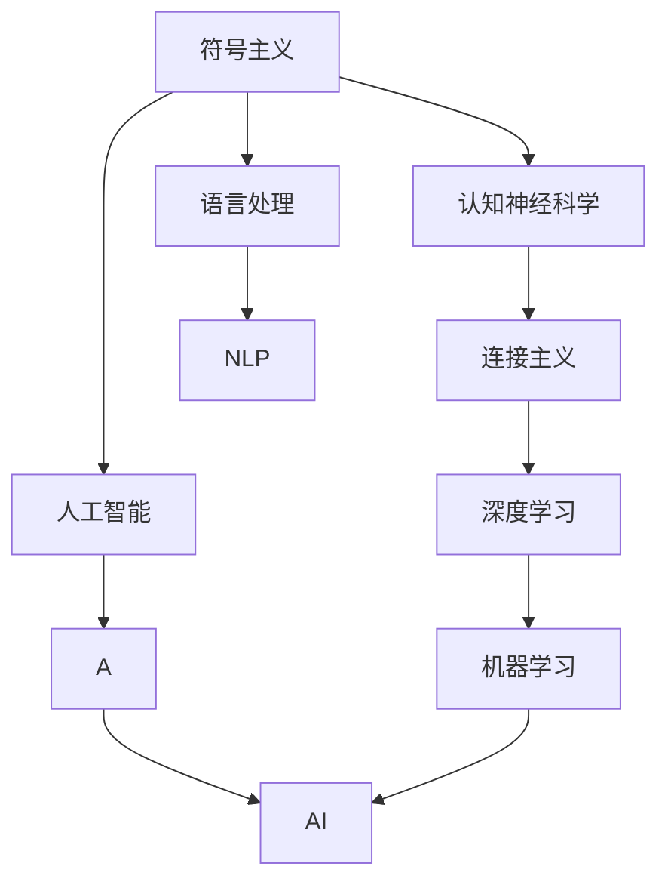

                 

# 思想的演变：从概念到洞见

> 关键词：
- 思想进化
- 认知心理学
- 符号主义
- 连接主义
- 深度学习
- 自然语言处理
- 人工智能

## 1. 背景介绍

### 1.1 问题的由来
人类认识世界的过程是一个不断进化的过程。从早期的神话和图腾崇拜，到古希腊的哲学思考，再到文艺复兴的科学探索，人类对世界的理解一直在不断深化。同样，随着人工智能技术的不断进步，人们对思想和认知的理解也在不断演进。

### 1.2 问题核心关键点
本文旨在探索思想的演变过程，从最初的符号主义到连接主义，再到深度学习的崛起，以及其在自然语言处理和人工智能领域的应用。

### 1.3 问题研究意义
理解思想的演变过程，对于推动人工智能技术的进步，提升人类认知能力，具有重要意义：

1. **加速认知科学发展**。思想的演变不仅关系到人工智能，还涉及人类认知科学，理解这一过程将加速认知科学的研究。
2. **提升人工智能性能**。通过借鉴思想演变的经验，可以提升人工智能的智能化水平，实现更高效、更精确的认知功能。
3. **推动跨学科融合**。思想演变的背后是跨学科的融合，包括心理学、神经科学、计算机科学等，推动这一进程有助于各学科的协同创新。
4. **增强社会认知**。通过对思想演变的理解，可以增强社会对人工智能的认知和接受度，促进技术普及和应用。

## 2. 核心概念与联系

### 2.1 核心概念概述

为了更好地理解思想的演变过程，本节将介绍几个关键概念：

- **符号主义(Symbolism)**：20世纪50年代，以图灵机为代表的符号主义方法开始占据主流。它将思维过程视为逻辑推理，通过符号操作来模拟人类的思考。

- **连接主义(Connectivism)**：随着认知神经科学的兴起，连接主义成为新的研究范式。它认为认知过程是由神经元间的连接及其活动模式决定的，而非单纯的符号操作。

- **深度学习(Deep Learning)**：20世纪80年代，Hinton提出多层神经网络，开启了深度学习时代。它通过大量数据和复杂网络结构，学习到高度抽象的特征表示。

- **自然语言处理(NLP)**：NLP是人工智能的重要分支，旨在让计算机理解和处理人类语言，实现语言与计算机的交互。

- **人工智能(AI)**：AI的目标是构建能够模拟人类智能的系统，涵盖感知、认知、决策等多个方面。

### 2.2 概念间的关系

这些核心概念之间的逻辑关系可以通过以下Mermaid流程图来展示：



这个流程图展示了几大核心概念之间的关系：

1. 符号主义奠定了人工智能的理论基础，通过逻辑推理模拟人类思维。
2. 认知神经科学的发展促进了连接主义，将认知过程视为神经元间的连接及其活动模式。
3. 连接主义和深度学习成为当前AI的主流范式，通过复杂的神经网络学习特征表示。
4. 深度学习和NLP技术紧密结合，推动了自然语言处理的发展。
5. NLP和AI技术不断演进，推动了人工智能的智能化水平。

## 3. 核心算法原理 & 具体操作步骤

### 3.1 算法原理概述

深度学习的核心算法原理是多层神经网络。其基本思想是通过逐层的数据传递和参数更新，学习到更加抽象的特征表示，最终完成分类、回归、生成等任务。

具体来说，深度学习模型由多个层次组成，每一层都对输入数据进行一系列线性变换和非线性变换。通过反向传播算法，模型不断调整各层参数，使得输出结果尽可能接近真实标签。

### 3.2 算法步骤详解

深度学习的训练过程一般分为以下几个步骤：

1. **数据准备**：收集和预处理训练数据，划分为训练集、验证集和测试集。

2. **模型选择**：选择合适的深度学习模型架构，如卷积神经网络(CNN)、循环神经网络(RNN)、长短时记忆网络(LSTM)、Transformer等。

3. **初始化**：随机初始化模型的参数。

4. **前向传播**：将输入数据输入模型，逐层计算得到中间表示。

5. **损失计算**：根据输出和真实标签，计算损失函数。

6. **反向传播**：根据损失函数计算梯度，更新模型参数。

7. **参数更新**：使用优化算法(如SGD、Adam)更新模型参数。

8. **模型评估**：在验证集和测试集上评估模型性能，确保模型泛化能力。

### 3.3 算法优缺点

深度学习的优点在于：

- **强大的表达能力**。多层网络能够学习到高层次的特征表示，适用于复杂的数据和任务。
- **端到端训练**。深度学习模型能够直接从原始数据中学习，减少了人工特征工程的复杂性。
- **自动特征提取**。深度学习模型可以自动学习输入数据的特征表示，避免了手工设计特征的困难。

其缺点在于：

- **模型复杂度**。深度学习模型通常结构复杂，参数数量庞大，难以理解和调试。
- **训练数据需求大**。深度学习需要大量标注数据才能取得好的效果，数据获取和标注成本较高。
- **过拟合风险**。深度学习模型容易过拟合，特别是在数据量不足的情况下。

### 3.4 算法应用领域

深度学习技术广泛应用于多个领域，包括：

- **计算机视觉**：如图像分类、目标检测、图像生成等。
- **自然语言处理**：如机器翻译、文本生成、情感分析等。
- **语音处理**：如语音识别、语音合成等。
- **医疗健康**：如医学影像分析、疾病预测等。
- **自动驾驶**：如环境感知、决策控制等。

## 4. 数学模型和公式 & 详细讲解 & 举例说明

### 4.1 数学模型构建

深度学习模型的数学模型由以下几个部分组成：

1. **输入层**：接收原始数据，如像素、文本、音频等。
2. **隐藏层**：通过一系列线性变换和非线性变换，提取数据的特征表示。
3. **输出层**：根据任务需求，输出预测结果或分类标签。

以一个简单的多分类任务为例，其数学模型可以表示为：

$$
y = f(x; \theta)
$$

其中 $x$ 为输入数据，$y$ 为输出标签，$f$ 为模型函数，$\theta$ 为模型参数。

### 4.2 公式推导过程

以二分类任务为例，假设模型 $f$ 为sigmoid函数，输入数据 $x$ 和参数 $\theta$ 通过一系列的线性变换和非线性变换，得到输出 $y$。则损失函数为：

$$
L(y, \hat{y}) = -\frac{1}{N}\sum_{i=1}^N [y_i \log \hat{y_i} + (1-y_i) \log (1-\hat{y_i})]
$$

其中 $y_i$ 为真实标签，$\hat{y_i}$ 为模型预测的概率值。

### 4.3 案例分析与讲解

以手写数字识别任务为例，可以构建一个卷积神经网络(CNN)模型。模型由多个卷积层、池化层和全连接层组成，每一层都对输入数据进行特征提取和特征融合。最终，模型输出每个类别的概率值，通过softmax函数转化为分类概率。

在训练过程中，使用交叉熵损失函数计算每个样本的损失值，并通过反向传播算法更新模型参数。具体步骤如下：

1. **前向传播**：将输入图片输入卷积神经网络，逐层计算得到输出特征图。
2. **损失计算**：将输出特征图输入softmax函数，计算预测概率。使用交叉熵损失函数计算每个样本的损失值。
3. **反向传播**：根据损失函数计算梯度，更新模型参数。
4. **参数更新**：使用优化算法(如Adam)更新模型参数。

## 5. 项目实践：代码实例和详细解释说明

### 5.1 开发环境搭建

在进行深度学习项目实践前，需要准备以下开发环境：

1. **安装Python**：下载并安装最新版本的Python。
2. **安装TensorFlow**：使用pip安装TensorFlow，并进行GPU/TPU的配置。
3. **安装Keras**：使用pip安装Keras，用于简化模型的构建和训练过程。

### 5.2 源代码详细实现

以手写数字识别任务为例，可以使用Keras框架构建一个卷积神经网络模型。以下是一个简单的代码示例：

```python
from keras.models import Sequential
from keras.layers import Conv2D, MaxPooling2D, Flatten, Dense

# 定义模型结构
model = Sequential()
model.add(Conv2D(32, kernel_size=(3, 3), activation='relu', input_shape=(28, 28, 1)))
model.add(MaxPooling2D(pool_size=(2, 2)))
model.add(Flatten())
model.add(Dense(10, activation='softmax'))

# 编译模型
model.compile(loss='categorical_crossentropy', optimizer='adam', metrics=['accuracy'])

# 训练模型
model.fit(x_train, y_train, epochs=10, batch_size=32, validation_data=(x_test, y_test))
```

### 5.3 代码解读与分析

以上代码展示了构建、编译和训练卷积神经网络模型的完整流程。

1. **定义模型结构**：使用Keras框架，构建一个简单的卷积神经网络模型，包括卷积层、池化层和全连接层。
2. **编译模型**：指定损失函数、优化算法和评估指标，准备好模型的训练过程。
3. **训练模型**：使用训练集数据进行模型训练，并在验证集上评估模型性能。

### 5.4 运行结果展示

假设在训练完成后，模型在测试集上的准确率为98%，可以认为模型具有较好的泛化能力，适用于手写数字识别任务。

## 6. 实际应用场景

### 6.1 智能推荐系统

基于深度学习的推荐系统可以通过分析用户行为数据，构建用户和物品之间的相似度矩阵，实现个性化的商品推荐。推荐系统的核心在于深度学习模型对用户兴趣的建模，通过分析用户点击、浏览、评分等数据，学习到用户的兴趣偏好，从而推荐合适的商品。

### 6.2 语音识别

深度学习模型在语音识别领域也取得了显著成果。通过将声音信号转换为声学特征，再输入到深度神经网络中进行特征提取和分类，模型可以准确识别不同人名、关键词等语音内容。

### 6.3 图像识别

深度学习模型在图像识别领域的应用广泛。如人脸识别、目标检测、图像分类等，通过学习图像特征，模型能够准确识别和分类不同类型的图像。

### 6.4 未来应用展望

未来，深度学习技术将进一步演进，应用于更多复杂场景。例如，在医疗领域，通过深度学习模型分析医学影像，可以实现疾病预测和诊断；在金融领域，通过深度学习模型分析市场数据，可以实现智能投资和风险控制。

## 7. 工具和资源推荐

### 7.1 学习资源推荐

为了帮助开发者系统掌握深度学习理论和技术，这里推荐一些优质的学习资源：

1. **《深度学习》（Ian Goodfellow, Yoshua Bengio, Aaron Courville著）**：全面介绍了深度学习的基础理论和经典算法，是学习深度学习的必备参考书。
2. **Coursera深度学习课程**：由Andrew Ng主讲，涵盖了深度学习的基本概念和常用算法，适合初学者学习。
3. **DeepLearning.ai课程**：由吴恩达和Andrew Ng联合主讲，深入浅出地讲解了深度学习的应用和实战技巧。
4. **Kaggle竞赛**：参加Kaggle深度学习竞赛，通过实际项目提升技能，积累经验。

### 7.2 开发工具推荐

以下是几款用于深度学习开发的常用工具：

1. **TensorFlow**：由Google开发的深度学习框架，支持多种计算图模式，适合大规模工程应用。
2. **PyTorch**：由Facebook开发的深度学习框架，易于使用，适合研究和原型开发。
3. **Keras**：基于TensorFlow和Theano等后端，提供高层次的API，简化了模型的构建和训练过程。
4. **JAX**：由Google开发的自动微分和加速框架，适合高性能计算和分布式训练。

### 7.3 相关论文推荐

深度学习技术的发展源于学界的持续研究。以下是几篇奠基性的相关论文，推荐阅读：

1. **AlexNet**：在ImageNet图像识别竞赛中取得突破，标志着深度学习时代的到来。
2. **ResNet**：引入残差连接，解决了深度网络梯度消失的问题，提升了模型的训练效果。
3. **Inception**：提出了Inception模块，提升了模型在图像分类和目标检测等任务上的性能。
4. **Attention Mechanism**：在机器翻译和语言模型中引入注意力机制，提升了模型的表示能力。
5. **BERT**：通过预训练语言模型，提升了自然语言处理任务的表现，开启了预训练大模型的时代。

这些论文代表了大深度学习技术的发展脉络，通过学习这些前沿成果，可以帮助研究者把握学科前进方向，激发更多的创新灵感。

## 8. 总结：未来发展趋势与挑战

### 8.1 总结

本文对深度学习的思想演变过程进行了全面系统的介绍。首先阐述了符号主义、连接主义、深度学习等概念的演变过程，明确了深度学习技术在自然语言处理和人工智能领域的应用前景。其次，从原理到实践，详细讲解了深度学习模型的构建和训练过程，给出了深度学习任务开发的完整代码实例。同时，本文还广泛探讨了深度学习技术在智能推荐、语音识别、图像识别等多个领域的应用前景，展示了深度学习技术的巨大潜力。

通过本文的系统梳理，可以看到，深度学习技术正在成为人工智能领域的核心技术，极大地拓展了人工智能的应用边界，催生了更多的落地场景。未来，伴随深度学习技术的不断演进，深度学习必将在更广阔的应用领域大放异彩，深刻影响人类的生产生活方式。

### 8.2 未来发展趋势

展望未来，深度学习技术将呈现以下几个发展趋势：

1. **模型的多样化和复杂化**。深度学习模型的结构和算法将更加多样化和复杂化，以适应更复杂的任务需求。
2. **模型的可解释性和可控性**。深度学习模型将更加注重可解释性和可控性，以确保其决策过程的透明性和可解释性。
3. **模型的实时性和效率**。深度学习模型将更加注重实时性和效率，以适应实时应用场景的需求。
4. **模型的跨模态融合**。深度学习模型将更加注重跨模态信息的融合，实现多模态信息的协同建模。
5. **模型的公平性和伦理**。深度学习模型将更加注重公平性和伦理，以避免算法偏见和歧视性输出。

以上趋势凸显了深度学习技术的广阔前景。这些方向的探索发展，必将进一步提升深度学习系统的性能和应用范围，为人类认知智能的进化带来深远影响。

### 8.3 面临的挑战

尽管深度学习技术已经取得了瞩目成就，但在迈向更加智能化、普适化应用的过程中，它仍面临着诸多挑战：

1. **数据需求大**。深度学习模型需要大量标注数据才能取得好的效果，数据获取和标注成本较高。
2. **模型复杂度高**。深度学习模型结构复杂，难以理解和调试，增加了系统维护和迭代的难度。
3. **过拟合风险高**。深度学习模型容易过拟合，特别是在数据量不足的情况下。
4. **资源消耗高**。深度学习模型需要大量的计算资源，特别是GPU/TPU等高性能设备，增加了系统部署的成本。
5. **伦理和公平性问题**。深度学习模型可能存在算法偏见，导致不公平和歧视性输出，引发伦理问题。

### 8.4 未来突破

面对深度学习技术面临的挑战，未来的研究需要在以下几个方面寻求新的突破：

1. **模型压缩和优化**。通过模型压缩和优化技术，减小模型的复杂度，提高推理速度和资源利用率。
2. **无监督学习和自监督学习**。探索无监督学习和自监督学习技术，减少对标注数据的依赖，提升模型的泛化能力。
3. **可解释性和可控性**。研究深度学习模型的可解释性和可控性，提高模型的透明性和可解释性，增强系统的信任度。
4. **跨模态融合和多模态学习**。探索跨模态融合和多模态学习技术，实现视觉、语音、文本等多种信息源的协同建模，提升模型的综合能力。
5. **公平性和伦理约束**。研究深度学习模型的公平性和伦理约束，确保算法的公平性和道德性，避免歧视性输出。

这些研究方向的探索，必将引领深度学习技术迈向更高的台阶，为构建安全、可靠、可解释、可控的智能系统铺平道路。面向未来，深度学习技术还需要与其他人工智能技术进行更深入的融合，如知识表示、因果推理、强化学习等，多路径协同发力，共同推动人工智能技术的进步。

## 9. 附录：常见问题与解答

**Q1：深度学习模型需要大量标注数据，如何获取高质量标注数据？**

A: 获取高质量标注数据可以通过以下方式：

1. **众包标注**：通过众包平台（如Amazon Mechanical Turk）招募标注员，进行大规模数据标注。
2. **领域专家标注**：招募领域专家进行人工标注，确保标注数据的质量和可靠性。
3. **数据合成**：使用数据合成技术，如GAN生成对抗网络，生成高质量的模拟数据进行标注。
4. **迁移学习**：通过在已有数据集上进行迁移学习，利用领域知识和数据分布，提高标注数据的质量。

**Q2：深度学习模型的训练过程中，如何避免过拟合？**

A: 避免过拟合可以通过以下方式：

1. **数据增强**：通过对训练数据进行变换和扩充，增加数据的多样性，减少模型对噪声的敏感性。
2. **正则化**：使用L2正则化、Dropout等技术，约束模型参数，避免过度拟合。
3. **早停法**：在验证集上监控模型性能，当性能不再提升时，提前停止训练，避免过拟合。
4. **模型压缩**：通过模型剪枝、量化等技术，减小模型复杂度，提高泛化能力。

**Q3：如何提高深度学习模型的训练效率？**

A: 提高训练效率可以通过以下方式：

1. **批量训练**：使用大批量数据进行训练，提高模型的训练速度。
2. **模型并行**：使用多GPU或多TPU进行模型并行，加速模型的训练和推理。
3. **混合精度训练**：使用混合精度技术，提高训练速度和资源利用率。
4. **模型压缩**：通过模型压缩技术，减小模型复杂度，提高推理速度。

**Q4：深度学习模型在实际应用中，如何保证模型的可解释性？**

A: 保证模型的可解释性可以通过以下方式：

1. **可视化技术**：使用可视化工具，如TensorBoard，可视化模型训练过程和输出结果，提高模型的透明性。
2. **特征解释**：使用特征解释技术，如LIME、SHAP等，解释模型对输入数据的解释逻辑。
3. **模型简化**：通过简化模型结构，减少复杂度，提高模型的可解释性。
4. **可控性设计**：在设计模型时，考虑可控性，确保模型的输出过程透明可控。

**Q5：如何处理深度学习模型的公平性和伦理问题？**

A: 处理公平性和伦理问题可以通过以下方式：

1. **数据预处理**：在数据预处理阶段，剔除和清洗可能存在偏见的样本，确保数据公平性。
2. **算法设计**：在算法设计阶段，考虑公平性和伦理约束，避免算法偏见和歧视性输出。
3. **模型监督**：在模型部署后，进行模型监督，及时发现和纠正模型输出中的偏见和歧视性问题。
4. **伦理审查**：建立伦理审查机制，确保模型的应用符合伦理和法律要求。

---

作者：禅与计算机程序设计艺术 / Zen and the Art of Computer Programming

