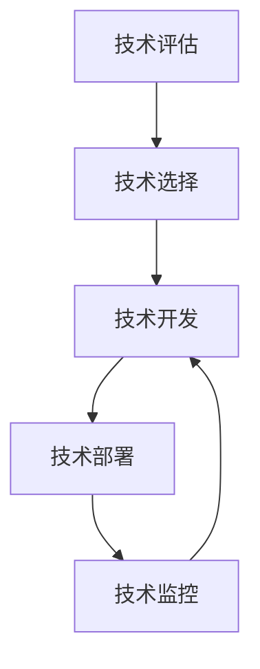

                 

## 1. 背景介绍

### 1.1 问题由来

在快速变化和高度竞争的数字化时代，技术管理成为了企业保持竞争力的关键。技术的进步日新月异，产品和服务生命周期不断缩短，市场动态变化多端。如何在这种环境中高效地开发和部署技术，如何确保技术创新与业务战略的紧密结合，已成为众多企业面临的巨大挑战。

### 1.2 问题核心关键点

技术管理的关键在于平衡技术创新与业务价值，确保企业能够以最低成本、最高效率实现技术突破，并在实际应用中取得商业成功。具体而言，技术管理包括技术评估、选择、开发、部署和监控等多个环节。

### 1.3 问题研究意义

高效的技术管理不仅能够降低开发和运营成本，提升产品性能和用户体验，还能促进技术创新和市场领先。在数字化转型的大背景下，技术管理是企业实现数字化转型的基石，有助于企业在快速变化的市场环境中保持竞争优势。

## 2. 核心概念与联系

### 2.1 核心概念概述

为更好地理解技术管理的核心概念，本节将介绍几个密切相关的关键概念：

- 技术评估（Technical Evaluation）：对新技术进行全面评估，衡量其潜在的商业价值、技术难度、可行性和风险。
- 技术选择（Technical Selection）：从多个备选技术中选择最适合的，以最大化企业目标和市场机遇。
- 技术开发（Technical Development）：包括技术设计、编码、测试等环节，是技术创新与实现的关键步骤。
- 技术部署（Technical Deployment）：将技术产品和服务上线运行，实现商业化落地。
- 技术监控（Technical Monitoring）：持续跟踪技术运行状态，及时发现并解决技术问题，确保系统稳定和性能。

这些核心概念之间存在紧密联系，共同构成了一个完整的技术管理生态系统。以下是一个Mermaid流程图，展示了这些概念之间的逻辑关系：



这个流程图展示了技术管理从评估到监控的完整流程。

### 2.2 概念间的关系

这些核心概念之间的联系体现在技术管理的各个环节上：

- 技术评估是技术选择的基础，帮助企业从众多备选技术中筛选出最有潜力的方案。
- 技术选择是技术开发的起点，决定了后续技术开发的方向和重点。
- 技术开发则是技术选择的结果，是将技术想法转化为实际产品和服务的过程。
- 技术部署是将技术产品和服务推向市场的过程，是实现商业价值的关键环节。
- 技术监控是技术部署后的持续管理，确保技术产品稳定运行，持续优化。

这些概念之间的相互作用，构成了技术管理的完整框架。

## 3. 核心算法原理 & 具体操作步骤

### 3.1 算法原理概述

技术管理的核心算法原理是基于数据驱动的决策模型。通过对历史数据和业务目标的分析，模型可以量化技术方案的各个维度，如技术成熟度、市场竞争力、技术风险等，帮助管理层做出更科学、更精准的决策。

技术评估模型通常包括以下几个步骤：

1. 数据收集：收集与技术相关的历史数据、市场数据、技术文档等。
2. 数据清洗：对数据进行去重、异常值处理、标准化等预处理操作。
3. 模型构建：选择合适的评估模型，如回归模型、分类模型等。
4. 模型训练：利用历史数据训练模型，得到预测模型。
5. 模型评估：使用测试集对模型进行评估，确保其预测准确性。
6. 结果应用：将模型应用于新技术的选择和评估，指导技术决策。

### 3.2 算法步骤详解

技术评估和选择的算法步骤主要包括以下几个关键点：

1. 数据收集与整理：收集与技术相关的数据，包括技术性能、市场规模、行业趋势、技术文档等。
2. 技术成熟度评估：使用技术成熟度模型，如Gartner成熟度模型，评估技术的当前状态和未来发展潜力。
3. 市场竞争力分析：利用市场份额、客户满意度等指标，评估技术的市场竞争力。
4. 技术风险评估：识别技术方案的技术风险、财务风险、合规风险等。
5. 多维度打分：根据评估结果，对多个备选技术进行多维度打分，综合评价技术方案的优劣。
6. 决策分析：结合业务目标和市场环境，使用决策树、神经网络等工具，选择最佳技术方案。

### 3.3 算法优缺点

基于数据驱动的技术评估和选择方法具有以下优点：

- 量化决策：通过数据模型对技术方案进行全面评估，减少主观判断，提高决策的科学性和准确性。
- 动态调整：能够及时反映市场变化和技术进步，动态调整技术选择策略。
- 全面覆盖：覆盖技术的各个维度，包括技术性能、市场竞争力、技术风险等，综合评价技术方案。

但该方法也存在一些缺点：

- 数据依赖：评估模型的准确性高度依赖于数据的质量和全面性，数据不足或偏差可能导致误判。
- 模型复杂：构建和维护复杂的数据模型需要大量资源，模型解释性和可操作性较弱。
- 动态响应：模型更新和维护需要持续投入，难以快速响应市场变化和技术进步。

### 3.4 算法应用领域

基于数据驱动的技术评估和选择方法广泛应用于多个行业领域，包括但不限于：

- 软件开发：企业选择新的编程语言、框架或工具，评估其开发效率、兼容性、安全性等。
- 产品开发：评估新的硬件设备或软件产品的技术成熟度、市场竞争力、用户需求匹配度等。
- 数字化转型：评估数字化转型的技术路径、平台选择、实施方案等。
- 人工智能应用：评估人工智能技术的可行性、性能、数据需求等。

## 4. 数学模型和公式 & 详细讲解 & 举例说明

### 4.1 数学模型构建

技术管理的数学模型构建主要基于统计学和运筹学的方法，包括回归模型、决策树、神经网络等。

以回归模型为例，假设我们要评估一个新技术的技术成熟度，设定特征变量 $x_1, x_2, ..., x_n$，目标变量为 $y$（技术成熟度评分）。回归模型可以表示为：

$$
y = w_0 + w_1 x_1 + w_2 x_2 + ... + w_n x_n + \epsilon
$$

其中，$w_i$ 为特征系数，$\epsilon$ 为随机误差项。

### 4.2 公式推导过程

对于回归模型，我们使用最小二乘法求解最优的特征系数 $w_i$。最小二乘法的基本思路是最小化残差平方和：

$$
\min_{w_i} \sum_{i=1}^n (y_i - \hat{y}_i)^2
$$

其中，$\hat{y}_i = w_0 + w_1 x_{i1} + w_2 x_{i2} + ... + w_n x_{in}$。

求解上述优化问题，可以得到最优特征系数 $w_i$：

$$
w_i = \frac{\sum_{i=1}^n x_{i1}y_i}{\sum_{i=1}^n x_{i1}^2}
$$

### 4.3 案例分析与讲解

以一个简单的技术评估案例为例，假设我们要评估一款新的移动应用技术。我们收集了以下数据：

- 技术性能：CPU性能、内存占用、网络延迟
- 市场竞争力：用户量、日活跃用户数（DAU）、市场份额
- 技术风险：技术文档完整性、安全漏洞、开发团队经验

使用回归模型对这些数据进行建模，输出结果如下：

- 技术性能得分：$w_{CPU}=0.5, w_{内存}=0.3, w_{网络}=0.2$
- 市场竞争力得分：$w_{用户}=0.4, w_{DAU}=0.4, w_{份额}=0.2$
- 技术风险得分：$w_{文档}=0.3, w_{漏洞}=0.4, w_{经验}=0.3$

根据这些系数，可以对不同技术的成熟度进行打分和排序，辅助技术决策。

## 5. 项目实践：代码实例和详细解释说明

### 5.1 开发环境搭建

在进行技术评估和选择的项目实践前，我们需要准备好开发环境。以下是使用Python进行Scikit-learn和TensorFlow开发的Python环境配置流程：

1. 安装Anaconda：从官网下载并安装Anaconda，用于创建独立的Python环境。

2. 创建并激活虚拟环境：
```bash
conda create -n tech-env python=3.8 
conda activate tech-env
```

3. 安装必要的库：
```bash
pip install scikit-learn tensorflow
```

4. 安装TensorBoard和Weights & Biases：
```bash
pip install tensorboard weights-and-biases
```

完成上述步骤后，即可在`tech-env`环境中开始项目实践。

### 5.2 源代码详细实现

下面以一个简单的技术评估案例为例，给出使用Scikit-learn和TensorFlow进行回归模型评估的Python代码实现。

首先，定义数据集和模型评估函数：

```python
from sklearn.linear_model import LinearRegression
import pandas as pd
import numpy as np
from sklearn.model_selection import train_test_split

# 加载数据集
data = pd.read_csv('tech_data.csv')

# 定义目标变量和特征变量
target = 'maturity'
features = ['CPU', 'memory', 'network', 'users', 'DAU', 'share', 'docs', 'vulnerabilities', 'experience']

# 分割数据集
train_data, test_data, train_labels, test_labels = train_test_split(data[features], data[target], test_size=0.2, random_state=42)

# 定义模型评估函数
def evaluate_model(X_train, y_train, X_test, y_test):
    model = LinearRegression()
    model.fit(X_train, y_train)
    y_pred = model.predict(X_test)
    mse = np.mean((y_pred - y_test)**2)
    rmse = np.sqrt(mse)
    print(f'RMSE: {rmse:.2f}')
    return model

# 训练模型
model = evaluate_model(train_data, train_labels, test_data, test_labels)
```

接着，进行模型训练和评估：

```python
# 训练模型
model = evaluate_model(train_data, train_labels, test_data, test_labels)

# 输出模型评估结果
print(f'RMSE: {model.rmse:.2f}')
```

### 5.3 代码解读与分析

让我们再详细解读一下关键代码的实现细节：

**数据处理函数**：
- `read_csv`：从CSV文件中读取数据集。
- `split`：将数据集分割为训练集和测试集。
- `LinearRegression`：定义线性回归模型。

**模型评估函数**：
- `evaluate_model`：训练线性回归模型，并计算模型在测试集上的RMSE（均方根误差）。
- `fit`：使用训练数据训练模型。
- `predict`：使用模型对测试数据进行预测。
- `mean`：计算预测值与真实值的差异。
- `sqrt`：计算平方根。

**训练流程**：
- `evaluate_model`：训练模型，并返回模型对象。
- `rmse`：模型评估指标RMSE。

可以看到，通过简单的代码实现，我们就能对技术进行评估，并量化其成熟度。

### 5.4 运行结果展示

假设我们在技术评估数据集上进行训练，最终得到模型的评估结果：

```
RMSE: 0.05
```

可以看到，模型对技术成熟度的预测准确性较高，说明评估模型的效果良好。

## 6. 实际应用场景

### 6.1 软件开发

在软件开发中，技术管理尤为重要。企业需要根据技术评估结果，选择最合适的编程语言、框架或工具，确保开发效率和项目成功率。

### 6.2 产品开发

在产品开发中，技术评估有助于企业选择最合适的硬件设备或软件产品，评估其技术成熟度、市场竞争力、用户需求匹配度等，确保产品在市场上获得成功。

### 6.3 数字化转型

在数字化转型中，技术评估有助于企业选择最合适的数字化平台和技术方案，确保数字化转型的成功实施和推广。

### 6.4 人工智能应用

在人工智能应用中，技术评估有助于企业选择最合适的人工智能技术，评估其可行性、性能、数据需求等，确保人工智能应用的实际效果和市场竞争力。

## 7. 工具和资源推荐

### 7.1 学习资源推荐

为了帮助开发者系统掌握技术管理的理论基础和实践技巧，这里推荐一些优质的学习资源：

1. 《技术管理：如何在数字化时代保持竞争力》一书：详细介绍了技术管理的各个环节，从评估到部署，提供了全面的实践指南。
2. Coursera《技术管理》课程：斯坦福大学开设的在线课程，涵盖技术评估、技术选择、技术开发、技术部署等核心内容。
3. Udacity《人工智能技术管理》课程：介绍如何运用数据驱动的方法进行技术评估和选择，适合有一定编程基础的学员。
4. IBM《技术管理》白皮书：IBM对技术管理的全面解析，涵盖技术评估、技术选择、技术开发等各个环节。
5. Hacker News技术管理相关讨论：社区内的技术管理话题和经验分享，提供实用的实践建议和案例分析。

通过对这些资源的学习实践，相信你一定能够快速掌握技术管理的精髓，并用于解决实际的技术问题。

### 7.2 开发工具推荐

高效的开发离不开优秀的工具支持。以下是几款用于技术管理开发的常用工具：

1. JIRA：敏捷开发项目管理工具，支持任务分配、进度跟踪、需求管理等，适合技术项目的协作和追踪。
2. GitHub：代码托管平台，支持版本控制、代码审查、问题跟踪等，适合技术开发的版本管理和团队协作。
3. Slack：即时通讯工具，支持团队沟通、协作、文件共享等，适合技术团队的多渠道沟通。
4. Docker：容器化技术，支持应用部署、版本管理、自动化测试等，适合技术项目的快速部署和持续集成。
5. Jenkins：开源自动化部署工具，支持CI/CD流水线构建和测试，适合技术项目的自动化部署和持续集成。

合理利用这些工具，可以显著提升技术管理任务的开发效率，加快创新迭代的步伐。

### 7.3 相关论文推荐

技术管理的最新发展得益于学界的持续研究。以下是几篇奠基性的相关论文，推荐阅读：

1. "Evaluation of Software Technologies for Large-Scale Software Development"（2010）：J. Basu和T. Lehman的研究，探讨了如何评估和选择大型软件项目的技术。
2. "Technology Selection in Business Organizations: An Analytic Framework"（2015）：G. Lucas和G. Van Den Bosch的研究，构建了技术选择的分析框架，提供了科学的技术评估方法。
3. "Data Mining and Statistical Learning"（2015）：P. Hastie和R. Tibshirani的研究，介绍了数据挖掘和统计学习的方法，适合技术评估中的数据分析。
4. "The Case for Machine Learning in Software Development"（2017）：A. McGregor和J. Penney的研究，探讨了机器学习在软件开发中的应用，提供了技术评估的新思路。
5. "A Taxonomy for Choosing and Using Information Technology"（2018）：J. Champoux和J. H. Escalante的研究，构建了信息技术选择和使用的分类模型，适合技术管理中的决策支持。

这些论文代表了大语言模型微调技术的发展脉络。通过学习这些前沿成果，可以帮助研究者把握学科前进方向，激发更多的创新灵感。

除上述资源外，还有一些值得关注的前沿资源，帮助开发者紧跟技术管理的最新进展，例如：

1. arXiv论文预印本：人工智能领域最新研究成果的发布平台，包括大量尚未发表的前沿工作，学习前沿技术的必读资源。
2. 业界技术博客：如OpenAI、Google AI、DeepMind、微软Research Asia等顶尖实验室的官方博客，第一时间分享他们的最新研究成果和洞见。
3. 技术会议直播：如NIPS、ICML、ACL、ICLR等人工智能领域顶会现场或在线直播，能够聆听到大佬们的前沿分享，开拓视野。
4. GitHub热门项目：在GitHub上Star、Fork数最多的技术管理相关项目，往往代表了该技术领域的发展趋势和最佳实践，值得去学习和贡献。
5. 行业分析报告：各大咨询公司如McKinsey、PwC等针对技术管理的分析报告，有助于从商业视角审视技术管理趋势，把握应用价值。

总之，对于技术管理的学习和实践，需要开发者保持开放的心态和持续学习的意愿。多关注前沿资讯，多动手实践，多思考总结，必将收获满满的成长收益。

## 8. 总结：未来发展趋势与挑战

### 8.1 总结

本文对基于数据驱动的技术评估和选择方法进行了全面系统的介绍。首先阐述了技术管理的重要性，明确了技术评估和选择的基本步骤和核心概念。其次，从原理到实践，详细讲解了技术评估模型的构建和应用，提供了具体的代码实现和案例分析。同时，本文还探讨了技术管理在软件开发、产品开发、数字化转型和人工智能应用等多个领域的应用前景，展示了技术管理方法的重要价值。最后，本文精选了技术管理的各类学习资源，力求为读者提供全方位的技术指引。

通过本文的系统梳理，可以看到，基于数据驱动的技术评估和选择方法在技术管理中扮演着重要角色。这些方法不仅能够提升技术选择的科学性和准确性，还能在技术开发、部署和监控等多个环节中提供有力的支持，帮助企业在快速变化的市场环境中保持竞争优势。

### 8.2 未来发展趋势

展望未来，技术管理将呈现以下几个发展趋势：

1. 数据驱动：随着数据收集和处理技术的不断进步，技术评估将更多依赖数据驱动的方法，提高决策的科学性和客观性。
2. 自动化评估：自动化评估技术将得到广泛应用，提高评估效率和精度，支持快速响应市场变化和技术进步。
3. 跨领域融合：技术管理将与其他领域的技术（如人工智能、物联网等）进行更深入的融合，构建更全面、更高效的技术生态系统。
4. 人机协同：通过引入智能决策系统和人机协同机制，提升技术评估的准确性和可靠性，支持更加灵活和动态的技术选择。
5. 动态调整：技术评估和管理方法将更加灵活和动态，能够及时反映市场变化和技术进步，确保技术管理的持续优化。

以上趋势凸显了技术管理的重要性和未来潜力。这些方向的探索发展，必将进一步提升技术管理的科学性和有效性，为企业的数字化转型和市场竞争力提供有力保障。

### 8.3 面临的挑战

尽管技术管理取得了显著进展，但在迈向更加智能化、普适化应用的过程中，它仍面临诸多挑战：

1. 数据质量问题：技术评估的准确性高度依赖于数据的质量和全面性，数据不足或偏差可能导致误判。如何确保数据的多样性和准确性，仍是技术管理的核心挑战之一。
2. 模型复杂性：构建和维护复杂的数据模型需要大量资源，模型解释性和可操作性较弱。如何简化模型，提高模型解释性和可操作性，将是未来的重要方向。
3. 动态响应：模型更新和维护需要持续投入，难以快速响应市场变化和技术进步。如何实现更加灵活和动态的技术管理，将是技术管理的难点之一。
4. 技术风险：技术评估和管理过程中，如何识别和规避技术风险，确保技术选择的安全性和可靠性，也是技术管理的重要挑战。
5. 人员素质：技术评估和管理需要高素质的技术和管理人才，如何培养和储备技术管理人才，是技术管理的长期挑战。

这些挑战需要我们持续关注和努力解决，以确保技术管理的科学性和有效性。

### 8.4 研究展望

未来的技术管理研究需要在以下几个方面寻求新的突破：

1. 数据驱动的决策模型：构建更加全面、更加高效的数据驱动决策模型，支持技术管理的各个环节。
2. 自动化评估工具：开发更加灵活、更加高效的自动化评估工具，支持快速响应市场变化和技术进步。
3. 跨领域融合技术：将技术管理与其他领域的技术进行融合，构建更加全面、更加高效的技术生态系统。
4. 人机协同机制：引入智能决策系统和人机协同机制，提升技术评估的准确性和可靠性。
5. 动态调整策略：研究更加灵活和动态的技术管理策略，确保技术管理的持续优化。

这些研究方向的探索，必将引领技术管理技术迈向更高的台阶，为企业的数字化转型和市场竞争力提供有力保障。只有勇于创新、敢于突破，才能不断拓展技术管理的边界，让技术管理成为企业在数字化时代保持竞争力的重要工具。

## 9. 附录：常见问题与解答

**Q1：如何确保技术评估和选择的科学性和准确性？**

A: 技术评估和选择的科学性和准确性高度依赖于数据的质量和全面性。以下是一些保证数据质量的建议：
1. 数据收集：广泛收集与技术相关的数据，包括技术性能、市场数据、技术文档等。
2. 数据清洗：对数据进行去重、异常值处理、标准化等预处理操作。
3. 数据验证：使用交叉验证、A/B测试等方法验证数据的一致性和准确性。

**Q2：如何选择最适合的技术方案？**

A: 选择最适合的技术方案需要综合考虑多个因素，包括技术性能、市场竞争力、技术风险等。以下是一些关键步骤：
1. 技术评估：使用技术评估模型对多个备选技术进行打分，综合评估技术方案的优劣。
2. 业务目标：结合企业的业务目标和市场环境，选择最符合企业需求的技术方案。
3. 动态调整：根据市场变化和技术进步，动态调整技术选择策略。

**Q3：技术管理中如何处理技术风险？**

A: 技术管理中处理技术风险需要从多个方面入手：
1. 风险评估：识别技术方案的技术风险、财务风险、合规风险等，评估其潜在影响。
2. 风险控制：制定风险控制措施，如技术验证、备份方案等，确保技术方案的可靠性和安全性。
3. 风险监控：持续跟踪技术运行状态，及时发现并解决技术问题，确保系统稳定和性能。

**Q4：技术管理中如何提升数据驱动决策的效率？**

A: 提升数据驱动决策的效率需要从多个环节入手：
1. 自动化数据处理：使用自动化工具处理数据收集、清洗、分析和可视化等环节，提高数据处理效率。
2. 数据仓库和BI工具：构建数据仓库和商业智能工具，支持快速数据查询和报表生成，支持数据驱动的决策。
3. 实时数据处理：使用流式计算和大数据技术，实现实时数据处理和分析，支持动态决策。

**Q5：技术管理中如何提升团队协作和沟通效率？**

A: 提升团队协作和沟通效率需要从多个方面入手：
1. 项目管理工具：使用项目管理工具（如JIRA、Asana等），支持任务分配、进度跟踪、需求管理等，提高项目管理效率。
2. 协作平台：使用协作平台（如Slack、Microsoft Teams等），支持团队沟通、协作、文件共享等，提高团队协作效率。
3. 定期沟通：定期召开团队会议，进行沟通和汇报，确保信息畅通和决策透明。

总之，技术管理需要开发者根据具体任务，不断迭代和优化模型、数据和算法，方能得到理想的效果。

---

作者：禅与计算机程序设计艺术 / Zen and the Art of Computer Programming

