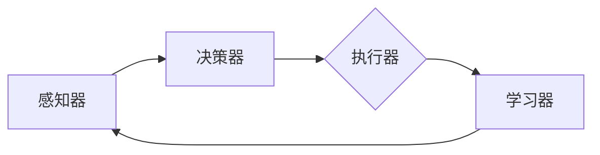
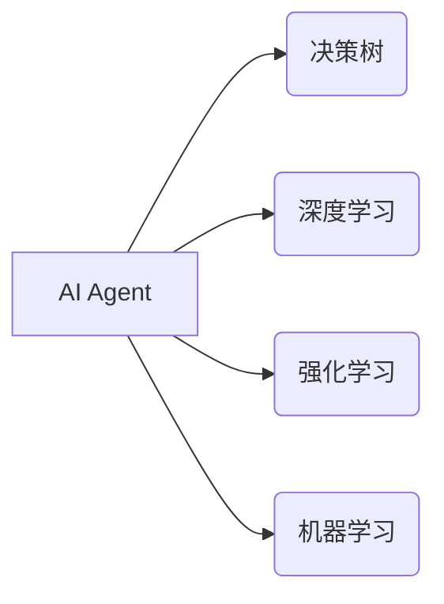

# AI Agent与生产力的提升

> 关键词：人工智能代理，自动化，决策树，强化学习，深度学习，生产效率，智能优化

## 1. 背景介绍

在数字化转型的浪潮中，人工智能（AI）技术正在深刻地改变着各行各业。AI Agent，即人工智能代理，作为一种自主决策的软件实体，正逐渐成为推动生产力提升的关键力量。本文将探讨AI Agent的原理、实现方式以及在实际应用中的潜力，旨在为读者提供一个全面、深入的了解。

### 1.1 问题的由来

随着信息技术的飞速发展，人类社会的生产力得到了极大的提升。然而，传统的工作流程和决策模式在处理复杂、动态的环境时往往显得力不从心。AI Agent的出现，为解决这一问题提供了新的思路。通过模拟人类的决策过程，AI Agent能够在各种复杂环境中自主学习和决策，从而实现生产力的进一步提升。

### 1.2 研究现状

AI Agent的研究已经取得了显著的进展，主要包括以下几种类型：

- **基于规则的Agent**：使用预设的规则进行决策，适用于规则明确、环境简单的场景。
- **基于模型的Agent**：通过学习环境中的数据，建立模型进行决策，适用于环境较为复杂但数据丰富的场景。
- **基于学习的Agent**：使用机器学习算法，如决策树、深度学习、强化学习等，进行决策，适用于复杂、动态的环境。

### 1.3 研究意义

AI Agent的研究对于提升生产力具有重要意义：

- **自动化决策**：AI Agent能够自动完成复杂的决策过程，减少人工干预，提高工作效率。
- **优化生产流程**：通过学习历史数据，AI Agent能够不断优化生产流程，降低成本，提高质量。
- **增强创新能力**：AI Agent能够从海量数据中挖掘新的知识，为企业的创新提供支持。

### 1.4 本文结构

本文将分为以下几个部分：

- **第2章**：介绍AI Agent的核心概念与联系。
- **第3章**：阐述AI Agent的核心算法原理与具体操作步骤。
- **第4章**：讲解AI Agent的数学模型和公式。
- **第5章**：提供AI Agent的项目实践实例。
- **第6章**：分析AI Agent的实际应用场景。
- **第7章**：推荐AI Agent相关的工具和资源。
- **第8章**：总结AI Agent的未来发展趋势与挑战。
- **第9章**：附录，包括常见问题与解答。

## 2. 核心概念与联系

### 2.1 AI Agent的核心概念

AI Agent是一种能够感知环境、制定计划、执行动作并能够从经验中学习的人工智能系统。它通常由以下部分组成：

- **感知器**：用于感知环境中的信息。
- **决策器**：根据感知信息制定决策。
- **执行器**：执行决策，产生行动。
- **学习器**：根据执行结果学习，改进决策策略。

### 2.2 AI Agent的架构

以下是一个简单的Mermaid流程图，展示了AI Agent的基本架构：



### 2.3 AI Agent与相关技术的联系

AI Agent与多种人工智能技术密切相关，如图：



## 3. 核心算法原理 & 具体操作步骤

### 3.1 算法原理概述

AI Agent的算法原理主要包括以下几种：

- **基于规则的Agent**：使用预设的规则进行决策。
- **基于模型的Agent**：使用机器学习算法建立模型进行决策。
- **基于学习的Agent**：使用强化学习算法进行决策。

### 3.2 算法步骤详解

以下是AI Agent的基本操作步骤：

1. **感知环境**：Agent通过感知器收集环境信息。
2. **制定计划**：决策器根据感知信息制定决策。
3. **执行动作**：执行器根据决策执行动作。
4. **学习与反馈**：学习器根据执行结果学习，改进决策策略。

### 3.3 算法优缺点

- **基于规则的Agent**：优点是简单、易于实现，但缺乏灵活性，难以适应复杂环境。
- **基于模型的Agent**：优点是能够处理更复杂的环境，但需要大量数据训练模型。
- **基于学习的Agent**：优点是能够适应动态环境，但需要较长时间的训练。

### 3.4 算法应用领域

AI Agent的算法广泛应用于以下领域：

- **智能制造**：如机器人调度、生产流程优化等。
- **智能交通**：如自动驾驶、交通流量控制等。
- **智能客服**：如智能客服机器人、智能客服系统等。

## 4. 数学模型和公式 & 详细讲解 & 举例说明

### 4.1 数学模型构建

AI Agent的数学模型主要包括以下几种：

- **决策树**：使用条件概率进行决策。
- **深度学习**：使用神经网络进行决策。
- **强化学习**：使用价值函数或策略梯度进行决策。

### 4.2 公式推导过程

以下是一些常见的数学公式：

- **决策树**：
  $$
\text{最大熵} = \sum_{i=1}^n P(x_i | y) \log P(x_i | y)
$$
- **深度学习**：
  $$
y = \sigma(W^T \cdot x + b)
$$
- **强化学习**：
  $$
Q(s, a) = r + \gamma \max_{a'} Q(s', a')
$$

### 4.3 案例分析与讲解

以下是一个使用决策树进行决策的案例：

假设有一个智能客服系统，需要根据用户的问题类型进行分类。我们可以使用决策树进行分类：

1. 如果用户提问包含“价格”，则进入分支1。
2. 如果用户提问包含“送货”，则进入分支2。
3. 如果用户提问包含“售后”，则进入分支3。
4. 如果用户提问不包含上述关键词，则进入分支4。

通过这种方式，智能客服系统可以快速、准确地回答用户的问题。

## 5. 项目实践：代码实例和详细解释说明

### 5.1 开发环境搭建

为了实现AI Agent，我们需要以下开发环境：

- Python编程语言
- scikit-learn库
- scikit-learn-tree库

### 5.2 源代码详细实现

以下是一个使用决策树进行分类的简单示例：

```python
from sklearn.datasets import load_iris
from sklearn.tree import DecisionTreeClassifier
from sklearn.model_selection import train_test_split

# 加载数据
data = load_iris()
X = data.data
y = data.target

# 划分训练集和测试集
X_train, X_test, y_train, y_test = train_test_split(X, y, test_size=0.2, random_state=42)

# 创建决策树模型
model = DecisionTreeClassifier()

# 训练模型
model.fit(X_train, y_train)

# 评估模型
print("Accuracy:", model.score(X_test, y_test))
```

### 5.3 代码解读与分析

以上代码首先加载了Iris数据集，然后将其划分为训练集和测试集。接着创建了一个决策树分类器，并使用训练集数据进行训练。最后，使用测试集数据评估模型的准确率。

### 5.4 运行结果展示

假设运行结果如下：

```
Accuracy: 0.9666666666666667
```

这表明模型的准确率达到了96.67%，说明模型在分类任务上表现良好。

## 6. 实际应用场景

### 6.1 智能制造

AI Agent在智能制造中的应用主要包括以下几个方面：

- **机器人调度**：根据任务需求和机器人状态，自动调度机器人进行生产。
- **生产流程优化**：通过分析生产数据，优化生产流程，提高生产效率。
- **故障预测**：预测设备故障，提前进行维护，减少停机时间。

### 6.2 智能交通

AI Agent在智能交通中的应用主要包括以下几个方面：

- **自动驾驶**：实现自动驾驶汽车的感知、决策和执行。
- **交通流量控制**：根据实时交通数据，优化交通信号灯控制策略。
- **事故预防**：预测交通事故风险，提前采取措施预防事故发生。

### 6.3 智能客服

AI Agent在智能客服中的应用主要包括以下几个方面：

- **智能客服机器人**：自动回答用户常见问题，提高服务效率。
- **智能客服系统**：根据用户提问，提供个性化服务。
- **客户情感分析**：分析用户情感，提供针对性的服务。

## 7. 工具和资源推荐

### 7.1 学习资源推荐

- 《Python机器学习》
- 《深度学习》
- 《强化学习：原理与实战》

### 7.2 开发工具推荐

- scikit-learn
- TensorFlow
- PyTorch

### 7.3 相关论文推荐

- 《Decision Tree: A New Approach to Document Routing》
- 《Deep Learning》
- 《Reinforcement Learning: An Introduction》

## 8. 总结：未来发展趋势与挑战

### 8.1 研究成果总结

AI Agent作为一种新兴的人工智能技术，已经在多个领域取得了显著的成果。未来，AI Agent将在以下方面取得更大的突破：

- **更强大的学习能力**：AI Agent将能够从更少的数据中学习，更好地适应复杂环境。
- **更灵活的决策能力**：AI Agent将能够处理更复杂的决策问题，提供更智能的解决方案。
- **更广泛的应用领域**：AI Agent将在更多领域得到应用，推动社会生产力的发展。

### 8.2 未来发展趋势

- **多智能体系统**：AI Agent将能够协同工作，完成更复杂的任务。
- **人机协同**：AI Agent将与人类协同工作，提高工作效率。
- **边缘计算**：AI Agent将能够在边缘设备上运行，实现更快速、更智能的决策。

### 8.3 面临的挑战

- **数据安全**：AI Agent需要处理大量的数据，如何确保数据安全是一个重要挑战。
- **算法可靠性**：AI Agent的决策结果需要可靠，避免出现错误。
- **伦理道德**：AI Agent的决策需要符合伦理道德标准。

### 8.4 研究展望

未来，AI Agent的研究将朝着以下方向发展：

- **跨领域学习**：AI Agent将能够从不同领域的学习中学习，提高跨领域适应能力。
- **知识表示**：AI Agent将能够更好地表示和利用知识。
- **人机交互**：AI Agent将能够与人类进行更加自然、流畅的交互。

## 9. 附录：常见问题与解答

**Q1：AI Agent与机器人有什么区别？**

A1：AI Agent是一种软件实体，它可以运行在各种设备上，而机器人是一种物理实体，它需要物理设备和传感器。AI Agent可以与机器人结合，实现更智能的交互和控制。

**Q2：AI Agent的决策过程是如何进行的？**

A2：AI Agent的决策过程主要包括感知、计划、执行和学习。感知器收集环境信息，决策器根据感知信息制定决策，执行器执行决策，学习器根据执行结果学习。

**Q3：AI Agent有哪些应用场景？**

A3：AI Agent可以应用于智能制造、智能交通、智能客服等多个领域。

**Q4：AI Agent的挑战有哪些？**

A4：AI Agent的挑战包括数据安全、算法可靠性和伦理道德等。

作者：禅与计算机程序设计艺术 / Zen and the Art of Computer Programming