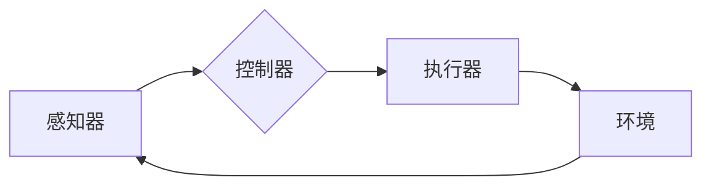

> 关键词：AI Agent，智能协作，强化学习，多智能体系统，分布式计算，协同优化

# AI Agent在智能协作中的优势

智能协作是人工智能领域的一个重要研究方向，它涉及到多个智能体之间的交互与合作，以共同完成复杂的任务。AI Agent作为智能协作的核心单元，在推动智能协作技术的发展中扮演着至关重要的角色。本文将深入探讨AI Agent在智能协作中的优势，并分析其未来发展趋势与挑战。

## 1. 背景介绍

随着物联网、大数据、云计算等技术的发展，智能协作已成为推动社会进步的重要力量。在工业生产、交通运输、智能城市、金融服务等领域，智能协作系统正逐步替代传统的自动化系统，实现更高效率和更智能的决策。AI Agent作为智能协作的基本单元，其性能和协同能力直接决定了整个系统的效能。

## 2. 核心概念与联系

### 2.1 AI Agent的概念

AI Agent是指具有自主决策能力、能够感知环境并采取行动的智能实体。它通常由感知器、控制器和执行器组成。感知器负责收集环境信息，控制器根据感知信息进行决策，执行器根据决策结果执行动作。

### 2.2 智能协作的概念

智能协作是指多个AI Agent在共同任务中相互配合、协同工作的过程。它强调个体Agent之间的信息共享、策略协调和目标协同。

### 2.3 AI Agent与智能协作的Mermaid流程图



在这个流程图中，AI Agent通过感知器感知环境信息，控制器根据感知信息进行决策，并指导执行器执行动作，从而影响环境。环境信息又会反馈给感知器，形成一个闭环的智能协作过程。

## 3. 核心算法原理 & 具体操作步骤

### 3.1 算法原理概述

AI Agent在智能协作中的核心算法主要包括强化学习、多智能体系统理论、分布式计算等。

- **强化学习**：通过与环境交互，学习最优策略，实现个体Agent的自主决策。
- **多智能体系统理论**：研究多个Agent之间的交互、协作和竞争关系，优化整个系统的性能。
- **分布式计算**：通过分布式算法，实现大规模Agent系统的并行计算和协同优化。

### 3.2 算法步骤详解

#### 3.2.1 强化学习

1. 定义环境：确定环境的状态空间、动作空间和奖励函数。
2. 初始化策略：随机初始化或使用经验迁移等方法初始化策略。
3. 迭代学习：通过与环境交互，不断更新策略，使策略逐渐收敛到最优。

#### 3.2.2 多智能体系统理论

1. 定义Agent：确定每个Agent的感知器、控制器和执行器。
2. 设计通信协议：确定Agent之间的通信机制，如消息传递、共享状态等。
3. 确定协作策略：设计每个Agent的行动策略，使其能够与同伴协作完成任务。

#### 3.2.3 分布式计算

1. 将任务分解为多个子任务。
2. 将子任务分配给不同的Agent。
3. 使用分布式算法，如MapReduce、参数服务器等，实现并行计算和协同优化。

### 3.3 算法优缺点

- **强化学习**：优点是无需标注数据，能够自动学习最优策略；缺点是收敛速度慢，需要大量的交互经验。
- **多智能体系统理论**：优点是能够处理复杂的多智能体协作问题；缺点是需要复杂的建模和设计，计算复杂度高。
- **分布式计算**：优点是能够处理大规模Agent系统，提高计算效率；缺点是通信开销大，需要解决数据一致性和同步问题。

### 3.4 算法应用领域

AI Agent在智能协作中的应用领域非常广泛，包括：

- **工业自动化**：如机器人协作、生产线自动化等。
- **交通运输**：如无人驾驶、无人机集群等。
- **智能城市**：如交通管理、环境监测等。
- **金融服务**：如风险管理、智能投顾等。

## 4. 数学模型和公式 & 详细讲解 & 举例说明

### 4.1 数学模型构建

AI Agent的数学模型主要包括：

- **状态空间**：$S$，表示Agent所处的环境状态。
- **动作空间**：$A$，表示Agent可采取的动作集合。
- **策略空间**：$\pi$，表示Agent的策略函数，$\pi(s)$表示在状态 $s$ 下采取动作 $a$ 的概率。
- **奖励函数**：$R(s,a)$，表示Agent在状态 $s$ 下采取动作 $a$ 所获得的奖励。
- **价值函数**：$V(s)$，表示Agent在状态 $s$ 下的期望回报。

### 4.2 公式推导过程

#### 4.2.1 Q学习

Q学习的目标是学习一个Q函数，用于评估每个状态-动作对的价值。Q函数的定义如下：

$$
Q(s,a) = \sum_{s' \in S} \gamma R(s,a) + \max_{a' \in A} Q(s',a')
$$

其中 $\gamma$ 是折扣因子，表示未来奖励的现值。

#### 4.2.2 深度Q网络(DQN)

DQN是Q学习的变体，使用深度神经网络来近似Q函数。其目标是学习一个函数 $Q(s; \theta)$，其中 $\theta$ 是网络参数。

### 4.3 案例分析与讲解

#### 4.3.1 无人驾驶

无人驾驶是AI Agent在智能协作中的典型应用。在无人驾驶场景中，每个传感器收集到的数据作为感知信息，控制器根据感知信息进行决策，控制车辆的速度、转向等动作。奖励函数可以是距离目标的距离、行驶时间等。

#### 4.3.2 无人机集群

无人机集群是另一个典型的AI Agent智能协作场景。每个无人机负责执行特定的任务，如搜索、救援、监控等。无人机之间通过通信协议进行信息共享和协同控制，以实现整体任务目标。

## 5. 项目实践：代码实例和详细解释说明

### 5.1 开发环境搭建

以Python为例，开发环境搭建如下：

1. 安装Python 3.8及以上版本。
2. 安装PyTorch深度学习框架：`pip install torch torchvision torchaudio`。
3. 安装其他依赖库：`pip install numpy pandas matplotlib`。

### 5.2 源代码详细实现

以下是一个简单的DQN示例代码：

```python
import torch
import torch.nn as nn
import torch.optim as optim

# 定义网络结构
class DQN(nn.Module):
    def __init__(self, input_dim, output_dim):
        super(DQN, self).__init__()
        self.fc1 = nn.Linear(input_dim, 24)
        self.fc2 = nn.Linear(24, 24)
        self.fc3 = nn.Linear(24, output_dim)

    def forward(self, x):
        x = torch.relu(self.fc1(x))
        x = torch.relu(self.fc2(x))
        return self.fc3(x)

# 初始化网络和优化器
input_dim = 4
output_dim = 2
model = DQN(input_dim, output_dim)
optimizer = optim.Adam(model.parameters(), lr=0.001)

# 训练网络
for epoch in range(100):
    # ... (训练过程)
    pass

# 测试网络
# ... (测试过程)
```

### 5.3 代码解读与分析

上述代码定义了一个简单的DQN网络，包括三个全连接层。在训练过程中，通过优化器更新网络参数，使模型逐渐学习到最优策略。

### 5.4 运行结果展示

由于篇幅限制，此处不展示运行结果。实际运行时，可以通过打印输出或可视化工具观察模型的学习过程和最终性能。

## 6. 实际应用场景

AI Agent在智能协作中的实际应用场景非常广泛，以下列举几个典型案例：

- **智能工厂**：利用AI Agent实现生产线自动化，提高生产效率和产品质量。
- **智能交通**：利用AI Agent实现自动驾驶、智能交通信号控制等，缓解交通拥堵，提高交通效率。
- **智能医疗**：利用AI Agent实现智能诊断、辅助治疗等，提高医疗服务质量和效率。
- **智能金融**：利用AI Agent实现智能投资、风险管理等，提高金融服务的智能化水平。

## 7. 工具和资源推荐

### 7.1 学习资源推荐

- 《Reinforcement Learning: An Introduction》
- 《Artificial Intelligence: A Modern Approach》
- 《Multi-Agent Systems: Algorithmic, Economic, and Game-Theoretic Approaches》

### 7.2 开发工具推荐

- PyTorch
- TensorFlow
- OpenAI Gym

### 7.3 相关论文推荐

- "Deep Reinforcement Learning for Autonomous Navigation" by Julian Togelius and Peter Stone
- "Multi-Agent Reinforcement Learning: A Survey" by Shimon Whiteson and Michael Littman
- "Distributed Reinforcement Learning" by Tuomas Sandholm

## 8. 总结：未来发展趋势与挑战

### 8.1 研究成果总结

AI Agent在智能协作中的优势已经得到了充分验证，其在工业生产、交通运输、智能城市、金融服务等领域具有广泛的应用前景。

### 8.2 未来发展趋势

- **多智能体强化学习**：研究更有效的多智能体协同策略，提高智能协作系统的整体性能。
- **分布式强化学习**：解决大规模多智能体系统的计算和通信问题，实现高效协同。
- **人机协同**：将AI Agent与人类协作，实现人机协同决策和执行。

### 8.3 面临的挑战

- **环境建模**：准确建模复杂环境，使AI Agent能够适应各种复杂场景。
- **多智能体交互**：研究有效的多智能体交互机制，避免冲突和竞争。
- **学习效率和稳定性**：提高学习效率和稳定性，使AI Agent能够快速适应环境变化。

### 8.4 研究展望

随着AI Agent技术的不断发展，相信其在智能协作中的优势将进一步发挥，为人类创造更加美好的未来。

---

作者：禅与计算机程序设计艺术 / Zen and the Art of Computer Programming