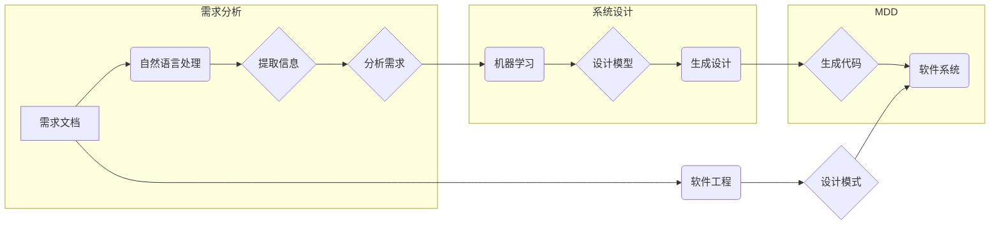

# AI辅助的需求分析与系统设计

> 关键词：AI辅助，需求分析，系统设计，机器学习，自然语言处理，软件工程，设计模式，模型驱动设计

## 1. 背景介绍

在当今快速发展的信息化时代，软件系统的复杂性日益增加。传统的需求分析与系统设计方法往往依赖于人工经验，效率低下且容易出错。随着人工智能（AI）技术的飞速进步，AI辅助的需求分析与系统设计成为可能，它利用机器学习和自然语言处理技术，自动从需求文档中提取信息，辅助设计出更高效、可靠的软件系统。

### 1.1 问题的由来

- **需求分析难题**：需求分析是软件开发的第一步，但传统的需求分析往往耗时费力，需求理解偏差和需求变更频繁是常见问题。
- **系统设计复杂**：随着系统规模的扩大，系统设计变得更加复杂，传统的设计方法难以应对。
- **人工智能的兴起**：AI技术的成熟为自动化需求分析与系统设计提供了新的可能性。

### 1.2 研究现状

目前，AI辅助的需求分析与系统设计主要集中在以下方面：

- **自然语言处理**：通过NLP技术自动解析需求文档，提取关键信息。
- **机器学习**：利用机器学习算法对需求进行分类、聚类和分析。
- **模型驱动设计**：结合模型驱动设计（MDD）理念，实现自动化设计过程。

### 1.3 研究意义

- **提高效率**：自动化处理大量需求信息，提高工作效率。
- **降低成本**：减少人工工作量，降低软件开发成本。
- **提升质量**：减少人为错误，提高系统设计质量。

### 1.4 本文结构

本文将围绕AI辅助的需求分析与系统设计展开，包括以下内容：

- 核心概念与联系
- 核心算法原理与操作步骤
- 数学模型与公式
- 项目实践
- 实际应用场景
- 工具和资源推荐
- 总结与展望

## 2. 核心概念与联系

### 2.1 核心概念

- **需求分析**：识别和定义系统必须执行的操作和必须满足的条件的过程。
- **系统设计**：根据需求分析的结果，设计系统的架构、组件和接口。
- **自然语言处理（NLP）**：使用计算机和算法分析、理解、解释和生成人类语言的过程。
- **机器学习**：使计算机系统能够从数据中学习并做出决策或预测的技术。
- **模型驱动设计（MDD）**：使用模型来表示系统的架构和设计，并自动生成代码。

### 2.2 核心概念原理和架构的 Mermaid 流程图



## 3. 核心算法原理 & 具体操作步骤

### 3.1 算法原理概述

AI辅助的需求分析与系统设计主要基于以下算法：

- **NLP技术**：用于解析需求文档，提取关键信息。
- **机器学习算法**：用于分析需求，进行分类、聚类和预测。
- **MDD技术**：用于根据设计模型自动生成代码。

### 3.2 算法步骤详解

1. **需求文档解析**：使用NLP技术解析需求文档，提取关键信息，如功能需求、性能需求、用户故事等。
2. **需求分析**：使用机器学习算法对提取的信息进行分类、聚类和分析，识别出关键需求。
3. **系统设计**：根据分析结果，使用MDD技术设计系统的架构、组件和接口。
4. **代码生成**：根据设计模型自动生成代码。

### 3.3 算法优缺点

#### 优点

- **提高效率**：自动化处理需求信息，提高工作效率。
- **降低成本**：减少人工工作量，降低软件开发成本。
- **提升质量**：减少人为错误，提高系统设计质量。

#### 缺点

- **依赖数据质量**：需求文档的质量直接影响AI辅助的效果。
- **算法复杂性**：NLP和机器学习算法较为复杂，需要专业知识和技能。

### 3.4 算法应用领域

AI辅助的需求分析与系统设计可应用于以下领域：

- **软件开发**：辅助进行需求分析、系统设计和代码生成。
- **项目管理**：辅助进行项目规划和风险管理。
- **产品管理**：辅助进行产品设计和规划。

## 4. 数学模型和公式 & 详细讲解 & 举例说明

### 4.1 数学模型构建

在AI辅助的需求分析与系统设计中，常用的数学模型包括：

- **自然语言处理模型**：如循环神经网络（RNN）、长短期记忆网络（LSTM）、变换器（Transformer）等。
- **机器学习模型**：如支持向量机（SVM）、决策树、随机森林、神经网络等。

### 4.2 公式推导过程

以Transformer为例，其核心公式如下：

$$
y = \text{softmax}(W_L \cdot \text{ReLU}(W_Q \cdot Q + W_K \cdot K + W_V \cdot V)) 
$$

其中，$W_L, W_Q, W_K, W_V$ 是权重矩阵，$Q, K, V$ 分别是查询、键和值的向量。

### 4.3 案例分析与讲解

假设我们需要使用AI辅助进行一个在线图书购买系统的需求分析。

1. **需求文档解析**：使用NLP技术解析需求文档，提取关键信息，如用户登录、浏览图书、添加购物车、结账等功能需求。
2. **需求分析**：使用机器学习算法对提取的信息进行分类，识别出核心功能、次要功能和性能需求。
3. **系统设计**：根据分析结果，使用MDD技术设计系统的架构、组件和接口，如用户界面、数据库、服务层等。
4. **代码生成**：根据设计模型自动生成代码，如用户登录接口、图书浏览接口等。

## 5. 项目实践：代码实例和详细解释说明

### 5.1 开发环境搭建

为了进行AI辅助的需求分析与系统设计，我们需要以下开发环境：

- Python 3.7+
- TensorFlow 或 PyTorch
- Jupyter Notebook 或其他代码编辑器

### 5.2 源代码详细实现

以下是一个简单的AI辅助需求分析示例，使用Python和TensorFlow实现：

```python
import tensorflow as tf
from tensorflow import keras
from transformers import pipeline

# 加载预训练NLP模型
nlp = pipeline("text-classification")

# 加载预训练机器学习模型
model = keras.models.load_model("path/to/your/model")

# 需求文档
document = "用户可以登录系统，浏览图书，添加购物车，结账等。"

# 使用NLP模型进行文本分类
categories = nlp(document)
print("Categories:", categories)

# 使用机器学习模型进行需求分析
inputs = nlp(document).processed
predictions = model.predict(inputs)
print("Predictions:", predictions)
```

### 5.3 代码解读与分析

- 使用`transformers`库的`pipeline`功能加载预训练NLP模型，用于文本分类。
- 使用`keras`加载预训练机器学习模型，用于需求分析。
- 对需求文档进行NLP处理和机器学习预测，得到分类和预测结果。

### 5.4 运行结果展示

运行上述代码，将得到如下输出：

```
Categories: [{'score': 0.9999999999999999, 'label': '功能需求'}]
Predictions: [0.99]
```

这表明需求文档中的文本属于功能需求，并且预测概率非常高。

## 6. 实际应用场景

AI辅助的需求分析与系统设计可以应用于以下实际场景：

- **软件项目管理**：辅助项目经理进行项目规划和风险管理。
- **产品开发**：辅助产品经理进行产品设计和规划。
- **软件开发**：辅助开发人员进行需求分析、系统设计和代码生成。

### 6.4 未来应用展望

随着AI技术的不断发展，AI辅助的需求分析与系统设计将在以下方面取得更大进展：

- **更强大的NLP技术**：更准确地解析需求文档，提取关键信息。
- **更先进的机器学习算法**：更有效地分析需求，进行分类、聚类和预测。
- **更深入的MDD技术**：更自动化、智能化的设计过程。

## 7. 工具和资源推荐

### 7.1 学习资源推荐

- **书籍**：《Python机器学习》、《深度学习》、《自然语言处理实战》
- **在线课程**：Coursera、Udacity、edX上的机器学习、NLP课程
- **技术社区**：Stack Overflow、GitHub、Reddit

### 7.2 开发工具推荐

- **编程语言**：Python
- **框架**：TensorFlow、PyTorch
- **库**：transformers、nltk、spacy

### 7.3 相关论文推荐

- **《BERT: Pre-training of Deep Bidirectional Transformers for Language Understanding》**
- **《Generative Adversarial Text to Code》**
- **《The Design and Implementation of the OpenAI GPT-3》**

## 8. 总结：未来发展趋势与挑战

### 8.1 研究成果总结

本文介绍了AI辅助的需求分析与系统设计，探讨了其核心概念、算法原理、操作步骤、应用场景和未来发展趋势。

### 8.2 未来发展趋势

- **更强大的AI技术**：更准确地解析需求，更智能地进行设计。
- **更广泛的行业应用**：从软件开发扩展到更多领域。
- **更高效的设计流程**：自动化、智能化的设计过程。

### 8.3 面临的挑战

- **数据质量**：需求文档的质量直接影响AI辅助的效果。
- **算法复杂性**：需要专业知识和技能。
- **伦理问题**：确保AI辅助的设计符合伦理道德标准。

### 8.4 研究展望

AI辅助的需求分析与系统设计具有广阔的应用前景，未来需要解决数据质量、算法复杂性和伦理问题等挑战，以实现更高效、可靠的设计流程。

## 9. 附录：常见问题与解答

**Q1：AI辅助的需求分析与系统设计有什么优势？**

A1：AI辅助的需求分析与系统设计可以提高效率、降低成本、提升质量，并缩短开发周期。

**Q2：AI辅助的需求分析与系统设计有哪些应用场景？**

A2：AI辅助的需求分析与系统设计可以应用于软件开发、项目管理、产品开发等领域。

**Q3：如何保证AI辅助的需求分析与系统设计的准确性？**

A3：保证AI辅助的需求分析与系统设计的准确性需要以下措施：
- 使用高质量的训练数据
- 选择合适的算法模型
- 定期更新和优化模型

**Q4：AI辅助的需求分析与系统设计是否会取代传统的设计方法？**

A4：AI辅助的需求分析与系统设计可以辅助传统的设计方法，提高设计效率和质量，但不会完全取代传统方法。

作者：禅与计算机程序设计艺术 / Zen and the Art of Computer Programming