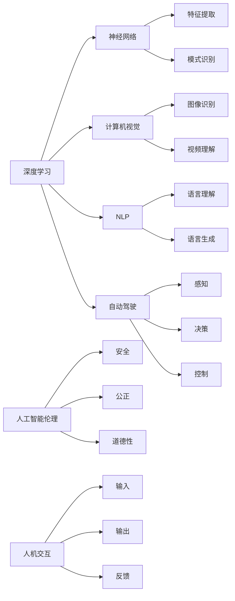

> AI未来，深度学习，神经网络，计算机视觉，自然语言处理，自动驾驶，人工智能伦理，人机交互

# Andrej Karpathy谈AI的未来展望

## 1. 背景介绍

人工智能（AI）是当代科技领域最激动人心的进展之一。从深度学习到神经网络，AI技术正在以前所未有的速度发展，改变着我们的生活、工作和思考方式。Andrej Karpathy，一位在AI领域享有盛誉的研究员和工程师，以其对AI的深刻洞察和对技术未来的独到见解而闻名。本文将探讨Andrej Karpathy关于AI未来的展望，涵盖计算机视觉、自然语言处理、自动驾驶等多个领域，并深入探讨人工智能伦理和人机交互的重要性。

## 2. 核心概念与联系

### 2.1 核心概念原理

人工智能的核心概念包括：

- **深度学习**：一种通过模拟人脑神经网络结构的学习方法，能够从数据中自动提取特征并做出决策。
- **神经网络**：由相互连接的神经元组成的计算模型，能够执行复杂的模式识别和决策任务。
- **计算机视觉**：让机器通过图像和视频理解视觉世界。
- **自然语言处理（NLP）**：使计算机能够理解和生成人类语言。
- **自动驾驶**：使汽车能够在没有人类司机的情况下自主驾驶。
- **人工智能伦理**：确保AI系统的安全、公正和道德性。
- **人机交互**：研究如何使人与机器更有效地交流。

以下是基于这些核心概念的Mermaid流程图：



### 2.2 核心概念联系

这些核心概念相互联系，共同构成了AI技术的生态系统。深度学习和神经网络是AI技术的基石，而计算机视觉、NLP和自动驾驶等应用领域则是这些基础技术的具体体现。人工智能伦理和人机交互则是确保AI技术能够造福人类的关键因素。

## 3. 核心算法原理 & 具体操作步骤

### 3.1 算法原理概述

AI的核心算法原理是基于数据的自动学习和模式识别。以下是一些关键的算法和概念：

- **卷积神经网络（CNN）**：用于图像识别和视频分析。
- **循环神经网络（RNN）和长短期记忆网络（LSTM）**：用于处理序列数据，如时间序列分析、语音识别和机器翻译。
- **Transformer**：一种基于自注意力机制的模型，在机器翻译和文本生成等领域取得了突破性进展。
- **生成对抗网络（GAN）**：用于生成逼真的图像、音频和文本。

### 3.2 算法步骤详解

AI算法的步骤通常包括：

1. 数据收集：收集大量的标注数据，用于训练模型。
2. 数据预处理：清洗和转换数据，使其适合训练。
3. 模型选择：选择合适的模型架构。
4. 训练模型：使用训练数据训练模型。
5. 模型评估：评估模型的性能。
6. 模型部署：将模型部署到实际应用中。

### 3.3 算法优缺点

AI算法的优点包括：

- **强大的模式识别能力**：能够从大量数据中识别复杂的模式。
- **自动学习**：无需显式编程，能够自动从数据中学习。
- **泛化能力**：能够将学到的知识应用于新的数据。

然而，AI算法也存在一些缺点，例如：

- **对数据质量敏感**：数据质量对模型的性能有重大影响。
- **可解释性差**：模型决策过程难以解释。
- **可能引入偏见**：如果训练数据存在偏见，模型也可能产生偏见。

### 3.4 算法应用领域

AI算法在以下领域有着广泛的应用：

- **医疗**：用于诊断疾病、个性化治疗和药物发现。
- **金融**：用于风险评估、欺诈检测和自动化交易。
- **零售**：用于需求预测、库存管理和客户推荐。
- **交通**：用于自动驾驶、交通流量管理和智能交通系统。

## 4. 数学模型和公式 & 详细讲解 & 举例说明

### 4.1 数学模型构建

AI模型的数学模型通常包括以下部分：

- **输入层**：接收输入数据。
- **隐藏层**：进行特征提取和转换。
- **输出层**：生成预测或决策。

以下是一个简单的神经网络数学模型示例：

$$
\hat{y} = f(\mathbf{W}^T \mathbf{h} + b)
$$

其中，$\hat{y}$ 是模型的预测，$\mathbf{W}$ 是权重矩阵，$\mathbf{h}$ 是隐藏层激活，$b$ 是偏置，$f$ 是激活函数。

### 4.2 公式推导过程

神经网络的推导过程通常涉及以下步骤：

1. 前向传播：将输入数据通过模型，计算输出。
2. 反向传播：计算损失函数的梯度，更新模型参数。
3. 梯度下降：使用梯度下降算法更新模型参数。

### 4.3 案例分析与讲解

以下是一个使用神经网络进行图像识别的案例：

1. **数据收集**：收集大量带有标签的图像数据。
2. **数据预处理**：对图像进行缩放、裁剪等处理。
3. **模型选择**：选择一个卷积神经网络模型。
4. **训练模型**：使用训练数据训练模型。
5. **模型评估**：使用测试数据评估模型的性能。
6. **模型部署**：将模型部署到实际应用中。

## 5. 项目实践：代码实例和详细解释说明

### 5.1 开发环境搭建

要开始AI项目，需要以下开发环境：

- 编程语言：Python
- 深度学习框架：TensorFlow或PyTorch
- 数据处理工具：NumPy、Pandas

### 5.2 源代码详细实现

以下是一个简单的神经网络实现的示例：

```python
import torch
import torch.nn as nn
import torch.optim as optim

# 定义神经网络模型
class NeuralNetwork(nn.Module):
    def __init__(self):
        super(NeuralNetwork, self).__init__()
        self.fc1 = nn.Linear(784, 128)
        self.fc2 = nn.Linear(128, 64)
        self.fc3 = nn.Linear(64, 10)

    def forward(self, x):
        x = torch.relu(self.fc1(x))
        x = torch.relu(self.fc2(x))
        x = self.fc3(x)
        return x

# 创建模型实例
model = NeuralNetwork()

# 定义优化器和学习率
optimizer = optim.Adam(model.parameters(), lr=0.001)

# 训练模型
for epoch in range(10):
    for data, target in train_loader:
        optimizer.zero_grad()
        output = model(data)
        loss = nn.CrossEntropyLoss(output, target)
        loss.backward()
        optimizer.step()

    print(f'Epoch {epoch+1}, Loss: {loss.item()}')

# 评估模型
with torch.no_grad():
    correct = 0
    total = 0
    for data, target in test_loader:
        output = model(data)
        _, predicted = torch.max(output.data, 1)
        total += target.size(0)
        correct += (predicted == target).sum().item()

print(f'Accuracy of the network on the 10000 test images: {100 * correct // total} %')
```

### 5.3 代码解读与分析

这个示例展示了如何使用PyTorch框架构建和训练一个简单的神经网络。首先，我们定义了一个神经网络类，其中包含三个全连接层。然后，我们创建模型实例，定义优化器和学习率。接下来，我们进行训练，包括前向传播、计算损失、反向传播和更新参数。最后，我们评估模型在测试数据上的性能。

## 6. 实际应用场景

AI技术在多个领域都有实际应用场景，以下是一些例子：

### 6.1 医疗

AI在医疗领域的应用包括：

- **疾病诊断**：使用深度学习模型分析医学图像，如X射线、CT和MRI。
- **药物发现**：通过模拟生物化学过程，加速药物研发。
- **个性化治疗**：根据患者的遗传信息和病史，制定个性化的治疗方案。

### 6.2 金融

AI在金融领域的应用包括：

- **风险评估**：评估贷款申请者的信用风险。
- **欺诈检测**：检测和预防金融欺诈行为。
- **市场预测**：预测股票价格和其他金融市场指标。

### 6.3 交通

AI在交通领域的应用包括：

- **自动驾驶**：使汽车能够在没有人类司机的情况下自主驾驶。
- **交通流量管理**：优化交通流量，减少拥堵。
- **智能交通系统**：集成各种交通管理功能，提高交通效率。

## 7. 工具和资源推荐

### 7.1 学习资源推荐

- Coursera上的《机器学习》和《深度学习》课程
- TensorFlow和PyTorch官方文档
- 《深度学习》和《模式识别与机器学习》书籍

### 7.2 开发工具推荐

- Jupyter Notebook：用于编写和运行代码
- Google Colab：提供GPU和TPU算力
- Kaggle：数据科学竞赛平台

### 7.3 相关论文推荐

- "ImageNet Classification with Deep Convolutional Neural Networks" - Krizhevsky, S., Sutskever, I., Hinton, G. E.
- "Sequence to Sequence Learning with Neural Networks" - Sutskever, I., Vinyals, O., Le, Q. V.
- "Attention Is All You Need" - Vaswani, A., Shazeer, N., Parmar, N., Uszkoreit, J., Jones, L., Gomez, A. N., ... & Polosukhin, I.

## 8. 总结：未来发展趋势与挑战

### 8.1 研究成果总结

AI技术的发展取得了显著成果，从深度学习到神经网络，AI技术正在以前所未有的速度发展。AI在多个领域都有广泛的应用，从医疗到金融，从交通到娱乐。

### 8.2 未来发展趋势

未来AI技术的发展趋势包括：

- **模型规模和复杂度的增加**：随着计算能力的提升，AI模型将变得更加复杂和庞大。
- **多模态学习**：AI将能够处理和整合来自多个模态的数据，如图像、文本和音频。
- **强化学习**：强化学习将在更多领域得到应用，如游戏、机器人控制和自动驾驶。

### 8.3 面临的挑战

AI技术发展也面临着一些挑战，包括：

- **数据隐私和安全**：如何保护用户数据的安全和隐私。
- **算法偏见**：如何避免AI算法在决策过程中引入偏见。
- **人机交互**：如何设计更加自然和直观的人机交互界面。

### 8.4 研究展望

未来AI研究将聚焦于以下方向：

- **可解释性**：提高AI模型的可解释性，使其决策过程更加透明。
- **鲁棒性**：提高AI模型的鲁棒性，使其能够更好地应对不确定性和干扰。
- **伦理和道德**：确保AI技术的伦理和道德性，使其造福人类。

## 9. 附录：常见问题与解答

### 9.1 人工智能是否会取代人类？

A: 人工智能不会完全取代人类。虽然AI在某些任务上可能超越人类，但人类的创造力、情感和道德判断是无法替代的。

### 9.2 人工智能是否会导致失业？

A: 人工智能可能会导致某些领域的就业岗位减少，但也会创造新的就业机会。关键是培养新的技能和知识，适应技术变革。

### 9.3 人工智能是否具有情感？

A: 目前的人工智能没有情感。AI是基于数据和算法的，它们没有意识或情感。

### 9.4 人工智能是否能够实现通用人工智能（AGI）？

A: 目前的人工智能还远未达到通用人工智能的水平。AGI是一个长期的研究目标，需要跨学科的合作和大量的研究工作。

### 9.5 如何确保人工智能的伦理和道德？

A: 确保人工智能的伦理和道德需要多方面的努力，包括制定相关法律法规、建立伦理标准以及提高公众的AI意识。

作者：禅与计算机程序设计艺术 / Zen and the Art of Computer Programming