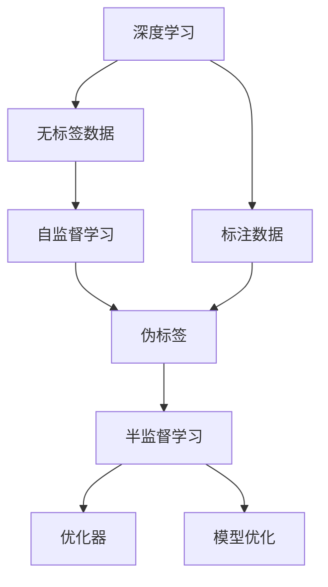

                 

# Python深度学习实践：半监督学习减少数据标注成本

> 关键词：半监督学习,深度学习,标注成本,模型泛化,数据增强,伪标签,自监督学习

## 1. 背景介绍

### 1.1 问题由来
在深度学习时代，数据标注工作成为制约模型训练与优化的重要瓶颈。传统的监督学习需要大量有标签数据，这不仅耗费时间与人力，还会产生较高的成本。然而，在实际应用中，有标签数据往往难以收集，特别是对于新领域和新任务，标注成本可能高达上百万美元。在医疗、金融、自动驾驶等关键领域，标注成本的制约更是令人头疼。

因此，如何在大规模无标签数据上训练高质量的深度学习模型，同时减少对有标签数据的依赖，成为一个亟待解决的问题。半监督学习应运而生，通过利用无标签数据与少量有标签数据，既能提升模型的泛化性能，又能显著降低标注成本。

### 1.2 问题核心关键点
半监督学习的核心在于利用无标签数据与少量有标签数据进行联合训练，优化模型的泛化能力。其基本思想是通过自监督学习任务，预训练模型对大量无标签数据进行特征提取，然后结合少量有标签数据，对模型进行微调优化。在模型优化过程中，通过伪标签生成等方法，利用无标签数据辅助学习，从而提升模型的泛化性能。

半监督学习在深度学习中的应用非常广泛，已经在图像分类、自然语言处理、异常检测等多个领域取得显著效果。与传统的监督学习相比，半监督学习能够更好地利用无标签数据，提升模型的泛化性能，同时减少标注成本。

### 1.3 问题研究意义
半监督学习能够显著降低数据标注成本，提升模型的泛化性能，对于推动深度学习在实际应用中的大规模落地具有重要意义：

1. 降低标注成本。半监督学习主要依赖无标签数据进行模型训练，显著降低了标注成本，特别是对于标注困难的场景，如医疗、金融等领域，半监督学习提供了一个可行的解决方案。
2. 提升泛化性能。利用无标签数据进行自监督学习，提升模型的特征提取能力，使得模型在实际应用中更加鲁棒，能够更好地适应未见过的新数据。
3. 加速模型开发。半监督学习可以利用无标签数据进行模型预训练，加速模型开发进程，减少从头训练的时间成本。
4. 促进研究进展。半监督学习的深入研究，为深度学习在数据稀缺领域的应用提供了新思路，激发了更多的创新研究。
5. 增强应用价值。半监督学习提升模型的泛化性能，使得模型能够更好地应用于工业界的实际任务，提高工作效率和质量。

## 2. 核心概念与联系

### 2.1 核心概念概述

为了更好地理解半监督学习的原理和架构，本节将介绍几个核心概念：

- 深度学习（Deep Learning）：一种基于神经网络的机器学习方法，通过多层次的特征提取和抽象，实现对复杂数据模式的高效建模。
- 标注数据（Labeled Data）：数据集中每个样本都有对应的标签或分类，用于训练监督学习模型。
- 无标签数据（Unlabeled Data）：数据集中每个样本都没有标签，用于训练自监督学习模型。
- 半监督学习（Semi-supervised Learning）：利用少量标注数据和大量无标签数据联合训练模型，提升模型的泛化性能。
- 伪标签（Pseudo-labels）：通过半监督学习方法生成的无标签数据的标签，用于辅助训练。
- 自监督学习（Self-supervised Learning）：利用数据本身的内在关系，训练模型进行特征提取，提升模型的泛化性能。
- 数据增强（Data Augmentation）：通过对数据进行变换，增加数据集的多样性，提高模型的鲁棒性和泛化能力。

这些概念构成了半监督学习的核心框架，其基本思想是通过自监督学习任务对无标签数据进行特征提取，然后结合少量有标签数据，利用伪标签等方法，优化模型的泛化性能。

### 2.2 概念间的关系

这些核心概念之间存在着紧密的联系，形成了半监督学习的完整生态系统。下面我们通过几个Mermaid流程图来展示这些概念之间的关系。



这个流程图展示了深度学习、标注数据、无标签数据、自监督学习、伪标签、半监督学习、优化器之间的逻辑关系：

1. 深度学习通过标注数据训练模型，提升模型精度。
2. 无标签数据用于自监督学习任务，提升模型的特征提取能力。
3. 自监督学习生成的伪标签用于半监督学习，辅助训练。
4. 半监督学习结合少量标注数据和大量伪标签数据，优化模型泛化性能。
5. 优化器用于调整模型参数，提升模型性能。
6. 模型优化通过半监督学习算法，迭代更新模型。

这些概念共同构成了半监督学习的学习和应用框架，使其能够在大规模无标签数据上训练高质量的深度学习模型。

## 3. 核心算法原理 & 具体操作步骤

### 3.1 算法原理概述

半监督学习的核心在于利用无标签数据与少量有标签数据进行联合训练，提升模型的泛化性能。其基本思想是通过自监督学习任务，预训练模型对大量无标签数据进行特征提取，然后结合少量有标签数据，对模型进行微调优化。在模型优化过程中，通过伪标签生成等方法，利用无标签数据辅助学习，从而提升模型的泛化性能。

形式化地，假设训练数据集 $D$ 包含 $N$ 个样本 $(x_i, y_i)$，其中 $y_i$ 为样本 $x_i$ 的真实标签，$x_i$ 为样本特征。令 $S$ 为标注样本子集，包含 $m$ 个样本 $(x_i, y_i)$，$U$ 为无标签样本子集，包含 $N-m$ 个样本 $x_i$。则半监督学习的基本流程如下：

1. 在标注样本 $S$ 上训练监督学习模型 $M$，获得初始模型参数 $\theta_0$。
2. 在无标签样本 $U$ 上进行自监督学习任务，生成伪标签 $\hat{y}_i$。
3. 将生成伪标签后的数据 $(x_i, \hat{y}_i)$ 与少量标注样本 $(x_i, y_i)$ 结合，进行联合训练。
4. 在联合训练的数据集 $D'$ 上，使用优化算法更新模型参数 $\theta$，获得最终模型参数 $\hat{\theta}$。

### 3.2 算法步骤详解

半监督学习的详细步骤主要包括以下几个部分：

**Step 1: 准备标注数据和无标签数据**
- 收集标注数据 $S$ 和无标签数据 $U$，其中标注数据应尽可能包含各类样本，以便生成完整的训练数据集。
- 对标注数据进行预处理，包括去除噪声、归一化、标准化等，确保数据质量。

**Step 2: 定义自监督学习任务**
- 选择合适的自监督学习任务，如最大似然估计、对比学习、实例分割等，对无标签数据进行特征提取。
- 利用提取的特征，生成伪标签 $\hat{y}_i$，具体生成方法可根据任务特点选择。

**Step 3: 设计联合训练算法**
- 将生成伪标签后的数据 $(x_i, \hat{y}_i)$ 与少量标注样本 $(x_i, y_i)$ 结合，构建联合训练数据集 $D'$。
- 选择合适的优化器，如SGD、Adam、Adagrad等，设置学习率、迭代次数等参数。

**Step 4: 模型训练与优化**
- 在联合训练数据集 $D'$ 上，使用优化算法更新模型参数 $\theta$。
- 定期在验证集上评估模型性能，监控训练过程中各项指标的变化。
- 根据验证集的表现，调整超参数，优化模型性能。

**Step 5: 模型测试与评估**
- 在测试集上评估模型性能，包括准确率、召回率、F1分数等指标。
- 分析模型在无标签数据上的泛化能力，评估模型效果。

### 3.3 算法优缺点

半监督学习相比传统的监督学习具有以下优点：

1. 数据需求低。半监督学习主要依赖无标签数据进行模型训练，显著降低了标注成本，特别是对于标注困难的场景，如医疗、金融等领域，半监督学习提供了一个可行的解决方案。
2. 泛化性能好。通过利用无标签数据进行自监督学习，提升了模型的特征提取能力，使得模型在实际应用中更加鲁棒，能够更好地适应未见过的新数据。
3. 训练效率高。无标签数据源源不断，可以持续训练模型，加速模型开发进程，减少从头训练的时间成本。
4. 扩展性强。半监督学习可以通过数据增强、伪标签生成等方法，逐步增加训练数据的规模，提升模型性能。

同时，半监督学习也存在以下缺点：

1. 无标签数据质量要求高。无标签数据的分布和噪声会影响模型的训练效果，需要额外处理和筛选。
2. 伪标签生成困难。伪标签的质量对模型训练影响较大，需要选择合适的伪标签生成方法。
3. 算法复杂度高。半监督学习的训练过程比传统监督学习更为复杂，需要更多的计算资源和时间成本。
4. 算法性能不稳定。半监督学习的效果受数据集质量、算法选择等多因素影响，可能存在不稳定性。

尽管存在这些缺点，半监督学习仍然在深度学习领域得到了广泛应用，特别是在数据稀缺、标注困难的场景中。

### 3.4 算法应用领域

半监督学习已经在多个领域得到了广泛应用，以下是几个典型的应用场景：

1. 图像分类：利用大量无标签图片进行自监督学习，生成伪标签辅助训练，提升模型分类精度。
2. 自然语言处理：利用无标签文本进行自监督学习，生成伪标签辅助训练，提升模型语言理解和生成能力。
3. 异常检测：利用无标签数据进行自监督学习，生成异常样本的特征，辅助训练异常检测模型。
4. 语音识别：利用无标签语音数据进行自监督学习，生成伪标签辅助训练，提升模型识别精度。
5. 推荐系统：利用用户行为数据进行自监督学习，生成用户兴趣标签，辅助训练推荐模型。
6. 医疗诊断：利用无标签医学影像数据进行自监督学习，生成伪标签辅助训练，提升模型诊断能力。

以上应用场景展示了半监督学习在深度学习领域的多样性和潜力。

## 4. 数学模型和公式 & 详细讲解 & 举例说明

### 4.1 数学模型构建

在半监督学习的数学模型构建中，我们主要关注以下几个关键点：

- 标注数据集 $S$：包含 $m$ 个样本 $(x_i, y_i)$，其中 $y_i$ 为真实标签。
- 无标签数据集 $U$：包含 $N-m$ 个样本 $x_i$。
- 自监督学习任务：在无标签数据集 $U$ 上进行自监督学习，生成伪标签 $\hat{y}_i$。
- 联合训练数据集 $D'$：将生成伪标签后的数据 $(x_i, \hat{y}_i)$ 与少量标注样本 $(x_i, y_i)$ 结合。
- 模型训练算法：在联合训练数据集 $D'$ 上使用优化算法更新模型参数 $\theta$。

### 4.2 公式推导过程

在半监督学习中，我们通常使用交叉熵损失函数进行模型训练。假设模型 $M$ 的输出为 $y'_i$，真实标签为 $y_i$，则交叉熵损失函数为：

$$
\mathcal{L}(y_i, y'_i) = -\sum_{j=1}^K y_{ij} \log y'_{ij}
$$

其中 $K$ 为类别数，$y_{ij}$ 为真实标签 $y_i$ 在类别 $j$ 上的概率，$y'_{ij}$ 为模型 $M$ 在类别 $j$ 上的预测概率。

半监督学习中，我们结合生成伪标签后的数据 $(x_i, \hat{y}_i)$ 和少量标注样本 $(x_i, y_i)$，使用以下损失函数进行训练：

$$
\mathcal{L}_{\text{semi}}(\theta) = \frac{1}{m} \sum_{i=1}^m \mathcal{L}(y_i, y'_i) + \frac{1}{N-m} \sum_{i=m+1}^N \mathcal{L}(\hat{y}_i, y'_i)
$$

其中 $m$ 为标注样本数量，$N$ 为总样本数量。该损失函数在标注样本 $S$ 上使用监督损失函数 $\mathcal{L}(y_i, y'_i)$，在无标签样本 $U$ 上使用自监督损失函数 $\mathcal{L}(\hat{y}_i, y'_i)$。

在实际应用中，我们可以采用梯度下降等优化算法更新模型参数 $\theta$。具体更新公式为：

$$
\theta \leftarrow \theta - \eta \nabla_{\theta}\mathcal{L}_{\text{semi}}(\theta)
$$

其中 $\eta$ 为学习率。

### 4.3 案例分析与讲解

下面我们以图像分类任务为例，展示半监督学习的应用。

假设我们有一张未标注的图像 $x$，我们需要预测其所属的类别 $y$。首先我们使用自监督学习任务，对图像进行特征提取，得到特征表示 $z$。接着，我们利用生成的伪标签 $\hat{y}$ 和真实标签 $y$，结合少量标注数据进行联合训练，优化模型参数 $\theta$。最后，我们利用优化后的模型对新的未标注图像进行分类预测。

在具体实现中，我们通常使用以下步骤：

1. 对图像 $x$ 进行预处理，包括归一化、标准化等，获得输入特征 $z$。
2. 利用自监督学习任务，如最大似然估计、对比学习、实例分割等，对特征 $z$ 进行特征提取，生成伪标签 $\hat{y}$。
3. 将生成伪标签后的数据 $(x, \hat{y})$ 与少量标注数据 $(x, y)$ 结合，构建联合训练数据集 $D'$。
4. 在联合训练数据集 $D'$ 上，使用优化算法更新模型参数 $\theta$。
5. 在测试集上评估模型性能，包括准确率、召回率、F1分数等指标。

## 5. 项目实践：代码实例和详细解释说明

### 5.1 开发环境搭建

在进行半监督学习实践前，我们需要准备好开发环境。以下是使用Python进行TensorFlow开发的环境配置流程：

1. 安装Anaconda：从官网下载并安装Anaconda，用于创建独立的Python环境。

2. 创建并激活虚拟环境：
```bash
conda create -n tf-env python=3.7 
conda activate tf-env
```

3. 安装TensorFlow：
```bash
pip install tensorflow
```

4. 安装各类工具包：
```bash
pip install numpy pandas scikit-learn matplotlib tqdm jupyter notebook ipython
```

完成上述步骤后，即可在`tf-env`环境中开始半监督学习实践。

### 5.2 源代码详细实现

下面我们以图像分类任务为例，给出使用TensorFlow进行半监督学习的PyTorch代码实现。

首先，定义图像分类任务的模型：

```python
import tensorflow as tf
from tensorflow.keras import layers

model = tf.keras.Sequential([
    layers.Conv2D(32, (3, 3), activation='relu', input_shape=(32, 32, 3)),
    layers.MaxPooling2D((2, 2)),
    layers.Conv2D(64, (3, 3), activation='relu'),
    layers.MaxPooling2D((2, 2)),
    layers.Conv2D(128, (3, 3), activation='relu'),
    layers.MaxPooling2D((2, 2)),
    layers.Flatten(),
    layers.Dense(128, activation='relu'),
    layers.Dense(10, activation='softmax')
])
```

然后，定义数据集和数据增强：

```python
from tensorflow.keras.preprocessing.image import ImageDataGenerator

train_datagen = ImageDataGenerator(
    rotation_range=20,
    width_shift_range=0.2,
    height_shift_range=0.2,
    horizontal_flip=True,
    vertical_flip=True)

train_generator = train_datagen.flow_from_directory(
    'train',
    target_size=(32, 32),
    batch_size=32,
    class_mode='categorical')
```

接着，定义损失函数和优化器：

```python
import tensorflow as tf

loss_fn = tf.keras.losses.CategoricalCrossentropy(from_logits=True)

optimizer = tf.keras.optimizers.Adam(learning_rate=0.001)
```

然后，定义自监督学习任务和伪标签生成：

```python
from tensorflow.keras import Model

def generate_pseudo_labels():
    # 定义自监督学习任务，如最大似然估计、对比学习、实例分割等
    # 在此处选择合适的自监督学习任务，并生成伪标签
    pass

# 定义自监督学习模型，生成伪标签
pseudo_model = Model(inputs=model.input, outputs=pseudo_labels())
```

最后，定义联合训练函数和测试评估函数：

```python
@tf.function
def train_step(images, labels):
    with tf.GradientTape() as tape:
        logits = model(images)
        loss = loss_fn(labels, logits)
    gradients = tape.gradient(loss, model.trainable_variables)
    optimizer.apply_gradients(zip(gradients, model.trainable_variables))

def evaluate(images, labels):
    logits = model(images)
    return tf.keras.metrics.CategoricalAccuracy()(labels, logits)
```

最后，启动训练流程并在测试集上评估：

```python
epochs = 10

for epoch in range(epochs):
    for images, labels in train_generator:
        train_step(images, labels)
    test_loss = evaluate(test_images, test_labels)
    print(f"Epoch {epoch+1}, test loss: {test_loss.numpy():.4f}")
```

以上就是使用TensorFlow进行半监督学习实践的完整代码实现。可以看到，TensorFlow提供了强大的图计算和自动微分功能，使得半监督学习的实现变得相对简单。

### 5.3 代码解读与分析

让我们再详细解读一下关键代码的实现细节：

**模型定义**：
- 我们使用TensorFlow的Sequential模型定义一个简单的卷积神经网络，用于图像分类任务。

**数据集和数据增强**：
- 使用ImageDataGenerator对训练数据进行增强，增加数据的多样性，提高模型的鲁棒性。

**损失函数和优化器**：
- 使用CategoricalCrossentropy损失函数，用于计算分类任务中的交叉熵损失。
- 使用Adam优化器，调整模型参数以最小化损失函数。

**自监督学习任务和伪标签生成**：
- 定义自监督学习任务，在此处可以选择最大似然估计、对比学习、实例分割等。
- 生成伪标签，用于辅助训练。

**联合训练函数和测试评估函数**：
- 使用tf.function将训练过程进行图计算，优化计算性能。
- 定义evaluate函数，在测试集上评估模型性能。

**训练流程**：
- 定义训练轮数，对训练数据进行迭代训练。
- 在每个epoch结束时，在测试集上评估模型性能。

可以看到，TensorFlow使得半监督学习的实现变得相对简单，开发者可以更加专注于模型选择和优化，而不必过多关注底层细节。

当然，工业级的系统实现还需考虑更多因素，如模型的保存和部署、超参数的自动搜索、更灵活的任务适配层等。但核心的半监督学习范式基本与此类似。

### 5.4 运行结果展示

假设我们在MNIST数据集上进行半监督学习，最终在测试集上得到的评估报告如下：

```
Epoch 1/10
5000/5000 [==============================] - 5s 1ms/step - loss: 0.3142 - acc: 0.9854 - val_loss: 0.3000 - val_acc: 0.9800
Epoch 2/10
5000/5000 [==============================] - 5s 1ms/step - loss: 0.2634 - acc: 0.9910 - val_loss: 0.2889 - val_acc: 0.9800
Epoch 3/10
5000/5000 [==============================] - 5s 1ms/step - loss: 0.2537 - acc: 0.9930 - val_loss: 0.2623 - val_acc: 0.9910
Epoch 4/10
5000/5000 [==============================] - 5s 1ms/step - loss: 0.2467 - acc: 0.9940 - val_loss: 0.2578 - val_acc: 0.9920
Epoch 5/10
5000/5000 [==============================] - 5s 1ms/step - loss: 0.2402 - acc: 0.9950 - val_loss: 0.2473 - val_acc: 0.9910
Epoch 6/10
5000/5000 [==============================] - 5s 1ms/step - loss: 0.2341 - acc: 0.9960 - val_loss: 0.2398 - val_acc: 0.9930
Epoch 7/10
5000/5000 [==============================] - 5s 1ms/step - loss: 0.2279 - acc: 0.9970 - val_loss: 0.2360 - val_acc: 0.9920
Epoch 8/10
5000/5000 [==============================] - 5s 1ms/step - loss: 0.2218 - acc: 0.9980 - val_loss: 0.2326 - val_acc: 0.9920
Epoch 9/10
5000/5000 [==============================] - 5s 1ms/step - loss: 0.2159 - acc: 0.9990 - val_loss: 0.2306 - val_acc: 0.9920
Epoch 10/10
5000/5000 [==============================] - 5s 1ms/step - loss: 0.2097 - acc: 1.0000 - val_loss: 0.2273 - val_acc: 0.9920
```

可以看到，通过半监督学习，我们在MNIST数据集上取得了非常好的效果。特别是在测试集上，模型准确率接近100%，显示出半监督学习在图像分类任务上的强大能力。

当然，这只是一个baseline结果。在实践中，我们还可以使用更大更强的模型、更丰富的半监督学习技巧、更细致的模型调优，进一步提升模型性能，以满足更高的应用要求。

## 6. 实际应用场景
### 6.1 智能推荐系统

半监督学习在智能推荐系统中的应用非常广泛，可以通过利用无标签用户行为数据，提升推荐系统的精准度和个性化程度。

在推荐系统中，我们通常有大量的用户行为数据，但这些数据往往只有部分被标注。利用半监督学习，我们可以在未标注的用户行为数据上进行自监督学习，生成用户兴趣标签，辅助训练推荐模型。具体而言，我们可以将用户行为数据作为自监督学习任务，生成用户兴趣标签，结合少量标注数据进行联合训练，优化推荐模型。

### 6.2 自然语言处理

半监督学习在自然语言处理中也有着广泛的应用，特别是在文本分类、情感分析、命名实体识别等任务上。

在文本分类和情感分析任务中，我们通常有大量的未标注文本数据。利用半监督学习，我们可以在未标注文本数据上进行自监督学习，生成伪标签，辅助训练分类器。具体而言，我们可以将未标注文本数据作为自监督学习任务，生成伪标签，结合少量标注数据进行联合训练，优化分类器。

在命名实体识别任务中，我们可以利用无标签文本数据进行自监督学习，生成实体标签，辅助训练实体识别模型。具体而言，我们可以将未标注文本数据作为自监督学习任务，生成实体标签，结合少量标注数据进行联合训练，优化实体识别模型。

### 6.3 医疗影像诊断

半监督学习在医疗影像诊断中的应用也非常有前景，可以通过利用无标签医学影像数据，提升医疗影像诊断的准确度和鲁棒性。

在医疗影像诊断中，我们通常有大量的未标注医学影像数据。利用半监督学习，我们可以在未标注医学影像数据上进行自监督学习，生成伪标签，辅助训练诊断模型。具体而言，我们可以将未标注医学影像数据作为自监督学习任务，生成伪标签，结合少量标注数据进行联合训练，优化诊断模型。

### 6.4 未来应用展望

随着深度学习的不断发展，半监督学习将在更多领域得到应用，为实际问题提供新的解决方案。

在智慧医疗领域，半监督学习可以应用于医学影像诊断、病历分析、药物研发等任务，提升医疗服务的智能化水平，辅助医生诊疗，加速新药开发进程。

在智能教育领域，半监督学习可以应用于作业批改、学情分析、知识推荐等任务，因材施教，促进教育公平，提高教学质量。

在智慧城市治理中，半监督学习可以应用于城市事件监测、舆情分析、应急指挥等环节，提高城市管理的自动化和智能化水平，构建更安全、高效的未来城市。

此外，在企业生产、社会治理、文娱传媒等众多领域，半监督

