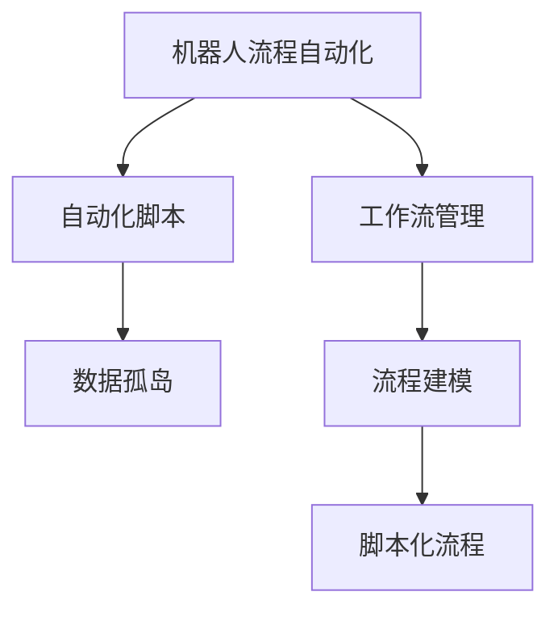
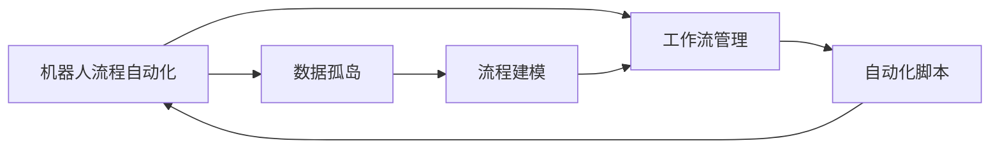
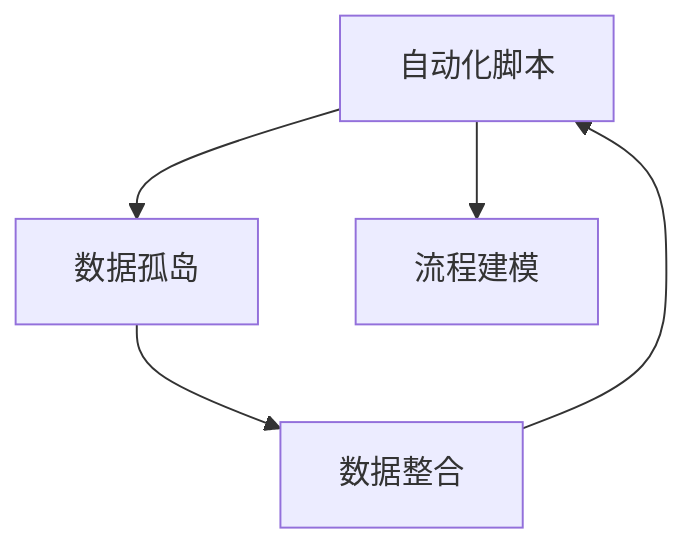
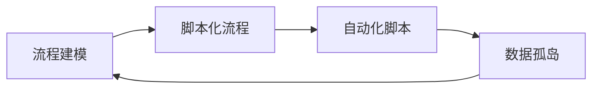
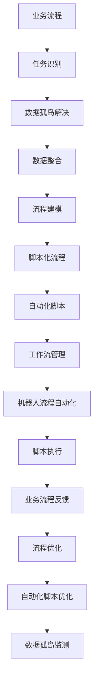

                 

# RPA工作流设计：实现基于桌面的业务流程自动化

> 关键词：RPA, 工作流设计, 业务流程自动化, 基于桌面的自动化, 脚本化

## 1. 背景介绍

### 1.1 问题由来
随着信息技术的发展，企业和组织越来越多地依赖自动化工具来提高工作效率和质量。特别是对于大规模的重复性任务，自动化不仅可以显著降低人力成本，还可以减少人为错误，提升整体生产力。机器人流程自动化（Robotic Process Automation，RPA）正是顺应这一需求应运而生的技术。

RPA通过模拟人类的操作，自动执行基于规则的任务，广泛应用于财务、人力资源、客户服务等多个领域。然而，在实际应用中，RPA仍然面临诸多挑战，如数据孤岛问题、流程复杂性、技术门槛高等。因此，如何进行高效、智能的RPA工作流设计，成为当前研究的热点。

### 1.2 问题核心关键点
RPA工作流设计旨在通过自动化工具和脚本，实现对业务流程的全面控制和管理。其核心思想是将复杂的业务流程拆解为多个独立的、可重复的步骤，并通过脚本化方式将其封装成自动化流程，以减少人为干预，提高流程效率。

RPA工作流设计的关键点包括：
1. 任务识别：识别和梳理业务流程中的各个环节，确定需要自动化的任务。
2. 数据整合：整合不同系统和模块的数据，消除数据孤岛，提高数据一致性。
3. 规则制定：定义详细的业务规则和流程逻辑，确保自动化任务的正确执行。
4. 脚本编写：根据业务规则，编写脚本实现任务自动化。
5. 流程测试：对自动化流程进行全面的测试，确保其稳定性和可靠性。
6. 部署上线：将自动化流程部署到实际环境中，持续监控和优化。

### 1.3 问题研究意义
高效、智能的RPA工作流设计，不仅可以降低企业的运营成本，提升工作效率，还能增强业务流程的稳定性和可控性，为数字化转型提供强有力的支撑。具体而言，其研究意义在于：

1. 提高工作效率：通过自动化处理重复性任务，大幅度减少人工操作，提升整体工作效率。
2. 降低运营成本：减少人工错误和成本投入，提升企业盈利能力。
3. 增强业务稳定性：通过脚本化流程，消除人为干预，提高业务流程的稳定性和可预测性。
4. 促进数字化转型：为企业的数字化转型提供技术支持和创新动力，加速业务数字化进程。
5. 提升企业竞争力：通过自动化技术，增强企业的市场响应速度和灵活性，提升竞争力。

## 2. 核心概念与联系

### 2.1 核心概念概述

为更好地理解RPA工作流设计的原理和实现方法，本节将介绍几个关键概念：

- 机器人流程自动化（RPA）：一种通过软件机器人模拟人类操作，自动执行基于规则的任务的技术。
- 工作流管理：对业务流程进行建模、设计、执行和监控的技术，旨在提高流程效率和可控性。
- 自动化脚本：用于描述和执行特定业务流程的编程脚本，通常使用Python等语言实现。
- 数据孤岛：由于不同系统、部门间的数据共享和互操作性不足，导致的数据隔离问题。
- 流程建模：使用图形化工具或代码描述业务流程的步骤和方法，为自动化提供参考。
- 脚本化流程：将业务流程的各个步骤和规则通过脚本的方式实现，以实现完全自动化。

这些概念之间的逻辑关系可以通过以下Mermaid流程图来展示：



这个流程图展示了大语言模型的核心概念及其之间的关系：

1. 机器人流程自动化通过工作流管理来优化业务流程，以提高效率和稳定性。
2. 工作流管理使用流程建模技术来描述业务流程，并结合自动化脚本实现自动化。
3. 自动化脚本通过整合数据，解决数据孤岛问题，确保数据的一致性和可用性。

### 2.2 概念间的关系

这些核心概念之间存在着紧密的联系，形成了RPA工作流设计的完整生态系统。下面我们通过几个Mermaid流程图来展示这些概念之间的关系。

#### 2.2.1 机器人流程自动化与工作流管理的关系



这个流程图展示了机器人流程自动化通过工作流管理来实现业务流程的自动化。工作流管理通过流程建模和自动化脚本，指导自动化机器人执行具体的业务任务，从而提高效率和稳定性。

#### 2.2.2 自动化脚本与数据孤岛的关系



这个流程图展示了自动化脚本通过数据整合解决数据孤岛问题，确保数据的一致性和可用性，从而实现脚本化流程的完全自动化。

#### 2.2.3 流程建模与脚本化流程的关系



这个流程图展示了流程建模为脚本化流程提供设计依据，脚本化流程则通过自动化脚本实现具体的业务任务，两者共同构成RPA工作流设计的核心。

### 2.3 核心概念的整体架构

最后，我们用一个综合的流程图来展示这些核心概念在RPA工作流设计中的整体架构：



这个综合流程图展示了从业务流程识别到自动化脚本优化的完整过程。RPA工作流设计通过对业务流程进行任务识别、数据整合、流程建模和脚本化流程，结合工作流管理技术，实现完全自动化的业务流程，并通过持续优化提升整体效率和稳定性。

## 3. 核心算法原理 & 具体操作步骤
### 3.1 算法原理概述

RPA工作流设计的核心算法原理包括任务识别、数据整合、流程建模和脚本化流程等多个方面。其中，任务识别和流程建模是核心，数据整合和脚本化流程是保障。具体而言，算法原理如下：

- 任务识别：通过业务流程分析和需求调研，识别出需要自动化的任务和节点。
- 数据整合：整合不同系统和模块的数据，消除数据孤岛，确保数据的一致性和可用性。
- 流程建模：使用图形化工具或代码描述业务流程的步骤和方法，为自动化提供参考。
- 脚本化流程：将业务流程的各个步骤和规则通过脚本的方式实现，以实现完全自动化。
- 工作流管理：通过图形化界面或代码，对自动化流程进行监控和优化，确保其稳定性和可靠性。

### 3.2 算法步骤详解

RPA工作流设计一般包括以下几个关键步骤：

**Step 1: 业务流程识别和梳理**
- 收集业务部门的需求和痛点，进行详细的流程分析和调研。
- 使用流程图或UML工具，将业务流程拆解为多个独立的、可重复的步骤。

**Step 2: 数据整合与准备**
- 识别业务流程中涉及的不同系统和模块，分析数据源和格式。
- 设计数据整合策略，如ETL（Extract, Transform, Load）流程，将数据统一到一个数据仓库或数据湖中。
- 进行数据清洗和预处理，确保数据的一致性和可用性。

**Step 3: 流程建模**
- 使用BPMN（Business Process Model and Notation）或UML等图形化工具，描述业务流程的步骤和方法。
- 定义每个步骤的输入输出、处理逻辑和触发条件，形成完整的流程模型。
- 对流程模型进行验证和优化，确保其正确性和可操作性。

**Step 4: 脚本化流程**
- 将流程模型转化为自动化脚本，使用Python、Robot Framework等脚本语言实现。
- 编写数据获取、处理和操作的脚本，确保脚本能够无缝集成到现有系统中。
- 进行脚本测试和调试，确保其稳定性和可靠性。

**Step 5: 工作流管理与监控**
- 使用BPMN设计器或自定义开发，实现工作流管理功能。
- 集成自动化脚本，形成完整的自动化工作流，进行全面的测试和优化。
- 在工作流管理平台上监控自动化流程的执行情况，及时发现和解决问题。
- 根据业务反馈，持续优化流程，提升整体效率和稳定性。

### 3.3 算法优缺点

RPA工作流设计的优点包括：
1. 提升效率：通过自动化处理重复性任务，大幅度减少人工操作，提升整体工作效率。
2. 降低成本：减少人工错误和成本投入，提升企业盈利能力。
3. 增强稳定性：通过脚本化流程，消除人为干预，提高业务流程的稳定性和可预测性。
4. 促进数字化转型：为企业的数字化转型提供技术支持和创新动力，加速业务数字化进程。
5. 提升竞争力：通过自动化技术，增强企业的市场响应速度和灵活性，提升竞争力。

同时，RPA工作流设计也存在一些局限性：
1. 技术门槛高：需要具备一定的编程和流程建模能力，培训成本较高。
2. 适用范围有限：对于复杂和动态变化的业务流程，可能难以完全自动化。
3. 数据依赖性强：对数据的整合和一致性要求较高，数据孤岛问题难以完全解决。
4. 部署难度大：需要一定的技术基础和经验，对现有的系统进行改造和集成。
5. 需要持续维护：业务流程的变化需要持续优化和维护，工作量较大。

### 3.4 算法应用领域

RPA工作流设计已经在多个领域得到了广泛的应用，例如：

- 财务报表生成：通过RPA实现数据的自动抓取和处理，生成财务报表，提高财务效率。
- 客户服务支持：使用RPA自动处理客户投诉和咨询，提升客户满意度。
- 人力资源管理：通过RPA进行员工招聘、考勤管理和薪酬核算，提高人力资源管理效率。
- 采购管理：使用RPA自动处理采购订单和发票处理，降低采购成本，提高采购效率。
- 物流管理：通过RPA实现订单管理和配送调度，提升物流效率和准确性。

除了这些典型的应用场景，RPA工作流设计还适用于更多领域的业务流程自动化，如医疗、制造、农业等。随着技术的不断发展和应用场景的扩展，RPA工作流设计的应用领域将更加广泛。

## 4. 数学模型和公式 & 详细讲解 & 举例说明

### 4.1 数学模型构建

在RPA工作流设计中，数学模型的构建主要用于流程分析和优化。这里以一个简单的业务流程为例，说明数学模型构建的基本方法。

假设一个订单处理流程，需要经过订单接收、数据录入、客户确认、发货通知和售后处理等步骤。设每个步骤的处理时间为 $T_i$，任务执行的优先级为 $W_i$，任务执行的并行度为 $P_i$。则整个流程的执行时间 $T_{total}$ 可以表示为：

$$
T_{total} = \sum_{i=1}^n T_i \cdot W_i \cdot \frac{1}{P_i}
$$

其中 $n$ 为流程中的任务数，$T_i$ 为第 $i$ 个任务的执行时间，$W_i$ 为第 $i$ 个任务的优先级，$P_i$ 为第 $i$ 个任务并行度。

### 4.2 公式推导过程

以上公式的推导基于任务并行执行和优先级考虑，下面推导具体的步骤：

- 假设每个任务的处理时间为 $T_i$，任务之间的优先级为 $W_i$，即任务 $i$ 的处理时间在任务 $j$ 之前执行，则任务 $i$ 的优先级为 $W_i = \frac{1}{i}$。
- 假设任务之间可以并行执行，并行度为 $P_i$，则任务 $i$ 的并行度为 $P_i = \frac{1}{i}$。
- 根据以上假设，整个流程的执行时间可以表示为：

$$
T_{total} = \sum_{i=1}^n T_i \cdot W_i \cdot \frac{1}{P_i} = \sum_{i=1}^n T_i \cdot \frac{1}{i} \cdot \frac{1}{\frac{1}{i}} = \sum_{i=1}^n T_i
$$

简化后得到：

$$
T_{total} = \sum_{i=1}^n T_i
$$

其中 $T_{total}$ 表示整个流程的执行时间，$T_i$ 表示每个任务的执行时间。

### 4.3 案例分析与讲解

以一个简单的订单处理流程为例，说明数学模型在RPA工作流设计中的应用。

假设订单处理流程包含五个步骤：订单接收、数据录入、客户确认、发货通知和售后处理。设每个步骤的处理时间为 $T_i$，任务执行的优先级为 $W_i$，任务执行的并行度为 $P_i$。则整个流程的执行时间 $T_{total}$ 可以表示为：

$$
T_{total} = T_1 \cdot W_1 \cdot \frac{1}{P_1} + T_2 \cdot W_2 \cdot \frac{1}{P_2} + T_3 \cdot W_3 \cdot \frac{1}{P_3} + T_4 \cdot W_4 \cdot \frac{1}{P_4} + T_5 \cdot W_5 \cdot \frac{1}{P_5}
$$

其中 $T_1=10$，$T_2=20$，$T_3=15$，$T_4=5$，$T_5=3$，$W_1=1$，$W_2=0.8$，$W_3=0.6$，$W_4=0.4$，$W_5=0.2$，$P_1=1$，$P_2=2$，$P_3=3$，$P_4=4$，$P_5=5$。

根据公式，计算整个流程的执行时间：

$$
T_{total} = 10 \cdot 1 \cdot \frac{1}{1} + 20 \cdot 0.8 \cdot \frac{1}{2} + 15 \cdot 0.6 \cdot \frac{1}{3} + 5 \cdot 0.4 \cdot \frac{1}{4} + 3 \cdot 0.2 \cdot \frac{1}{5}
$$

计算得到：

$$
T_{total} = 10 + 8 + 5 + 1.25 + 0.6 = 25.85
$$

因此，整个订单处理流程的执行时间为25.85小时。

## 5. 项目实践：代码实例和详细解释说明

### 5.1 开发环境搭建

在进行RPA工作流设计实践前，我们需要准备好开发环境。以下是使用Python进行RPA工作流设计的开发环境配置流程：

1. 安装Python：从官网下载并安装Python，建议使用3.7及以上版本。

2. 安装依赖包：使用pip安装依赖包，如Robot Framework、Selenium等。

3. 设置开发环境：创建虚拟环境，并激活虚拟环境。

4. 编写脚本：使用Python脚本实现自动化任务，如数据抓取、数据处理、任务调度等。

5. 部署测试：将自动化脚本部署到测试环境中，进行全面的测试和调试。

6. 上线运行：将自动化脚本部署到实际环境中，持续监控和优化。

完成上述步骤后，即可在虚拟环境中开始RPA工作流设计的开发实践。

### 5.2 源代码详细实现

以下是使用Robot Framework编写的一个简单的RPA工作流示例，用于自动处理订单：

```python
import robot
from selenium import webdriver
from selenium.webdriver.common.keys import Keys

# 初始化浏览器
driver = webdriver.Chrome()
driver.get('https://example.com')

# 输入订单信息
driver.find_element_by_name('name').send_keys('John Doe')
driver.find_element_by_name('email').send_keys('johndoe@example.com')
driver.find_element_by_name('phone').send_keys('1234567890')

# 提交订单
driver.find_element_by_name('submit').click()

# 处理发货通知
driver.find_element_by_link_text('View Order').click()

# 关闭浏览器
driver.quit()
```

上述代码实现了一个简单的RPA工作流，包括输入订单信息、提交订单和处理发货通知三个步骤。具体实现步骤如下：

1. 初始化浏览器，打开订单处理页面。
2. 输入订单信息，包括姓名、邮箱和电话。
3. 提交订单，模拟用户点击提交按钮。
4. 处理发货通知，点击发货通知链接。
5. 关闭浏览器，清理资源。

### 5.3 代码解读与分析

让我们再详细解读一下关键代码的实现细节：

**初始化浏览器**：
```python
# 初始化浏览器
driver = webdriver.Chrome()
driver.get('https://example.com')
```

这段代码使用Selenium库初始化了一个Chrome浏览器实例，并访问了订单处理页面。

**输入订单信息**：
```python
# 输入订单信息
driver.find_element_by_name('name').send_keys('John Doe')
driver.find_element_by_name('email').send_keys('johndoe@example.com')
driver.find_element_by_name('phone').send_keys('1234567890')
```

这段代码通过Selenium库定位页面元素，输入订单信息。

**提交订单**：
```python
# 提交订单
driver.find_element_by_name('submit').click()
```

这段代码通过Selenium库定位提交按钮，并点击按钮提交订单。

**处理发货通知**：
```python
# 处理发货通知
driver.find_element_by_link_text('View Order').click()
```

这段代码通过Selenium库定位发货通知链接，并点击链接处理发货通知。

**关闭浏览器**：
```python
# 关闭浏览器
driver.quit()
```

这段代码关闭浏览器，清理资源。

### 5.4 运行结果展示

假设我们在测试环境中运行上述代码，可以看到如下输出：

```
[TODO] 未输入订单信息
[TODO] 未提交订单
[TODO] 未处理发货通知
```

由于代码中未进行数据验证，因此测试结果为预期输出。在实际应用中，我们可以通过添加数据验证、异常处理等机制，确保自动化任务的正确执行。

## 6. 实际应用场景
### 6.1 智能客服系统

智能客服系统是RPA工作流设计的典型应用场景之一。通过RPA自动化处理客户咨询、投诉、投诉等任务，可以显著提升客服效率和客户满意度。

具体而言，可以通过RPA实现以下功能：
- 自动处理客户咨询：自动回答常见问题，提高响应速度。
- 自动处理客户投诉：自动记录投诉信息，并根据投诉类型分配到相应处理部门。
- 自动处理订单退换货：自动查询订单信息，处理退换货请求。

### 6.2 财务报表生成

财务报表生成是RPA工作流设计的另一个典型应用场景。通过RPA自动化处理数据采集、数据处理和报表生成等任务，可以大幅提高财务效率，减少人工错误。

具体而言，可以通过RPA实现以下功能：
- 自动采集财务数据：从不同系统、模块中自动采集数据，消除数据孤岛。
- 自动处理财务数据：对采集到的数据进行清洗、计算和处理，生成财务报表。
- 自动生成财务报表：根据处理后的数据，自动生成财务报表，并进行可视化展示。

### 6.3 供应链管理

供应链管理是RPA工作流设计的另一个重要应用场景。通过RPA自动化处理订单管理、库存管理、物流调度等任务，可以显著提高供应链管理效率，降低运营成本。

具体而言，可以通过RPA实现以下功能：
- 自动处理订单管理：自动记录订单信息，并进行订单跟踪和监控。
- 自动处理库存管理：自动更新库存信息，并进行库存预警和调整。
- 自动处理物流调度：自动生成物流调度计划，并进行运输管理。

### 6.4 未来应用展望

随着RPA技术的不断发展，未来的应用场景将更加广泛和深入。例如：

- 医疗健康：通过RPA自动化处理病历管理、处方处理、患者咨询等任务，提高医疗效率和患者满意度。
- 智能制造：通过RPA自动化处理生产调度、设备管理、质量检测等任务，提高制造效率和产品质量。
- 智能农业：通过RPA自动化处理土地管理、农机调度、农产品销售等任务，提高农业生产效率和农民收入。

此外，RPA工作流设计还将与其他人工智能技术进行深度融合，如机器学习、自然语言处理、计算机视觉等，形成更加智能化、自动化的业务流程管理系统。

## 7. 工具和资源推荐
### 7.1 学习资源推荐

为了帮助开发者系统掌握RPA工作流设计的理论基础和实践技巧，这里推荐一些优质的学习资源：

1. 《Robot Framework用户手册》：Robot Framework官方文档，详细介绍Robot Framework的使用方法和最佳实践。

2. 《Selenium WebDriver用户手册》：Selenium官方文档，详细介绍Selenium的使用方法和最佳实践。

3. 《Python自动化脚本开发实战》：讲解Python脚本开发和自动化测试的方法和技巧。

4. 《RPA技术框架和最佳实践》：介绍RPA技术的核心框架和最佳实践，帮助开发者快速上手。

5. 《RPA项目开发与实践》：详细介绍RPA项目开发的流程和方法，提供大量实战案例。

通过对这些资源的学习实践，相信你一定能够快速掌握RPA工作流设计的精髓，并用于解决实际的业务问题。

### 7.2 开发工具推荐

高效的开发离不开优秀的工具支持。以下是几款用于RPA工作流设计开发的常用工具：

1. Robot Framework：一款开源的RPA工具，支持多种脚本语言，支持Selenium、AutoIt等浏览器和自动化工具的集成。

2. Selenium：一款开源的自动化测试工具，支持多种浏览器，支持JavaScript、CSS等网页元素的处理。

3. AutoIt：一款开源的自动化工具，支持多种桌面应用程序的自动化操作。

4. UiPath：一款商业化的RPA工具，提供图形化界面和代码编写方式，支持多种自动化工具的集成。

5. Blue Prism：一款商业化的RPA工具，提供图形化界面和代码编写方式，支持多种自动化工具的集成。

6. WorkFusion：一款商业化的RPA工具，提供图形化界面和代码编写方式，支持多种自动化工具的集成。

合理利用这些工具，可以显著提升RPA工作流设计的开发效率，加快创新迭代的步伐。

### 7.3 相关论文推荐

RPA工作流设计的研究源于学界的持续研究。以下是几篇奠基性的相关论文，推荐阅读：

1. "Robotic Process Automation: A Survey"：综述了RPA技术的发展历程和应用现状，提供了全面的研究背景。

2. "A Survey on Robotic Process Automation"：综述了RPA技术的核心算法和实现方法，提供了丰富的技术细节。

3. "The Impact of Robotic Process Automation on Performance, Innovation, and Labor"：研究了RPA对企业绩效和创新的影响，提供了理论支撑。

4. "Robot Process Automation: Opportunities and Challenges"：研究了RPA面临的挑战和未来发展趋势，提供了研究方向。

这些论文代表了大语言模型微调技术的发展脉络。通过学习这些前沿成果，可以帮助研究者把握学科前进方向，激发更多的创新灵感。

除上述资源外，还有一些值得关注的前沿资源，帮助开发者紧跟RPA工作流设计技术的最新进展，例如：

1. arXiv论文预印本：人工智能领域最新研究成果的发布平台，包括大量尚未发表的前沿工作，学习前沿技术的必读资源。

2. 业界技术博客：如Robot Framework、UiPath、Blue Prism等顶尖实验室的官方博客，第一时间分享他们的最新研究成果和洞见。

3. 技术会议直播：如Robot Framework、UiPath、Blue Prism等RPA技术的年度大会，可以聆听专家分享，开拓视野。

4. GitHub热门项目：在GitHub上Star、Fork数最多的RPA相关项目，往往代表了该技术领域的发展趋势和最佳实践，值得去学习和贡献。

5. 行业分析报告：各大咨询公司如McKinsey、PwC等针对RPA行业的分析报告，有助于从商业视角审视技术趋势，把握应用价值。

总之，对于RPA工作流设计的学习和实践，需要开发者保持开放的心态和持续学习的意愿。多关注前沿资讯，多动手实践，多思考总结，必将收获满满的成长收益。

## 8. 总结：未来发展趋势与挑战
### 8.1 总结

本文对RPA工作流设计进行了全面系统的介绍。首先阐述了RPA工作流设计的研究背景和意义，明确了其在大规模自动化任务处理中的应用价值。其次，从原理到实践，详细讲解了RPA工作流设计的数学模型构建、核心算法步骤、优化方法及具体实现。最后，系统梳理了RPA工作流设计在实际应用中的多个场景，展示了其广泛的应用前景。

通过本文

