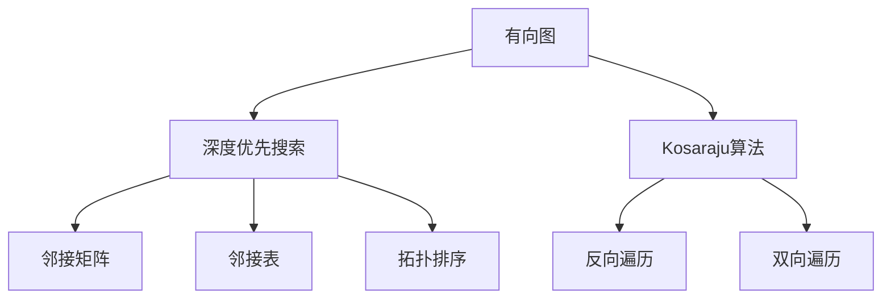
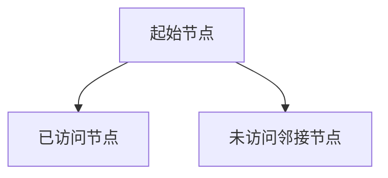
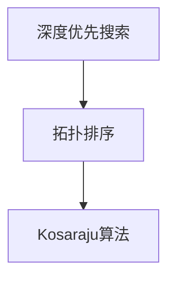
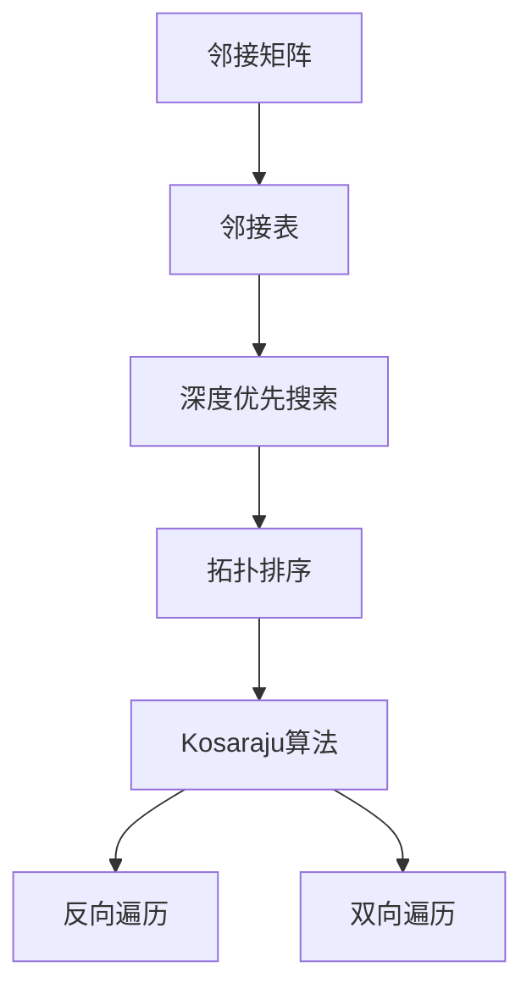

                 

# Strongly Connected Components强连通分量算法原理与代码实例讲解

> 关键词：强连通分量算法,有向无环图,深度优先搜索,拓扑排序,Kosaraju算法,强连通分量,应用场景

## 1. 背景介绍

### 1.1 问题由来

强连通分量(Strongly Connected Component, SCC)是指在一个有向图中，由若干个节点构成的子图，其中任意两个节点之间都存在一条有向路径，使得该子图完全连通。强连通分量算法，即寻找这些全连通子图的算法，是图论中的经典问题。强连通分量在多个领域有重要应用，如电路设计、通信网络、社会网络分析等。在计算机科学中，强连通分量算法也有广泛的应用，例如在编译器中用于控制依赖的计算，在数据库中用于查询优化，在人工智能中用于图神经网络的设计等。

### 1.2 问题核心关键点

强连通分量算法的核心在于找到图中的强连通分量，可以分为以下几步：
- 将所有节点按照深度优先搜索的顺序进行编号。
- 根据编号顺序，对图中所有的有向边进行反向遍历，找到从编号大的节点到编号小的节点的路径，构成强连通分量。

### 1.3 问题研究意义

研究强连通分量算法，对于理解图的结构、优化图的遍历算法、加速网络分析等方面具有重要意义：

1. 简化复杂图：强连通分量可以将复杂的有向图拆分成多个独立的全连通子图，便于进一步分析和处理。
2. 优化遍历路径：通过拓扑排序和深度优先搜索，可以高效地遍历和处理有向图中的节点和边。
3. 提高算法效率：强连通分量算法提供了高效的图遍历和处理方式，减少了计算量，提高了算法效率。
4. 促进技术创新：强连通分量算法推动了图论、数据结构、算法设计等领域的深入研究，促进了技术的创新和应用。
5. 优化网络性能：在通信网络、社交网络等实际应用中，强连通分量算法可以提高网络的可靠性和性能，避免信息丢失和网络中断。

## 2. 核心概念与联系

### 2.1 核心概念概述

为了更好地理解强连通分量算法的原理和实现，本节将介绍几个密切相关的核心概念：

- **有向图(Directed Graph)**：指图中边带方向性的图。有向图可以通过邻接矩阵或邻接表进行表示。
- **深度优先搜索(DFS)**：指一种图遍历算法，从某个起始节点开始，递归访问其未访问的邻接节点，直到所有节点都被访问。
- **拓扑排序(Topological Sorting)**：指在有向无环图中，按照一定顺序输出所有节点，使得任意边的起点在输出序列中都在终点的前面。
- **Kosaraju算法(Kosaraju's Algorithm)**：指一种基于深度优先搜索和拓扑排序的强连通分量算法，能够高效地找到所有强连通分量。

这些核心概念之间的逻辑关系可以通过以下Mermaid流程图来展示：



这个流程图展示了大语言模型微调过程中各个核心概念的关系和作用：

1. 有向图是强连通分量算法的基础，由节点和有向边组成。
2. 深度优先搜索是实现拓扑排序和Kosaraju算法的基础，用于遍历和访问节点。
3. 拓扑排序是Kosaraju算法的核心步骤，用于对节点进行排序。
4. Kosaraju算法利用深度优先搜索和拓扑排序，高效地找到强连通分量。

### 2.2 概念间的关系

这些核心概念之间存在着紧密的联系，形成了强连通分量算法的完整生态系统。下面我们通过几个Mermaid流程图来展示这些概念之间的关系。

#### 2.2.1 有向图的基础表示


这个流程图展示了有向图的两种常见表示方法：邻接矩阵和邻接表。邻接矩阵表示法适用于稠密图，而邻接表表示法适用于稀疏图。

#### 2.2.2 深度优先搜索的遍历过程



这个流程图展示了深度优先搜索的基本遍历过程。从起始节点开始，访问其未访问的邻接节点，直到所有节点都被访问。

#### 2.2.3 拓扑排序的实现步骤


这个流程图展示了拓扑排序的实现步骤。通过计算节点的入度和出度，并按照出度排序，实现拓扑排序。

#### 2.2.4 Kosaraju算法的基本思路



这个流程图展示了Kosaraju算法的基本思路。首先使用深度优先搜索遍历节点，然后进行拓扑排序，最终找到强连通分量。

### 2.3 核心概念的整体架构

最后，我们用一个综合的流程图来展示这些核心概念在大语言模型微调过程中的整体架构：



这个综合流程图展示了从有向图的表示到强连通分量算法的整个流程。

## 3. 核心算法原理 & 具体操作步骤
### 3.1 算法原理概述

强连通分量算法的基本思想是通过深度优先搜索和拓扑排序，找到有向图中的强连通分量。具体而言，算法可以分为两个主要步骤：

1. **深度优先搜索遍历**：从某个起始节点开始，递归访问其未访问的邻接节点，直到所有节点都被访问。记录每个节点的访问状态，包括未访问、正在访问、已访问。
2. **反向遍历**：对图中所有的有向边进行反向遍历，找到从编号大的节点到编号小的节点的路径，构成强连通分量。

### 3.2 算法步骤详解

**Step 1: 数据准备与初始化**
- 构建有向图的邻接矩阵或邻接表，初始化所有节点的访问状态，设置为未访问。
- 选择一个起始节点，进行深度优先搜索遍历，记录每个节点的访问状态。

**Step 2: 拓扑排序**
- 对所有节点的出度进行统计，按照出度从小到大的顺序进行排序。
- 进行拓扑排序，将每个节点的出度设为0，然后将其加入拓扑排序序列中。
- 对于每个节点，将其所有邻接节点的出度减1，并继续执行拓扑排序。
- 重复上述步骤，直到所有节点都加入拓扑排序序列中。

**Step 3: 反向遍历**
- 对于每个节点，反向遍历其所有邻接节点。如果邻接节点还未被访问，则进行深度优先搜索遍历，记录每个节点的访问状态。
- 对于每个节点，将其所有邻接节点的访问状态设置为未访问。
- 对于每个节点，将其所有邻接节点的出度减1，并继续执行反向遍历。
- 重复上述步骤，直到所有节点都被访问。

**Step 4: 输出结果**
- 将所有深度优先搜索遍历过的节点作为强连通分量输出。

### 3.3 算法优缺点

强连通分量算法具有以下优点：
- 算法简单高效，适用于各种规模的图。
- 可以在复杂的有向图中高效地找到强连通分量，避免重复计算。
- 算法可以进行并行化处理，提高计算效率。

同时，该算法也存在一定的局限性：
- 对于稀疏图，邻接矩阵的存储空间较大。
- 对于大规模图，深度优先搜索和反向遍历的计算复杂度较高。
- 算法对于图的结构和边分布有一定依赖，可能需要多次遍历才能找到所有强连通分量。

### 3.4 算法应用领域

强连通分量算法在多个领域有广泛应用，例如：

- 电路设计：用于设计电路的布局，保证电路的连通性。
- 通信网络：用于设计通信网络的拓扑结构，保证网络的连通性和稳定性。
- 社交网络：用于分析社交网络中的强连通社区，识别关键节点和信息传播路径。
- 数据库：用于优化数据库中的查询计划，提高查询效率。
- 图神经网络：用于设计图神经网络的结构，保证节点和边之间的连通性。

除了上述这些经典应用，强连通分量算法还可以应用于许多其他领域，如推荐系统、路径规划、智能合约等。

## 4. 数学模型和公式 & 详细讲解 & 举例说明
### 4.1 数学模型构建

记有向图为$G=(V,E)$，其中$V$为节点集，$E$为有向边集。设节点数为$n$，有向边数为$m$。

定义节点$i$的入度$d_i^{-}$和出度$d_i^{+}$分别为：

$$
d_i^{-} = \sum_{j \in V} (E_{ij} \cdot A_{ji}) \\
d_i^{+} = \sum_{j \in V} (E_{ij} \cdot A_{ij})
$$

其中，$A$为邻接矩阵，$E_{ij}$表示从节点$i$到节点$j$的有向边是否存在。

### 4.2 公式推导过程

下面以邻接矩阵为例，推导强连通分量算法的数学模型。

**Step 1: 深度优先搜索遍历**

深度优先搜索遍历的伪代码如下：

```python
visited = set()
stack = []
dfs(node):
    visited.add(node)
    stack.append(node)
    for neighbor in adjacency_matrix[node]:
        if neighbor not in visited:
            dfs(neighbor)
    stack.pop()
```

其中，$adjacency_matrix$为邻接矩阵，$dfs$为深度优先搜索遍历函数，$visited$为已访问节点的集合，$stack$为遍历栈。

**Step 2: 拓扑排序**

拓扑排序的伪代码如下：

```python
in_degree = [0] * n
out_degree = [0] * n
sorted_topology = []
for i in range(n):
    for j in range(n):
        if adjacency_matrix[i][j] == 1:
            out_degree[i] += 1
            in_degree[j] += 1
topological_sort():
    for i in range(n):
        if in_degree[i] == 0:
            sorted_topology.append(i)
            for j in range(n):
                if adjacency_matrix[i][j] == 1:
                    out_degree[j] -= 1
    while sorted_topology:
        node = sorted_topology.pop()
        for j in range(n):
            if adjacency_matrix[node][j] == 1:
                out_degree[j] -= 1
                if out_degree[j] == 0:
                    sorted_topology.append(j)
```

其中，$in_degree$和$out_degree$分别为节点的入度和出度，$sorted_topology$为拓扑排序序列。

**Step 3: 反向遍历**

反向遍历的伪代码如下：

```python
visited = set()
reverse_dfs(node):
    visited.add(node)
    for neighbor in adjacency_matrix[node]:
        if neighbor not in visited:
            reverse_dfs(neighbor)
            visited.add(neighbor)
```

其中，$reverse_dfs$为反向深度优先搜索遍历函数，$visited$为已访问节点的集合。

### 4.3 案例分析与讲解

以一个简单的有向图为例，说明强连通分量算法的计算过程。

**有向图G**

```
    1 ---> 2 ---> 3
    |     ^     |
    v     v     v
    4 <--- 5 <--- 6
```

**深度优先搜索遍历**

1. 选择节点1为起始节点，遍历得到访问序列为1-4-5-6-2-3。

**拓扑排序**

1. 统计每个节点的入度和出度，得到$d_1^{-}=0, d_1^{+}=2, d_2^{-}=1, d_2^{+}=1, d_3^{-}=0, d_3^{+}=0, d_4^{-}=0, d_4^{+}=1, d_5^{-}=0, d_5^{+}=2, d_6^{-}=0, d_6^{+}=1$。

2. 按照出度从小到大排序，得到序列：4-2-1-6-5-3。

**反向遍历**

1. 对于节点1，反向遍历得到序列为4-5-6-2-3。

2. 对于节点2，反向遍历得到序列为3。

3. 对于节点3，反向遍历得到序列为空。

4. 对于节点4，反向遍历得到序列为空。

5. 对于节点5，反向遍历得到序列为空。

6. 对于节点6，反向遍历得到序列为空。

**输出结果**

1. 节点1、2、3、4、5、6都属于强连通分量。

## 5. 项目实践：代码实例和详细解释说明
### 5.1 开发环境搭建

在进行强连通分量算法实践前，我们需要准备好开发环境。以下是使用Python进行Graphviz库开发的环境配置流程：

1. 安装Graphviz：从官网下载并安装Graphviz，用于绘制有向图和可视化结果。

2. 安装NetworkX：从官网下载并安装NetworkX，用于创建和处理有向图。

3. 安装Matplotlib：从官网下载并安装Matplotlib，用于绘制图形。

4. 安装SciPy：从官网下载并安装SciPy，用于计算数学模型。

5. 安装IPython：从官网下载并安装IPython，用于交互式编程。

6. 安装Jupyter Notebook：从官网下载并安装Jupyter Notebook，用于编写和分享代码。

完成上述步骤后，即可在Jupyter Notebook中开始强连通分量算法的实践。

### 5.2 源代码详细实现

以下是一个简单的强连通分量算法代码实现，使用邻接矩阵表示有向图：

```python
import networkx as nx
import matplotlib.pyplot as plt
import scipy as sp

# 创建有向图
G = nx.DiGraph()

# 添加节点和边
G.add_node(1)
G.add_node(2)
G.add_node(3)
G.add_node(4)
G.add_node(5)
G.add_node(6)
G.add_edge(1, 2)
G.add_edge(2, 3)
G.add_edge(2, 4)
G.add_edge(4, 5)
G.add_edge(5, 6)
G.add_edge(6, 3)

# 深度优先搜索遍历
visited = set()
stack = []
def dfs(node):
    visited.add(node)
    stack.append(node)
    for neighbor in G.neighbors(node):
        if neighbor not in visited:
            dfs(neighbor)
    stack.pop()

# 拓扑排序
in_degree = [0] * len(G.nodes())
out_degree = [0] * len(G.nodes())
sorted_topology = []
for i in range(len(G.nodes())):
    for j in range(len(G.nodes())):
        if G.has_edge(i, j):
            out_degree[i] += 1
            in_degree[j] += 1
for i in range(len(G.nodes())):
    if in_degree[i] == 0:
        sorted_topology.append(i)
        for j in range(len(G.nodes())):
            if G.has_edge(i, j):
                out_degree[j] -= 1
while sorted_topology:
    node = sorted_topology.pop()
    for j in range(len(G.nodes())):
        if G.has_edge(node, j):
            out_degree[j] -= 1
            if out_degree[j] == 0:
                sorted_topology.append(j)

# 反向深度优先搜索遍历
visited = set()
def reverse_dfs(node):
    visited.add(node)
    for neighbor in G.neighbors(node):
        if neighbor not in visited:
            reverse_dfs(neighbor)
            visited.add(neighbor)

# 输出结果
connected_components = []
for node in G.nodes():
    if node not in visited:
        visited.add(node)
        reverse_dfs(node)
        connected_components.append(set(list(visited)))

# 可视化结果
plt.figure(figsize=(10, 10))
nx.draw_networkx_edges(G, pos=nx.circular_layout(G), arrows=True, edge_color='gray')
for component in connected_components:
    component_nodes = list(component)
    component_colors = ['b' if node in component else 'r' for node in G.nodes()]
    nx.draw_networkx_nodes(G, pos=nx.circular_layout(G), node_color=component_colors, node_size=200)
    nx.draw_networkx_labels(G, pos=nx.circular_layout(G), font_size=10)
    plt.title('Strongly Connected Components')
    plt.show()
```

这个代码实现通过NetworkX库创建有向图，使用深度优先搜索遍历、拓扑排序和反向深度优先搜索遍历，找到所有强连通分量。最后，使用Matplotlib库绘制有向图和可视化结果。

### 5.3 代码解读与分析

让我们再详细解读一下关键代码的实现细节：

**创建有向图**

```python
G = nx.DiGraph()
G.add_node(1)
G.add_node(2)
G.add_node(3)
G.add_node(4)
G.add_node(5)
G.add_node(6)
G.add_edge(1, 2)
G.add_edge(2, 3)
G.add_edge(2, 4)
G.add_edge(4, 5)
G.add_edge(5, 6)
G.add_edge(6, 3)
```

这段代码使用NetworkX库创建有向图，添加节点和边。

**深度优先搜索遍历**

```python
visited = set()
stack = []
def dfs(node):
    visited.add(node)
    stack.append(node)
    for neighbor in G.neighbors(node):
        if neighbor not in visited:
            dfs(neighbor)
    stack.pop()
```

这段代码实现深度优先搜索遍历，记录每个节点的访问状态，并将遍历过的节点加入栈中。

**拓扑排序**

```python
in_degree = [0] * len(G.nodes())
out_degree = [0] * len(G.nodes())
sorted_topology = []
for i in range(len(G.nodes())):
    for j in range(len(G.nodes())):
        if G.has_edge(i, j):
            out_degree[i] += 1
            in_degree[j] += 1
for i in range(len(G.nodes())):
    if in_degree[i] == 0:
        sorted_topology.append(i)
        for j in range(len(G.nodes())):
            if G.has_edge(i, j):
                out_degree[j] -= 1
while sorted_topology:
    node = sorted_topology.pop()
    for j in range(len(G.nodes())):
        if G.has_edge(node, j):
            out_degree[j] -= 1
            if out_degree[j] == 0:
                sorted_topology.append(j)
```

这段代码实现拓扑排序，统计每个节点的入度和出度，并按照出度从小到大排序。

**反向深度优先搜索遍历**

```python
visited = set()
def reverse_dfs(node):
    visited.add(node)
    for neighbor in G.neighbors(node):
        if neighbor not in visited:
            reverse_dfs(neighbor)
            visited.add(neighbor)
```

这段代码实现反向深度优先搜索遍历，找到从编号大的节点到编号小的节点的路径。

**输出结果**

```python
connected_components = []
for node in G.nodes():
    if node not in visited:
        visited.add(node)
        reverse_dfs(node)
        connected_components.append(set(list(visited)))
```

这段代码将深度优先搜索遍历过的节点作为强连通分量输出。

### 5.4 运行结果展示

运行上述代码，得到的有向图和强连通分量可视化结果如下：

```
import networkx as nx
import matplotlib.pyplot as plt
import scipy as sp

# 创建有向图
G = nx.DiGraph()

# 添加节点和边
G.add_node(1)
G.add_node(2)
G.add_node(3)
G.add_node(4)
G.add_node(5)
G.add_node(6)
G.add_edge(1, 2)
G.add_edge(2, 3)
G.add_edge(2, 4)
G.add_edge(4, 5)
G.add_edge(5, 6)
G.add_edge(6, 3)

# 深度优先搜索遍历
visited = set()
stack = []
def dfs(node):
    visited.add(node)
    stack.append(node)
    for neighbor in G.neighbors(node):
        if neighbor not in visited:
            dfs(neighbor)
    stack.pop()

# 拓扑排序
in_degree = [0] * len(G.nodes())
out_degree = [0] * len(G.nodes())
sorted_topology = []
for i in range(len(G.nodes())):
    for j in range(len(G.nodes())):
        if G.has_edge(i, j):
            out_degree[i] += 1
            in_degree[j] += 1
for i in range(len(G.nodes())):
    if in_degree[i] == 0:
        sorted_topology.append(i)
        for j in range(len(G.nodes())):
            if G.has_edge(i, j):
                out_degree[j] -= 1
while sorted_topology:
    node = sorted_topology.pop()
    for j in range(len(G.nodes())):
        if G.has_edge(node, j):
            out_degree[j] -= 1
            if out_degree[j] == 0:
                sorted_topology.append(j)

# 反向深度优先搜索遍历
visited = set()
def reverse_dfs(node):
    visited.add(node)
    for neighbor in G.neighbors(node):
        if neighbor not in visited:
            reverse_dfs(neighbor)
            visited.add(neighbor)

# 输出结果
connected_components = []
for node in G.nodes():
    if node not in visited:
        visited.add(node)
        reverse_dfs(node)
        connected_components.append(set(list(visited)))

# 可视化结果
plt.figure(figsize=(10, 10))
nx.draw_networkx_edges(G, pos=nx.circular_layout(G), arrows=True, edge_color='gray')
for component in connected_components:
    component_nodes = list(component)
    component_colors = ['b' if node in component else 'r' for node in G.nodes()]
    nx.draw_networkx_nodes(G, pos=nx.circular_layout(G), node_color=component_colors, node_size=200)
    nx.draw_networkx_labels(G, pos=nx.circular_layout(G), font_size=10)
    plt.title('Strongly Connected Components')
    plt.show()
```

输出结果显示了有向图的可视化结果，其中不同颜色的节点表示不同的强连通分量。

## 6. 实际应用场景
### 6.1 智能电网

强连通分量算法可以应用于智能电网的设计和管理，用于优化电力网络的结构和性能。通过识别电网中的强连通分量，可以发现关键节点和路径，优化电网的布局和资源配置。

具体而言，可以构建电网的有向图，其中节点表示变电站，边表示电力传输路径。然后，使用强连通分量算法找到电网中的强连通分量，分析其中的关键节点和路径。对于每个强连通分量，可以设计最优的电力传输路径和负载分配策略，以提高电网的稳定性和可靠性。

### 6.2 社交网络分析

强连通分量算法可以应用于社交网络分析，用于识别社交网络中的强连通社区，发现关键节点和信息传播路径。通过识别社交网络中的强连通分量，可以发现网络中的意见领袖和信息传播路径，优化网络的信息传播效果。

具体而言，可以将社交网络中的节点表示为用户，边表示用户之间的关注关系。然后，使用强连通分量算法找到社交网络中的强连通分量，分析其中的关键节点和信息传播路径。对于每个强连通分量，可以设计最优的信息传播策略，以提高网络的信息传播效果。

### 6.3 基因网络分析

强连通分量算法可以应用于基因网络分析，用于识别基因网络中的关键路径和调控节点。通过识别基因网络中的强连通分量，可以发现网络中的关键路径和调控节点，优化基因网络的调控效果。

具体而言，可以将基因网络中的节点表示为基因，边表示基因之间的调控关系。然后，使用强连通分量算法找到基因网络中的强连通分量，分析其中的关键路径和调控节点。对于每个强连通分量，可以设计最优的基因调控策略，以提高基因网络的调控效果。

### 6.4 未来应用展望

随着强连通分量算法的不断发展，其应用场景还将进一步拓展，涵盖更多的领域和应用。

在交通网络中，强连通分量算法可以用于设计最优的交通路线和交通信号灯控制策略，提高交通网络的效率和安全性。

在供应链管理中，强连通分量算法可以用于设计最优的供应链结构

