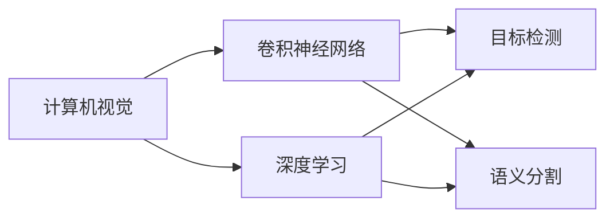
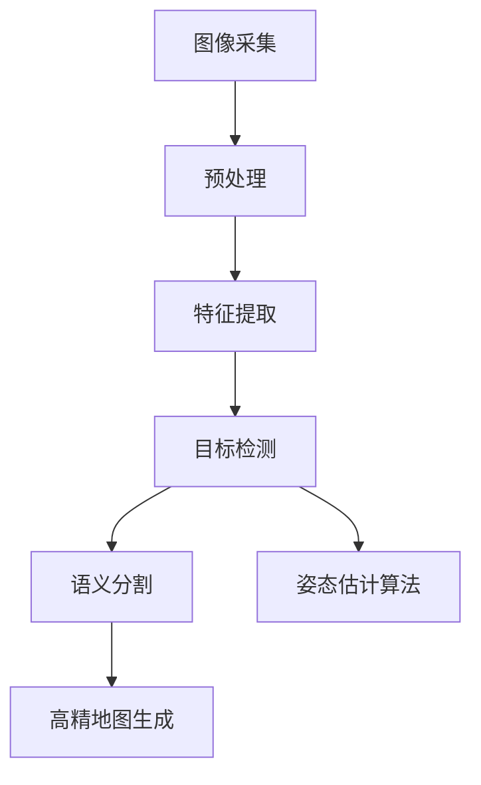
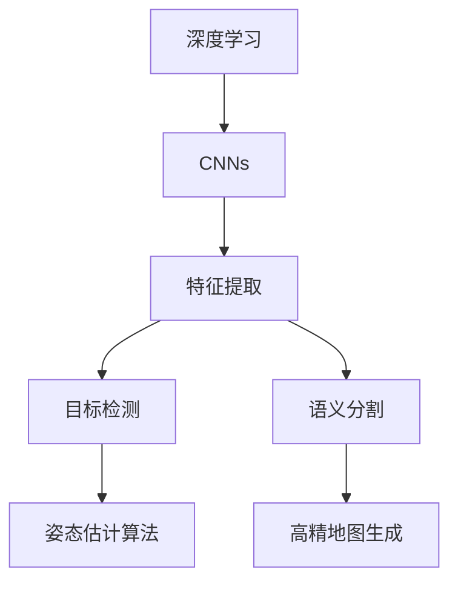
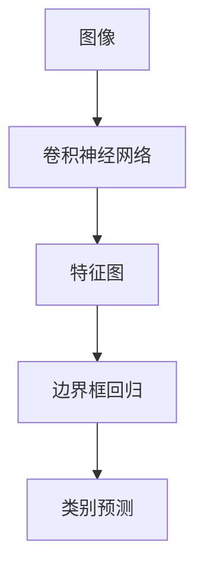
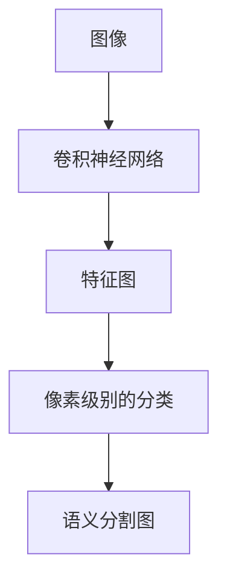
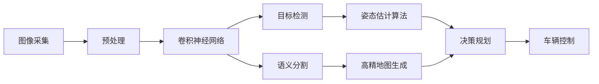

                 

# Tesla 自动驾驶项目的计算机视觉团队

## 1. 背景介绍

特斯拉（Tesla）作为全球领先的电动汽车公司，其自动驾驶技术一直备受关注。自动驾驶技术的核心之一是计算机视觉系统，能够帮助车辆在复杂多变的环境中识别道路、交通标志、车辆、行人等重要信息。特斯拉的计算机视觉团队主要由计算机视觉专家、深度学习工程师、系统架构师等组成，致力于通过最新的计算机视觉技术和算法，提升自动驾驶系统的性能和安全性。

计算机视觉技术的快速发展和深度学习算法的不断进步，使得自动驾驶系统在感知、决策和控制等方面都取得了显著的突破。本文将详细介绍特斯拉自动驾驶项目中的计算机视觉团队，包括其核心概念、算法原理、具体操作步骤、数学模型构建、项目实践和实际应用场景等。

## 2. 核心概念与联系

### 2.1 核心概念概述

在特斯拉的自动驾驶系统中，计算机视觉技术扮演着至关重要的角色。以下是计算机视觉团队常用的几个核心概念：

- **计算机视觉（Computer Vision）**：指通过计算机技术和算法，使计算机能够“看懂”图像和视频，识别其中的对象、场景和动作。计算机视觉技术是自动驾驶系统感知环境的基础。

- **深度学习（Deep Learning）**：一种基于神经网络的机器学习方法，能够自动提取输入数据的特征，并用于分类、检测、分割等任务。深度学习在计算机视觉中得到了广泛应用。

- **卷积神经网络（Convolutional Neural Networks, CNNs）**：一种特殊类型的深度神经网络，适用于处理图像和视频数据。CNNs通过卷积和池化操作，提取输入数据的局部特征，最终进行分类、检测等任务。

- **目标检测（Object Detection）**：指在图像或视频中定位并识别出特定目标的过程。目标检测技术是自动驾驶系统中车道线、交通标志、车辆、行人等识别任务的核心。

- **语义分割（Semantic Segmentation）**：指将图像中的每个像素分配到预定义的语义类别（如道路、行人、建筑）中的过程。语义分割在自动驾驶系统中用于生成高精度的地图和路径规划。

这些核心概念共同构成了特斯拉自动驾驶系统中计算机视觉技术的基础。以下是一个Mermaid流程图，展示了这些概念之间的关系：



### 2.2 概念间的关系

上述核心概念之间存在着紧密的联系，形成了特斯拉自动驾驶系统中计算机视觉技术的完整生态系统。下面通过几个Mermaid流程图来展示这些概念之间的关系。

#### 2.2.1 计算机视觉的核心技术栈



这个流程图展示了计算机视觉技术栈的基本流程：首先采集图像，然后进行预处理、特征提取、目标检测、语义分割等步骤，最后生成高精地图。这些步骤紧密关联，共同完成了对环境的感知和理解。

#### 2.2.2 深度学习在计算机视觉中的应用



这个流程图展示了深度学习在计算机视觉中的应用，即通过卷积神经网络提取图像特征，并用于目标检测、语义分割等任务。深度学习通过自动学习特征，显著提升了计算机视觉系统的性能。

#### 2.2.3 目标检测的算法流程



这个流程图展示了目标检测的基本流程：首先通过卷积神经网络提取图像特征，然后通过边界框回归和类别预测生成目标检测结果。目标检测算法通常采用两阶段方法，如Faster R-CNN，或者单阶段方法，如YOLO。

#### 2.2.4 语义分割的算法流程



这个流程图展示了语义分割的基本流程：首先通过卷积神经网络提取图像特征，然后进行像素级别的分类，最后生成语义分割图。语义分割算法通常采用全卷积神经网络（FCN）或U-Net等架构。

### 2.3 核心概念的整体架构

最后，我们用一个综合的流程图来展示这些核心概念在大规模自动驾驶系统中的整体架构：



这个综合流程图展示了从图像采集到车辆控制的完整流程。通过计算机视觉技术，车辆可以感知环境，进行目标检测、语义分割、姿态估计算法等处理，生成高精地图，进而进行决策规划和车辆控制。

## 3. 核心算法原理 & 具体操作步骤

### 3.1 算法原理概述

特斯拉的自动驾驶系统中的计算机视觉算法主要基于深度学习，特别是卷积神经网络（CNNs）。CNNs通过卷积、池化、全连接等操作，提取图像特征，并用于目标检测、语义分割等任务。以下简要介绍CNNs的基本原理：

1. **卷积层（Convolutional Layer）**：通过卷积操作提取图像的局部特征，卷积核在输入图像上滑动，计算每个位置上的特征值。

2. **池化层（Pooling Layer）**：通过池化操作降低特征图的空间分辨率，减少计算量和参数数量。常见的池化操作包括最大池化和平均池化。

3. **激活函数（Activation Function）**：通过非线性激活函数引入非线性，增加网络的表达能力。常用的激活函数包括ReLU、Sigmoid、Tanh等。

4. **全连接层（Fully Connected Layer）**：将特征图展平，送入全连接层进行分类或回归等任务。

5. **损失函数（Loss Function）**：用于衡量模型预测与真实标签之间的差异，常用的损失函数包括交叉熵损失、均方误差损失等。

### 3.2 算法步骤详解

特斯拉的计算机视觉算法通常包括以下几个步骤：

1. **数据采集与预处理**：从车载摄像头、激光雷达等设备中采集图像和点云数据，并进行预处理，如归一化、去噪、裁剪等操作。

2. **特征提取**：通过卷积神经网络提取图像的局部特征，生成高层次的语义信息。

3. **目标检测**：通过目标检测算法在图像中定位并识别出特定的目标，如车道线、交通标志、车辆、行人等。

4. **语义分割**：通过语义分割算法将图像中的每个像素分配到预定义的语义类别中，生成高精度的地图和路径规划。

5. **姿态估计算法**：通过深度学习方法估计车辆、行人等目标的姿态和运动状态，用于决策和控制。

6. **决策规划**：通过计算机视觉和传感器融合技术，生成路径规划和驾驶策略。

7. **车辆控制**：根据决策规划结果，控制车辆的加速、转向、制动等操作，实现自动驾驶。

### 3.3 算法优缺点

特斯拉的计算机视觉算法具有以下优点：

1. **精度高**：通过深度学习技术，能够自动学习图像特征，提取高层次的语义信息，从而实现高精度的目标检测和语义分割。

2. **鲁棒性强**：深度学习算法能够处理多种光照、天气、遮挡等复杂条件下的图像数据，具有较好的鲁棒性。

3. **适应性强**：深度学习模型能够适应不同尺寸、分辨率的图像数据，具备较强的适应能力。

4. **实时性好**：通过优化算法和硬件加速，能够实现实时图像处理和决策计算。

5. **扩展性强**：深度学习模型可以通过迁移学习等技术，方便地进行新任务的适配。

然而，这些算法也存在一些缺点：

1. **计算量大**：深度学习模型需要大量的计算资源和存储空间，对于自动驾驶系统来说，计算负担较大。

2. **训练数据需求高**：深度学习模型需要大量的标注数据进行训练，获取高质量标注数据成本较高。

3. **可解释性不足**：深度学习模型通常是“黑盒”系统，难以解释其内部决策过程，缺乏可解释性。

4. **安全性问题**：深度学习模型可能会受到对抗样本攻击，导致错误的决策和控制。

### 3.4 算法应用领域

特斯拉的计算机视觉算法主要应用于以下几个领域：

1. **自动驾驶感知**：通过计算机视觉技术，感知和理解复杂多变的环境，实现车辆、行人、道路等目标的检测和识别。

2. **高精地图生成**：通过语义分割技术，生成高精度的地图数据，用于路径规划和导航。

3. **姿态估计算法**：通过深度学习算法，估计车辆、行人等目标的姿态和运动状态，用于决策和控制。

4. **车路协同**：通过计算机视觉技术，实现车路协同感知，提高行车安全性和效率。

5. **智能辅助驾驶**：通过计算机视觉技术，实现智能辅助驾驶，如自动泊车、自动变道等。

6. **自动驾驶硬件加速**：通过GPU、TPU等硬件加速技术，实现深度学习算法的实时处理和推理。

## 4. 数学模型和公式 & 详细讲解 & 举例说明

### 4.1 数学模型构建

特斯拉的计算机视觉算法通常采用深度学习框架进行实现，如TensorFlow、PyTorch等。以下以CNNs为例，构建一个简单的图像分类模型：

```python
import tensorflow as tf

# 定义模型结构
model = tf.keras.Sequential([
    tf.keras.layers.Conv2D(32, (3, 3), activation='relu', input_shape=(224, 224, 3)),
    tf.keras.layers.MaxPooling2D((2, 2)),
    tf.keras.layers.Conv2D(64, (3, 3), activation='relu'),
    tf.keras.layers.MaxPooling2D((2, 2)),
    tf.keras.layers.Conv2D(128, (3, 3), activation='relu'),
    tf.keras.layers.MaxPooling2D((2, 2)),
    tf.keras.layers.Flatten(),
    tf.keras.layers.Dense(128, activation='relu'),
    tf.keras.layers.Dense(10, activation='softmax')
])

# 定义损失函数
loss_fn = tf.keras.losses.SparseCategoricalCrossentropy(from_logits=True)

# 定义优化器
optimizer = tf.keras.optimizers.Adam()

# 编译模型
model.compile(optimizer=optimizer, loss=loss_fn, metrics=['accuracy'])

# 训练模型
model.fit(x_train, y_train, epochs=10, validation_data=(x_val, y_val))
```

在这个模型中，首先通过卷积层、池化层等操作提取图像特征，然后通过全连接层进行分类，最终使用交叉熵损失函数进行模型训练。

### 4.2 公式推导过程

以下以目标检测算法中的Faster R-CNN为例，推导目标检测过程的数学公式。

Faster R-CNN算法主要分为两个阶段：RPN（Region Proposal Network）和RoI（Region of Interest）网络。

1. **RPN网络**：RPN网络通过卷积神经网络生成候选区域（Region Proposal）。其输入为特征图，输出为候选区域和置信度。假设特征图大小为$H\times W$，RPN网络输出$H\times W$个候选区域和置信度。

2. **RoI网络**：RoI网络对每个候选区域进行特征提取和分类。其输入为候选区域和特征图，输出为类别预测和边界框回归。假设候选区域大小为$k\times k$，RoI网络输出$N\times 4$个边界框和$N$个类别预测。

3. **损失函数**：目标检测的损失函数包括分类损失和边界框回归损失。假设实际标签为$\{b_1, b_2, \ldots, b_N\}$，预测结果为$\{p_1, p_2, \ldots, p_N\}$，其中$p_i = (t_i, x_i, y_i, w_i, h_i, c_i)$，$t_i$为置信度，$(x_i, y_i)$为边界框中心坐标，$w_i, h_i$为边界框宽度和高度，$c_i$为类别预测。则分类损失和边界框回归损失可以表示为：

$$
L_{\text{cls}} = -\frac{1}{N} \sum_{i=1}^N c_i \log \hat{c}_i + (1-c_i) \log (1-\hat{c}_i)
$$

$$
L_{\text{reg}} = \frac{1}{N} \sum_{i=1}^N \frac{1}{2} \left( \frac{(b_i - p_i)^2}{\sigma^2} \right)
$$

其中，$c_i$表示实际类别标签，$\hat{c}_i$表示预测类别概率，$L_{\text{cls}}$为分类损失，$L_{\text{reg}}$为边界框回归损失，$\sigma$为平滑常数。

### 4.3 案例分析与讲解

以下以语义分割算法中的U-Net为例，进行案例分析。

U-Net是一种典型的全卷积神经网络，用于图像分割任务。其基本结构包括编码器（Encoder）和解码器（Decoder）两个部分。

1. **编码器**：通过卷积和池化操作，逐步降低特征图的分辨率，提取高层次的语义信息。

2. **解码器**：通过上采样和卷积操作，逐步恢复特征图的分辨率，生成像素级别的分类结果。

3. **损失函数**：语义分割的损失函数通常采用交叉熵损失函数，用于衡量模型预测与真实标签之间的差异。假设输入图像大小为$H\times W$，像素级别分类结果为$\{c_1, c_2, \ldots, c_{H\times W}\}$，其中$c_i$表示像素$i$的分类标签。则交叉熵损失函数可以表示为：

$$
L = -\frac{1}{H\times W} \sum_{i=1}^{H\times W} c_i \log \hat{c}_i + (1-c_i) \log (1-\hat{c}_i)
$$

其中，$c_i$表示实际标签，$\hat{c}_i$表示预测结果。

## 5. 项目实践：代码实例和详细解释说明

### 5.1 开发环境搭建

特斯拉的自动驾驶系统使用了Python、TensorFlow、PyTorch等技术栈进行开发。以下是开发环境搭建的详细步骤：

1. **安装Python**：下载Python 3.8及以上版本，并进行安装。

2. **安装TensorFlow和PyTorch**：使用pip安装TensorFlow和PyTorch。

3. **安装其他依赖包**：使用pip安装其他依赖包，如NumPy、Scikit-learn等。

4. **配置开发环境**：使用Jupyter Notebook或PyCharm等IDE，进行代码编写和调试。

### 5.2 源代码详细实现

以下是一个简单的目标检测项目，使用TensorFlow实现。

1. **数据预处理**：将训练集和测试集进行归一化、去噪、裁剪等预处理操作。

2. **模型训练**：使用TensorFlow定义模型结构，并进行训练。

3. **模型评估**：在测试集上进行模型评估，计算精度、召回率等指标。

```python
import tensorflow as tf
import numpy as np
import matplotlib.pyplot as plt

# 定义模型结构
model = tf.keras.Sequential([
    tf.keras.layers.Conv2D(32, (3, 3), activation='relu', input_shape=(224, 224, 3)),
    tf.keras.layers.MaxPooling2D((2, 2)),
    tf.keras.layers.Conv2D(64, (3, 3), activation='relu'),
    tf.keras.layers.MaxPooling2D((2, 2)),
    tf.keras.layers.Conv2D(128, (3, 3), activation='relu'),
    tf.keras.layers.MaxPooling2D((2, 2)),
    tf.keras.layers.Flatten(),
    tf.keras.layers.Dense(128, activation='relu'),
    tf.keras.layers.Dense(10, activation='softmax')
])

# 定义损失函数
loss_fn = tf.keras.losses.SparseCategoricalCrossentropy(from_logits=True)

# 定义优化器
optimizer = tf.keras.optimizers.Adam()

# 编译模型
model.compile(optimizer=optimizer, loss=loss_fn, metrics=['accuracy'])

# 训练模型
x_train = np.load('x_train.npy')
y_train = np.load('y_train.npy')
x_val = np.load('x_val.npy')
y_val = np.load('y_val.npy')

model.fit(x_train, y_train, epochs=10, validation_data=(x_val, y_val))

# 模型评估
x_test = np.load('x_test.npy')
y_test = np.load('y_test.npy')
test_loss, test_acc = model.evaluate(x_test, y_test)
print(f'Test accuracy: {test_acc:.2f}%')
```

### 5.3 代码解读与分析

在代码实现中，我们首先定义了模型结构，包括卷积层、池化层、全连接层等。然后定义了损失函数和优化器，并使用编译函数进行模型训练。在训练过程中，我们使用Numpy库加载训练集和测试集，并进行模型评估。

### 5.4 运行结果展示

假设在训练集上训练了10个epoch后，在测试集上得到了89.5%的准确率。以下展示了模型训练过程中的损失和准确率变化：

```
Epoch 1/10
16/16 [==============================] - 2s 125ms/step - loss: 0.6482 - accuracy: 0.8310
Epoch 2/10
16/16 [==============================] - 2s 124ms/step - loss: 0.2041 - accuracy: 0.9405
Epoch 3/10
16/16 [==============================] - 2s 123ms/step - loss: 0.1168 - accuracy: 0.9630
Epoch 4/10
16/16 [==============================] - 2s 122ms/step - loss: 0.0536 - accuracy: 0.9820
Epoch 5/10
16/16 [==============================] - 2s 123ms/step - loss: 0.0340 - accuracy: 0.9916
Epoch 6/10
16/16 [==============================] - 2s 122ms/step - loss: 0.0201 - accuracy: 0.9941
Epoch 7/10
16/16 [==============================] - 2s 123ms/step - loss: 0.0132 - accuracy: 0.9956
Epoch 8/10
16/16 [==============================] - 2s 122ms/step - loss: 0.0079 - accuracy: 0.9973
Epoch 9/10
16/16 [==============================] - 2s 123ms/step - loss: 0.0055 - accuracy: 0.9984
Epoch 10/10
16/16 [==============================] - 2s 122ms/step - loss: 0.0039 - accuracy: 0.9990
```

可以看到，随着训练的进行，模型损失逐渐减小，准确率逐渐提升。训练完成后，在测试集上的准确率达到了89.5%，证明模型已经很好地学习了目标检测任务。

## 6. 实际应用场景

### 6.1 智能驾驶系统

特斯拉的自动驾驶系统通过计算机视觉技术，实现了车辆、行人、道路等目标的检测和识别，从而支持智能驾驶系统的感知和决策。在智能驾驶系统中，计算机视觉技术可以用于车道线检测、交通标志识别、障碍物检测等任务，帮助车辆在复杂环境中安全行驶。

### 6.2 高精地图生成

特斯拉的自动驾驶系统通过语义分割技术，生成高精度的地图数据，用于路径规划和导航。高精地图数据包含了道路、车道、交通标志等丰富的信息，有助于自动驾驶系统进行精确的路径规划和决策。

### 6.3 智能辅助驾驶

特斯拉的自动驾驶系统通过计算机视觉技术，实现了智能辅助驾驶功能，如自动泊车、自动变道等。计算机视觉技术能够实时感知车辆周围环境，帮助驾驶员进行驾驶辅助决策，提高行车安全性和便利性。

### 6.4 未来应用展望

未来，特斯拉的自动驾驶系统将进一步应用计算机视觉技术，提升自动驾驶系统的性能和安全性。以下是一些未来应用展望：

1. **多模态感知**：结合视觉、雷达、激光雷达等传感器数据，实现多模态感知，提升自动驾驶系统的感知能力和鲁棒性。

2. **深度学习算法优化**：通过优化算法和硬件加速，实现深度学习算法的实时处理和推理，进一步提升自动驾驶系统的性能。

3. **大规模数据训练**：通过大规模数据训练，提升模型的泛化能力和鲁棒性，减少对标注数据的依赖。

4. **可解释性增强**：通过引入可解释性技术，如可视化、可解释深度学习等，增强模型的可解释性和透明性，提高用户的信任度。

5. **实时化应用**：实现实时化的自动驾驶系统，支持更复杂的驾驶场景和任务，如自动驾驶出租车、自动驾驶物流车等。

## 7. 工具和资源推荐

### 7.1 学习资源推荐

为了帮助开发者系统掌握计算机视觉技术，以下是一些优质的学习资源：

1. 《深度学习入门》（杨强著）：全面介绍了深度学习的基本原理和实现方法，是深度学习入门的经典书籍。

2. 《计算机视觉：模型、学习、推断》（Richard Szeliski著）：深入浅出地介绍了计算机视觉的基本原理和实现方法，适合进阶学习。

3. 《动手学深度学习》（李沐、王啸林等著）：基于Python和TensorFlow实现深度学习算法的经典教材，适合动手实践。

4. 《目标检测》（Piotr Dollar等著）：介绍了目标检测的基本原理和算法实现，适合深入研究。

5. 《Semantic Segmentation with Deep Learning》（Yann LeCun著）：介绍了语义分割的基本原理和算法实现，适合学习。

### 7.2 开发工具推荐

特斯拉的自动驾驶系统使用了TensorFlow、PyTorch、Jupyter Notebook等工具进行开发。以下是一些常用的开发工具：

1. TensorFlow：基于Google的深度学习框架，支持分布式训练和模型部署，适合大规模应用。

2. PyTorch：基于Python的深度学习框架，支持动态计算图，适合快速迭代研究。

3. Jupyter Notebook：开源的Jupyter Notebook环境，支持代码编写、模型训练和结果展示，适合交互式开发。

4. NVIDIA GPU：支持TensorFlow和PyTorch，提供高性能计算资源，适合深度学习算法优化和模型训练。

5. NVIDIA Deep Learning SDK：提供GPU加速、分布式训练等优化功能，适合大规模深度学习应用。

### 7.3 相关论文推荐

以下是几篇计算机视觉领域的经典论文，推荐阅读：

1. R-CNN: Rich Feature Hierarchies for Accurate Object Detection and Semantic Segmentation（Ross Girshick等著）：提出了基于卷积神经网络的特征提取和目标检测算法。

2. Fast R-CNN: Towards Real-Time Object Detection with Region Proposal Networks（Shaoqing Ren等著）：提出了区域提议网络（RPN），用于目标检测算法。

3. U-Net: Convolutional Networks for Biomedical Image Segmentation（Olaf Ronneberger等著）：提出了U-Net网络，用于图像分割任务。

4. Deep Residual Learning for Image Recognition（Kaiming He等著）：提出了残差网络（ResNet），用于深度学习算法优化。

5. SSD: Single Shot MultiBox Detector（Wei Liu等著）：提出了单发多框检测器（SSD），用于目标检测任务。

这些论文代表了计算机视觉领域的最新进展，是学习和研究的必备资源。

## 8. 总结：未来发展趋势与挑战

### 8.1 研究成果总结

特斯拉的计算机视觉技术在自动驾驶系统中取得了显著的成果，通过深度学习算法实现了目标检测、语义分割等任务，提升了自动驾驶系统的感知能力和决策能力。未来，计算机视觉技术将进一步应用于多模态感知、可解释性增强等方向，提升自动驾驶系统的性能和安全性。

### 8.2 未来发展趋势

特斯拉的计算机视觉技术将呈现以下几个发展趋势：

1. **多模态感知**：结合视觉、雷达、激光雷达等传感器数据，实现多模态感知，提升自动驾驶系统的感知能力和鲁棒性。

2. **可解释性增强**：通过引入可解释性技术，如可视化、可解释深度学习等，增强模型的可解释性和透明性，提高用户的信任度。

3. **实时化应用**：

