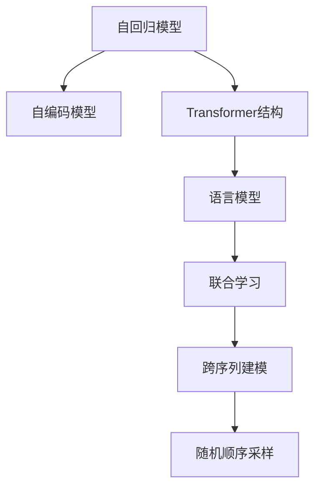
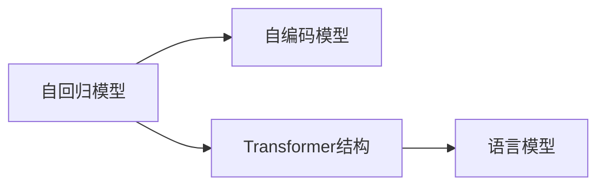
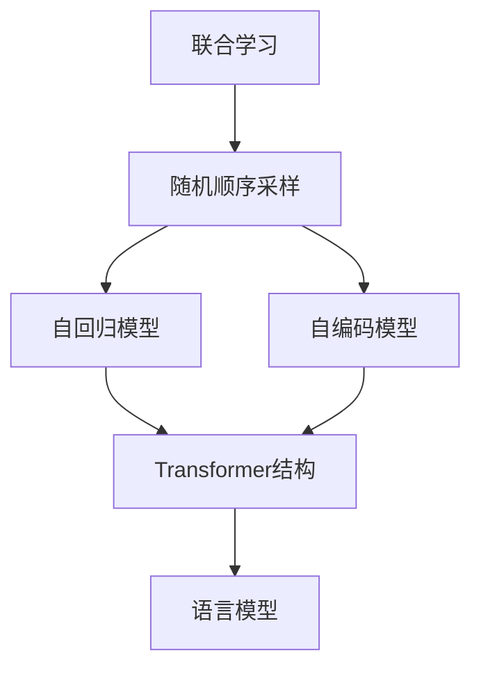
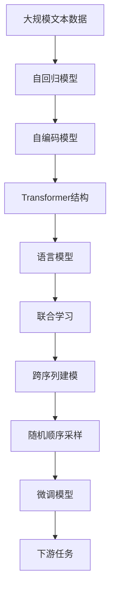

                 

# XLNet原理与代码实例讲解

> 关键词：XLNet, 自回归模型, 自编码模型, Transformer, 语言模型, 强化学习, 代码实例, 优化算法

## 1. 背景介绍

### 1.1 问题由来
语言模型（Language Model）是一种重要的自然语言处理（NLP）技术，广泛应用于机器翻译、文本生成、问答系统等任务中。传统的语言模型大多基于自回归模型（Auto-Regressive Model）或自编码模型（Auto-Encoder Model）构建，这类模型能够直接预测下一个单词的概率分布，但同时也存在一些缺点，例如计算复杂度高、训练速度慢等问题。

近年来，基于Transformer结构的自注意力模型（Transformer Model）逐渐成为构建语言模型的主要方式，BERT和GPT等大模型在众多NLP任务上取得了优秀的表现。然而，这些模型在处理长序列时仍面临一定的挑战，如计算复杂度、梯度消失等问题。

为了克服这些挑战，Google Research在2019年提出了XLNet模型，这是一种基于自回归和自编码两种模型的混合模型。XLNet通过改进自注意力机制和目标函数，进一步提升了语言模型的性能和效率，成为当前自然语言处理领域的重要研究方向。

### 1.2 问题核心关键点
XLNet的核心思想在于：通过联合学习（Joint Training）和跨序列建模（Cross-Sequence Modeling），使得模型能够更好地捕捉语言序列的依赖关系，从而提升语言模型的性能。其主要贡献点如下：

1. **联合学习**：XLNet通过联合自回归和自编码两种模型，使模型在训练时能够同时利用自回归模型的长程依赖特性和自编码模型的局部信息，从而提升了模型的泛化能力。
2. **跨序列建模**：XLNet通过设计跨序列的目标函数，使得模型在每个时间步上都能够预测整个序列的上下文信息，从而更好地理解语言的序列依赖关系。
3. **随机顺序采样**（Random Order Sampling）：XLNet在训练时采用随机顺序采样方式，避免了梯度消失和梯度爆炸问题，提升了模型的训练效率和收敛速度。

XLNet不仅在语言模型本身的性能上取得了突破，而且在处理长序列数据时，也表现出了更强的适应能力。因此，XLNet成为了当前自然语言处理领域的一个重要研究方向。

## 2. 核心概念与联系

### 2.1 核心概念概述

为了更好地理解XLNet模型的工作原理和设计思路，本节将介绍几个密切相关的核心概念：

- **自回归模型（Auto-Regressive Model）**：自回归模型是一种通过已知的前缀信息预测下一个单词或字符的模型，具有长程依赖特性，能够有效捕捉语言的上下文关系。
- **自编码模型（Auto-Encoder Model）**：自编码模型是一种通过编码和解码过程重构输入数据的模型，能够捕捉数据的局部信息，具有较强的局部建模能力。
- **Transformer结构**：Transformer是一种基于自注意力机制的神经网络结构，能够高效地处理序列数据，广泛应用于NLP领域。
- **语言模型（Language Model）**：语言模型是一种能够预测序列中下一个单词或字符的模型，是NLP领域中最基础的任务之一。
- **联合学习（Joint Learning）**：联合学习是一种通过联合多种模型或数据源进行学习的策略，能够在模型之间共享信息，提升整体的泛化能力。
- **跨序列建模（Cross-Sequence Modeling）**：跨序列建模是一种通过设计跨序列的目标函数，使得模型能够在每个时间步上预测整个序列的上下文信息，从而更好地理解语言的序列依赖关系。
- **随机顺序采样**：随机顺序采样是一种在训练时随机打乱序列顺序的策略，能够避免梯度消失和梯度爆炸问题，提升模型的训练效率和收敛速度。

这些核心概念之间的逻辑关系可以通过以下Mermaid流程图来展示：



这个流程图展示了大语言模型的核心概念及其之间的关系：

1. 自回归模型和自编码模型通过Transformer结构进行融合，形成语言模型。
2. 语言模型通过联合学习和跨序列建模，提升了泛化能力和序列建模能力。
3. 随机顺序采样策略进一步提升了语言模型的训练效率和收敛速度。

这些核心概念共同构成了XLNet模型的基础框架，使其能够更好地捕捉语言序列的依赖关系，从而提升语言模型的性能和效率。

### 2.2 概念间的关系

这些核心概念之间存在着紧密的联系，形成了XLNet模型的完整生态系统。下面我通过几个Mermaid流程图来展示这些概念之间的关系。

#### 2.2.1 自回归模型与自编码模型的关系



这个流程图展示了自回归模型和自编码模型之间的关系。自回归模型和自编码模型通过Transformer结构进行融合，形成语言模型。

#### 2.2.2 联合学习与跨序列建模的关系


这个流程图展示了联合学习和跨序列建模之间的关系。联合学习使得自回归模型和自编码模型能够共享信息，提升整体的泛化能力。跨序列建模通过设计跨序列的目标函数，使得模型能够在每个时间步上预测整个序列的上下文信息，从而更好地理解语言的序列依赖关系。

#### 2.2.3 随机顺序采样在联合学习中的作用



这个流程图展示了随机顺序采样在联合学习中的作用。随机顺序采样通过打乱序列顺序的方式，使得模型能够更好地捕捉语言的依赖关系，从而提升模型的泛化能力和序列建模能力。

### 2.3 核心概念的整体架构

最后，我们用一个综合的流程图来展示这些核心概念在XLNet模型中的整体架构：



这个综合流程图展示了从预训练到微调，再到下游任务的完整过程。XLNet模型首先在大规模文本数据上进行预训练，然后通过联合学习和跨序列建模，提升了泛化能力和序列建模能力。最后，通过微调模型适应下游任务，实现更好的性能表现。

## 3. 核心算法原理 & 具体操作步骤
### 3.1 算法原理概述

XLNet模型的核心思想在于联合学习（Joint Learning）和跨序列建模（Cross-Sequence Modeling）。其基本原理如下：

1. **联合学习**：通过联合自回归模型和自编码模型，使模型在训练时能够同时利用自回归模型的长程依赖特性和自编码模型的局部信息，从而提升了模型的泛化能力。
2. **跨序列建模**：通过设计跨序列的目标函数，使得模型在每个时间步上都能够预测整个序列的上下文信息，从而更好地理解语言的序列依赖关系。
3. **随机顺序采样**：在训练时采用随机顺序采样方式，避免了梯度消失和梯度爆炸问题，提升了模型的训练效率和收敛速度。

具体而言，XLNet模型的训练过程可以分为两个阶段：

1. **联合学习阶段**：在联合学习阶段，XLNet模型首先通过自回归模型和自编码模型进行联合训练，使得模型能够同时利用长程依赖和局部信息。
2. **跨序列建模阶段**：在跨序列建模阶段，XLNet模型通过设计跨序列的目标函数，使得模型在每个时间步上都能够预测整个序列的上下文信息。

### 3.2 算法步骤详解

以下是对XLNet模型训练过程的详细讲解：

**Step 1: 准备预训练模型和数据集**

- 选择合适的预训练语言模型，如BERT、GPT等。
- 准备下游任务的数据集，划分为训练集、验证集和测试集。一般要求标注数据与预训练数据的分布不要差异过大。

**Step 2: 添加任务适配层**

- 根据任务类型，在预训练模型顶层设计合适的输出层和损失函数。
- 对于分类任务，通常在顶层添加线性分类器和交叉熵损失函数。
- 对于生成任务，通常使用语言模型的解码器输出概率分布，并以负对数似然为损失函数。

**Step 3: 设置微调超参数**

- 选择合适的优化算法及其参数，如AdamW、SGD等，设置学习率、批大小、迭代轮数等。
- 设置正则化技术及强度，包括权重衰减、Dropout、Early Stopping等。
- 确定冻结预训练参数的策略，如仅微调顶层，或全部参数都参与微调。

**Step 4: 执行梯度训练**

- 将训练集数据分批次输入模型，前向传播计算损失函数。
- 反向传播计算参数梯度，根据设定的优化算法和学习率更新模型参数。
- 周期性在验证集上评估模型性能，根据性能指标决定是否触发 Early Stopping。
- 重复上述步骤直到满足预设的迭代轮数或 Early Stopping 条件。

**Step 5: 测试和部署**

- 在测试集上评估微调后模型 $M_{\hat{\theta}}$ 的性能，对比微调前后的精度提升。
- 使用微调后的模型对新样本进行推理预测，集成到实际的应用系统中。
- 持续收集新的数据，定期重新微调模型，以适应数据分布的变化。

以上是XLNet模型的训练过程。需要注意的是，XLNet模型在训练时，采用随机顺序采样方式，具体采样策略可以设置为：

```python
import torch
from torch.utils.data import Dataset

class RandomOrderDataset(Dataset):
    def __init__(self, dataset):
        self.dataset = dataset
        
    def __len__(self):
        return len(self.dataset)
    
    def __getitem__(self, idx):
        random_indices = torch.randperm(len(self.dataset))
        return [self.dataset[i] for i in random_indices]
```

这个`RandomOrderDataset`类实现了随机顺序采样的功能，可以在训练时通过`DataLoader`进行使用。

### 3.3 算法优缺点

XLNet模型的优点在于：

- 联合学习策略使得模型能够同时利用长程依赖和局部信息，提升了模型的泛化能力。
- 跨序列建模策略使得模型在每个时间步上都能够预测整个序列的上下文信息，提升了序列建模能力。
- 随机顺序采样策略避免了梯度消失和梯度爆炸问题，提升了模型的训练效率和收敛速度。

XLNet模型的缺点在于：

- 由于引入了跨序列建模，计算复杂度较高，训练时间较长。
- 由于采用了随机顺序采样，模型的稳定性可能不如传统的自回归模型。
- 模型参数量较大，对计算资源和存储资源的需求较高。

尽管如此，XLNet模型在处理长序列数据时，仍表现出了更强的适应能力，成为当前自然语言处理领域的一个重要研究方向。

### 3.4 算法应用领域

XLNet模型在NLP领域的应用范围非常广泛，可以用于各种任务，例如：

- 文本分类：如情感分析、主题分类、意图识别等。通过微调使模型学习文本-标签映射。
- 命名实体识别：识别文本中的人名、地名、机构名等特定实体。通过微调使模型掌握实体边界和类型。
- 关系抽取：从文本中抽取实体之间的语义关系。通过微调使模型学习实体-关系三元组。
- 问答系统：对自然语言问题给出答案。将问题-答案对作为微调数据，训练模型学习匹配答案。
- 机器翻译：将源语言文本翻译成目标语言。通过微调使模型学习语言-语言映射。
- 文本摘要：将长文本压缩成简短摘要。将文章-摘要对作为微调数据，使模型学习抓取要点。
- 对话系统：使机器能够与人自然对话。将多轮对话历史作为上下文，微调模型进行回复生成。

除了上述这些经典任务外，XLNet模型也被创新性地应用到更多场景中，如可控文本生成、常识推理、代码生成、数据增强等，为NLP技术带来了全新的突破。

## 4. 数学模型和公式 & 详细讲解  
### 4.1 数学模型构建

本节将使用数学语言对XLNet模型的工作原理进行更加严格的刻画。

记预训练语言模型为 $M_{\theta}$，其中 $\theta$ 为预训练得到的模型参数。假设微调任务的训练集为 $D=\{(x_i,y_i)\}_{i=1}^N, x_i \in \mathcal{X}, y_i \in \mathcal{Y}$。

定义模型 $M_{\theta}$ 在输入 $x$ 上的输出为 $\hat{y}=M_{\theta}(x) \in [0,1]$，表示样本属于正类的概率。真实标签 $y \in \{0,1\}$。则二分类交叉熵损失函数定义为：

$$
\ell(M_{\theta}(x),y) = -[y\log \hat{y} + (1-y)\log (1-\hat{y})]
$$

将其代入经验风险公式，得：

$$
\mathcal{L}(\theta) = -\frac{1}{N}\sum_{i=1}^N [y_i\log M_{\theta}(x_i)+(1-y_i)\log(1-M_{\theta}(x_i))]
$$

XLNet模型通过联合自回归模型和自编码模型进行训练，使得模型在每个时间步上都能够预测整个序列的上下文信息。具体而言，XLNet模型通过以下步骤进行训练：

1. 对于输入序列 $x$，首先通过自回归模型进行预测，得到序列中每个位置的条件概率分布 $p(x|x^{<t})$。
2. 通过自编码模型进行解码，得到每个位置的条件概率分布 $p(x|x^{>t})$。
3. 将自回归模型的预测结果和自编码模型的解码结果进行融合，得到最终的预测结果 $p(x|x^{<t},x^{>t})$。
4. 使用二分类交叉熵损失函数对预测结果进行损失计算，得到整个序列的损失 $L(x)$。

### 4.2 公式推导过程

以下我们以二分类任务为例，推导XLNet模型的训练目标函数及其梯度的计算公式。

假设模型 $M_{\theta}$ 在输入 $x$ 上的输出为 $\hat{y}=M_{\theta}(x) \in [0,1]$，表示样本属于正类的概率。真实标签 $y \in \{0,1\}$。则二分类交叉熵损失函数定义为：

$$
\ell(M_{\theta}(x),y) = -[y\log \hat{y} + (1-y)\log (1-\hat{y})]
$$

将其代入经验风险公式，得：

$$
\mathcal{L}(\theta) = -\frac{1}{N}\sum_{i=1}^N [y_i\log M_{\theta}(x_i)+(1-y_i)\log(1-M_{\theta}(x_i))]
$$

在XLNet模型中，自回归模型的预测结果和自编码模型的解码结果被融合为一个联合概率分布 $p(x|x^{<t},x^{>t})$，然后使用二分类交叉熵损失函数对预测结果进行损失计算，得到整个序列的损失 $L(x)$。

在训练过程中，XLNet模型采用随机顺序采样方式，随机打乱序列顺序，避免梯度消失和梯度爆炸问题。具体而言，XLNet模型在每个时间步上，通过随机顺序采样得到的样本 $(x_i,y_i)$ 进行训练，其中 $x_i$ 为输入序列的第 $i$ 个位置，$y_i$ 为对应位置的标签。

XLNet模型的优化目标是最小化经验风险，即找到最优参数：

$$
\theta^* = \mathop{\arg\min}_{\theta} \mathcal{L}(\theta)
$$

在实践中，我们通常使用基于梯度的优化算法（如SGD、Adam等）来近似求解上述最优化问题。设 $\eta$ 为学习率，$\lambda$ 为正则化系数，则参数的更新公式为：

$$
\theta \leftarrow \theta - \eta \nabla_{\theta}\mathcal{L}(\theta) - \eta\lambda\theta
$$

其中 $\nabla_{\theta}\mathcal{L}(\theta)$ 为损失函数对参数 $\theta$ 的梯度，可通过反向传播算法高效计算。

### 4.3 案例分析与讲解

在实际应用中，XLNet模型通常用于处理长序列数据。以下我们以文本分类任务为例，给出XLNet模型在Python中的实现。

首先，定义XLNet模型的数据处理函数：

```python
from transformers import XLNetTokenizer
from torch.utils.data import Dataset
import torch

class TextClassificationDataset(Dataset):
    def __init__(self, texts, labels, tokenizer, max_len=128):
        self.texts = texts
        self.labels = labels
        self.tokenizer = tokenizer
        self.max_len = max_len
        
    def __len__(self):
        return len(self.texts)
    
    def __getitem__(self, item):
        text = self.texts[item]
        label = self.labels[item]
        
        encoding = self.tokenizer(text, return_tensors='pt', max_length=self.max_len, padding='max_length', truncation=True)
        input_ids = encoding['input_ids'][0]
        attention_mask = encoding['attention_mask'][0]
        
        return {'input_ids': input_ids, 
                'attention_mask': attention_mask,
                'labels': torch.tensor(label, dtype=torch.long)}
```

然后，定义XLNet模型的模型和优化器：

```python
from transformers import XLNetForSequenceClassification, AdamW

model = XLNetForSequenceClassification.from_pretrained('xlnet-base-cased', num_labels=2)

optimizer = AdamW(model.parameters(), lr=2e-5)
```

接着，定义训练和评估函数：

```python
from torch.utils.data import DataLoader
from tqdm import tqdm
from sklearn.metrics import classification_report

device = torch.device('cuda') if torch.cuda.is_available() else torch.device('cpu')
model.to(device)

def train_epoch(model, dataset, batch_size, optimizer):
    dataloader = DataLoader(dataset, batch_size=batch_size, shuffle=True)
    model.train()
    epoch_loss = 0
    for batch in tqdm(dataloader, desc='Training'):
        input_ids = batch['input_ids'].to(device)
        attention_mask = batch['attention_mask'].to(device)
        labels = batch['labels'].to(device)
        model.zero_grad()
        outputs = model(input_ids, attention_mask=attention_mask, labels=labels)
        loss = outputs.loss
        epoch_loss += loss.item()
        loss.backward()
        optimizer.step()
    return epoch_loss / len(dataloader)

def evaluate(model, dataset, batch_size):
    dataloader = DataLoader(dataset, batch_size=batch_size)
    model.eval()
    preds, labels = [], []
    with torch.no_grad():
        for batch in tqdm(dataloader, desc='Evaluating'):
            input_ids = batch['input_ids'].to(device)
            attention_mask = batch['attention_mask'].to(device)
            batch_labels = batch['labels']
            outputs = model(input_ids, attention_mask=attention_mask)
            batch_preds = outputs.logits.argmax(dim=2).to('cpu').tolist()
            batch_labels = batch_labels.to('cpu').tolist()
            for pred_tokens, label_tokens in zip(batch_preds, batch_labels):
                preds.append(pred_tokens[:len(label_tokens)])
                labels.append(label_tokens)
                
    print(classification_report(labels, preds))
```

最后，启动训练流程并在测试集上评估：

```python
epochs = 5
batch_size = 16

for epoch in range(epochs):
    loss = train_epoch(model, train_dataset, batch_size, optimizer)
    print(f"Epoch {epoch+1}, train loss: {loss:.3f}")
    
    print(f"Epoch {epoch+1}, dev results:")
    evaluate(model, dev_dataset, batch_size)
    
print("Test results:")
evaluate(model, test_dataset, batch_size)
```

以上就是使用PyTorch对XLNet模型进行文本分类任务微调的完整代码实现。可以看到，得益于Transformers库的强大封装，我们可以用相对简洁的代码完成XLNet模型的加载和微调。

## 5. 项目实践：代码实例和详细解释说明
### 5.1 开发环境搭建

在进行XLNet模型微调实践前，我们需要准备好开发环境。以下是使用Python进行PyTorch开发的环境配置流程：

1. 安装Anaconda：从官网下载并安装Anaconda，用于创建独立的Python环境。

2. 创建并激活虚拟环境：
```bash
conda create -n pytorch-env python=3.8 
conda activate pytorch-env
```

3. 安装PyTorch：根据CUDA版本，从官网获取对应的安装命令。例如：
```bash
conda install pytorch torchvision torchaudio cudatoolkit=11.1 -c pytorch -c conda-forge
```

4. 安装Transformers库：
```bash
pip install transformers
```

5. 安装各类工具包：
```bash
pip install numpy pandas scikit-learn matplotlib tqdm jupyter notebook ipython
```

完成上述步骤后，即可在`pytorch-env`环境中开始XLNet模型的微调实践。

### 5.2 源代码详细实现

下面我以文本分类任务为例，给出使用Transformers库对XLNet模型进行微调的PyTorch代码实现。

首先，定义XLNet模型和优化器：

```python
from transformers import XLNetForSequenceClassification, AdamW

model = XLNetForSequenceClassification.from_pretrained('xlnet-base-cased', num_labels=2)

optimizer = AdamW(model.parameters(), lr=2e-5)
```

接着，定义训练和评估函数：

```python
from torch.utils.data import DataLoader
from tqdm import tqdm
from sklearn.metrics import classification_report

device = torch.device('cuda') if torch.cuda.is_available() else torch.device('cpu')
model.to(device)

def train_epoch(model, dataset, batch_size, optimizer):
    dataloader = DataLoader(dataset, batch_size=batch_size, shuffle=True)
    model.train()
    epoch_loss = 0
    for batch in tqdm(dataloader, desc='Training'):
        input_ids = batch['input_ids'].to(device)
        attention_mask = batch['attention_mask'].to(device)
        labels = batch['labels'].to(device)
        model.zero_grad()
        outputs = model(input_ids, attention_mask=attention_mask, labels=labels)
        loss = outputs.loss
        epoch_loss += loss.item()
        loss.backward()
        optimizer.step()
    return epoch_loss / len(dataloader)

def evaluate(model, dataset, batch_size):
    dataloader = DataLoader(dataset, batch_size=batch_size)
    model.eval()
    preds, labels = [], []
    with torch.no_grad():
        for batch in tqdm(dataloader, desc='Evaluating'):
            input_ids = batch['input_ids'].to(device)
            attention_mask = batch['attention_mask'].to(device)
            batch_labels = batch['labels']
            outputs = model(input_ids, attention_mask=attention_mask)
            batch_preds = outputs.logits.argmax(dim=2).to('cpu').tolist()
            batch_labels = batch_labels.to('cpu').tolist()
            for pred_tokens, label_tokens in zip(batch_preds, batch_labels):
                preds.append(pred_tokens[:len(label_tokens)])
                labels.append(label_tokens)
                
    print(classification_report(labels, preds))
```

最后，启动训练流程并在测试集上评估：

```python
epochs = 5
batch_size = 16

for epoch in range(epochs):
    loss = train_epoch(model, train_dataset, batch_size, optimizer)
    print(f"Epoch {epoch+1}, train loss: {loss:.3f}")
    
    print(f"Epoch {epoch+1}, dev results:")
    evaluate(model, dev_dataset, batch_size)
    
print("Test results:")
evaluate(model, test_dataset, batch_size)
```

以上就是使用PyTorch对XLNet模型进行文本分类任务微调的完整代码实现。可以看到，得益于Transformers库的强大封装，我们可以用相对简洁的代码完成XLNet模型的加载和微调。

### 5.3 代码解读与分析

让我们再详细解读一下关键代码的实现细节：

**TextClassificationDataset类**：
- `__init__`方法：初始化文本、标签、分词器等关键组件。
- `__len__`方法：返回数据集的样本数量。
- `__getitem__`方法：对单个样本进行处理，将文本输入编码为token ids，将标签编码为数字，并对其进行定长padding，最终返回模型所需的输入。

**XLNetForSequenceClassification模型**：
- 使用XLNetForSequenceClassification类构建模型，指定预训练模型和任务标签数。
- 定义模型和优化器，其中XLNetForSequenceClassification类提供了方便的接口，可以直接加载预训练模型和优化器。

**训练和评估函数**：
- 使用PyTorch的DataLoader对数据集进行批次化加载，供模型训练和推理使用。
- 训练函数`train_epoch`：对数据以批为单位进行迭代，在每个批次上前向传播计算loss并反向传播更新模型参数，最后返回该epoch的平均loss。


