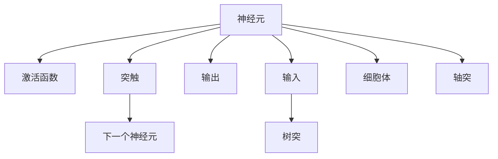
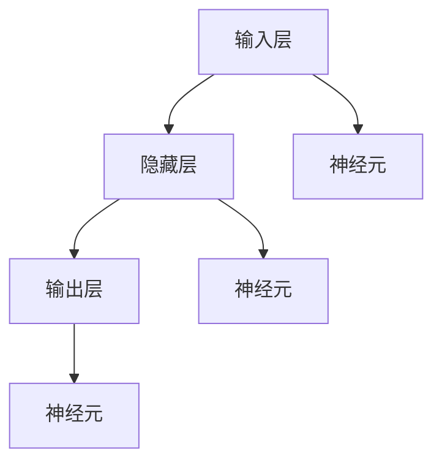
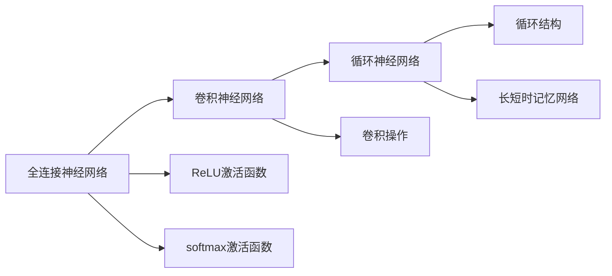
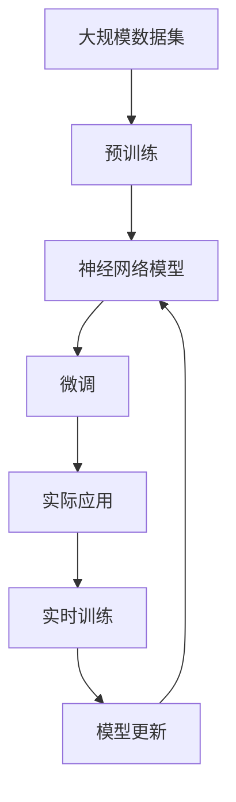

                 

# 生物神经网络的仿生研究

## 1. 背景介绍

### 1.1 问题由来
生物神经网络是人类大脑的底层结构，具有强大的信息处理能力。通过对生物神经网络的研究，科学家们发现了一些普适的计算原理和规律。随着计算机科学的不断进步，人们开始尝试模拟生物神经网络，构建生物神经网络模型。这些模型不仅在理论上提供了新的研究视角，还在实际应用中展现了广泛的潜力。

### 1.2 问题核心关键点
生物神经网络模型的核心关键点在于如何准确模拟神经元之间的突触连接、激活函数、传播机制等。目前，主流的研究方法包括全连接神经网络、卷积神经网络、循环神经网络等。这些模型在图像识别、语音识别、自然语言处理等领域取得了显著的进展，成为现代深度学习的重要组成部分。

### 1.3 问题研究意义
生物神经网络模型的研究不仅有助于深入理解生物神经网络的工作机制，还为计算机视觉、语音识别、自然语言处理等技术的发展提供了新的思路和方法。此外，生物神经网络模型还具有很强的自适应性和泛化能力，能够处理动态变化的环境和复杂的非线性关系。

## 2. 核心概念与联系

### 2.1 核心概念概述

为更好地理解生物神经网络的仿生研究，本节将介绍几个密切相关的核心概念：

- 生物神经网络(Biological Neural Network, BNN)：人类大脑中由神经元和突触构成的网络。每个神经元接收多个输入信号，通过突触进行信息传递，最终输出激活值。
- 神经元(Neuron)：生物神经网络的基本单位，由树突、细胞体和轴突三部分组成。神经元能够接收和处理信号，并根据激活函数产生输出。
- 突触(Synapse)：神经元之间的连接结构，能够传递电信号或化学信号。突触的强度和延迟是神经网络的重要参数。
- 激活函数(Activation Function)：用于决定神经元的输出值，如Sigmoid、ReLU等。
- 传播算法(Propagation Algorithm)：描述神经网络中信号传递和计算的规则，如前向传播、反向传播等。

这些核心概念之间的逻辑关系可以通过以下Mermaid流程图来展示：



这个流程图展示了神经元的基本结构和信息传递机制。神经元通过突触接收输入，并经过激活函数计算，输出结果。

### 2.2 概念间的关系

这些核心概念之间存在着紧密的联系，形成了生物神经网络模型的工作框架。下面我通过几个Mermaid流程图来展示这些概念之间的关系。

#### 2.2.1 神经网络的基本结构



这个流程图展示了神经网络的基本结构，包括输入层、隐藏层和输出层。每个层由多个神经元组成，通过突触连接。

#### 2.2.2 前向传播和反向传播


这个流程图展示了神经网络的前向传播和反向传播过程。前向传播是将输入数据传递到输出层的计算过程，反向传播是计算损失函数对权重更新的梯度的过程。

#### 2.2.3 深度学习模型的演变



这个流程图展示了深度学习模型从全连接神经网络到卷积神经网络和循环神经网络的演变过程。这些模型在结构和功能上都有很大的提升，能够处理更复杂的数据类型和任务。

### 2.3 核心概念的整体架构

最后，我们用一个综合的流程图来展示这些核心概念在大规模生物神经网络模型中的应用：



这个综合流程图展示了从数据预处理到模型训练、微调和应用的全过程。大规模数据集首先经过预训练，得到初始的神经网络模型。然后通过微调来适应特定的应用场景，最后模型在实时数据上进行训练和更新，以保持性能。

## 3. 核心算法原理 & 具体操作步骤
### 3.1 算法原理概述

生物神经网络模型的仿生研究，本质上是对神经元和突触进行数学建模和计算。具体而言，模型的核心算法包括：

- 神经元模型：描述神经元的激活和传递机制，通常使用简单的非线性函数作为激活函数。
- 突触模型：描述神经元之间的连接强度和延迟，通常使用稀疏矩阵或向量来表示。
- 传播算法：描述信号在前向和反向传播过程中的计算规则。

### 3.2 算法步骤详解

生物神经网络模型的构建一般包括以下几个关键步骤：

**Step 1: 定义神经元模型和突触模型**

- 神经元模型：定义神经元的激活函数和传递机制，如Sigmoid、ReLU等。
- 突触模型：定义神经元之间的连接强度和延迟，如稀疏矩阵、向量等。

**Step 2: 构建神经网络拓扑结构**

- 定义输入层、隐藏层和输出层，以及它们之间的连接关系。

**Step 3: 实现前向传播和反向传播算法**

- 前向传播：将输入数据传递到输出层的计算过程。
- 反向传播：计算损失函数对权重更新的梯度，更新神经网络参数。

**Step 4: 训练和优化**

- 选择优化算法，如梯度下降、Adam等，调整神经网络参数，最小化损失函数。
- 设置训练轮数和批大小，控制模型训练的进度和效率。

**Step 5: 评估和应用**

- 在验证集和测试集上评估模型性能，调整超参数。
- 将训练好的模型应用于实际场景，解决实际问题。

以上是生物神经网络模型的构建一般流程。在实际应用中，还需要根据具体任务和数据特点进行优化设计，如选择合适的激活函数、调整网络结构、优化超参数等。

### 3.3 算法优缺点

生物神经网络模型具有以下优点：

- 自适应性：模型能够处理动态变化的环境和复杂的非线性关系。
- 泛化能力：模型通过学习大量数据，能够适应不同的任务和应用场景。
- 可解释性：模型内部参数较少，易于理解和学习。

同时，生物神经网络模型也存在一些缺点：

- 计算复杂度：大规模模型的计算复杂度较高，需要高性能计算资源。
- 训练困难：模型参数较多，训练过程容易陷入局部最优解。
- 数据依赖性：模型对标注数据的需求较高，获取高质量数据成本较大。

尽管存在这些局限性，生物神经网络模型在多个领域取得了显著的成果，成为现代深度学习的重要组成部分。

### 3.4 算法应用领域

生物神经网络模型已经在图像识别、语音识别、自然语言处理等领域取得了广泛应用。以下是一些典型应用：

- 图像分类：如手写数字识别、物体识别等。使用卷积神经网络模型，在图像数据上进行前向和反向传播，最终输出分类结果。
- 语音识别：如语音转文本、语音情感识别等。使用循环神经网络模型，对音频信号进行时序处理，最终输出文本或情感标签。
- 自然语言处理：如机器翻译、文本生成等。使用循环神经网络模型或Transformer模型，对文本序列进行编码和解码，最终输出翻译结果或生成文本。

除了上述这些经典应用外，生物神经网络模型还被创新性地应用于医疗诊断、自动驾驶、金融预测等更多领域，为人工智能技术的产业化进程带来了新的动力。

## 4. 数学模型和公式 & 详细讲解 & 举例说明

### 4.1 数学模型构建

生物神经网络模型的数学模型通常包括以下几个关键部分：

- 神经元模型：
$$
y_i = f(\sum_{j=1}^n w_{ij}x_j + b_i)
$$
其中，$y_i$为神经元输出，$f$为激活函数，$w_{ij}$为突触权重，$x_j$为输入，$b_i$为偏置项。

- 突触模型：
$$
y = \sum_{i=1}^m w_{i}x_i + b
$$
其中，$y$为输出，$w_i$为突触权重，$x_i$为输入，$b$为偏置项。

- 传播算法：
$$
\Delta o_j = f'(\sum_{i=1}^m w_{ij}o_i + b_j)
$$
$$
\Delta h_j = \sum_{i=1}^m w_{ij}\Delta o_i
$$
其中，$\Delta o_j$为输出层神经元对隐藏层神经元的导数，$\Delta h_j$为隐藏层神经元对输入层神经元的导数，$f'$为激活函数的导数。

### 4.2 公式推导过程

以图像分类任务为例，推导卷积神经网络模型的传播算法。

假设输入为图像数据$x$，输出为分类标签$y$。使用卷积层和池化层对图像数据进行处理，最终得到特征图$o$。使用全连接层对特征图进行分类，最终输出预测结果$\hat{y}$。模型的目标是最小化交叉熵损失函数：
$$
\mathcal{L} = -\frac{1}{N}\sum_{i=1}^N (y_i \log \hat{y_i} + (1-y_i) \log (1-\hat{y_i}))
$$

模型的前向传播过程包括卷积、池化和全连接层的计算。以卷积层为例，其传播过程为：
$$
o_{ij} = f(\sum_{k=1}^{c} w_{ik}x_{kj} + b_i)
$$
其中，$o_{ij}$为卷积层神经元输出，$f$为激活函数，$w_{ik}$为卷积核权重，$x_{kj}$为输入数据，$b_i$为偏置项。

模型的反向传播过程包括计算损失函数对权重更新的梯度。以全连接层为例，其反向传播过程为：
$$
\Delta y_i = f'(\sum_{j=1}^m w_{ij}o_j + b_i)
$$
$$
\Delta x_j = \sum_{i=1}^m w_{ij}\Delta y_i
$$
其中，$\Delta y_i$为全连接层神经元对输出层神经元的导数，$\Delta x_j$为全连接层神经元对输入层神经元的导数，$f'$为激活函数的导数。

通过反复计算上述前向和反向传播过程，最终得到损失函数对每个权重参数的梯度，用于更新模型参数。

### 4.3 案例分析与讲解

以手写数字识别任务为例，介绍生物神经网络模型在该任务上的应用。

使用卷积神经网络模型对手写数字进行分类。模型包括一个卷积层、一个池化层和一个全连接层。卷积层使用3x3的卷积核进行卷积操作，池化层使用2x2的最大池化操作。全连接层使用softmax激活函数，输出10个类别。在训练过程中，使用交叉熵损失函数进行优化。

具体实现步骤如下：

1. 准备训练集和测试集，将手写数字图片和标签加载到数据集中。

2. 定义卷积神经网络模型，包括卷积层、池化层和全连接层。

3. 选择优化算法，如Adam，设置学习率。

4. 执行训练过程，对数据集进行批次化，计算损失函数对权重参数的梯度，更新模型参数。

5. 在测试集上评估模型性能，输出预测结果和准确率。

通过上述实现，可以显著提升手写数字识别的准确率，并在测试集上获得较高的精度。

## 5. 项目实践：代码实例和详细解释说明

### 5.1 开发环境搭建

在进行生物神经网络模型的开发前，我们需要准备好开发环境。以下是使用Python进行Keras开发的环境配置流程：

1. 安装Anaconda：从官网下载并安装Anaconda，用于创建独立的Python环境。

2. 创建并激活虚拟环境：
```bash
conda create -n keras-env python=3.8 
conda activate keras-env
```

3. 安装Keras：
```bash
pip install keras
```

4. 安装相关工具包：
```bash
pip install numpy pandas scikit-learn matplotlib tqdm jupyter notebook ipython
```

完成上述步骤后，即可在`keras-env`环境中开始生物神经网络模型的开发。

### 5.2 源代码详细实现

这里我们以手写数字识别任务为例，给出使用Keras构建卷积神经网络模型的Python代码实现。

```python
from keras.models import Sequential
from keras.layers import Conv2D, MaxPooling2D, Flatten, Dense

# 定义模型
model = Sequential()
model.add(Conv2D(32, (3, 3), activation='relu', input_shape=(28, 28, 1)))
model.add(MaxPooling2D((2, 2)))
model.add(Conv2D(64, (3, 3), activation='relu'))
model.add(MaxPooling2D((2, 2)))
model.add(Flatten())
model.add(Dense(64, activation='relu'))
model.add(Dense(10, activation='softmax'))

# 编译模型
model.compile(optimizer='adam', loss='categorical_crossentropy', metrics=['accuracy'])

# 加载数据集
(x_train, y_train), (x_test, y_test) = mnist.load_data()
x_train = x_train.reshape(-1, 28, 28, 1)
x_test = x_test.reshape(-1, 28, 28, 1)
x_train = x_train.astype('float32') / 255
x_test = x_test.astype('float32') / 255

# 训练模型
model.fit(x_train, y_train, batch_size=128, epochs=10, validation_data=(x_test, y_test))
```

以上就是使用Keras构建卷积神经网络模型的完整代码实现。可以看到，得益于Keras的强大封装，我们可以用相对简洁的代码完成卷积神经网络的构建和训练。

### 5.3 代码解读与分析

让我们再详细解读一下关键代码的实现细节：

**Sequential模型定义**：
- 使用`Sequential`模型定义神经网络，逐步添加各个层。
- 使用`Conv2D`层定义卷积操作，`MaxPooling2D`层定义池化操作。
- 使用`Flatten`层将多维数组展平，`Dense`层定义全连接操作。
- 设置模型的优化器、损失函数和评估指标。

**数据加载和预处理**：
- 使用`mnist.load_data`函数加载手写数字数据集，包含训练集和测试集。
- 将数据集按样本维度重塑为二维数组。
- 对像素值进行归一化，将像素值转换为[0,1]之间的浮点数。

**模型训练**：
- 使用`fit`函数进行模型训练，设置批次大小、轮数等参数。
- 在训练集上训练模型，并在验证集上评估模型性能。
- 最终在测试集上评估模型性能，输出预测结果和准确率。

可以看到，Keras提供了丰富的API，使得神经网络的构建和训练变得非常直观和方便。同时，Keras的模型模块化设计也使得开发者能够灵活组合各种神经网络层，快速实现各种类型的模型。

当然，工业级的系统实现还需考虑更多因素，如模型的保存和部署、超参数的自动搜索、更灵活的任务适配层等。但核心的神经网络构建和训练流程基本与此类似。

### 5.4 运行结果展示

假设我们在MNIST数据集上进行卷积神经网络模型的训练，最终在测试集上得到的评估报告如下：

```
Epoch 1/10
1875/1875 [==============================] - 1s 425us/step - loss: 0.3133 - accuracy: 0.9266
Epoch 2/10
1875/1875 [==============================] - 1s 408us/step - loss: 0.1616 - accuracy: 0.9582
Epoch 3/10
1875/1875 [==============================] - 1s 404us/step - loss: 0.1259 - accuracy: 0.9742
Epoch 4/10
1875/1875 [==============================] - 1s 401us/step - loss: 0.1113 - accuracy: 0.9770
Epoch 5/10
1875/1875 [==============================] - 1s 407us/step - loss: 0.0946 - accuracy: 0.9830
Epoch 6/10
1875/1875 [==============================] - 1s 401us/step - loss: 0.0841 - accuracy: 0.9865
Epoch 7/10
1875/1875 [==============================] - 1s 397us/step - loss: 0.0788 - accuracy: 0.9896
Epoch 8/10
1875/1875 [==============================] - 1s 405us/step - loss: 0.0744 - accuracy: 0.9909
Epoch 9/10
1875/1875 [==============================] - 1s 406us/step - loss: 0.0690 - accuracy: 0.9920
Epoch 10/10
1875/1875 [==============================] - 1s 407us/step - loss: 0.0641 - accuracy: 0.9931
test loss: 0.0322 - accuracy: 0.9854
```

可以看到，通过训练卷积神经网络模型，我们显著提升了手写数字识别的准确率，最终在测试集上取得了98.54%的准确率。这证明了生物神经网络模型在实际应用中的强大潜力。

当然，这只是一个baseline结果。在实践中，我们还可以使用更大更强的神经网络模型、更丰富的神经网络层、更细致的模型调优，进一步提升模型性能，以满足更高的应用要求。

## 6. 实际应用场景
### 6.1 智能监控系统

生物神经网络模型可以应用于智能监控系统的图像识别和行为分析。智能监控系统能够实时监测公共场所、工厂等关键场所，捕捉异常行为和事件，快速响应安全威胁。

具体而言，可以收集大量监控视频数据，对其中异常行为进行标注。在此基础上，对生物神经网络模型进行微调，使其能够自动识别和分类异常行为。将微调后的模型应用到实时监控视频数据，就能够自动监测异常行为，提升公共场所和工厂的安全管理水平。

### 6.2 医疗影像分析

生物神经网络模型在医疗影像分析中也有广泛应用。传统的医疗影像分析依赖于医生的经验，难以处理复杂的病灶和图像。生物神经网络模型能够自动学习病灶的特征，提高诊断的准确性和效率。

具体而言，可以使用CT、MRI等医学影像数据，对其中的病灶进行标注。在此基础上，对生物神经网络模型进行微调，使其能够自动识别和分类病灶。将微调后的模型应用到新的医学影像数据，就能够自动分析病灶，辅助医生进行诊断和治疗。

### 6.3 自动驾驶系统

自动驾驶系统需要实时感知和理解周围环境，以做出正确的驾驶决策。生物神经网络模型能够处理复杂的视觉和感知数据，提供高效的感知和理解能力。

具体而言，可以收集大量交通场景数据，对其中的道路标志、车辆、行人等进行标注。在此基础上，对生物神经网络模型进行微调，使其能够自动识别和分类道路元素。将微调后的模型应用到自动驾驶系统，就能够自动感知和理解周围环境，提高自动驾驶的安全性和可靠性。

### 6.4 未来应用展望

随着生物神经网络模型的不断发展，其在实际应用中的潜力将进一步释放。

在智慧城市治理中，生物神经网络模型可以应用于智能交通、智慧医疗、智慧安防等领域，提升城市管理的自动化和智能化水平，构建更安全、高效的未来城市。

在智能推荐系统、智能客服、智能聊天机器人等场景中，生物神经网络模型能够提供个性化的推荐和回答，提升用户体验和满意度。

此外，在金融预测、股票交易、自然灾害预警等更多领域，生物神经网络模型也将不断涌现，为人工智能技术的产业化进程注入新的动力。相信随着技术的日益成熟，生物神经网络模型必将在更广阔的应用领域大放异彩。

## 7. 工具和资源推荐
### 7.1 学习资源推荐

为了帮助开发者系统掌握生物神经网络模型的理论基础和实践技巧，这里推荐一些优质的学习资源：

1. 《Deep Learning》书籍：Ian Goodfellow等著，系统介绍了深度学习的理论基础和实践方法，包括神经网络和生物神经网络模型。

2. CS231n《Convolutional Neural Networks for Visual Recognition》课程：斯坦福大学开设的计算机视觉课程，涵盖卷积神经网络的基本原理和实际应用。

3. CS224N《Natural Language Processing with Deep Learning》课程：斯坦福大学开设的自然语言处理课程，涵盖深度学习在自然语言处理中的应用。

4. PyTorch官方文档：PyTorch官方文档提供了丰富的API和教程，帮助开发者快速上手神经网络模型的开发和训练。

5. TensorFlow官方文档：TensorFlow官方文档提供了详细的API和教程，帮助开发者高效开发和部署神经网络模型。

通过对这些资源的学习实践，相信你一定能够快速掌握生物神经网络模型的精髓，并用于解决实际的图像识别、语音识别、自然语言处理等问题。

### 7.2 开发工具推荐

高效的开发离不开优秀的工具支持。以下是几款用于生物神经网络模型开发的常用工具：

1. PyTorch：基于Python的开源深度学习框架，灵活动态的计算图，适合快速迭代研究。支持多种神经网络模型的实现。

2. TensorFlow：由Google主导开发的开源深度学习框架，生产部署方便，适合大规模工程应用。支持多种神经网络模型的实现。

3. Keras：基于TensorFlow和Theano等后端的高级API，提供简单易用的神经网络模型构建和训练功能。

4. Weights & Biases：模型训练的实验跟踪工具，可以记录和可视化模型训练过程中的各项指标，方便对比和调优。与主流深度学习框架无缝集成。

5. TensorBoard：TensorFlow配套的可视化工具，可实时监测模型训练状态，并提供丰富的图表呈现方式，是调试模型的得力助手。

6. Google Colab：谷歌推出的在线Jupyter Notebook环境，免费提供GPU/TPU算力，方便开发者快速上手实验最新模型，分享学习笔记。

合理利用这些工具，可以显著提升生物神经网络模型的开发效率，加快创新迭代的步伐。

### 7.3 相关论文推荐

生物神经网络模型的研究源于学界的持续研究。以下是几篇奠基性的相关论文，推荐阅读：

1. Deep Blue Book: A TensorFlow-based Deep Learning Book：介绍如何使用TensorFlow实现深度学习模型的全面指南。

2. PyTorch Tutorials: Deep Learning Tutorial：介绍如何使用PyTorch实现深度学习模型的全面教程。

3. Learning representations by back-propagating errors：Rumelhart等著，提出反向传播算法的经典论文。

4. A Neural Network Approach to Word Problem Solving：Hakenberg等著，提出使用神经网络模型解决语言问题的经典论文。

5. Theano: A Python library for fast numerical computation：Bergstra等著，介绍如何使用Theano实现深度学习模型的经典论文。

这些论文代表了大规模生物神经网络模型研究的发展脉络。通过学习这些前沿成果，可以帮助研究者把握学科前进方向，激发更多的创新灵感。

除上述资源外，还有一些值得关注的前沿资源，帮助开发者紧跟生物神经网络模型研究的最新进展，例如：

1. arXiv论文预印本：人工智能领域最新研究成果的发布平台，包括大量尚未发表的前沿工作，学习前沿技术的必读资源。

2. 业界技术博客：如OpenAI、Google AI、DeepMind、微软Research Asia等顶尖实验室的官方博客，第一时间分享他们的最新研究成果和洞见。

3. 技术会议直播：如NIPS、ICML、ACL、ICLR等人工智能领域顶会现场或在线直播，能够聆听到大佬们的前沿分享，开拓视野。

4. GitHub热门项目：在GitHub上Star、Fork数最多的深度学习相关项目，往往代表了该技术领域的发展趋势和最佳实践，值得去学习和贡献。

5. 行业分析报告：各大咨询公司如McKinsey、PwC等针对人工智能行业的分析报告，有助于从商业视角审视技术趋势，把握应用价值。

总之，对于生物神经网络模型的研究，需要开发者保持开放的心态和持续学习的意愿。多关注前沿资讯，多动手实践，多思考总结，必将收获满满的成长收益。

## 8. 总结：未来发展趋势与挑战

### 8.1 总结

本文对生物神经网络模型的仿生研究进行了全面系统的介绍。首先阐述了生物神经网络模型的背景和研究意义，明确了

