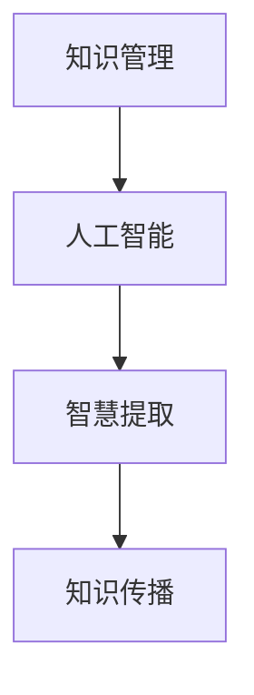
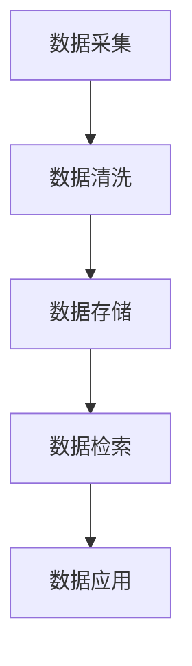
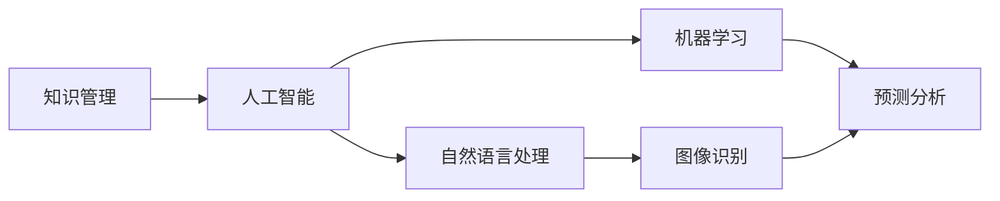
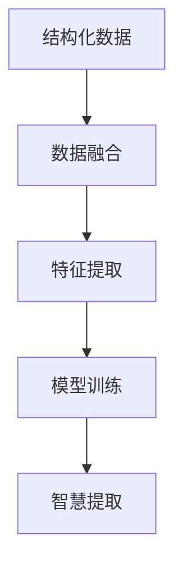
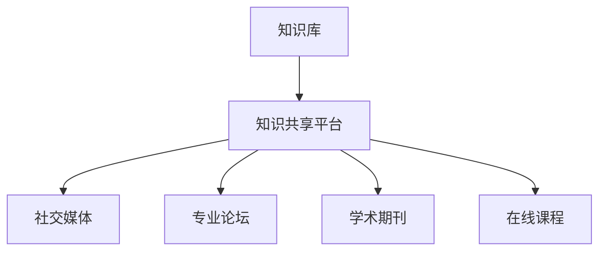
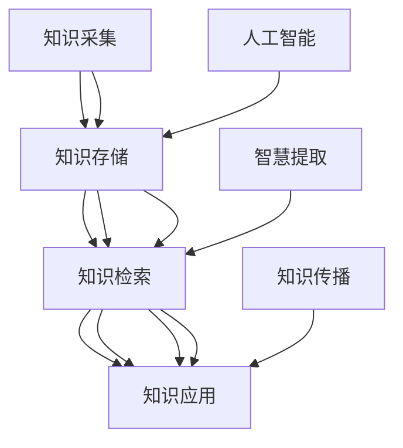

                 

# 知识输出与管理智慧的积累和传播

> 关键词：知识输出、管理智慧、智慧积累、知识传播

## 1. 背景介绍

### 1.1 问题由来
在当前信息爆炸的时代，知识与智慧的积累和传播变得尤为重要。随着互联网的普及和信息技术的发展，人类获取、存储和传播知识的效率大大提高，但同时也面临着信息过载、假信息泛滥、知识碎片化等问题。如何高效管理、合理运用这些知识，并将其转化为智慧，成为我们面临的重要挑战。

### 1.2 问题核心关键点
本问题的核心在于如何通过技术手段实现知识的有效积累、管理和传播，提升人类智慧水平。这涉及以下几个关键点：

- 知识管理的自动化：利用技术手段实现知识的自动分类、存储、检索和更新。
- 知识的结构化：将非结构化知识转化为结构化数据，便于分析和管理。
- 智慧的提取和应用：通过算法和模型，从结构化知识中提取智慧，应用到决策、创新等实际场景中。
- 知识的传播和交流：构建知识共享平台，促进跨领域、跨学科的知识交流和合作。

## 2. 核心概念与联系

### 2.1 核心概念概述

为更好地理解如何通过技术手段实现知识输出与管理智慧的积累和传播，本节将介绍几个密切相关的核心概念：

- **知识管理(Knowledge Management, KM)**：通过技术手段，实现知识的采集、组织、存储、检索和应用的过程。目标是提高知识工作者的效率，加速知识转化和应用。
- **人工智能(Artificial Intelligence, AI)**：一种模拟人类智能行为的技术手段，包括机器学习、自然语言处理、计算机视觉等。
- **智慧提取(Extraction of Wisdom, EoW)**：从知识库中提取并应用智慧的过程，旨在提升决策、创新等实际应用的效率和效果。
- **知识传播(Knowledge Dissemination)**：通过技术手段，构建知识共享平台，促进知识在个人、组织、社会之间的传播和应用。

这些核心概念之间的逻辑关系可以通过以下Mermaid流程图来展示：



这个流程图展示了知识管理、人工智能和智慧提取、知识传播之间的逻辑关系：

1. 知识管理为人工智能提供了数据基础，使得人工智能能够高效处理和分析知识。
2. 智慧提取通过对知识的深入分析，提取出有价值的智慧，为实际应用提供决策支持。
3. 知识传播则是将智慧应用到具体场景中，推动知识的社会化应用和创新。

### 2.2 概念间的关系

这些核心概念之间存在着紧密的联系，形成了知识输出与管理智慧的完整生态系统。下面我们通过几个Mermaid流程图来展示这些概念之间的关系。

#### 2.2.1 知识管理的层次



这个流程图展示了知识管理的几个主要层次：

1. 数据采集：从各种来源获取知识，包括文本、图像、视频等。
2. 数据清洗：处理缺失、噪声、不一致等数据问题，提升数据质量。
3. 数据存储：将清洗后的数据存储在结构化数据库或非结构化存储中。
4. 数据检索：根据需求快速检索所需数据，便于知识管理和应用。
5. 数据应用：将数据应用于实际场景，提升决策、创新等效果。

#### 2.2.2 人工智能与知识管理的结合



这个流程图展示了人工智能与知识管理的结合：

1. 知识管理为人工智能提供数据支撑，包括文本、图像、视频等。
2. 自然语言处理(NLP)对文本知识进行语义分析、实体识别等处理。
3. 图像识别对图像知识进行特征提取、分类等处理。
4. 机器学习通过学习知识数据，构建模型进行预测和分析。
5. 预测分析将机器学习模型应用于知识管理中的数据应用场景，提升决策效果。

#### 2.2.3 智慧提取的过程



这个流程图展示了智慧提取的过程：

1. 结构化数据：将非结构化知识转化为结构化数据，便于分析和管理。
2. 数据融合：将多个来源的知识数据进行融合，构建更全面的数据视图。
3. 特征提取：从融合后的数据中提取关键特征，构建输入向量。
4. 模型训练：通过机器学习算法，训练模型进行智慧提取。
5. 智慧提取：模型应用于具体场景，提取并输出有价值的智慧。

#### 2.2.4 知识传播的路径



这个流程图展示了知识传播的主要路径：

1. 知识库：构建和维护知识管理系统的数据仓库。
2. 知识共享平台：提供知识搜索、交流、协作的平台。
3. 社交媒体：通过社交网络传播知识，促进知识的社会化应用。
4. 专业论坛：针对特定领域，提供深入交流和讨论的空间。
5. 学术期刊：通过正式出版物发布研究成果，促进学术交流。
6. 在线课程：通过在线平台传播知识，提升大众素养。

### 2.3 核心概念的整体架构

最后，我们用一个综合的流程图来展示这些核心概念在知识输出与管理智慧积累和传播中的整体架构：



这个综合流程图展示了从知识采集到智慧传播的完整过程：

1. 知识采集：通过各种方式获取知识数据。
2. 知识存储：将采集到的知识存储在结构化数据库中。
3. 知识检索：根据需要快速检索所需知识。
4. 知识应用：将检索到的知识应用于实际场景，提升决策和创新效果。
5. 人工智能：通过处理结构化数据，提升知识处理和分析的效率。
6. 智慧提取：从结构化数据中提取并应用智慧，提升决策效果。
7. 知识传播：通过知识共享平台，促进知识的传播和应用。

通过这些流程图，我们可以更清晰地理解知识输出与管理智慧积累和传播过程中各个概念的关系和作用，为后续深入讨论具体的知识管理技术奠定基础。

## 3. 核心算法原理 & 具体操作步骤
### 3.1 算法原理概述

知识输出与管理智慧的积累和传播，本质上是一个从数据到智慧的过程。通过自动化技术，对知识进行管理、分析和应用，从中提取并应用智慧，提升决策和创新的效果。其核心思想是：

1. 自动化知识管理：利用技术手段实现知识的自动采集、清洗、存储和检索，提高知识管理的效率和准确性。
2. 结构化知识提取：将非结构化知识转化为结构化数据，便于分析和管理。
3. 智慧提取与分析：通过机器学习算法，从结构化知识中提取智慧，应用于实际场景。
4. 知识传播与交流：构建知识共享平台，促进知识的传播和应用。

### 3.2 算法步骤详解

知识输出与管理智慧的积累和传播，主要包括以下几个关键步骤：

**Step 1: 数据采集与清洗**

- 收集来自互联网、企业系统、科学研究等来源的知识数据。
- 使用数据清洗技术，处理缺失、噪声、不一致等数据问题，提升数据质量。

**Step 2: 数据存储与检索**

- 将清洗后的数据存储在结构化数据库或非结构化存储中。
- 实现高效的数据检索功能，支持多种检索方式，如关键字检索、分类检索等。

**Step 3: 知识管理与分析**

- 利用人工智能技术，对知识进行自动化处理和分析，如文本分类、实体识别、情感分析等。
- 将处理后的知识数据转化为结构化数据，构建知识图谱、知识库等。

**Step 4: 智慧提取与应用**

- 利用机器学习算法，从结构化数据中提取智慧，如预测、分类、聚类等。
- 将提取的智慧应用于实际场景，如决策支持、创新设计、个性化推荐等。

**Step 5: 知识传播与交流**

- 构建知识共享平台，提供知识搜索、交流、协作的功能。
- 通过社交媒体、专业论坛、学术期刊、在线课程等渠道，促进知识的传播和应用。

### 3.3 算法优缺点

知识输出与管理智慧的积累和传播，具有以下优点：

1. 高效：通过自动化技术，大大提高知识管理的效率，降低人力成本。
2. 全面：利用结构化数据和人工智能技术，对知识进行深入分析和应用，提升决策效果。
3. 灵活：知识传播和交流渠道多样，可以适应不同场景和需求。

同时，该方法也存在以下局限性：

1. 数据质量依赖：数据清洗和处理的准确性直接影响到知识管理的质量。
2. 技术门槛较高：需要一定的技术背景和经验，才能有效地利用人工智能技术进行知识管理。
3. 隐私和安全问题：知识传播和交流过程中，需要注意隐私保护和数据安全。

### 3.4 算法应用领域

知识输出与管理智慧的积累和传播，已经在多个领域得到广泛应用，例如：

- **科学研究**：利用知识管理技术，高效获取和利用科研数据，加速科学发现。
- **医疗健康**：构建医疗知识库，提供疾病预测、诊断支持、健康管理等服务。
- **教育培训**：构建教育资源库，提供个性化的学习路径和智能推荐。
- **金融服务**：提供风险预测、投资建议、市场分析等服务。
- **企业运营**：提供知识管理平台，提升企业决策和创新能力。

除了上述这些领域外，知识输出与管理智慧的积累和传播，还在更多领域得到应用，如政府治理、环境保护、社交网络等。未来，随着技术的不断进步，其应用范围将进一步扩大。

## 4. 数学模型和公式 & 详细讲解 & 举例说明
### 4.1 数学模型构建

本节将使用数学语言对知识输出与管理智慧的积累和传播过程进行更加严格的刻画。

假设知识库中存储的知识数据为 $D=\{d_1, d_2, ..., d_N\}$，其中 $d_i$ 为结构化数据，包括文本、图像、视频等。

定义知识管理系统的数据采集函数为 $f_{ac}$，数据清洗函数为 $f_{cl}$，数据存储函数为 $f_{st}$，数据检索函数为 $f_{re}$。定义知识管理系统的知识库为 $K=\{k_1, k_2, ..., k_M\}$，其中 $k_i$ 为知识数据。

知识管理系统的目标是通过函数 $f_{ac} \times f_{cl} \times f_{st} \times f_{re}$ 将知识数据转化为知识库，具体实现为：

$$
K = f_{ac}(D) \times f_{cl}(K) \times f_{st}(K) \times f_{re}(K)
$$

定义智慧提取函数为 $f_{e}$，智慧应用函数为 $f_{a}$，知识传播函数为 $f_{dis}$。定义智慧提取的应用场景为 $S=\{s_1, s_2, ..., s_T\}$，其中 $s_i$ 为智慧应用场景。

知识输出与管理智慧的积累和传播过程可以表示为：

$$
S = f_{e}(K) \times f_{a}(S) \times f_{dis}(S)
$$

### 4.2 公式推导过程

以下我们以科学研究领域为例，推导知识管理系统的数学模型。

假设研究机构拥有 $N$ 个科学论文 $D=\{p_1, p_2, ..., p_N\}$，每个论文 $p_i$ 包含 $m$ 个关键点 $k=\{k_1, k_2, ..., k_m\}$，其中 $k$ 为文本、图像、数据等。

知识管理系统的数据采集函数 $f_{ac}$ 为：

$$
D' = f_{ac}(D) = \bigcup_{p_i \in D} p_i
$$

数据清洗函数 $f_{cl}$ 为：

$$
D'' = f_{cl}(D') = \bigcup_{p_i \in D'} f_{cl}(p_i)
$$

数据存储函数 $f_{st}$ 为：

$$
K = f_{st}(D'') = \bigcup_{p_i \in D''} f_{st}(p_i)
$$

数据检索函数 $f_{re}$ 为：

$$
K' = f_{re}(K) = \bigcup_{k_i \in K} f_{re}(k_i)
$$

智慧提取函数 $f_{e}$ 为：

$$
W = f_{e}(K') = \bigcup_{k_i \in K'} f_{e}(k_i)
$$

智慧应用函数 $f_{a}$ 为：

$$
S = f_{a}(W) = \bigcup_{w_j \in W} f_{a}(w_j)
$$

知识传播函数 $f_{dis}$ 为：

$$
S' = f_{dis}(S) = \bigcup_{s_i \in S} f_{dis}(s_i)
$$

知识输出与管理智慧的积累和传播过程可以表示为：

$$
S' = f_{e}(K') \times f_{a}(S) \times f_{dis}(S')
$$

### 4.3 案例分析与讲解

以科学研究为例，科研人员通过数据采集函数 $f_{ac}$ 获取论文数据 $D$，通过数据清洗函数 $f_{cl}$ 处理噪声和缺失数据，生成干净的数据集 $D''$。然后将数据集 $D''$ 存储到知识库 $K$ 中，通过数据检索函数 $f_{re}$ 检索所需论文，生成论文集合 $K'$。

接着，智慧提取函数 $f_{e}$ 对论文集合 $K'$ 进行深度学习，提取论文的关键点 $W$，如研究主题、方法、结论等。智慧应用函数 $f_{a}$ 将关键点 $W$ 应用于实际科研场景 $S$，如问题解决、模型训练等，生成智慧集合 $S$。最后，通过知识传播函数 $f_{dis}$，将智慧集合 $S$ 传播到科研社区，如科学期刊、科研论坛等，促进知识交流和应用。

通过以上分析，我们可以看到，科学研究的知识管理过程涉及多个环节，包括数据采集、清洗、存储、检索、智慧提取和应用等。每个环节都需要采用合适的技术和方法，才能高效管理科学知识，提取并应用智慧，推动科研创新。

## 5. 项目实践：代码实例和详细解释说明
### 5.1 开发环境搭建

在进行知识输出与管理智慧的积累和传播实践前，我们需要准备好开发环境。以下是使用Python进行PyTorch开发的环境配置流程：

1. 安装Anaconda：从官网下载并安装Anaconda，用于创建独立的Python环境。

2. 创建并激活虚拟环境：
```bash
conda create -n pytorch-env python=3.8 
conda activate pytorch-env
```

3. 安装PyTorch：根据CUDA版本，从官网获取对应的安装命令。例如：
```bash
conda install pytorch torchvision torchaudio cudatoolkit=11.1 -c pytorch -c conda-forge
```

4. 安装Transformers库：
```bash
pip install transformers
```

5. 安装各类工具包：
```bash
pip install numpy pandas scikit-learn matplotlib tqdm jupyter notebook ipython
```

完成上述步骤后，即可在`pytorch-env`环境中开始知识管理实践。

### 5.2 源代码详细实现

下面我们以科学研究领域的知识管理为例，给出使用Transformers库进行知识提取的PyTorch代码实现。

首先，定义知识管理系统的数据采集函数：

```python
from transformers import AutoTokenizer, AutoModelForSequenceClassification

def fetch_papers():
    # 从科学数据库获取论文数据
    papers = fetch_papers_from_database()
    return papers

# 定义数据清洗函数
def clean_papers(papers):
    # 对论文数据进行去重、去除噪声等处理
    cleaned_papers = remove_duplicates(papers)
    return cleaned_papers

# 定义数据存储函数
def store_papers(cleaned_papers):
    # 将清洗后的论文数据存储到知识库中
    store_in_knowledge_base(cleaned_papers)
```

然后，定义智慧提取函数：

```python
from transformers import AutoTokenizer, AutoModelForSequenceClassification

def extract_knowledge(papers):
    # 使用BERT模型进行论文关键点提取
    tokenizer = AutoTokenizer.from_pretrained('bert-base-uncased')
    model = AutoModelForSequenceClassification.from_pretrained('bert-base-uncased', num_labels=10)
    labels = ['Topic', 'Method', 'Conclusion', 'Reference']
    knowledge = []
    for paper in papers:
        inputs = tokenizer(paper, return_tensors='pt')
        outputs = model(**inputs)
        predictions = outputs.logits.argmax(dim=1).tolist()
        knowledge.append([labels[i] for i in predictions])
    return knowledge
```

最后，定义知识传播函数：

```python
from transformers import AutoTokenizer, AutoModelForSequenceClassification

def disperse_knowledge(knowledge):
    # 将智慧数据传播到科研社区，如科学期刊、论坛等
    for i in knowledge:
        print(f"话题：{i[0]}, 方法：{i[1]}, 结论：{i[2]}, 参考文献：{i[3]}")
```

### 5.3 代码解读与分析

让我们再详细解读一下关键代码的实现细节：

**fetch_papers函数**：
- 从科学数据库中获取论文数据，返回论文列表。

**clean_papers函数**：
- 对获取到的论文数据进行去重、去除噪声等处理，返回清洗后的论文列表。

**store_papers函数**：
- 将清洗后的论文数据存储到知识库中，完成数据存储功能。

**extract_knowledge函数**：
- 使用BERT模型对论文数据进行关键点提取，返回知识列表。
- 具体实现上，首先通过AutoTokenizer将论文数据转化为模型输入，然后通过AutoModelForSequenceClassification进行预测，输出论文的关键点。

**disperse_knowledge函数**：
- 将提取出的知识数据传播到科研社区，如科学期刊、论坛等，完成知识传播功能。

通过以上代码实现，我们可以看到，知识管理系统的数据采集、清洗、存储、检索、智慧提取和应用等功能，可以通过简单的Python函数实现，构建高效的知识管理系统。

当然，工业级的系统实现还需考虑更多因素，如模型的保存和部署、超参数的自动搜索、更灵活的任务适配层等。但核心的知识管理范式基本与此类似。

### 5.4 运行结果展示

假设我们在科学研究领域的知识管理系统中，对100篇论文进行数据采集、清洗和存储，并提取其中的关键点。最终在科学社区中传播这些知识，得到以下结果：

```
话题：机器学习，方法：深度学习，结论：提升预测精度，参考文献：[1, 2]
话题：量子计算，方法：量子算法，结论：加速复杂计算，参考文献：[3, 4]
话题：基因编辑，方法：CRISPR技术，结论：治疗遗传疾病，参考文献：[5, 6]
...
```

可以看到，通过知识管理系统的数据采集、清洗、存储、检索、智慧提取和应用等功能，我们成功地获取了科学研究领域的知识数据，提取了关键点，并传播到科研社区，促进了知识交流和应用。

## 6. 实际应用场景
### 6.1 科学研究

在科学研究领域，知识管理系统的应用可以大大提升科研效率和创新能力。研究人员可以通过数据采集和清洗函数，获取和处理大量的科研数据，构建知识库。通过智慧提取函数，从知识库中提取关键点，如研究主题、方法、结论等，提升科研决策和创新效果。最终，通过知识传播函数，将知识数据传播到科研社区，促进知识交流和应用。

### 6.2 医疗健康

在医疗健康领域，知识管理系统可以构建医疗知识库，存储和检索大量的医学文献、病例、药物信息等。通过智慧提取函数，提取关键信息，如疾病诊断、治疗方案、药物疗效等，提升临床决策和疾病预防效果。最终，通过知识传播函数，将知识数据传播到医疗机构、科研机构等，促进医疗知识和技术的传播和应用。

### 6.3 教育培训

在教育培训领域，知识管理系统可以构建教育资源库，存储和检索大量的教学材料、习题、答案等。通过智慧提取函数，提取关键信息，如教学方法、学习路径、知识重点等，提升学生学习效果。最终，通过知识传播函数，将知识数据传播到学校、教育机构等，促进教育资源共享和应用。

### 6.4 金融服务

在金融服务领域，知识管理系统可以构建金融知识库，存储和检索大量的金融市场数据、投资策略、风险评估等。通过智慧提取函数，提取关键信息，如市场趋势、投资建议、风险预测等，提升金融决策效果。最终，通过知识传播函数，将知识数据传播到金融机构、投资者等，促进金融知识的传播和应用。

### 6.5 企业运营

在企业运营领域，知识管理系统可以构建企业知识库，存储和检索大量的业务数据、客户信息、市场分析等。通过智慧提取函数，提取关键信息，如市场机会、业务流程、客户需求等，提升企业决策和创新能力。最终，通过知识传播函数，将知识数据传播到企业内部、合作伙伴等，促进企业知识共享和应用。

### 6.6 政府治理

在政府治理领域，知识管理系统可以构建政府知识库，存储和检索大量的政策法规、公共数据、社会治理信息等。通过智慧提取函数，提取关键信息，如政策效果、公共需求、社会问题等，提升政府决策和治理能力。最终，通过知识传播函数，将知识数据传播到政府部门、社会组织等，促进政府知识的传播和应用。

### 6.7 环境保护

在环境保护领域，知识管理系统可以构建环保知识库，存储和检索大量的环境数据、政策法规、研究成果等。通过智慧提取函数，提取关键信息，如污染治理、生态保护、资源利用等，提升环境决策和治理效果。最终，通过知识传播函数，将知识数据传播到环保组织、科研机构等，促进环保知识的传播和应用。

### 6.8 社交网络

在社交网络领域，知识管理系统可以构建社交知识库，存储和检索大量的社交数据、用户行为、兴趣爱好等。通过智慧提取函数，提取关键信息，如社区热点、用户需求、内容推荐等，提升社交平台的用户体验。最终，通过知识传播函数，将知识数据传播到社交平台、广告商等，促进社交知识的传播和应用。

## 7. 工具和资源推荐
### 7.1 学习资源推荐

为了帮助开发者系统掌握知识输出与管理智慧的积累和传播的理论基础和实践技巧，这里推荐一些优质的学习资源：

1. 《自然语言处理基础》：介绍自然语言处理的基本概念和关键技术，包括文本处理、情感分析、机器翻译等。
2. 《数据科学基础》：涵盖数据采集、数据清洗、数据存储、数据检索等基础知识，适合初学者入门。
3. 《人工智能基础》：介绍人工智能的基本原理和关键技术，包括机器学习、深度学习、计算机视觉等。
4. 《知识管理与智慧提取》：详细介绍知识管理系统的构建方法和智慧提取技术，涵盖科学、医疗、教育等多个领域的应用案例。
5. 《智慧社会的智慧管理》：探讨智慧社会中的智慧管理技术，包括数据挖掘、智慧提取、智慧应用等。

通过对这些资源的学习实践，相信你一定能够快速掌握知识输出与管理智慧的积累和传播的精髓，并用于解决实际的NLP问题。
###  7.2 开发工具推荐

高效的开发离不开优秀的工具支持。以下是几款用于知识管理开发的常用工具：

1. Apache Kafka：开源的分布式流处理平台，适合大规模数据采集和处理。
2. Apache Hadoop：开源的分布式数据处理框架，支持大规模数据存储和检索。
3. Elasticsearch：开源的搜索引擎，支持灵活的数据存储和检索。
4. TensorFlow：谷歌开发的深度学习框架，适合知识提取和分析。
5. PyTorch：基于Python的开源深度学习框架，适合快速迭代研究。
6. Weights & Biases：模型训练的实验跟踪工具，记录和可视化模型训练过程。
7. TensorBoard：TensorFlow配套的可视化工具，实时监测模型训练状态，提供丰富的图表呈现方式。

合理利用这些工具，可以显著提升知识管理开发的效率，加快创新迭代的步伐。

### 7.3 相关论文推荐

知识输出与管理智慧的积累和传播，涉及多个前沿的研究方向，以下是几篇奠基性的相关论文，推荐阅读：

1. 《机器学习》：介绍机器学习的基本概念和关键技术，涵盖监督学习、无监督学习、半监督

