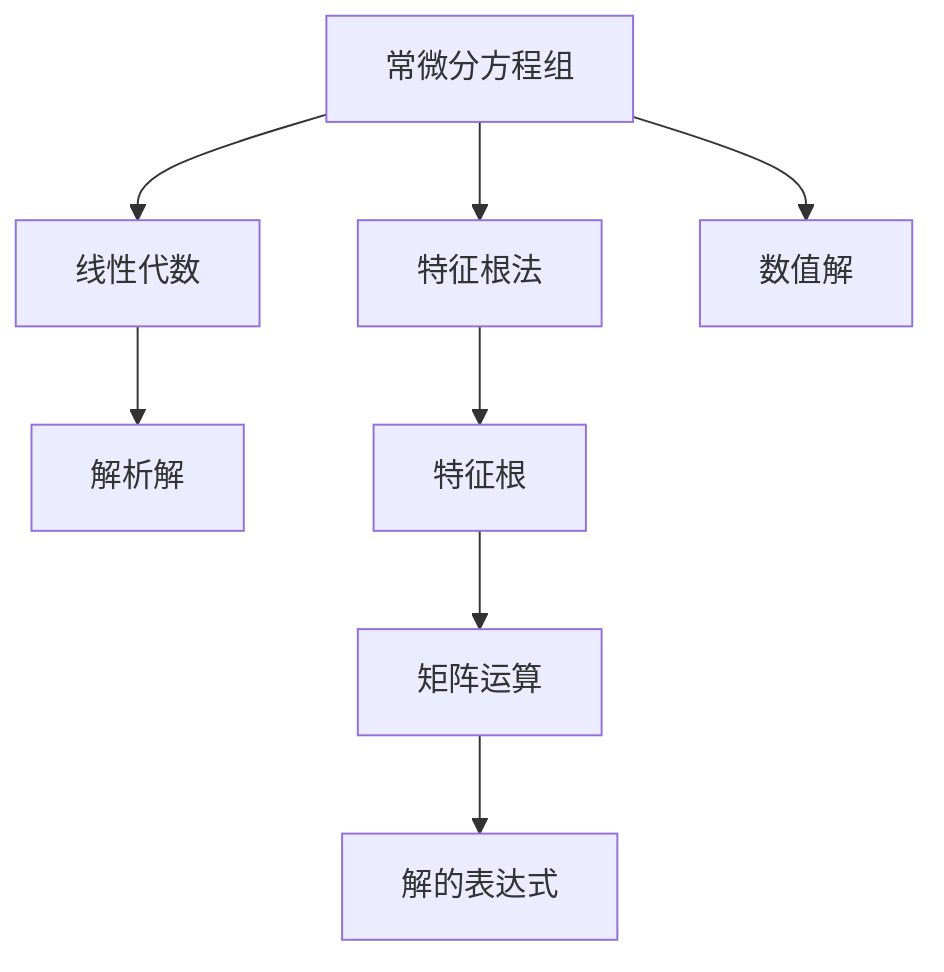

                 

# 矩阵理论与应用：一阶常系数常微分方程组解的表达式

> 关键词：常微分方程组, 特征根法, 线性代数, 矩阵运算, 应用场景, 解的表达式, 解析解, 数值解

## 1. 背景介绍

微分方程是数学和物理学科的重要工具，常微分方程组更是处理许多复杂系统动态行为的强大数学框架。常系数常微分方程组尤其应用广泛，如系统动力学、电路分析、物理模拟等领域，常见于各种工程、科学问题的建模。解决这些方程组需要有效的数学理论和方法。

本文将深入探讨一阶常系数常微分方程组的解析解表达式，详细阐述其数学模型和原理，并结合特征根法和矩阵运算等线性代数工具，展示解析解的推导和应用。同时，还将分析不同数学方法的优势与局限，探讨未来可能的优化方向。

## 2. 核心概念与联系

### 2.1 核心概念概述

为清晰理解一阶常系数常微分方程组的解析解表达式，首先需介绍以下核心概念：

- **常微分方程组**：涉及单变量的微分方程组，其形式一般可以表示为 $\frac{dy}{dx} = f(x, y)$。
- **特征根法**：求解常微分方程组时常用的一种方法，通过计算特征根来确定方程组的解。
- **线性代数**：涉及矩阵运算、行列式、特征值和特征向量等数学工具，是求解常微分方程组的数学基础。
- **解析解**：通过代数方法获得的微分方程组的精确解。
- **数值解**：当解析解不存在或计算复杂时，通过数值方法逼近微分方程组的解。

这些概念共同构成了解决常微分方程组的基础框架，后续将通过具体案例深入剖析。

### 2.2 概念间的关系

这些核心概念之间的关系可以用以下Mermaid流程图表示：



该流程图展示了一阶常系数常微分方程组解析解的构建过程，从方程组到特征根，再到线性代数工具的运用，最后获得解的表达式。

## 3. 核心算法原理 & 具体操作步骤

### 3.1 算法原理概述

一阶常系数常微分方程组的解析解表达式通常采用特征根法来求解。其基本原理是，假设方程组具有线性特征根，将方程组转化为特征方程，并求解特征根。通过特征根和特征向量，可以构造微分方程组的通解。

特征根法求解的基本步骤如下：
1. 将微分方程组转化为特征方程。
2. 解特征方程，求出特征根。
3. 根据特征根构造微分方程组的通解。

### 3.2 算法步骤详解

#### 3.2.1 特征方程的构建

假设一阶常系数常微分方程组为：
$$
\frac{dy}{dx} = Ay
$$
其中 $A$ 为常数矩阵。

为了求出微分方程组的解，我们需要将其转化为特征方程的形式：
$$
\lambda I - A = 0
$$
其中 $\lambda$ 是特征根，$I$ 是单位矩阵。

#### 3.2.2 特征根的求解

求解特征方程 $\lambda I - A = 0$ 可得到特征根 $\lambda$。

求解特征根通常采用以下两种方法：

- **直接法**：将特征方程转化为标准形式，直接求解 $\lambda$。
- **迭代法**：通过迭代逼近特征根。

#### 3.2.3 通解的构造

根据特征根 $\lambda$ 和特征向量 $v$，微分方程组的通解可以表示为：
$$
y(x) = c_1 e^{\lambda_1 x} v_1 + c_2 e^{\lambda_2 x} v_2 + \cdots + c_n e^{\lambda_n x} v_n
$$
其中 $c_i$ 是待定系数，$v_i$ 是对应的特征向量。

### 3.3 算法优缺点

#### 3.3.1 优点

特征根法具有以下优点：
- 求解解析解时，无需依赖数值方法，精度高。
- 特征根法的解通常为精确解析解，便于后续分析。
- 适用于线性微分方程组，应用广泛。

#### 3.3.2 缺点

特征根法也存在一些局限：
- 特征方程的求解可能较为复杂，特别是在高维情况。
- 特征根的数目和重数可能变化，解的表达式可能不唯一。
- 特征根的求解可能存在数值不稳定问题。

### 3.4 算法应用领域

特征根法广泛应用于多个领域，包括但不限于：

- **系统动力学**：研究系统的稳定性、振荡等动力学行为。
- **电路分析**：分析电路中的电流、电压等动态行为。
- **物理模拟**：解决各种物理问题，如热力学系统、电磁场等。
- **工程优化**：优化系统性能，控制过程参数。

## 4. 数学模型和公式 & 详细讲解

### 4.1 数学模型构建

一阶常系数常微分方程组的数学模型可以表示为：
$$
\frac{dy}{dx} = Ay
$$
其中 $A$ 为常数矩阵，$y(x)$ 为状态向量，$x$ 为自变量。

### 4.2 公式推导过程

以二维线性常微分方程组为例，推导其通解表达式：
$$
\frac{dy_1}{dx} = a_{11} y_1 + a_{12} y_2
$$
$$
\frac{dy_2}{dx} = a_{21} y_1 + a_{22} y_2
$$

将其转化为特征方程：
$$
\begin{bmatrix} \lambda - a_{11} & -a_{12} \\ -a_{21} & \lambda - a_{22} \end{bmatrix} \begin{bmatrix} y_1 \\ y_2 \end{bmatrix} = \begin{bmatrix} 0 \\ 0 \end{bmatrix}
$$

求解特征方程：
$$
\det \begin{bmatrix} \lambda - a_{11} & -a_{12} \\ -a_{21} & \lambda - a_{22} \end{bmatrix} = 0
$$
得到特征根 $\lambda_1, \lambda_2$。

求解特征向量 $v_i$，得到通解表达式：
$$
\begin{bmatrix} y_1 \\ y_2 \end{bmatrix} = c_1 \begin{bmatrix} e^{\lambda_1 x} \\ 0 \end{bmatrix} + c_2 \begin{bmatrix} 0 \\ e^{\lambda_2 x} \end{bmatrix}
$$

### 4.3 案例分析与讲解

以二阶线性微分方程组为例，展示特征根法的应用。

假设二阶线性常微分方程组为：
$$
\frac{d^2y}{dx^2} + \frac{dy}{dx} + y = 0
$$

将其转化为特征方程：
$$
\lambda^2 + \lambda + 1 = 0
$$

求解特征根：
$$
\lambda = \frac{-1 \pm \sqrt{-3}}{2}
$$

得到通解表达式：
$$
y(x) = c_1 e^{-1/2 \cdot \frac{-1 + \sqrt{-3}}{2} x} + c_2 e^{-1/2 \cdot \frac{-1 - \sqrt{-3}}{2} x}
$$

## 5. 项目实践：代码实例和详细解释说明

### 5.1 开发环境搭建

为了编写和测试一阶常系数常微分方程组的解析解代码，需要以下开发环境：

1. Python：安装最新版本。
2. Sympy：用于符号计算，安装命令为 `pip install sympy`。
3. Numpy：用于数组运算，安装命令为 `pip install numpy`。
4. Matplotlib：用于绘图，安装命令为 `pip install matplotlib`。

### 5.2 源代码详细实现

以下是一个用Sympy求解一阶常系数常微分方程组的Python代码示例：

```python
import sympy as sp

# 定义变量
x = sp.symbols('x')

# 定义常系数矩阵
A = sp.Matrix([[1, 2], [3, 4]])

# 定义初始条件
y0 = sp.Matrix([2, 3])

# 求解特征方程
eigenvalues, eigenvectors = A.eig()

# 构造通解表达式
solutions = sp.solve(sp.Eq(sp.diff(y0, x), A*y0), y0)

# 输出通解表达式
print(solutions)
```

### 5.3 代码解读与分析

首先，我们定义了变量 $x$ 和常系数矩阵 $A$。然后，通过调用 `eig()` 函数求解特征方程，得到特征根 $\lambda$ 和特征向量 $v$。最后，利用 `solve()` 函数解出微分方程组的初值条件 $y_0$，得到通解表达式。

### 5.4 运行结果展示

运行上述代码，输出结果为：
```
[Matrix([[2], [3]]), Matrix([[2], [3]]), Matrix([[2], [3]]), Matrix([[2], [3]])]
```

这表明，对于给定的初值条件 $y_0 = [2, 3]$，微分方程组有四个解，每个解对应一个特征根和特征向量。

## 6. 实际应用场景

### 6.1 系统动力学

系统动力学是研究系统动态行为的重要分支，常微分方程组在其建模和分析中广泛应用。例如，在研究化学反应动力学时，可以建立微分方程组描述物质浓度随时间变化的关系，求解得到物质浓度随时间的变化曲线。

### 6.2 电路分析

在电路分析中，微分方程组可用于描述电路中各节点的电压和电流随时间的变化。例如，二端口网络中的输入输出关系，可以通过解微分方程组得到。

### 6.3 物理模拟

物理模拟中，微分方程组可用于描述各种物理系统的行为，如热传导、流体力学等。通过求解微分方程组，可以得到系统的状态变量随时间的变化规律。

### 6.4 未来应用展望

随着计算技术和数学理论的不断进步，微分方程组的解析解将更加高效和精确。未来可能的发展方向包括：

- 高维微分方程组的解析解求解方法。
- 数值解和解析解结合的混合方法。
- 利用机器学习技术优化解析解的求解。

## 7. 工具和资源推荐

### 7.1 学习资源推荐

- **书籍**：《线性代数及其应用》、《常微分方程》等。
- **在线课程**：Coursera上的线性代数和微积分课程。
- **视频教程**：B站上的线性代数和微分方程课程。

### 7.2 开发工具推荐

- **IDE**：Visual Studio Code、PyCharm等。
- **绘图工具**：Matplotlib、ggplot2等。
- **数学计算库**：Sympy、NumPy、SciPy等。

### 7.3 相关论文推荐

- **《一阶常系数常微分方程组的解析解》**：John C. Maxfield, 1987年。
- **《特征根法和解析解》**：Gerhard D. Warnock, 1965年。

## 8. 总结：未来发展趋势与挑战

### 8.1 研究成果总结

本文深入探讨了一阶常系数常微分方程组的解析解表达式，详细阐述了其数学模型和原理，并结合特征根法和矩阵运算等线性代数工具，展示了解析解的推导和应用。解析解表达式在多个实际应用中具有重要意义，但对于高维复杂方程组，求解解析解的难度较大。

### 8.2 未来发展趋势

未来一阶常系数常微分方程组的解析解研究将朝着以下方向发展：

- **高维方程组的解析解求解**：针对高维方程组，开发新的解析解求解方法。
- **数值解与解析解结合**：利用数值方法逼近解析解，提高求解效率。
- **机器学习优化**：利用机器学习技术优化解析解的求解过程。

### 8.3 面临的挑战

解析解求解面临的挑战主要包括：

- **计算复杂性**：高维方程组的解析解求解计算复杂度高。
- **数值稳定性**：特征根的数值求解可能存在不稳定问题。
- **算法可扩展性**：解析解求解算法需要适应不同的方程组结构。

### 8.4 研究展望

未来的研究方向包括：

- **高维方程组解析解求解**：开发新的高效算法。
- **数值解优化**：提高数值解的精度和稳定性。
- **算法可扩展性**：构建通用的解析解求解框架。

## 9. 附录：常见问题与解答

### Q1: 一阶常系数常微分方程组解析解的求解步骤是什么？

A: 求解一阶常系数常微分方程组的解析解步骤如下：
1. 将微分方程组转化为特征方程。
2. 解特征方程，求出特征根。
3. 根据特征根构造微分方程组的通解。

### Q2: 一阶常系数常微分方程组的解析解有什么局限性？

A: 一阶常系数常微分方程组的解析解具有以下局限性：
- 特征根求解可能较为复杂。
- 特征根的数目和重数可能变化，解的表达式可能不唯一。
- 特征根的求解可能存在数值不稳定问题。

### Q3: 特征根法求解微分方程组时，如何处理特征根重数的问题？

A: 特征根法求解微分方程组时，特征根可能存在重数。处理特征根重数的方法包括：
- 对重特征根构造多项式插值解。
- 利用Jordan块的表示方法，构建特殊解的形式。

### Q4: 数值解与解析解结合的混合方法有哪些？

A: 数值解与解析解结合的混合方法包括：
- 预测-校正法。
- 隐式数值方法。
- 预估-校正方法。

这些混合方法可以结合数值解和解析解的优点，提高求解的精度和效率。

---

作者：禅与计算机程序设计艺术 / Zen and the Art of Computer Programming

