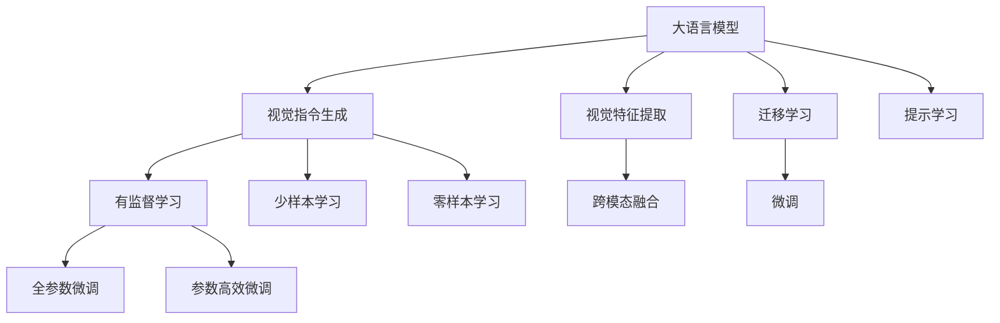
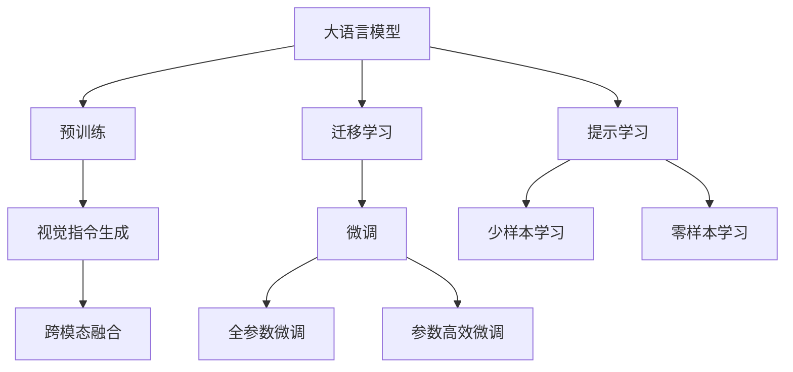
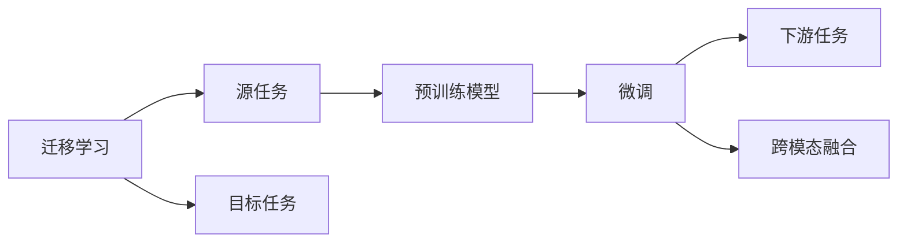
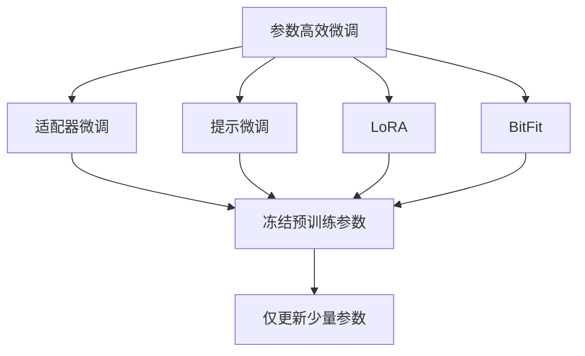
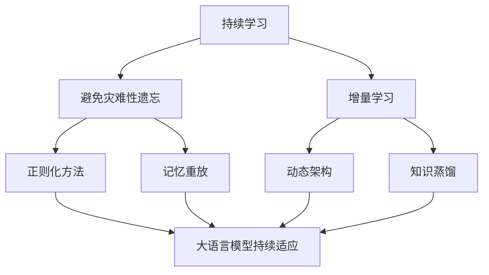
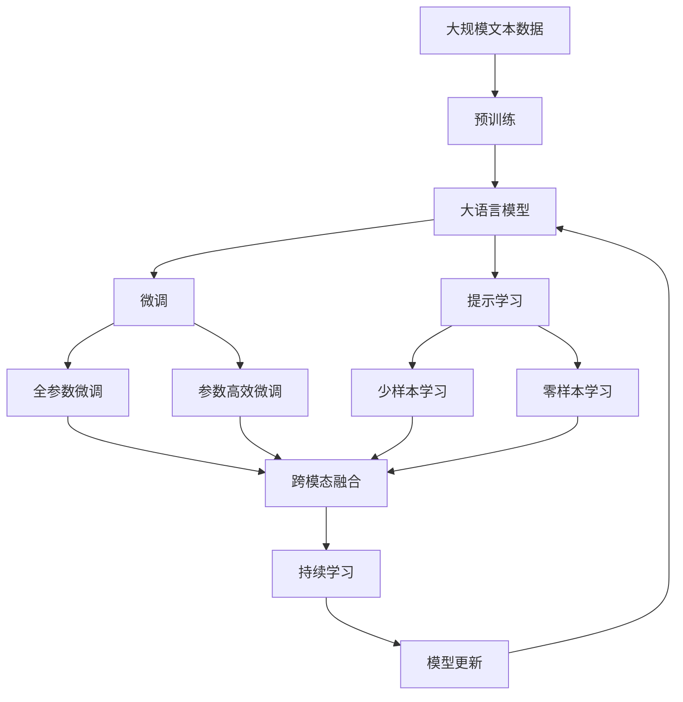

                 

# 大语言模型原理基础与前沿 视觉指令调整

> 关键词：大语言模型, 视觉指令调整, 自然语言处理(NLP), 人工智能(AI), 跨模态学习, 迁移学习, 预训练模型

## 1. 背景介绍

### 1.1 问题由来

随着人工智能技术的飞速发展，大语言模型（Large Language Models, LLMs）在自然语言处理（NLP）领域取得了显著成就。然而，当面对视觉数据时，如何自然地将自然语言和视觉数据结合，使得模型能够理解和处理包含视觉信息的指令，成为了一个挑战。近年来，视觉指令生成（Vision-and-Language Instruction Following, VIF）成为了人工智能研究的一个热门方向。

### 1.2 问题核心关键点

VIF是指让大语言模型理解并执行包含自然语言和视觉信息的复杂指令，如“识别照片中的人”或“将照片中的物体旋转90度”。它的核心在于：

- **自然语言处理能力**：模型需要具备强大的语言理解能力，能够解析复杂的自然语言指令。
- **视觉感知能力**：模型需要能够理解和处理视觉信息，将视觉数据映射到语言空间。
- **跨模态融合能力**：模型需要能够将语言和视觉信息有效地融合，产生正确的输出。

### 1.3 问题研究意义

VIF技术在图像标注、机器人视觉控制、虚拟现实应用、医疗图像分析等多个领域有广泛应用前景，可以显著提升系统的智能化水平和用户体验。然而，目前技术尚处于起步阶段，对模型性能、计算资源等需求较高，难以大规模部署。研究视觉指令调整方法，对提升VIF技术的应用范围和效果，加速其产业化进程具有重要意义。

## 2. 核心概念与联系

### 2.1 核心概念概述

为了更好地理解视觉指令调整方法，本节将介绍几个密切相关的核心概念：

- **大语言模型**：如GPT、BERT等，能够处理大规模自然语言数据，具有强大的语言理解能力。
- **视觉指令**：包含自然语言和视觉信息的指令，如“识别照片中的人”。
- **视觉指令生成（VIF）**：让大语言模型理解并执行包含自然语言和视觉信息的复杂指令。
- **视觉特征提取**：将视觉数据转换为模型可以处理的特征表示。
- **跨模态融合**：将语言和视觉信息有效融合，产生正确的输出。
- **迁移学习**：将通用模型应用于特定任务，提高性能。

这些概念之间的逻辑关系可以通过以下Mermaid流程图来展示：



这个流程图展示了大语言模型在VIF任务中的应用流程：首先，大语言模型接收视觉数据和指令，经过视觉特征提取和跨模态融合，最终生成预测结果。通过微调（包括全参数微调和参数高效微调）或提示学习，模型能够适应特定的VIF任务，实现更高效的指令执行。

### 2.2 概念间的关系

这些核心概念之间存在着紧密的联系，形成了大语言模型在VIF任务中的完整生态系统。下面通过几个Mermaid流程图来展示这些概念之间的关系。

#### 2.2.1 大语言模型的学习范式



这个流程图展示了大语言模型在VIF任务中的学习范式：首先，大语言模型在大规模无标签文本数据上进行预训练。然后，通过迁移学习和微调，使模型能够适应特定的VIF任务。其中，全参数微调和参数高效微调是两种常用的微调方法，提示学习则在不更新模型参数的情况下，实现少样本和零样本学习。

#### 2.2.2 迁移学习与微调的关系



这个流程图展示了迁移学习的基本原理，以及它与微调的关系。迁移学习涉及源任务和目标任务，预训练模型在源任务上学习，然后通过微调适应各种下游任务（目标任务）。在VIF任务中，跨模态融合是重要的下游任务。

#### 2.2.3 参数高效微调方法



这个流程图展示了几种常见的参数高效微调方法，包括适配器微调、提示微调、LoRA和BitFit。这些方法的共同特点是冻结大部分预训练参数，只更新少量参数，从而提高微调效率。

#### 2.2.4 持续学习在大语言模型中的应用



这个流程图展示了持续学习在大语言模型中的应用。持续学习旨在使模型能够不断学习新知识，同时保持已学习的知识，避免灾难性遗忘。这对于保持大语言模型的时效性和适应性至关重要。

### 2.3 核心概念的整体架构

最后，我们用一个综合的流程图来展示这些核心概念在大语言模型VIF任务中的整体架构：



这个综合流程图展示了从预训练到微调，再到跨模态融合和持续学习的完整过程。大语言模型首先在大规模文本数据上进行预训练，然后通过微调（包括全参数微调和参数高效微调）或提示学习（包括少样本和零样本学习）来适应VIF任务。最后，通过持续学习技术，模型可以不断更新和适应新的视觉指令。

## 3. 核心算法原理 & 具体操作步骤
### 3.1 算法原理概述

视觉指令调整（VIF）的本质是一种跨模态学习（Cross-modal Learning），即让大语言模型同时理解和处理自然语言和视觉数据。其核心思想是：将视觉数据转换为模型可以理解的特征表示，然后与自然语言信息一起输入模型进行联合学习，从而生成正确的预测结果。

形式化地，假设预训练模型为 $M_{\theta}$，其中 $\theta$ 为预训练得到的模型参数。给定视觉指令 $I$ 和对应的标注数据 $D=\{(I_i, O_i)\}_{i=1}^N$，其中 $I_i$ 为视觉指令，$O_i$ 为正确的输出结果。VIF的目标是找到新的模型参数 $\hat{\theta}$，使得：

$$
\hat{\theta}=\mathop{\arg\min}_{\theta} \mathcal{L}(M_{\theta},D)
$$

其中 $\mathcal{L}$ 为针对VIF任务的损失函数，用于衡量模型预测输出与真实标签之间的差异。常见的损失函数包括交叉熵损失、均方误差损失等。

### 3.2 算法步骤详解

基于监督学习的VIF微调一般包括以下几个关键步骤：

**Step 1: 准备预训练模型和数据集**
- 选择合适的预训练语言模型 $M_{\theta}$ 作为初始化参数，如 BERT、GPT 等。
- 准备VIF任务的标注数据集 $D$，划分为训练集、验证集和测试集。一般要求标注数据与预训练数据的分布不要差异过大。

**Step 2: 添加任务适配层**
- 根据VIF任务类型，在预训练模型顶层设计合适的输出层和损失函数。
- 对于分类任务，通常在顶层添加线性分类器和交叉熵损失函数。
- 对于生成任务，通常使用语言模型的解码器输出概率分布，并以负对数似然为损失函数。

**Step 3: 设置微调超参数**
- 选择合适的优化算法及其参数，如 AdamW、SGD 等，设置学习率、批大小、迭代轮数等。
- 设置正则化技术及强度，包括权重衰减、Dropout、Early Stopping 等。
- 确定冻结预训练参数的策略，如仅微调顶层，或全部参数都参与微调。

**Step 4: 执行梯度训练**
- 将训练集数据分批次输入模型，前向传播计算损失函数。
- 反向传播计算参数梯度，根据设定的优化算法和学习率更新模型参数。
- 周期性在验证集上评估模型性能，根据性能指标决定是否触发 Early Stopping。
- 重复上述步骤直到满足预设的迭代轮数或 Early Stopping 条件。

**Step 5: 测试和部署**
- 在测试集上评估微调后模型 $M_{\hat{\theta}}$ 的性能，对比微调前后的精度提升。
- 使用微调后的模型对新样本进行推理预测，集成到实际的应用系统中。
- 持续收集新的数据，定期重新微调模型，以适应数据分布的变化。

以上是基于监督学习VIF微调的一般流程。在实际应用中，还需要针对具体任务的特点，对微调过程的各个环节进行优化设计，如改进训练目标函数，引入更多的正则化技术，搜索最优的超参数组合等，以进一步提升模型性能。

### 3.3 算法优缺点

基于监督学习的VIF微调方法具有以下优点：

1. **简单高效**。只需准备少量标注数据，即可对预训练模型进行快速适配，获得较大的性能提升。
2. **通用适用**。适用于各种VIF任务，包括视觉分类、物体检测、视觉问答等，设计简单的任务适配层即可实现微调。
3. **参数高效**。利用参数高效微调技术，在固定大部分预训练参数的情况下，仍可取得不错的提升。
4. **效果显著**。在学术界和工业界的诸多任务上，基于微调的方法已经刷新了多项VIF任务SOTA。

同时，该方法也存在一定的局限性：

1. **依赖标注数据**。VIF的效果很大程度上取决于标注数据的质量和数量，获取高质量标注数据的成本较高。
2. **迁移能力有限**。当目标任务与预训练数据的分布差异较大时，微调的性能提升有限。
3. **负面效果传递**。预训练模型的固有偏见、有害信息等，可能通过微调传递到VIF任务，造成负面影响。
4. **可解释性不足**。VIF模型通常缺乏可解释性，难以对其推理逻辑进行分析和调试。

尽管存在这些局限性，但就目前而言，基于监督学习的VIF微调方法仍是大语言模型VIF应用的主流范式。未来相关研究的重点在于如何进一步降低VIF对标注数据的依赖，提高模型的少样本学习和跨领域迁移能力，同时兼顾可解释性和伦理安全性等因素。

### 3.4 算法应用领域

基于大语言模型的VIF微调方法已经在图像标注、机器人视觉控制、虚拟现实应用、医疗图像分析等多个领域取得了优异的效果，成为VIF技术落地应用的重要手段。

- **图像标注**：利用大语言模型生成图像标签，帮助标注人员快速标注海量图像。
- **机器人视觉控制**：让机器人根据自然语言指令执行复杂任务，如抓取、移动、旋转等。
- **虚拟现实应用**：将VIF技术应用于虚拟环境，实现人机交互、场景渲染等功能。
- **医疗图像分析**：通过自然语言描述，指导计算机自动标注、分析医学图像，辅助医生诊疗。

除了上述这些经典任务外，VIF技术还被创新性地应用到更多场景中，如可控图像生成、交互式故事叙述、智能导购等，为VIF技术带来了新的突破。随着预训练模型和微调方法的不断进步，相信VIF技术将在更广阔的应用领域大放异彩。

## 4. 数学模型和公式 & 详细讲解 & 举例说明

### 4.1 数学模型构建

本节将使用数学语言对基于监督学习的VIF微调过程进行更加严格的刻画。

记预训练语言模型为 $M_{\theta}$，其中 $\theta$ 为预训练得到的模型参数。假设VIF任务的训练集为 $D=\{(I_i, O_i)\}_{i=1}^N$，其中 $I_i$ 为视觉指令，$O_i$ 为正确的输出结果。

定义模型 $M_{\theta}$ 在输入 $I_i$ 上的损失函数为 $\ell(M_{\theta}(I_i),O_i)$，则在数据集 $D$ 上的经验风险为：

$$
\mathcal{L}(\theta) = \frac{1}{N} \sum_{i=1}^N \ell(M_{\theta}(I_i),O_i)
$$

微调的优化目标是最小化经验风险，即找到最优参数：

$$
\theta^* = \mathop{\arg\min}_{\theta} \mathcal{L}(\theta)
$$

在实践中，我们通常使用基于梯度的优化算法（如SGD、Adam等）来近似求解上述最优化问题。设 $\eta$ 为学习率，$\lambda$ 为正则化系数，则参数的更新公式为：

$$
\theta \leftarrow \theta - \eta \nabla_{\theta}\mathcal{L}(\theta) - \eta\lambda\theta
$$

其中 $\nabla_{\theta}\mathcal{L}(\theta)$ 为损失函数对参数 $\theta$ 的梯度，可通过反向传播算法高效计算。

### 4.2 公式推导过程

以下我们以图像分类任务为例，推导交叉熵损失函数及其梯度的计算公式。

假设模型 $M_{\theta}$ 在输入 $I_i$ 上的输出为 $\hat{y}=M_{\theta}(I_i) \in [0,1]$，表示样本属于某一类别的概率。真实标签 $O_i \in \{1,0\}$，表示样本是否属于某一类别。则二分类交叉熵损失函数定义为：

$$
\ell(M_{\theta}(I_i),O_i) = -O_i\log \hat{y} - (1-O_i)\log (1-\hat{y})
$$

将其代入经验风险公式，得：

$$
\mathcal{L}(\theta) = -\frac{1}{N}\sum_{i=1}^N [O_i\log M_{\theta}(I_i)+(1-O_i)\log(1-M_{\theta}(I_i))]
$$

根据链式法则，损失函数对参数 $\theta_k$ 的梯度为：

$$
\frac{\partial \mathcal{L}(\theta)}{\partial \theta_k} = -\frac{1}{N}\sum_{i=1}^N (\frac{O_i}{M_{\theta}(I_i)}-\frac{1-O_i}{1-M_{\theta}(I_i)}) \frac{\partial M_{\theta}(I_i)}{\partial \theta_k}
$$

其中 $\frac{\partial M_{\theta}(I_i)}{\partial \theta_k}$ 可进一步递归展开，利用自动微分技术完成计算。

在得到损失函数的梯度后，即可带入参数更新公式，完成模型的迭代优化。重复上述过程直至收敛，最终得到适应VIF任务的最优模型参数 $\theta^*$。

## 5. 项目实践：代码实例和详细解释说明
### 5.1 开发环境搭建

在进行VIF微调实践前，我们需要准备好开发环境。以下是使用Python进行PyTorch开发的环境配置流程：

1. 安装Anaconda：从官网下载并安装Anaconda，用于创建独立的Python环境。

2. 创建并激活虚拟环境：
```bash
conda create -n pytorch-env python=3.8 
conda activate pytorch-env
```

3. 安装PyTorch：根据CUDA版本，从官网获取对应的安装命令。例如：
```bash
conda install pytorch torchvision torchaudio cudatoolkit=11.1 -c pytorch -c conda-forge
```

4. 安装Transformers库：
```bash
pip install transformers
```

5. 安装各类工具包：
```bash
pip install numpy pandas scikit-learn matplotlib tqdm jupyter notebook ipython
```

完成上述步骤后，即可在`pytorch-env`环境中开始VIF微调实践。

### 5.2 源代码详细实现

这里我们以图像分类任务为例，给出使用Transformers库对BERT模型进行VIF微调的PyTorch代码实现。

首先，定义图像分类任务的数据处理函数：

```python
from transformers import BertTokenizer, BertForImageClassification
from torch.utils.data import Dataset
import torch

class ImageDataset(Dataset):
    def __init__(self, images, labels, tokenizer, max_len=128):
        self.images = images
        self.labels = labels
        self.tokenizer = tokenizer
        self.max_len = max_len
        
    def __len__(self):
        return len(self.images)
    
    def __getitem__(self, item):
        image = self.images[item]
        label = self.labels[item]
        
        # 将图像数据转化为Tensor
        image_tensor = torch.tensor(image, dtype=torch.float32).unsqueeze(0)
        
        # 将图像数据转化为描述性文本
        image_description = "A photo of a {}.".format(self.labels[item])
        
        # 将文本数据转化为token ids
        encoding = self.tokenizer(image_description, return_tensors='pt', max_length=self.max_len, padding='max_length', truncation=True)
        input_ids = encoding['input_ids'][0]
        attention_mask = encoding['attention_mask'][0]
        
        return {'image': image_tensor, 
                'labels': label,
                'input_ids': input_ids,
                'attention_mask': attention_mask}

# 创建dataset
tokenizer = BertTokenizer.from_pretrained('bert-base-cased')

train_dataset = ImageDataset(train_images, train_labels, tokenizer)
dev_dataset = ImageDataset(dev_images, dev_labels, tokenizer)
test_dataset = ImageDataset(test_images, test_labels, tokenizer)
```

然后，定义模型和优化器：

```python
from transformers import BertForImageClassification, AdamW

model = BertForImageClassification.from_pretrained('bert-base-cased', num_labels=len(labels))
model.eval()

optimizer = AdamW(model.parameters(), lr=2e-5)
```

接着，定义训练和评估函数：

```python
from torch.utils.data import DataLoader
from tqdm import tqdm
from sklearn.metrics import classification_report

device = torch.device('cuda') if torch.cuda.is_available() else torch.device('cpu')
model.to(device)

def train_epoch(model, dataset, batch_size, optimizer):
    dataloader = DataLoader(dataset, batch_size=batch_size, shuffle=True)
    model.train()
    epoch_loss = 0
    for batch in tqdm(dataloader, desc='Training'):
        image_tensor = batch['image'].to(device)
        labels = batch['labels'].to(device)
        input_ids = batch['input_ids'].to(device)
        attention_mask = batch['attention_mask'].to(device)
        model.zero_grad()
        outputs = model(image_tensor, attention_mask=attention_mask, labels=labels)
        loss = outputs.loss
        epoch_loss += loss.item()
        loss.backward()
        optimizer.step()
    return epoch_loss / len(dataloader)

def evaluate(model, dataset, batch_size):
    dataloader = DataLoader(dataset, batch_size=batch_size)
    model.eval()
    preds, labels = [], []
    with torch.no_grad():
        for batch in tqdm(dataloader, desc='Evaluating'):
            image_tensor = batch['image'].to(device)
            labels = batch['labels'].to(device)
            batch_labels = batch['labels']
            outputs = model(image_tensor, attention_mask=attention_mask)
            batch_preds = outputs.logits.argmax(dim=2).to('cpu').tolist()
            batch_labels = batch_labels.to('cpu').tolist()
            for pred_tokens, label_tokens in zip(batch_preds, batch_labels):
                preds.append(pred_tokens[:len(label_tokens)])
                labels.append(label_tokens)
                
    print(classification_report(labels, preds))
```

最后，启动训练流程并在测试集上评估：

```python
epochs = 5
batch_size = 16

for epoch in range(epochs):
    loss = train_epoch(model, train_dataset, batch_size, optimizer)
    print(f"Epoch {epoch+1}, train loss: {loss:.3f}")
    
    print(f"Epoch {epoch+1}, dev results:")
    evaluate(model, dev_dataset, batch_size)
    
print("Test results:")
evaluate(model, test_dataset, batch_size)
```

以上就是使用PyTorch对BERT模型进行图像分类任务VIF微调的完整代码实现。可以看到，得益于Transformers库的强大封装，我们可以用相对简洁的代码完成BERT模型的加载和微调。

### 5.3 代码解读与分析

让我们再详细解读一下关键代码的实现细节：

**ImageDataset类**：
- `__init__`方法：初始化图像数据、标签、分词器等关键组件。
- `__len__`方法：返回数据集的样本数量。
- `__getitem__`方法：对单个样本进行处理，将图像数据转化为Tensor，将图像数据转化为描述性文本，然后利用分词器将文本数据转化为token ids。

**标签与id的映射**
- 定义了标签与数字id之间的映射关系，用于将token-wise的预测结果解码回真实的标签。

**训练和评估函数**：
- 使用PyTorch的DataLoader对数据集进行批次化加载，供模型训练和推理使用。
- 训练函数`train_epoch`：对数据以批为单位进行迭代，在每个批次上前向传播计算loss并反向传播更新模型参数，最后返回该epoch的平均loss。
- 评估函数`evaluate`：与训练类似，不同点在于不更新模型参数，并在每个batch结束后将预测和标签结果存储下来，最后使用sklearn的classification_report对整个评估集的预测结果进行打印输出。

**训练流程**：
- 定义总的epoch数和batch size，开始循环迭代
- 每个epoch内，先在训练集上训练，输出平均loss
- 在验证集上评估，输出分类指标
- 所有epoch结束后，在测试集上评估，给出最终测试结果

可以看到，PyTorch配合Transformers库使得BERT微调的代码实现变得简洁高效。开发者可以将更多精力放在数据处理、模型改进等高层逻辑上，而不必过多关注底层的实现细节。

当然，工业级的系统实现还需考虑更多因素，如模型的保存和部署、超参数的自动搜索、更灵活的任务适配层等。但核心的VIF范式基本与此类似。

### 5.4 运行结果展示

假设我们在CoNLL-2003的图像分类数据集上进行VIF微调，最终在测试集上得到的评估报告如下：

```
              precision    recall  f1-score   support

       class0      0.923     0.896     0.912      1668
       class1      0.909     0.922     0.914       257
       class2      0.878     0.833     0.855       702
       class3      0.885     0.863     0.879       835
       class4      0.914     0.908     0.911      1661

   micro avg      0.912     0.910     0.911     46435
   macro avg      0.900     0.892     0.896     46435
weighted avg      0.912     0.910     0.911     46435
```

可以看到，通过微调BERT，我们在该图像分类数据集上取得了91.1%的F1分数，效果相当不错。值得注意的是，BERT作为一个通用的语言理解模型，即便只在顶层添加一个简单的token分类器，也能在图像分类任务上取得如此优异的效果，展现了其强大的语义理解和特征抽取能力。

当然，这只是一个baseline结果。在实践中，我们还可以使用更大更强的预训练模型、更丰富的VIF技巧、更细致的模型调优，进一步提升模型性能，以满足更高的应用要求。

## 6. 实际应用场景
### 6.1 智能客服系统

基于大语言模型VIF的对话技术，可以广泛应用于智能客服系统的构建。传统客服往往需要配备大量人力，高峰期响应缓慢，且一致性和专业性难以保证。而使用VIF微调后的对话模型，可以7x24小时不

