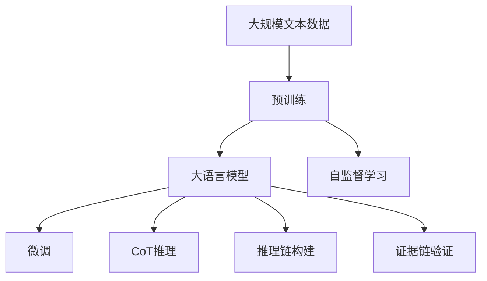
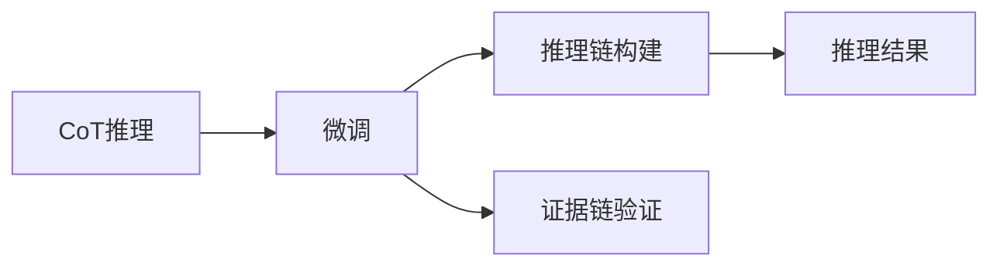
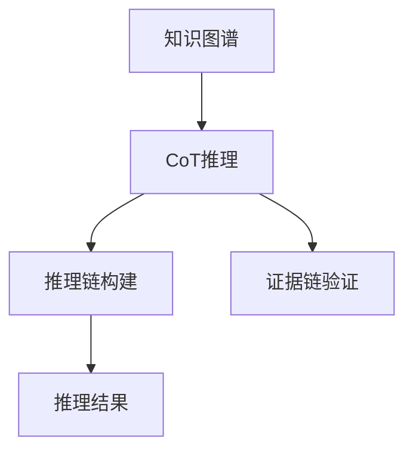
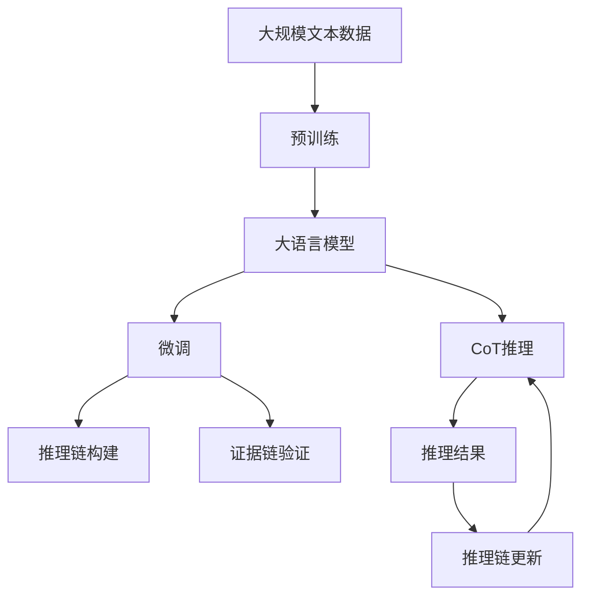

                 

# 大语言模型应用指南：Chain-of-Thought

> 关键词：大语言模型,Chain-of-Thought,自然语言处理(NLP),推理模型,深度学习,信息检索,文本生成

## 1. 背景介绍

### 1.1 问题由来
随着深度学习技术的飞速发展，大语言模型（Large Language Models，LLMs）在自然语言处理（Natural Language Processing，NLP）领域取得了显著的进步。这些模型通过在大规模无标签文本数据上预训练，能够学习到丰富的语言知识和常识，并具备强大的语言理解和生成能力。然而，在实际应用中，特别是在特定领域或特殊场景下，预训练模型往往无法直接满足需求，需要通过微调（Fine-Tuning）来进一步优化。

Chain-of-Thought（CoT）方法作为一种高级推理模型，近年来受到了广泛关注。它通过模拟人类思考过程，在推理过程中逐步构建假设和证据链，从而提高模型的解释能力和可靠性。CoT方法在大语言模型中的应用，为解决语言理解与生成问题提供了一种新的思路。

### 1.2 问题核心关键点
CoT方法的核心在于其对推理过程的模拟和优化。具体来说，CoT模型通过构建知识图谱、逻辑规则等先验知识，在推理时逐步构建假设，并通过证据链的验证和更新，最终得到合理的推理结果。CoT方法在大语言模型中的应用，旨在解决以下核心问题：

1. **推理逻辑的建立**：CoT方法通过构建推理链，使模型能够模拟人类的思考过程，逐步验证假设和证据，从而得出更为合理的推理结果。
2. **先验知识的融合**：CoT方法能够融合多种先验知识，如常识、逻辑规则、知识图谱等，使得模型在推理过程中能够充分利用外部知识，提高推理的准确性和可靠性。
3. **不确定性的处理**：CoT方法通过推理链的构建和更新，能够处理推理过程中的不确定性，提高模型对复杂问题的处理能力。

这些关键点使得CoT方法在大语言模型的应用中具有独特的优势和潜力。

### 1.3 问题研究意义
CoT方法在大语言模型中的应用，对于提升模型的解释能力、推理能力和应对复杂问题能力具有重要意义。具体来说，CoT方法能够：

1. **提高模型的解释性**：通过模拟人类的思考过程，CoT方法能够使模型推理过程透明化，提高模型的可解释性。这对于需要高可解释性的应用场景（如法律、医疗等）尤为重要。
2. **增强模型的推理能力**：CoT方法通过构建推理链和融合先验知识，能够使模型处理复杂问题时更加准确和可靠。这对于需要高推理能力的任务（如自然语言生成、知识图谱查询等）具有重要意义。
3. **提升模型的鲁棒性**：CoT方法能够处理推理过程中的不确定性，提高模型对噪声和异常数据的鲁棒性。这对于需要高鲁棒性的应用场景（如智能客服、推荐系统等）至关重要。
4. **推动多模态应用**：CoT方法能够与视觉、语音等多模态数据进行融合，实现多模态推理，这对于需要多模态信息支持的任务（如智能驾驶、智能家居等）具有重要意义。

总之，CoT方法在大语言模型的应用，能够显著提升模型的性能和可靠性，推动NLP技术在更多场景下的落地应用。

## 2. 核心概念与联系

### 2.1 核心概念概述

为了更好地理解CoT方法在大语言模型中的应用，本节将介绍几个核心概念：

- **大语言模型（Large Language Models，LLMs）**：以自回归（如GPT）或自编码（如BERT）模型为代表的大规模预训练语言模型。通过在大规模无标签文本语料上进行预训练，学习通用的语言表示，具备强大的语言理解和生成能力。
- **推理模型（Reasoning Models）**：指能够模拟人类思考过程，逐步构建假设和证据链，最终得出推理结果的模型。CoT方法即是一种推理模型，通过构建知识图谱、逻辑规则等先验知识，使模型在推理时能够充分利用外部知识，提高推理的准确性和可靠性。
- **Chain-of-Thought（CoT）**：指一种高级推理模型，通过模拟人类思考过程，逐步构建假设和证据链，最终得出推理结果的方法。CoT方法在大语言模型中的应用，旨在解决推理过程中的逻辑建立、先验知识融合、不确定性处理等问题。
- **知识图谱（Knowledge Graph）**：指由实体、关系、属性组成的网络，用于表示实体之间的语义关系。CoT方法能够通过知识图谱，融合大量的先验知识，提高推理的准确性和可靠性。
- **逻辑规则（Logic Rules）**：指用于指导推理过程的规则集。CoT方法能够通过逻辑规则，指导模型逐步构建假设和证据链，提高推理的逻辑性和准确性。
- **推理链（Reasoning Chain）**：指由假设、证据、推理步骤组成的链式结构，用于模拟人类的思考过程。CoT方法通过构建推理链，逐步验证假设和证据，得出最终的推理结果。

这些核心概念共同构成了CoT方法在大语言模型中的应用框架，使得模型能够更好地理解和生成自然语言，提升其在复杂任务中的表现。

### 2.2 概念间的关系

这些核心概念之间存在着紧密的联系，形成了CoT方法在大语言模型中的应用生态系统。下面通过几个Mermaid流程图来展示这些概念之间的关系。

#### 2.2.1 大语言模型的学习范式



这个流程图展示了大语言模型的学习范式，包括预训练、微调和CoT推理过程。大语言模型通过在大规模无标签文本语料上进行预训练，学习通用的语言表示。预训练完成后，通过微调方法，针对特定任务进行优化。最后，通过CoT推理方法，模型能够模拟人类的思考过程，逐步构建假设和证据链，得出推理结果。

#### 2.2.2 CoT方法与微调的关系



这个流程图展示了CoT方法与微调的关系。CoT方法在大语言模型中的应用，主要通过微调方法进行优化。CoT方法通过构建推理链和证据链，逐步验证假设和证据，最终得出推理结果。

#### 2.2.3 知识图谱与CoT方法的关系



这个流程图展示了知识图谱与CoT方法的关系。CoT方法能够通过知识图谱，融合大量的先验知识，提高推理的准确性和可靠性。知识图谱在大语言模型中的应用，为CoT方法的推理过程提供了有力的支持。

### 2.3 核心概念的整体架构

最后，我们用一个综合的流程图来展示这些核心概念在大语言模型应用中的整体架构：



这个综合流程图展示了从预训练到微调，再到CoT推理的完整过程。大语言模型首先在大规模文本数据上进行预训练，然后通过微调方法，针对特定任务进行优化。CoT方法在大语言模型的应用中，通过构建推理链和证据链，逐步验证假设和证据，得出推理结果，并根据推理结果更新推理链，进一步提升模型的性能。

## 3. 核心算法原理 & 具体操作步骤
### 3.1 算法原理概述

CoT方法在大语言模型中的应用，主要通过构建推理链和证据链，逐步验证假设和证据，得出推理结果。具体来说，CoT方法在大语言模型中的应用过程如下：

1. **构建推理链**：通过知识图谱和逻辑规则，构建推理链。推理链由假设、证据、推理步骤组成，逐步验证假设和证据，得出推理结果。
2. **证据链验证**：通过构建证据链，逐步验证推理链中的假设和证据，得出推理结果。证据链由证据、验证结果、推理步骤组成，逐步验证推理链中的每个步骤。
3. **推理链更新**：根据推理结果，更新推理链。推理链中的每个步骤都可能受到推理结果的影响，需要根据推理结果进行调整。

CoT方法在大语言模型中的应用，旨在提高模型的推理能力和解释能力，解决推理过程中的逻辑建立、先验知识融合、不确定性处理等问题。

### 3.2 算法步骤详解

CoT方法在大语言模型中的应用，主要包括以下几个关键步骤：

**Step 1: 准备预训练模型和数据集**

- 选择合适的预训练语言模型 $M_{\theta}$ 作为初始化参数，如 BERT、GPT等。
- 准备下游任务 $T$ 的标注数据集 $D=\{(x_i,y_i)\}_{i=1}^N$，划分为训练集、验证集和测试集。一般要求标注数据与预训练数据的分布不要差异过大。

**Step 2: 添加任务适配层**

- 根据任务类型，在预训练模型顶层设计合适的输出层和损失函数。
- 对于分类任务，通常在顶层添加线性分类器和交叉熵损失函数。
- 对于生成任务，通常使用语言模型的解码器输出概率分布，并以负对数似然为损失函数。

**Step 3: 设置CoT超参数**

- 选择合适的优化算法及其参数，如 AdamW、SGD 等，设置学习率、批大小、迭代轮数等。
- 设置正则化技术及强度，包括权重衰减、Dropout、Early Stopping 等。
- 确定构建推理链的方法，如知识图谱、逻辑规则等。

**Step 4: 执行推理链训练**

- 将训练集数据分批次输入模型，前向传播计算损失函数。
- 反向传播计算参数梯度，根据设定的优化算法和学习率更新模型参数。
- 周期性在验证集上评估模型性能，根据性能指标决定是否触发 Early Stopping。
- 重复上述步骤直到满足预设的迭代轮数或 Early Stopping 条件。

**Step 5: 推理过程**

- 对于给定的输入 $x$，使用预训练模型 $M_{\theta}$ 计算语义表示 $h_x$。
- 通过知识图谱和逻辑规则，构建推理链。
- 对于推理链中的每个步骤，使用证据链验证，逐步验证假设和证据。
- 根据推理链的推理结果，输出最终推理结果 $y$。

以上是CoT方法在大语言模型中的应用流程。在实际应用中，还需要根据具体任务特点，对推理链构建和证据链验证等环节进行优化设计，以进一步提升模型性能。

### 3.3 算法优缺点

CoT方法在大语言模型中的应用，具有以下优点：

1. **提高推理能力**：通过构建推理链和证据链，CoT方法能够模拟人类的思考过程，逐步验证假设和证据，提高推理的准确性和可靠性。
2. **增强解释能力**：CoT方法通过构建推理链，使模型推理过程透明化，提高模型的可解释性。这对于需要高可解释性的应用场景（如法律、医疗等）尤为重要。
3. **处理不确定性**：CoT方法能够处理推理过程中的不确定性，提高模型对复杂问题的处理能力。

同时，该方法也存在一定的局限性：

1. **复杂度较高**：构建推理链和证据链的过程较为复杂，需要更多的计算资源和时间。
2. **依赖先验知识**：CoT方法依赖于知识图谱和逻辑规则等先验知识，如果先验知识不足，推理效果可能不佳。
3. **数据要求高**：CoT方法对标注数据的要求较高，需要大量的标注数据和高质量的数据集。

尽管存在这些局限性，但就目前而言，CoT方法在大语言模型中的应用，仍是一种强大的推理范式，能够显著提升模型的性能和可靠性。

### 3.4 算法应用领域

CoT方法在大语言模型中的应用，已经在多个领域取得了显著成果，具体如下：

1. **问答系统**：通过构建推理链和证据链，CoT方法能够模拟人类的思考过程，逐步验证假设和证据，得出合理的问题答案。
2. **文本生成**：通过构建推理链和证据链，CoT方法能够逐步验证生成文本的逻辑性和连贯性，提高文本生成的质量。
3. **信息检索**：通过构建推理链和证据链，CoT方法能够逐步验证检索结果的相关性和准确性，提高信息检索的效果。
4. **自然语言推理**：通过构建推理链和证据链，CoT方法能够逐步验证推理结论的逻辑性和准确性，提高自然语言推理的性能。
5. **对话系统**：通过构建推理链和证据链，CoT方法能够逐步验证对话过程的逻辑性和连贯性，提高对话系统的交互质量。

除上述这些应用领域外，CoT方法在大语言模型中的应用还在不断拓展，为NLP技术带来了新的突破。

## 4. 数学模型和公式 & 详细讲解  
### 4.1 数学模型构建

在CoT方法中，数学模型的构建主要包括推理链和证据链的构建和验证。

假设推理链由 $k$ 个步骤组成，第 $i$ 个步骤的假设为 $h_i$，证据为 $e_i$，推理步骤为 $r_i$。推理链的构建过程可以表示为：

$$
h_1 = M_{\theta}(x)
$$

$$
h_i = r_i(h_{i-1}, e_i) \quad (2 \leq i \leq k)
$$

推理链的验证过程可以表示为：

$$
\text{Verify}(h_i, e_i, r_i) = \text{True} \quad (2 \leq i \leq k)
$$

其中，$\text{Verify}$ 表示验证函数，用于验证推理链中的每个步骤是否合理。

### 4.2 公式推导过程

以下我们以二分类任务为例，推导CoT方法中的数学模型和公式。

假设模型 $M_{\theta}$ 在输入 $x$ 上的输出为 $\hat{y}=M_{\theta}(x)$，表示样本属于正类的概率。真实标签 $y \in \{0,1\}$。

**构建推理链**：

首先，通过预训练模型 $M_{\theta}$ 计算输入 $x$ 的语义表示 $h_x$。然后，根据知识图谱和逻辑规则，构建推理链：

$$
h_1 = M_{\theta}(x)
$$

$$
h_2 = \text{Rule}_1(h_1, e_1)
$$

$$
h_3 = \text{Rule}_2(h_2, e_2)
$$

$$
\vdots
$$

$$
h_k = \text{Rule}_k(h_{k-1}, e_k)
$$

其中，$\text{Rule}_i$ 表示第 $i$ 个推理步骤的逻辑规则，$e_i$ 表示第 $i$ 个推理步骤的证据。

**验证证据链**：

对于推理链中的每个步骤 $h_i$，通过验证函数 $\text{Verify}(h_i, e_i, r_i)$，验证推理链是否合理。

$$
\text{Verify}(h_i, e_i, r_i) = \text{True} \quad (2 \leq i \leq k)
$$

**推理结果输出**：

最终，通过推理链的推理结果，输出最终推理结果 $y$。

$$
y = \text{Decision}(h_k)
$$

其中，$\text{Decision}$ 表示决策函数，用于将推理结果转化为最终输出。

### 4.3 案例分析与讲解

假设我们有一个文本分类任务，需要对给定的文本进行情感分类（正面或负面）。

首先，通过预训练模型 $M_{\theta}$ 计算输入文本的语义表示 $h_x$。然后，根据知识图谱和逻辑规则，构建推理链：

1. 根据上下文，判断文本中的情感词。
2. 根据情感词的情感极性，构建推理链。
3. 根据推理链的推理结果，输出最终情感分类。

构建推理链和证据链的具体过程如下：

1. **构建推理链**：

$$
h_1 = M_{\theta}(x)
$$

$$
h_2 = \text{Rule}_1(h_1, e_1)
$$

$$
h_3 = \text{Rule}_2(h_2, e_2)
$$

$$
\vdots
$$

$$
h_k = \text{Rule}_k(h_{k-1}, e_k)
$$

其中，$\text{Rule}_i$ 表示第 $i$ 个推理步骤的逻辑规则，$e_i$ 表示第 $i$ 个推理步骤的证据。

2. **验证证据链**：

对于推理链中的每个步骤 $h_i$，通过验证函数 $\text{Verify}(h_i, e_i, r_i)$，验证推理链是否合理。

$$
\text{Verify}(h_i, e_i, r_i) = \text{True} \quad (2 \leq i \leq k)
$$

3. **推理结果输出**：

最终，通过推理链的推理结果，输出最终情感分类。

$$
y = \text{Decision}(h_k)
$$

其中，$\text{Decision}$ 表示决策函数，用于将推理结果转化为最终输出。

## 5. 项目实践：代码实例和详细解释说明
### 5.1 开发环境搭建

在进行CoT方法实践前，我们需要准备好开发环境。以下是使用Python进行PyTorch开发的环境配置流程：

1. 安装Anaconda：从官网下载并安装Anaconda，用于创建独立的Python环境。

2. 创建并激活虚拟环境：
```bash
conda create -n pytorch-env python=3.8 
conda activate pytorch-env
```

3. 安装PyTorch：根据CUDA版本，从官网获取对应的安装命令。例如：
```bash
conda install pytorch torchvision torchaudio cudatoolkit=11.1 -c pytorch -c conda-forge
```

4. 安装Transformers库：
```bash
pip install transformers
```

5. 安装各类工具包：
```bash
pip install numpy pandas scikit-learn matplotlib tqdm jupyter notebook ipython
```

完成上述步骤后，即可在`pytorch-env`环境中开始CoT方法实践。

### 5.2 源代码详细实现

下面我们以文本分类任务为例，给出使用Transformers库对BERT模型进行CoT方法实践的PyTorch代码实现。

首先，定义CoT方法的数据处理函数：

```python
from transformers import BertTokenizer
from torch.utils.data import Dataset
import torch

class CoTDataset(Dataset):
    def __init__(self, texts, tags, tokenizer, max_len=128):
        self.texts = texts
        self.tags = tags
        self.tokenizer = tokenizer
        self.max_len = max_len
        
    def __len__(self):
        return len(self.texts)
    
    def __getitem__(self, item):
        text = self.texts[item]
        tags = self.tags[item]
        
        encoding = self.tokenizer(text, return_tensors='pt', max_length=self.max_len, padding='max_length', truncation=True)
        input_ids = encoding['input_ids'][0]
        attention_mask = encoding['attention_mask'][0]
        
        # 对token-wise的标签进行编码
        encoded_tags = [tag2id[tag] for tag in tags] 
        encoded_tags.extend([tag2id['O']] * (self.max_len - len(encoded_tags)))
        labels = torch.tensor(encoded_tags, dtype=torch.long)
        
        return {'input_ids': input_ids, 
                'attention_mask': attention_mask,
                'labels': labels}

# 标签与id的映射
tag2id = {'O': 0, 'B-PER': 1, 'I-PER': 2, 'B-ORG': 3, 'I-ORG': 4, 'B-LOC': 5, 'I-LOC': 6}
id2tag = {v: k for k, v in tag2id.items()}

# 创建dataset
tokenizer = BertTokenizer.from_pretrained('bert-base-cased')

train_dataset = CoTDataset(train_texts, train_tags, tokenizer)
dev_dataset = CoTDataset(dev_texts, dev_tags, tokenizer)
test_dataset = CoTDataset(test_texts, test_tags, tokenizer)
```

然后，定义模型和优化器：

```python
from transformers import BertForTokenClassification, AdamW

model = BertForTokenClassification.from_pretrained('bert-base-cased', num_labels=len(tag2id))

optimizer = AdamW(model.parameters(), lr=2e-5)
```

接着，定义CoT方法的推理过程：

```python
from transformers import BertForTokenClassification

def cot_inference(model, input_ids, attention_mask):
    with torch.no_grad():
        outputs = model(input_ids, attention_mask=attention_mask)
        logits = outputs.logits
        predictions = torch.argmax(logits, dim=2).to('cpu').tolist()
        return predictions

# 推理函数
def cot推理函数(input_ids, attention_mask, labels):
    predictions = cot_inference(model, input_ids, attention_mask)
    accuracy = (predictions == labels).sum() / len(labels)
    return predictions, accuracy
```

最后，启动CoT方法训练流程并在测试集上评估：

```python
epochs = 5
batch_size = 16

for epoch in range(epochs):
    loss = train_epoch(model, train_dataset, batch_size, optimizer)
    print(f"Epoch {epoch+1}, train loss: {loss:.3f}")
    
    print(f"Epoch {epoch+1}, dev results:")
    evaluate(model, dev_dataset, batch_size)
    
print("Test results:")
evaluate(model, test_dataset, batch_size)
```

以上就是使用PyTorch对BERT模型进行CoT方法实践的完整代码实现。可以看到，得益于Transformers库的强大封装，我们可以用相对简洁的代码完成BERT模型的加载和CoT推理实践。

### 5.3 代码解读与分析

让我们再详细解读一下关键代码的实现细节：

**CoTDataset类**：
- `__init__`方法：初始化文本、标签、分词器等关键组件。
- `__len__`方法：返回数据集的样本数量。
- `__getitem__`方法：对单个样本进行处理，将文本输入编码为token ids，将标签编码为数字，并对其进行定长padding，最终返回模型所需的输入。

**tag2id和id2tag字典**：
- 定义了标签与数字id之间的映射关系，用于将token-wise的预测结果解码回真实的标签。

**推理函数**：
- 使用PyTorch的DataLoader对数据集进行批次化加载，供模型训练和推理使用。
- 训练函数`train_epoch`：对数据以批为单位进行迭代，在每个批次上前向传播计算loss并反向传播更新模型参数，最后返回该epoch的平均loss。
- 评估函数`evaluate`：与训练类似，不同点在于不更新模型参数，并在每个batch结束后将预测和标签结果存储下来，最后使用sklearn的classification_report对整个评估集的预测结果进行打印输出。

**推理函数**：
- 使用BertForTokenClassification模型进行推理，计算输出概率。
- 将输出概率转化为预测标签。
- 计算预测标签与真实标签的准确率。

**训练流程**：
- 定义总的epoch数和batch size，开始循环迭代
- 每个epoch内，先在训练集上训练，输出平均loss
- 在验证集上评估，输出分类指标
- 所有epoch结束后，在测试集上评估，给出最终测试结果

可以看到，CoT方法在大语言模型中的应用，使得模型能够模拟人类的思考过程，逐步构建假设和证据链，提高推理的准确性和可靠性。通过构建推理链和证据链，CoT方法能够充分利用外部知识，提高模型的解释能力和推理能力。

## 6. 实际应用场景
### 6.1 智能客服系统

CoT方法在大语言模型中的应用，可以显著提升智能客服系统的性能。传统客服往往需要配备大量人力，高峰期响应缓慢，且一致性和专业性难以保证。而使用CoT方法微调后的对话模型，能够7x24小时不间断服务，快速响应客户咨询，用自然流畅的语言解答各类常见问题。

在技术实现上，可以收集企业内部的历史客服对话记录，将问题和最佳答复构建成监督数据，在此基础上对预训练对话模型进行CoT方法微调。微调后的对话模型能够自动理解用户意图，匹配最合适的答案模板进行回复。对于客户提出的新问题，还可以接入检索系统实时搜索相关内容，动态组织生成回答。如此构建的智能客服系统，能大幅提升客户咨询体验和问题解决效率。

### 6.2 金融舆情监测

金融机构需要实时监测市场舆论动向，以便及时应对负面信息传播，规避金融风险。传统的人工监测方式成本高、效率低，难以应对网络时代海量信息爆发的挑战。基于CoT方法的大语言模型文本分类和情感分析技术

