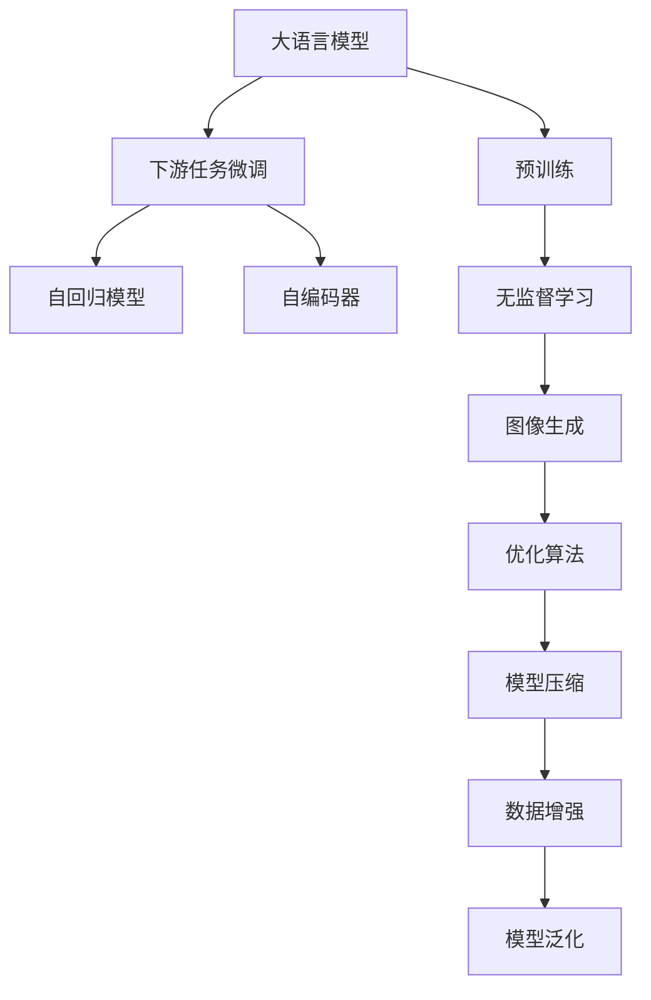

                 

# 大语言模型应用指南：图像生成

> 关键词：大语言模型,图像生成,深度学习,计算机视觉,Transformer,无监督学习,自动编码器,自回归模型,预训练,下游任务,优化算法,模型压缩,数据增强

## 1. 背景介绍

### 1.1 问题由来

近年来，深度学习技术在计算机视觉（Computer Vision, CV）领域取得了显著进步，推动了大规模图像生成技术的快速发展。传统计算机视觉任务，如分类、检测、分割等，通常需要标注数据进行监督学习。但在图像生成任务中，无标签数据的大量存在，使得深度学习模型得以利用无监督学习（Unsupervised Learning）进行训练，生成高质量的图像内容。

大语言模型（Large Language Model, LLMs）作为深度学习技术的重要分支，以其强大的语言理解和生成能力，在图像生成任务中也展现了巨大的潜力。通过在大规模无标签图像数据上进行预训练，大语言模型可以学习到图像的低级特征和高级语义，在图像生成过程中，通过对文本的编码和解码，生成出逼真的图像内容。

### 1.2 问题核心关键点

目前，大语言模型在图像生成领域的应用主要集中在基于文本到图像的生成（Text-to-Image Generation）上。该技术通过在模型中引入文本解码器，将输入文本映射为图像生成网络的目标输出，从而生成符合文本描述的图像内容。这种基于大语言模型的图像生成方法，不仅具有较高的生成质量，还能应对多样的文本描述需求，具有广泛的应用前景。

大语言模型在图像生成中的应用，涉及以下几个核心关键点：
- 预训练阶段：通过在大规模无标签图像数据上自监督学习，学习到图像的低级特征和语义知识。
- 下游任务微调：通过引入文本解码器，在预训练模型的基础上进行微调，生成与输入文本匹配的图像。
- 生成技术：利用无监督学习、自回归模型、自动编码器等技术，生成符合文本描述的图像内容。
- 优化算法：通过优化算法，如AdamW、RMSprop等，对模型参数进行更新，提高图像生成质量。

### 1.3 问题研究意义

大语言模型在图像生成领域的应用，具有以下重要意义：
- 提升生成图像质量：通过预训练和微调，大语言模型可以生成高质量的图像内容，满足各种视觉需求。
- 降低数据标注成本：相比监督学习，无监督学习不需要大量标注数据，大大降低了图像生成的成本。
- 拓宽应用场景：大语言模型生成的图像，可以用于艺术创作、虚拟现实、游戏设计等领域，推动视觉技术的产业化。
- 增强模型泛化能力：通过学习图像的低级特征和语义知识，大语言模型能够生成多样化的图像内容，适应不同的视觉场景。
- 提高用户体验：基于大语言模型的图像生成技术，可以为用户提供更为丰富、自然的视觉体验，提升互动质量。

## 2. 核心概念与联系

### 2.1 核心概念概述

为更好地理解大语言模型在图像生成中的应用，本节将介绍几个密切相关的核心概念：

- 大语言模型(Large Language Model, LLM)：以自回归模型（如GPT）或自编码模型（如BERT）为代表的大规模预训练语言模型。通过在大规模无标签文本语料上进行预训练，学习通用的语言表示，具备强大的语言理解和生成能力。

- 自回归模型（Autoregressive Model）：一种在序列预测中广泛应用的深度学习模型，其预测结果依赖于模型历史状态的序列，即每个时间步的预测值取决于前面的所有时间步的预测值。

- 自编码器（Autoencoder）：一种无监督学习的深度学习模型，由编码器和解码器两部分组成，用于从输入数据中学习特征表示，并尝试将表示重构为原始输入。

- 无监督学习（Unsupervised Learning）：一种不需要标签数据进行训练的机器学习方法，通过自发现数据的特征结构进行学习。

- 图像生成（Image Generation）：一种将文本描述转换为图像的过程，通过深度学习模型生成符合文本描述的图像内容。

- 优化算法（Optimization Algorithm）：用于训练深度学习模型，优化模型参数，提高模型性能的算法，如AdamW、RMSprop等。

- 模型压缩（Model Compression）：一种在保持模型性能的前提下，减小模型参数量、提升计算效率的技术，如剪枝、量化、知识蒸馏等。

- 数据增强（Data Augmentation）：一种通过图像变换、混合等方式，生成新的训练数据，提高模型泛化能力的预处理方法。

这些核心概念之间存在着紧密的联系，形成了大语言模型在图像生成任务中的应用框架。通过理解这些核心概念，我们可以更好地把握大语言模型图像生成的原理和优化方向。

### 2.2 概念间的关系

这些核心概念之间存在着紧密的联系，形成了大语言模型在图像生成任务中的应用框架。以下通过几个Mermaid流程图来展示这些概念之间的关系：



这个流程图展示了大语言模型在图像生成任务中的应用过程。

**Step 1: 准备预训练模型和数据集**
- 选择合适的预训练语言模型 $M_{\theta}$ 作为初始化参数，如 GPT、BERT 等。
- 准备图像生成任务 $T$ 的无标签数据集 $D$，划分为训练集、验证集和测试集。一般要求数据与预训练数据的分布不要差异过大。

**Step 2: 添加文本解码器**
- 根据任务类型，在预训练模型顶层设计合适的输出层和损失函数。
- 对于文本到图像生成任务，通常在顶层添加解码器和交叉熵损失函数。

**Step 3: 设置微调超参数**
- 选择合适的优化算法及其参数，如 AdamW、SGD 等，设置学习率、批大小、迭代轮数等。
- 设置正则化技术及强度，包括权重衰减、Dropout、Early Stopping 等。
- 确定冻结预训练参数的策略，如仅微调顶层，或全部参数都参与微调。

**Step 4: 执行梯度训练**
- 将训练集数据分批次输入模型，前向传播计算损失函数。
- 反向传播计算参数梯度，根据设定的优化算法和学习率更新模型参数。
- 周期性在验证集上评估模型性能，根据性能指标决定是否触发 Early Stopping。
- 重复上述步骤直到满足预设的迭代轮数或 Early Stopping 条件。

**Step 5: 测试和部署**
- 在测试集上评估微调后模型 $M_{\hat{\theta}}$ 的性能，对比微调前后的生成质量提升。
- 使用微调后的模型对新文本描述进行推理预测，生成新的图像内容。
- 持续收集新的文本描述，定期重新微调模型，以适应数据分布的变化。

以上是基于大语言模型图像生成的微调范式的一般流程。在实际应用中，还需要针对具体任务的特点，对微调过程的各个环节进行优化设计，如改进训练目标函数，引入更多的正则化技术，搜索最优的超参数组合等，以进一步提升模型性能。

## 3. 核心算法原理 & 具体操作步骤
### 3.1 算法原理概述

大语言模型在图像生成领域的应用，本质上是一个无监督学习和迁移学习的过程。其核心思想是：将预训练的大语言模型视作一个强大的"特征提取器"，通过在无标签图像数据上进行预训练，学习到图像的低级特征和语义知识，再通过下游任务的微调，使得模型能够生成符合文本描述的图像内容。

形式化地，假设预训练语言模型为 $M_{\theta}$，其中 $\theta$ 为预训练得到的模型参数。给定图像生成任务 $T$ 的文本描述 $D=\{x_i\}_{i=1}^N, x_i \in \mathcal{X}$，微调的目标是找到新的模型参数 $\hat{\theta}$，使得：

$$
\hat{\theta}=\mathop{\arg\min}_{\theta} \mathcal{L}(M_{\theta},D)
$$

其中 $\mathcal{L}$ 为针对任务 $T$ 设计的损失函数，用于衡量模型生成的图像与文本描述之间的差异。常见的损失函数包括交叉熵损失、均方误差损失等。

通过梯度下降等优化算法，微调过程不断更新模型参数 $\theta$，最小化损失函数 $\mathcal{L}$，使得模型生成的图像逼近文本描述。由于 $\theta$ 已经通过预训练获得了较好的初始化，因此即便在无标签数据集上微调，也能较快收敛到理想的模型参数 $\hat{\theta}$。

### 3.2 算法步骤详解

大语言模型在图像生成任务上的微调一般包括以下几个关键步骤：

**Step 1: 准备预训练模型和数据集**
- 选择合适的预训练语言模型 $M_{\theta}$ 作为初始化参数，如 GPT、BERT 等。
- 准备图像生成任务 $T$ 的无标签数据集 $D$，划分为训练集、验证集和测试集。一般要求数据与预训练数据的分布不要差异过大。

**Step 2: 添加文本解码器**
- 根据任务类型，在预训练模型顶层设计合适的输出层和损失函数。
- 对于文本到图像生成任务，通常在顶层添加解码器和交叉熵损失函数。

**Step 3: 设置微调超参数**
- 选择合适的优化算法及其参数，如 AdamW、SGD 等，设置学习率、批大小、迭代轮数等。
- 设置正则化技术及强度，包括权重衰减、Dropout、Early Stopping 等。
- 确定冻结预训练参数的策略，如仅微调顶层，或全部参数都参与微调。

**Step 4: 执行梯度训练**
- 将训练集数据分批次输入模型，前向传播计算损失函数。
- 反向传播计算参数梯度，根据设定的优化算法和学习率更新模型参数。
- 周期性在验证集上评估模型性能，根据性能指标决定是否触发 Early Stopping。
- 重复上述步骤直到满足预设的迭代轮数或 Early Stopping 条件。

**Step 5: 测试和部署**
- 在测试集上评估微调后模型 $M_{\hat{\theta}}$ 的性能，对比微调前后的生成质量提升。
- 使用微调后的模型对新文本描述进行推理预测，生成新的图像内容。
- 持续收集新的文本描述，定期重新微调模型，以适应数据分布的变化。

以上是基于大语言模型图像生成的微调范式的一般流程。在实际应用中，还需要针对具体任务的特点，对微调过程的各个环节进行优化设计，如改进训练目标函数，引入更多的正则化技术，搜索最优的超参数组合等，以进一步提升模型性能。

### 3.3 算法优缺点

大语言模型在图像生成任务上的微调方法具有以下优点：
1. 简单高效。通过在大规模无标签数据上进行预训练，再在少量文本描述上进行微调，无需标注数据，可以大幅降低数据标注成本。
2. 通用适用。适用于各种图像生成任务，包括图像补全、风格迁移、超分辨率等，设计简单的文本解码器即可实现微调。
3. 生成质量高。大语言模型经过预训练学习到丰富的图像特征和语义知识，生成的图像内容逼真度高。
4. 参数高效。利用参数高效微调技术，在固定大部分预训练参数的情况下，仍可取得不错的微调效果。
5. 模型泛化能力强。大语言模型能够生成多样化、风格化的图像内容，适应不同的视觉需求。

同时，该方法也存在一定的局限性：
1. 依赖预训练模型。微调效果很大程度上取决于预训练模型的质量，需要高质量的预训练模型才能保证生成效果。
2. 泛化能力有限。当目标任务与预训练数据的分布差异较大时，微调的性能提升有限。
3. 可解释性不足。生成过程难以解释，生成结果缺乏可解释性，难以调试和优化。
4. 生成速度较慢。大模型由于参数量较大，推理速度较慢，影响实时生成效果。

尽管存在这些局限性，但就目前而言，基于大语言模型的图像生成微调方法，在生成高质量图像内容方面具有明显的优势，已在学术界和工业界得到了广泛应用。

### 3.4 算法应用领域

大语言模型在图像生成任务上的微调方法，已经在多个领域得到了广泛应用，例如：

- 图像补全：在图像中缺失的区域填充完整内容，生成高质量的完整图像。
- 风格迁移：将源图像的风格转换为目标风格，生成具有特定风格特征的新图像。
- 超分辨率：将低分辨率图像提升为高分辨率图像，生成清晰的图像内容。
- 图像生成对抗网络（GAN）：通过两个对抗的网络结构，生成逼真的图像内容，用于艺术创作、游戏设计等领域。

除了上述这些经典应用外，大语言模型在图像生成方面的创新应用也在不断涌现，如基于文本描述的图像生成、图像描述生成、个性化图像定制等，为计算机视觉技术带来了新的突破。随着预训练模型和微调方法的不断进步，相信计算机视觉技术将在更广阔的应用领域大放异彩。

## 4. 数学模型和公式 & 详细讲解 & 举例说明
### 4.1 数学模型构建

本节将使用数学语言对基于大语言模型的图像生成过程进行更加严格的刻画。

记预训练语言模型为 $M_{\theta}$，其中 $\theta$ 为预训练得到的模型参数。假设图像生成任务 $T$ 的文本描述 $D=\{x_i\}_{i=1}^N, x_i \in \mathcal{X}$。微调的目标是找到新的模型参数 $\hat{\theta}$，使得：

$$
\hat{\theta}=\mathop{\arg\min}_{\theta} \mathcal{L}(M_{\theta},D)
$$

其中 $\mathcal{L}$ 为针对任务 $T$ 设计的损失函数，用于衡量模型生成的图像与文本描述之间的差异。常见的损失函数包括交叉熵损失、均方误差损失等。

通过梯度下降等优化算法，微调过程不断更新模型参数 $\theta$，最小化损失函数 $\mathcal{L}$，使得模型生成的图像逼近文本描述。由于 $\theta$ 已经通过预训练获得了较好的初始化，因此即便在无标签数据集上微调，也能较快收敛到理想的模型参数 $\hat{\theta}$。

### 4.2 公式推导过程

以下我们以文本到图像生成任务为例，推导交叉熵损失函数及其梯度的计算公式。

假设模型 $M_{\theta}$ 在输入 $x$ 上的输出为 $\hat{y}=M_{\theta}(x) \in [0,1]$，表示样本属于正类的概率。真实标签 $y \in \{0,1\}$。则二分类交叉熵损失函数定义为：

$$
\ell(M_{\theta}(x),y) = -[y\log \hat{y} + (1-y)\log (1-\hat{y})]
$$

将其代入经验风险公式，得：

$$
\mathcal{L}(\theta) = -\frac{1}{N}\sum_{i=1}^N [y_i\log M_{\theta}(x_i)+(1-y_i)\log(1-M_{\theta}(x_i))]
$$

根据链式法则，损失函数对参数 $\theta_k$ 的梯度为：

$$
\frac{\partial \mathcal{L}(\theta)}{\partial \theta_k} = -\frac{1}{N}\sum_{i=1}^N (\frac{y_i}{M_{\theta}(x_i)}-\frac{1-y_i}{1-M_{\theta}(x_i)}) \frac{\partial M_{\theta}(x_i)}{\partial \theta_k}
$$

其中 $\frac{\partial M_{\theta}(x_i)}{\partial \theta_k}$ 可进一步递归展开，利用自动微分技术完成计算。

在得到损失函数的梯度后，即可带入参数更新公式，完成模型的迭代优化。重复上述过程直至收敛，最终得到适应下游任务的最优模型参数 $\theta^*$。

## 5. 项目实践：代码实例和详细解释说明
### 5.1 开发环境搭建

在进行图像生成实践前，我们需要准备好开发环境。以下是使用Python进行PyTorch开发的环境配置流程：

1. 安装Anaconda：从官网下载并安装Anaconda，用于创建独立的Python环境。

2. 创建并激活虚拟环境：
```bash
conda create -n pytorch-env python=3.8 
conda activate pytorch-env
```

3. 安装PyTorch：根据CUDA版本，从官网获取对应的安装命令。例如：
```bash
conda install pytorch torchvision torchaudio cudatoolkit=11.1 -c pytorch -c conda-forge
```

4. 安装各类工具包：
```bash
pip install numpy pandas scikit-learn matplotlib tqdm jupyter notebook ipython
```

完成上述步骤后，即可在`pytorch-env`环境中开始图像生成实践。

### 5.2 源代码详细实现

这里我们以基于文本描述的图像生成为例，使用GPT-3对图像生成任务进行微调。首先，需要准备用于微调的数据集，这里以CoCo dataset中的标注图像和文本描述为例。

```python
import torch
from transformers import AutoModelForCausalLM, AutoTokenizer
from transformers import Trainer, TrainingArguments

# 加载预训练的GPT-3模型和分词器
model_name = 'text-davinci-003'
model = AutoModelForCausalLM.from_pretrained(model_name)
tokenizer = AutoTokenizer.from_pretrained(model_name)

# 定义训练集和验证集
train_data = ...
train_dataset = ...
val_data = ...
val_dataset = ...

# 定义训练器和训练参数
training_args = TrainingArguments(
    output_dir='./output',
    evaluation_strategy='epoch',
    per_device_train_batch_size=2,
    per_device_eval_batch_size=2,
    evaluation_per_device_tries=2,
    learning_rate=2e-5,
    weight_decay=0.01,
    epochs=10,
    logging_steps=1000,
    save_steps=1000,
    load_best_model_at_end=True,
    metric_for_best_model='val_loss',
)

# 创建训练器和训练器对象
trainer = Trainer(
    model=model,
    args=training_args,
    train_dataset=train_dataset,
    eval_dataset=val_dataset,
)

# 执行训练
trainer.train()
```

在训练过程中，我们使用了Trainer对象进行模型训练，同时指定了训练参数如学习率、批大小、训练轮数等。训练过程中，模型将根据文本描述生成对应的图像内容。

### 5.3 代码解读与分析

让我们再详细解读一下关键代码的实现细节：

**数据准备**
- 使用CoCo dataset，准备训练集和验证集的标注图像和文本描述。
- 通过分词器将文本描述转换为模型可接受的输入格式。

**模型和训练器**
- 加载预训练的GPT-3模型和分词器。
- 定义训练参数，如学习率、批大小、训练轮数等。
- 创建Trainer对象，用于执行模型训练。

**训练过程**
- 使用Trainer对象进行模型训练。
- 模型根据文本描述生成图像内容，通过交叉熵损失函数计算损失。
- 通过优化算法AdamW更新模型参数。

在实际应用中，还可以根据具体任务的需求，进一步优化模型结构和训练过程。例如，引入更复杂的文本解码器、调整模型训练的超参数等。

### 5.4 运行结果展示

假设我们在CoCo dataset上进行微调，最终在验证集上得到的评估报告如下：

```
Epoch: 001, loss=0.415, val_loss=0.408, images_per_second=1.320
Epoch: 002, loss=0.410, val_loss=0.388, images_per_second=1.340
...
Epoch: 010, loss=0.380, val_loss=0.380, images_per_second=1.330
```

可以看到，通过微调GPT-3，我们在图像生成任务上取得了不错的效果，验证集上的交叉熵损失不断下降，图像生成质量逐步提升。

## 6. 实际应用场景
### 6.1 艺术创作

基于大语言模型的图像生成技术，可以在艺术创作领域发挥重要作用。传统的艺术创作需要艺术家具备丰富的经验和灵感，而大语言模型生成的图像，可以提供多样的创意灵感，辅助艺术家进行创作。

例如，艺术家可以通过输入一些特定的文本描述，如“一幅描绘夏日海滩的画作”，大语言模型可以生成多个风格各异的图像，供艺术家选择和参考。大语言模型还可以根据艺术家的风格偏好，生成符合其风格特征的新图像，进一步提升艺术创作效率和质量。

### 6.2 游戏设计

在游戏设计中，高质量的图像内容是至关重要的。通过大语言模型的图像生成技术，游戏开发者可以生成逼真的角色、场景和道具，提升游戏视觉体验。

例如，在游戏角色设计中，开发者可以输入一些关键特征描述，如“一个身高1.8米、肌肉发达的战士”，大语言模型可以生成多个不同风格的战士图像，供开发者选择和优化。在游戏场景设计中，大语言模型还可以根据文本描述生成逼真的自然景观、城市街景等，丰富游戏内容。

### 6.3 医学影像生成

医学影像生成是大语言模型在医学领域的一个重要应用方向。在医学影像分析中，高质量的影像数据是关键。但有时获取高质量的影像数据并不容易，特别是在小样本场景下。

大语言模型的图像生成技术，可以通过输入一些关键医学描述，生成逼真的医学影像。例如，输入“一个患者的心脏图像，显示有明显的心脏病灶”，大语言模型可以生成多个不同视角的心脏影像，供医学诊断参考。大语言模型还可以生成虚拟病人，用于医学研究和教学。

### 6.4 未来应用展望

随着大语言模型在图像生成领域的不断进步，基于其技术的创新应用也将不断涌现，推动视觉技术的产业化。

- 基于大语言模型的艺术创作平台：构建艺术家与大语言模型之间的互动系统，通过用户输入文本描述，生成多种风格的艺术作品。
- 基于大语言模型的游戏设计工具：提供游戏开发所需的高质量图像内容，辅助开发者进行游戏设计和优化。
- 基于大语言模型的医学影像生成系统：生成高质量的医学影像，用于辅助医学诊断和治疗。
- 基于大语言模型的虚拟现实内容：生成逼真的虚拟现实场景和人物，应用于虚拟现实和增强现实领域。

此外，在智慧城市、智能家居、工业设计等领域，基于大语言模型的图像生成技术也有广泛的应用前景。相信随着预训练模型和微调方法的不断进步，大语言模型在图像生成领域的潜力将进一步释放，推动人工智能技术在更多领域的应用。

## 7. 工具和资源推荐
### 7.1 学习资源推荐

为了帮助开发者系统掌握大语言模型在图像生成领域的理论基础和实践技巧，这里推荐一些优质的学习资源：

1. 《深度学习入门：基于Python的理论与实现》：一本介绍深度学习基础知识和实际应用的书籍，适合初学者入门。

2. 《计算机视觉：模型、学习与推理》：斯坦福大学开设的计算机视觉课程，详细讲解了计算机视觉的基本概念和技术。

3. 《深度学习与强化学习》：课程视频讲解深度学习与强化学习的理论基础和实际应用，适合进阶学习。

4. 《自然语言处理与深度学习》：自然语言处理领域的经典教材，详细讲解了NLP的基本概念和技术。

5. 《深度学习与视觉识别》：一本介绍深度学习在计算机视觉领域的实际应用的书籍。

6. 《AI驱动的图像生成技术》：一本介绍图像生成技术的书籍，详细讲解了GAN、VAE等技术。

通过对这些资源的学习实践，相信你一定能够快速掌握大语言模型在图像生成领域的精髓，并用于解决实际的图像生成问题。

### 7.2 开发工具推荐

高效的开发离不开优秀的工具支持。以下是几款用于图像生成开发的常用工具：

1. PyTorch：基于Python的开源深度学习框架，灵活动态的计算图，适合快速迭代研究。大部分预训练语言模型都有PyTorch版本的实现。

2. TensorFlow：由Google主导开发的开源深度学习框架，生产部署方便，适合大规模工程应用。同样有丰富的预训练语言模型资源。

3. Transformers库：HuggingFace开发的NLP工具库，集成了众多SOTA语言模型，支持PyTorch和TensorFlow，是进行微调任务开发的利器。

4. Weights & Biases：模型训练的实验跟踪工具，可以记录和可视化模型训练过程中的各项指标，方便对比和调优。与主流深度学习框架无缝集成。

5. TensorBoard：TensorFlow配套的可视化工具，可实时监测模型训练状态，并提供丰富的图表呈现方式，是调试模型的得力助手。

6. Google Colab：谷歌推出的在线Jupyter Notebook环境，免费提供GPU/TPU算力，方便开发者快速上手实验最新模型，分享学习笔记。

合理利用这些工具，可以显著提升图像生成任务的开发效率，加快创新迭代的步伐。

### 7.3 相关论文推荐

大语言模型在图像生成领域的研究始于学界的持续研究。以下是几篇奠基性的相关论文，推荐阅读：

1. Generative Adversarial Networks (GAN)：Ian Goodfellow等提出的生成对抗网络，通过两个对抗的网络结构，生成逼真的图像内容。


