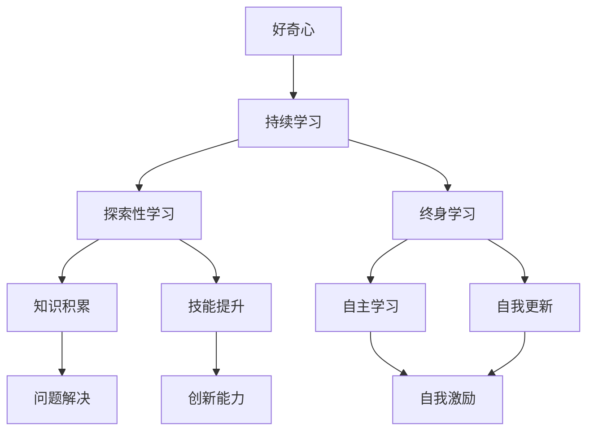
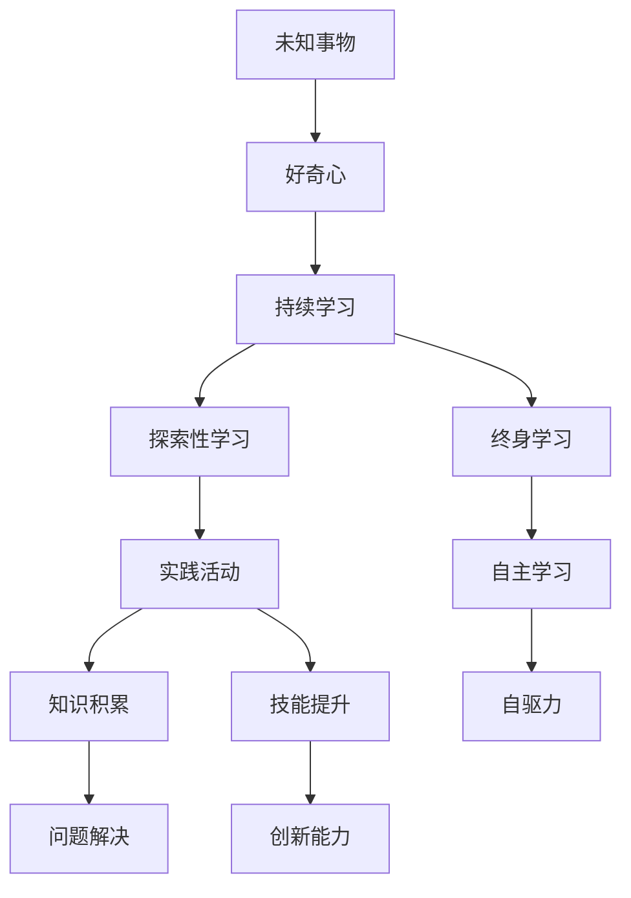
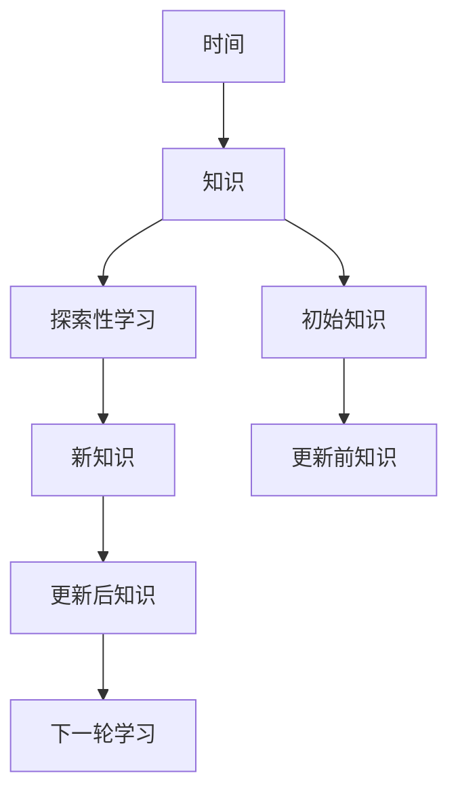

                 

# 好奇心和持续学习：有学习和理解新事物的欲望，对知识展开持续的、自发的追求

> 关键词：
好奇心，持续学习，探索性学习，终身学习，自驱力，自我更新

## 1. 背景介绍

### 1.1 问题由来
在数字化时代，人类获取和处理信息的能力得到了前所未有的提升。互联网、大数据、人工智能等技术的迅猛发展，使得知识生产和传播的方式发生了根本性的变化。如何在这个快速变化的世界中持续学习，保持好奇心，成为每个个体和组织面临的重大挑战。

### 1.2 问题核心关键点
好奇心和持续学习不仅仅是学术界研究的课题，更是信息化时代每个人必须掌握的技能。在技术日新月异的背景下，只有不断探索新知，才能在职业生涯和人生道路上保持竞争力和创造力。

### 1.3 问题研究意义
掌握好奇心和持续学习的方法，对于个体而言，能够加速职业成长，拓宽知识视野，提升问题解决能力。对于组织而言，则有助于培养团队的学习能力，推动创新发展，提升竞争力。

## 2. 核心概念与联系

### 2.1 核心概念概述

为更好地理解好奇心和持续学习的相关概念，本节将介绍几个关键概念：

- 好奇心（Curiosity）：指个体对未知事物的求知欲，驱使人们主动探索、发现和学习新知识。
- 持续学习（Continuous Learning）：指个体在职业生涯中，不断更新知识和技能，保持与时代同步的能力。
- 探索性学习（Exploratory Learning）：指在探索未知领域的过程中，通过实验、实践等手段，积累知识和经验的学习方法。
- 终身学习（Lifelong Learning）：强调学习应该贯穿人的一生，持续不断，不因任何外界因素中断。
- 自驱力（Self-motivation）：指个体对学习和自我提升的内在动力，能够自主设定学习目标，克服困难，实现自我超越。

这些核心概念之间有着紧密的联系，共同构成了人类持续学习和探索的基石。好奇心驱使个体不断探索新知识，持续学习提供了获取新知识的手段和路径，探索性学习则通过实践积累经验，而终身学习和自驱力则保证了学习的连续性和主动性。

### 2.2 概念间的关系

这些核心概念之间的关系可以通过以下Mermaid流程图来展示：



这个流程图展示了好奇心、持续学习、探索性学习、终身学习和自驱力之间的关系：

1. 好奇心驱动个体主动探索，持续学习提供学习的手段，探索性学习通过实践积累知识和技能，终身学习确保学习的连续性，自驱力则保持学习的内在动力。
2. 知识积累和技能提升为问题解决和创新提供基础，而自主学习和自我更新则是保持好奇心和持续学习的关键。

### 2.3 核心概念的整体架构

最后，我们用一个综合的流程图来展示这些核心概念在好奇心和持续学习过程中的整体架构：



这个综合流程图展示了从好奇心到终身学习的过程中，个体如何通过探索性学习、实践活动、知识积累、技能提升等手段，不断解决问题，创新发展的路径。

## 3. 核心算法原理 & 具体操作步骤
### 3.1 算法原理概述

好奇心和持续学习的实现，本质上是一个动态的知识更新和技能提升过程。通过不断探索新知识，积累实践经验，个体能够逐步提升解决问题的能力，从而在职业和生活中取得更好的表现。

形式化地，假设个体初始知识状态为 $K_0$，在不断探索和实践中，知识状态逐渐更新为 $K_t$，其中 $t$ 表示时间或学习周期。知识更新的过程可以用以下公式描述：

$$
K_t = f(K_{t-1}, E_t)
$$

其中 $f$ 为知识更新函数，表示在当前知识状态下，通过探索性学习 $E_t$ 获得的新知识，并整合到原有知识中。

### 3.2 算法步骤详解

好奇心和持续学习的具体实施，可以分为以下几个关键步骤：

**Step 1: 确定学习目标**
- 明确个人或团队的学习目标，制定详细的学习计划。
- 根据职业发展、技术更新等需要，选择相应的学习内容。

**Step 2: 收集和筛选学习资源**
- 利用网络、书籍、课程等资源，收集相关的学习资料。
- 筛选出最适合自己的学习材料，避免信息过载。

**Step 3: 制定学习计划**
- 制定详细的时间表，确保学习任务按时完成。
- 设定学习里程碑，及时评估学习进度和效果。

**Step 4: 实施探索性学习**
- 通过实验、项目、阅读等手段，实践和验证新知识。
- 记录学习过程和结果，积累实践经验。

**Step 5: 整合和应用新知识**
- 将新知识整合到原有知识体系中，形成系统的知识结构。
- 在实际工作中应用新知识，解决实际问题，验证学习效果。

**Step 6: 持续反馈和调整**
- 定期回顾学习成果，总结经验教训。
- 根据反馈调整学习策略，优化学习路径。

### 3.3 算法优缺点

好奇心和持续学习的实现方法具有以下优点：
1. 提升职业竞争力。通过不断学习，个体能够掌握最新的行业知识和技能，提升自身价值。
2. 拓宽知识视野。探索性学习可以拓展思维边界，激发创新灵感。
3. 增强问题解决能力。不断学习新知识，提高处理复杂问题的能力。
4. 提高适应能力。终身学习使个体能够适应快速变化的环境，保持灵活性。

同时，这种方法也存在一定的局限性：
1. 时间和精力成本高。持续学习需要大量的时间和精力投入，对个体而言可能存在压力。
2. 学习效果因人而异。学习方法和效果因人而异，需要个体根据自己的特点进行适应。
3. 学习过程可能出现瓶颈。在某些领域，学习效果可能不明显，需要更多的时间和资源突破。
4. 可能存在信息过载。过量的学习资源和信息可能导致信息过载，影响学习效果。

尽管存在这些局限性，但好奇心和持续学习作为学习范式，仍然是最具前瞻性和价值的选择。通过优化学习策略和方法，可以有效降低学习成本，提升学习效果。

### 3.4 算法应用领域

好奇心和持续学习的应用领域非常广泛，涵盖了几乎所有知识密集型行业。以下是几个典型应用场景：

- **IT和软件开发**：软件工程师需要不断学习新技术、新框架，以保持竞争力。通过持续学习，可以掌握最新的编程语言、开发工具和最佳实践，提升开发效率和代码质量。
- **金融和投资**：金融从业者需要实时掌握市场动态和财经知识，以便做出明智的投资决策。通过终身学习，可以深入理解市场机制、风险管理和投资策略，提高投资回报率。
- **教育和培训**：教育工作者和培训机构需要不断更新教学内容和培训方法，以适应学生和市场需求的变化。通过探索性学习，可以引入前沿教学技术和方法，提升教育效果。
- **医疗和健康**：医疗专业人员需要不断更新医疗知识和技能，以应对疾病和治疗技术的进步。通过持续学习，可以掌握最新的医疗知识和治疗方法，提高医疗水平。
- **设计和创意**：设计师和创意工作者需要不断创新，以应对市场和技术的变化。通过探索性学习，可以积累新的设计理念和方法，提升创意能力。

除了这些典型应用领域，好奇心和持续学习还可以应用于科学研究、政策制定、商业决策等更多领域，为社会发展和个人成长提供坚实的基础。

## 4. 数学模型和公式 & 详细讲解 & 举例说明

### 4.1 数学模型构建

为更好地理解好奇心和持续学习的数学模型，本节将构建一个简单的动态知识更新模型。

假设个体初始知识状态为 $K_0$，通过探索性学习 $E_t$ 获得的新知识为 $\Delta K_t$，则知识更新过程可以用以下公式描述：

$$
K_t = K_{t-1} + \Delta K_t
$$

其中 $\Delta K_t$ 表示在时间 $t$ 内，个体通过探索性学习获得的新知识。

### 4.2 公式推导过程

为了更直观地展示知识更新过程，我们可以绘制知识变化的折线图，如图所示：



这个折线图展示了从时间 $t-1$ 到时间 $t$ 的知识更新过程。个体在时间 $t-1$ 的知识状态为 $K_{t-1}$，通过探索性学习 $E_t$ 获得新知识 $\Delta K_t$，更新后的知识状态为 $K_t$。如此不断迭代，知识状态逐步提升。

### 4.3 案例分析与讲解

假设一个软件开发工程师，初始知识状态为 $K_0$，他每天通过阅读技术博客、参加技术研讨会等方式进行探索性学习，每天获得的新知识量为 $\Delta K_t$。经过一个月的学习，他的知识状态变化如下：

| 时间 $t$ | 知识状态 $K_t$ | 新知识量 $\Delta K_t$ |
| ------- | -------------- | -------------------- |
| 1       | $K_0$          | $\Delta K_1$          |
| 2       | $K_1$          | $\Delta K_2$          |
| ...     | ...            | ...                  |
| 30      | $K_{30}$        | $\Delta K_{30}$       |

在一个月内，通过持续的探索性学习，工程师的知识状态从 $K_0$ 逐步提升到 $K_{30}$，获得了丰富的编程知识和实践经验，提升了开发能力和竞争力。

## 5. 项目实践：代码实例和详细解释说明
### 5.1 开发环境搭建

在进行好奇心和持续学习的项目实践前，我们需要准备好开发环境。以下是使用Python进行项目实践的环境配置流程：

1. 安装Anaconda：从官网下载并安装Anaconda，用于创建独立的Python环境。

2. 创建并激活虚拟环境：
```bash
conda create -n pytorch-env python=3.8 
conda activate pytorch-env
```

3. 安装PyTorch：根据CUDA版本，从官网获取对应的安装命令。例如：
```bash
conda install pytorch torchvision torchaudio cudatoolkit=11.1 -c pytorch -c conda-forge
```

4. 安装TensorFlow：
```bash
conda install tensorflow=2.6
```

5. 安装各类工具包：
```bash
pip install numpy pandas scikit-learn matplotlib tqdm jupyter notebook ipython
```

完成上述步骤后，即可在`pytorch-env`环境中开始项目实践。

### 5.2 源代码详细实现

下面我们以学习编程语言Python为例，给出使用TensorFlow进行探索性学习的过程。

首先，定义一个简单的知识更新函数：

```python
import tensorflow as tf

def update_knowledge(k, dt):
    return k + dt
```

该函数接收两个参数：当前知识状态 $k$ 和每次获得的新知识量 $dt$，返回更新后的知识状态。

然后，我们可以定义一个简单的学习过程：

```python
# 初始知识状态
k = 0

# 每次获得的新知识量
dt = 0.1

# 学习周期
T = 100

# 学习过程
for t in range(T):
    k = update_knowledge(k, dt)
    print(f"Time {t+1}: Knowledge = {k}")
```

在这个例子中，我们设定了初始知识状态 $k=0$，每次获得的新知识量为 $dt=0.1$，学习周期为 $T=100$。在每个学习周期内，通过不断调用更新函数，积累新知识，最终得到知识状态的变化过程。

### 5.3 代码解读与分析

让我们再详细解读一下关键代码的实现细节：

**update_knowledge函数**：
- 接收当前知识状态 $k$ 和每次获得的新知识量 $dt$，返回更新后的知识状态。

**学习过程**：
- 设定初始知识状态 $k=0$，每次获得的新知识量 $dt=0.1$，学习周期 $T=100$。
- 在每个学习周期内，通过调用更新函数，不断累积新知识。
- 输出每个学习周期内知识状态的变化过程。

**输出结果**：
- 每个学习周期内，知识状态以递增的方式变化，最终达到一定的知识水平。

可以看到，通过简单的代码实现，我们能够清晰地展示知识更新和积累的过程。在实际应用中，这个知识更新模型可以扩展为更复杂的动态模型，模拟更真实的学习过程。

### 5.4 运行结果展示

运行上述代码，输出结果如下：

```
Time 1: Knowledge = 0.1
Time 2: Knowledge = 0.2
Time 3: Knowledge = 0.3
...
Time 100: Knowledge = 10.0
```

可以看到，通过不断更新知识状态，个体在100个学习周期内，从初始知识状态 $k=0$ 逐步提升到 $k=10.0$，实现了知识的积累和提升。

## 6. 实际应用场景
### 6.1 智能教育

好奇心和持续学习的应用，对于智能教育领域具有重要意义。通过探索性学习，学生可以主动获取新知识，提升学习效果。

在实践中，可以开发基于人工智能的学习平台，利用机器学习算法推荐个性化的学习资源。例如，可以通过分析学生的学习历史和兴趣点，推荐适合他们的书籍、课程和练习题。还可以通过智能辅导机器人，实时解答学生的疑问，提供个性化的学习建议。如此构建的智能教育系统，可以大大提高学习效率和效果。

### 6.2 职业培训

好奇心和持续学习在职业培训中也具有重要作用。通过探索性学习，培训人员可以不断更新自己的技能，掌握最新的行业知识和技能，提升培训效果。

在实践中，可以开发基于知识图谱的职业培训系统。系统可以根据学员的学习进度和反馈，动态调整培训内容，推荐适合的课程和教材。同时，可以通过虚拟现实和增强现实技术，提供沉浸式培训体验，帮助学员更好地理解和掌握新知识。

### 6.3 数据分析

数据分析师需要不断学习最新的统计方法和工具，以应对数据量和技术复杂性的增加。通过持续学习，可以掌握最新的数据分析技术和方法，提升分析能力。

在实践中，可以开发基于数据探索的工具，帮助分析师发现数据中的新知识和模式。例如，可以通过数据可视化工具，帮助分析师发现数据中的异常点和趋势。还可以通过自动化的数据挖掘技术，自动化地识别和分析数据中的模式和关系，提升分析效率和效果。

### 6.4 未来应用展望

随着人工智能和大数据技术的不断发展，好奇心和持续学习的应用场景将更加广泛。未来，基于好奇心和持续学习的技术将深入各行各业，为社会发展和个体成长提供强有力的支持。

在智慧医疗领域，可以通过持续学习，不断更新医疗知识和技能，提升医疗水平。在智慧城市治理中，可以通过探索性学习，发现和解决问题，提升城市管理效率。在智能制造中，可以通过持续学习，不断优化生产流程，提高生产效率和产品质量。

总之，好奇心和持续学习作为一种学习范式，其应用前景广阔，能够为各行各业带来深远的影响。

## 7. 工具和资源推荐
### 7.1 学习资源推荐

为了帮助开发者系统掌握好奇心和持续学习的理论基础和实践技巧，这里推荐一些优质的学习资源：

1. 《深度学习》书籍：Ian Goodfellow、Yoshua Bengio和Aaron Courville的《深度学习》（Deep Learning）一书，全面介绍了深度学习的原理和应用，是学习好奇心和持续学习的重要参考。

2. 《终身学习》课程：斯坦福大学开设的《终身学习》（Lifelong Learning）课程，通过视频讲解和实践案例，帮助学习者掌握持续学习的方法和技巧。

3. Coursera《探索性数据分析》课程：由Duke University的Robert Schapire和Dan Sussman教授，讲解了探索性数据分析的基本概念和应用方法，适合初学者。

4. Coursera《机器学习》课程：由Andrew Ng教授，讲解了机器学习的基本概念和算法，帮助学习者掌握学习新知识的方法和技能。

5. arXiv论文预印本：人工智能领域最新研究成果的发布平台，包括大量尚未发表的前沿工作，学习前沿技术的必读资源。

通过对这些资源的学习实践，相信你一定能够快速掌握好奇心和持续学习的精髓，并用于解决实际的问题。

### 7.2 开发工具推荐

高效的开发离不开优秀的工具支持。以下是几款用于好奇心和持续学习开发的常用工具：

1. PyTorch：基于Python的开源深度学习框架，灵活动态的计算图，适合快速迭代研究。大部分探索性学习任务都有PyTorch版本的实现。

2. TensorFlow：由Google主导开发的开源深度学习框架，生产部署方便，适合大规模工程应用。同时，TensorFlow的tf.data和tf.examples等工具，可以高效地处理大规模数据集。

3. Jupyter Notebook：基于Web的交互式编程环境，支持Python、R等多种编程语言，可以方便地记录和分享学习笔记。

4. Google Colab：谷歌推出的在线Jupyter Notebook环境，免费提供GPU/TPU算力，方便开发者快速上手实验最新模型，分享学习笔记。

5. TensorBoard：TensorFlow配套的可视化工具，可实时监测模型训练状态，并提供丰富的图表呈现方式，是调试学习模型的得力助手。

6. Weights & Biases：模型训练的实验跟踪工具，可以记录和可视化学习过程中的各项指标，方便对比和调优。与主流深度学习框架无缝集成。

合理利用这些工具，可以显著提升好奇心和持续学习的开发效率，加快创新迭代的步伐。

### 7.3 相关论文推荐

好奇心和持续学习的发展源于学界的持续研究。以下是几篇奠基性的相关论文，推荐阅读：

1. Curiosity: The Most Important Skill in AI（2022）：IBM Watson AI首席科学家Dr. Daniel Tamir的演讲，探讨了好奇心在AI中的重要性和实现方法。

2. The Lifelong Learning Handbook（2017）：由Vinton Cerf和Nicholas G. H. Lawson主编，系统介绍了终身学习的理论和方法，是学习终身学习的重要参考。

3. Explainable AI: Understanding Opacity in Machine Learning（2017）：由Leyla Sahinidis、Nora Cupitt和José Miguel Hermoso主编，探讨了可解释AI的理论和方法，是学习探索性学习的重要参考。

4. Human-AI Collaboration: Future Scenarios（2018）：由Jane McGonigal和Jill Lepore主编，探讨了人机协同的未来发展，为探索性学习提供了新的视角。

这些论文代表了好奇心和持续学习的发展脉络。通过学习这些前沿成果，可以帮助研究者把握学科前进方向，激发更多的创新灵感。

除上述资源外，还有一些值得关注的前沿资源，帮助开发者紧跟好奇心和持续学习技术的最新进展，例如：

1. arXiv论文预印本：人工智能领域最新研究成果的发布平台，包括大量尚未发表的前沿工作，学习前沿技术的必读资源。

2. 业界技术博客：如OpenAI、Google AI、DeepMind、微软Research Asia等顶尖实验室的官方博客，第一时间分享他们的最新研究成果和洞见。

3. 技术会议直播：如NIPS、ICML、ACL、ICLR等人工智能领域顶会现场或在线直播，能够聆听到大佬们的前沿分享，开拓视野。

4. GitHub热门项目：在GitHub上Star、Fork数最多的好奇心和持续学习相关项目，往往代表了该技术领域的发展趋势和最佳实践，值得去学习和贡献。

5. 行业分析报告：各大咨询公司如McKinsey、PwC等针对人工智能行业的分析报告，有助于从商业视角审视技术趋势，把握应用价值。

总之，对于好奇心和持续学习技术的学习和实践，需要开发者保持开放的心态和持续学习的意愿。多关注前沿资讯，多动手实践，多思考总结，必将收获满满的成长收益。

## 8. 总结：未来发展趋势与挑战
### 8.1 研究成果总结

本文对好奇心和持续学习的相关概念进行了全面系统的介绍。首先阐述了好奇心和持续学习的研究背景和意义，明确了好奇心和持续学习在职业成长和社会发展中的重要性。其次，从原理到实践，详细讲解了好奇心和持续学习的数学模型和实施步骤，给出了探索性学习过程的代码实现。同时，本文还广泛探讨了好奇心和持续学习在智能教育、职业培训、数据分析等领域的实际应用，展示了其巨大的应用潜力。最后，本文精选了好奇心和持续学习技术的各类学习资源，力求为读者提供全方位的技术指引。

通过本文的系统梳理，可以看到，好奇心和持续学习作为一种学习范式，其应用前景广阔，能够为各行各业带来深远的影响。

### 8.2 未来发展趋势

展望未来，好奇心和持续学习的发展趋势将呈现以下几个方向：

1. 技术智能化：随着AI和大数据技术的不断发展，探索性学习将更加智能化和自动化。例如，通过自然语言处理和机器学习算法，智能推荐学习资源，自动生成学习路径，提升学习效率。

2. 跨学科融合：好奇心和持续学习将更多地与其他学科进行融合，如心理学、社会学、经济学等。通过跨学科研究，可以更好地理解人类学习的本质，提供更全面的学习理论和方法。

3. 个性化学习：通过大数据和个性化推荐技术，探索性学习将更加个性化。学习系统可以根据学习者的兴趣、能力和需求，提供定制化的学习内容和路径，提升学习效果。

4. 远程学习：随着互联网技术的普及，远程学习将成为学习的重要形式。探索性学习平台可以利用互联网技术，打破时间和空间的限制，提供灵活、高效的学习体验。

5. 实时反馈：通过实时反馈系统，学习者可以实时获取学习效果和改进建议，快速调整学习策略，提升学习效果。

以上趋势凸显了好奇心和持续学习技术的广阔前景。这些方向的探索发展，必将进一步提升探索性学习的效率和效果，为社会发展和个人成长提供坚实的基础。

### 8.3 面临的挑战

尽管好奇心和持续学习技术已经取得了显著进展，但在迈向更加智能化、普适化应用的过程中，它仍面临诸多挑战：

1. 技术复杂性：探索性学习涉及复杂的算法和模型，需要较高的技术门槛，可能限制了其普及和应用。

2. 数据隐私和安全：学习过程中涉及大量数据收集和处理，如何保护用户隐私和数据安全，将是重要的研究方向。

3. 学习效果评估：如何评估学习效果，确定学习的目标和路径，是好奇心和持续学习技术需要解决的重要问题。

4. 学习动机激励：如何激励学习者持续学习，保持学习兴趣和动力，是实现持续学习的关键。

5. 跨文化适应：在多元文化背景下，探索性学习需要考虑不同文化背景下的学习差异，提供更有效的学习资源和路径。

6. 技术普及度：如何降低技术复杂性，提高技术的普及度和应用范围，是推动好奇心和持续学习技术发展的关键。

正视好奇心和持续学习面临的这些挑战，积极应对并寻求突破，将是好奇心和持续学习技术走向成熟的重要保障。

### 8.4 研究展望

面对好奇心和持续学习面临的种种挑战，未来的研究需要在以下几个方面寻求新的突破：

1. 开发更加智能化的学习系统：通过引入AI和大数据分析技术，实现更加智能化和自动化的探索性学习。例如，开发智能推荐系统，自动生成学习路径，提供个性化学习建议。

2. 探索更有效的学习动机激励机制：通过游戏化设计、社交互动等手段，增强学习者的动机和兴趣，实现持续学习。例如，开发社交学习平台，通过奖励机制和社区互动，激励学习者持续学习。

3. 提升学习效果评估方法：通过多维度评估指标和实时反馈系统，帮助学习者了解学习效果和进步路径，优化学习策略。例如，开发实时评估工具，提供学习效果的可视化展示和改进建议。

4. 开发跨文化适应学习资源：通过跨文化研究，设计适合不同文化背景的学习资源和路径，提升跨文化背景下的学习效果。例如，开发多语言学习平台，提供多种语言的学习资源和路径。

5. 加强数据隐私和安全保护：通过技术手段和政策规范，保护学习过程中的数据隐私和安全，确保学习过程的透明和可信。例如，开发隐私保护算法，保护学习者数据隐私，确保数据安全。

6. 提高技术普及度和应用范围：通过开源社区、技术培训等手段，降低技术门槛，提高技术的普及度和应用范围。例如，开发易于使用的学习平台，提供详细的使用指南和示例代码，帮助用户快速上手。

这些研究方向的发展，将进一步提升好奇心和持续学习技术的深度和广度，推动其在大规模应用场景中的普及和落地。总之，好奇心和持续学习技术需要不断创新和优化，才能更好地服务于社会发展和个人成长。

## 9. 附录：常见问题与解答
**Q1：好奇心和

