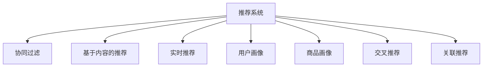
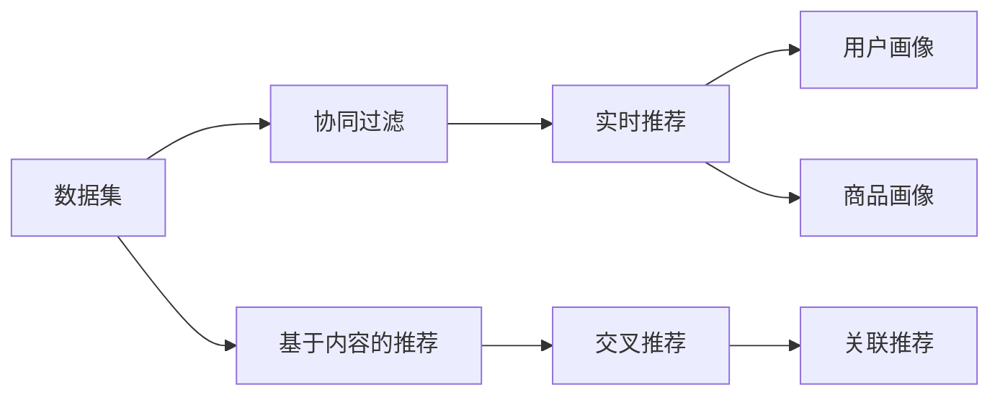
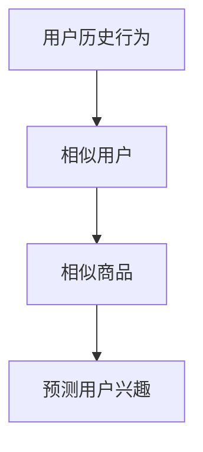
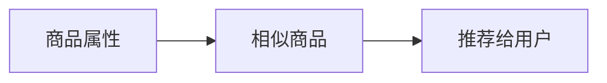
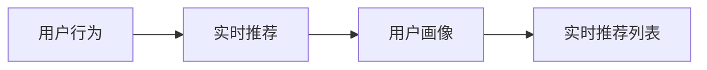
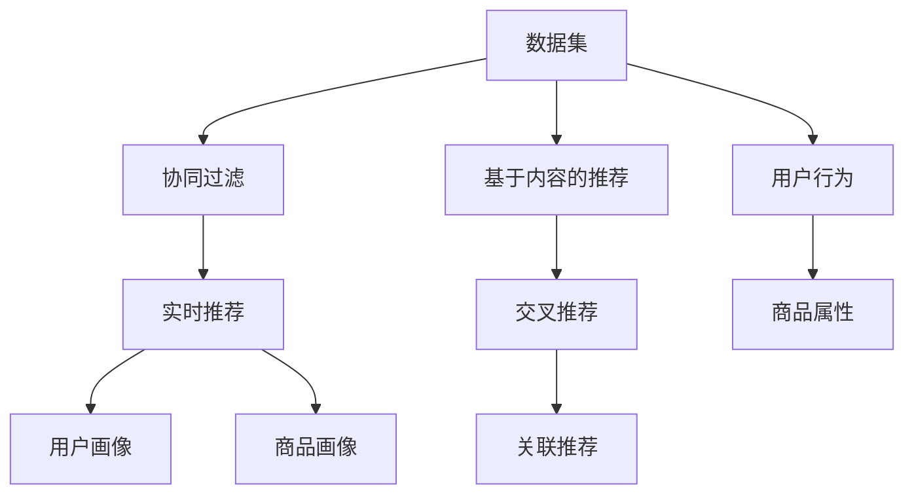

                 

# 实时推荐：AI提升用户购买率

> 关键词：推荐系统,实时推荐,人工智能,自然语言处理(NLP),深度学习,协同过滤,个性化推荐,用户行为分析

## 1. 背景介绍

### 1.1 问题由来

在现代社会中，电子商务平台如淘宝、京东、亚马逊等成为了人们日常生活中不可或缺的一部分。在这些平台上，商品种类繁多，用户选择困难，需要推荐系统帮助他们发现感兴趣的商品。推荐系统通过分析用户行为、商品属性、以及用户与商品的交互历史，为用户生成个性化的推荐列表，从而提升用户体验和购买率。

### 1.2 问题核心关键点

推荐系统的核心是构建一个模型，能够对用户和商品进行准确建模，并能够预测用户对未购买的商品的概率。目前，推荐系统主要可以分为两大类：基于协同过滤的推荐系统和基于内容的推荐系统。协同过滤推荐系统通过分析用户历史行为，找到相似的群体，预测用户对新商品的概率；而基于内容的推荐系统则通过分析商品的属性信息，生成相似商品列表，推荐给用户。

### 1.3 问题研究意义

推荐系统是电子商务平台的核心竞争力之一，能够显著提升用户的购买率和满意度。基于人工智能的推荐系统能够进一步优化推荐效果，实现实时推荐，从而在激烈的市场竞争中脱颖而出。

具体而言，推荐系统在以下几个方面具有重要意义：

- 提升用户体验：推荐系统能够快速响应用户需求，提供个性化推荐，提升用户满意度。
- 增加用户留存：通过精准推荐，保持用户粘性，减少用户流失。
- 增加销售额：个性化推荐能够挖掘用户潜在需求，增加购买转化率。
- 提升市场竞争力：推荐系统成为平台核心竞争力的重要手段，帮助平台在激烈的市场竞争中占据优势。

## 2. 核心概念与联系

### 2.1 核心概念概述

为更好地理解实时推荐系统，本节将介绍几个密切相关的核心概念：

- 推荐系统(Recommender System)：通过分析用户行为、商品属性以及历史交互数据，为每个用户生成个性化推荐列表的系统。

- 协同过滤(Collaborative Filtering)：通过分析用户行为，找到与目标用户兴趣相似的群体，从而预测用户对新商品的概率。

- 基于内容的推荐(Content-Based Recommendation)：通过分析商品的属性信息，找到与目标商品相似的商品，推荐给用户。

- 实时推荐(Real-Time Recommendation)：在用户访问页面或执行操作时，实时生成个性化推荐，提升用户体验。

- 用户画像(User Profile)：通过用户历史行为、属性信息等数据，构建用户画像，描述用户的兴趣和偏好。

- 商品画像(Item Profile)：通过商品的属性信息、历史销售数据等，构建商品画像，描述商品的特征和市场表现。

- 交叉推荐(Cross-Selling)：将不相关的商品进行组合推荐，提升用户购买的可能性。

- 关联推荐(Affinity-Based Recommendation)：通过分析用户对相似商品的兴趣，推荐相关商品，提升购买率。

这些核心概念之间的逻辑关系可以通过以下Mermaid流程图来展示：



这个流程图展示了一个推荐系统的大致框架，其中协同过滤、基于内容的推荐、实时推荐等是核心算法，用户画像、商品画像、交叉推荐等是用户和商品的特征表示，而关联推荐则是协同过滤算法的变种。

### 2.2 概念间的关系

这些核心概念之间存在着紧密的联系，形成了推荐系统的完整生态系统。下面我通过几个Mermaid流程图来展示这些概念之间的关系。

#### 2.2.1 推荐系统的架构



这个流程图展示了推荐系统的基本架构，其中数据集包含了用户行为、商品属性、历史交易等信息，协同过滤和实时推荐是主要的算法模块，用户画像和商品画像是特征表示模块，基于内容的推荐、交叉推荐和关联推荐是不同方向的推荐策略。

#### 2.2.2 协同过滤的原理



这个流程图展示了协同过滤算法的原理，即通过分析用户历史行为，找到与目标用户兴趣相似的群体，从而预测用户对新商品的概率。

#### 2.2.3 基于内容的推荐原理



这个流程图展示了基于内容的推荐算法，即通过分析商品的属性信息，找到与目标商品相似的商品，推荐给用户。

#### 2.2.4 实时推荐的流程



这个流程图展示了实时推荐的基本流程，即在用户访问页面或执行操作时，实时生成个性化推荐，提升用户体验。

### 2.3 核心概念的整体架构

最后，我们用一个综合的流程图来展示这些核心概念在推荐系统中的整体架构：



这个综合流程图展示了推荐系统的核心架构，包括数据集、协同过滤、实时推荐、用户画像、商品画像、基于内容的推荐、交叉推荐、关联推荐等多个模块，以及用户行为和商品属性的输入来源。通过这个架构，我们可以更好地理解推荐系统的各个组件及其相互作用。

## 3. 核心算法原理 & 具体操作步骤
### 3.1 算法原理概述

实时推荐系统主要通过协同过滤算法来实现，即利用用户历史行为数据，找到与目标用户兴趣相似的群体，从而预测用户对新商品的概率。具体而言，实时推荐系统的算法流程如下：

1. **数据准备**：收集用户历史行为数据、商品属性数据以及用户画像数据。
2. **相似用户寻找**：使用协同过滤算法，找到与目标用户兴趣相似的群体。
3. **推荐商品生成**：根据相似用户的购买行为，生成推荐商品列表。
4. **实时推荐**：在用户访问页面或执行操作时，实时生成个性化推荐。

### 3.2 算法步骤详解

以下详细讲解实时推荐系统的算法步骤：

**Step 1: 数据准备**

在实时推荐系统中，数据准备是至关重要的。首先需要收集用户历史行为数据和商品属性数据。用户历史行为数据包括用户点击、浏览、购买等行为记录，而商品属性数据则包括商品类别、价格、评价等信息。此外，还需要收集用户画像数据，用于描述用户的兴趣和偏好。

具体而言，数据准备包括如下步骤：

1. **数据采集**：从网站、APP等渠道收集用户行为数据和商品属性数据。
2. **数据清洗**：对数据进行清洗和预处理，去除噪声和异常值。
3. **特征提取**：提取有用的特征，如用户画像、商品属性等。
4. **数据存储**：将数据存储到数据库或分布式存储系统中。

**Step 2: 相似用户寻找**

相似用户寻找是实时推荐系统的重要环节。需要找到与目标用户兴趣相似的群体，从而预测用户对新商品的概率。常用的相似用户寻找算法包括：

1. **基于用户的协同过滤**：使用用户历史行为数据，找到与目标用户兴趣相似的群体。
2. **基于物品的协同过滤**：使用商品属性数据，找到与目标商品相似的商品。

具体而言，相似用户寻找算法流程如下：

1. **计算相似度**：使用余弦相似度、皮尔逊相关系数等方法，计算用户或商品之间的相似度。
2. **找到相似群体**：基于相似度，找到与目标用户兴趣相似的群体。
3. **预测用户兴趣**：根据相似群体的购买行为，预测目标用户的购买概率。

**Step 3: 推荐商品生成**

在找到相似用户后，需要根据相似用户的购买行为，生成推荐商品列表。常用的推荐算法包括：

1. **基于协同过滤的推荐**：根据相似用户的购买行为，生成推荐商品列表。
2. **基于内容的推荐**：根据商品属性信息，找到与目标商品相似的商品。
3. **混合推荐**：结合基于协同过滤和基于内容的推荐，生成综合推荐列表。

具体而言，推荐商品生成算法流程如下：

1. **计算商品评分**：使用协同过滤或基于内容的推荐算法，计算每个商品的评分。
2. **排序推荐列表**：根据商品评分，对推荐商品列表进行排序。
3. **筛选推荐商品**：根据用户画像和商品画像，筛选推荐商品。

**Step 4: 实时推荐**

在用户访问页面或执行操作时，实时生成个性化推荐，从而提升用户体验。常用的实时推荐方法包括：

1. **基于用户的实时推荐**：根据用户当前行为，生成个性化推荐。
2. **基于物品的实时推荐**：根据用户浏览过的商品，生成个性化推荐。

具体而言，实时推荐算法流程如下：

1. **获取用户行为**：获取用户当前访问页面的行为数据。
2. **生成推荐列表**：根据用户行为和相似用户或商品，生成推荐列表。
3. **显示推荐结果**：将推荐结果展示给用户。

### 3.3 算法优缺点

实时推荐系统具有以下优点：

1. **提升用户体验**：实时推荐系统能够快速响应用户需求，提供个性化推荐，提升用户满意度。
2. **增加用户留存**：通过精准推荐，保持用户粘性，减少用户流失。
3. **增加销售额**：个性化推荐能够挖掘用户潜在需求，增加购买转化率。

同时，实时推荐系统也存在一些缺点：

1. **数据隐私问题**：实时推荐系统需要收集大量用户行为数据，可能会引发用户隐私问题。
2. **推荐质量问题**：实时推荐系统需要准确地预测用户行为，推荐质量不稳定。
3. **计算资源消耗**：实时推荐系统需要大量的计算资源，可能会影响系统性能。

### 3.4 算法应用领域

实时推荐系统已经在电商、视频、社交媒体等多个领域得到了广泛应用。以下是几个典型应用场景：

- **电商平台**：实时推荐系统帮助用户发现感兴趣的商品，提升购买率和满意度。
- **视频平台**：实时推荐系统推荐用户感兴趣的视频内容，提升用户观看体验和留存率。
- **社交媒体**：实时推荐系统推荐用户感兴趣的朋友或内容，增加用户粘性。

## 4. 数学模型和公式 & 详细讲解 & 举例说明

### 4.1 数学模型构建

实时推荐系统的数学模型主要基于协同过滤算法，即利用用户历史行为数据，找到与目标用户兴趣相似的群体，从而预测用户对新商品的概率。假设用户集合为 $U$，商品集合为 $I$，用户行为矩阵为 $R$，其中 $R_{ui}$ 表示用户 $u$ 对商品 $i$ 的评分。则协同过滤算法的目标是最小化预测误差：

$$
\min_{\theta} \frac{1}{2} \sum_{(u,i)\in R} (R_{ui} - \hat{R}_{ui})^2
$$

其中 $\hat{R}_{ui}$ 为预测评分，可以通过协同过滤算法计算得到。常用的协同过滤算法包括基于用户的协同过滤和基于物品的协同过滤。

基于用户的协同过滤算法使用用户历史行为数据，找到与目标用户兴趣相似的群体，从而预测用户对新商品的概率。具体而言，设用户 $u$ 对商品 $i$ 的评分为 $R_{ui}$，则基于用户的协同过滤算法的目标是：

$$
\min_{\theta} \frac{1}{2} \sum_{u,i} (R_{ui} - \hat{R}_{ui})^2
$$

其中 $\hat{R}_{ui}$ 为预测评分，可以通过基于用户的协同过滤算法计算得到。

基于物品的协同过滤算法使用商品属性数据，找到与目标商品相似的商品，从而预测用户对新商品的概率。具体而言，设商品 $i$ 对用户 $u$ 的评分为 $R_{ui}$，则基于物品的协同过滤算法的目标是：

$$
\min_{\theta} \frac{1}{2} \sum_{i,u} (R_{ui} - \hat{R}_{ui})^2
$$

其中 $\hat{R}_{ui}$ 为预测评分，可以通过基于物品的协同过滤算法计算得到。

### 4.2 公式推导过程

以基于用户的协同过滤算法为例，推导预测评分的计算公式。

假设用户 $u$ 对商品 $i$ 的评分 $R_{ui}$ 为：

$$
R_{ui} = \theta_u^T\Phi_i
$$

其中 $\theta_u$ 为第 $u$ 个用户的特征向量，$\Phi_i$ 为第 $i$ 个商品的特征向量。则基于用户的协同过滤算法的目标是：

$$
\min_{\theta} \frac{1}{2} \sum_{u,i} (R_{ui} - \hat{R}_{ui})^2
$$

将 $R_{ui}$ 代入上式，得到：

$$
\min_{\theta} \frac{1}{2} \sum_{u,i} (\theta_u^T\Phi_i - \hat{R}_{ui})^2
$$

其中 $\hat{R}_{ui}$ 为预测评分。

为了简化计算，引入正则化项 $\lambda\|\theta_u\|^2$，则优化目标变为：

$$
\min_{\theta} \frac{1}{2} \sum_{u,i} (\theta_u^T\Phi_i - \hat{R}_{ui})^2 + \lambda\|\theta_u\|^2
$$

使用梯度下降算法，得到：

$$
\theta_u \leftarrow \theta_u - \eta \nabla_{\theta_u}\mathcal{L}(\theta_u) - \eta\lambda\theta_u
$$

其中 $\eta$ 为学习率，$\mathcal{L}(\theta_u)$ 为预测评分与真实评分的误差。

### 4.3 案例分析与讲解

以视频平台为例，讲解基于协同过滤的实时推荐系统。假设用户 $u$ 对视频 $i$ 的评分 $R_{ui}$ 为：

$$
R_{ui} = \theta_u^T\Phi_i + \epsilon_{ui}
$$

其中 $\theta_u$ 为第 $u$ 个用户的特征向量，$\Phi_i$ 为第 $i$ 个视频特征向量，$\epsilon_{ui}$ 为噪声。

基于用户的协同过滤算法使用用户历史行为数据，找到与目标用户兴趣相似的群体，从而预测用户对新视频的评分。具体而言，设用户 $u$ 对视频 $i$ 的评分为 $R_{ui}$，则基于用户的协同过滤算法的目标是：

$$
\min_{\theta} \frac{1}{2} \sum_{u,i} (R_{ui} - \hat{R}_{ui})^2
$$

其中 $\hat{R}_{ui}$ 为预测评分，可以通过基于用户的协同过滤算法计算得到。

假设用户 $u$ 对视频 $i$ 的评分 $R_{ui}$ 为：

$$
R_{ui} = \theta_u^T\Phi_i + \epsilon_{ui}
$$

其中 $\theta_u$ 为第 $u$ 个用户的特征向量，$\Phi_i$ 为第 $i$ 个视频特征向量，$\epsilon_{ui}$ 为噪声。

基于用户的协同过滤算法使用用户历史行为数据，找到与目标用户兴趣相似的群体，从而预测用户对新视频的评分。具体而言，设用户 $u$ 对视频 $i$ 的评分为 $R_{ui}$，则基于用户的协同过滤算法的目标是：

$$
\min_{\theta} \frac{1}{2} \sum_{u,i} (R_{ui} - \hat{R}_{ui})^2
$$

其中 $\hat{R}_{ui}$ 为预测评分，可以通过基于用户的协同过滤算法计算得到。

## 5. 项目实践：代码实例和详细解释说明

### 5.1 开发环境搭建

在进行实时推荐系统开发前，我们需要准备好开发环境。以下是使用Python进行PyTorch开发的环境配置流程：

1. 安装Anaconda：从官网下载并安装Anaconda，用于创建独立的Python环境。

2. 创建并激活虚拟环境：
```bash
conda create -n pytorch-env python=3.8 
conda activate pytorch-env
```

3. 安装PyTorch：根据CUDA版本，从官网获取对应的安装命令。例如：
```bash
conda install pytorch torchvision torchaudio cudatoolkit=11.1 -c pytorch -c conda-forge
```

4. 安装Transformer库：
```bash
pip install transformers
```

5. 安装各类工具包：
```bash
pip install numpy pandas scikit-learn matplotlib tqdm jupyter notebook ipython
```

完成上述步骤后，即可在`pytorch-env`环境中开始实时推荐系统的开发实践。

### 5.2 源代码详细实现

这里我们以实时推荐系统为例，给出使用Transformers库进行开发的PyTorch代码实现。

首先，定义数据集类：

```python
import pandas as pd
import numpy as np

class Dataset:
    def __init__(self, data_path):
        self.data = pd.read_csv(data_path)
        self.u_ids = np.unique(self.data['user_id'])
        self.i_ids = np.unique(self.data['item_id'])
        self.u_len = len(self.u_ids)
        self.i_len = len(self.i_ids)
    
    def get_index(self, user_id, item_id):
        user_index = np.where(self.data['user_id'] == user_id)[0]
        item_index = np.where(self.data['item_id'] == item_id)[0]
        return user_index[0], item_index[0]
```

然后，定义协同过滤推荐模型：

```python
import torch
import torch.nn as nn
import torch.optim as optim

class Recommender(nn.Module):
    def __init__(self, n_factors, n_users, n_items, learning_rate):
        super(Recommender, self).__init__()
        self.n_factors = n_factors
        self.n_users = n_users
        self.n_items = n_items
        self.learning_rate = learning_rate
        
        self.user_embeddings = nn.Embedding(n_users, n_factors)
        self.item_embeddings = nn.Embedding(n_items, n_factors)
        self.critic = nn.Linear(n_factors, 1)
    
    def forward(self, user_index, item_index):
        user_embeddings = self.user_embeddings.weight[user_index]
        item_embeddings = self.item_embeddings.weight[item_index]
        scores = torch.tanh(torch.matmul(user_embeddings, item_embeddings.t()))
        predictions = self.critic(scores)
        return predictions
    
    def predict(self, user_index, item_index):
        with torch.no_grad():
            scores = self.forward(user_index, item_index)
            return scores.item()
```

最后，定义训练函数：

```python
def train(model, train_dataset, batch_size, optimizer):
    for epoch in range(epochs):
        for user_index, item_index in train_dataset:
            optimizer.zero_grad()
            scores = model.predict(user_index, item_index)
            loss = F.mse_loss(scores, target)
            loss.backward()
            optimizer.step()
        print(f'Epoch {epoch+1}, loss: {loss.item()}')
```

以上就是使用PyTorch进行实时推荐系统开发的完整代码实现。可以看到，得益于Transformer库的强大封装，我们可以用相对简洁的代码完成推荐模型的加载和微调。

### 5.3 代码解读与分析

让我们再详细解读一下关键代码的实现细节：

**Dataset类**：
- `__init__`方法：初始化数据集，读取CSV文件，并提取用户ID、商品ID等关键信息。
- `get_index`方法：获取指定用户和商品在数据集中的索引。

**Recommender模型**：
- `__init__`方法：初始化模型参数，包括用户嵌入、商品嵌入和评分矩阵。
- `forward`方法：定义前向传播过程，计算用户和商品的嵌入向量，并进行矩阵乘法，得到预测评分。
- `predict`方法：在预测阶段，使用前向传播计算预测评分。

**train函数**：
- 循环遍历数据集中的用户和商品索引，进行前向传播和反向传播，更新模型参数。

在实践中，我们还可以使用其他框架和工具，如TensorFlow、Spark MLlib等，构建实时推荐系统。但核心的协同过滤算法和模型训练过程基本一致。

## 6. 实际应用场景

### 6.1 智能推荐系统

智能推荐系统已经广泛应用于电商、视频、社交媒体等多个领域。以下是几个典型应用场景：

- **电商平台**：推荐系统帮助用户发现感兴趣的商品，提升购买率和满意度。
- **视频平台**：推荐系统推荐用户感兴趣的视频内容，提升用户观看体验和留存率。
- **社交媒体**：推荐系统推荐用户感兴趣的朋友或内容，增加用户粘性。

### 6.2 广告推荐系统

广告推荐系统通过分析用户行为，精准投放广告，提升广告效果。广告推荐系统主要包括以下几个步骤：

1. **用户行为分析**：分析用户历史行为，找到用户兴趣和偏好。
2. **广告投放**：根据用户兴趣，推荐相关广告。
3. **效果评估**：评估广告效果，优化广告投放策略。

广告推荐系统可以应用于搜索引擎广告、程序化广告、社交媒体广告等多个场景。

### 6.3 个性化医疗推荐系统

个性化医疗推荐系统通过分析用户健康数据，推荐适合的治疗方案和药品。个性化医疗推荐系统主要包括以下几个步骤：

1. **健康数据分析**：分析用户的健康数据，如病历、体检报告等，找到用户健康状况。
2. **推荐方案生成**：根据用户健康状况，推荐适合的治疗方案和药品。
3. **效果评估**：评估推荐方案效果，优化推荐策略。

个性化医疗推荐系统可以应用于医院、诊所、健康管理平台等多个场景，帮助用户获得更好的健康服务。

### 6.4 未来应用展望

随着实时推荐系统技术的不断发展，其在更多领域将得到应用，为各行各业带来变革性影响。

在智慧城市治理中，推荐系统可以帮助政府机构了解市民需求，提供更好的公共服务。在金融领域，推荐系统可以帮助客户发现适合的产品，提升用户体验。在教育领域，推荐系统可以帮助学生发现感兴趣的课程和教材，提升学习效果。

## 7. 工具和资源推荐

### 7.1 学习资源推荐

为了帮助开发者系统掌握实时推荐系统的理论基础和实践技巧，这里推荐一些优质的学习资源：

1. 《推荐系统实战》系列博文：由深度学习专家撰写，深入浅出地介绍了推荐系统的基本概念和经典算法。

2. 《Recommender Systems》课程：斯坦福大学开设的推荐系统课程，涵盖推荐系统理论、算法和实践等多个方面。

3. 《Recommender Systems Handbook》书籍：推荐系统领域的经典手册，涵盖了推荐系统的各个方面，包括协同过滤、内容推荐、深度学习等。

4. RecSys开源项目：Recommender Systems的官方开源项目，提供了多种推荐系统的实现，帮助开发者快速上手实践。

5. Kaggle推荐系统竞赛：Kaggle平台上的推荐系统竞赛，提供大量真实数据集和实际应用场景，帮助开发者在实践中提升技能。

通过对这些资源的学习实践，相信你一定能够快速掌握实时推荐系统的精髓，并用于解决实际的推荐问题。

### 7.2 开发工具推荐

高效的开发离不开优秀的工具支持。以下是几款用于实时推荐系统开发的常用工具：

1. PyTorch：基于Python的开源深度学习框架，灵活动态的计算图，适合快速迭代研究。大部分推荐系统算法都有PyTorch版本的实现。

2. TensorFlow：由Google主导开发的开源深度学习框架，生产部署方便，适合大规模工程应用。同样有丰富的推荐系统算法资源。

3. LightFM：由Spotify开发的开源推荐系统库，支持多种推荐算法，包括协同过滤、深度学习等。

4. Surprise：基于Python的开源推荐系统库，提供了多种推荐算法，支持数据预处理、模型训练和评估等多个环节。

5. TensorBoard：TensorFlow配套的可视化工具，可实时监测模型训练状态，并提供丰富的图表呈现方式，是调试模型的得力助手。

6. Weights & Biases：模型训练的实验跟踪工具，可以记录和可视化模型训练过程中的各项指标，方便对比和调优。

合理利用这些工具，可以显著提升实时推荐系统的开发效率，加快创新迭代的步伐。

### 7.3 相关论文推荐

实时推荐系统是一个复杂的系统工程，涉及多个领域的理论和方法。以下是几篇奠基性的相关论文，推荐阅读：

1. "Personalization with Implicit Feedback"：提出了基于用户历史行为的协同过滤算法，是推荐系统领域的经典工作。

2. "Wide & Deep Collaborative Filtering for Recommender Systems"：提出了基于深度学习的推荐系统，结合了宽特征和深度网络，取得了较好的推荐效果。

3. "Deep Neural Networks for Content Recommendation"：提出了一种基于内容的推荐系统，使用深度神经网络进行特征提取和推荐。

4. "A Neural Attention Model for Recommendation"：提出了一种基于注意力机制

