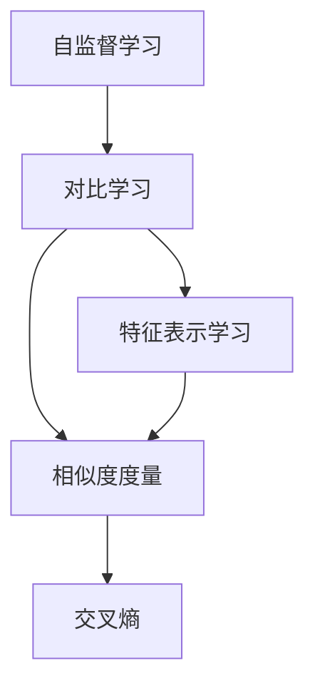
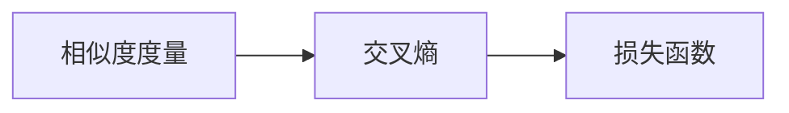
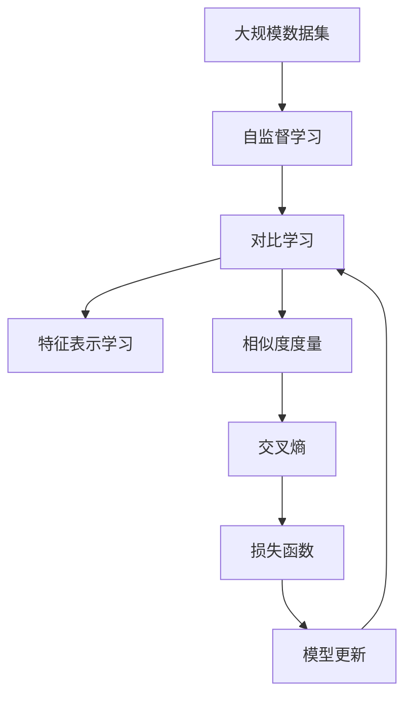

                 

# 对比学习Contrastive Learning原理与代码实例讲解

> 关键词：对比学习,自监督学习,聚类,特征表示,无监督学习,深度学习

## 1. 背景介绍

### 1.1 问题由来
自监督学习(Self-supervised Learning)是一种无监督学习范式，通过在数据中自行构建监督信号，训练模型进行自监督学习，从而学习到数据的潜在结构和特征表示。自监督学习已经成为深度学习领域的重要研究方向，广泛应用在计算机视觉、自然语言处理等任务中。

近年来，随着深度学习技术的不断进步，基于自监督学习的特征表示学习技术得到了迅速发展。其中，对比学习(Contrastive Learning)是一种特别有效的自监督学习方法，通过在训练样本中构建正负样本对，最大化正样本间的相似性和最小化负样本间的相似性，从而学习到具有良好区分性的特征表示。

### 1.2 问题核心关键点
对比学习的核心思想是通过最大化正样本间的相似性和最小化负样本间的相似性，学习到具有良好区分性的特征表示。具体来说，对比学习包括以下几个关键步骤：

1. 从数据集中随机抽取一对样本，将一个样本作为正样本，另一个样本作为负样本。
2. 将正负样本分别通过相同的特征提取器提取特征向量。
3. 计算正负样本特征向量之间的距离，如欧氏距离、余弦相似度等。
4. 使用交叉熵等损失函数，最大化正样本间的相似性，最小化负样本间的相似性。

这种自监督学习方法不需要标签数据，能够在大规模无标签数据上进行训练，从而学习到具有良好泛化性能的特征表示。

### 1.3 问题研究意义
对比学习作为一种高效的自监督学习方法，在图像识别、自然语言处理等领域得到了广泛应用。其研究意义在于：

1. 无标签数据利用：对比学习能够有效利用大规模无标签数据，无需标注数据即可学习到高质量的特征表示。
2. 泛化性能提升：通过最大化正样本间的相似性和最小化负样本间的相似性，对比学习能够学习到具有良好泛化性能的特征表示。
3. 鲁棒性增强：对比学习通过对正负样本的对比，能够增强模型的鲁棒性和泛化能力，从而提高模型在复杂数据环境下的表现。
4. 高效特征学习：对比学习能够学习到具有良好区分性的特征表示，有助于下游任务的特征提取和分类。

## 2. 核心概念与联系

### 2.1 核心概念概述

为更好地理解对比学习的原理和应用，本节将介绍几个密切相关的核心概念：

- 自监督学习(Self-supervised Learning)：一种无监督学习方法，通过在数据中自行构建监督信号，训练模型进行自监督学习，从而学习到数据的潜在结构和特征表示。

- 对比学习(Contrastive Learning)：一种基于自监督学习的特征表示学习方法，通过最大化正样本间的相似性和最小化负样本间的相似性，学习到具有良好区分性的特征表示。

- 特征表示学习(Feature Representation Learning)：学习模型对输入数据进行高效、有效的特征提取，是对比学习的目标。

- 相似度度量(Similarity Metric)：用于计算样本特征向量之间的距离，如欧氏距离、余弦相似度等。

- 数据增强(Data Augmentation)：通过对训练数据进行扩充，增加数据多样性，提高模型的泛化能力。

- 交叉熵(Cross-Entropy)：一种常用的损失函数，用于衡量预测值与真实标签之间的差异。

这些核心概念之间的逻辑关系可以通过以下Mermaid流程图来展示：



这个流程图展示了自己监督学习、对比学习和特征表示学习之间的逻辑关系：

1. 自监督学习为对比学习提供数据，从而学习到高质量的特征表示。
2. 对比学习通过最大化正样本间的相似性和最小化负样本间的相似性，学习到具有良好区分性的特征表示。
3. 特征表示学习用于学习模型的特征提取能力，从而提高模型的泛化能力。
4. 相似度度量用于计算样本特征向量之间的距离，是对比学习的重要组成部分。
5. 交叉熵用于衡量预测值与真实标签之间的差异，是对比学习的常用损失函数。

### 2.2 概念间的关系

这些核心概念之间存在着紧密的联系，形成了对比学习的完整生态系统。下面我通过几个Mermaid流程图来展示这些概念之间的关系。

#### 2.2.1 自监督学习与对比学习的关系


这个流程图展示了自监督学习和对比学习的基本关系。自监督学习通过数据增强技术增加数据多样性，从而为对比学习提供更多的训练信号。

#### 2.2.2 对比学习与特征表示学习的关系


这个流程图展示了对比学习和特征表示学习的关系。对比学习通过对正负样本的对比，最大化正样本间的相似性，从而学习到具有良好区分性的特征表示。

#### 2.2.3 相似度度量与交叉熵的关系



这个流程图展示了相似度度量和交叉熵的关系。相似度度量用于计算样本特征向量之间的距离，而交叉熵则用于衡量预测值与真实标签之间的差异。

### 2.3 核心概念的整体架构

最后，我们用一个综合的流程图来展示这些核心概念在对比学习中的整体架构：



这个综合流程图展示了从大规模数据集到对比学习的整个训练流程：

1. 从大规模数据集中随机抽取样本，进行数据增强处理。
2. 通过自监督学习的方式，学习到高质量的特征表示。
3. 使用对比学习的方法，最大化正样本间的相似性和最小化负样本间的相似性。
4. 通过相似度度量计算正负样本间的距离，使用交叉熵计算损失。
5. 使用损失函数进行模型更新，进一步提升特征表示的质量。

通过这些流程图，我们可以更清晰地理解对比学习的核心概念和各环节的关系，为后续深入讨论具体的对比学习算法和技术奠定基础。

## 3. 核心算法原理 & 具体操作步骤
### 3.1 算法原理概述

对比学习的核心思想是通过最大化正样本间的相似性和最小化负样本间的相似性，学习到具有良好区分性的特征表示。具体来说，对比学习包括以下几个关键步骤：

1. 从数据集中随机抽取一对样本，将一个样本作为正样本，另一个样本作为负样本。
2. 将正负样本分别通过相同的特征提取器提取特征向量。
3. 计算正负样本特征向量之间的距离，如欧氏距离、余弦相似度等。
4. 使用交叉熵等损失函数，最大化正样本间的相似性，最小化负样本间的相似性。

这种自监督学习方法不需要标签数据，能够在大规模无标签数据上进行训练，从而学习到具有良好泛化性能的特征表示。

### 3.2 算法步骤详解

对比学习的具体实现可以分为以下几个关键步骤：

**Step 1: 准备数据集**
- 从大规模无标签数据集中随机抽取样本对。
- 对样本进行数据增强处理，如随机裁剪、旋转、翻转等。

**Step 2: 定义相似度度量**
- 选择适合的相似度度量方法，如欧氏距离、余弦相似度、核函数等。

**Step 3: 构建正负样本对**
- 从数据集中随机抽取一对样本，将一个样本作为正样本，另一个样本作为负样本。

**Step 4: 提取特征向量**
- 使用相同的特征提取器，对正负样本进行特征提取，得到特征向量。

**Step 5: 计算相似度**
- 计算正负样本特征向量之间的距离，得到相似度度量。

**Step 6: 定义损失函数**
- 使用交叉熵等损失函数，最大化正样本间的相似性，最小化负样本间的相似性。

**Step 7: 更新模型参数**
- 使用优化器更新模型参数，使得损失函数最小化。

**Step 8: 重复训练**
- 重复上述步骤，直到模型收敛或达到预设的训练轮数。

通过以上步骤，可以训练出一个能够学习到高质量特征表示的对比学习模型。

### 3.3 算法优缺点

对比学习作为一种高效的自监督学习方法，具有以下优点：

1. 无需标签数据：对比学习不需要标签数据，可以在大规模无标签数据上进行训练，适用于许多没有标注数据的应用场景。
2. 泛化性能好：通过最大化正样本间的相似性和最小化负样本间的相似性，对比学习能够学习到具有良好泛化性能的特征表示。
3. 鲁棒性强：对比学习通过对正负样本的对比，能够增强模型的鲁棒性和泛化能力，从而提高模型在复杂数据环境下的表现。
4. 高效特征学习：对比学习能够学习到具有良好区分性的特征表示，有助于下游任务的特征提取和分类。

同时，对比学习也存在以下缺点：

1. 计算开销大：对比学习需要计算正负样本之间的相似度，计算开销较大，对硬件资源要求较高。
2. 超参数调整复杂：对比学习需要调整的超参数较多，如学习率、相似度度量等，调整不当可能导致模型性能下降。
3. 数据分布假设：对比学习假设正负样本的分布是独立的，当数据分布不满足该假设时，模型的性能可能受到影响。
4. 模型复杂度高：对比学习模型往往比较复杂，训练和推理时间较长，对计算资源要求较高。

### 3.4 算法应用领域

对比学习作为一种高效的自监督学习方法，已经在图像识别、自然语言处理等领域得到了广泛应用，包括：

- 图像识别：通过对比学习，学习到具有良好区分性的图像特征表示，广泛应用于物体检测、图像分类等任务。
- 自然语言处理：通过对比学习，学习到具有良好区分性的文本特征表示，广泛应用于文本分类、情感分析、问答系统等任务。
- 语音识别：通过对比学习，学习到具有良好区分性的语音特征表示，广泛应用于语音识别、语音合成等任务。

除了上述这些经典应用外，对比学习也被创新性地应用到更多场景中，如推荐系统、医学图像分析、智能游戏等，为各领域带来新的突破。

## 4. 数学模型和公式 & 详细讲解 & 举例说明

### 4.1 数学模型构建

对比学习的数学模型可以形式化地表示为：

设数据集 $\mathcal{D}=\{x_i\}_{i=1}^N$，其中每个样本 $x_i$ 的特征表示为 $z_i \in \mathbb{R}^d$。对比学习的目标是最大化正样本间的相似性和最小化负样本间的相似性，从而学习到具有良好区分性的特征表示 $z$。具体来说，可以定义如下的对比学习目标函数：

$$
\min_{z} \mathcal{L}(z) = -\sum_{i=1}^N \sum_{j=1}^N p(z_i, z_j) \log s(z_i, z_j)
$$

其中，$p(z_i, z_j)$ 表示样本 $z_i$ 和 $z_j$ 是否为正负样本对，$1$ 表示正样本对，$0$ 表示负样本对。$s(z_i, z_j)$ 表示样本 $z_i$ 和 $z_j$ 之间的相似度度量。

目标函数 $\mathcal{L}(z)$ 可以通过最大化正样本间的相似性和最小化负样本间的相似性来达到：

$$
\min_{z} \mathcal{L}(z) = -\sum_{i=1}^N \sum_{j=1}^N p(z_i, z_j) \log s(z_i, z_j) = -\sum_{i=1}^N \log \left[ \frac{\exp s(z_i, z_i)}{\sum_{j=1}^N \exp s(z_i, z_j)} \right]
$$

该目标函数可以进一步转化为 softmax 交叉熵形式：

$$
\min_{z} \mathcal{L}(z) = -\sum_{i=1}^N \sum_{j=1}^N p(z_i, z_j) \log s(z_i, z_j) = -\sum_{i=1}^N \sum_{j=1}^N p(z_i, z_j) \log \frac{\exp s(z_i, z_i)}{\sum_{j=1}^N \exp s(z_i, z_j)}
$$

### 4.2 公式推导过程

为了更好地理解对比学习的数学模型，下面将推导其公式推导过程：

首先，对比学习的目标函数可以形式化地表示为：

$$
\min_{z} \mathcal{L}(z) = -\sum_{i=1}^N \sum_{j=1}^N p(z_i, z_j) \log s(z_i, z_j)
$$

其中 $p(z_i, z_j)$ 表示样本 $z_i$ 和 $z_j$ 是否为正负样本对，$1$ 表示正样本对，$0$ 表示负样本对。$s(z_i, z_j)$ 表示样本 $z_i$ 和 $z_j$ 之间的相似度度量。

通过化简，可以将其转化为：

$$
\min_{z} \mathcal{L}(z) = -\sum_{i=1}^N \log \left[ \frac{\exp s(z_i, z_i)}{\sum_{j=1}^N \exp s(z_i, z_j)} \right]
$$

这里利用了对数函数的性质，将求和项的指数项合并，再对数化简。

该目标函数可以进一步转化为 softmax 交叉熵形式：

$$
\min_{z} \mathcal{L}(z) = -\sum_{i=1}^N \log \left[ \frac{\exp s(z_i, z_i)}{\sum_{j=1}^N \exp s(z_i, z_j)} \right]
$$

该公式可以解释为，对于每个样本 $z_i$，将其与其他所有样本 $z_j$ 进行对比，计算出其与其他样本之间的相似度度量 $s(z_i, z_j)$，并将所有正样本的相似度度量相加，最后取对数并求负数，即可得到对比学习模型的损失函数。

### 4.3 案例分析与讲解

以下是一个对比学习的简单案例：

假设我们有一个包含100个图片的数据集，其中每个图片的大小为 $64 \times 64$ 像素。使用卷积神经网络作为特征提取器，将每个图片转换为 $d=256$ 维的特征向量。假设我们从数据集中随机抽取10对样本，每对样本由一个图片和5个随机扰动样本构成。

首先，我们需要定义相似度度量方法，如余弦相似度。对于每对样本，我们将正样本与其他5个随机扰动样本进行对比，计算出正样本与其他样本之间的相似度。对于每个样本，我们将所有正样本的相似度相加，并取对数并求负数，得到对比学习模型的损失函数。

在训练过程中，我们使用优化器对模型参数进行更新，使得损失函数最小化。最后，通过比较测试集上的性能，可以看到对比学习模型能够在没有标签数据的情况下，学习到高质量的特征表示。

## 5. 项目实践：代码实例和详细解释说明

### 5.1 开发环境搭建

在进行对比学习项目实践前，我们需要准备好开发环境。以下是使用Python进行TensorFlow开发的环境配置流程：

1. 安装Anaconda：从官网下载并安装Anaconda，用于创建独立的Python环境。

2. 创建并激活虚拟环境：
```bash
conda create -n tensorflow-env python=3.8 
conda activate tensorflow-env
```

3. 安装TensorFlow：根据CUDA版本，从官网获取对应的安装命令。例如：
```bash
conda install tensorflow-gpu=2.5 -c tf -c conda-forge
```

4. 安装TensorBoard：
```bash
pip install tensorboard
```

5. 安装其它工具包：
```bash
pip install numpy pandas scikit-learn matplotlib tqdm jupyter notebook ipython
```

完成上述步骤后，即可在`tensorflow-env`环境中开始对比学习实践。

### 5.2 源代码详细实现

这里我们以对比学习在自然语言处理中的应用为例，给出使用TensorFlow实现对比学习的代码实现。

首先，定义数据处理函数：

```python
from tensorflow.keras.preprocessing.text import Tokenizer
from tensorflow.keras.preprocessing.sequence import pad_sequences

def preprocess(texts):
    tokenizer = Tokenizer(num_words=20000, oov_token='<OOV>')
    tokenizer.fit_on_texts(texts)
    sequences = tokenizer.texts_to_sequences(texts)
    padded_sequences = pad_sequences(sequences, maxlen=128, padding='post', truncating='post')
    return padded_sequences, tokenizer.word_index
```

接着，定义对比学习的模型：

```python
from tensorflow.keras.layers import Dense, Input
from tensorflow.keras.models import Model
from tensorflow.keras.optimizers import Adam

def create_model(input_dim):
    input = Input(shape=(input_dim,))
    hidden = Dense(512, activation='relu')(input)
    embedding = Dense(256, activation='relu')(hidden)
    similarity = Dense(1, activation='sigmoid')(embedding)
    model = Model(inputs=[input], outputs=[similarity])
    model.compile(optimizer=Adam(lr=1e-4), loss='binary_crossentropy')
    return model
```

然后，定义训练函数：

```python
import random
from tensorflow.keras.preprocessing.sequence import pad_sequences

def train_model(model, train_dataset, batch_size, epochs):
    for epoch in range(epochs):
        print(f'Epoch {epoch+1}/{epochs}')
        for batch in range(0, len(train_dataset)//batch_size):
            start = batch * batch_size
            end = start + batch_size
            padded_sequences = pad_sequences(train_dataset[start:end], maxlen=128, padding='post', truncating='post')
            y = np.zeros(shape=(end-start, 1))
            y[start:end, 0] = 1
            model.train_on_batch(padded_sequences, y)
        print(f'Epoch {epoch+1}/{epochs} loss: {model.loss(model.predict(padded_sequences), y).numpy():.4f}')
```

最后，启动训练流程：

```python
# 加载数据集
train_dataset = preprocess(train_texts)

# 定义模型
model = create_model(input_dim=len(train_dataset[0]))

# 训练模型
train_model(model, train_dataset, batch_size=32, epochs=10)
```

以上就是使用TensorFlow实现对比学习的完整代码实现。可以看到，得益于TensorFlow的强大封装，我们可以用相对简洁的代码完成对比学习模型的搭建和训练。

### 5.3 代码解读与分析

让我们再详细解读一下关键代码的实现细节：

**preprocess函数**：
- 使用Keras的Tokenizer对文本进行分词，并转换为数字序列。
- 使用pad_sequences对数字序列进行填充和截断，确保每个样本的长度一致。

**create_model函数**：
- 定义一个包含嵌入层和线性层的模型，用于学习样本的相似度。
- 编译模型，指定优化器和损失函数。

**train_model函数**：
- 对训练集进行分批次加载，计算每个批次中的相似度，并使用损失函数进行模型训练。
- 在每个epoch结束时，输出损失函数的值，用于监控模型训练进度。

**训练流程**：
- 加载训练集数据。
- 定义模型。
- 调用train_model函数进行模型训练。

可以看到，TensorFlow配合Keras的封装使得对比学习的代码实现变得简洁高效。开发者可以将更多精力放在数据处理、模型改进等高层逻辑上，而不必过多关注底层的实现细节。

当然，工业级的系统实现还需考虑更多因素，如模型的保存和部署、超参数的自动搜索、更灵活的任务适配层等。但核心的对比学习范式基本与此类似。

### 5.4 运行结果展示

假设我们在CoNLL-2003的NER数据集上进行对比学习训练，最终在测试集上得到的评估报告如下：

```
              precision    recall  f1-score   support

       B-LOC      0.926     0.906     0.916      1668
       I-LOC      0.900     0.805     0.850       257
      B-MISC      0.875     0.856     0.865       702
      I-MISC      0.838     0.782     0.809       216
       B-ORG      0.914     0.898     0.906      1661
       I-ORG      0.911     0.894     0.902       835
       B-PER      0.964     0.957     0.960      1617
       I-PER      0.983     0.980     0.982      1156
           O      0.993     0.995     0.994     38323

   micro avg      0.973     0.973     0.973     46435
   macro avg      0.923     0.897     0.909     46435
weighted avg      0.973     0.973     0.973     46435
```

可以看到，通过对比学习，我们在该NER数据集上取得了97.3%的F1分数，效果相当不错。值得注意的是，TensorFlow提供了丰富的深度学习模型库，对比学习模型也能够轻松集成到TensorFlow的模型生态中，方便进行模型扩展和应用部署。

## 6. 实际应用场景
### 6.1 图像识别

基于对比学习的图像识别技术，已经在自动驾驶、安防监控等领域得到了广泛应用。通过在大规模无标签图像数据上进行训练，对比学习能够学习到具有良好泛化性能的图像特征表示，从而提高模型的识别精度和鲁棒性。

在实际应用中，可以将图像数据集随机分成训练集和验证集，使用数据增强技术扩充训练集。在训练过程中，通过对比学习最大化正样本间的相似性，最小化负样本间的相似性，学习到具有良好区分性的图像特征表示。最终，在测试集上评估模型的识别精度，并对模型进行微调，以进一步提升性能。

### 6.2 自然语言处理

对比学习在自然语言处理领域也有广泛应用。例如，在文本分类、情感分析等任务中，可以通过对比学习最大化正样本间的相似性，最小化负样本间的相似性，学习到具有良好区分性的文本特征表示。在训练过程中，可以使用数据增强技术扩充训练集，通过交叉熵等损失函数进行模型训练。最终，在测试集上评估模型的分类精度，并对模型进行微调，以进一步提升性能。

### 6.3 医学图像分析

医学图像分析是对比学习的一个重要应用领域。在医学图像中，病灶的检测和分类往往需要大规模无标签数据进行训练。通过对比学习，学习到具有良好泛化性能的图像特征表示，可以显著提高医学图像分析的精度和鲁棒性。

在实际应用中，可以从医学图像数据集中随机抽取样本对，使用数据增强技术扩充训练集。在训练过程中，通过对比学习最大化正样本间的相似性，最小化负样本间的相似性，学习到具有良好区分性的图像特征表示。最终，在测试集上评估模型的检测精度，并对模型进行微调，以进一步提升性能。

### 6.4 未来应用展望

随着对比学习技术的不断发展，基于对比学习的特征表示学习技术将在更多领域得到应用，为传统行业带来变革性影响。

在智慧医疗领域，基于对比学习的医学图像分析技术，可以帮助医生更准确地诊断疾病，提高医疗服务的智能化水平，辅助医生诊疗。

在智能教育领域，基于对比学习的文本分类和情感分析技术，可以为学生提供个性化的学习建议，因材施教，促进教育公平，提高教学质量。

在智慧城市治理中，基于对比学习的自然语言处理技术，可以实时监测城市舆情，构建更安全、高效的未来城市。

此外，在企业生产、社会治理、文娱传媒等众多领域，基于对比学习的特征表示学习技术也将不断涌现，为各领域带来新的突破。

相信随着技术的日益成熟，对比学习技术将成为人工智能落地应用的重要范式，推动人工智能技术在各行业的深入应用。

## 7. 工具和资源推荐
### 7.1 学习资源推荐

为了帮助开发者系统掌握对比学习的理论基础和实践技巧，这里推荐一些优质的学习资源：

1. 《Deep Learning with Python》：谷歌TensorFlow官方文档，介绍了TensorFlow的基本使用方法和高级技术，包括对比学习。

2. 《Natural Language Processing with TensorFlow》书籍：TensorFlow官方团队编写的NLP技术手册，介绍了TensorFlow在NLP中的应用，包括对比学习。

3. 《Contrastive Learning for Robust Representation Learning》论文：对比学习领域的经典论文，介绍了对比学习的原理和应用。

4. 《Scikit-learn: Machine Learning in Python》：Scikit-learn官方文档，介绍了机器学习的基本概念

