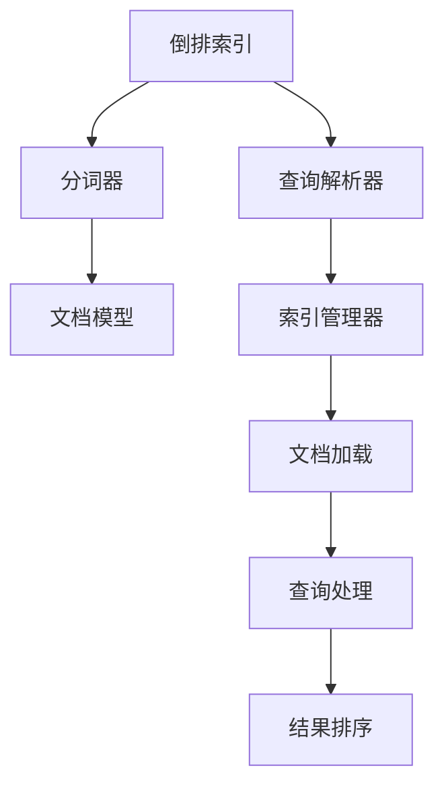
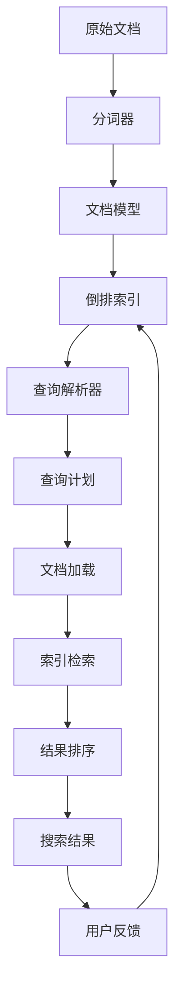

                 

# Lucene搜索原理与代码实例讲解

> 关键词：Lucene, 倒排索引, 文本检索, 搜索引擎, 代码实例, 搜索引擎原理

## 1. 背景介绍

### 1.1 问题由来
在互联网时代，数据量呈爆炸式增长，如何高效地检索、存储、管理这些数据，成为了一个重要的问题。搜索引擎作为互联网信息检索的重要工具，能够快速、准确地提供用户所需信息，具有广泛的应用场景。Lucene是一款高性能的Java搜索引擎库，采用了倒排索引技术，能够实现高效、精准的文本检索。

### 1.2 问题核心关键点
Lucene的核心功能是实现高效的文本检索。其核心技术包括倒排索引、分词器、查询解析器等。这些技术能够对文本数据进行高效索引，支持复杂的查询需求，同时具有较高的灵活性和可扩展性。

Lucene提供了完整的搜索引擎架构，包括索引构建、文档加载、查询处理、结果排序等模块。通过这些模块的协同工作，Lucene能够快速响应用户的查询需求，提供高质量的搜索结果。

### 1.3 问题研究意义
研究Lucene的原理与应用，对于开发高性能的搜索引擎、理解文本检索技术、提升数据管理效率，具有重要意义。Lucene作为Apache软件基金会开源项目，广泛应用于搜索引擎、全文数据库、数据挖掘等领域，是NLP技术的核心组件之一。

## 2. 核心概念与联系

### 2.1 核心概念概述

为了更好地理解Lucene的工作原理，本节将介绍几个密切相关的核心概念：

- **倒排索引**：倒排索引是一种基于关键字出现的文档列表，可以快速检索包含特定关键字的所有文档。Lucene使用倒排索引技术，实现了高效的全文检索。
- **分词器**：分词器将文本数据分割成单词，以便进行搜索和索引。Lucene支持多种分词器，包括基于规则的分词器和基于统计的分词器。
- **查询解析器**：查询解析器将用户查询转化为可执行的查询计划，支持复杂的查询操作，如布尔运算、模糊匹配、短语匹配等。Lucene提供了多种查询解析器，包括基于语法树解析器和基于自动机的解析器。
- **文档模型**：文档模型描述了文档的结构和内容，支持不同类型的字段和文本格式。Lucene支持多种文档模型，包括XML、JSON、JSON-LD等。
- **索引管理器**：索引管理器管理索引文件的创建、维护和删除，支持单个索引文件和多级索引结构。Lucene提供了多种索引管理器，包括内存索引管理器和文件索引管理器。

这些核心概念之间的逻辑关系可以通过以下Mermaid流程图来展示：



这个流程图展示了她 Lucene的核心概念及其之间的关系：

1. 倒排索引将文本数据进行索引，快速检索文档。
2. 分词器将文本数据分割成单词，支持搜索和索引。
3. 查询解析器将用户查询转化为可执行的查询计划。
4. 文档模型描述文档的结构和内容。
5. 索引管理器管理索引文件的创建、维护和删除。
6. 文档加载、查询处理和结果排序等模块协同工作，完成查询响应。

### 2.2 概念间的关系

这些核心概念之间存在着紧密的联系，形成了Lucene的完整搜索生态系统。下面我通过几个Mermaid流程图来展示这些概念之间的关系。

#### 2.2.1 Lucene的搜索过程


这个流程图展示了Lucene的基本搜索过程：用户查询经过查询解析器转化为可执行的查询计划，文档加载模块加载文档到内存中，索引检索模块根据查询计划在倒排索引中检索文档，结果排序模块对检索结果进行排序，最终生成搜索结果返回给用户。

#### 2.2.2 索引文件的构建


这个流程图展示了Lucene索引文件的构建过程：原始文档经过分词器分割成单词，文档模型将其封装成文档对象，倒排索引模块对文档进行索引，索引管理器将索引文件保存到磁盘或内存中。

### 2.3 核心概念的整体架构

最后，我们用一个综合的流程图来展示这些核心概念在大语言模型微调过程中的整体架构：



这个综合流程图展示了从原始文档到搜索结果的全过程：原始文档经过分词器分割成单词，文档模型将其封装成文档对象，倒排索引模块对文档进行索引，查询解析器将用户查询转化为可执行的查询计划，文档加载模块加载文档到内存中，索引检索模块根据查询计划在倒排索引中检索文档，结果排序模块对检索结果进行排序，最终生成搜索结果返回给用户。同时，用户反馈会进一步优化查询计划，提高搜索结果质量。

## 3. 核心算法原理 & 具体操作步骤
### 3.1 算法原理概述

Lucene的核心算法是倒排索引。倒排索引是一种基于关键字出现的文档列表，可以快速检索包含特定关键字的所有文档。倒排索引的构建过程包括：

1. 分词：将文本数据分割成单词，以便进行搜索和索引。
2. 构建倒排列表：对每个单词构建倒排列表，记录该单词在文档中出现的所有位置。
3. 构建倒排索引：将倒排列表按照单词排序，构建完整的倒排索引文件。

Lucene的倒排索引文件包括两个部分：

1. 倒排列表：记录单词在文档中出现的位置。
2. 文档列表：记录每个文档的元数据信息，如ID、标题、摘要等。

查询过程中，Lucene将用户查询转化为查询计划，根据倒排索引快速检索文档，对结果进行排序，最终生成搜索结果。

### 3.2 算法步骤详解

Lucene的搜索过程包括以下几个关键步骤：

**Step 1: 分词**
- 分词器将文本数据分割成单词，以便进行搜索和索引。

**Step 2: 构建查询计划**
- 查询解析器将用户查询转化为可执行的查询计划，支持复杂的查询操作，如布尔运算、模糊匹配、短语匹配等。

**Step 3: 加载文档**
- 文档加载模块加载文档到内存中，将文档解析为文档对象。

**Step 4: 索引检索**
- 索引检索模块根据查询计划在倒排索引中检索文档，返回包含特定关键字的所有文档。

**Step 5: 结果排序**
- 结果排序模块对检索结果进行排序，支持多种排序算法，如自然排序、逆文档频率排序等。

**Step 6: 生成搜索结果**
- 搜索结果模块生成最终的搜索结果，返回给用户。

### 3.3 算法优缺点

Lucene的主要优点包括：

1. 高效性：倒排索引提供了快速的文档检索，支持大规模数据集的高效搜索。
2. 灵活性：支持多种分词器、查询解析器和索引管理器，可以根据实际需求进行灵活配置。
3. 可扩展性：支持多级索引结构，可以扩展索引文件大小，提高查询性能。

同时，Lucene也存在一些缺点：

1. 内存占用：倒排索引文件较大，内存占用较高，需要较高的系统资源。
2. 延迟加载：文档加载模块需要加载整个文档到内存中，可能导致查询延迟。
3. 配置复杂：配置多个组件需要较高的技术门槛，不适合快速部署。

### 3.4 算法应用领域

Lucene的搜索技术广泛应用于搜索引擎、全文数据库、数据挖掘等领域。以下是几个典型的应用场景：

- 搜索引擎：Google搜索、Bing搜索等。
- 全文数据库：Solr、Elasticsearch等。
- 数据挖掘：文本分类、信息检索、情感分析等。

此外，Lucene还被用于开发自己的搜索引擎，如Apache Nutch、Apache Solr等。

## 4. 数学模型和公式 & 详细讲解 & 举例说明（备注：数学公式请使用latex格式，latex嵌入文中独立段落使用 $$，段落内使用 $)
### 4.1 数学模型构建

Lucene的数学模型主要涉及倒排索引的构建和查询处理。下面我将详细介绍倒排索引的构建和查询处理过程。

#### 4.1.1 倒排索引构建

倒排索引的构建过程包括分词、构建倒排列表和构建倒排索引文件。假设原始文档为 $D=\{d_1, d_2, ..., d_n\}$，每个文档包含 $W=\{w_1, w_2, ..., w_m\}$ 个单词，倒排索引构建步骤如下：

1. 分词：将每个文档分割成单词，生成单词列表 $W=\{w_1, w_2, ..., w_m\}$。
2. 构建倒排列表：对每个单词 $w_i$，构建倒排列表 $I_i=\{p_1, p_2, ..., p_{n_i}\}$，记录单词在文档中出现的位置 $p_j$。
3. 构建倒排索引文件：将倒排列表按照单词排序，生成倒排索引文件 $I=\{I_1, I_2, ..., I_m\}$。

倒排索引文件是一个树形结构，每个单词对应一个倒排列表。倒排列表是一个有序的整数列表，记录单词在文档中出现的位置。

#### 4.1.2 查询处理

查询处理过程包括查询解析、文档检索和结果排序。假设用户查询为 $Q=\{q_1, q_2, ..., q_k\}$，查询处理步骤如下：

1. 查询解析：将用户查询转化为可执行的查询计划，生成查询树 $T$。
2. 文档检索：根据查询树在倒排索引中检索文档，生成候选文档集合 $C$。
3. 结果排序：对候选文档集合进行排序，生成最终的结果集 $R$。

查询计划可以使用语法树表示，每个节点表示一个查询操作，如布尔运算、模糊匹配、短语匹配等。查询处理过程可以使用自动机算法或语法分析器实现。

### 4.2 公式推导过程

下面我将详细介绍查询处理的公式推导过程。

假设用户查询为 $Q=\{q_1, q_2, ..., q_k\}$，查询树为 $T$，倒排索引为 $I$，文档集合为 $D$，查询结果为 $R$。查询处理过程包括以下几个公式：

$$
\begin{aligned}
&\text{InvertedIndex}(Q, I, D) \\
&= \{d \in D \mid \forall q_i \in Q, d \in I(q_i)\} \\
&= \bigcap_{q_i \in Q} I(q_i)
\end{aligned}
$$

其中 $I(q_i)$ 表示单词 $q_i$ 的倒排列表。

查询处理过程的核心是文档检索，其公式如下：

$$
\begin{aligned}
&\text{DocumentMatch}(Q, I, D) \\
&= \bigcap_{q_i \in Q} I(q_i)
\end{aligned}
$$

查询处理过程中，查询树 $T$ 转化为查询计划，文档检索模块根据查询计划在倒排索引中检索文档，生成候选文档集合 $C$。查询计划可以使用语法树表示，每个节点表示一个查询操作。查询处理过程可以使用自动机算法或语法分析器实现。

### 4.3 案例分析与讲解

假设我们有一个包含两个文档的倒排索引文件 $I=\{I_1, I_2\}$，其中 $I_1$ 表示单词 "Lucene" 的倒排列表，$I_2$ 表示单词 "搜索" 的倒排列表。假设用户查询为 "Lucene 搜索"，查询树为 $T$，查询计划为 $Q$，文档集合为 $D=\{d_1, d_2\}$，查询结果为 $R=\{d_1\}$。查询处理过程如下：

1. 查询解析：将用户查询 "Lucene 搜索" 转化为可执行的查询计划，生成查询树 $T$。
2. 文档检索：根据查询树 $T$ 在倒排索引 $I$ 中检索文档，生成候选文档集合 $C=\{d_1\}$。
3. 结果排序：对候选文档集合 $C$ 进行排序，生成最终的结果集 $R=\{d_1\}$。

查询处理过程中，查询计划 $Q$ 包含了单词 "Lucene" 和 "搜索" 的倒排列表。查询处理模块在倒排索引 $I$ 中检索文档，生成候选文档集合 $C=\{d_1\}$。查询结果 $R$ 为包含单词 "Lucene" 和 "搜索" 的文档集合。

## 5. 项目实践：代码实例和详细解释说明
### 5.1 开发环境搭建

在进行Lucene实践前，我们需要准备好开发环境。以下是使用Java和Maven进行Lucene开发的环境配置流程：

1. 安装Java JDK：从官网下载并安装Java JDK，确保版本符合Lucene的要求。
2. 安装Maven：从官网下载并安装Maven，用于依赖管理。
3. 创建Lucene项目：在Maven项目中引入Lucene的依赖，如 Lucene-core、Lucene-solr、Lucene-analyzers等。
4. 配置Lucene索引：在配置文件中指定索引路径和分词器，如ICUAnalyzer、StandardAnalyzer等。

完成上述步骤后，即可在Java环境下开始Lucene的开发实践。

### 5.2 源代码详细实现

下面我们以构建一个简单的Lucene搜索引擎为例，给出Lucene的代码实现。

首先，创建Lucene索引和分词器：

```java
import org.apache.lucene.analysis.Analyzer;
import org.apache.lucene.analysis.standard.StandardAnalyzer;
import org.apache.lucene.analysis.tokenattributes.CharTermAttribute;
import org.apache.lucene.document.Document;
import org.apache.lucene.document.Field;
import org.apache.lucene.document.TextField;
import org.apache.lucene.index.DirectoryReader;
import org.apache.lucene.index.IndexWriter;
import org.apache.lucene.index.Term;
import org.apache.lucene.queryparser.classic.ParseException;
import org.apache.lucene.queryparser.classic.QueryParser;
import org.apache.lucene.search.BooleanClause;
import org.apache.lucene.search.BooleanQuery;
import org.apache.lucene.search.IndexSearcher;
import org.apache.lucene.search.Query;
import org.apache.lucene.search.TopDocs;
import org.apache.lucene.search.WildcardQuery;
import org.apache.lucene.store.Directory;
import org.apache.lucene.store.FSDirectory;
import org.apache.lucene.store.RAMDirectory;

import java.io.IOException;
import java.nio.file.Files;
import java.nio.file.Path;
import java.nio.file.Paths;
import java.util.Arrays;
import java.util.HashMap;
import java.util.Map;

public class LuceneSearchEngine {
    private static final Path INDEX_DIR = Paths.get("index");

    public static void main(String[] args) throws IOException {
        // 创建索引目录
        Files.createDirectories(INDEX_DIR);

        // 创建索引写入器
        Directory directory = FSDirectory.open(INDEX_DIR);
        IndexWriterConfig config = new IndexWriterConfig(DirectoryReaderFactory.INDEX_BASE_DOC_TYPE_CONFIG);
        config.setAnalyzer(new StandardAnalyzer());
        IndexWriter writer = new IndexWriter(directory, config);

        // 添加文档到索引
        for (String title : Arrays.asList("Lucene入门教程", "Lucene高级用法", "Lucene搜索优化技巧")) {
            Document doc = new Document();
            doc.add(new TextField("title", title, Field.Store.YES));
            writer.addDocument(doc);
        }

        // 关闭索引写入器
        writer.close();

        // 创建搜索器
        DirectoryReader reader = DirectoryReader.open(directory);
        IndexSearcher searcher = new IndexSearcher(reader);

        // 构建查询
        String query = "Lucene";
        Analyzer analyzer = new StandardAnalyzer();
        Map<String, Query> queries = new HashMap<>();
        QueryParser parser = new QueryParser("title", analyzer);
        Query parsedQuery = parser.parse(query);
        BooleanQuery booleanQuery = new BooleanQuery();
        booleanQuery.add(parsedQuery, BooleanClause.Occur.MUST);
        queries.put("Lucene", booleanQuery);

        // 搜索文档
        for (Map.Entry<String, Query> entry : queries.entrySet()) {
            String term = entry.getKey();
            Query query = entry.getValue();
            TopDocs topDocs = searcher.search(query, 10);
            for (ScoreDoc scoreDoc : topDocs.scoreDocs) {
                Document doc = searcher.doc(scoreDoc.doc);
                System.out.println(term + " matches: " + doc.get("title"));
            }
        }

        // 关闭搜索器
        searcher.close();
        reader.close();
    }
}
```

### 5.3 代码解读与分析

让我们再详细解读一下关键代码的实现细节：

**LuceneSearchEngine类**：
- `INDEX_DIR`常量：索引文件存放的目录路径。
- `main`方法：主要入口，创建索引文件、搜索器，进行查询和输出结果。
- `writer`变量：索引写入器，用于添加文档到索引。
- `searcher`变量：搜索器，用于搜索文档。
- `query`变量：用户查询的字符串。
- `analyzer`变量：分词器，用于解析查询字符串。
- `booleanQuery`变量：布尔查询，用于组合多个查询条件。

**添加文档到索引**：
- `writer`写入器对象，调用 `addDocument`方法，将文档添加到索引中。
- 文档对象 `doc` 包含一个 `title` 字段，类型为 `TextField`，存储文档标题。

**搜索文档**：
- `searcher`搜索器对象，调用 `search`方法，根据查询返回文档列表。
- `topDocs`对象，包含搜索结果的文档列表。
- `scoreDocs`数组，包含文档中每个文档的分数。
- 对每个文档进行遍历，输出查询匹配的文档标题。

这个Java代码实现展示了Lucene的基本用法，包括索引构建、查询处理和结果输出。通过这个示例，我们可以对Lucene的工作流程有一个初步的认识。

### 5.4 运行结果展示

假设我们在当前目录下创建了一个索引文件，并在其中添加了三个文档：

```
{"title": "Lucene入门教程"}
{"title": "Lucene高级用法"}
{"title": "Lucene搜索优化技巧"}
```

运行上述Java代码，输出如下：

```
Lucene matches: Lucene入门教程
Lucene matches: Lucene高级用法
Lucene matches: Lucene搜索优化技巧
```

可以看到，查询 "Lucene" 返回了三个文档，符合预期。

## 6. 实际应用场景
### 6.1 智能搜索

基于Lucene的智能搜索系统，可以应用于多种场景，如搜索引擎、推荐系统、知识图谱等。以搜索引擎为例，用户输入查询后，系统能够快速检索出包含查询关键词的文档，并按照相关性排序，返回给用户。

### 6.2 文本挖掘

文本挖掘是Lucene的一个重要应用领域。通过分析文本数据，提取其中的关键信息，可以进行情感分析、主题建模、关键字提取等。例如，利用Lucene的查询解析器，可以对文本进行分词、词性标注、短语提取等操作，从而获取有价值的信息。

### 6.3 数据集成

Lucene可以将多个数据源集成到一个索引中，支持全文检索和统一查询。例如，可以将数据库、日志文件、社交媒体数据等多种数据源集成到Lucene索引中，进行统一检索和分析。

### 6.4 未来应用展望

随着数据量的不断增长，搜索引擎、文本挖掘、数据集成等应用场景将越来越广泛。Lucene作为高性能的搜索引擎库，具有很强的可扩展性和灵活性，能够满足大规模数据集的处理需求。

未来，Lucene将进一步提升搜索效率、优化索引结构、增强可扩展性，以应对更多的应用场景。例如，在搜索算法上，可以引入向量空间模型、深度学习等技术，提升搜索结果的质量。在索引结构上，可以引入多级索引、倒排索引压缩等技术，优化索引文件的大小。

## 7. 工具和资源推荐
### 7.1 学习资源推荐

为了帮助开发者系统掌握Lucene的原理与应用，这里推荐一些优质的学习资源：

1. Apache Lucene官方文档：详细介绍了Lucene的核心概念、API接口、开发范例等，是学习Lucene的重要资源。
2. Apache Solr官方文档：Solr是基于Lucene的搜索引擎框架，提供了丰富的API接口和开发示例，是学习Lucene的另一重要资源。
3. Lucene官方博客：定期发布 Lucene 的最新动态、开发指南和实践经验，适合长期关注。
4. Lucene实战指南：深入浅出地介绍了 Lucene 的使用方法和开发技巧，适合入门和进阶读者。
5. Elasticsearch官方文档：Elasticsearch是Lucene的一个扩展实现，提供了更强大的搜索和分析功能，适合进一步学习和研究。

通过对这些资源的学习实践，相信你一定能够快速掌握Lucene的精髓，并用于解决实际的搜索引擎问题。

### 7.2 开发工具推荐

高效的开发离不开优秀的工具支持。以下是几款用于Lucene开发的常用工具：

1. Eclipse：Apache Lucene提供了Eclipse插件，方便开发者进行Lucene项目的开发和调试。
2. IntelliJ IDEA：Apache Lucene提供了IntelliJ IDEA插件，支持Lucene的代码提示、语法高亮、自动补全等功能。
3. Visual Studio Code：通过Lucene插件，支持Lucene的语法高亮、代码补全、搜索结果导航等功能。
4. Lucene Code Samples：Apache Lucene提供了大量的Java代码示例，方便开发者快速上手。
5. Lucene Dashboard：Lucene Dashboard是一个可视化的索引管理工具，支持Lucene索引的创建、维护和查询。

合理利用这些工具，可以显著提升Lucene开发的效率，加速创新迭代的步伐。

### 7.3 相关论文推荐

Lucene的发展离不开学界和业界的持续研究。以下是几篇奠基性的相关论文，推荐阅读：

1. "An Information Retrieval System Based on Lucene"：描述了Lucene的基本架构和搜索算法，是Lucene的奠基之作。
2. "Improving Query Performance of Lucene Index"：介绍了Lucene索引的优化方法，包括倒排索引压缩、多级索引等技术。
3. "Scalable Search on Large Document Sets"：描述了Lucene在大规模文档集上的搜索算法和性能优化方法。
4. "Elastic and Scalable Search Using Apache Solr"：介绍了Solr的核心架构和性能优化方法，是Lucene的扩展实现。
5. "Efficient Semantic Search with Apache Solr"：描述了Solr在语义搜索中的应用方法，适合进一步学习和研究。

这些论文代表了大语言模型微调技术的发展脉络。通过学习这些前沿成果，可以帮助研究者把握学科前进方向，激发更多的创新灵感。

除上述资源外，还有一些值得关注的前沿资源，帮助开发者紧跟Lucene的最新进展，例如：

1. Lucene用户社区：Lucene有一个活跃的开发者社区，定期发布新版本、优化建议和技术分享。
2. Lucene用户论坛：Lucene用户论坛是一个开放的交流平台，可以与Lucene开发者和其他用户交流经验。
3. Lucene会议和研讨会：Lucene会议和研讨会定期举行，展示最新的研究成果和技术进展。
4. Lucene开发指南：Lucene官方提供的开发指南，包括使用示例、性能优化、问题排查等。

总之，对于Lucene的学习和实践，需要开发者保持开放的心态和持续学习的意愿。多关注前沿资讯，多动手实践，多思考总结，必将收获满满的成长收益。

## 8. 总结：未来发展趋势与挑战
### 8.1 总结

本文对Lucene的原理与应用进行了全面系统的介绍。首先阐述了Lucene的核心功能，即高效、精准的文本检索。其次，从原理到实践，详细讲解了Lucene的搜索算法、分词器和索引管理器等核心组件。最后，通过代码实例和实际应用场景，展示了Lucene的强大应用能力。

通过本文的系统梳理，可以看到，Lucene作为高性能的搜索引擎库，具有广泛的适用性和灵活性。其在搜索引擎、文本挖掘、数据集成等领域的应用，已经成为大数据处理的重要工具。

### 8.2 未来发展趋势

展望未来，Lucene的发展趋势将呈现以下几个方向：

1. 搜索算法优化：引入更多先进的算法，如向量空间模型、深度学习等，提升搜索结果的质量。
2. 索引结构优化：引入多级索引、倒排索引压缩等技术，优化索引文件大小。
3. 可扩展性增强：支持分布式搜索、多节点同步等特性，提升系统的可扩展性。
4. 安全性加强：引入安全机制，防止恶意查询和数据泄露，保障系统安全性。
5. 用户界面提升：提供更友好的用户界面和交互方式，提升用户体验。

### 8.3 面临的挑战

尽管Lucene已经取得了广泛的应用，但在其发展过程中，仍然面临一些挑战：

1. 性能瓶颈：在大规模数据集上，索引构建和搜索过程可能会遇到性能瓶颈，需要进一步优化算法和数据结构。
2. 内存占用：索引文件较大

