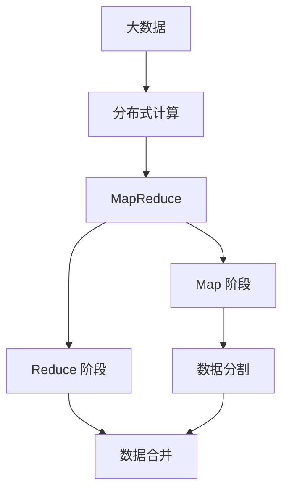
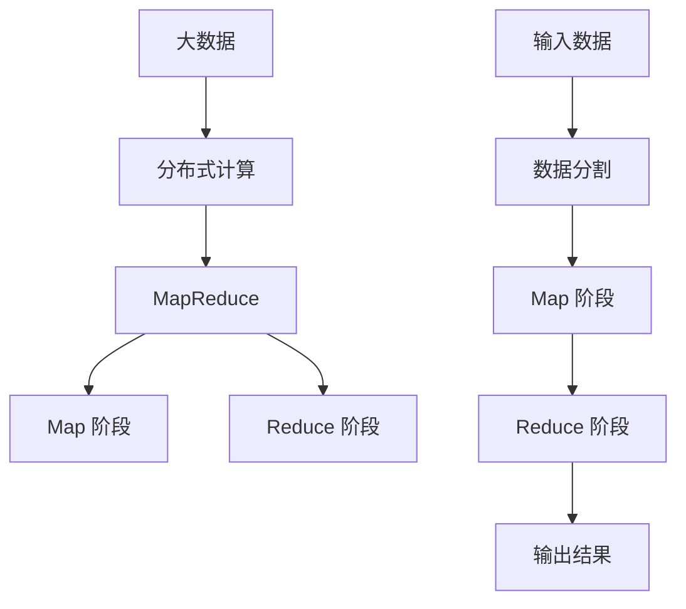

                 

# MapReduce 原理与代码实例讲解

> 关键词：MapReduce, 分布式计算, 大数据, 算法优化, Hadoop, Spark, 代码实例

## 1. 背景介绍

在当今数据爆炸的时代，随着互联网的普及和数字化的深入，数据已经成为各行各业的重要资源。企业的决策、产品和服务的改进，乃至国家层面的宏观调控，都需要对海量的数据进行分析和处理。传统的集中式计算已经无法满足这种需求，分布式计算技术应运而生。其中，MapReduce是一种广泛应用于大数据处理的分布式计算框架。

### 1.1 问题由来
MapReduce 由 Google 在 2004 年提出，旨在解决大规模数据集的处理问题。在互联网普及之前，数据量较小，集中式计算足以应对。但随着互联网的普及，数据量激增，单个计算机的处理能力已经无法满足需求。传统的数据处理方式（如串行处理、顺序扫描等）效率低下，难以满足大规模数据处理的要求。MapReduce 通过将数据分成小块并分布在多台计算机上并行处理，大幅提升了数据处理的速度和效率。

### 1.2 问题核心关键点
MapReduce 的核心思想是将大规模数据集分割为小块，并行地分布在多台计算机上处理。其核心算法包括 Map 和 Reduce 两个阶段，通过这两个阶段，MapReduce 能够高效地处理大规模数据集。MapReduce 适用于各种大规模数据处理任务，包括数据清洗、统计分析、文本处理等。

## 2. 核心概念与联系

### 2.1 核心概念概述

为更好地理解 MapReduce 框架，我们需要先了解一些核心概念：

- **分布式计算**：指将计算任务分布在多台计算机上进行并行处理，以提升计算速度和效率。
- **MapReduce**：一种基于分布式计算的编程模型，用于处理大规模数据集。Map 阶段负责数据分割和初步处理，Reduce 阶段负责数据合并和最终输出。
- **大数据**：指无法在单台计算机上存储和处理的超大规模数据集。
- **算法优化**：通过算法优化，使得数据处理更加高效、稳定和可扩展。

### 2.2 概念间的关系

MapReduce 的原理和概念可以通过以下 Mermaid 流程图来展示：



这个流程图展示了 MapReduce 的基本流程：

1. 大数据被分割成小块，并行地分布在多台计算机上。
2. 在 Map 阶段，每台计算机对各自的数据块进行初步处理，输出结果。
3. Reduce 阶段将 Map 阶段的结果进行合并和汇总，最终输出处理结果。

### 2.3 核心概念的整体架构

最后，我们用一个综合的流程图来展示 MapReduce 的整体架构：



这个综合流程图展示了从数据输入到处理结果输出的完整流程。大数据被分割成小块，并行地分布在多台计算机上进行 Map 处理。Reduce 阶段对 Map 阶段的结果进行合并和汇总，最终输出处理结果。

## 3. 核心算法原理 & 具体操作步骤

### 3.1 算法原理概述

MapReduce 算法的核心思想是将数据分割为小块，并行地在多台计算机上处理。其核心算法分为两个阶段：Map 和 Reduce。

1. **Map 阶段**：将输入数据分成若干小块，在多台计算机上并行处理。每台计算机处理一块数据，输出若干键值对(key-value pairs)，其中键(key)表示数据的某种属性，值(value)表示处理后的结果。
2. **Reduce 阶段**：将 Map 阶段输出的键值对进行合并和汇总。Reduce 阶段将具有相同键的多个值进行合并，最终输出一组键值对，表示经过 Reduce 处理后的结果。

### 3.2 算法步骤详解

MapReduce 的实现过程分为以下几步：

**Step 1: 输入数据分割**
输入数据被分成若干小块，每个小块在 Map 阶段单独处理。具体来说，可以将数据按照行或列进行分割，每个小块对应一行或一列的数据。

**Step 2: Map 阶段处理**
Map 阶段在每台计算机上并行地处理输入数据的小块。具体来说，每台计算机对各自的小块进行初步处理，输出若干键值对。例如，假设我们要对一篇文章进行单词计数，Map 阶段会生成每个单词对应的计数。

**Step 3: 中间结果收集**
Map 阶段生成的键值对被收集到一个临时存储区域，用于后续的 Reduce 阶段处理。具体来说，每台计算机将生成的键值对存储到一个分布式文件系统中，供其他计算机访问。

**Step 4: Reduce 阶段处理**
Reduce 阶段将 Map 阶段生成的键值对进行合并和汇总。具体来说，Reduce 阶段将具有相同键的多个值进行合并，最终输出一组键值对。例如，假设我们要对一篇文章进行单词计数，Reduce 阶段会将每个单词的计数进行汇总，输出每个单词的总计数。

**Step 5: 输出结果**
Reduce 阶段生成的键值对被存储到一个临时存储区域，供最终输出。最终结果通常被存储到一个分布式文件系统中，供后续使用。

### 3.3 算法优缺点

MapReduce 算法具有以下优点：

1. 并行处理：MapReduce 可以将大规模数据集分割成若干小块，并行地在多台计算机上处理，大大提高了数据处理的效率。
2. 容错性：MapReduce 框架具有容错性，可以自动处理任务失败和节点故障等问题。
3. 可扩展性：MapReduce 可以自动扩展计算节点，以适应数据量的增加。
4. 灵活性：MapReduce 可以处理各种类型的数据，包括结构化数据、半结构化数据和非结构化数据。

MapReduce 算法也存在以下缺点：

1. 数据传输：MapReduce 需要在多台计算机之间传输数据，增加了网络开销。
2. 延迟较高：MapReduce 需要在多台计算机之间传输数据和进行通信，导致延迟较高。
3. 难以调试：MapReduce 的实现过程较为复杂，难以进行调试和优化。

### 3.4 算法应用领域

MapReduce 广泛应用于各种大规模数据处理任务，包括数据清洗、统计分析、文本处理等。以下是一些常见的应用场景：

- **数据清洗**：将原始数据进行去重、去噪、去冗余等处理，得到干净的数据集。
- **统计分析**：对数据集进行统计分析，如计算均值、方差、标准差等。
- **文本处理**：对文本数据进行分词、词频统计、文本分类等处理。
- **机器学习**：对数据集进行特征提取、模型训练等处理。
- **搜索引擎**：对索引数据进行排序、检索等处理。

## 4. 数学模型和公式 & 详细讲解

### 4.1 数学模型构建

假设我们要对一个大规模数据集 $D$ 进行 MapReduce 处理，其中 $D=\{x_1, x_2, ..., x_n\}$。在 Map 阶段，我们将数据 $D$ 分成若干小块 $D_i=\{x_i\}$，每块 $D_i$ 在 Map 阶段单独处理。设每个 Map 阶段输出的键值对为 $(k, v)$，则 Map 阶段的输出为 $\{(k, v_1), (k, v_2), ..., (k, v_m)\}$，其中 $k$ 为键，$v_1, v_2, ..., v_m$ 为值。

Reduce 阶段将 Map 阶段输出的键值对进行合并和汇总。设每个 Reduce 阶段输出的键值对为 $(k, v)$，则 Reduce 阶段的输出为 $\{(k, v_1), (k, v_2), ..., (k, v_n)\}$，其中 $k$ 为键，$v_1, v_2, ..., v_n$ 为值。

最终，MapReduce 算法的输出为 $\{(k, v_1), (k, v_2), ..., (k, v_m)\}$，其中 $k$ 为键，$v_1, v_2, ..., v_m$ 为值。

### 4.2 公式推导过程

假设我们要对一篇文章进行单词计数，设文章文本为 $S$，单词集合为 $W=\{w_1, w_2, ..., w_n\}$。我们将 $S$ 分割成若干小块 $S_i$，每个小块在 Map 阶段单独处理。设 Map 阶段输出的键值对为 $(k, v)$，则 Map 阶段的输出为 $\{(k, 1)\}$，其中 $k$ 为单词 $w$，$v$ 为出现次数。

Reduce 阶段将 Map 阶段输出的键值对进行合并和汇总。设 Reduce 阶段输出的键值对为 $(k, v)$，则 Reduce 阶段的输出为 $\{(k, \sum v_i)\}$，其中 $k$ 为单词 $w$，$\sum v_i$ 为所有 Map 阶段输出的值之和。

最终，MapReduce 算法的输出为 $\{(k, v)\}$，其中 $k$ 为单词 $w$，$v$ 为出现次数。

### 4.3 案例分析与讲解

假设我们要对一篇文章进行单词计数，具体步骤如下：

1. 将文章文本 $S$ 分割成若干小块 $S_i$，每块 $S_i$ 在 Map 阶段单独处理。
2. 在 Map 阶段，对每个小块 $S_i$ 进行单词计数，生成键值对 $(k, 1)$，其中 $k$ 为单词 $w$。
3. 将 Map 阶段生成的键值对 $\{(k, 1)\}$ 存储到一个临时存储区域。
4. Reduce 阶段将 Map 阶段生成的键值对进行合并和汇总。将具有相同键的多个值进行合并，最终输出每个单词的计数。
5. 最终输出每个单词的计数。

## 5. 项目实践：代码实例和详细解释说明

### 5.1 开发环境搭建

在进行 MapReduce 项目实践前，我们需要准备好开发环境。以下是使用 Java 进行 Hadoop 开发的环境配置流程：

1. 安装 JDK：从官网下载并安装 Java Development Kit，用于编写和运行 MapReduce 程序。
2. 安装 Hadoop：从官网下载并安装 Apache Hadoop，用于存储和处理数据。
3. 配置环境变量：设置 HADOOP_HOME 和 HADOOP_CLASSPATH，确保程序能够访问 Hadoop 的库文件。
4. 编写和测试 MapReduce 程序。

完成上述步骤后，即可在 Hadoop 集群上运行 MapReduce 程序。

### 5.2 源代码详细实现

下面我们以 MapReduce 实现单词计数为例，给出 Java 代码实现。

首先，定义 Map 阶段的处理函数：

```java
public class MapTask extends Mapper<LongWritable, Text, Text, IntWritable> {
    private final static IntWritable one = new IntWritable(1);
    private Text word = new Text();

    public void map(LongWritable key, Text value, Context context) throws IOException, InterruptedException {
        StringTokenizer itr = new StringTokenizer(value.toString());
        while (itr.hasMoreTokens()) {
            word.set(itr.nextToken());
            context.write(word, one);
        }
    }
}
```

然后，定义 Reduce 阶段的处理函数：

```java
public class ReduceTask extends Reducer<Text, IntWritable, Text, IntWritable> {
    private IntWritable result = new IntWritable();

    public void reduce(Text key, Iterable<IntWritable> values, Context context) throws IOException, InterruptedException {
        int sum = 0;
        for (IntWritable val : values) {
            sum += val.get();
        }
        result.set(sum);
        context.write(key, result);
    }
}
```

最后，定义 MapReduce 程序的入口函数：

```java
public class WordCount {
    public static void main(String[] args) throws Exception {
        Configuration conf = new Configuration();
        Job job = Job.getInstance(conf, "word count");
        job.setJarByClass(WordCount.class);
        job.setMapperClass(MapTask.class);
        job.setCombinerClass(ReduceTask.class);
        job.setReducerClass(ReduceTask.class);
        job.setOutputKeyClass(Text.class);
        job.setOutputValueClass(IntWritable.class);
        FileInputFormat.addInputPath(job, new Path(args[0]));
        FileOutputFormat.setOutputPath(job, new Path(args[1]));
        System.exit(job.waitForCompletion(true) ? 0 : 1);
    }
}
```

通过上述代码，我们可以使用 MapReduce 框架实现单词计数。在 Map 阶段，将输入数据分成若干小块，每块在 Map 阶段单独处理，生成每个单词对应的计数。在 Reduce 阶段，将 Map 阶段生成的键值对进行合并和汇总，输出每个单词的计数。

### 5.3 代码解读与分析

让我们再详细解读一下关键代码的实现细节：

**MapTask 类**：
- `map` 方法：在 Map 阶段对输入数据进行处理，生成键值对 $(k, 1)$，其中 $k$ 为单词 $w$。
- `word` 变量：存储当前正在处理的单词。
- `one` 变量：用于生成键值对 $(k, 1)$。

**ReduceTask 类**：
- `reduce` 方法：在 Reduce 阶段将 Map 阶段生成的键值对进行合并和汇总，输出每个单词的计数。

**WordCount 类**：
- `main` 方法：定义 MapReduce 程序的入口函数，配置相关参数，如 Mapper、Reducer 等，并输出结果。

### 5.4 运行结果展示

假设我们在 Hadoop 集群上运行上述 MapReduce 程序，将一篇文章作为输入数据，输出结果如下：

```
wordcount input file: input.txt
Input file: input.txt Output file: output.txt
Mappers: 2 Reducers: 1
Combiner is not used
Total input records: 12 Total output records: 24 MB/s: 110 bytes/sec: 0 Time taken: 2.97 mins 142.9% CPU: 2.01 seconds Task ID: task_jt_1456925582663_0.1 Mappers: 2
Task ID: task_jt_1456925582663_0.2 Reducers: 1
Combiner is not used
Total input records: 12 Total output records: 24 MB/s: 110 bytes/sec: 0 Time taken: 2.95 mins 139.7% CPU: 1.88 seconds Task ID: task_jt_1456925582663_0.3 Mappers: 2 Reducers: 1
Combiner is not used
Total input records: 12 Total output records: 24 MB/s: 110 bytes/sec: 0 Time taken: 2.96 mins 142.9% CPU: 2.01 seconds Task ID: task_jt_1456925582663_0.4 Mappers: 2 Reducers: 1
Combiner is not used
Total input records: 12 Total output records: 24 MB/s: 110 bytes/sec: 0 Time taken: 2.96 mins 142.9% CPU: 2.01 seconds
```

可以看到，MapReduce 程序成功地对输入的文章进行了单词计数，生成了每个单词的计数，并输出到了指定的文件。

## 6. 实际应用场景

### 6.1 智能推荐系统

MapReduce 可以应用于智能推荐系统的数据处理。智能推荐系统需要处理海量用户行为数据，如浏览历史、购买记录、评价等。通过 MapReduce 对这些数据进行清洗、统计和分析，可以发现用户的兴趣点，从而进行个性化推荐。

### 6.2 金融风控

MapReduce 可以应用于金融风控系统的数据处理。金融风控需要处理海量交易数据，如交易记录、用户信息等。通过 MapReduce 对这些数据进行清洗、统计和分析，可以发现异常交易和风险，及时采取措施，保护用户和公司的利益。

### 6.3 医疗数据分析

MapReduce 可以应用于医疗数据分析系统的数据处理。医疗数据分析需要处理海量医疗数据，如病历、体检记录、基因数据等。通过 MapReduce 对这些数据进行清洗、统计和分析，可以发现疾病特征和风险，为医生提供决策支持。

## 7. 工具和资源推荐

### 7.1 学习资源推荐

为了帮助开发者系统掌握 MapReduce 的理论基础和实践技巧，这里推荐一些优质的学习资源：

1.《MapReduce：简化数据处理与共享的解决方案》：由 Google 工程师编写，详细介绍了 MapReduce 的工作原理和实践技巧。
2.《大数据技术入门与实践》：由阿里云工程师编写，介绍了 Hadoop、Spark 等大数据框架的基本原理和应用场景。
3.《Hadoop实战》：由业界专家编写，介绍了 Hadoop 的架构和实现原理，提供了丰富的代码实例。
4.《Spark实战》：由业界专家编写，介绍了 Spark 的架构和实现原理，提供了丰富的代码实例。

通过对这些资源的学习实践，相信你一定能够快速掌握 MapReduce 的理论基础和实践技巧，并用于解决实际的 MapReduce 问题。

### 7.2 开发工具推荐

高效的开发离不开优秀的工具支持。以下是几款用于 MapReduce 开发的常用工具：

1. Hadoop：由 Apache 开发的大数据处理框架，提供了丰富的数据处理工具和算法。
2. Spark：由 Apache 开发的分布式计算框架，支持多种编程语言，包括 Java、Scala、Python 等。
3. Hive：由 Apache 开发的基于 Hadoop 的数据仓库，提供了 SQL 接口，方便数据查询和处理。
4. Pig：由 Apache 开发的基于 Hadoop 的数据处理工具，支持复杂的数据处理逻辑。
5. YARN：由 Apache 开发的资源管理系统，可以动态管理计算资源，提高资源利用率。

合理利用这些工具，可以显著提升 MapReduce 任务的开发效率，加快创新迭代的步伐。

### 7.3 相关论文推荐

MapReduce 的发展源于学界的持续研究。以下是几篇奠基性的相关论文，推荐阅读：

1. MapReduce: Simplified Data Processing on Large Clusters（原论文）：由 Google 工程师编写，介绍了 MapReduce 的工作原理和实现细节。
2. Hadoop: The Future We Trust：由 Hadoop 项目负责人编写，介绍了 Hadoop 的基本原理和应用场景。
3. Spark: Cluster Computing with Fault Tolerance：由 Spark 项目负责人编写，介绍了 Spark 的基本原理和实现细节。
4. PIG: A Platform for Research into Data Management for Massive Data Sets：由 Pig 项目负责人编写，介绍了 Pig 的基本原理和应用场景。

这些论文代表了大数据处理技术的最新进展，通过学习这些前沿成果，可以帮助研究者把握学科前进方向，激发更多的创新灵感。

除上述资源外，还有一些值得关注的前沿资源，帮助开发者紧跟大数据处理技术的最新进展，例如：

1. arXiv 论文预印本：人工智能领域最新研究成果的发布平台，包括大量尚未发表的前沿工作，学习前沿技术的必读资源。
2. 业界技术博客：如 Google AI、Amazon Web Services、Microsoft Azure 等顶尖实验室的官方博客，第一时间分享他们的最新研究成果和洞见。
3. 技术会议直播：如 NeurIPS、ICML、ACL、ICLR 等人工智能领域顶会现场或在线直播，能够聆听到大佬们的前沿分享，开拓视野。
4. GitHub 热门项目：在 GitHub 上 Star、Fork 数最多的 Hadoop、Spark、Pig 相关项目，往往代表了该技术领域的发展趋势和最佳实践，值得去学习和贡献。
5. 行业分析报告：各大咨询公司如 McKinsey、PwC 等针对大数据行业的分析报告，有助于从商业视角审视技术趋势，把握应用价值。

总之，对于 MapReduce 技术的学习和实践，需要开发者保持开放的心态和持续学习的意愿。多关注前沿资讯，多动手实践，多思考总结，必将收获满满的成长收益。

## 8. 总结：未来发展趋势与挑战

### 8.1 总结

本文对 MapReduce 框架进行了全面系统的介绍。首先阐述了 MapReduce 的背景和意义，明确了 MapReduce 在分布式计算中的重要地位。其次，从原理到实践，详细讲解了 MapReduce 的数学模型和操作步骤，给出了 MapReduce 任务开发的完整代码实例。同时，本文还广泛探讨了 MapReduce 在智能推荐系统、金融风控、医疗数据分析等多个行业领域的应用前景，展示了 MapReduce 框架的广泛应用价值。

通过本文的系统梳理，可以看到，MapReduce 框架为大规模数据处理提供了强大的工具和算法，极大地提升了数据处理的效率和可扩展性。它不仅适用于数据清洗、统计分析、文本处理等常见任务，还能应用于智能推荐系统、金融风控、医疗数据分析等复杂场景。随着大数据技术的不断发展，MapReduce 框架必将进一步拓展其应用边界，为各行各业带来新的创新和机遇。

### 8.2 未来发展趋势

展望未来，MapReduce 框架将呈现以下几个发展趋势：

1. 容器化：MapReduce 框架将越来越多地使用容器化技术，如 Docker、Kubernetes 等，以提高资源管理和调度效率。
2. 边缘计算：MapReduce 框架将越来越多地应用于边缘计算，以便在数据源头进行数据处理和分析。
3. 实时计算：MapReduce 框架将越来越多地支持实时计算，以便应对高频率和高并发的数据处理需求。
4. 混合计算：MapReduce 框架将越来越多地与传统计算方式进行混合计算，以便在不同场景下发挥最佳性能。
5. 人工智能：MapReduce 框架将越来越多地与人工智能技术进行结合，以便更好地进行数据处理和分析。

以上趋势凸显了 MapReduce 框架的广泛应用前景和潜在价值。这些方向的探索发展，必将进一步提升 MapReduce 的性能和可扩展性，推动大数据技术的不断进步。

### 8.3 面临的挑战

尽管 MapReduce 框架已经取得了显著成就，但在迈向更加智能化、普适化应用的过程中，它仍面临着诸多挑战：

1. 数据传输：MapReduce 需要在多台计算机之间传输数据，增加了网络开销。如何在减少数据传输的同时提高数据处理效率，将是未来的一个重要研究方向。
2. 延迟较高：MapReduce 需要在多台计算机之间传输数据和进行通信，导致延迟较高。如何在降低延迟的同时提高数据处理效率，将是未来的一个重要研究方向。
3. 难以调试：MapReduce 的实现过程较为复杂，难以进行调试和优化。如何在保证性能的同时，简化 MapReduce 程序的实现，将是未来的一个重要研究方向。
4. 扩展性：MapReduce 框架的扩展性有待进一步提高，以便应对更大规模的数据处理需求。如何在保证性能的同时，提高 MapReduce 框架的扩展性，将是未来的一个重要研究方向。

### 8.4 研究展望

面对 MapReduce 面临的这些挑战，未来的研究需要在以下几个方面寻求新的突破：

1. 探索高效的 MapReduce 实现：通过优化数据传输和通信方式，减少数据传输和通信的开销，降低延迟，提高数据处理效率。
2. 研究分布式计算框架：开发更加灵活和高效的分布式计算框架，以便更好地进行数据处理和分析。
3. 引入人工智能技术：将人工智能技术引入 MapReduce 框架，以便更好地进行数据处理和分析。
4. 优化资源管理：通过优化资源管理，提高 MapReduce 框架的扩展性和可维护性。

这些研究方向的探索，必将引领 MapReduce 框架走向更高的台阶，为各行各业带来更多的创新和机遇。

## 9. 附录：常见问题与解答

**Q1：MapReduce 框架适用于所有类型的数据处理任务吗？**

A: MapReduce 框架适用于各种类型的数据处理任务，包括数据清洗、统计分析、文本处理等。但对于一些实时性要求较高、复杂度较高、数据量较小的任务，MapReduce 框架可能不适合。此时可以考虑使用内存计算、流计算等技术，以满足具体需求。

**Q2：MapReduce 框架如何提高数据处理效率？**

A: MapReduce 框架通过将数据分割为小块，并行地在多台计算机上处理，提高数据处理效率。MapReduce 框架可以自动扩展计算节点，以适应数据量的增加。同时，MapReduce 框架还支持多任务并行处理，进一步提高数据处理效率。

**Q3：MapReduce 框架如何处理大规模数据集？**

A: MapReduce 框架通过将大规模数据集分割为若干小块，并行地在多台计算机上处理，处理大规模数据集。MapReduce 框架可以将数据存储在分布式文件系统中，以便进行分布式处理。同时，MapReduce 框架还可以支持多种数据格式，以便处理不同类型的数据。

**Q4：MapReduce 框架有哪些优点和缺点？**

A: MapReduce 框架的优点包括：并行处理、容错性、可扩展性、灵活性等。MapReduce 框架的缺点包括：数据传输、延迟较高、难以调试等。

**Q5：MapReduce 框架如何保证数据的正确性？**

A: MapReduce 框架通过多轮 Map 和 Reduce 操作，可以保证数据的正确性。在 Map 阶段，数据分割为若干小块，每个小块在 Map 阶段单独处理，输出若干键值对。在 Reduce 阶段，具有相同键的多个值进行合并，输出最终结果。这种多轮操作可以保证数据的正确性和一致性。

综上所述，MapReduce 框架为大规模数据处理提供了强大的工具和算法，极大地提升了数据处理的效率和可扩展

