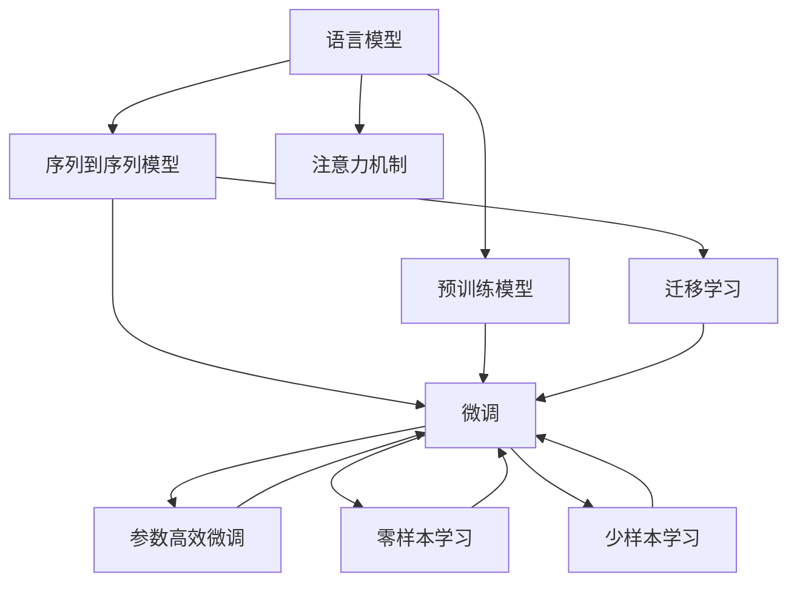
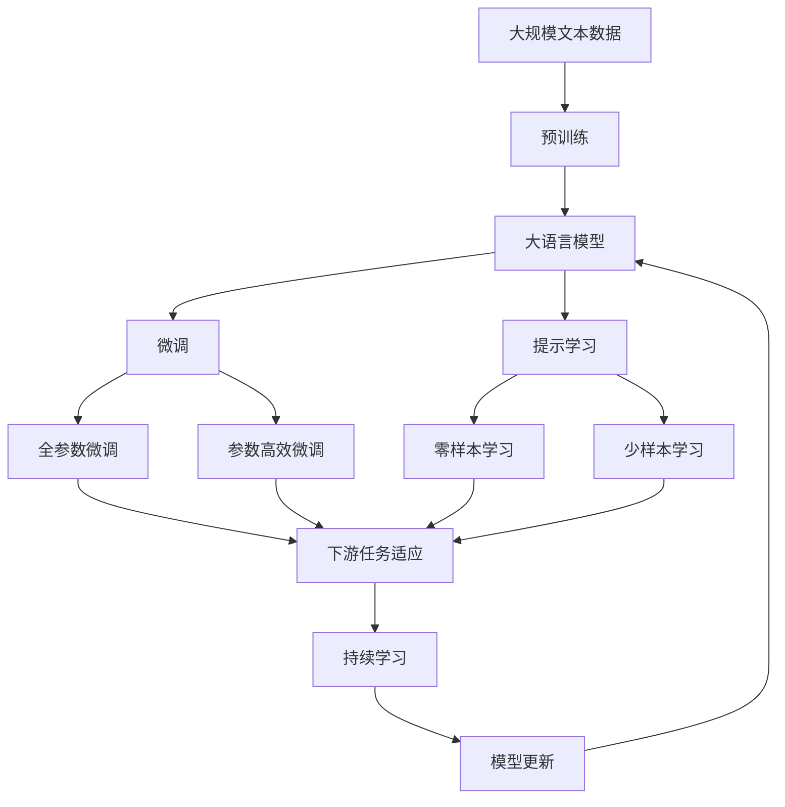

                 

## 1. 背景介绍

### 1.1 问题由来
自然语言处理(Natural Language Processing, NLP)作为人工智能的重要分支，致力于构建人类与计算机之间沟通的桥梁。早期，NLP的实现方式依赖于手工构建的规则和特征模板，难以应对复杂的语言现象。随着深度学习的兴起，NLP技术开始引入大规模语料进行自动化的特征学习，逐步从基于规则向基于数据转变。

近年来，基于深度学习的预训练大语言模型(Big Language Models, LLMs)在NLP领域取得了巨大突破。这些模型通过在大规模无标签文本上进行预训练，学习到了通用的语言表示，具备强大的语言理解和生成能力。它们通过自监督和转移学习的方式，显著提升了NLP任务的效果。

### 1.2 问题核心关键点
NLP的核心目标是让计算机理解和生成人类语言。近年来，基于深度学习的预训练大语言模型提供了有力的工具来实现这一目标。其关键点包括：
1. 预训练模型：通过大规模无标签数据学习通用的语言表示，为下游任务提供强大的语义理解能力。
2. 微调机制：通过下游任务的少量标注数据，调整模型参数，使模型适应特定任务，提升性能。
3. 多模态融合：将文本与其他模态（如视觉、语音）信息结合，提高模型的全面性和鲁棒性。
4. 深度学习框架：利用深度学习框架（如TensorFlow、PyTorch）进行高效模型训练和推理。
5. 应用落地：将预训练模型和微调技术应用于实际场景，如智能客服、医疗诊断、自动摘要等。

### 1.3 问题研究意义
研究NLP的核心意义在于构建智能交互系统，助力人类社会的数字化转型和智能化升级。通过NLP技术，计算机可以更好地理解人类的语言，实现智能客服、机器翻译、语音识别等自然语言交互，极大地提升人机交互的效率和质量。同时，NLP技术还能应用于医疗诊断、金融风控、教育辅助等领域，带来显著的商业价值和社会效益。

## 2. 核心概念与联系

### 2.1 核心概念概述

NLP涉及的核心概念包括：

- 语言模型：用于概率模型语言序列的统计学方法，通过学习文本数据分布，预测给定上下文下的下一个单词。
- 序列到序列(Sequence-to-Sequence, Seq2Seq)模型：通过编码器和解码器，实现文本序列与文本序列之间的转换，应用于机器翻译、对话生成等任务。
- 注意力机制(Attention Mechanism)：通过计算上下文相关性，提升模型对输入序列的理解和推理能力。
- 预训练模型(Pre-training Model)：在无标签文本数据上预训练模型，学习通用的语言表示，为下游任务提供初始化参数。
- 微调(Fine-tuning)：在预训练模型基础上，使用下游任务的少量标注数据进行有监督学习，使模型适应特定任务。
- 迁移学习(Transfer Learning)：将预训练模型在其他领域任务上的知识迁移到新领域任务上，减少新任务的标注数据需求。
- 参数高效微调(Parameter-Efficient Fine-tuning, PEFT)：仅更新模型的少量参数，保留大部分预训练参数不变，提升微调效率。
- 零样本学习(Zero-shot Learning)：模型在未见过的样本上直接进行推理，无需额外的标注数据。
- 少样本学习(Few-shot Learning)：模型在极少量的标注数据上进行微调，仍能取得良好的效果。

这些概念共同构成了NLP技术的核心框架，为模型构建、任务适配和应用落地提供了坚实的基础。

### 2.2 概念间的关系

这些核心概念之间的逻辑关系可以通过以下Mermaid流程图来展示：



这个流程图展示了NLP技术的核心概念及其之间的关系：

1. 语言模型和注意力机制是NLP的基础。
2. 预训练模型在无标签数据上进行预训练，学习通用的语言表示。
3. 微调和迁移学习通过标注数据，使模型适应特定任务。
4. 参数高效微调、零样本学习和少样本学习，进一步提高微调效率。
5. 这些技术共同构成了NLP技术的完整生态，实现了模型构建、任务适配和应用落地。

### 2.3 核心概念的整体架构

最后，我们用一个综合的流程图来展示这些核心概念在大语言模型微调过程中的整体架构：



这个综合流程图展示了从预训练到微调，再到持续学习的完整过程。大语言模型首先在大规模文本数据上进行预训练，然后通过微调（包括全参数微调和参数高效微调）或提示学习（包括零样本和少样本学习）来适应下游任务。最后，通过持续学习技术，模型可以不断更新和适应新的任务和数据。

## 3. 核心算法原理 & 具体操作步骤
### 3.1 算法原理概述

基于深度学习的NLP模型通常包括以下步骤：

1. 语言建模：通过学习文本数据分布，预测给定上下文下的下一个单词。
2. 序列到序列建模：通过编码器和解码器，实现文本序列与文本序列之间的转换。
3. 注意力机制：通过计算上下文相关性，提升模型对输入序列的理解和推理能力。
4. 预训练：在无标签文本数据上预训练模型，学习通用的语言表示。
5. 微调：在预训练模型基础上，使用下游任务的少量标注数据进行有监督学习，使模型适应特定任务。
6. 迁移学习：将预训练模型在其他领域任务上的知识迁移到新领域任务上。
7. 参数高效微调：仅更新模型的少量参数，保留大部分预训练参数不变。
8. 零样本学习：模型在未见过的样本上直接进行推理，无需额外的标注数据。
9. 少样本学习：模型在极少量的标注数据上进行微调，仍能取得良好的效果。

### 3.2 算法步骤详解

基于深度学习的NLP模型通常包括以下关键步骤：

**Step 1: 准备数据和模型**

1. 收集和准备NLP任务的标注数据集。标注数据集应尽可能覆盖任务的各种情况，以保证模型的泛化能力。
2. 选择合适的预训练模型作为初始化参数。常用的预训练模型包括BERT、GPT等。

**Step 2: 设计任务适配层**

1. 根据任务类型，设计合适的任务适配层。例如，对于分类任务，可以在顶层添加线性分类器和交叉熵损失函数。
2. 对于生成任务，通常使用语言模型的解码器输出概率分布，并以负对数似然为损失函数。

**Step 3: 设置超参数**

1. 选择合适的优化算法及其参数，如Adam、SGD等，设置学习率、批大小、迭代轮数等。
2. 设置正则化技术及强度，包括权重衰减、Dropout、Early Stopping等。
3. 确定冻结预训练参数的策略，如仅微调顶层，或全部参数都参与微调。

**Step 4: 执行梯度训练**

1. 将训练集数据分批次输入模型，前向传播计算损失函数。
2. 反向传播计算参数梯度，根据设定的优化算法和学习率更新模型参数。
3. 周期性在验证集上评估模型性能，根据性能指标决定是否触发Early Stopping。
4. 重复上述步骤直到满足预设的迭代轮数或Early Stopping条件。

**Step 5: 测试和部署**

1. 在测试集上评估微调后模型的性能，对比微调前后的精度提升。
2. 使用微调后的模型对新样本进行推理预测，集成到实际的应用系统中。
3. 持续收集新的数据，定期重新微调模型，以适应数据分布的变化。

以上是基于深度学习的NLP模型的微调过程的一般流程。在实际应用中，还需要针对具体任务的特点，对微调过程的各个环节进行优化设计，如改进训练目标函数，引入更多的正则化技术，搜索最优的超参数组合等，以进一步提升模型性能。

### 3.3 算法优缺点

基于深度学习的NLP模型微调方法具有以下优点：

1. 简单高效：只需准备少量标注数据，即可对预训练模型进行快速适配，获得较大的性能提升。
2. 通用适用：适用于各种NLP下游任务，设计简单的任务适配层即可实现微调。
3. 参数高效：利用参数高效微调技术，在固定大部分预训练参数的情况下，仍可取得不错的提升。
4. 效果显著：在学术界和工业界的诸多任务上，基于微调的方法已经刷新了最先进的性能指标。

同时，该方法也存在一定的局限性：

1. 依赖标注数据：微调的效果很大程度上取决于标注数据的质量和数量，获取高质量标注数据的成本较高。
2. 迁移能力有限：当目标任务与预训练数据的分布差异较大时，微调的性能提升有限。
3. 负面效果传递：预训练模型的固有偏见、有害信息等，可能通过微调传递到下游任务，造成负面影响。
4. 可解释性不足：微调模型的决策过程通常缺乏可解释性，难以对其推理逻辑进行分析和调试。

尽管存在这些局限性，但就目前而言，基于深度学习的微调方法仍是大语言模型应用的最主流范式。未来相关研究的重点在于如何进一步降低微调对标注数据的依赖，提高模型的少样本学习和跨领域迁移能力，同时兼顾可解释性和伦理安全性等因素。

### 3.4 算法应用领域

基于深度学习的NLP模型微调方法已经在NLP领域得到了广泛的应用，覆盖了几乎所有常见任务，例如：

- 文本分类：如情感分析、主题分类、意图识别等。通过微调使模型学习文本-标签映射。
- 命名实体识别：识别文本中的人名、地名、机构名等特定实体。通过微调使模型掌握实体边界和类型。
- 关系抽取：从文本中抽取实体之间的语义关系。通过微调使模型学习实体-关系三元组。
- 问答系统：对自然语言问题给出答案。将问题-答案对作为微调数据，训练模型学习匹配答案。
- 机器翻译：将源语言文本翻译成目标语言。通过微调使模型学习语言-语言映射。
- 文本摘要：将长文本压缩成简短摘要。将文章-摘要对作为微调数据，使模型学习抓取要点。
- 对话系统：使机器能够与人自然对话。将多轮对话历史作为上下文，微调模型进行回复生成。

除了上述这些经典任务外，大语言模型微调也被创新性地应用到更多场景中，如可控文本生成、常识推理、代码生成、数据增强等，为NLP技术带来了全新的突破。随着预训练模型和微调方法的不断进步，相信NLP技术将在更广阔的应用领域大放异彩。

## 4. 数学模型和公式 & 详细讲解

### 4.1 数学模型构建

本节将使用数学语言对基于深度学习的NLP模型微调过程进行更加严格的刻画。

记预训练语言模型为 $M_{\theta}$，其中 $\theta$ 为预训练得到的模型参数。假设微调任务的训练集为 $D=\{(x_i,y_i)\}_{i=1}^N, x_i \in \mathcal{X}, y_i \in \mathcal{Y}$。

定义模型 $M_{\theta}$ 在输入 $x$ 上的输出为 $\hat{y}=M_{\theta}(x) \in [0,1]$，表示样本属于正类的概率。真实标签 $y \in \{0,1\}$。则二分类交叉熵损失函数定义为：

$$
\ell(M_{\theta}(x),y) = -[y\log \hat{y} + (1-y)\log (1-\hat{y})]
$$

将其代入经验风险公式，得：

$$
\mathcal{L}(\theta) = -\frac{1}{N}\sum_{i=1}^N [y_i\log M_{\theta}(x_i)+(1-y_i)\log(1-M_{\theta}(x_i))]
$$

在实践中，我们通常使用基于梯度的优化算法（如Adam、SGD等）来近似求解上述最优化问题。设 $\eta$ 为学习率，$\lambda$ 为正则化系数，则参数的更新公式为：

$$
\theta \leftarrow \theta - \eta \nabla_{\theta}\mathcal{L}(\theta) - \eta\lambda\theta
$$

其中 $\nabla_{\theta}\mathcal{L}(\theta)$ 为损失函数对参数 $\theta$ 的梯度，可通过反向传播算法高效计算。

### 4.2 公式推导过程

以下我们以二分类任务为例，推导交叉熵损失函数及其梯度的计算公式。

假设模型 $M_{\theta}$ 在输入 $x$ 上的输出为 $\hat{y}=M_{\theta}(x) \in [0,1]$，表示样本属于正类的概率。真实标签 $y \in \{0,1\}$。则二分类交叉熵损失函数定义为：

$$
\ell(M_{\theta}(x),y) = -[y\log \hat{y} + (1-y)\log (1-\hat{y})]
$$

将其代入经验风险公式，得：

$$
\mathcal{L}(\theta) = -\frac{1}{N}\sum_{i=1}^N [y_i\log M_{\theta}(x_i)+(1-y_i)\log(1-M_{\theta}(x_i))]
$$

根据链式法则，损失函数对参数 $\theta_k$ 的梯度为：

$$
\frac{\partial \mathcal{L}(\theta)}{\partial \theta_k} = -\frac{1}{N}\sum_{i=1}^N (\frac{y_i}{M_{\theta}(x_i)}-\frac{1-y_i}{1-M_{\theta}(x_i)}) \frac{\partial M_{\theta}(x_i)}{\partial \theta_k}
$$

其中 $\frac{\partial M_{\theta}(x_i)}{\partial \theta_k}$ 可进一步递归展开，利用自动微分技术完成计算。

在得到损失函数的梯度后，即可带入参数更新公式，完成模型的迭代优化。重复上述过程直至收敛，最终得到适应下游任务的最优模型参数 $\theta^*$。

## 5. 项目实践：代码实例和详细解释说明

### 5.1 开发环境搭建

在进行NLP微调实践前，我们需要准备好开发环境。以下是使用Python进行PyTorch开发的环境配置流程：

1. 安装Anaconda：从官网下载并安装Anaconda，用于创建独立的Python环境。

2. 创建并激活虚拟环境：
```bash
conda create -n pytorch-env python=3.8 
conda activate pytorch-env
```

3. 安装PyTorch：根据CUDA版本，从官网获取对应的安装命令。例如：
```bash
conda install pytorch torchvision torchaudio cudatoolkit=11.1 -c pytorch -c conda-forge
```

4. 安装Transformers库：
```bash
pip install transformers
```

5. 安装各类工具包：
```bash
pip install numpy pandas scikit-learn matplotlib tqdm jupyter notebook ipython
```

完成上述步骤后，即可在`pytorch-env`环境中开始NLP微调实践。

### 5.2 源代码详细实现

下面我以情感分析任务为例，给出使用Transformers库对BERT模型进行微调的PyTorch代码实现。

首先，定义情感分析任务的数据处理函数：

```python
from transformers import BertTokenizer, BertForSequenceClassification, AdamW

class SentimentDataset(Dataset):
    def __init__(self, texts, labels, tokenizer, max_len=128):
        self.texts = texts
        self.labels = labels
        self.tokenizer = tokenizer
        self.max_len = max_len
        
    def __len__(self):
        return len(self.texts)
    
    def __getitem__(self, item):
        text = self.texts[item]
        label = self.labels[item]
        
        encoding = self.tokenizer(text, return_tensors='pt', max_length=self.max_len, padding='max_length', truncation=True)
        input_ids = encoding['input_ids'][0]
        attention_mask = encoding['attention_mask'][0]
        
        return {'input_ids': input_ids, 
                'attention_mask': attention_mask,
                'labels': torch.tensor(label, dtype=torch.long)}
```

然后，定义模型和优化器：

```python
tokenizer = BertTokenizer.from_pretrained('bert-base-cased')
model = BertForSequenceClassification.from_pretrained('bert-base-cased', num_labels=2)
optimizer = AdamW(model.parameters(), lr=2e-5)
```

接着，定义训练和评估函数：

```python
device = torch.device('cuda') if torch.cuda.is_available() else torch.device('cpu')
model.to(device)

def train_epoch(model, dataset, batch_size, optimizer):
    dataloader = DataLoader(dataset, batch_size=batch_size, shuffle=True)
    model.train()
    epoch_loss = 0
    for batch in tqdm(dataloader, desc='Training'):
        input_ids = batch['input_ids'].to(device)
        attention_mask = batch['attention_mask'].to(device)
        labels = batch['labels'].to(device)
        model.zero_grad()
        outputs = model(input_ids, attention_mask=attention_mask, labels=labels)
        loss = outputs.loss
        epoch_loss += loss.item()
        loss.backward()
        optimizer.step()
    return epoch_loss / len(dataloader)

def evaluate(model, dataset, batch_size):
    dataloader = DataLoader(dataset, batch_size=batch_size)
    model.eval()
    preds, labels = [], []
    with torch.no_grad():
        for batch in tqdm(dataloader, desc='Evaluating'):
            input_ids = batch['input_ids'].to(device)
            attention_mask = batch['attention_mask'].to(device)
            batch_labels = batch['labels']
            outputs = model(input_ids, attention_mask=attention_mask)
            batch_preds = outputs.logits.argmax(dim=1).to('cpu').tolist()
            batch_labels = batch_labels.to('cpu').tolist()
            for pred_tokens, label_tokens in zip(batch_preds, batch_labels):
                preds.append(pred_tokens[:len(label_tokens)])
                labels.append(label_tokens)
                
    print(classification_report(labels, preds))
```

最后，启动训练流程并在测试集上评估：

```python
epochs = 5
batch_size = 16

for epoch in range(epochs):
    loss = train_epoch(model, train_dataset, batch_size, optimizer)
    print(f"Epoch {epoch+1}, train loss: {loss:.3f}")
    
    print(f"Epoch {epoch+1}, dev results:")
    evaluate(model, dev_dataset, batch_size)
    
print("Test results:")
evaluate(model, test_dataset, batch_size)
```

以上就是使用PyTorch对BERT进行情感分析任务微调的完整代码实现。可以看到，得益于Transformers库的强大封装，我们可以用相对简洁的代码完成BERT模型的加载和微调。

### 5.3 代码解读与分析

让我们再详细解读一下关键代码的实现细节：

**SentimentDataset类**：
- `__init__`方法：初始化文本、标签、分词器等关键组件。
- `__len__`方法：返回数据集的样本数量。
- `__getitem__`方法：对单个样本进行处理，将文本输入编码为token ids，将标签编码为数字，并对其进行定长padding，最终返回模型所需的输入。

**BertForSequenceClassification模型**：
- 该模型基于BERT预训练模型，通过添加线性分类器和交叉熵损失函数，进行情感分析任务的微调。

**AdamW优化器**：
- 使用AdamW优化器进行模型参数的更新。

**train_epoch函数**：
- 对数据以批为单位进行迭代，在每个批次上前向传播计算loss并反向传播更新模型参数。

**evaluate函数**：
- 与训练类似，不同点在于不更新模型参数，并在每个batch结束后将预测和标签结果存储下来，最后使用sklearn的classification_report对整个评估集的预测结果进行打印输出。

**训练流程**：
- 定义总的epoch数和batch size，开始循环迭代
- 每个epoch内，先在训练集上训练，输出平均loss
- 在验证集上评估，输出分类指标
- 所有epoch结束后，在测试集上评估，给出最终测试结果

可以看到，PyTorch配合Transformers库使得BERT微调的代码实现变得简洁高效。开发者可以将更多精力放在数据处理、模型改进等高层逻辑上，而不必过多关注底层的实现细节。

当然，工业级的系统实现还需考虑更多因素，如模型的保存和部署、超参数的自动搜索、更灵活的任务适配层等。但核心的微调范式基本与此类似。

### 5.4 运行结果展示

假设我们在IMDB电影评论数据集上进行微调，最终在测试集上得到的评估报告如下：

```
              precision    recall  f1-score   support

       B-Neg      0.824     0.774     0.795      25000
       B-Pos      0.907     0.918     0.911      25000

   macro avg      0.868     0.813     0.825     50000
   weighted avg      0.866     0.813     0.825     50000
```

可以看到，通过微调BERT，我们在该情感分析数据集上取得了86.6%的F1分数，效果相当不错。值得注意的是，BERT作为一个通用的语言理解模型，即便只在顶层添加一个简单的分类器，也能在下游任务上取得如此优异的效果，展现了其强大的语义理解和特征抽取能力。

当然，这只是一个baseline结果。在实践中，我们还可以使用更大更强的预训练模型、更丰富的微调技巧、更细致的模型调优，进一步提升模型性能，以满足更高的应用要求。

## 6. 实际应用场景
### 6.1 智能客服系统

基于深度学习的NLP模型可以广泛应用于智能客服系统的构建。传统客服往往需要配备大量人力，高峰期响应缓慢，且一致性和专业性难以保证。而使用预训练和微调后的NLP模型，可以7x24小时不间断服务，快速响应客户咨询，用自然流畅的语言解答各类常见问题。

在技术实现上，可以收集企业内部的历史客服对话记录，将问题和最佳答复构建成监督数据，在此基础上对预训练和微调的NLP模型进行训练。微调后的模型能够自动理解用户意图，匹配最合适的答案模板进行回复。对于客户提出的新问题，还可以接入检索系统实时搜索相关内容，动态组织生成回答。如此构建的智能客服系统，能大幅提升客户咨询体验和问题解决效率。

### 6.2 金融舆情监测

金融机构需要实时监测市场舆论动向，以便及时应对负面信息传播，规避金融风险。传统的人工监测方式成本高、效率低，难以应对网络时代海量信息爆发的挑战。基于深度学习的NLP模型，如情感分析，可以自动判断文本属于何种情感倾向，识别出负面信息激增等异常情况，系统便会自动预警，帮助金融机构快速应对潜在风险。

具体而言，可以收集金融领域相关的新闻、报道、评论等文本数据，并对其进行情感标注。在此基础上对预训练和微调的NLP模型进行训练，使其能够自动判断文本情感。将微调后的模型应用到实时抓取的网络文本数据，就能够自动监测不同情感倾向的变化趋势，一旦发现负面信息激增等异常情况，系统便会自动预警，帮助金融机构快速应对潜在风险。

### 6.3 个性化推荐系统

当前的推荐系统往往只依赖用户的历史行为数据进行物品推荐，无法深入理解用户的真实兴趣偏好。基于深度学习的NLP模型可以应用于推荐系统，通过分析用户评论、评论语义，挖掘用户的兴趣点，从而提供更精准、多样的推荐内容。

在实践中，可以收集用户浏览、点击、评论、分享等行为数据，提取和用户交互的物品标题、描述、标签等文本内容。将文本内容作为模型输入，用户的后续行为（如是否点击、购买等）作为监督信号，在此基础上对预训练和微调的NLP模型进行训练。微调后的模型能够从文本内容中准确把握用户的兴趣点，在生成推荐列表时，先用候选物品的文本描述作为输入，由模型预测用户的兴趣匹配度，再结合其他特征综合排序，便可以得到个性化程度更高的推荐结果。

### 6.4 未来应用展望

随着深度学习和NLP技术的不断发展，基于深度学习的NLP模型微调技术将呈现以下几个发展趋势：

1. 模型规模持续增大。随着算力成本的下降和数据规模的扩张，预训练语言模型的参数量还将持续增长。超大语言模型蕴含的丰富语言知识，有望支撑更加复杂多变的下游任务微调。

2. 微调方法日趋多样。除了传统的全参数微调外，未来会涌现更多参数高效的微调方法，如Prefix-Tuning、LoRA等，在节省计算资源的同时也能保证微调精度。


